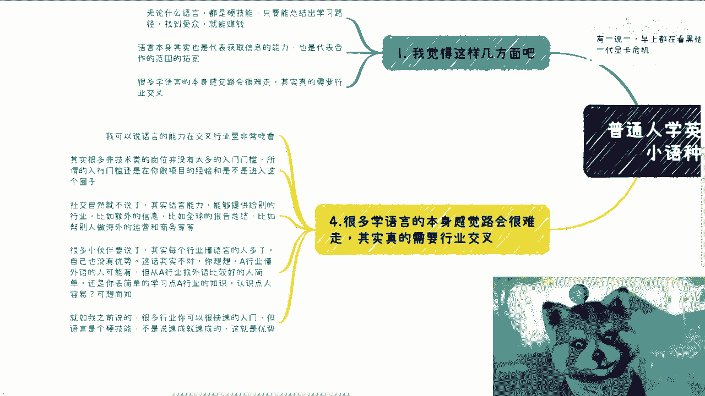
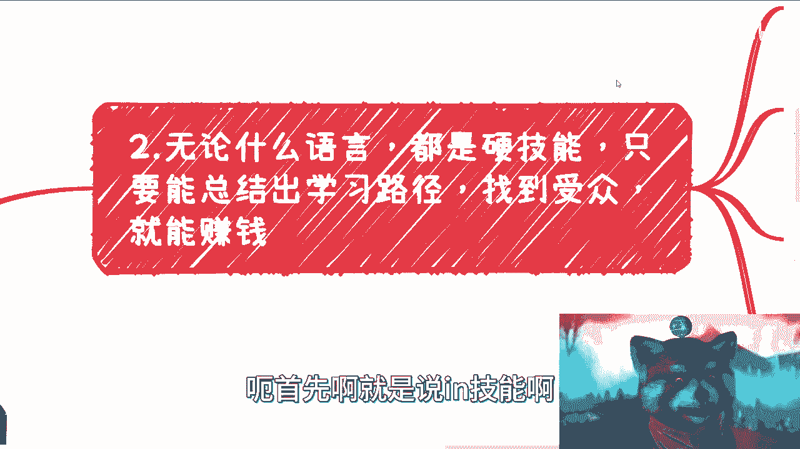
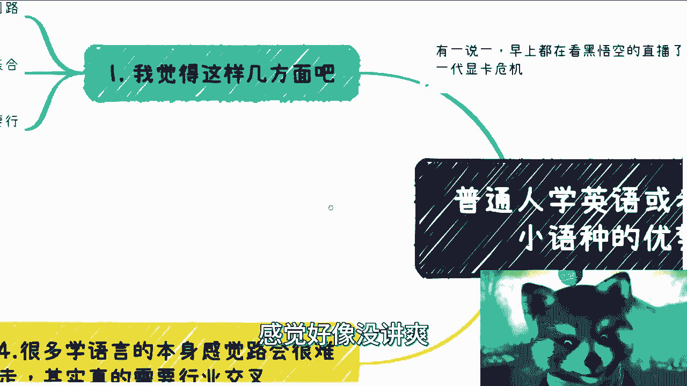

# 普通人学英语或者一些小语种的优势 - P1 - 赏味不足 - BV1rP411s7yr

哈喽大家好啊，今天礼拜礼拜天对吧，礼拜天啊。

呃前两天小伙伴说了一个问题啊，唉也不叫问题吧，就是说这个学英语啊，还有一些小语种对吧，然后这个其实之前咨询呢也有一些，其实是专门就我问下来，比如说大家有什么牌嘛对吧，然后看看怎么打嘛。

但是也有一些呢就说是就是了解下来呢，可能就是说语言上是很OK的，咱不说语言天赋多少啊，就反正语言上好，OK那别的你说拿这个这个技能点拿出来吧，也拿不出来，所以说就是我总体说一下啊。

就这个优势其实在我看来啊，就可能我觉得呃，很多人他学英语或者学习一些小语种，他会觉得这个出路比较少，但你从我角度来讲，我是觉得优势蛮大的。

还有一说一，我觉得优势蛮大的，我本来早上很早就做了啊，现在都他妈拖到中午啊，早上我就在看黑悟空的直播，哎呀我觉得我这个显卡可能拖不动，我回头再买，买一块4090吧。

要不再看看有什么新的，首先啊我觉得是这样子的，这个无论什么语言呢，都是硬技能啊，也就是说你只要能总结出学习的路径，找到受众，或者来说呃书面或者口语，你能有一个比较熟练的点，我跟你讲，你就能赚钱啊。

当然啊这个东西我们后面来讲啊，不是不是说你单纯靠这个技能点，你说我这个技能树就就就单纯点往死里点，点成一个人也没用啊，就说语言本身呢其实是代表你获取信息的能力，也是代表合作的范围的拓宽好。

那么这是第二点，第三点呢，很多学语言的本身感觉路会很难走对吧，因为他会觉得我翻译对吧，或者就是教学，要么就是可能去一些外企对吧，就是做做这种沟通类的，其实也就是虽然啊这些是一个方法。

但其实也不是说只有这些方法啊，当然这个地方我特别要强调要强调的一点，就是我为什么会觉得优势很大，就是因为我觉得语言的优势，在交叉行业上面是特别大的啊。

那么这个我们后面来讲，首先啊就是说硬技能啊。

硬技能这边呢就是说语言这个东西呢，首先啊语言教学，尤其是在中国这个国家，他是肯定都是永远能赚钱的，只不过就是受众受众多少的问题对吧，你说你现在英语阿拉伯语对吧，那肯定受众不一样对吧。

那我觉得这其其中有几个方向，就是一呢就是说你可以搞教学机构培训，教学机构合作，就最最直接的对吧，你可以兼职，你可以全职对吧，你找就是做一个语言方面的老师，当然这个东西现在很卷啊，没毛病啊。

当然啊就在这个地方呢也得提一点，就是不是说一定比如说还有很多人，他说我英语很好对吧，那不是说你一定要去做K12K9对吧，这种比如说少儿啊，或者说是就是就是就是初高中这种教育对吧，你要做如果要商业化。

你一定最好就是要跟证书绑定，你比如说你说我就是帮你考雅思的，帮你考托福的对吧，我考我，我做这种培训，主要这里没问题，你考试方面绑定的就比较好做，这是一方面，而且我身边其实有一些小伙伴是打个人品牌的。

就是他不跟培训机构合作的，我看下来做的也蛮好的，也没蛮好的呀，真的蛮好的，就是他也没有什么大范围的说宣传，他也没有什么投广告，就慢慢慢慢做嘛，靠口碑做嘛，因为哎呀因为是这样子的。

就是我觉得啊就大家做做事情啊，就是啊不要老想着就是说啊，我这个比如说做还没做呢对吧，就觉得啊这个东西可能赚不了什么钱啊，我不做了，没有用的，你知道吗，就大家老百姓老百姓是什么，老百姓就是对吧。

积少成多对吧，那就做积累，你说我指望一次性怎么样怎么样，那你这不叫老百姓，你叫王思聪啊，那另外一方面呢，其实我跟你讲，你也可以自己做，但是呢你需要做出自己的特点，就比如说啊，你说啊。

你有自己摸索出来的一套比较，这个不错的教学方法论对吧，可以帮助大家更快的学习，那也可以呀对吧，你比如说你你到B站上，到别的地方去看中语言教学的啊，他模式老多了，你知道吧，什么什么通过游戏教学的呃。

通过什么动漫教学的，还有老多老多了对吧，那你也可以找到自己的一个方法吗，那帮助大家去更好地考出某些证书，对不对，你也可以做一些真题模拟对吧，我是觉得我我跟你们讲啊，我从这个赚钱角度来讲。

我是非常的呃赞这个支持啊，就是去做这种应试培训的对吧，就是真题模拟对吧，然后你真题模拟，你有你自己的解那个方法论对吧，或者说你有你自己的解题思路，那也很好啊对吧，而且这个东西吧。

我觉得你也就是真的就是真题模拟啊，或者说考研辅导的话，就也没有说一定要做得多花里胡哨，你知道吗，就是你就相当于就是做一个，就是就是只要让对方觉得你是专业的对吧，或者说你的方法论能帮助到他的。

那就OK了呀，甚至都不用去想什么差异化，没什么差异化的，就你的专业度，你总结出来的方法论就是你的差异化对吧，那么所以说呢我是觉得在这方面呢，其实切入点蛮多的啊，反正就是你做出自己的特色就可以了啊。

然后开始吸引流啊，当然一开始呢你可以吸引流量，是靠免费的去吸引的，这没问题啊，啊这里聚集一些比如说学英语的，学阿拉伯语的，学法语的对吧，你这些人都可以的啊，然后你最终去做一些变现。

没毛病啊，这有什么问题了，对不对啊，我跟你们讲啊，切记啊切记啊，不要把任何的这种变现的行为都去想着说，哎我是不是要去割别人韭菜了，你要这么想，我就告诉你啊，这社会上没有什么不割韭菜的，那你怎么说呢。

那你钱别赚了对吧，那我跟你讲，你老板是割韭菜的，那你为什么拿他工资呢，对了这个这个对吧，没必要自己束缚自己啊，那么这是第一点，第二点呢就是说我认为语言本身啊，其实啊代表更多的信息获取信息能力。

也是代表着合作范围的拓宽啊，这个事也很简单，就是你比如说我觉得上面教学的这个事儿呢，它属于保底啊，就是说你可以就是有的没得做对吧，也不是说一定要去把它做成一个什么，多大的业务，对不对。

但是呢获取信息这个能力才是我觉得最重要的，为什么啊，因为当然在这个地方，我说一句，不是让大家去吃什么对吧啊，你说我学会了英，我英语不错对吧，我说法语不错，我英语不错对吧，我出去看八卦对吧。

你别去看那些有的没的啊，这些对你没有用啊，没有用啊，不要到最后什么还还还说你什么什么，什么50万是吧啊，那一门语言可以让我们获取全球各地的信息，比如啊各种报告，比如说各种PPT对吧。

比如说各种最新的一些演讲，你可以获取一手的信息，而且这当中可能还不不会，不至于就说被别人误导对吧，因为中国很多人获取信息，它是一个二手信息，这个二手信息很容易被别人误导，不管是夹带私货还是怎么样。

很多很多，这也是为什么导致现在这么个大大局势的，这么个原因啊，那么这些不仅仅啊就是我们刚刚说的这些啊，不仅仅能够让我们去增加知识面对吧，你也可以直接通过这里信息量去赚钱，那这方法多了去了对吧。

你比如说报告，你单纯报告也可以收钱的呀，对不了，报告包括你你把他一些信息整理好之后，做成这个，就你做搬运工嘛，把他放到国内来嘛对吧，那你就别夹带私私货嘛，你就正正规规做些什么信息收拢，你们去看吧。

现在这种短视频啊，自媒体里面有多少这种人，他其实不没有自己的，就是就是它不是自己产出东西的，它是整合信息的，但是你不能说它没有价值对吧，那那你也可以做啊，有什么不能做的，那至少这个难度不高吧，对吧。

哦我跟你讲这事我早年没少做啊，真的没少做，那同样的啊，无论你做什么业务，你也可以默认啊，我要把我这个小浣熊放大一点，哎呀太大了啊，就是你默认啊，就是说啊，你拓展业务是可以是拓展你的业务范围的。

你比如说你说我要请嘉宾对吧，那你有语言的这个支撑，那你就可以去邀请海外的，你像我当年做第一场大活动的时候，我就直接从澳大利亚找的人啊，找到嘉宾过来，而且是直接飞过来的对吧，那你比如说你沟通。

你也可以直接跟外面的专家，或者生活在那边的人，或者说跟你可能呃做同样行业的人去了解情况，你比如说你做进出口贸易，你也可以直接邮件的去找到对应的客户，或者说可能的这种candidate对吧。

你去沟通都可以呀对吧，当然这里我得提一嘴，就是说有的小伙伴呢他就是语言能力啊，他可能是书面能力强，有的呢可能是书面能力不强，口语强对吧，哎我跟你讲这个都可以，无所谓的啊，你只要在就是你强的那方面。

去发挥你自己的长处就可以了，那么我觉得这个是第三第二点，那么第三点是我觉得最最最最重要的，就是说语言本身，你要觉得路很难走，这也正常，因为我以前就说过，就是你在同行里面卷，你的确很难卷。

就像最近咨询我还有一些律师对吧，律师说我的这行业也也也也很难对吧，我说是很难啊，但是你从我角度来讲，我看到的人里面啊，一旦有交叉行业，卧槽如虎添翼，你知道吗，就是说的直白点就是什么。

就是你今天在你行业60分，你招招行业，马上90分，为什么，因为没人懂啊，因为你稀缺啊，对不啦，那么就这样子吗啊那我可以说啊，语言能力在交叉行业里面其实是非常吃香的啊，非常吃香，为什么呃，你要这么想。

首先很多行业的非技术类岗位，我不说全职兼职啊，无所谓啊，包括你到这个行业当中去赚点快钱，或者或者来说做商业模式无所谓啊，就是说很多的非技术类岗位，它其实是没有太多入门门槛的对吧，所谓入门门槛。

就是说你可能做过项目的一些多少啊，做过项目经验啊对吧，或者说你是不是借助这个圈子啊，对不对好，那你想啊，你能不能进入这个圈子，取决于你社交，那我觉得社交这个东西你只要愿意讲对吧。

你只要这个这个不要不要不要什么躲着别人，那你这里有什么关系，你只要是个普通人就无所谓，就这都能积累的呀，对不对，但是语言其实语言能力你想啊，你不但能就是你自己的语言能力，你其实是为什么做说交叉行业。

你其实是赋能给别的行业，也就是说你能够通过你的能力把一些额外呃，呃把一个把一些属于这个行业的额外信息，比如说全球的报告总结啊，比如说你可以帮别人做海外运营啊，比如说你可以帮别人做海外商务啊，对不对。

那这些都是你可以做的呀，对不对啊，包括我跟你说，律师去跨行之后，他做什么，他无非就是帮这些就别的行业的人，比如说做一些这个行业的这种咨询顾问对吧，或者说做一些什么啊，法律合同这个法律制定法律合同啊。

对制度制定这个企业去企业的法律合同对吧，然后比如说做一些review对吧，就做一些这个呃审计对吧，他都可以做的啊，但是你说为什么他能做，就是因为在别的行业里面这种人少啊，你不能说没有，但是少啊对吧。

他总比你在律师行业，在你呃学习语言这行业来的多吧对吧，就说那那我跟你讲啊，很多很很多小伙伴啊，说到这啊，他要说了，他说啊这个每个行业对吧，懂英语的，懂这种小语种的人也多了去，唉是啊没错。

但是你要看一个比例啊，什么意思啊，就是说你想想看啊，任何一个非语言链的行业对吧，他懂外语的人有没有有，但是他肯定一他没有你专业，就他没有专业的人专业，对不对，这是第一点，第二点是你从这个行业。

你从就是别的行业对吧，找外语比较好的人简单，还是说你作为一个专业的语言的人，去学他们行业的知识，和学习一些简单的运营的知识或者销售的知识，来得简单，你自己想想看，对不对对吧，因为因为我下面也写了。

就是说就如我之前说的，就很多行业你其实是可以快速入门的，你不用说一定要去懂什么技术或者懂什么内核，不是的对吧，这就好像我随便给你举个例子，比如说你今天要去医疗对吧，没问题的呀，你要懂什么。

你要懂的是你要去，比如说啊你要帮别人做进出口贸易对吧，做医疗器械的出口对吧，或者说做这个，做这个某些产品的这个销售或运营，对不对，那你香港你要懂什么，你是要去懂医疗吗，不是你是要去懂医疗器械吗。

也不是你是要去懂这个行业的，很就是就是内幕或者很多东西吧，也不是啊，你要懂的是什么，你要懂得，只不过是你合作的这家企业，你把它的产品，它的服务对吧，了解好对吧，烂熟于心对吧。

然后能够能够把他的东西融会贯通讲出来，这不就是你要学的嘛，但是你自己想想看，是你学这东西容易，还是别人那个行业哦，啊这个找不到合适的人对吧，然后大家也想拓展这个这个这个叫什么，就是海外业务对吧。

然后他也苦于就说哦，你找英语好的人一大堆啊，但是找英语好的又懂这个行业的人少啊，那你自己可以毛遂自荐嘛对吧，你想想看是你去学这个东西容易呢，还是说是他们那边找一个人去把英语学好，容易呢，就可想而知啊。

你说对不对，因为语言这个东西它没办法，它是个硬技能哦，语言这个东西它没有办法说啊，我今天我今天这个什么就去速成对吧，或者去怎么样做不了的，你怎么速成，对不对，马上就露馅了对吧。

所以说我觉得这个东西真的在交叉行业里面，是很有优势的啊，它不是一点点有优势，是非常有优势啊。

诶哦我讲完了啊，感觉还有好像没讲爽啊。

对反正就是这么个意思啊，所以说呢我觉得呢就是说呃，尤其是当下这种这种环境里面啊，就像我刚刚说的，就是说呃无论做什么，你比如说你是学语言的或学习别的东西的，我觉得不管怎么样，我们都要去行业交叉去扩展。

你知道吧，而且一旦扩展之后其实是一样的嘛，就是就算我要卷对吧，就算我要做商业，我也得想尽办法把面扩宽了，扩宽了对吧，你说我我默认就是这么个很狭窄的面，那你做啥呀，没法做对吧。

你知道很多人学那个英语跑出来跟我说，我只能做翻译啊，卧槽那他妈的直BT都有了对吧，翻译说都不要我，那我怎么办，哎呀能做的多了对吧，语言是死的，你是活的对吧，就你能就是这个语言优势到底能发挥多大。

取决于你不取决于语言本身啊啊好吧行吧，那这里我就简单说一下好吧，就当包车抛砖引玉了啊，然后那个一样的好吧，大家有什么就是想要了解更多商业东西的啊，想要这个知道自己手上牌怎么打的。

或者说未来就是整个的这个职业发展方向，怎么做啊，不清楚的，那你们可以剪这个详细的啊，就是说总结好自己的问题，简单的啊，可以这个总结一下自己的这个背景好吧，然后这里我们走这个咨询。

