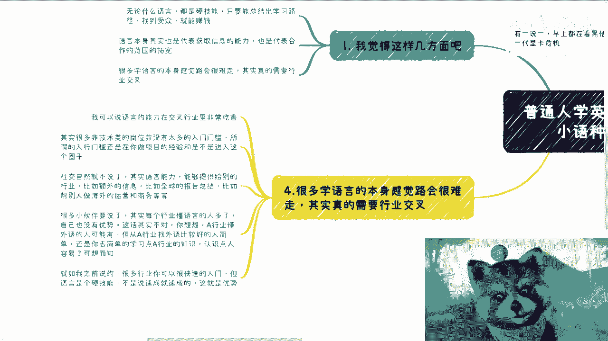
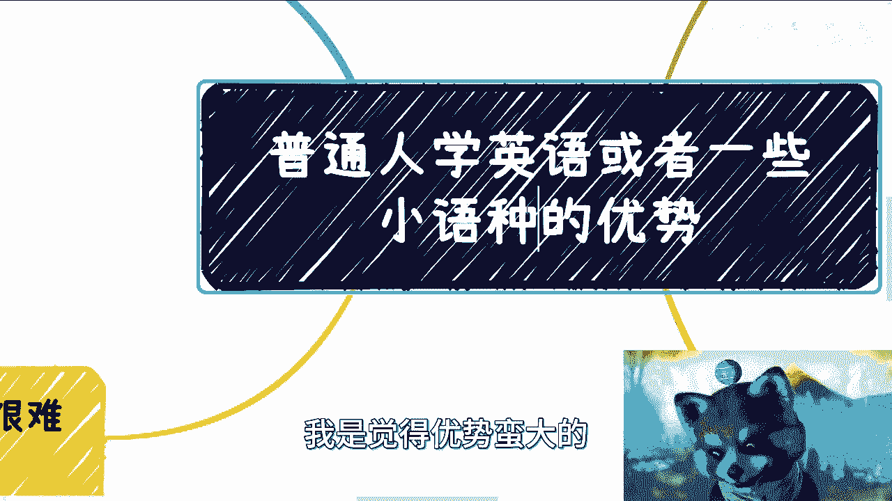
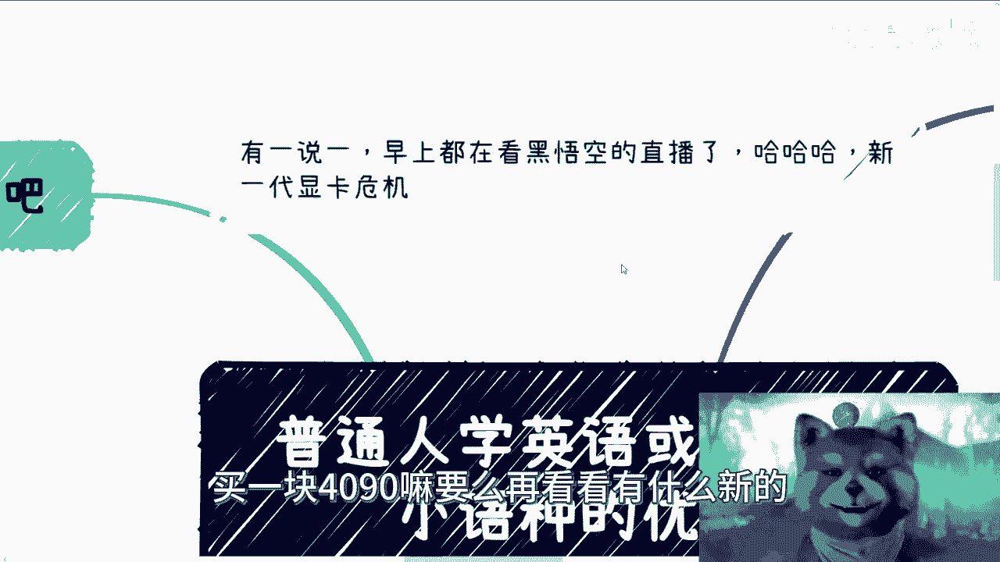
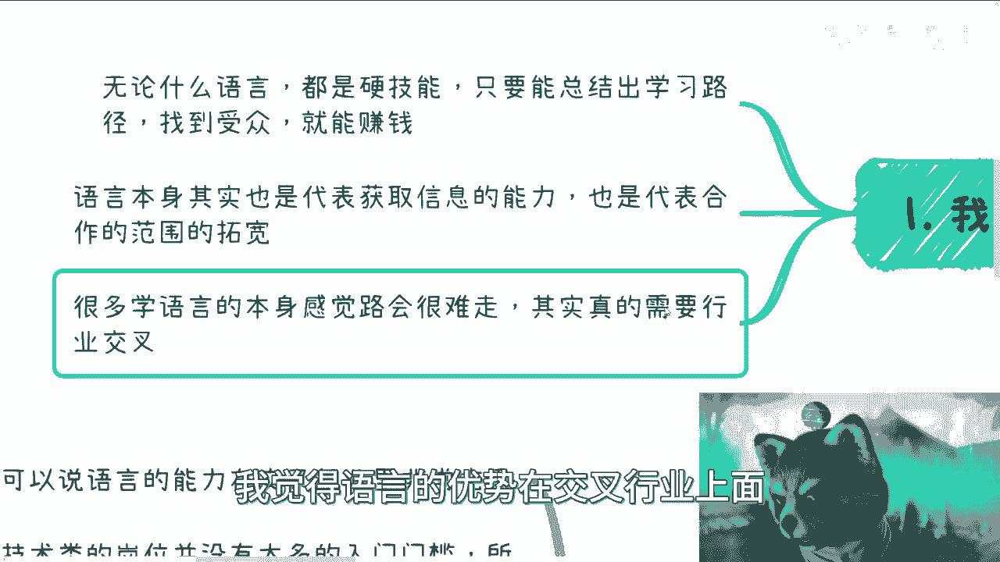
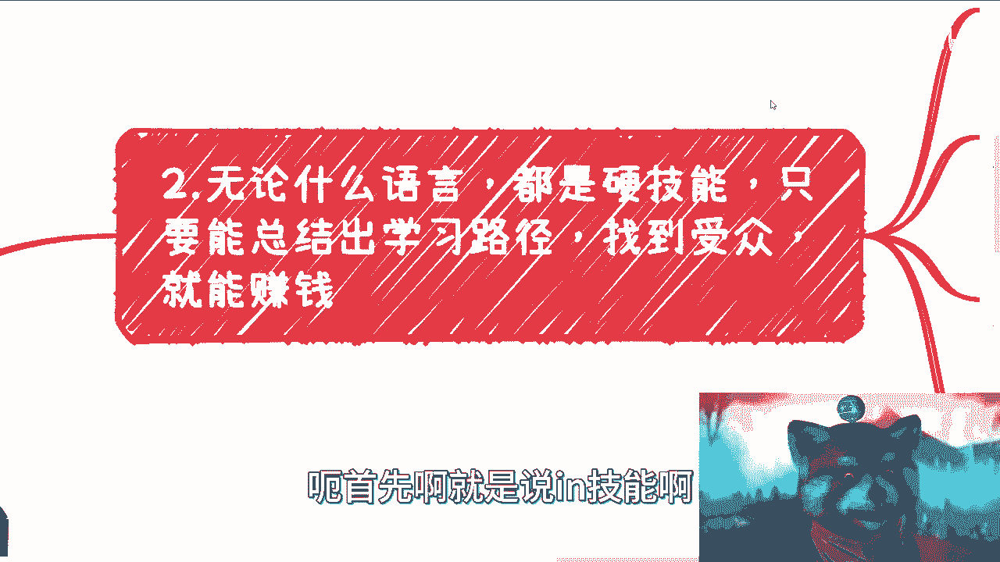
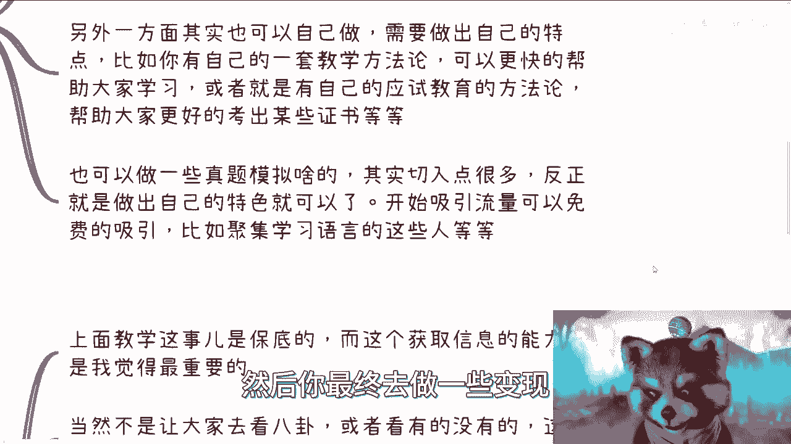
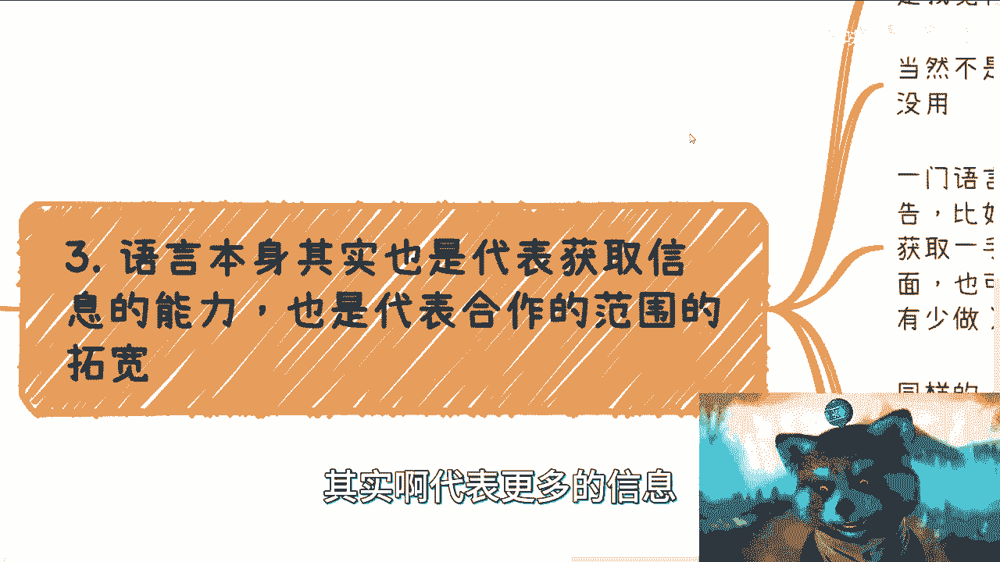
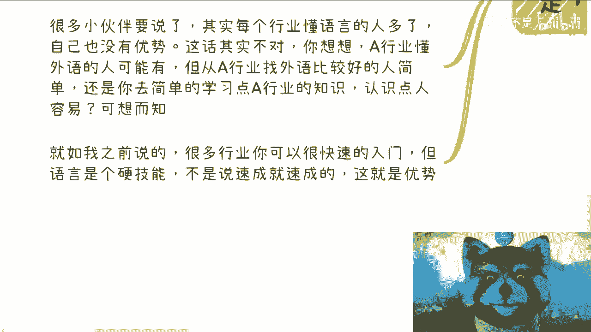
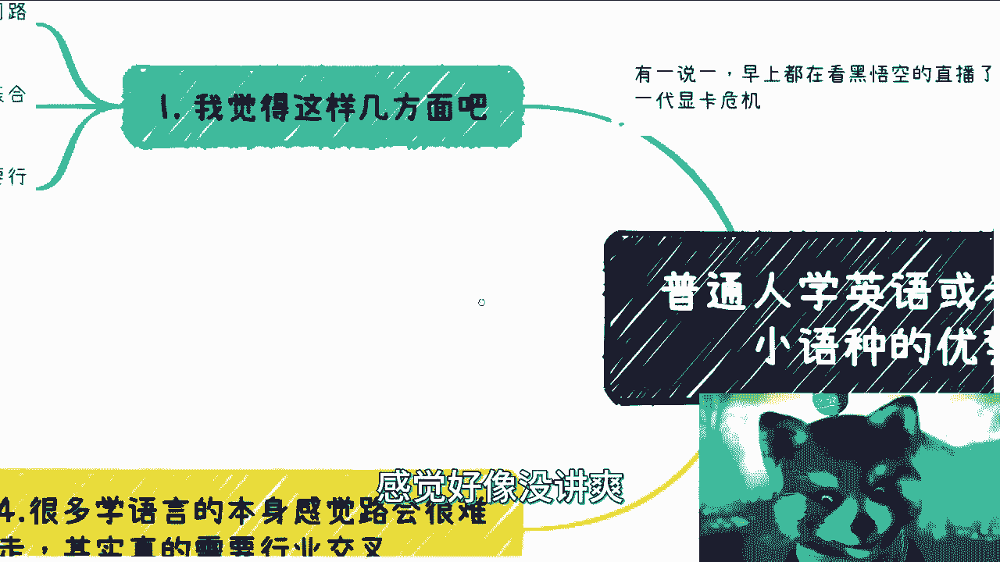
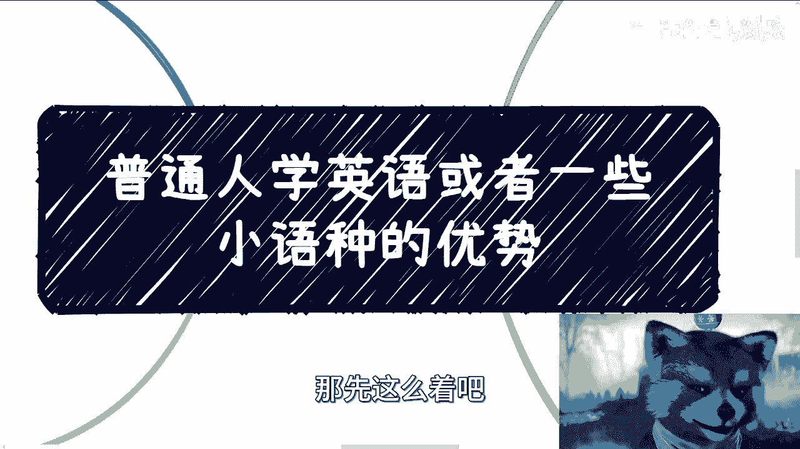

# 课程 P1：语言学习的核心优势与变现路径 🗣️💡

在本节课中，我们将探讨掌握英语或小语种的核心优势，并分析如何将这些语言技能转化为实际价值。我们将从硬技能、信息获取与跨界应用三个层面展开，为初学者提供清晰、可行的思路。

---

## 一、 语言是明确的硬技能 💪

无论学习何种语言，它都是一项明确的硬技能。这意味着，只要你能够总结出有效的学习路径，找到目标受众，并在书面或口语任一领域达到熟练水平，你就能创造价值。

以下是基于语言硬技能的几个主要发展方向：

*   **教学与培训**：这是最直接的变现方式。你可以与教学机构合作，担任兼职或全职语言教师。虽然市场竞争激烈，但需求始终存在。
*   **应试辅导**：将教学与权威证书（如雅思、托福）绑定，专注于考试培训，是一条商业化路径清晰的赛道。你的专业方法论就是核心竞争力。
*   **打造个人品牌**：不依赖机构，通过B站等平台，凭借独特的教学方法（如通过游戏、动漫教学）吸引流量，积累口碑，最终实现知识付费。

**核心要点**：`变现价值 = 专业能力 × 有效触达`。起步阶段可通过免费内容吸引目标用户，关键在于形成自己的教学特色或解题方法论。

---

上一节我们介绍了将语言作为硬技能进行直接变现的途径。接下来，我们看看语言能力带来的更深层次优势。

## 二、 语言是信息与合作的桥梁 🌉

语言能力不仅是一项技能，更代表了**信息获取能力的提升**和**合作范围的拓宽**。这比单纯的教学拥有更大的潜力。

以下是利用这一优势的具体方法：

*   **获取一手信息**：掌握一门语言，意味着你能直接阅读全球的行业报告、学术论文、最新演讲，避免接收被转述、可能失真的二手信息。
*   **信息整合与搬运**：你可以将海外有价值的信息进行翻译、梳理和整合，发布在国内的社交媒体或知识平台。这种信息搬运工作本身具有市场价值。
*   **拓展业务范围**：在业务合作中，语言能力允许你直接邀请海外嘉宾、与国外专家沟通、开发海外客户或供应商，极大地拓宽了业务边界。

**核心要点**：`信息优势 = 直接获取 × 准确理解`。无论是书面能力强还是口语能力强，都可以在你擅长的领域发挥这一优势，将信息差转化为机会。

---

了解了语言在信息层面的优势后，我们将进入最关键的部分：如何将语言能力与其它领域结合，实现价值最大化。

## 三、 跨界融合创造稀缺性 🚀

如果你觉得纯语言赛道内卷严重，路径狭窄，那么**跨界（交叉行业）** 将是你的破局关键。在跨界领域，语言能力能让你如虎添翼。

为什么跨界优势巨大？我们可以通过一个简单的比较来理解：

`你的竞争力 = 语言专业度 + 行业基础知识`

对于非语言行业的从业者，他们的公式可能是：
`他们的竞争力 = 行业专业度 + 基础外语能力`

在目标行业中，同时具备**深厚行业知识**和**专业外语能力**的人非常稀缺。对你而言，学习一个行业的基础运营、销售知识，远比让一个行业专家从头学好一门外语要容易得多。

以下是跨界应用的思路：

*   **成为行业赋能者**：你可以为某个特定行业（如医疗设备、跨境电商）提供海外市场运营、商务洽谈、海外信息调研与分析等服务。
*   **扮演顾问角色**：就像律师为不同行业提供法律顾问服务一样，你可以作为“语言信息顾问”，帮助企业处理涉外的内容、市场或商务工作。
*   **选择快速入门型行业**：优先选择那些对技术内核要求不高、更侧重运营、销售或资源整合的行业进行跨界，降低学习成本。

**核心要点**：`跨界价值 = 语言稀缺性 × 行业适配度`。你的目标不是成为目标行业的技术专家，而是成为该行业中**最懂外语**的运营者，或外语领域里**最懂该行业**的专家。

---

## 总结 📝

本节课我们一起学习了语言技能的三层价值：
1.  **硬技能变现**：通过教学、培训、个人品牌直接实现价值。
2.  **信息杠杆**：利用语言获取并整合全球信息，拓宽合作渠道。
3.  **跨界优势**：将语言能力与另一个行业结合，创造稀缺性，实现价值倍增。

语言是工具，你是运用工具的人。其价值上限不取决于语言本身，而取决于你如何将它与其他领域连接。在当下环境中，积极寻求跨界与拓展，是突破职业瓶颈、发现新机会的有效策略。