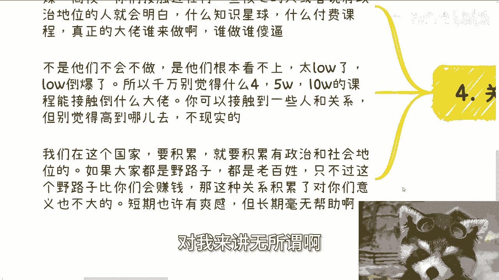

# 普通人寻求关系的路径 - P1 - 赏味不足 - BV1fT42127qV

哈喽大家好，本周六在那个济南啊。

这个研究院的活动，大家有兴趣的话可以私信我啊。

嗯然后今天我们讲的这个主题呢，叫做普通人寻求关系的这个可行路径。

首先啊我觉得这是最有用的方式，而且没有之一是什么呢。

就目前我看下来这么多方式，我个人觉得唯一有这种方式就是咨询，当然你们别着急，很多人其实对咨询并不了解，我待会给你们详细说一下，可能跟你们想的东西不是不是一个东西啊，那么一般来讲呢需要两件事情。

一个呢就是你需要提供咨询的服务，要给到外界啊，当然你这个服务呢是不是你提供并无所谓，就很多小伙伴觉得自己做不了啊，自己做不了，那没关系啊，找人做呗，对不对，就好像你包一个自身服务啊。

里面有什么加BA加BB加BC，那人家只认你这个平台啊，人家也不认这个嘉宾ABC啊对吧，而且就算跳单了也无所谓啊，也不可能每个人都跳单嘛，对不对，那另外一个就是说你需要一些合作方啊。

原本就是在给不同的领域做咨询的，那些合作伙伴，那说白了就是那些渠道方能够给你线搭桥的呃，不要想着什么都自己去拓展，这个事情不太可能啊，当然啊相对老百姓来讲，我觉得就相对老百姓来讲是这样子。

就如果你是有关系，有资源的，那么大，可以直接请客吃饭，或者别的方式也都行，但是从普通老百姓来讲呢，我目前看下来，除了这个方式，别的方式呢有没有有他，但他都太绕，太曲线救国，而且风险性很高。

那么当然啊，很多人其实对咨询不是很了解，我稍微详细说一下啊，很多人会觉得就进入一个咨询公司，或者说一种这个过家家的这种，比如说别人问什么，你回答什么的这种模式，我跟你们说啊，这种都是不行的。

有前者的话呢，你是打工，你就算能做解决方案，积累下来的资源，也不是你的，是你们公司的，或者说可能被你的leader啊，BMENTAL啊，就是那些你的这个领导啊就抢掉了啊，那后者更不行了，后者什么这种。

比如说啊问答模式的他妈更过家家难，人家人家但凡有点就是说啊，这个商业行为的这种企业就是不会找你的啊，记住这里说的咨询呢一定是to大B啊，就是to大起大这种这种企业端啊，高校端啊，那个政府端啊。

或者说某些官方组织，所以呢你一定是需要有完整的解决方案，你需要背书，你需要案例，这些都是需要的啊，你其实本质上有没有自己公司这个啊，这个倒反而关系不大啊，如果你想做难你，你无非因为你如果是个普通人。

你想做你无非只能从小的开始做，比如说小活动啊，小公司啊，小的组织啊，小的一些，比如说峰会啊啊小的一些，比如说甚至是公益的这种联盟啊，对吧啊，然后呢你一开始做也是免费的做啊，你必须通过这么一个方式。

通过各种线上线下的这种曝光，来提高自己的知名度，提高这种知名度的目的，也无非就是为了让别人能够更多地来找到你，就比如说今天你讲了一些东西，别人说哎我也想请你过来给我们讲讲对吧，可能钱不多对吧，怎么样。

没关系啊，你都去，这个是你必经之路啊，那么很多人抱着想法就是呢，就是我是个普通人啊，大公司政府高校怎么会请我呢，对吧是啊，我跟你讲，这他妈是废话，为什么，因为你现在是不会请你啊，你必须要通过积累。

一步一步去混你的名头或你的背书，才有可能啊对吧，你不愿意去付出，不愿意去积累，你一直抱怨，那当然不可能了，没有概率的呀，对吧就像我以前跟你们说的，你们要是觉得对吧，普通人做不了的。

那难道到目前为止所有的这种企业，政府，高校里面做的人都是所谓的那些有政治地位，社会地位的吗，不是呀，我早就跟你说了很多次了，有政治地位，社会地位的人家不屑于去做这种东西对吧，然后第三就这条路呢。

是我看认为所有路里面最合适的，为什么我甚至可以说没有之一，因为不管别人直接找你，还是通过中介的关系来找你，你本身都是以一个专家的身份去的，或者说你都是以一个啊这种专家，智库的平台去对接的。

那么自然对方领导啊或者老板啊，从他们的角度来讲，他们会认为大家地位，至少我们就说啊，在你做咨询的这个时间周期里面，你们至少是平起平坐的，而且你去做咨询的时候啊，你能够灵活的和组织里面的人或者领导。

直接对话，你也可以加微信，你可以积累下来的关系是你自己的，当然怎么利用，这个是后话啊，那么当然这种方式呢适合广撒网的那种关系，积累，并不适合那种有目的性的，也就是说比如说你今天是有目的性的。

这个某一个司啊里面的这个领导，或者找一个教育局的局长，那没有办法，那你不可能说我今天这么精准的，有咨询的话，能够去对接到他们，但是广撒网的关系呢，你可能不一定直接能找到你想要的，但是你只要撒的足够多。

你的case做的足够多，你大概率可以间接找到你想要的对吧，你要找教育局，你可以，你可以找你原本已经积累下来的那些关系，然后你去看看有没有间接的这种介绍的方式，对吧，那总比你直接在那边说啊。

我打不进去对吧，我就是找不到关系对吧，那否则很多人觉得搞关系呢，其实要通过打工，通过做销售，做商务，我跟你讲啊，这事放以前那是有可能的，而且也是可行的，主要是什么呢，主要是你现在看看整个的大环境。

这种概率就不大了，因为你现在无论做什么核心的业务，你其实都接触不到核心的人，你也接触不到，而且大概率也没有机会直接去积累客户关系，这就是现在最蛋疼的地方，不是说你们不能做，你做了你积累不到啊。

啊然后第四点就是关于所谓的大佬啊，我就这么讲啊，你们但凡接触过政府企业，党媒，央媒高校，你们接触过任何一个核心的人，或者说有政治地位的人，你们就会明白什么知识星球，什么付费课程。

真正的那些有关系的大佬谁来做啊，就你们嘴里面那些大佬是他妈的，什么玩意儿都是对吧，我跟你讲，那些人谁做谁，为什么不是他们不会做，是他们根本看不上，太low了，low到爆了啊。

你所以你千万别觉得那种什么4万5，万十万的课程能接触到什么大佬，哎你我这么说吧，你可以接触到一些人和关系，不现实的，你懂吗，就是我们在这个国家，你要积累，你就去所谓真正积累，你就去积累有政治地位。

社会地位的人，如果大家都是野路子，你是老百姓，我是老百姓，只不过就是说这个野路子比你们会赚钱，那这种关系积累对你们来讲没有意义的，你懂吗啊，也就是说短期你也许有爽爽感，但是长期是毫无帮助的。

就是本质上是什么意思，本质上就是说任何一个商业行为，只要你们不是在这个国家啊，你们但凡不涉及到政治地位和社会地位，这个生意不可能长久的对吧，你就好像到现在可能很多人不知道我做什么，我我跟你们说的很清楚。

我八九十%的业务是做高效的培训，做高校的课程，做政府的咨询和企业的咨询对吧，你说B站也好，别的C端的业务也好，对我来讲无所谓啊。

能有最好没有拉倒啊对吧，那反过来说啊，如果我这么多年没有没有是没有这种。

比如说企业端，政府端，高校端，联盟端对吧，包括什么产业链端，生态园端的那个业务合作，我懂个屁啊。

啊奇怪了，我懂个屁啊，我不会跟你们讲这些东西的，我跟你们讲的就是说哎你看啊，我以前比如说隔C端对吧，做C端的流量啊，我做流量做到1000万对吧，怎么样怎么样怎么样，听懂鼓掌，你们能听到我讲这么多东西吗。

不能的呀，没有用的，你明白吗，就是说你去积累那些如果他只做过老百姓生意，或者只割过老百姓连韭菜的这种生意的人，对你们来讲毫无帮助，就是我不是说你从他身上赚不到钱，你可以赚到，你也可以。

就是比如说啊从他的模式当中赚到钱，但这种东西可不可持续发展啊，随着你年龄增长，随着你们的就是说需求的增长，那些东西不可能给你带来持续性的收益，而且也没有护城河，没有门槛有什么用呢，对吧。

就就真的我跟你们讲，你们要但凡自己做做赚钱，自己做业务，你们得想明白，就说哪些钱是短平快要去赚的，哪些东西是长需要去积累的，不要自己去，就是说骗自己对吧，就比如说就比如说有些人跟我说，哎我积累流量对吧。

我我未来可长期发展的，那我就问你积累多少流量，流量稳不稳定，一问三不知对吧，你怎么长期发展啊，然后包括就是说说啊，我我我我做一些业务对吧，这些业务有合作方的，合作方是谁呢，合同有吗对吧，签了几年呢对吧。

你你你要这么想，你在一个这个主权化国家，你在这么一个这个主权化的这个政府下面，你该做的事情，你该符合规则的事情，你要去做，你老是做那些过家家的事情，然后还要PUA自己说啊，这个东西能长期发展。

我去你说呢。

啊行，然后那个呃OK好吧。

然后就是那个活动好吧，报名的继续报名，然后职业规划，商业规划好吧，然后什么合同啊，融资啊，股权啊，包括你们手上有什么牌，你们觉得想通过我的这个视角啊，或者通过我的整个的一个观察。

给你们提供更好的一些规划方案的好吧。

