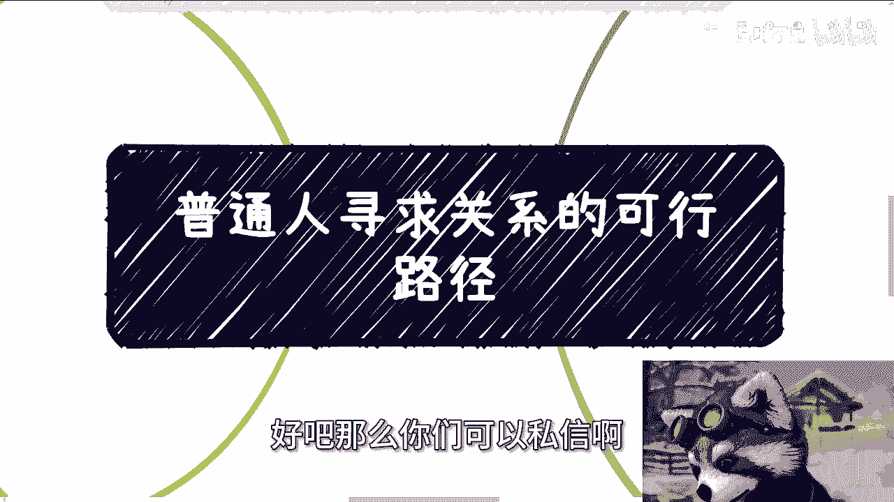

# 课程一：普通人寻求关系的可行路径 🧭

在本节课中，我们将探讨普通人如何通过一种核心方式，系统性地建立有价值的社会关系网络。我们将重点分析“咨询”这一路径的运作逻辑、实施步骤及其优势。

## 概述：为何选择咨询路径？

上一节我们介绍了课程主题。本节中，我们来看看为何“提供咨询服务”被视作普通人积累关系的核心路径。综合来看，这是目前最有效且风险相对较低的方式。

## 核心路径：提供咨询服务

咨询路径的核心在于两件事：**提供有价值的服务**与**建立合作渠道**。

以下是具体实施的两个关键点：

1.  **提供咨询服务**：你需要向外界提供咨询服务。服务不一定由你亲自提供，可以整合资源，形成一个平台或品牌。客户认可的是你的平台，而非具体的服务提供者。即使存在个别客户“跳单”的风险，但整体模式依然可行。
2.  **寻找合作方**：你需要与已经在不同领域提供咨询服务的伙伴或渠道方合作。他们可以为你牵线搭桥。对于普通人而言，试图完全靠自己开拓所有渠道是不现实的。

对于有现成资源和关系的人，请客吃饭等方式可能直接有效。但对普通老百姓而言，其他方式往往过于迂回、效率低下且风险较高。

## 深入理解“咨询”的内涵

上一节我们明确了咨询路径的两个支柱。本节中我们来看看“咨询”的具体定义，它与常见的误解有何不同。

很多人对“咨询”的理解存在偏差，以下两种模式均不可行：

*   **进入咨询公司打工**：在此模式下，你积累的资源和解决方案属于公司，可能被上级占用，无法转化为个人资产。
*   **过家家的问答模式**：这种随意的、非正式的问答模式，无法吸引有严肃商业需求的组织。

这里所指的咨询，必须是面向**大客户**的，包括大型企业、高校、政府机构或官方组织。你需要具备**完整的解决方案、行业背书和成功案例**。是否拥有自己的公司并非最关键，普通人可以从服务小公司、小活动或公益组织开始，甚至免费提供服务以积累初始案例。

你必须通过线上线下的持续曝光来提升知名度，目的是让更多潜在客户主动找到你。这是一个需要耐心积累的过程。抱怨“大客户不会请我”毫无意义，所有现有的服务提供者都是从零开始积累的。

## 咨询路径的独特优势

上一节我们澄清了咨询的内涵。本节中我们来看看这条路径相比其他方式（如打工、做销售）有何不可替代的优势。

这条路被认为最合适，原因如下：

*   **建立平等地位**：无论客户是直接找来还是通过中介，你都是以“专家”或“智库平台”的身份出现。在服务周期内，你与对方的领导或负责人至少是平起平坐的关系。
*   **直接积累人脉**：在提供咨询的过程中，你可以直接与组织内的关键人员对话、添加联系方式。所积累的关系属于你个人。
*   **适合“广撒网”**：这种方式擅长积累广泛的、非特定目标的关系网络。虽然不能精准定位到某个特定领导，但通过积累足够多的案例和关系，你极有可能通过间接介绍接触到最终目标。这远比毫无门路有效。

在当前环境下，通过打工、做销售或商务来积累核心人脉的概率已大大降低，因为这些岗位往往接触不到核心决策者与客户关系。

## 关于“大佬”与关系质量的思考

上一节我们分析了咨询路径的优势。本节中我们来看看应该追求何种质量的关系，以及如何辨别真正有价值的连接。

你需要重新审视所谓“大佬”的含义：

*   **真正有政治或社会地位的人**，通常不屑于通过知识星球、高价付费课程等方式公开变现。这些方式在他们看来层次较低。
*   因此，不要幻想通过支付数万学费就能接触到真正的大佬。你能接触到的，更多是同样在摸索的“野路子”同行。
*   积累同为老百姓的“野路子”关系，短期或许有收获感，但长期看缺乏帮助和可持续性。因为任何不涉及**政治地位**或**社会地位**背书的商业行为，在这个国家都难以长久和建立护城河。

以我个人为例，80%-90%的业务是高校培训、政府与企业咨询。B站等面向个人的业务只是补充。正是多年来与**企业端、政府端、高校端、产业链端**的深度合作，才构成了我认知和能力的基石。如果只做过面向普通消费者的生意，其经验和模式对你长期的、高质量的发展帮助有限。

在做业务规划时，必须分清哪些是短平快要赚的钱，哪些是需要长期投入去积累的资产。不要自我欺骗，将不稳定的流量或没有长期合同保障的合作幻想成可持续的事业。

## 总结

本节课中我们一起学习了普通人寻求关系的核心路径——**提供面向大客户的咨询服务**。我们明确了这条路径需要**提供价值**和**搭建渠道**，纠正了对“咨询”的常见误解，分析了其**建立平等地位、直接积累人脉**的独特优势，并强调了应追求**有政治或社会地位背书的、高质量的关系网络**，而非短期的、同质化的连接。这是一条需要长期积累、但回报丰厚且可持续的道路。