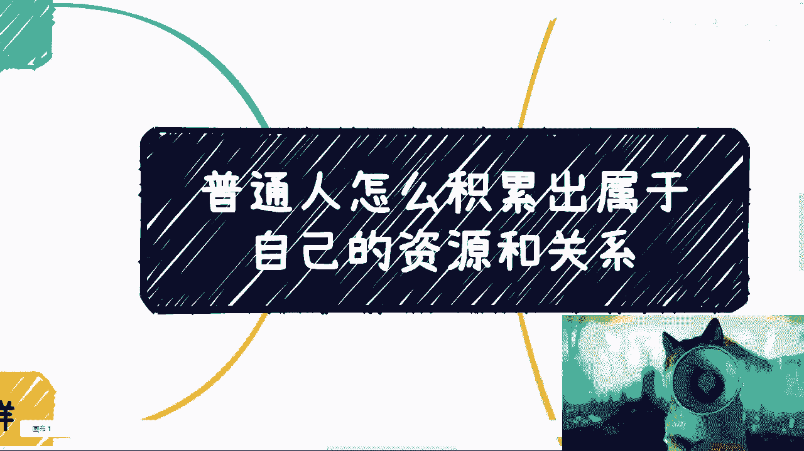
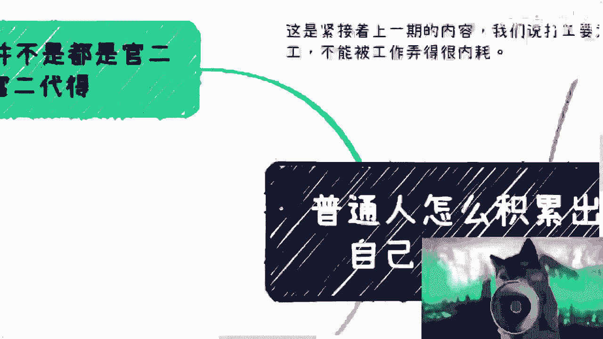
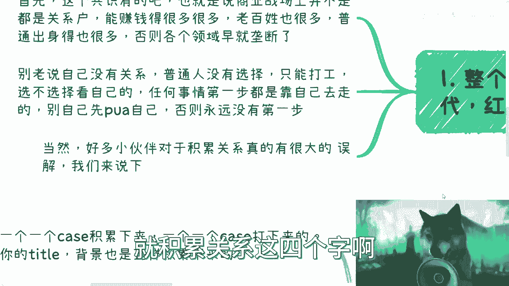
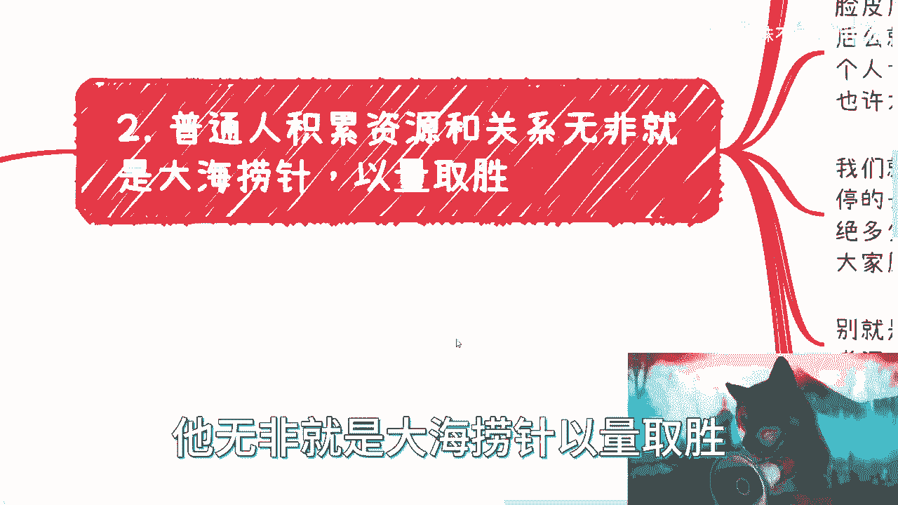
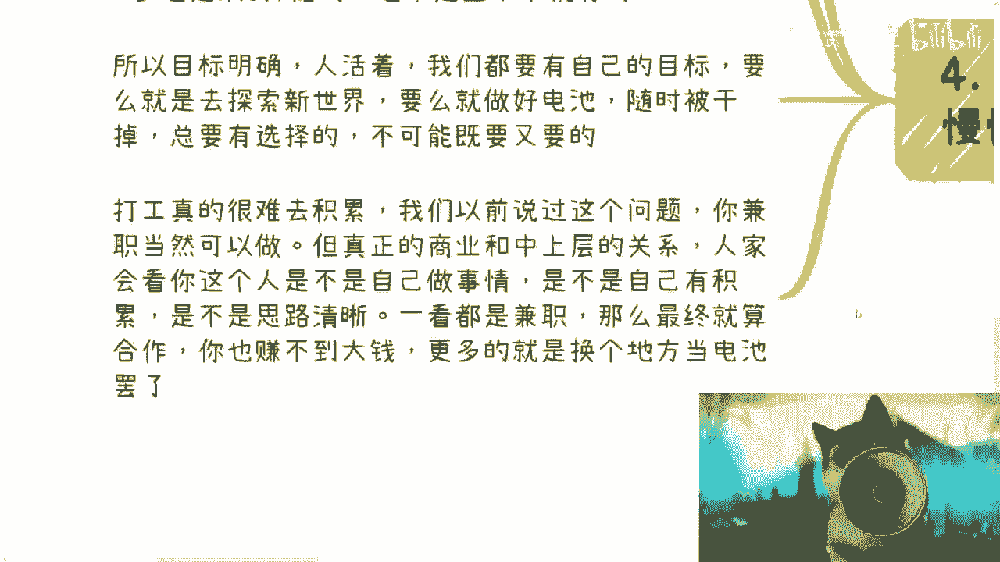
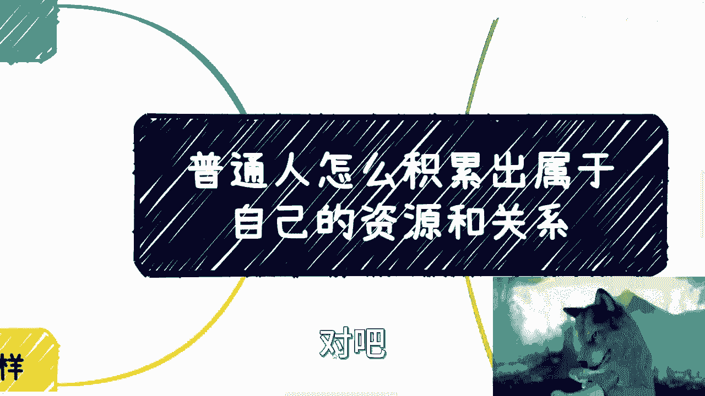
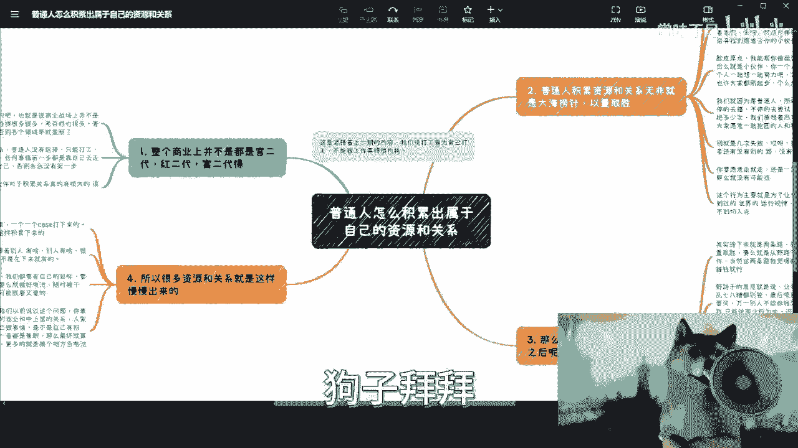

# 普通人怎么积累出属于自己的资源和关系 - P1 - 赏味不足 - BV1384y1d7cy

啊大家好啊，呃紧接着上一期啊，上一期内容呢我们说打工要为自己打是吧，不能被工作弄得很厉害，那弄的就是这个心情很不开心对吧，然后每天也不知道自己在干什么啊，还要被PUA是吧，呃那么在过程当中呢。

包括啊就是这视频都出了半年了对吧，到今天依然很多人在跟我说啊，我是个普通人，我是个老百姓对吧，我这个nothing对吧，nobody对吧，我没有牌对吧，好你说的这些东西呢我都做不了，好我跟你讲啊。

普通人怎么积累出属于自己的资源跟关系好吧，我跟你讲啊，你们可以到网上去看任何的同类型的啊。

这个主题啊，我敢打赌啊，就是他们的这类主题，他们所表达的很多的东西啊，跟我要表达的啊肯定是完全不一样啊，首先第一点。

富二代的啊。

你们要明白，如果来说商业战场到今天为止都是关系户对吧，那我跟你讲早就垄断了，那照这么个说法，我们在商业里面所碰到所有的人，那他妈都是上面有人啊，都他妈啊，老老子是谁对吧，我爸是谁对吧，并没有啊。

呦事实你们但凡真的去切入商业，或者来说很多人比如说做啊，以前做自媒体对吧，或者说这个跟政府啊，企业啊这种这种这种跨境贸易啊，对吧等等等合作的，只要进入商业合作的人多了对吧，都很杂啊，老百姓也有对吧。

然后那种稍微有点关系也有很有关系也有对吧，亲属关系也有是吧，都有的呀，那不是说啊我们这个天生对吧，你说我投胎天这个生出来啊，我没有关系好，那我不行，那我这辈子注定是积累不出关系的。

你不能这样PUA自己的对吧，你不能老说自己没有关系啊，普通人没有选择，只能打工对吧，选不选择取决于你自己是吧，那任何事情第一步，你都是要靠你自己走出去的对吧，你就像刚刚那个咨询的那个小姐姐对吧。

就跟我说，她说我做视频，更多的是在这个后面打你们屁股对吧，对我打没有用啊，那打打了你们不动了对吧，你自己别先自己PUA对吧，你否则的话你永远没第一步，永远没第一步，你只能永远在网络上跟大家说啊。

我们是个普通人，我们手上没有牌，我们怎么样子没有用的呀，对不了啊，那当然啊，很多小伙伴呢对于积累关系这件事情，就积累关系这四个字啊。

他也有很大误解啊，我觉得我要跟你们详细再说一下啊，就是说首先第一点啊没有很好的方法，所谓的我认为啊唯一的方法是什么，就是普通人积累资源跟关系，他无非就是大海捞针。

以量取胜，什么意思呢，就是说因为大部分人手上他没有拍，那怎么办呢，那你不能只你你你只能不停的去认识人，找人找有牌的啊，呃当然有可能，比如说由于大家原本的这个，这个所在的层级比较低对吧。

那你找到的牌可能比较弱，但无所谓呀，你只能去找啊，你有别的路吗，没有呀，对吧啊，你说你要去找的是什么，就是愿意跟你合作的人或者机构啊，那么当然啊，千万不要去想着说啊，我今天去加大公司啊。

我今天有一个背书对吧，我能够更好的去找，没有区别的，没有区别的，我们一定要明白你的价值是你的价值，你所在公司是你公司的价值，你狐假虎威之后积累下来的东西也是你公司的，不是你的，他跟你没有关系。

你但凡想跟你有关系对吧，可以的，那么你还是要找到你的价值，才能说服对方了对吧，你说好要跑出去哎，老子是百度的，老子是字节的对吧好，然后你跟对方开始说说说吹泡泡，吹半天，划比划半天。

你要让对方跟你积累出来一个关系，或者让对方跟你产生联系，那你还是得要告诉对方，你能干嘛，对不对啊，如果你告诉对方是啊，我能够这个用自己的资源对吧，或者来说我我在里面做什么事情。

你能不能跟自己产生后面的后续合作，或者怎么样子，那也是对方跟自己产生合作，那他妈跟你有什么关系呢，对吧，也就是说无论你是不是狐假虎威，你最终还是要去走这一步啊，没有区别的啊，那么好多人跟我说啊。

吕老师啊，我去活动了啊，我也去认识了啊，我也去做了啊，但不行啊对吧，没有效果啊，都被拒绝了，对吧啦，巴拉巴拉啊，那我跟你讲，你不能着急的呀，哦你说你你又要说我是普通人，我是nobody啊，又要说啊。

我要去赚钱，我要去商业里面去滚跌跌打滚爬对吧，我要去赚更高性价比的钱，那你又不愿意花出时间，那怎么弄啊对了，那你还不如买福利彩票呢是吧，就是你只能不停的找，不停的去认识，然后在这里面大海捞针。

寻找愿意合作的小伙伴对吧，脸皮厚一点，碰到人对吧，了解好，你就问他，我能帮你做运营吗，我能帮你做销售吗，我能帮你做什么吗，我就告诉你们，这种话我都跟别人讲过，怎么办呢，没办法的。

你总归要走第一步的呀对吧，那我我很清楚的记得NN多年前对吧，我就是为了抱一个公司大腿，我请他们CEO吃饭，是我没钱，我真没钱，我但我只能请他们CEO吃饭，然后吃饭的目的就是一个就是什么呢。

就是我这个不耻下问对吧，哎我能不能帮你坚持做做运营啊对吧，因为我知道我说我以我的能力对吧，录制你们公司可能不太可能哦，那我说我能不能坚持帮你们做呢，那你不能，你不得只能卑躬屈膝吗，怎么办呢。

你没有别的办法呀对吧，你你只能寻找更多的合作伙伴，你一个人一努力总不及一群人努力吧对吧，大家一起抱抱团取取暖对吧，也许所有的人都是刚起步的那三个臭皮匠，还顶一个诸葛亮呢对吧，你总比一个人乱撞来的好吧啊。

就是很多时候你要明白啊，就是我们正因为是普通人，所以我们只能不停的去尝试，不停的去撞，去寻找，你不要去想着被拒绝多少次，你要想着是尽可能的去找到任何自己的，以及大家愿意一起抱团的人。

跟机构拒绝多少次并不重要啊，对吧，哦别就说哎呀几次失败之后，哎呀我不行了，这条路走不通了，或者还有没有别的路啊对吧，我告诉你就没有，你怎么办呢，你不就是个你普通人怎么办呢，没有路呀，对吧。

你这就好像想像什么，你们在我这个B站对吧，看我这个账号以前我什么没做过啊对吧，电影我也说过，游戏我也做过，你所有尝试要做的，你总不能做了之后说哦没有播放量，唉我不行啊，我垃圾，那那还怎么做啊，对不对啊。

就是很多事情是这样子的，你要愿意走，你的目标得坚定，那么你去走就有一定的可能性，你不去走就是零对吧，那这个行为呢，就是说主要就是为了让普通人能够看到，就是以上所有的东西啊。

主要是为了让大家看到没有看到过的，这个商业世界的运作规律对吧，就是我们说啊你说要高性价比的赚钱对吧，好没问题，但是能有几个人知道怎么高性价比赚钱呢，比如说跨境贸易，比如说电商对吧。

比如说比如说那个那个那个那个支付对吧，呃医疗对吧，金融能就大家都这么说，但是有几个人知道里面怎么做的呢，不知道啊，那不知道第一步就得知道啊，那怎么知道呢，那不得就是还大海捞针吗，怎么办呢，对不对。

那你没关系啊，你要有关系吗，我都了解了解，听他讲故事，那你没有啊，是不难啊，那么有了这些抱团小伙伴跟机构之后呢，对吧，我跟你讲啊，怎么叫积累啊，我跟你讲，接下来基本上就两条路啊，嗯要么就是野路子啊。

横向拓展，以量取胜，要么就是从野路子，慢慢的走向正规的商业合作啊，当然这两条路没有孰对孰错，我觉得都可以啊，只要赚钱就行啊，那么野路子意思说的是什么呢，说的就是说业务先行啊，什么狗屁合同，什么乱七八糟。

你都别管，可以的，没问题的啊，最后商业结束啊，最后项目合结束，你就拿钱就行了，但是呢这个事情你自己心里得有个逼数，也就是说你得给你定一个一个一个框架周期，你不能说哦，哦我是没有合同哦。

我我我也的确不拿钱，我最后再拿钱，但这个项目他妈的一做做两年卧槽，那他妈的你就别做了，你知道吧，就是就短平快试错，就比如说半个月一个月对吧，我就要拿钱，我要看到钱对吧，那当然你要问啊，万一别人不给钱啊。

或者怎么样呢，对吧好，那我只能告诉你，你要选择野路子，有野路子的好处，那么任何的一个选择都是双刃剑，对你有好处就有坏处，有好处就有弊端，对不对，好，那么我们就说我只能说在商业当中。

十人如何判断一个人靠不靠谱，如何判断一个业务靠谱靠谱是个很重要的能力，而这个能力大部分都只能通过踩坑踩出来，你该踩的坑都要踩啊，你不要一开又回到那个问题，你不要一开始就想说哎呀。

因为我万一别人不给我钱对吧，我他妈又被白嫖了对吧，怎么样怎么样，那怎么的呢，你做还是不做吗，不做就不做呗，对吧啊，那么A条野路子走通之后，那么剩下的你其实可以在不同的行业，不同的业务去复制粘贴。

以量取胜啊，然后去赚钱，就比如说你今天一条野路子，我一个月赚2000没问题啊，你CTRLCCTRLV啊，找个十条对不了，模式都一样的呀对吧，那你一个月就有2万，有什么不好的对了，那你先做呗。

你说哎我怎么提升我的效率对吧，我怎么怎么怎么怎么怎么样，这是后话啊，你先干啊，一边做一边包装，因为你一边做一边，你的案例就开始越来越多了，对吧好要么呢就是说你野路子先走啊。

通过野路子慢慢的了解自己能做什么，就是相当于是星际魔兽对吧，你你你你你要去探战争迷雾，探这张地图对吧，黑色的地带对吧，或者商业版图里面大概自己适合做什么环呃，做哪个环节，做什么角色，因为你要明白一点。

我们所有的人都是个体，无论我们做不做整个各个行业，各个纵向横向的行业，它一定每时每刻，这个世界中就包括中国这个国家，从古至今发展到现在，他一定有无数条能够赚钱的道路，只不过我们不知道对吧好。

那么我们就要通过商业的合作，去慢慢慢慢去探索有哪些路对吧，然后再从里面去看，我们适合里面什么角色或者什么什么环节啊，那么慢慢走向正正规的商业，也就是说要有合同，甚至你有自己的公司，有自己的主体。

有case积累，然后再去通过商业的合作去积累一个合作伙伴，也就是说在这过程当中，但凡跟你没有赚过钱，但凡跟你没有签过合同，但凡跟你没有一起合作过的，都他妈不叫合作伙伴啊，都不是你的积累。

而不是说啊我们今天认识一下啊，吃过一顿饭对吧，大家见过见面就是我的合作伙伴了，滚，你知道吧啊那么所以呢其实这个过程很重要，而且你不要急，这个事情快不出来的，你明白吧，在商业里面，我以前某一个视频当中。

我说的很清楚，就是你要知道，对于一个真正的中上层的资本家和商人来讲，你只要集我跟你讲，他就不会跟你合作，你别想了，就是甭管他知不知道你哪方面不靠谱，但是他总归会觉得你不靠谱，这就是个商人的感觉哦。

那么你在这个过程当中呢，就是说呃其实就是个积累的过程，或者一个筛选，哪些是你合作伙伴的过程，因为很简单嘛，8282原则嘛，总有80%是不靠谱的，20%才靠谱的嘛对吧，那你得筛选出来20%，好吧。

那么第四个啊，就我们说的，所以呢很多资源跟关系就是这样慢慢出来的，就是说你必须一个一个case积累下来，必须一个一个case踏踏实实的沉淀下来，那当然啊这个地方我要跟你们再细分一下case。

踏踏实实积累下来，并不代表这个case本身是很踏实的，我不知道你们能不能明白这个意思，就是说我今天这个业务可能是四两拨千斤的，就是我用了一个十，就是比如说成本就10万的东西。

我拿到了一个1000万的报酬对吧，那很多人可能会很多人会觉得卧槽，你这个业务很不踏实，但是我把这1000万的钱拿到手了啊，这1000万的钱到账了，哎这个业务本身这个case本身是很踏实的，你明白了。

就是说整个的这个case，你要踏踏实实的把它做完哦，至于这个业务本身踏不踏实，OK这个是在商言商啊，在商只有钱，没有踏不踏实这件事情啊，那么你的title你的背景也是这样积累下来的对吧。

所以说你千万不要挤，别老去想着别人有啥，别人有什么，别人有有有资源，别人有什么东西，那很多也是从零开始的啊，你只看到他的结果，你有看到他以前发生的事情吗，不知道啊，很多人并不是生下来就有的对吧。

所以你目标明确，活人活着啊，我们得要有自己的目标，你要慢，就像我们今天说你打个你打个任何一个游戏，对不对，你要么就去探索新的世界，你要么就做好自己的电池对吧，然后随做好，随时随地被干掉，被裁掉。

年龄大了之后找不到工作的可能性，心理准备对你总会有选择的，你不能说哦，我既要又要，那那不好意思不好，我真的说不好意思，地球不是围着你转的，你既要又摇，那没有用，你最终只能抱怨对吧啊。

那么而且另外一方面啊，我要告诉你们，打工是真的很难去积累的，因为我以前啊就是我给大家再再重复一下，就是说在以前的视频当中，我也一直强调这个问题就是商业合作，它是相互的，你兼职可不可以做，可以做。

但是你要真正的积累有价值的合作伙伴，要有中上层的关系，那么人家看你一定也会去审视你，也就是说你付出多少时间，别人也也不知道在你身上付出多少时间，也就是说你兼职也就意味着，你对这件事情不是那么上心。

你也不是那么的认真，那么自然而然，对方的这个关系，也不会把你认为是个很认真的合作关系，或者很怎么样的合作关系，这是一个相互的，你明白吧，所以说他一旦只要知道哦，你是个兼职，那么最终就算他跟你合作。

你也不可能赚到什么大钱，你更多的只不过是在整个商业链路里面，成为一个商业链路里面的打工人，你明白吧，所以说啊就是说我们就这么说啊。

很多的时候你的转变不是二极管，不是零和一啊，不是说我只有打工跟创业对吧，你是要一边走一边看你的方向怎么变的，哎人是活的。

你知道吗，就是我我最近聊下来，我还是一直重复那句话啊，就是说我们做事情不是应试啊，不是什么啊，今天有个方法论，大家按照这个方法论去套啊，然后你说好，就50%人成功，50%人不成功，我跟你讲。

如果有方法论套，那他妈的中国就不是百分之不是中国，这全球就不是95%的财富，掌握在5%的人手里了，那起码也是95%的财富，掌握在50%的人手里吧对吧，那有要有这种方法论，十个里面总有五个人能成功吗对吧。

那他妈还叫毛法法论啊，否则还叫什么方法论啊对吧，但问题没有啊，对不啦，那我那我们再回过头来讲，大家作为一个这个接受过9年制义务教育，高等教育的这么一个高材生对吧，你们想想看bat字节对吧，那个抖音对吧。

你包括那个那个叫什么滴滴，饿了么，所有的你们中国14亿人，把这些商业模式全部CTRLCCTRLV1遍，我就请问能有几个成功的，对不对，为什么，因为这当中所有每一步的变数很多很多，你不是照搬就有用的对吧。

你知道很多人问我，他说有没有方法论，没有方法论，我只能说没有方法论，就是我只能跟你们说，你们要做的是什么，但是没有你会看到当中每一个节点，它是有非常多的变量，这个变量我怎么跟你们解释呢，没法解释啊。

对不对对吧，所以说呢就是说你说啊，我我又要自己定位成普通人啊，我又要去怎么样怎么样，那你只能去闯，你除了闯没有别的办法哦，你千万不要觉得哦我这个YOUTUBE上面看看课对吧。

YOUTUBEB站上面看看课啊，那个地方看看东西有啥用啊，没用啊，真浪费时间，你知道吗，真浪费时间就是所以我我所有人记住一点啊，就是说资源，尤其是中国商业上面第一优先级是什么，必须见面。

第二优先级是什么，必须合作过，这才是你能够积累下来的，这两点，如果没有滚吧啊行。

那就先这么着吧好吧，然后大家反正自己看吧，就是呃一样的，就是说你们手上有什么牌啊，然后不知道商业怎么做的，或者想知道这个世界更多的这种，高性价比的赚钱的方式啊，或者来说这个你们已经做了一些商业。

但是不知道这个商业上面，比如说模式上面，形式上面靠不靠谱呢，啊想来这个让我帮你们看一下啊。

那么你们可以整理好，然后我们可以走咨询好，就这么装吧。

