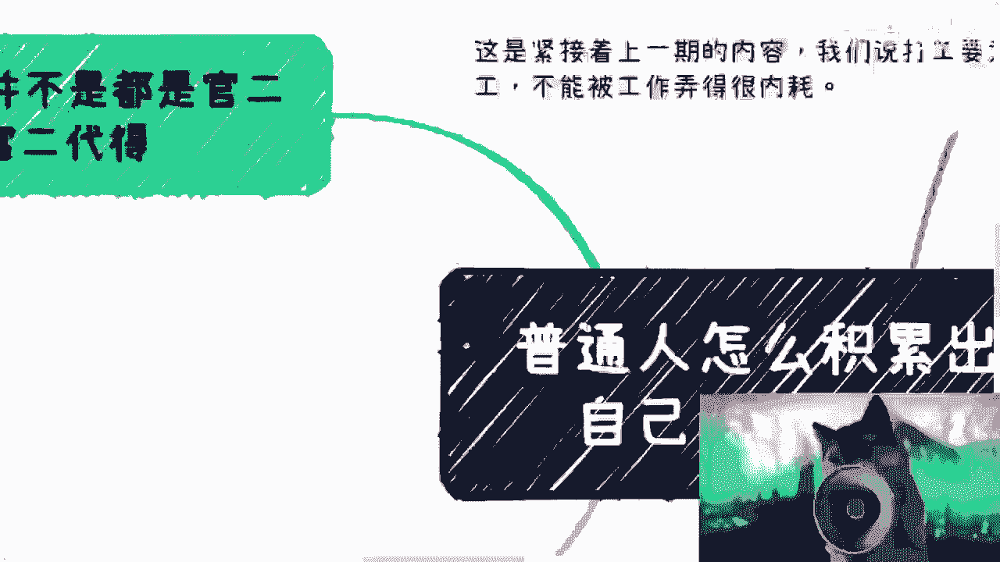
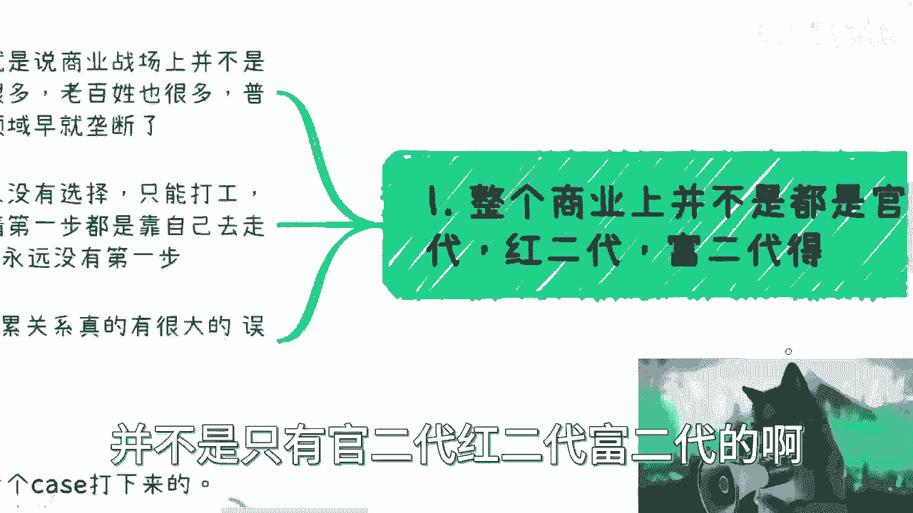
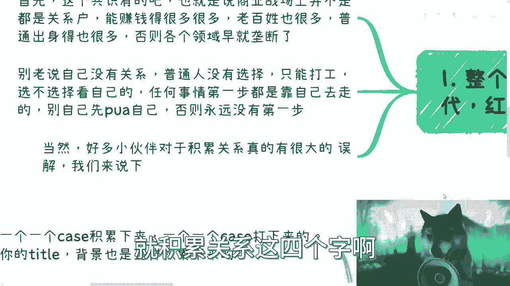
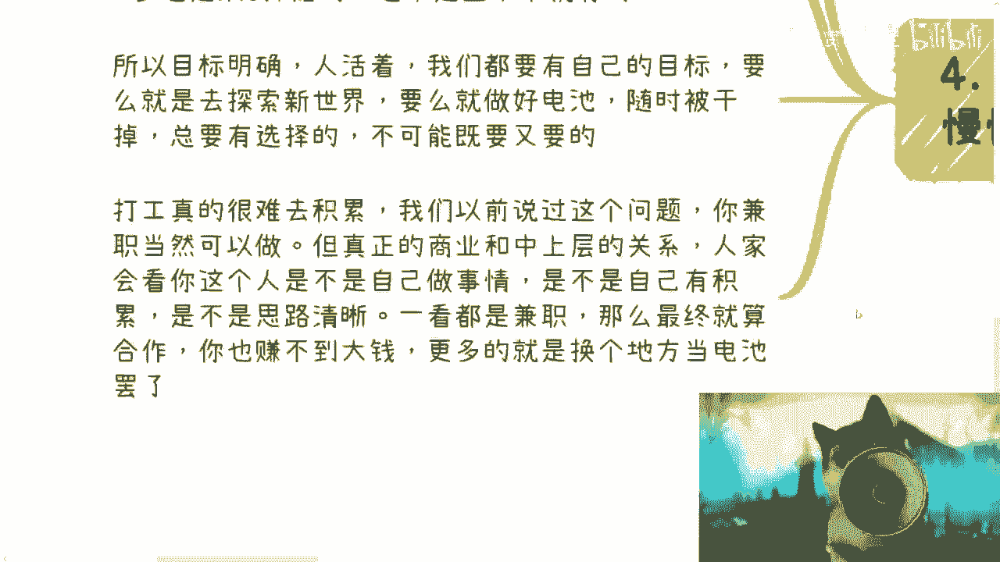
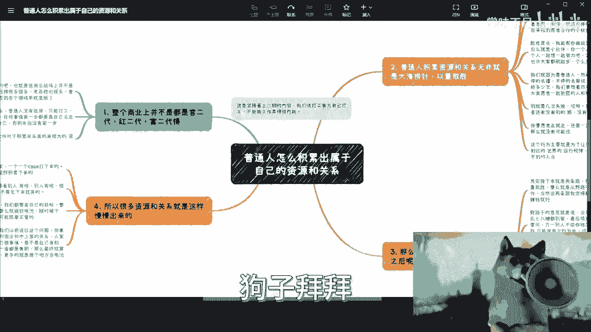

# 普通人怎么积累出属于自己的资源和关系---P1---赏味不足---BV1384y1d7cy

在本节课中，我们将要学习普通人如何从零开始，通过具体行动积累属于自己的资源和商业关系。我们将打破“普通人没有机会”的迷思，并探讨切实可行的起步策略。

上一期我们讨论了“为自己打工”的心态。本节中我们来看看，作为普通人，具体该如何迈出积累资源和关系的第一步。

## 破除“普通人无路可走”的迷思 🤔

许多人认为商业世界已被“关系户”垄断，普通人没有牌、没有背景，因此无法积累资源。这种想法是一种自我设限。

事实是，商业世界参与者众多，背景各异。并非所有人都有强大的先天关系。积累关系的第一步，是停止用“没有关系”来否定自己，并主动走出去。如果永远不迈出第一步，就永远没有积累的可能。

## 理解“积累关系”的真正含义 🎯

许多人对“积累关系”存在误解。它并非指攀附权贵或依赖家族背景。

对于普通人而言，积累资源与关系的核心方法是：**大海捞针，以量取胜**。因为你手中没有现成的“好牌”，所以必须主动、大量地去接触人，寻找那些拥有资源并愿意与你合作的人或机构。

以下是行动的核心思路：
*   **价值是根本**：无论你是否借助大公司背景，最终说服对方与你建立关系的，是你个人能提供的独特价值。公司背景带来的只是短暂的光环。
*   **拒绝是常态**：在大量接触的过程中，被拒绝是不可避免的。不能因为几次失败就放弃。目标应是找到愿意合作的伙伴，拒绝次数并不重要。
*   **从“请求”开始**：主动询问潜在合作伙伴：“我能帮你做运营吗？”“我能帮你做销售吗？”脸皮要厚，态度要诚恳。这是从零开始的必经之路。

## 积累路径：两条可行的道路 🛣️

在找到初步的合作伙伴后，通常有两条路径可以走。这两条路没有绝对的对错，核心目标是创造价值并获取回报。

### 路径一：野路子拓展，以量取胜

这条路的核心是 **业务先行，短平快试错**。

*   **模式**：不过分纠结于正规合同，先开展业务，项目结束后结算。关键在于设定明确的周期框架（例如半个月或一个月），要求看到现金回报。
*   **心态**：选择野路子就要接受其风险（如对方不付款）。识别靠谱的合作伙伴是重要的商业能力，这通常需要通过实践（甚至踩坑）来锻炼。
*   **复制放大**：当一个模式跑通后（例如每月赚2000元），可以尝试在不同行业或业务中复制粘贴此模式，通过增加业务数量来提升总收入。

### 路径二：从野路子走向正规商业

这条路的核心是 **通过实践探索，逐步正规化**。

*   **探索定位**：通过初期的野路子合作，像探索游戏地图一样，了解商业世界中哪些环节、哪些角色适合自己。
*   **建立主体**：随着经验积累，逐步走向正规化：签订合同、成立公司、积累成功案例。
*   **筛选伙伴**：真正的合作伙伴是那些一起赚过钱、签过合同、共同完成过项目的人。仅仅认识或吃过饭，并不算积累。

**过渡**：无论选择哪条路径，关系的积累都是一个需要时间和案例沉淀的过程。接下来，我们看看如何定义有价值的“案例积累”。

## 核心：踏实的“案例积累” 💎

资源与关系是通过一个一个具体的项目案例沉淀下来的。

这里需要区分两个概念：
*   **案例本身是否踏实**：业务模式可以创新甚至“四两拨千斤”（用较小成本获取较大回报）。只要合法合规地将报酬拿到手，这个案例就是成功的。
*   **执行过程是否踏实**：指你是否踏踏实实、完整地交付了整个项目，并获得了应得的回报。**`成功案例 = 项目完成 + 报酬到账`**

你的个人背景、Title（头衔）也是通过这样一个又一个扎实的案例积累起来的。不要只羡慕别人的结果，而忽略了他们从零开始的积累过程。

## 重要原则：全职投入与面对面交流 🤝

打工或兼职很难积累深度的、有价值的合作伙伴关系。

原因在于商业合作是相互的：**`你投入的程度 ≈ 对方重视你的程度`**。如果对方知道你只是兼职参与，那么他不太可能将核心资源或重要机会分配给你，你更容易沦为商业链条中的一个普通执行者。

此外，在中国商业环境中，积累资源有两大优先原则：
1.  **必须见面**：线下面对面交流远比线上沟通有效。
2.  **必须合作过**：只有共同完成过项目，才能建立信任，成为真正的“关系”。

**过渡**：最后，我们必须认清一个现实：商业世界没有可以照搬的“成功方法论”。

## 摒弃“方法论”幻想，拥抱实践 🚀

商业成功无法通过套用固定方法论实现。如果存在这种公式，财富就不会集中在少数人手中。

每个商业节点的变量极多，无法预测。正如将BAT（百度、阿里巴巴、腾讯）的成功模式复制一遍，也极少能成功一样。

因此，作为普通人，你能做的就是：**在目标明确的前提下，勇敢地去闯、去试错、在行动中不断调整**。看再多的课程，如果不付诸实践，都是在浪费时间。

---

**本节课总结**：
我们一起学习了普通人积累资源与关系的核心心法与路径。关键要点包括：破除自我设限、理解“以量取胜”的起步逻辑、选择“野路子”或“正规化”路径、通过踏实完成案例来沉淀关系、以及必须重视全职投入和面对面交流。记住，没有万能公式，唯一的方法是**目标坚定，勇敢实践，在行动中积累**。