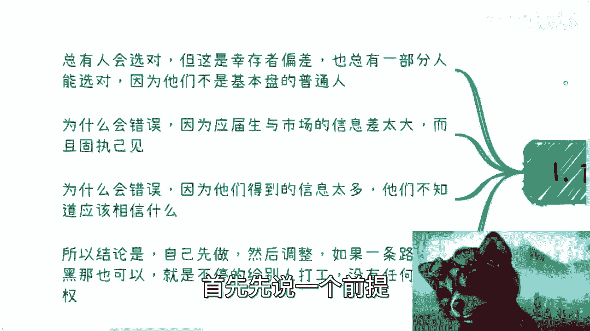
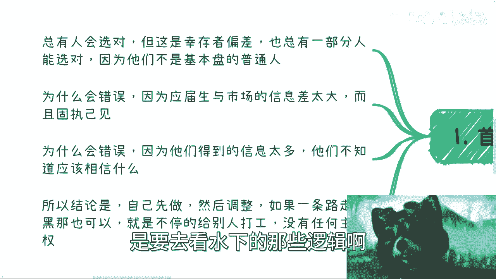
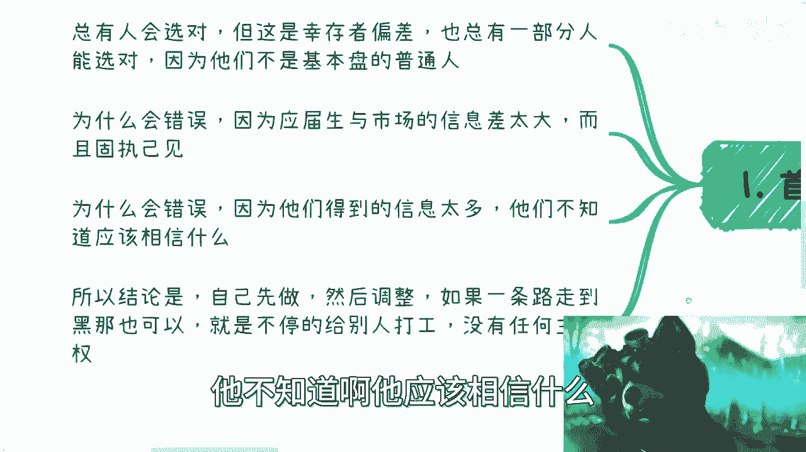
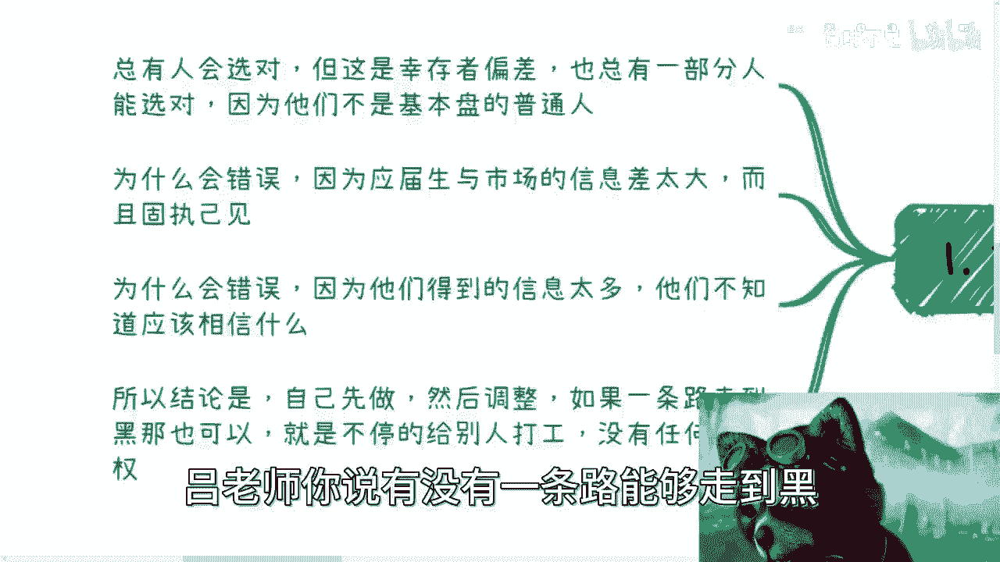
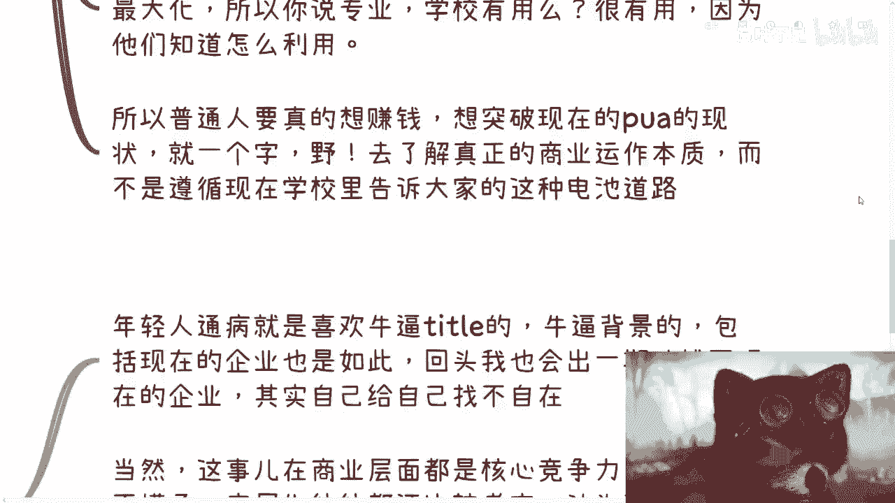
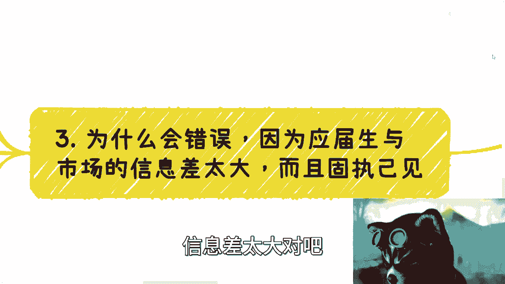

# 普通应届生基于专业和学校选择职业一般都是错的 - P1 - 赏味不足 - BV1rm4y1s7ap

哈喽大家好啊，这个昨天活动啊，就是还是非常的顺利啊，但是怎么说呢，就是啊我没有啊，就现场我本来是这么想的啊，我本来想的是，我可能啊这个大家怕大家聊不下去啊，我可能还分享分享什么的。

后来发现大家这个能从01：30一直聊，聊到六点钟，也是挺蛮的啊，所以后面我感觉其实是蛮好的，就可以多给大家提供这种机会，因为我是觉得可能现在怎么说呢，就是大家这种有质量一点的，同时又不是说特别贵的。

因为我每个人就收200对吧，然后咨询过我的人还只收100对吧，我就就我觉得还行啊，然后嗯我基本上现场茶歇啊，咖啡啊也都是质量蛮高的，所以我是觉得可能像这种，就是大家能够过来联系聊聊。

同时还能线下这种碰碰的这种机会可能比较少，所以我在想是不是说以后可以多搞搞啊，这类活动，那么呃今天这个内容呢是这样子的，因为这两天包括昨天活动的小伙伴呢也提到过，就是说呃就是就是关于这个学校啊对吧。

包括现在专业，包括就是他呃就是第一份工作的选择，你知道吗，其实这个事情是这样子的，但大家不用太去纠结这件事情，为什么，因为本质上来讲啊呜嗯无论啊你们怎么选，我觉得大概率都是错的啊，为什么啊。

你你首先先这么说啊，首先先说一个前提。

总有人会选对啊，你们也不要跟我来讲，有人选的蛮好的对吧，怎么样子的，就是你好不好，不是一两年能看出来的，起码得要个78年十年你才能知道，你知道吗，这个东西没有意义的，那么当然就算有人真的好呢。

这也是幸存者偏差，就是总有一部分人有一些人选对的，但如果另外一方面呢，你说总有一部分人能选对的，那是因为他不是基本盘的普通人，因为什么呢，因为很简单嘛，就像这个微博上一直说的那个段子嘛对吧。

就说什么哎呀我17岁对吧，然后什么赚了一个亿对吧，然后啪啪啪洋洋洒洒写了一大堆对吧，然后到最后一句话就说哦，我可能赚了5000块钱对吧，那剩下的钱是由我爸妈出的对吧，就是这样子的对吧，就是什么意思。

就是说他们能选对，跟他们没有关系，跟他们在什么学校，跟什么专业也没有关系，你知道吗，就是这些都是水上的事情，而你们要真正所谓要选对，是要去看水下的那些逻辑啊。

那么这是第一个，第二个呢就是为什么会错，是因为基本上啊应届生也好，目前这个与市场上的这些信息呢，得到信息差是非常大的啊，而且应届生不是说应届生与这个市场信息差大，而是高效与势与这个商业战场啊。

和这个叫什么就找工作的，这个市场信息差距是很大，没有办法，你知道吗，而且现在年轻人就喜欢固执己见嘛，那没办法嘛对吧，那么第三个呢就是为什么会错误呢，因为他们得到的信息太多，那抖音啊，B站啊对吧。

各种各样的，然后看上去卧槽都他妈很牛逼，你知道吗，什么什么背后抬头一大堆，你知道吗啊这有的没的，那么我觉得对于大部分人来讲呢，他不知道啊，他应该相信什么啊。

所以呢我觉得结论是什么呢，结论就是大家不用太去焦虑，你们现在的专业是什么，学校是什么，哎呀我这个专业以后怎么样，我这个学校以后怎么样，我是不是现在去了一个不好的，你像昨天晚上还有个私信还说了。

他说啊驴老师，我现在这个学历不好，是不是就是呃我那个已经没救了对吧，那我还告诉他长，那么他学历好的没救的，他妈遍地都是，对不对，没有意义的，你知道吗，就是你们除了因为这些事情，能够给你们带来内耗以外。

没有任何的帮助，你知道吗，所以说结论是什么，结论就是你不用管你先去做，反正我跟你讲，大概率你选的都是错的哦，或者大概率你现在认知就是错的，你别去管你先干对吧，你干个半年你再来跟我聊，或者跟别人聊。

我跟你讲，你就有点脑子了，你们现在但凡出来聊，你没脑子，你知道吗，你如果要说有没有，你就问我对吧，驴老师，你说有没有一条路能够走到黑。

我告诉你有的是什么，那就是不停的给别人打工啊，你不用动脑子对吧，那你也没有任何主动权啊，那那可以一条路走到黑啊对吧，你也别去管你做什么对吧，就像我现在小红小熊猫这么黑一样的对吧，然后跟奥特曼一样亮红灯。

对不对，那那怎么办呢啊那我觉得这个是大前提啊。

就不要来杠啊，杠没有任何意义的啊。

那么第二呢就是我们一个个来说，你说总有人选对啊，行动者平差是这样子的，呃你看啊，昨天晚上呢有小伙伴是这么说，他说专业呢，哎我跟你讲这个论点很很很好，我回头是可以单独说一下，那我想想怎么说，他说啊。

他说专业对普通人来讲很重要哦，对大佬来讲不重要，我跟你讲啊，我很想说，其实很多时候广大普通老百姓啊，这个想法呢很多时候是蛮对的，但是呢他对是对的，但他反完全是反人，什么意思啊，就是说这个逻辑是什么。

就是专业这个东西，其实对很多大佬反而是很重要的，对普通人其实一点重要性都没有，为什么你自己想想看，专业对普通人来讲是意味着什么，意味着是什么呢，就是普通人对资本家和对公司来讲，它就是个批量的生产的工具。

对不对，就比如说你今天不管是计算机还是土木，还是说是自动化对吧。

还是什么医疗对吧，你出来你跟别人除了你性格不一样，长得不一样啊对吧，家庭不一样，说出生地不一样，那对企业来讲，这些企业不关心啊，企业只关心你能不能干活嘛，对不对，好，那么你就是个批量的工具。

那你告诉我这个专业对你来讲，重要在什么地方有意义吗，没有啊，对不对，你要是跟我讲的是专业啊，能够让你进到这个赛道，那我就反过来问你，你有你又有哪些依据和哪些凭证，能代表这个赛道是对的呢对吧。

或者说这个赛道是适合你的，你也不知道啊，对不对啊，那么这第第一点啊，第二点就是说啊，你过来我跟你讲啊，就专业这个东西过了几年就更不重要，就是也也就是在你应届生身份的时候重要一点，你知道吗。

就过了几年之后，你就这么想吧。

有的人真正的就牛逼的，我们说硬性刚性技术可能比你强，有的人可能软性技术比你强，比如说有的人吹的比你好对吧，有的人跪舔的比你好，哼我写错了啊，比你比你好对吧好，那你告诉我，你过了两三年之前还看专业吗。

没人看专业了，而且你再过两三年之后，这个专业你在当年还有这个专业的应届生出来，跟你卷你，你还有任何竞争力吧，没有了呀，所以你想想看啊，一个给你带不来多大多大的，这个这个这个帮助的东西。

你却花了很大的精力和时间去care他，你觉得有用稳啦，对了没有用了啊，有的人要说了，他说专业好啊，可能自己发展好，做得好啊，会怎么样，那我跟你讲，还是那句话，你在学校里面是应试教育，什么叫应试教育。

我之前已经说过了，你们去看一下我的视频，对不对，考试成绩代表一切，因为他什么意思呢，它就是个单细胞生物，单细胞赛道，我就告诉你，你就给我卷卷成绩，你就牛逼，结束了啊，没毛病啊，这是没毛病啊。

但是你到了工作，到了商业战场上没有赚钱，别没有这样子的，你但凡去问问任何一个，我不管他是工作做的好也好，做的不好也好，当前有工作也好，当前没工作也好，你只要去问问看做过工作的人。

是不是这么单纯说你能力强啊，或者单纯的你跪舔的好，或者单纯怎么样，你就一定能够代表一切可能吗，啊我就这么跟你讲啊，你今天能力好，你可能打不过跪舔的好的人，你跪舔的好的人可能打不过人家有关系的人。

你关系好的人打不过人家亲戚，你一层一层往上啊。

你觉得呢有这么简单吗，了没有呀，对稳啦，所以你现在就是很多人在那边就想，或者说可能问我或者问我，相信你们可能很多人都问对吧，你问问问破头也没用的，问问人家有什么用呢，没有用的。

因为这些东西其实本身不重要对吧，我跟你这么说，但凡我告诉你重要的，那就是说明我要割你韭菜，我就是要来骗你，然后我就告诉你来，我这里有个培训班，快点过来培训，对，那不就是这个样子的吗，啊我跟你们讲啊。

微博上那句话说的很对，我再次跟你们强调一下哈，普通人之所以叫普通人，就是因为很多的时候啊，真话他们是不愿意相信的，而他们相信的都是那些骗他们的话啊。

所以说呢相反的啊，大佬懂得为什么说我说大佬的专业很重要。

是因为大佬懂得，怎么将这些专业资源和拥有的东西，包括他是哪个学校的利益最大化对吧，我随便举个例子，比如说今天你是清华毕业的，跟一个大老师，清华毕业的对吧，你毕业之后就觉得卧槽，他妈的老子很自豪。

老子是清华毕业的，但是大佬毕业之后，他后面很多商业行为，他甚至可以利用清华给他做背书，或者利用清华这边给他，能够以杠杆的方式撬出来很多钱，你能吗，你不能不就这么简单吗，对不对对吧，那你说专业学校有用吗。

我跟你讲很有用，因为他们知道怎么去利用，你们知道吗，你们不知道，对不对啊。

所以普通人真的想赚钱，真的想突破现在这种嗯叫什么，就是就是大家很卷的以及被PUA的现状，我跟你讲就一个字就是野，你知道吗，就是也没了啊，你去了解真正的商业运作本质，而不是说去遵循。

现在学校里面或社会告诉你们的，这些就是叫什么啊，循规蹈矩的这么一条路，你单纯走这条路没有用的啊，一点用都没有的。

我刚刚发现一个B站的状态，我竟然发现B站没有和谐过啊，B站胆子越来越大啊，然后这个是二对吧，三呢是这样子的，你说为什么会错误对吧，我这里也写了应届生信息差啊，信息差太大对吧好。

我们来看啊，你比如说一些小伙伴问我，他说什么专业有没有用啊，里面教的一些技能啊，比如说什么什么土木里面啊，包括设计啊，包括计算机啊，对啊，金融啊里面教的一些东西有没有用，你说有用吧，肯定有用啊，没有用。

学校教他干嘛呢，对不对，但是从宏观角度来讲，这些有用的东西跟当下，因为时代变化太快，跟当下公司所要的技能，跟整个商业要的东西它脱节，太太厉害，而且另外一方面，在你们的人生当中，我敢打赌啊。

以目前的国家的教育机制啊，以及你们未来的所能够碰到的人，你们还有你们应该是没有机会去学习，真正的商业，商业的东西，就跟我一样对吧，没有人有机会对吧，而且你们真正在网上能找到的对吧。

那我们说接地气的东西很少很少啊，所以这也是为什么目前来讲，很多人非常的就是，就是就是闭塞的这么一个原因啊，那么也就是说学校里面教的东西有用，但是大概率在当下的情况下面已经没有用了啊，那么但是你跟他们讲。

他们不听啊对吧，你跟应届生说，应届生不听啊啊所以应届生做选择呢，一般都是根据自己原本就已经落后的，或者来说错误的信息对吧，来做出选择，那你想想看，你根据的所有东西都是错的，你做出选择可能是对的吧。

不可能的呀，不现实的呀对吧，那我跟你们讲啊。

看问题都是辩证的，不要零和一啊，有世界也不是只有黑和白的对吧，就像我说到这里有很多人又要说了，他说那你照你这么说，他妈张雪峰就垃圾对吧，张雪峰就他妈的说什么都错的，没有啊对吧，就是你要明白。

读书这条路上面有很多选择，是能够帮助到大家的对吧，但是帮助到大家并不代表大家以后在工作上，在你们的职业规划上就做的很好，这完全是两码事哦，那么你们可以理我，在我看来，其实张雪峰等人这一类人。

他给出的建议，更多的是为了让大家在学习的这条，就是高等教育的这条路上面，能够尽量少走走弯路啊，而我要告诉你们是什么，就是单纯的打工没有任何出路啊，而且这个事情你放在20年前。

我不我我我估计我也不会这么讲，但是你放在当下这个时代，没办法就这个样子对吧，那么所以说呢最后一点啊，不管不过呢，现在年轻人呢我跟你讲啊，一部分呢属于固执己见，另外一部分呢就是不知道该信谁。

然后呢或者喜欢假大空的，那么这个就是说到我们第四点啊，那么我跟你讲啊，这个东西呢是年轻人的通病，他就是因为没见过世面对吧，他就喜欢牛逼的title啊，牛逼的背景啊，包括现在的企业也是如此，我跟你讲。

很多人都一样啊，就是什么哎我没去过海外啊，我得去啊，我得卷，我得润啊，你说我没上过清华，我得上啊，我没去过大厂，我得去，我跟你们这么说吧，如果咱们就这么说，如果今天1万个人，我我让你们都去去一遍。

这样子一个地方，每个地方待两年，你们回来你们看看一样的，你知道吗，你懂吗，就是你以前所有的幻想，你以前所想要的东西，不是因为你去了清华，你去了海外，你你去了大厂，你就会有没有没什么区别的，你知道吗啊。

你如果现在就要跟我说，哎那你知道你这么说，我一个比如说专科出来的，跟我清华出来的没有区别吗，有啊当然有区别，但是你往后发展都一样啊，有很大区别吗，不没有啊对吧，所以我要跟你们讲啊，就是我觉得这点认知啊。

是我跟你们不一样的地方，就是在我的认知里面啊，只要都是打工的，我不管你们年薪是100万还200万，但在我看来是没有任何意义的，因为它还在同一个level层面，同一个资源层面。

他没有突破他这个level有什么区别吗，没有区别，对不啦，我我我还是那句话嘛，我们要追求的是什么，我们要追求的是尽可能的自由对吧，尽可能的是能够自主控制时间多，从而又能够赚到更多的钱。

而不是拼命去当牛马，你当牛马能当几年，我就问啊，又不是说清华毕业能活500年是稳啦，没有意思的呀，啊那么这是第一个，第二个呢，当然这个事儿在商业层面呢都是核心竞争力，什么意思呢。

就是说其实这些假大空的包装，在商业层面是很多的，而且吃这套的人就很多对吧，就更别说应届生了，但他没见过世面嘛对吧，那么应届生呢往往都还比较老实啊，认为说出来的呃，只要说出来的东西呢总归都是真的啊。

那么谁知道呢，以前都说七分虚三分十，现在他妈的不一样了，十分虚，他妈20分虚的人都他妈的大有人在，你知道吗啊，那么这是第二点，第三点呢其实要我说呢也可以，什么意思呢，我也可以跟大家说。

比如说某一天我也说来，我给你们给我带你们做项目，驴老师带你们带，带你们做对了，我带你们去接受政府，我带你们去，我相信很多人愿意点，对不对啊，然后我就说他妈10万块钱，不要说10万20万，对不对。

我说不好听点，我能够多多少算多少，你敢我跟我敢跟你们打赌，总有人会付钱的，就这么简单，对不对，所以说这就是现状呀，你知道吗，不是说真的，就是很多应届生会觉得就是说哎呀，这个这个能要别人交钱的。

要别人怎么样的，总总归有点东西的，我告诉你们没他妈东西，东西都他妈在营销上面了啊，中国就这么样一片土地，我跟你说啊，就反正很多人呢也不是很多人，反正有的人呢就是想做事情的，但他根本发不出声音啊。

就是他很愿意帮助大家，但是大家看不到，但有的人呢就是来割的，就往死里割啊，却影响力很大，这就是现状呀，对不对。

所以说啊我们来说结论啊，结论就是如果呢你要真的想这个就怎么说呢，想改变啊，想想做点事啊，或者想赚钱啊，那么我跟你们讲结论就是什么，先做再想啊，再去找人沟通啊，招人沟通，你别现在就是说啊。

你说我这个大二大三对吧，我呢这个那当然了，你说你要是愿意听得进别人的话，那你就多沟通对吧，你找我也可以啊，你要不愿意相信你，非要固执己见，就像我跟你讲，我说比如说我说他妈的，你这金融专业学历没什么用的。

你这计算机专业学历也没什么用的，你还不如大一大二开始就想办法，这给出去认识人啊，想办法做做自己项目，那你又不愿意信对吧，那如果你不愿意信，我跟你讲，你就这样，你就先去做啊，你也别去想什么专业不专业了。

你就先去做，你看看你毕业之后半年一年，你做出来，你你所经历的东西跟你想的是不是一样对吧，我跟你讲，不管好还是不好，你经历过一年半年，哎嘿这个你出来想法肯定就会不一样啊。

所以说呢就是说所以说就是说除了这个以外，包括别的也是一样的，你说你说有的人就说啊，他说啊我现在有个事情啊，比如说什么我有人找我去当合伙人啊，有人找我去做什么东西啊，怎么样怎么样，他说驴老师。

你觉得我要不要做，我跟你们讲，我核心逻辑很简单，就是你就告诉我你能不能赚钱，你赚多少钱，你付出多少，你什么时候赚职业钱，你把这个逻辑讲清楚呀，你别来跟我讲，有的没的呀，对不对。

你跟我说哎呀这个东西这个项目很好的，我能学到点东西的，这个东西我能做联合创始人的对吧，这个东西怎么样不重要，我告诉你们，就是就是你我就是我告诉你们，当你们在你们没有超脱之前，你们觉得这些东西都重要。

我跟你们跟你们讲啊，在你们超脱之后，你们会发现只有赚钱是重要的，别的是不重要的啊，只有你自己看得起你自己，你的价值是有价值的，你付出多少能赚到多少钱，你自己明白，分清楚了，你的业务反而才会越做越好。

而不是说我一开始不谈钱啊，我就看出这些有的没的，你只会被别人利用哦，你只会被割，你只会当工具人，你只不过换了个地方当工具人。

你清楚完啊好，所以啊就是我们回到这里啊，就是不要去杠啊，我跟你们讲不要去杠哦，不要去想有的没的哦，不要拿身边的例子来说，所有打工的例子在我这边一无是处，我就告诉你们没有意义的，你打工的有什么好说的呢。

对不对啊好吧，所以说呢就是嗯，我的核心观点一直就是说希望大家打工打工啊，无所谓啊，希望大家能够有更多自由的时间啊，自我控制的东西啊，自我掌握的东西啊，然后自我赚钱的方式，而不是说把你们赚钱跟这个叫什么。

未来的命运掌握在别人，什么企业或者什么手上啊，这个没有意义的，好吧行，就这么着吧啊，这个回头我会找一期，找个时间跟大家再分享分享这个活动的事情啊，嗯好吧，然后大家反正有什么就是手上有哪些牌。

有哪些资源啊，然后有什么想法，然后不知道怎么打的，比如说不知道商业上怎么走的对吧，那么你们也可以私信我好吧，我们可以走一个就是比较我认为比较公允的，比较公公非常平公平公正的啊。

