# 普通应届生基于专业和学校选择职业一般都是错的---P1---赏味不足---BV1rm4y1s7ap_

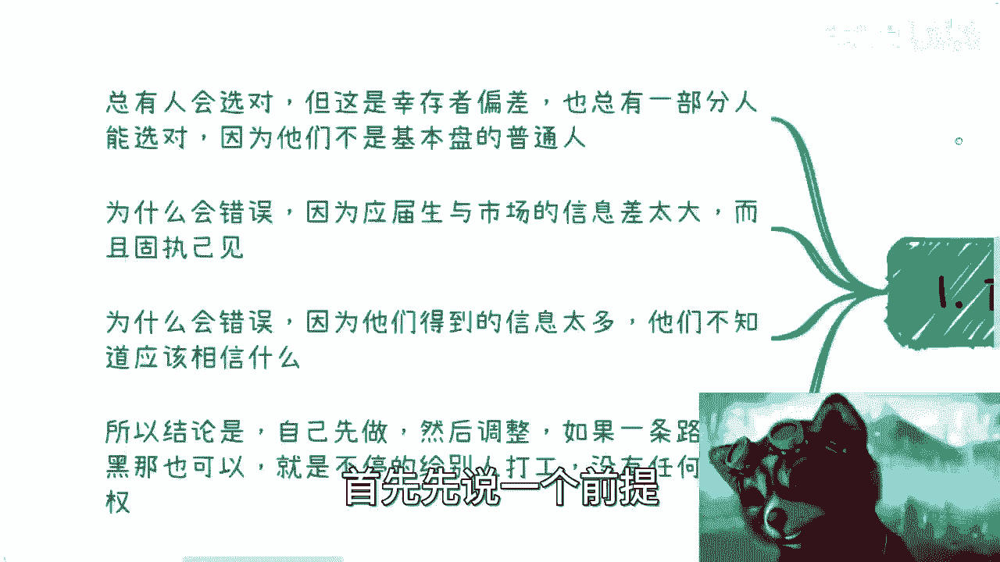

在本节课中，我们将探讨一个普遍存在的职业规划误区：应届生基于自己的学校和专业背景来选择第一份工作。我们将分析这种选择方式为何常常出错，并为你提供更本质的思考方向。

## 核心观点概述

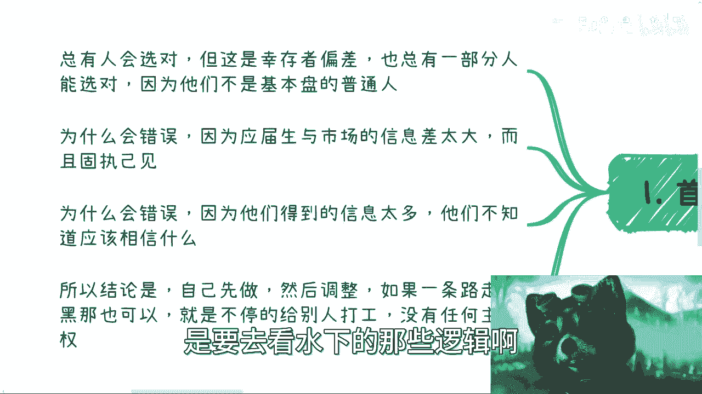

首先需要明确一个前提：对于绝大多数普通应届生而言，无论你如何基于学校和专业去选择职业，这个选择大概率都是错误的。这并非危言耸听，而是基于现实的逻辑分析。

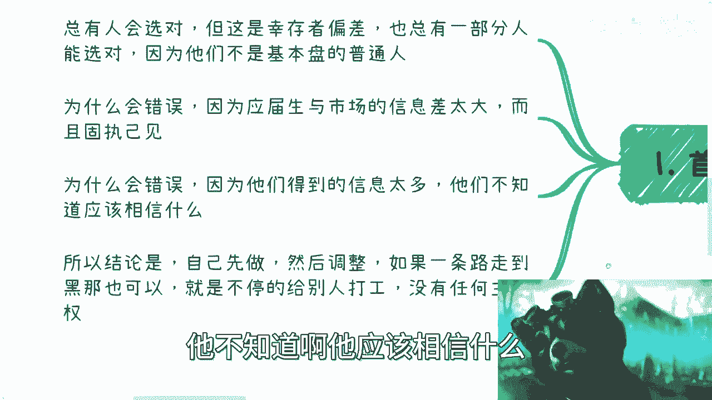

## 为什么选择会出错？🤔

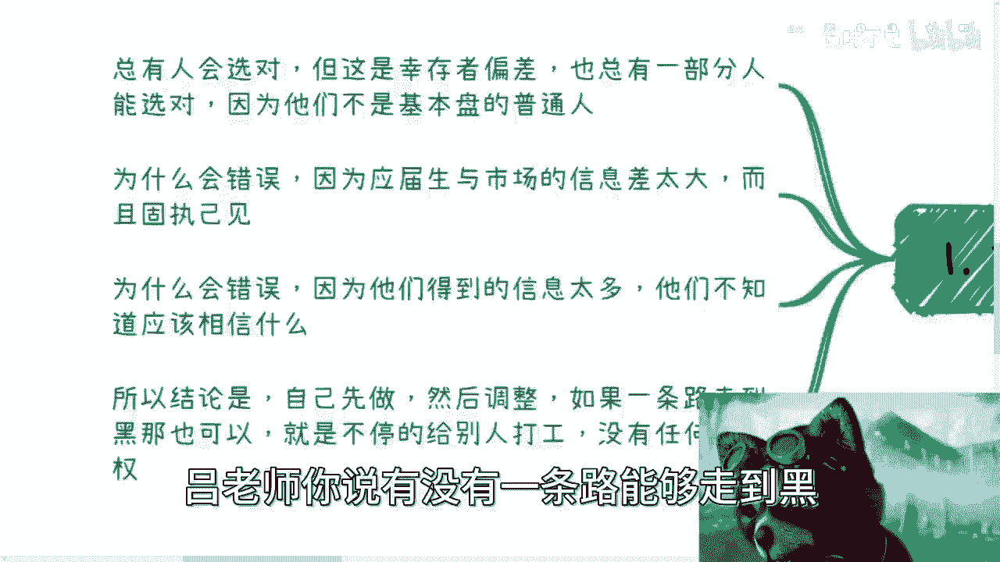

上一节我们概述了核心观点，本节中我们来具体分析导致选择出错的几个关键原因。

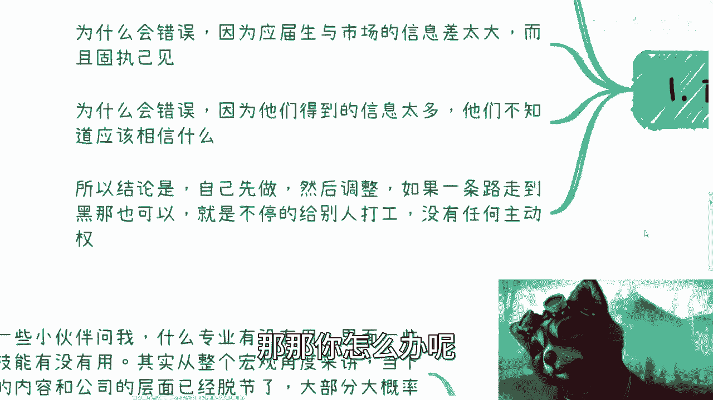

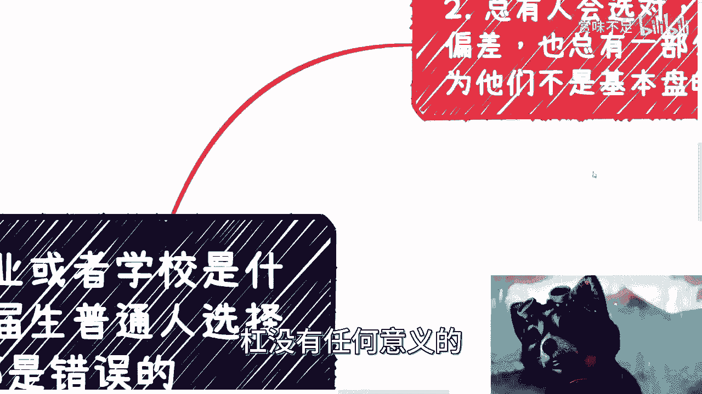

### 1. 幸存者偏差与水下逻辑

总有一部分人的选择看起来是正确的，但这属于幸存者偏差。他们的成功往往与学校和专业本身关系不大，而是依赖于“水下”的逻辑——例如家庭资源、个人机遇或独特的商业嗅觉。普通人看到的只是“水上”的学校和专业标签。

**公式：**
`可见的成功案例 ≠ 普适的成功路径`

### 2. 巨大的信息差

应届生、高校与真实的商业战场和就业市场之间存在巨大的信息差。学校教授的知识体系与市场当下需求的技能严重脱节。年轻人依据这些滞后甚至错误的信息做出的选择，自然难以正确。

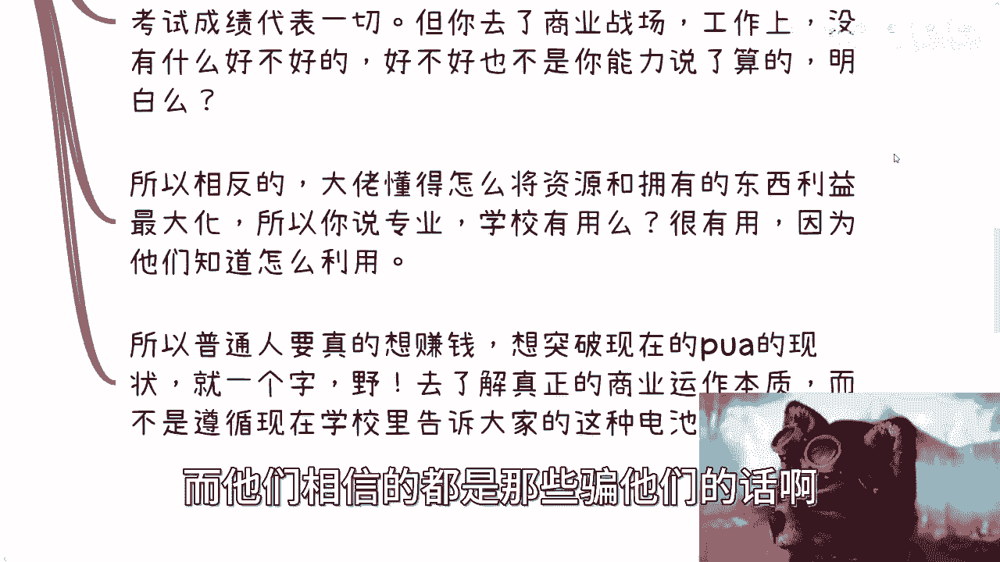

### 3. 信息过载与判断失准

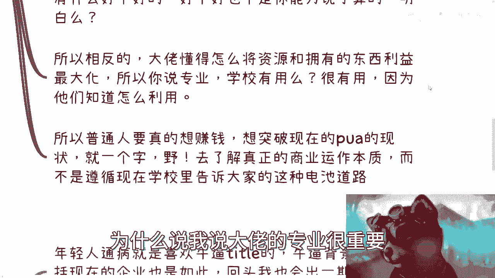

当下年轻人接触的信息过多，抖音、B站等平台充斥着各种包装华丽的“成功人士”和观点。信息爆炸导致大部分人失去了判断力，不知道应该相信什么，从而更容易被表面光鲜的title所误导。

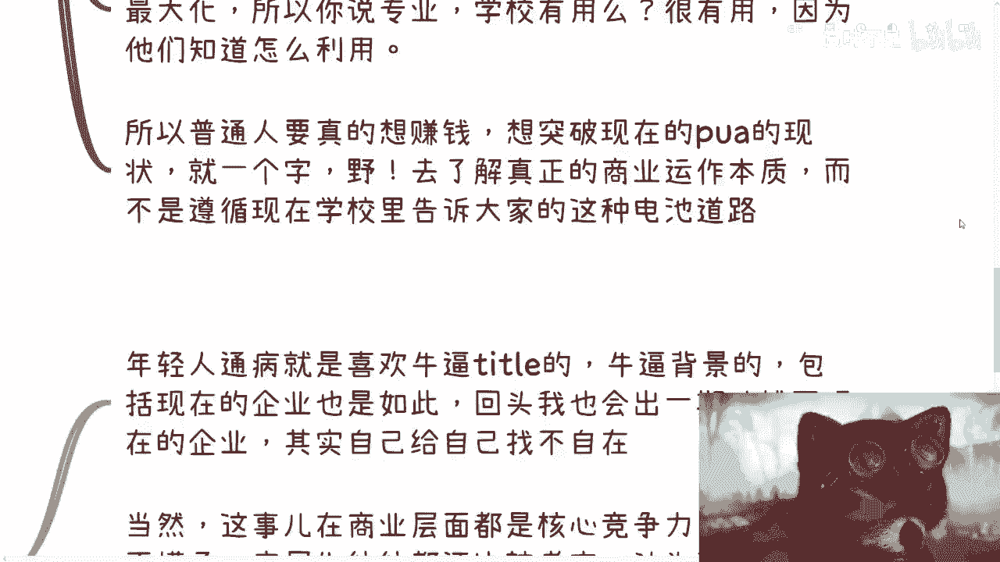

## 专业和学校的真实作用 🏫

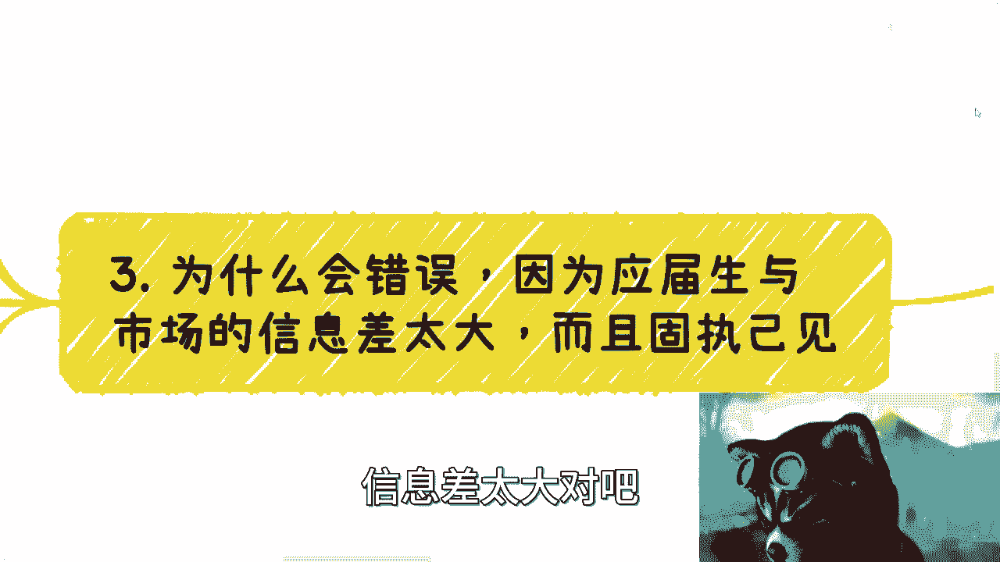

了解了选择出错的原因后，我们来看看被许多人视为圭臬的“专业”和“学校”，其真实作用究竟如何。

以下是关于专业重要性的常见误解与事实分析：

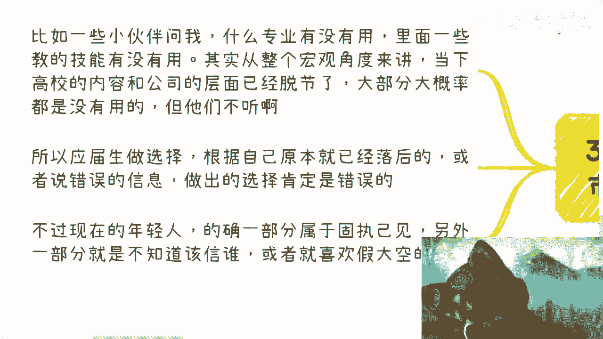

*   **对普通人而言，专业标签作用有限。** 对于企业来说，大多数应届生是批量生产的“工具”，企业核心关注点是能否干活。专业只是进入某个赛道的敲门砖，但无法证明该赛道适合你或前景正确。
*   **专业的重要性随时间锐减。** 专业仅在作为应届生时有一定作用。工作两三年后，个人的硬技能、软技能（如沟通、协作）和实际业绩远比专业背景重要。当年的专业新人也会不断涌入，与你竞争。
*   **学校教育的局限性。** 学校教育多是“应试教育”，是单一维度的竞争。但职场和商业世界是复杂的系统，能力、关系、机遇等多种因素交织，不存在“成绩好就等于成功”的简单公式。

相反，对于真正能利用资源的人（所谓“大佬”），学校和专业才显得重要。因为他们懂得如何将这些标签“利益最大化”，例如用名校背景为商业活动背书、撬动资源杠杆。而普通人通常不具备这种利用能力。

**核心结论：** 普通人若想突破内卷现状，关键在于“野”——即主动了解真实的商业运作本质，而非遵循学校或社会灌输的循规蹈矩之路。

## 给应届生的行动建议 🚀

前面我们剖析了问题和本质，本节我们来看看应该如何行动。

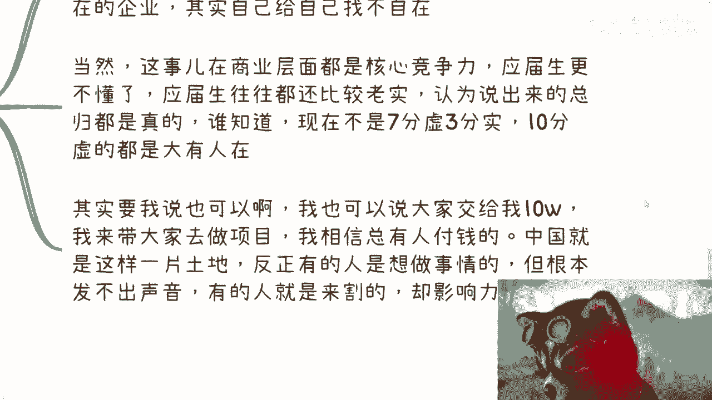

以下是你可以立即采取的步骤：

1.  **先行动，再优化。** 不要陷入对专业、学校的无尽焦虑和内耗。核心是“先做再想”，无论对错，先进入实践。在现实中干上半年，你的认知会远超空想。
2.  **建立商业思维，而非打工者思维。** 不要只寻找“一条路走到黑”的打工岗位。应思考如何创造价值、掌握主动权。评估任何机会时，应聚焦核心：**你能赚多少钱？付出多少？何时赚到？**
3.  **警惕虚假包装，关注本质。** 不要迷信华丽的title和背景。在信息过载的时代，学会辨别真伪，寻找那些愿意分享接地气、本质逻辑的内容和导师。
4.  **寻求真正公允的指导。** 如果你手上有牌（资源、技能）却不知如何打出，或对商业路径感到迷茫，应寻求那些能提供公平、公正分析，帮助你厘清自身价值与变现路径的指导。

## 课程总结

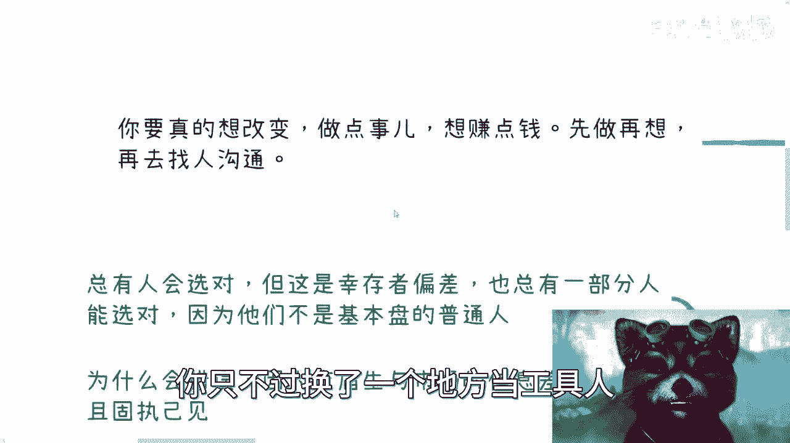

本节课我们一起学习了职业选择中的一个深层误区。我们认识到，基于学校和专业进行职业规划，由于幸存者偏差、信息差以及教育体系与市场的脱节，对普通人而言常常是低效的。真正的破局之道在于**跳出单一维度竞争思维，通过快速实践获取真实认知，并致力于培养商业思维和掌控自身价值的能力**。记住，重要的不是你从哪里开始，而是你如何利用经历，走向哪里。

**最终建议：停止空想与内耗，在行动中验证想法，在创造中定义价值。**