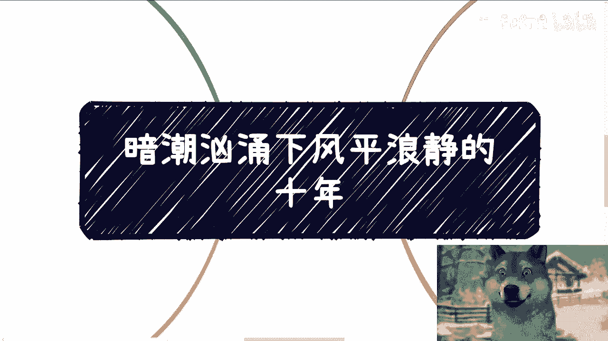
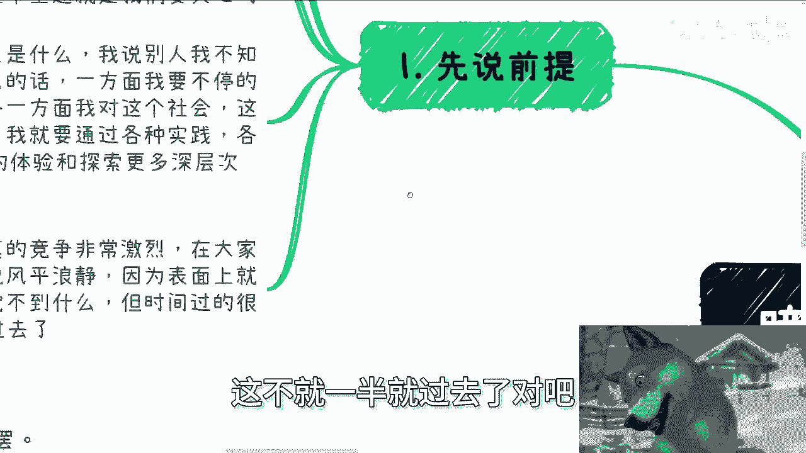
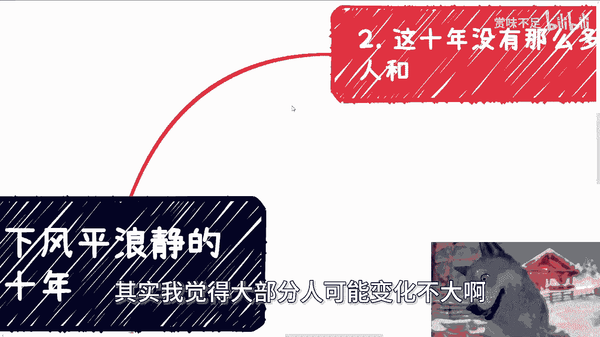
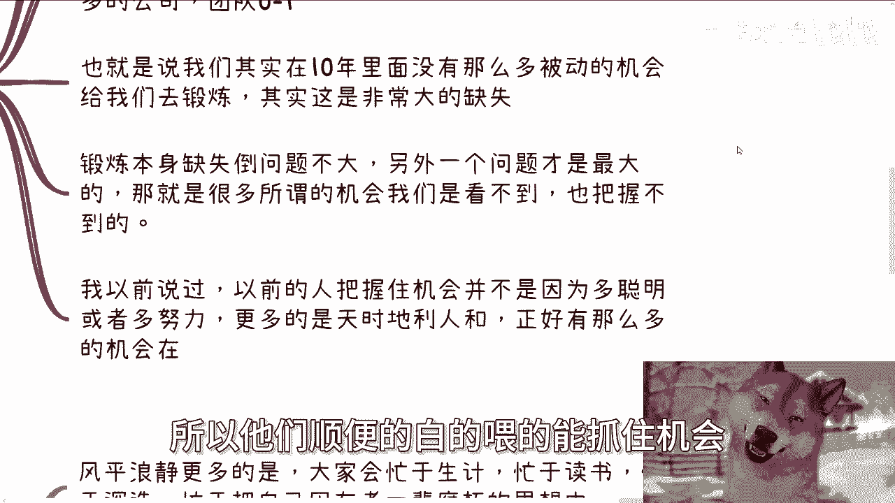
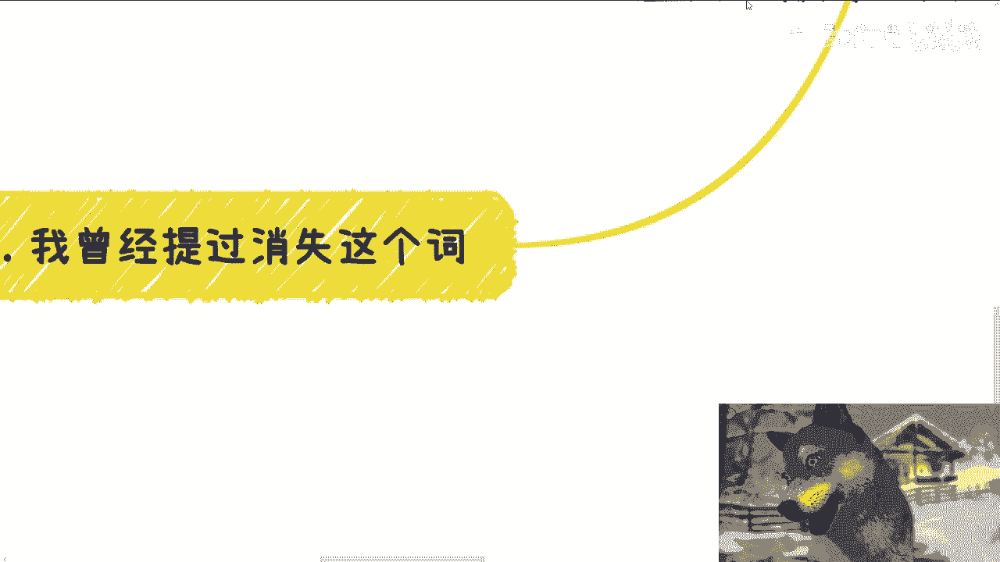

# 暗潮汹涌下风平浪静的十年 - P1 - 赏味不足 - BV1ci421a7Ab

呃好大家好呃，最近私信我跟我说，这个抄我的人比较多是吧啊，这个大家要是碰到看到抄我的啊，顺手点一下，帮我点一下举报啊，啊都帮我举报掉。

好吧好，首先啊今天我们讲的这个主题啊，这个放在充电视频里面是什么呢，叫做暗潮汹涌下啊，风平浪静的10年，那这10年呢我也没写对吧。

但是我也可以说就2020年到2023年啊，那么先说一下前提啊。

就是呃你要躺平或者随波逐流呢，那随便啊，那么这个主题呢不适合你，而且什么暑期都不适合你啊，反正每个情况都不同啊，有的人反正家庭情况好啊，甚至可以什么都不做，就躺平一辈子的比不了啊，但我要说的呢。

就无论家庭情况怎么样，也无论这个社会情况怎么样，我们希望呃在不浪费生命的情况下面，能折腾出些痕迹啊，不管成功失败与否，那么今天这个主题就是我们要关心的，那么前几天有人问我这个活着的意义是什么啊。

我说别人我不知道啊，我也强迫不了啊，但我自己的话呢，一方面啊，我觉得我要不停的去创造我活过的证明啊，那另外一方面呢就是我觉得我对这个社会，对这个世界太多太多东西了解太模糊了啊。

我必须要通过各种实践或者各种项目，或者各种机遇，我想真正的去体验或者探索更多层次，里面的一些东西啊，包括我不知道的事情和人，那么为什么说暗潮汹涌呢，因为真的激竞争呢其实非常激烈，在大家看不到的地方。

那为什么又说风平浪静呢，因为表面上就很平常，很普通，那么大家感觉不到什么，而且最近呃信息管控越来越严对吧，那么但是问题是时间过得很快啊，一眨眼，其实2020呃，现在都已经马上要2025了。

这不就一半就过去了吗对吧。

但是你们仔细想想，看这一半过去哎，擦大局势也好。

或者整个面上面也好，包括我们自己也好，有多大的这个变化嘛，其实我觉得大部分人可能变化不大啊。

包括我在内对吧，那第二我觉得这10年呢就是没有这么多天时。

地利人和，就我们不能说没有啊，但不同时代呢肯定有呃这个很多的契机跟机会，但的确相对前面的10年或20年少了很多。

真的少了很多啊，我曾经跟大家讲过两个点啊，第一个点就是我，我们现在没有之前那么多的政策，没有之前那么多的呃0~1的产业跟行业，也没有这么多0~1的公司跟团队对吧，包括你们所知道的那些所谓的大厂啊。

怎么样子咳，其实都是在前10年前20年冒出来的对吧，那么也就是说我们其实在10年里面，我们在现在这个10年里面啊，没有这么多被动的机会给我们去锻炼，其实这是非常大的一个致命伤，因为而且另外一方面是什么。

锻炼本身的缺失，其实我觉得倒无所谓，不是太重点的，重点的是另外一个问题，就是呃那就会导致很多所谓的机会，我们是看不到的，也把握不住，我以前就说过，就是以前的人难道是因为比我们聪明吗。

不是难道是因为比我们努力吗，也不是啊，我觉得更多的是以前的人把握机会，仅仅是因为天时地利，人和大家其实都一样，而而以前因为有非常多的东西，我们叫做百废待兴嘛，就是有非常多的东西0~1。

所以他们顺便的白的way的能抓住机会。

而我们现在原本这个时代的机会越来越少。

包括呃扶持的政策也也越来越少，那没有办法啊，那么第三主题里面为什么提到风平浪静，为什么又提到暗潮汹涌，是因为风平浪静，更多的是大家会忙于生计，忙于读书，忙于遥遥领先，忙于深造啊。

忙于把自己困在老一辈的腐朽的思想当中，包括媒体所营造的这种环境当中啊，那么很多人去学习，其实都在学习老一辈的这种资本逻辑啊，金融逻辑啊，或者产业呃，创业商业行业里面的逻辑呃。

我倒不是说学习这些东西不好啊，但是我隐约有种感觉就是时代发展太快，尤其是中国，尤其是中国，就是很多老的技能或者经验学的太多，对我们现在年轻人帮助其实并不大，除非我我认为啊，除非你有非常高的悟性。

能够举一反三，同时又能够啊，就是就是掌握现在非常多新兴的一些，比如说在产业，在创业，在行业，在商业上的一些一些一些一些逻辑，或者一些想法，你能够结合两者，那我觉得其实对你有帮助的，而如果很多人啊。

他一味的去学习那种老一辈的，哪怕是非常有价值的东西，在我看来，其实现在已经价值没那么大，因为时代变化太快哦，那么暗潮汹涌的点在哪里呢，就是其实我跟你们说的水下的那些人。

或者象牙塔外的那些人或者既得利益者，他很清楚在这种情况下面，应该怎么更好的赚钱对吧，你包括那些做对冲的，他们就很清楚知道在这种情况下，如应该做空哪些东西对吧，而同时剩下的这些人他们会很清楚。

在这些时间里面，也就在这10年里面更好的去瓜分资源和抱团，那么他们的这种行为很机会进一步的削减，留下来的这些机会跟资源，那么将原本就很少的机会和很少的这种天时，地利人和雪上加霜对吧。

那我们剩下的你包括什么金融层面的，包括资金外流啊，就就这个都已经就我们先不讨论了，这些东西就就就先不说了啊，更不谈了对吧，那么在之前一次充电视频里面，我曾经提到过消失这个词。

就是这10年的时间其实会很尴尬，因为你会发现疫情也好，经济差也好，时间本身我举个例子啊，比如说2035年，2040年的时候对吧，就是时间本身会抹平这些事情，而对于很多人来讲，为什么。

因为这是对他们一辈子的影响，为什么，因为这10年可能正是很多人正应该去积累，正应该去沉淀，正应该去叫什么，增加自己经验值的这么一段时间，但是被浪费掉了对吧，那人生能有几个20岁到30岁。

能有几个30岁到40岁，更何况现阶段大家所面临的生活成本压力，也比之前远远大得多对吧，差别真的很大，你说还是那句话嘛，就是压力也好，或者说你说大家面临的这种，你说什么叫叫叫叫呃呃这个思想压力对吧。

或者说有很多人抑郁或者怎么样子不一样，真的不一样，你有很多人会觉得说哎呀现在薪资高啊对吧，相比以前赚的多是啊，那你你所有的东西它都是相对论啊，都是要动态去看的，就是说我们说你这个大部分人现在薪资涨吗。

涨了呀，那你不看看物价对吧，你不看看房价，你不看看各种各样的价格对吧，你你你要看比例呀，你不是看你不是看他妈的，单纯看一个数据啊，没有用啊对吧，你就让很多专家很搞笑的在网络上说。

会说哇现在年轻人抗压能力差，是抗压能力差吗，啊这他妈这我还是那句话，我觉得人与人之间差别并不大，本身的差别并不大啊，就是就有些人自暴自弃，或者有些人被PUA，咱先不去说它对吧。

但是我觉得人的能力各方面本身差别并不大，尤其是普罗大众层面，就去头去尾的层面，你说能有多大差别啊，那我前两天还跟他们说，我说我们现在啊哪怕有同等的机会跟机遇，我们也哈我写错了，这个不能错啊。

啊就是我们也不可能赚到前人的财富，这个我觉得不是我们的问题，这是时代的问题，这不是我们努不努力，我们再努力也没有用，这这时代就是这个样子对吧，所以我一直强调我说的这些啊，是希望针对那些针对那些。

希望自己未来能过得更好，能有更好的生活质量，更好的，能够有更好的未来的这些人去说的，毕竟怎么活不是活呢，对吧，你你说你这你往下比烂，怎么比啊啊你往下比烂没有底的，你只要活着怎么活，不是活对吧。

那句话怎么说啊，好死不如赖活着对吧，你你你你要是只指望只指望着，仅仅指望着苟活着，仅仅指望着这个啊，你就跟我说，哎我只要活着就好了对吧，我只要有口饭吃就好了，那那那那那有啥好说的呢对吧。

这不是我这至少跟我也好，跟现在想要来，就是说在这个事业上或者在在在给物，给自己未来能赚到更多钱的这些人也好，跟我们不是没什么好说的对吧，虽然很多人其实接受不了自己过得不好，但是问题是你接受不了。

接受得了又如何呢，这整个的环境或者整个的生活，不会因为我们个体而改变的。

对不对啊，所以说就是说就是说嗯美国大选对吧，降息啊，包括那个额外贸啊，包括就是台湾啊，包括价格的问题，就整个大的局势各方各面都在变啊，你你但是你你会发现啊，就是说如果单纯大家现在就像我一开始说的。

大家现在忙于哎每天刷刷短视频，每天看看对吧，或者说呃可能还是忙于就是怎么说呢，考考公啊，考考学历啊对吧，可能比如说呃更多的集一些老一辈说的东西啊，是没错是OK，但是。

就你会发现这个时代给予大家的机会没有，而且更多的是你做这些事情等于，性价比越来越低，唉行吧，反正反正就是这么个意思，反正就这么个意思，就是说，战斗每天都在战斗啊，这个商战啊各种各样的对吧。

只不过可能大家看不到，但是并不代表没有啊，就是时间过去就真的是过去了，我只能这么说啊，未来你要想有点东西，一个好汉，三个帮你没有关系，没有人脉，你积累不出来，什么东西都不会有啊，我还是那句话。

你们现在所积累出来的所有东西，只要钱不会因为这个东西直接印出来，不会从天上掉下来，价值就不大，啧好吧行啊，那就这么着啊，然后那个呃职业规划好吧，商业规划你们就是在呃股权啊，分红啊，丰润啊，商业计划书啊。

白皮书啊啊就在你们的主页啊，在副业啊，在一些呃商业上面，你们要是有什么问题呢，啊希望呃能够我给你们更多的一些建议，或者说让你们少走点弯路的话，那么你们可以呃整理好个人的背景跟问题的list，好吧。

