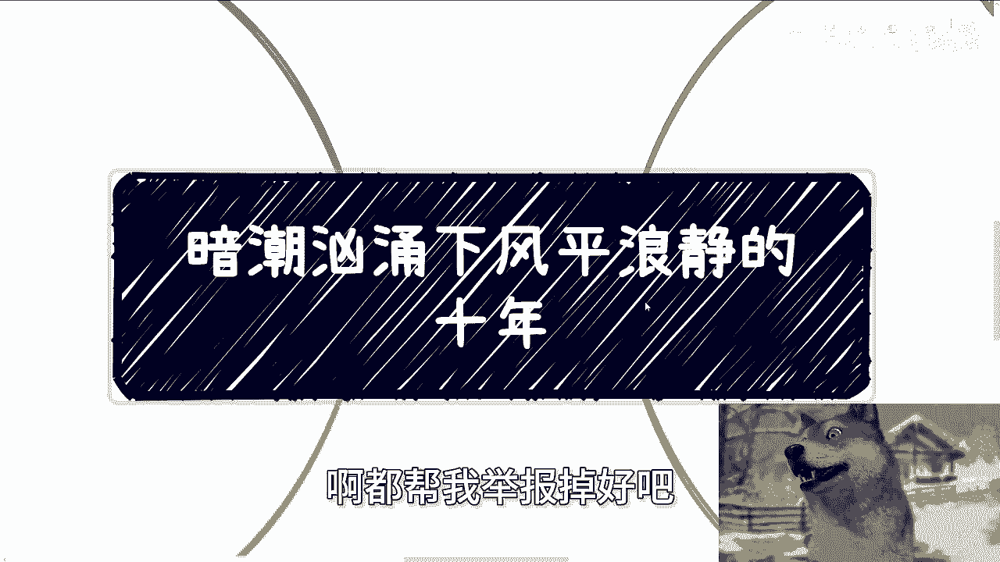

# 课程一：暗潮汹涌下风平浪静的十年 📅

在本节课中，我们将探讨一个看似平静实则充满变化的时代背景。我们将分析个人在其中的处境，并思考如何在有限的机遇中创造价值。

---

最近，有观众向我反映，抄袭我内容的情况较多。如果大家看到抄袭内容，请顺手帮我举报。

今天课程的主题是“暗潮汹涌下风平浪静的十年”。这十年，我并未明确界定具体年份，但大致可以理解为2020年至2030年。首先需要说明一个前提。

如果你选择躺平或随波逐流，那么这个主题不适合你。每个人的情况不同，有些人家庭条件优越，甚至可以躺平一辈子。但我要讨论的是，无论家庭或社会背景如何，我们都希望在不浪费生命的前提下，折腾出一些痕迹，无论成功与否。这就是今天要关心的主题。

前几天有人问我活着的意义是什么。我说，对于我自己而言，一方面，我需要不断创造自己活过的证明；另一方面，我觉得自己对世界和社会的了解过于模糊。我必须通过各种实践、项目或机遇，去真正体验和探索更深层次的事物，包括未知的领域和人。

为什么说是“暗潮汹涌”？因为在大家看不到的地方，竞争其实非常激烈。为什么又说“风平浪静”？因为表面上一切都很平常、普通，大家感觉不到什么变化。而且，最近信息管控越来越严格。但问题是，时间过得飞快，一眨眼，2020年即将过去，马上要到2025年了，这十年已经过去了一半。

然而，仔细回想这过去的一半时间，无论是大局势、整体层面，还是我们自身，有多大的变化呢？我认为大部分人可能变化不大，包括我自己在内。

其次，我认为这十年缺乏足够的天时、地利与人和。我们不能说完全没有，但相比前十或二十年，契机和机会确实少了很多。

我曾经提到过两个观点。第一，我们现在没有以前那么多的政策红利，没有那么多从0到1的新兴产业和行业，也没有那么多从0到1的公司和团队。你们所熟知的大厂，基本都是在前十年或二十年崛起的。这意味着，在当前这个十年里，我们没有那么多被动的机会去锻炼自己。这是一个非常大的致命伤。

锻炼机会的缺失本身或许不是重点，重点在于另一个问题：这会导致我们看不到也把握不住许多所谓的机会。我以前说过，以前的人难道比我们更聪明或更努力吗？并非如此。我认为，以前的人能把握机会，更多是因为天时地利人和，而且当时百废待兴，有大量从0到1的机会，所以他们能顺势抓住。

而现在，这个时代的机会本身就在减少，包括扶持政策也越来越少。这是无法改变的现实。

第三，主题中提到的“风平浪静”与“暗潮汹涌”是并存的。“风平浪静”更多体现在大家忙于生计、读书、追求所谓的“遥遥领先”、深造，或是困在老一辈的腐朽思想及媒体营造的环境中。很多人学习的内容，其实是在学习老一辈的资本逻辑、金融逻辑或产业创业的商业逻辑。

我并非说学习这些不好，但我隐约感觉，时代发展太快，尤其是在中国。学习太多旧的技能和经验，对现在的年轻人帮助可能并不大。除非你有很高的悟性，能够举一反三，同时又能掌握当前新兴的产业、创业、商业逻辑和想法，并将两者结合，那才对你有帮助。如果一味学习老一辈的东西，哪怕它曾经很有价值，在我看来，其现在的价值也已大打折扣，因为时代变化太快。

那么，“暗潮汹涌”的点在哪里呢？在于那些“水下”的人、象牙塔外的人或既得利益者，他们很清楚在这种情况下如何更好地赚钱。例如，做对冲的人很清楚此时应该做空哪些资产。同时，剩下的人也会很清楚，在这十年里如何更好地瓜分资源和抱团。他们的这种行为，会进一步削减本已稀少的机会和资源，让本就稀缺的天时、地利、人和雪上加霜。

更不用说金融层面的资金外流等问题，这些我们暂且不深入讨论。在之前的一次课程中，我曾提到“消失”这个词。这十年时间会很尴尬，因为你会发现，无论是疫情还是经济下行，时间本身会抹平很多事情。但对很多人来说，这十年可能正是他们应该积累、沉淀、增加经验值的黄金时期，却被浪费掉了。人生能有几个20岁到30岁？能有几个30岁到40岁？更何况，现阶段大家面临的生活成本压力，远比以前大得多。

压力也好，思想压力也罢，或者很多人感到抑郁，情况真的不同。很多人觉得现在薪资高了，相比以前赚得多了。但所有东西都是相对的，需要动态地看。大部分人的薪资涨了吗？涨了。但你不看看物价、房价和各种其他价格吗？你要看比例，而不是单纯看一个数据。这没有用。

有些专家在网络上说现在年轻人抗压能力差。真的是抗压能力差吗？我还是那句话，我认为人与人之间本身的差别并不大，尤其是在普罗大众层面。前两天我还说，我们现在即使有同等的机会和机遇，也不可能赚到前人那样的财富。我认为这不是我们的问题，而是时代的问题。我们再努力也没用，时代就是如此。

所以，我一直强调，我所说的这些，是针对那些希望自己未来能过得更好、有更高生活质量、有更好未来的人。毕竟，怎么活不是活呢？如果你只想往下比烂，那是没有底的。只要活着，怎么活都是活。俗话说，好死不如赖活着。如果你只指望苟活，只求有口饭吃，那也没什么好说的。这至少与我和那些想在事业上、在未来赚到更多钱的人，不是一路人。

虽然很多人接受不了自己过得不好，但问题在于，你接受与否，整个环境或生活都不会因为我们个体而改变。

美国大选、降息、外贸、台湾问题、价格问题……整个大局势的方方面面都在变化。但你会发现，如果大家只是像我一开始说的，每天刷刷短视频，或者忙于考公、考研、收集老一辈的建议，这没错，是OK的。但你会发现，这个时代给予的机会没有增加，而做这些事的性价比却越来越低。

总之，战斗每天都在发生，商战等各种竞争无处不在，只是大家可能看不到，但这不代表没有。时间过去了就真的过去了。未来要想有所成就，一个好汉三个帮。没有关系，没有人脉，你积累不出什么东西，什么都不会有。我还是那句话，你们现在积累的所有东西，只要钱不会因为这个东西直接印出来，不会从天上掉下来，其价值就不大。

好了，就说到这里。关于职业规划、商业规划，比如股权、分红、融资、商业计划书、白皮书等问题，如果你们在副业或商业方面有什么疑问，希望我能给你们更多建议，或让你们少走弯路，那么你们可以整理好个人背景和问题清单。

---

本节课中，我们一起学习了“暗潮汹涌下风平浪静的十年”这一时代背景。我们分析了表面平静下的激烈竞争，探讨了个人在机遇减少的时代如何定位和行动。关键在于认识到时间的宝贵，并主动在有限的条件下创造属于自己的价值痕迹。