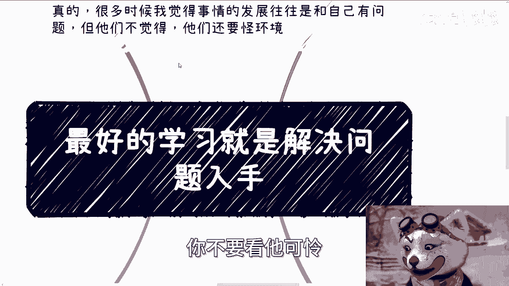
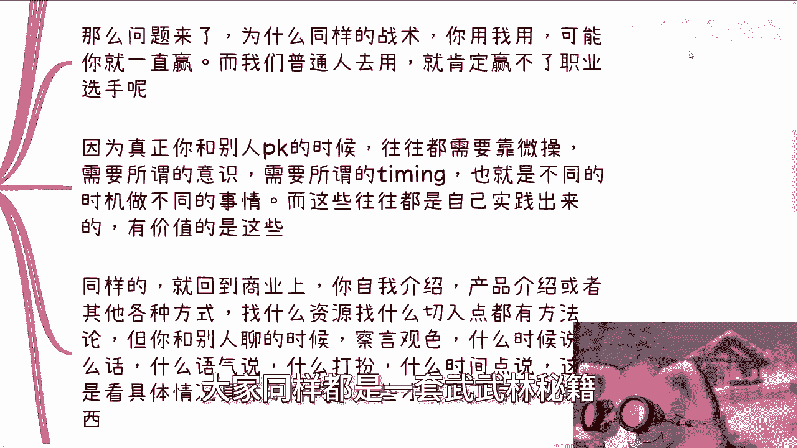
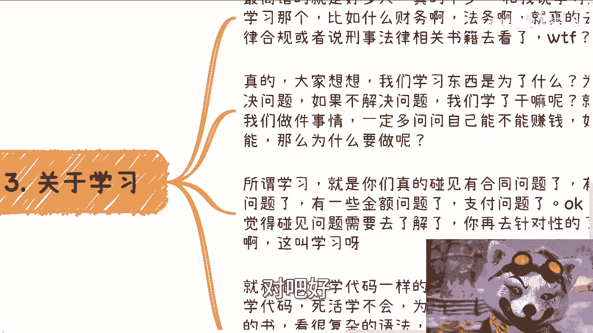
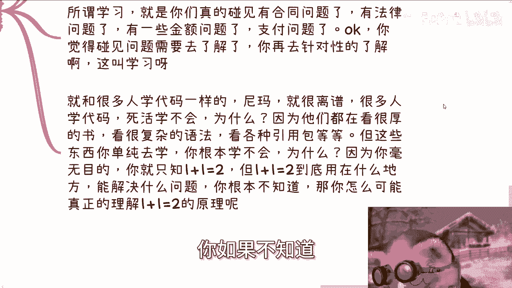
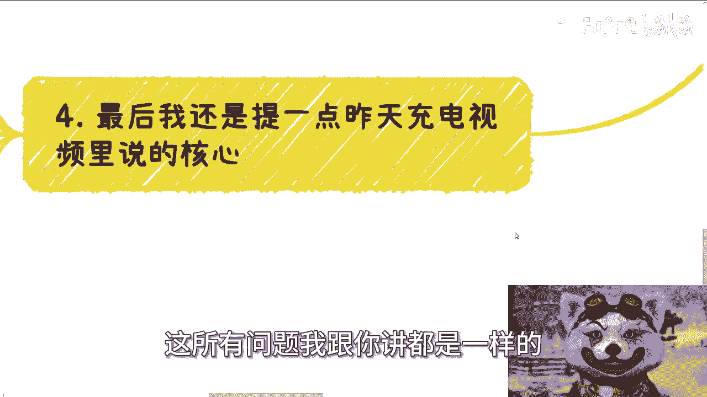
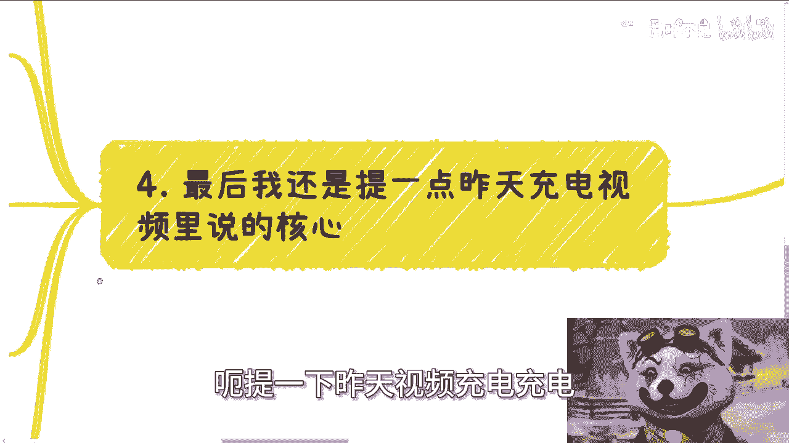
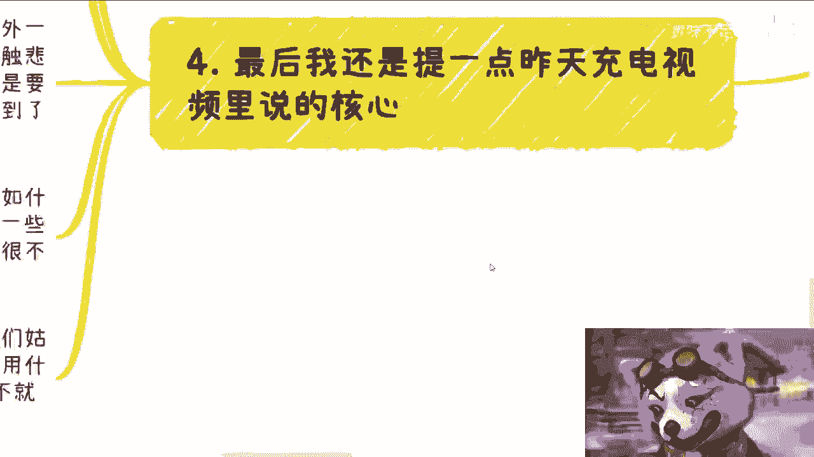
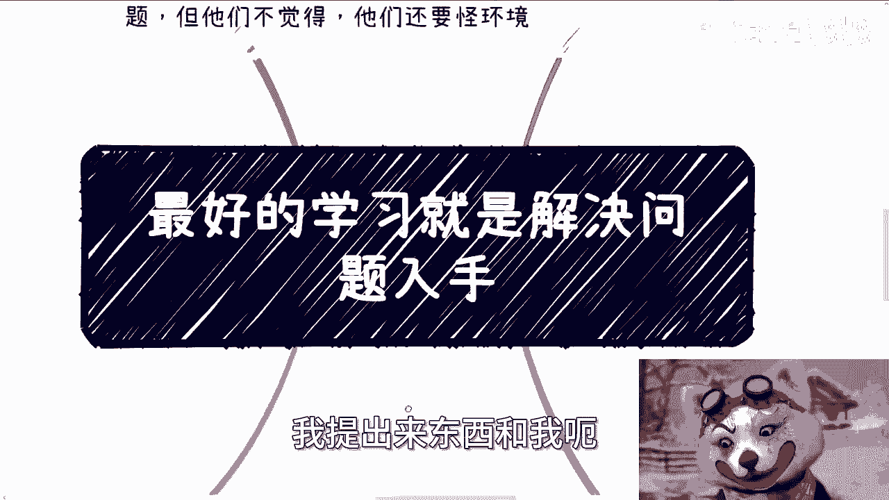
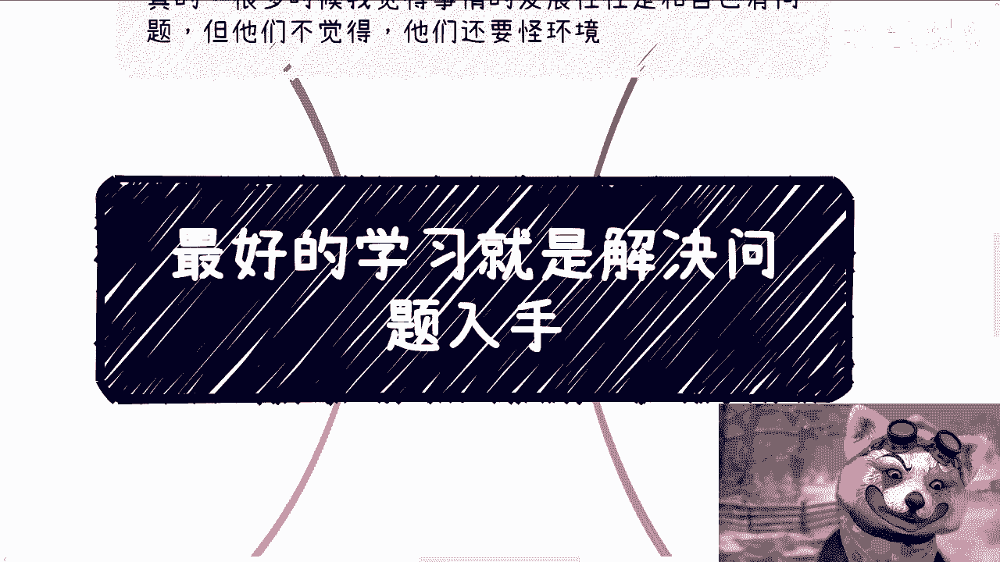

# 最好的学习就是从解决问题入手 - P1 - 赏味不足 - BV1rs42137au

哈喽大家好啊，现在录这个视频真的越来越晚了，因为最近事太多了。

现在是12：40分42了啊，呃我们今天这个主题呢叫做最好的学习方式。

就是解决问题入手，那当然啊就是说我们呃里面所讲的案例啊。

肯定也不止于这个标题这么简单。

但是我们先说一件事情啊，我跟你们这么说，我不得不吐槽一件事情，可怜之人必有可恨之处啊，就是我真的我跟你们讲，很多时候啊，很多人的发展，很多人的样子往往是跟他们自己的问题有关的。

但他们不觉得他们还要怪社会，怪环境什么事情呢，就是昨天晚上有个人咨询，我到今天晚上也就24小时对吧，白天都要上班，那么你想想看你剩下对他来讲还剩下多少时间，然后呢他就来跟我讲说，哎陈老师。

我们这个昨天讲的东西啊，他说我觉得落不了地啊，我他妈首先先不说别的，才多少时间，你跟我说落不了地，你有自驱力吗对吧，你有执行力吗，你要不想做你就不要做，你不想做不要做，你不要来怪我。

跟我有什么关系啊对吧，首先这是第一点，第二点我跟你们讲最最搞笑的一件事情发生了，就跟我说什么，他说陈老师啊，你以前视频里面说过的，如果不接受你的建议，你是可以适当退款的哈，我就在想啊。

我活到现在做事情讲的话啊，我也许是记不清楚具体我以前讲过什么话，但是我整个贯穿的理念是不会变的哦，你跟我说，我有人不接受，我建议我退款这种事情我这辈子做不出来的，对吧好。

我就跟他怎么说，我说你截图，我原话是这么说的，你只要截图我就退对吧，你只要截得出图我就退，你只要证明我说过这句话，我就退，这么简单，没有，对不对，好，然后啊，我给你们讲搞笑了，30秒都不到啊。

就跟我说哎呀我看错了哎呀，我理解错了，哼我我我有时候真的我跟你们讲啊，嗯很多人啊，你不要看他可怜。

你，不要看他，就是说啊好像就是说啊，有很多问题我跟你们这么说，还是那句话，有很多事情你们自己不知道啊，而且有很多人自己的确就很贱。

你懂吗，所以可怜之人必有可恨之处，只不过你有没有发现而已哦，好那么我们继续来说正题啊，第一呃今天说的这个问题呢是非常通用的问题。

首先啊就其实好多人问我怎么学习这个东西，包括就是从什么入手啊，我跟你们讲啊，每次沟通这个问题，我已经不是喷的问题了啊，我他妈都已经就这么就有点哭笑不得了，我眼泪都要笑出来了啊，我跟你们讲啊。

你们还真别笑，大部分人从高校出来，的确什么都不懂啊，对不对啊，那么他们说我要去学习啊，就包括商业上的任何东西，他说我要去学习，或者说跟这个社会有关的所有东西啊，你知道吗，他们的方式是什么呢。

他们的方式就是说哎创老师有什么网站，有什么书啊，有什么方法论啊，而且最好的呢就是跟今天哎来来来找我，说什么什么落不了地的，这种人一样的就最好是伸手挡，就是哎你最好告诉我一步一步怎么走。

对吧啊，好我们就来这么说啊，有一句话大家从小都听到过，叫什么叫天下没有免费的午餐啊，那当然到2024年的，现在收费的午餐也没有卵用，为什么，因为就现在这个市场收费的往往就是被割啊。

你不是说收费的午餐就有用啊，好那么另外一点啊，就如我以前强调过很多次呢，如果真的有网站，真的有书籍，真的有方法论，能够step by step的，就是一步一步的来教你们怎么做的，同时能够让你们赚到钱的。

那么我就说呀是个人都能学呀，是个人都能学的东西，有什么价值呢对吧，因为你从现在的当下情况，你自己判断吧，如果这些东西有用。

那所有老百姓都财务自由了呀，那事实是这样子的啦，啊这点逻辑你们想不明白吗，对不对啊，然后第二点啊，还是那句话啊，有问题先多找找自己问题。

不要抱怨啊，就是说我们来举个例子，你就比如说以前电子竞技。

比如说魔兽争霸，星际争霸对吧，嗯所有的战术对于那些顶级的选手来讲。

是不是说都训练过，或者来说都是模拟过无数遍的吧对吧。

大家都一样嘛，啊那么我们就说啊这种战术的录像或者方法，就像大家寻求的方法论，或者说所谓的书籍或所谓的网站，这种东西你能找得到吗，你也许找得到，但是你找得到的一定都是很通用的，也就是说你找得到。

我也找得到，那么价值就不大好，那么问题来了，为什么同样的战术，同样都找得到的东西，你用我用可能你就一直赢，我就一直输，而我们普通人都去勇救，肯定赢不了职业选手呢，你们有没有想过这个问题。

就就大家同样都是一套武武林秘籍练出来的。

那凭什么有输赢呢，对吧好，这是为什么，这是因为在你真正跟别人pk的时候，往往需要的是微操，往往需要的是游戏当当中的意识，往往需要的是所谓的timing对吧，就是所谓的时机。

你要在不同的时期做出不同的事情，而这些往往是需要你自己实践出来的，没有人能够把这些东西写的很清楚，写到书上面，因为为什么，因为事实每一天发生的事情都是不一样的，你写出来的东西都是有限的对吧。

那同样的我们回到商业上面，你自我介绍也好，产品介绍也好，或者各种其他方式，找什么资源，找什么切入点等等等，你跟别人聊的时候对吧，就是你找任何东西都是有方法论的，但是你跟别人聊的时候察言观色啊。

比如说什么场合说什么话啊，什么这个话用什么语气说啊，你什么打扮啊，什么时间点说啊，这都是要看具体情况具体分析的，就是我们说的kiss by kiss，那这些才是真正有价值的东西。

而你想要的这些真正有价值的东西，怎么可能在一个死板的网站或者书籍，或者anyway任何一个短视频里面能找到呢，不是扯淡吗，对吧，我跟你讲啊，所有人只要想找这个东西的，一律在我的三观认知里面。

我会把他们归为什么，归为就是你就是想白嫖，你知道吗，你就是就就想不劳而获而获，就这么简单对吧好，那么所以啊核心点是什么，就是不停的实践。

否则呢你否则呢你哪来的学习呢，没有啊，对吧好。

那么第三关于学习啊，我跟你讲这点是非常哭笑不得的，就最离谱的是真的好多人我跟你讲不少啊，和我说学习这个学习那个比如说什么财务啊，法务啊，就真的去看什么呃，这个税法对吧，或者看一些法律合规的书。

或者看刑事法律相关的书，我跟你讲，真真牛逼啊，我真的是磕头了啊，我跟你说啊，大家想想看啊，我们学习东西为了什么，为了为了什么，为了解决问题，为了什么，嗯你你不就是为了赚钱吗，为了解决问题啊对吧。

那么我们就说如果不解决问题，我们学了干什么，你吃饱了撑的财务自由啦，对不对，这就好像我们做一件事情，一定要多问问自己能不能赚钱，如果不能，那为什么要做呢对吧，那么我们就在这边说啊。

所所谓啊所谓所那个呃学习，就是你们真的碰到了，比如说有合同的问题啦，有法律的问题啦，有一些金额的问题啦，支付的问题啦，或者说合规的问题啦对吧，OK那么你碰到问题你就去了解，或者你再针对性的去了解。

或者你再针对性的去咨询，或者说如果这个问题已经暴雷了，那么你再去解决这个问题，你不要怕对吧，那么这个叫学习，我跟你们说啊，这就像很多人学代码是一样的，卧槽尼玛真真他妈离谱离谱啊。

就是很多人学代码死活学不会，为什么，因为他们都在看很厚很厚的书，看很复杂的语法，看很复杂的视频，一看卧槽他妈几百张几百个视频对吧，然后什么什么什么20几张都是代码，那他妈的已经投一个头三个大了对吧。

但是你有没有想过这些东西，你单纯去学，你其实学不会，为什么，因为你毫无目的，就比如说你只知道1+1=2，但1+1=2到底用在什么地方，1+1=2到底能解决什么问题，你如果不知道。

那么你怎么真正的理解1+1=2的原理呢，对吧，这就好像我问你1+1=2，对不对对，然后呢对吧，然后呢你知道1+1=2，你知道这件事情之后，你你你能解决什么问题呢，或者你能达到什么目的呢。

你不知道有有卵用了，对不对，其实所有问题我跟你讲都是一样的。

这就好像现在很多人读个硕，读个博出来，你问他哎你这学历读出来语有什么用，不知道，那那他妈的搞笑吗，你不是在对吧好，那么最后一点啊，就是嗯，最后一点就是那个呃，提一下昨天视频充电充电。

视频里面说的核心就是学习是需要时间的，经验是需要时间的，你不愿意实践，我不管你因为你懒，你笨还是你傻啊对吧，还是说怎么样子，只要你不愿意实践，那就是你的问题，你不要抱怨别人，你不要抱怨环境对吧。

读书应该是我给你们这么说，读书应该是大家活到现在碰到过最简单的事情，为什么，因为读书所有的事情是一步一步都是规划好的，你只要无脑往前走，你不需要脑子，你不需要思考，你懂吗，而且你不用解决问题。

也不用赚钱，就是跟着走，你的目的唯一的目的就是毕业，而且这个目的甚至都不是你的目的，只不过是社会灌输给你的目的对吧，所以说你用这种逻辑在社会的这种环境下生存，是生存不下去的，另外一点啊，我跟你们讲。

就是不要盲目的去乐观，也不要盲目的去抵触悲观，说白了啊，谁都不可能预知未来，那么我们就需要更多的关心当下，关心当下自己怎么成长，然后当下自己能赚到这么多少钱，而不是说就是我发现有很多人莫名其妙。

用一些非常乐观的事情作为依据，然后来做一些这个规划，这就好像比如说他们有很多人会觉得哎，我今天拿了一份工作不错对吧，这份工作比如说未来能稳定做10年，那么他用这个逻辑啊，他就会得出一个结论。

说哎我比如说5年后能买个房对吧，怎么样子，我说大哥，你是怎么能得出来未来10年是稳定的呢，我就不明白了对吧，然后他们就很乐观的跟我说，哎陈老师这个这个工作我觉得能能能稳定工作，5年，工作10年。

那他妈大哥你觉得有卵用啊，对不对啊，然后但是这个并不是最重要的，你你们知道吗，最重要最搞笑的事情是什么，就是每当我跟他们说未来不稳定，未来这个不稳定那个不稳定的时候，他们反而跟我说，陈老师。

这我不认可啊，我觉得你太悲观了，哎卧槽大哥，双标不能这么双标的哦，你说未来乐观哦，就是你是对的哦，我说未来悲观，我就是不对的，那凭什么谁都不能预预预料未来，凭什么你是对的，我是不对的，对不对。

就是我们姑且是把未来的这些乐观或悲观，都是当做个风险点，但是你不能把它就是当成一个，就是已经好像落地，已经成为现实的一个依据啊，对吧，就好像我跟你说未来可能不稳定，我只是告诉你这个风险点对吧。

我为了告诉你，你不要把自己什么什么未来工作10年，工作5年这种东西去作为一个依据。

然后说我要去买个房，自己不是有毛病吗。

对不对，所以我跟你们说，真的很多时候啊，我提出来的东西和我额给予大家的一些建议啊。

其实都是从你们角度出发，都是为了大家好，但是很多人他妈的他就不明白，他好像觉得哎呀好像好，陈老师，你你好像就在就在这跟我们说，这个未来不好对吧，未来悲观怎么样子，大哥哈。

谁能预料到到第二天发生什么事情啊，啊你有风险意识，你抗风险难道不对吗，你盲目乐观有意义，完了没有意义的呀，对不对啊。

好吧OK啊，所以说就是说我还是那句话啊，就是所有的学习啊，要用实践，实践的时候呢，碰到问题你再去解决，这就叫学习，而不是说你捧了本书在那边，这他妈才不叫学习，没有卵用的啊，那就这么着吧啊，那个职业规划。

商业规划啊，然后合同啊，分润啊啊啊商业计划书啊，玩白皮书啊，或者其他各个东西啊，包括就是说你自己有什么牌啊，包括你没有什么牌，你希望通过跟我的沟通啊，自己啊能有一些新的这种想法。

或者新的一些这个思想上的突破，或者说希望我通过我的视野，能够给你们一些，更接近于现在社会发展或经济发展的，一些建议的话。

