# 最近中外AI头部对比很火-我们来聊聊这个吧---P1---赏味不足---BV1av421C7YC_n

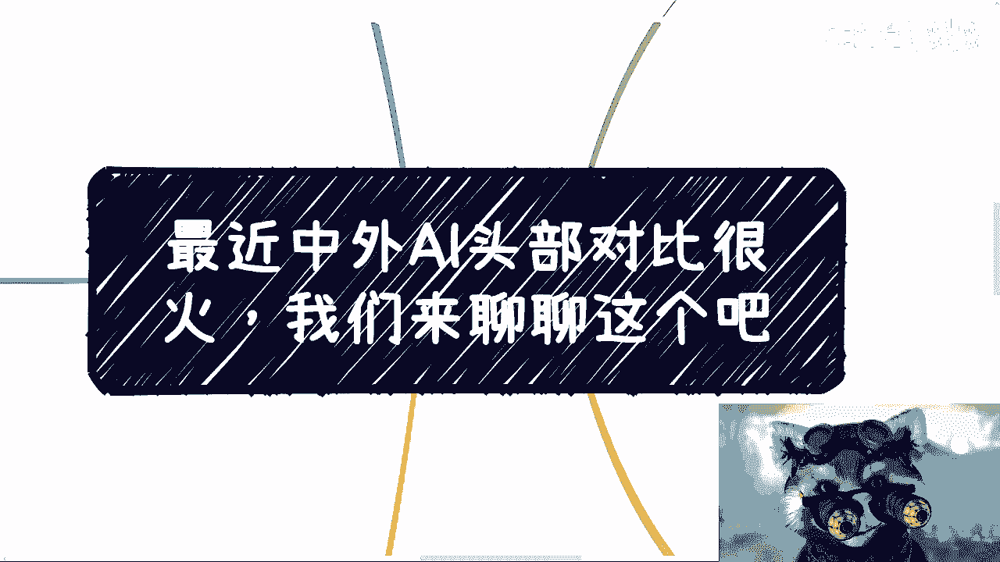

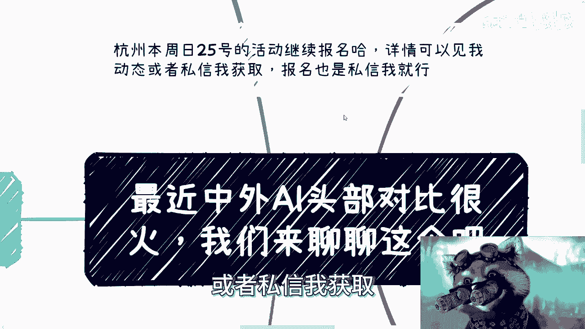

在本节课中，我们将一起探讨近期网络上热议的“中外AI头部人物对比图”现象。我们将从多个角度分析这一事件，理解其背后的商业逻辑、法律与道德边界，并探讨如何更理性地看待知识付费与信息差市场。

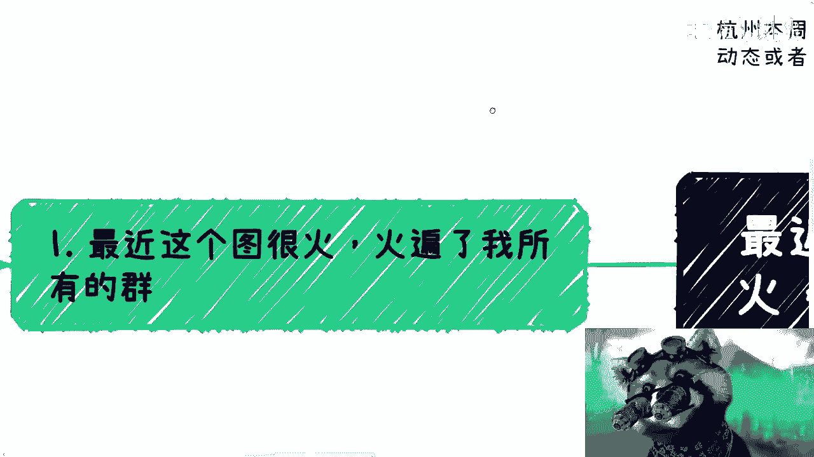

---

## 一、 事件背景与个人观察

最近，一张将国内外AI领域代表人物进行对比的图片在网络上广泛传播。

我本人最初看到这张图时，只认识左边的山姆·奥特曼（Sam Altman）。对于右边的人物，我并不认识。我看到他比了一个“六”的手势和特定的表情，第一反应甚至联想到了某些机构的宣传。

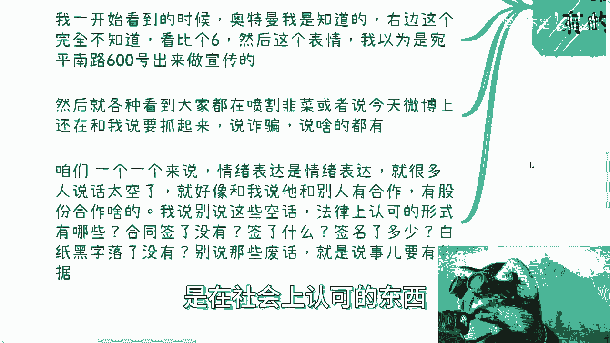

网络上对此有很多情绪化的批评，例如“割韭菜”、“诈骗”等。我想强调的是，情绪表达可以理解，但讨论问题需要依据事实和逻辑。

---

## 二、 讨论问题需要具体依据，而非空谈

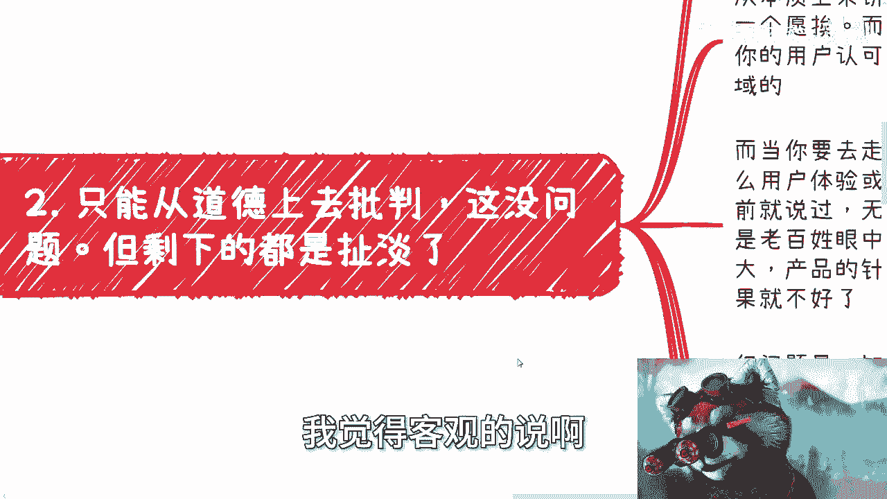

许多人习惯于进行模糊的、缺乏依据的表述。例如，在商业合作中，常说“我们有合作”、“我有股份”。这种说法没有实际意义。

真正重要的是**法律上认可的形式**。你需要说明：合同是否签署？合同甲乙双方是谁？合同上是否有关于股份的白纸黑字条款？工商信息中是否有股权变更记录？

**核心在于**：社会和法律认可的是具体的、可验证的凭证，而非空泛的承诺。用公式表示即：

**有效主张 = 法律/社会认可的凭证**

因此，对于网络上的批评，我们可以从道德层面进行评判，但若上升到法律层面的指控（如“诈骗”），则需要非常审慎，必须要有确凿的证据。

---

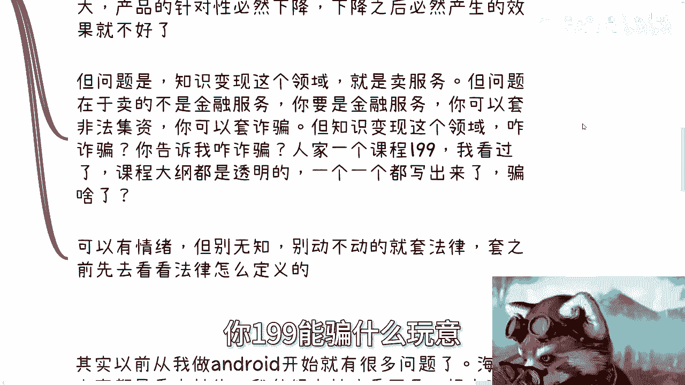

## 三、 知识付费的商业逻辑分析

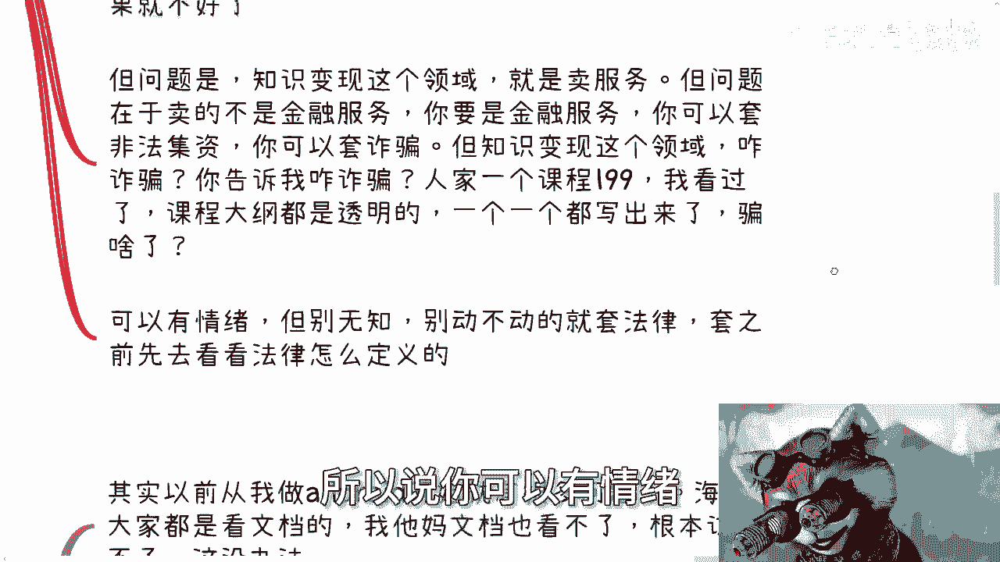

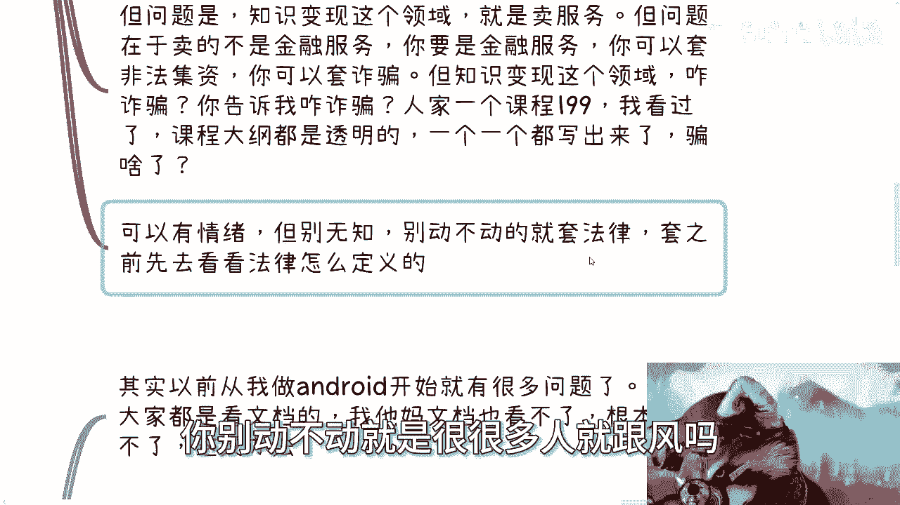

上一节我们强调了讨论需要依据，本节中我们来看看“知识付费”本身的商业逻辑。

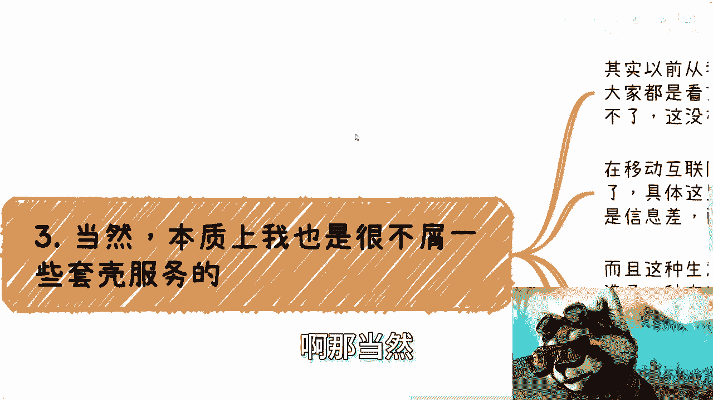

知识变现的本质是**买卖**，一个愿买，一个愿卖。其商业模式可以简化为以下逻辑：

1.  **小规模、高单价模式**：用户数量较少，课程或服务价格较高。这通常意味着内容针对性较强，用户认可度高，服务体验相对可控。
    *   `商业模式A: 用户少 + 价格高 -> 高针对性服务`
2.  **大规模、走量模式**：用户数量极大（几十万、数百万）。一旦走量，产品的个性化和服务体验必然下降，这是无法避免的。
    *   `商业模式B: 用户极多 + 价格低 -> 标准化产品，体验下降`

知识付费卖的是**服务**，而非金融产品。因此，很难直接套用“非法集资”或“诈骗”等针对金融活动的法律条款。例如，一个标价199元、大纲公开的课程，很难在法律上被界定为“诈骗”。当然，道德层面的讨论是另一回事。

---

## 四、 信息差生意的本质

以下是知识付费，尤其是涉及国内外信息差的生意，其核心运作原理：

其本质是利用**海内外的信息差**来营造一种“内部需求”，并进行“内部消化”。这种现象在很多技术领域都出现过，例如早期的安卓开发、Docker技术，以及现在的AI。

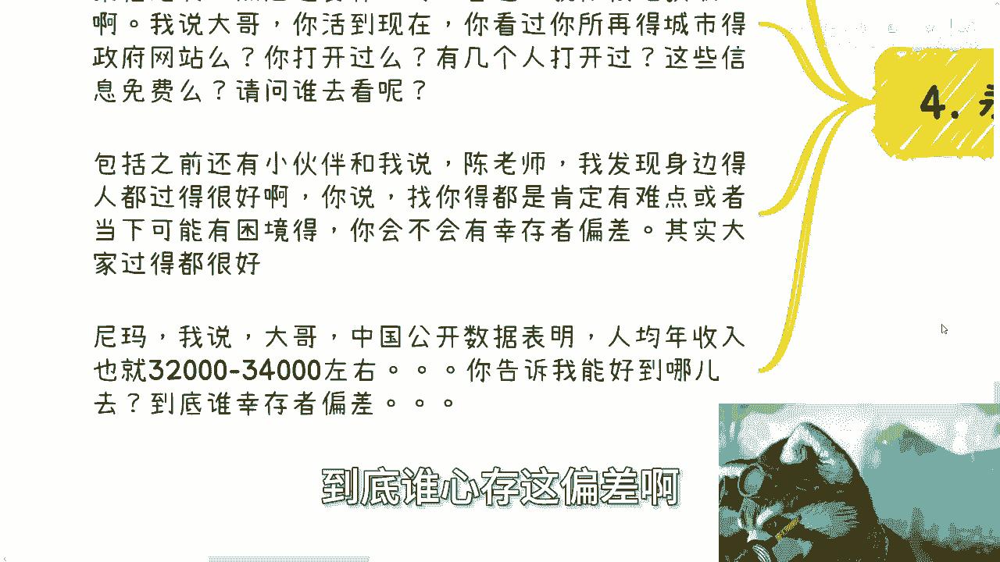

帮助消除信息差，可以是一种商业行为，也可以是一种公益。但无法强迫任何人必须免费提供信息。有免费的渠道存在，并不等于所有人都会主动去搜寻和学习这些信息。这就像很多人买了书不一定读，买了游戏不一定玩一样。

---

## 五、 保持接地气，认清现实

我们需要避免陷入“何不食肉糜”的思维误区。

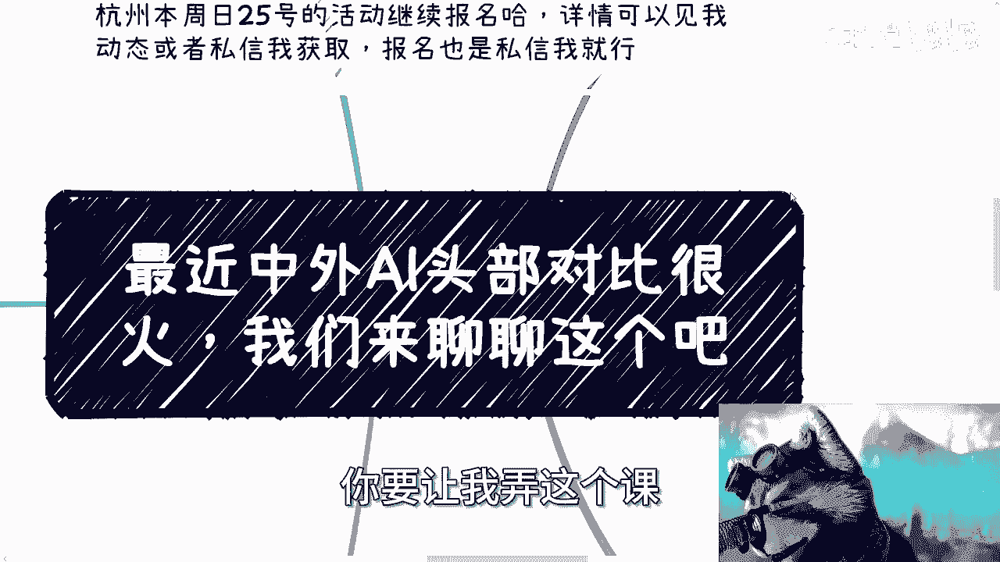

1.  **信息可及性不等于信息获取**：政府政策、技术文档等信息很多都是公开免费的，但问题的关键在于有多少人会主动去查找和阅读。抱怨获取不到信息之前，应先问自己是否真正尝试过去寻找。
2.  **警惕幸存者偏差**：不要因为自己周围的小环境而误判整体情况。例如，中国公开的人均年收入数据大约在3.2万至3.4万元人民币。认识到世界的参差，理解不同人群可能生活在不同的“平行世界”中，非常重要。

---

## 六、 总结与建议

本节课中，我们一起学习了如何理性分析“中外AI头部对比”这一热点现象。

1.  **理性看待，分清边界**：可以道德批判，但法律指控需谨慎。讨论应基于事实和具体依据，而非情绪和空谈。
2.  **理解商业本质**：知识付费是一种市场行为，其体验随用户规模扩大而稀释是普遍规律。它售卖的是服务，与金融诈骗有本质区别。
3.  **认清信息差现实**：很多生意建立在信息不对称之上。有免费信息不代表人人会用，这是市场的现实。
4.  **专注自身，避免无谓比较**：不必过度羡慕或贬低他人。重要的是关注自身的执行力、产品和服务。就像我自知没有能力做那种大规模的营销，这并非酸葡萄心理，而是清晰的自我认知。
5.  **保持开阔视野**：这类现象在每个技术周期都会出现，并非特例。多了解真实的社会、市场和不同阶层的情况，避免被短视频时代的跟风情绪所裹挟。

最后，这类事件可以当作一个观察社会的案例或谈资，但不必投入过多情绪。多提升自己的认知和行动力，才是更重要的。