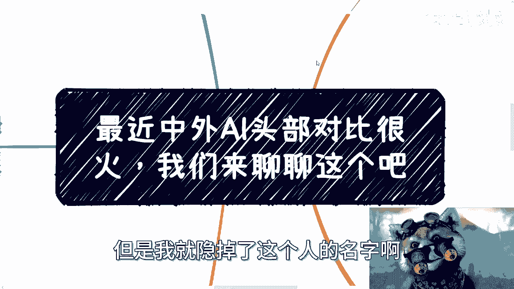
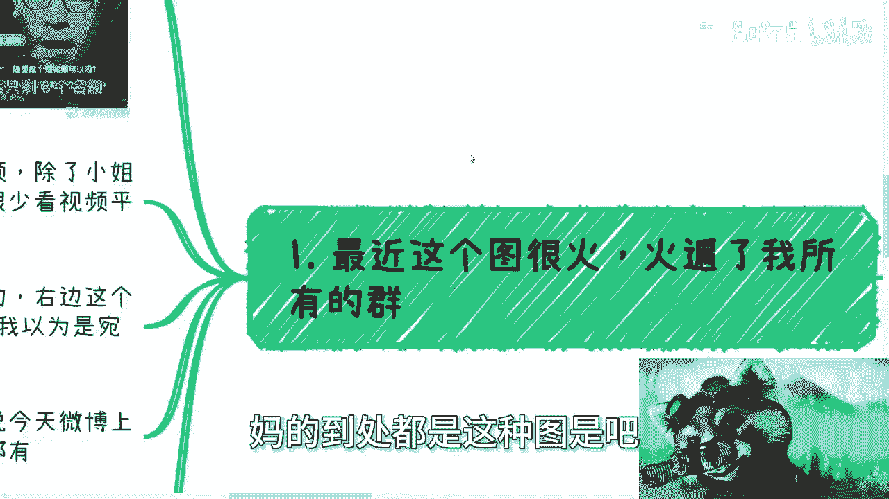
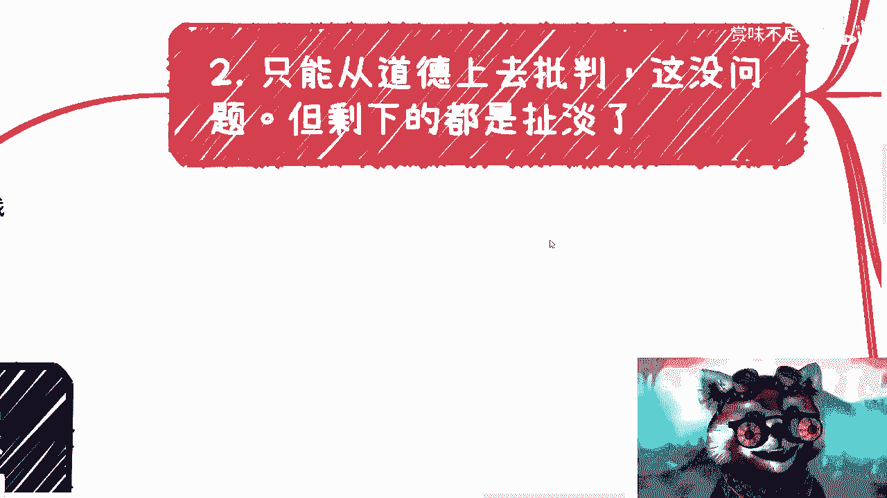
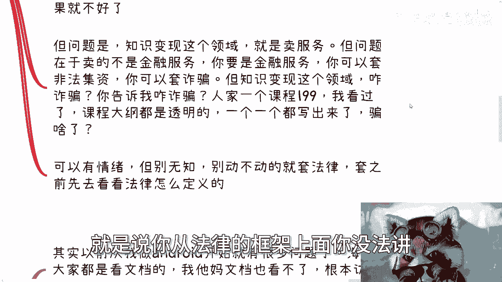
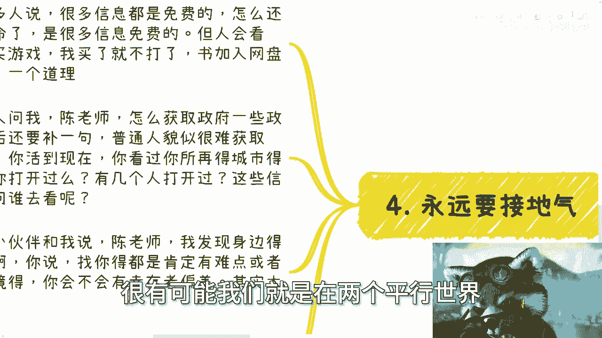
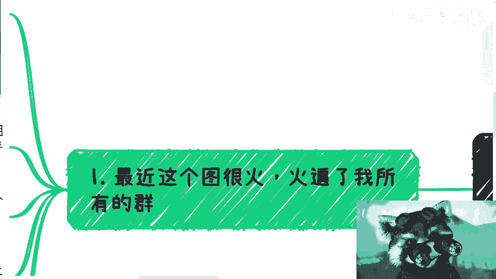
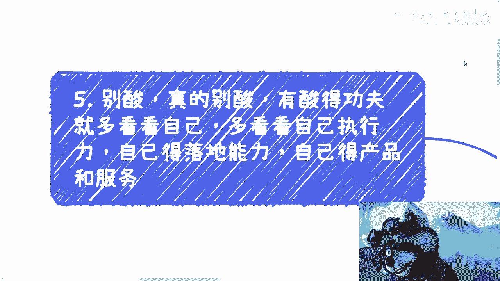
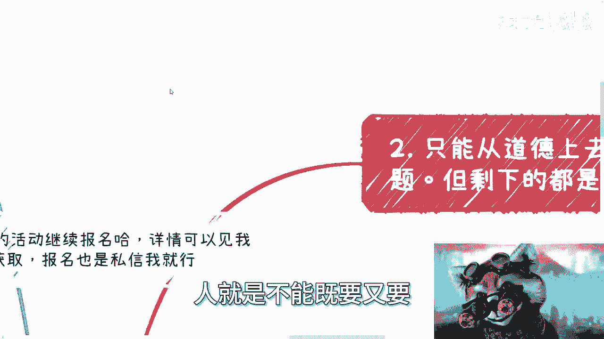
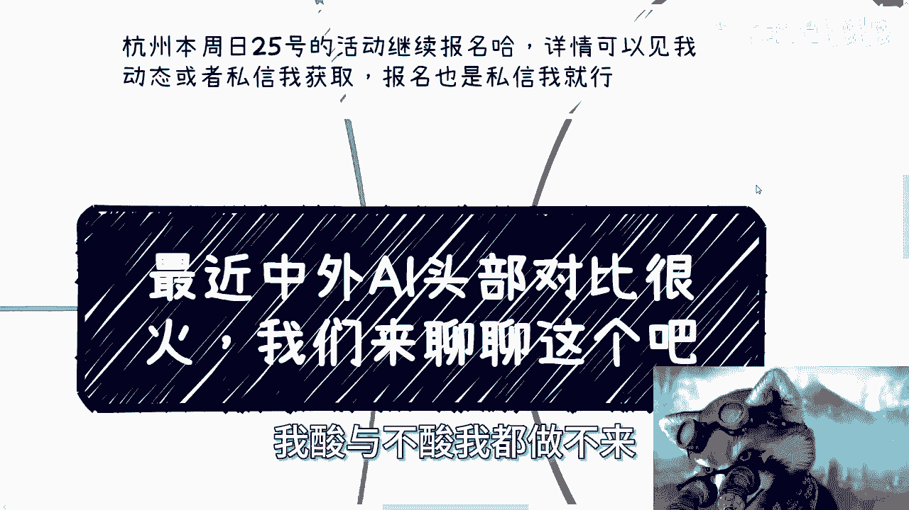
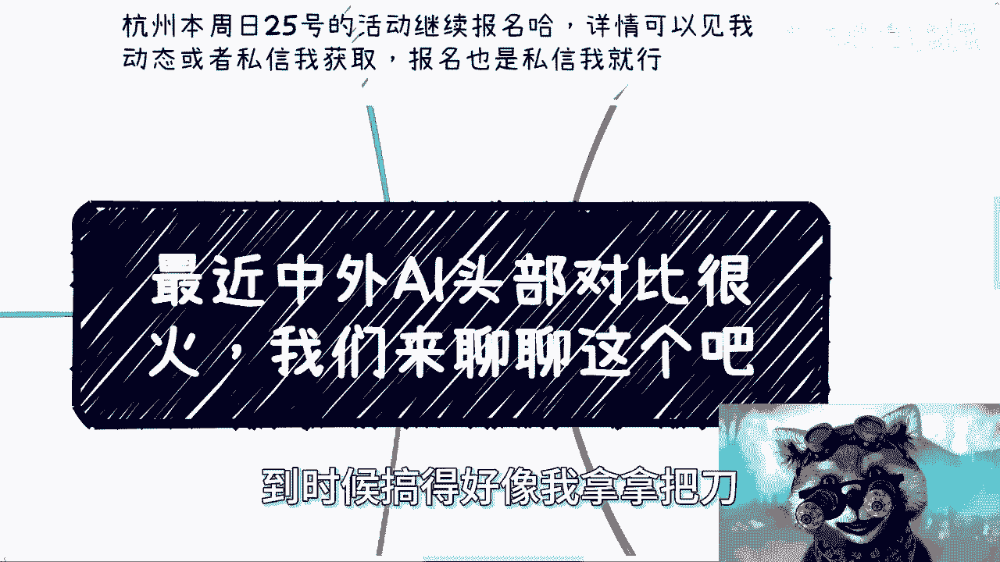

# 最近中外AI头部对比很火，我们来聊聊这个吧 - P1 - 赏味不足 - BV1av421C7YC

嗯好啊，大家好啊，这个其实我不是很想说这个事，但是嗯好像也可以说说问题不大，但是我就掉了这个人的名字啊。

免得还有人要说我蹭流量是吧，呃首先第一点啊，这个本周25号杭州这个活动继续报名好吧，详情的话可以进我动态或者私信我获取报名。

也私信我啊，那么今天这个东西大家也都知道了吧，最近这个中外AI头部对比那张图很火啊。

我们来聊一聊这个啊，呃首先最近这个图很火啊。

我不想看，我也得看，他妈的到处都是这张图是吧。

NO NO NO对吧啊，哎我说实话我这个不黑不吹啊，就说真的奥特曼我是知道的对吧，那因为我这个的确呢平时也不太看抖音啊，也不太上这个上网络上的视频，网络视频视频我也看了啊，除了小姐姐二次元游戏直播以外。

别的我基本上都很少看，因为你们也知道对我这个态度很明确，他妈网上都是假的信息，也没啥真的信息，或者都是咀嚼过的那种对吧，稀巴烂的信息也没啥好看的啊，所以我说实话我第一眼看到这图，我是真不认识啊。

我这我这我跟你讲真的不认识啊，我第一眼看到奥特曼，我是知道的，右边我是真不认识，你看他比了个六，然后又是这个表情啊，我真的以为是宛平南路600号出来做宣传的，不是真的，不吹啊，不瞎说啊，我他妈第一眼。

我就觉得是不是网平南路600号出来的啊，然后就是各种看到大家都在喷割韭菜啊，然后包括今天微博上还有人跟我说，要抓起来说诈骗啊，说啥的都有啊，我跟你这么说啊，首先啊咱一个来讲情绪表达归情绪表达呃。

中国到今天为止啊，我这么跟你们说，大部分的人呢说话就太空啊，就是你情绪表达是情绪表达，但是你说话要有依据，要实际，你就像很多人跟我说，他说陈老师我跟别人有合作啊，有股份合作，我有股份的。

我说你说这些话都是屁话啊，我跟你们讲真的，我现在做咨询啊，我说的最多一句话是什么，就是你们说的都是屁话，为什么，我说你就告诉我法律上认可的形式是什么，你们有哪些法律上认可的形式是有过的，跟我说清楚。

跟我说，你跟他有没有合作，有没有合作，这几个字有卵用啊对吧，你就告诉我你合同签了没有，签了什么合同，合同上面合同上面到底是甲方，乙方是谁，然后这个合同上面有没有明确的，这个股份的白纸黑字对吧。

然后你比如说在其他上面，或者别的东西有没有股份的变更对吧，你要告诉我的是在法律上认可的东西，是在社会上认可的东西。

你就跟我说，老师我跟别人有合作，我有股份的合作，我有股份的这个这个有一定股份，这些话有他妈屁用啊对吧，这些都是废话啊，这就像很多人就像今天早上跟我说的啊，说他割韭菜啊，说要抓起来。

真的就唉真的有时候你有时候啊你们想想看啊。

就是我们图一时之快去喷一下，这没问题，但是你不要想了，我们如果也一直去喷他对吧，你喷一两次就算了，你要一直去喷，那那我们和组成了这个扭曲的世界，扭曲了这个社会的很多人有什么区别呢，就没有区别了。

对吧啊，然后第二点就是说我觉得客观的说啊。

你只能从道德上去批判，这没问题，但是剩下的我觉得就真的扯淡了啊，就是说你说是个骗子，可不可以可以啊，你说割韭菜可以啊，你说蹭流量可以啊，你说跟人家奥特曼比屁都不是可以啊，没问题啊，这些都对，没毛病啊。

但是你要说在社会法律和真正的呃，就是说这个框架上面，你要去说，我跟你讲啊，这就离谱了啊，为什么，因为你从本质上来讲，知识变现的逻辑是什么，是买卖，一个买一个卖，对不对好，那么你一个愿打一个愿挨。

而区别在于当数量少的时候，那么这个知识变现或者呢我这里前提少写一个，就说当数量少的时候，或者当它的价格是比较啊，就是正常的时候，那么往往说明他的用户认可度是比较高的啊，或者来说他的服务是打细分领域的。

好吧哦好，那么但是如果你一旦去走量了啊，一旦你去走量，比如说铺市场了啊，那么本来我们打个比方，你这个产品就付费就500个人，100个1000个人，我觉得没问题了，没问题的，你控得住的。

至少能带来比较高比例的这种服务，但是你一旦走量，一旦走量，比如说几百万用户啊，几10万用户，几千万用户，那必然到那个时候就没有什么用户体验，或者用户针对性可言了对吧，因为这个时候我以前其实说过。

就是我我在之前的视频里面，因为很多人可能之前都不看啊，就之前有些视频里面我说的很清楚，就是不管你做的多好，只要你一走量，哪怕你今天不要说什么清华博士了，你今天就算是他妈诺贝尔奖得主，你一旦走量。

本质上你就是老百姓眼中的歌，为什么，因为这没有办法的呀，你今天就告诉我，你说我就是想通过一套方案给所有人去卖，然后所有人买了之后呢，我说你你说我还希望所有人买了之后，要有很好的用户体验。

这他妈不是在做梦吗，对不对，就是这是一个不现实的事情，你非要把它变成现实，那么结果是什么，就是产品的针对性必然下降，产品的体验也必然下降，那么必然下降之后，也就会产生必然的不好的效果，这没有办法的事情。

对吧好，那么但问题是什么，问题是知识变现这个领域呢，它是卖服务的，但问题在于他卖的不是金融服务啊，你今天他要是但凡卖的是金融服务，你可以套非法集资，你也可以套诈骗，我觉得这没问题哦。

就是你有这个可能性和切入点去套，但是知识变现这个领域，我就问啊，你告诉我人家怎么诈骗他一个课程，199我也看过了，我也看过他大纲了，大纲这么透明，一个一个写出来，你199怎么个骗法对吧。

当然我在这个地方，我先不论它还有一个2980的课对吧，我也看到了我，我我没仔细看，但是我先不论他2980割不割啊，或者骗不骗，但至少199这个东西，但骗不了你，199能骗什么玩意。

你跟我讲对吧，你于情于理，你都没法说他屁。

哦就是说你从法律的框架上面。

你没法讲，你说道德层面没问题啊，没问题啊，所以说你可以有情绪。

但别不能无知啊，你别动不动就是很很多人就跟风嘛。

套法律啊，套怎么样怎么样怎么样啊，这个诈骗要怎么样，你就炸个炸个屁呀，炸他妈动不动炸是吧啊，那当然本质上呢我他这里面还有一些套壳的服。

这个东西不太方便讲啊，就比如说因为我以前是最早我是做安卓的啊，你但凡做过安卓，其实很明白，就是最早的时候大家学习都是只看google文档的，海外大家只看文档，我就告诉你们，我他妈在国内我文档看不了。

我根本访问不了，你让我怎么办啊，那么在互联网，移动互联网领域，其实已经在在很久之前，就是2011年，2012年，其实很久之前就出现了很多套壳的产品，或者甚至来说中国当下有非常多的服务。

其实就是所谓的抄袭海外的这个产品出来，但具体这边就不方便讲了，懂得自然懂啊，所以其实它本质上就是信息差，而且是利用海内外的信息差做的生意，而且这种生意我跟你讲很有意思。

它更像就是说故意营造了一种内部需求，然后进行内部消化的感觉对吧，懂得自然懂，我在说什么对吧啊，包括就是说我自从做了安卓之后，可能若若干年之后，我再用docker。

用docker的时候也出现了这种感觉对吧，再后来就是AI，那当然啊，你说帮助大家消除这种海内外的信息差，是不是一种义务，我觉得你没法讲，因为你说那个199他这种行为是不是消除，其实也算消除哦。

只不过就是说只不过就是说其实很多人，他是可以通过免费方式渠道去去去消除的，那还是回到那个问题上面，你可以道德层面说，为什么他不免费的跟给大家，或者他不告诉大家这个东西有免费的。

但是你不能说他他他他不免费就不对呀，对吧，你你你不能强迫人家啊，那么第四点就是什么，就是永远我们要接地气，你看啊，我看到微博上很多人说，他说哎呀很多信息都是免费的啊，怎么还有这么多啊，愿意付钱。

我跟你讲要命诶，诶信息免费的又如何呢，重要的不是信息免费，重要的是人会不会去看，你明白吗，哎奇了怪来，有免费的，怎么滴了，有免费的，你说啊这个他就一定会自己去搜吗，这就好像我买了很多游戏。

我买了就一定要打吗对吧，你说我下载了很多电子书，我下载了就一定要看吗是吧，你你是你，你可以觉得他们是，但但问题是你不能强迫人家对吧，然后第二点是什么，就像很多人每次很多人问我。

他说陈老师怎么获取一些政府一些的那个，政策信息啊，然后非要他们还要补充一句，他说哎我觉得普通人很难去获取，我怎么回答，我说大哥，我就问你，你活到现在20多年，30多年，你有看过你所在城市的政府网站吗。

有吗啊，你别说有没有人，你打开过吗啊有几个人打开过的，哎你要我说这些信息都是免费的呀，那问问题谁去看呢，哎我奇了怪了，谁去看呢对吧，你会发现很多人一边跟我抱怨，哎呀陈老师这个这个这个政府信息。

我get不到对吧，我觉得我也很想知道为什么我找不到什么，找不到，你找过没有啊，啊你看过没有啊，就找不到人，不就这个样子吗，啊，然后还有什么，包括之前还有小伙伴跟我说了。

他说陈老师我发现身边很多人过得很好，他说什么，他说诶有没有可能找你咨询的，都是当下有困难的哦，或者说有自己难点的啊，他说你会不会因为咨询时间长了，有幸存者偏差啊，然后他说我发现我身边人过得都很好，哼。

我说大哥，我说大大哥啊，大哥大啊，我说中国公开数据表明，人均年收入就3万2到3万4，你告诉我能好到哪去，睁开你的眼睛看看啊，能好到哪去啊，到底谁幸存者偏差啊。

真真的，我跟你们讲，真的还是那句话，人与人的差别比人与猪的差别都要大啊，我们是活在一个国家，我们可能也活在一个城市，甚至你们跟我活在一个区，但不好意思，很有可能我们就是在两个平行世界。

最后就是我想说的是什么呢，不要去酸，没啥好酸的对吧，我我曾经视频里面也说过，有嫉妒的心理，有羡慕的心理，有崇拜的心理，这是人之常情，但是两点，第一呢，我们不要花太多的时间浪费在羡慕和嫉妒上面。

第二就是我们更不要去背后捅人家，没有必要的，你说说白了大家都是做生意对吧，又又没杀人放火，这不是什么事呀，是啊，所以我觉得本质上就是你要多看看自己，多看看自己的执行力，多看看自己落地能力。

自己的产品和服务，不要把眼睛总看别人身上，没啥好说的，真的没啥好说的，就你你要我说就是我觉得是这样的。

我一直就说就说人就是不能既要又要你。

比如说有人问我，他说陈老师，那你怎么不割呢，对吧，我就会告诉他，不好意思，我没这本事，我真没这本事啊，你要让我弄这个课。

我可能弄得出来，但是你要让我像他这样做营销，我真做不来，我承认我做不来是吧，就是你说我酸不酸，我酸与不酸我都做不来。

没有用啊，我我我承认就没这个本事了，怎么办呢，啊对吧，所以就是哎呀怎么讲呢，就是大家就当个故事听对吧，大家就当个瓜来吃，大家就当个笑话来看，也不重要的呀，真不重要的，就就这么回事儿。

因为这个事情你们你们你们把它抽象出来看，这个事情又不是只有AI上发生，每个每每每就是每个周期，每个阶段甚至每个技术他都这样子的，只不过就是只不过他这次可能出圈了啊，很多人可能关注了。

那还有很多事情不知道的，就像我以前说的，你们所谓看到的都是成功的，那背后可能还有赚不到，没有赚这么多钱的也成功的，然后说后面还有很多尸体很多的那种失败者，他可能赔钱的对吧。

那其实就是只不过大家没关注到啊，然后现在就好像啊这又开始讨论了，然后我看到一群人在那边啊，讨论说什么什么哎呀，知识变现怎么样子，知识变现怎么样子，知识变现怎么了呢，怎么了呢，那知识变现从我跟你们这么说。

从从从有自媒体，有有公众号那个时候开始，公众号最早的时候不就是有打赏嘛对吧，有那种付费嘛，从那个时候就是变性了，但是一开始的时候你们真的你们去往前看看，在知识变现这个概念刚出来前一两年的时候。

有多少人说的，没有多少人说的呀，对不对，怎么了呢，我觉得这个很友善的，就这样，那你知道吗，我给你们讲，讲到最后一点，就是你知道之前还有人问我，他说你怎么看这个东西，我说大哥哎，连爱因斯坦的大脑都能卖。

你来跟我谈这个东西，你不觉得课程比爱因斯坦，爱因斯坦的大脑靠谱多了吗，哈啊他妈搞笑了，真的是诈骗妈，爱因斯坦的大脑都他妈还没诈骗呢，你妈他诈骗唉，就这样吧啊我觉得还是那句话啊，多了解这个社会。

多了解这个国家，多了解这个市场，多了解这个各个地区，各个不同的上上下下的东西啊，不要就是老是短视频了，短视频长短视频短啊，别人说这个你就跟风，别人说那你就跟风啊，没用的没用的行，就这么着吧啊。

然后那个杭州活动好吧，报名的你就继续找我啊，然后你们在商业上啊，职业上或者说一些比如说商业计划书啊，股份分配啊，或股权分配或者其他的一些东西有问题的，或者说你们觉得也想从我这边，得到更多的一些信息了啊。

那么你们可以整理好问题，我们再做咨询好吧，不强求不强求啊，不要不要。

