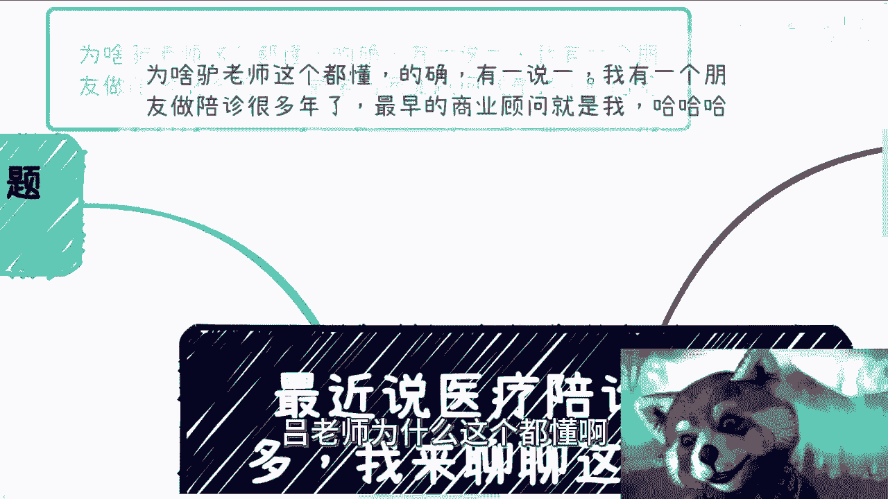
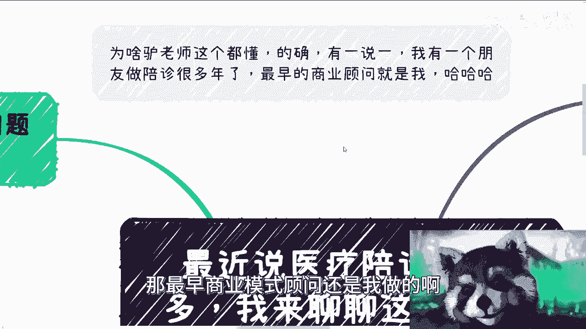
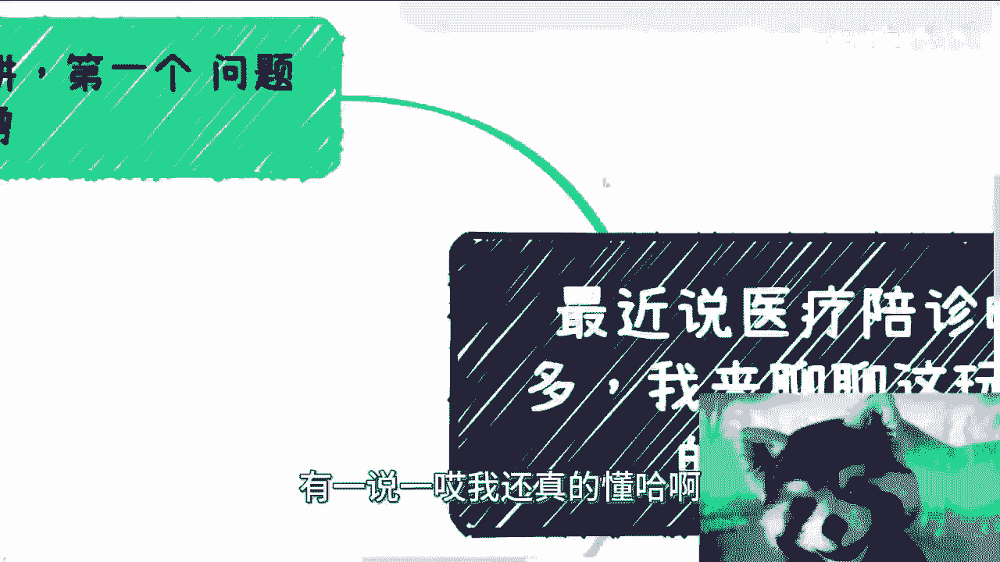
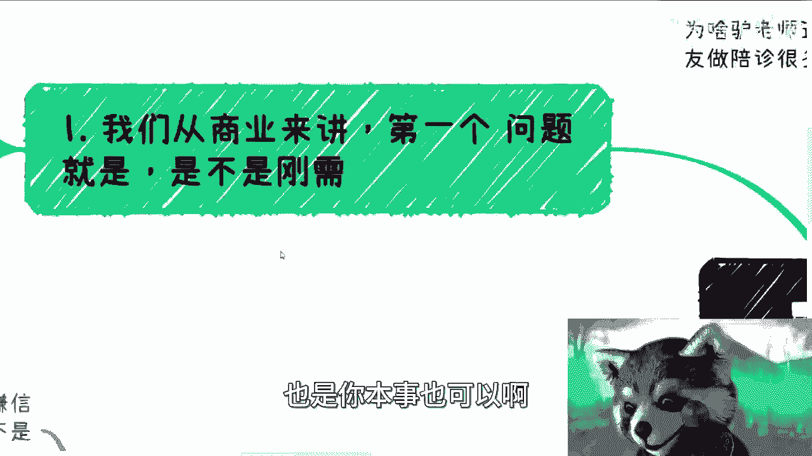
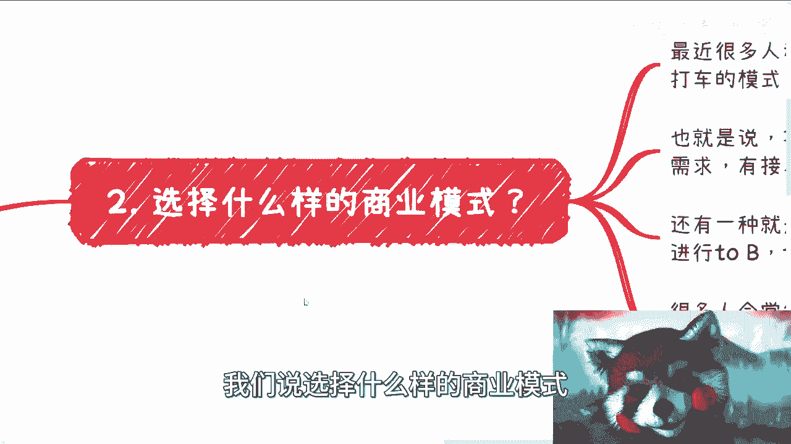
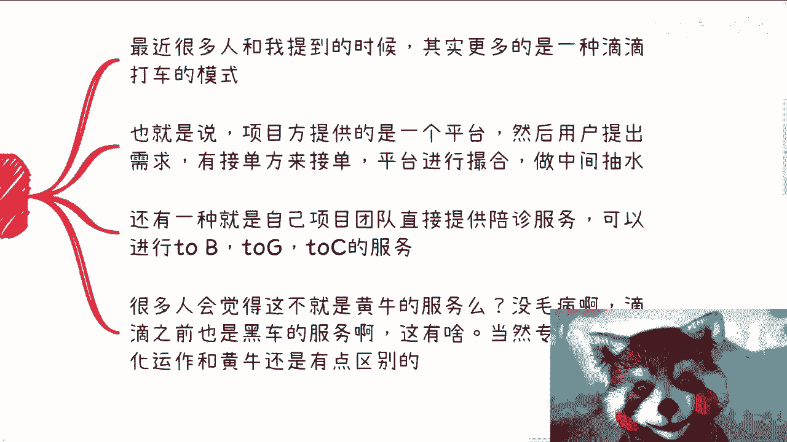
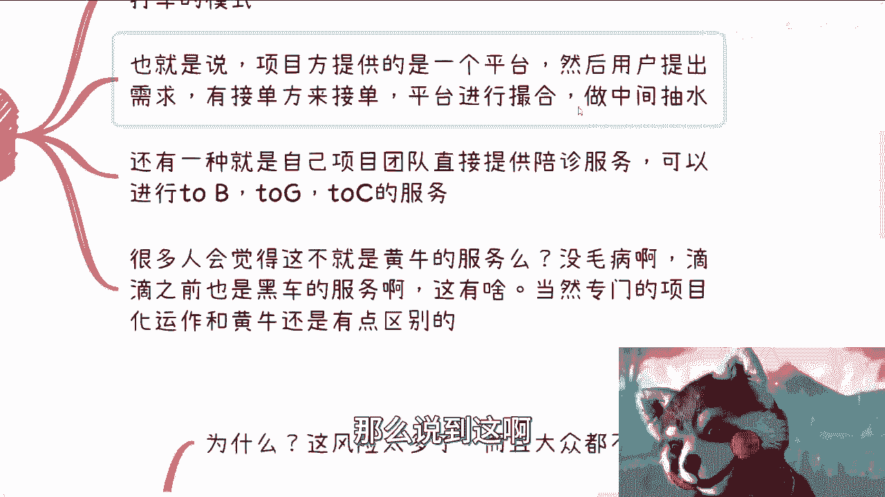
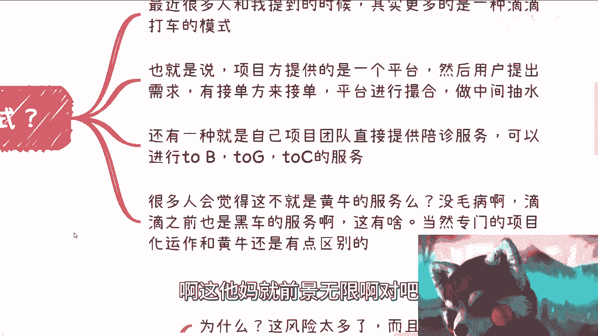

# 医疗陪诊业务商业逻辑分析 🏥 - P1

在本节课中，我们将要学习医疗陪诊业务的商业逻辑。我们将从需求分析、商业模式、潜在风险等多个维度进行拆解，帮助初学者理解这个看似简单实则复杂的行业。

---

## 概述：什么是医疗陪诊？

医疗陪诊是指为患者，特别是行动不便、异地就医或无人陪同的患者，提供在医院期间的陪伴、引导、代办手续等服务。最近咨询这个业务的人很多，我们来看看其背后的商业逻辑。

我有一位朋友从事陪诊业务多年，最早的商业模式顾问工作是由我完成的。因此，我对这个领域有一定了解。

---

## 第一部分：需求分析——这是“刚需”吗？

上一节我们介绍了陪诊的基本概念，本节中我们来看看其市场需求的核心——它是否是“刚需”。

所有商业项目的起点，都是先判断目标需求是否为“刚需”。无论这个需求是真实存在，还是可以被塑造为大众认可的“刚需”，这都是商业成功的前提。

**核心公式：**
`商业可行性 = 需求强度(刚需) × 市场规模`

以下是关于陪诊需求的具体分析：

1.  **从某种意义上讲，它是刚需，且未来需求会增长。** 这与中国社会老龄化、优质医疗资源稀缺、年轻人工作繁忙无法分身等因素有关。当父母异地生病，或自己工作与紧急病情冲突时，陪诊成为一种无奈但必要的选择。
2.  **陪诊服务覆盖的不仅是“小毛小病”。** 许多疾病，尤其是需要手术、长期治疗或行动不便的情况，都切实需要陪诊。
3.  **它是一种“低频刚需”。** 我们不能指望人们经常生病。因此，陪诊需求是低频次的。但只要人口基数足够大（例如中国的14亿人口），低频需求也能汇聚成巨大的市场总容量。
4.  **低频刚需意味着必须拓展业务。** 单纯的陪诊服务难以形成坚固的商业闭环和竞争护城河。若想将业务做大做强，必须考虑扩展相关的服务或产品。

---

## 第二部分：常见的商业模式

在明确了陪诊是一种低频刚需后，我们来看看市场上主流的两种商业模式。

最近向我咨询的人，大多提到的是类似“滴滴打车”的撮合平台模式。

以下是两种主要模式：

*   **模式一：撮合平台（类似滴滴）**
    *   **运作方式：** 项目方提供平台，用户发布陪诊需求（如指定医院、时间），由自由接单方（陪诊员）抢单或接单。平台作为中间方进行撮合并抽成。
    *   **公式：** `平台收入 ≈ 订单流水 × 抽成比例`

*   **模式二：自营服务团队**
    *   **运作方式：** 项目方自己组建或签约专职陪诊团队，通过自有小程序、APP或网站直接向客户（C端、企业端、政府端）提供服务。客户在平台上选择服务人员或套餐。
    *   **特点：** 服务更定向、可控，便于进行标准化管理和面向B端（企业）/G端（政府）的定制化服务。

很多人初听会觉得这不过是“黄牛服务”。但商业的意义在于能否将服务**正规化、项目化运作**，这与无序的“黄牛”有本质区别。

---

## 第三部分：潜在风险与挑战

了解了商业模式，我们更需要冷静看待其背后的风险。这也是我通常不建议普通人轻易涉足此行业的原因。

商业上的坑往往与技术无关，而与法律、人性、财务合规性紧密相连。以下是陪诊业务的主要风险点：

1.  **安全与责任风险**
    *   陪诊过程中，若患者摔倒、用药错误、发生医疗意外，责任如何界定？极易形成患者、医院、陪诊员之间的“三角纠纷”，平台很难完全免责。仅靠用户协议中的免责声明，一旦出事，声誉将严重受损。

2.  **医疗隐私泄露风险**
    *   医疗信息高度敏感。陪诊员可能接触到患者病历、病情等隐私。如何防止信息泄露或被不当利用？一旦发生隐私泄露事件，业务将面临巨大信任危机。

3.  **财务与法律合规风险**
    *   **发票问题：** 服务费用以什么名目开具发票？税率是多少？很多创业者并未考虑。
    *   **服务定价：** 定价过高易被斥为“发国难财”；定价过低则无法覆盖成本与风险。定价缺乏透明标准。
    *   **肢体接触与性骚扰界定：** 陪护服务难免有肢体接触，如何规范服务流程，防止并清晰界定性骚扰投诉？

4.  **盈利模式不清晰**
    *   声称“赚快钱”的创业者，往往说不清客单价、利润率、成本结构和真正的盈利点。这个行业的利润可能远不如想象中丰厚。

**核心观点：** 一个行业如果参与的人少，通常不是因为别人没想到，而是因为它存在难以合规、利益链垄断或需要极高门槛等问题。技术实现（如开发一个APP）是这个行业中最简单的环节。

---

## 第四部分：正确的商业思考方式

本节我们将总结，面对一个商业想法时，应该遵循怎样的思考路径。

很多人一上来就热衷于规划“功能列表”，这是本末倒置的。正确的商业思考应遵循以下顺序：

1.  **深入了解行业与痛点：** 市场真正的需求是什么？现有解决方案有何不足？
2.  **分析盈利模式：** 钱从哪里赚？成本结构如何？利润空间多大？
3.  **评估合规与风险：** 业务是否合法？如何规避上述各类风险？护城河在哪里？
4.  **计算投入产出比：** 资源投入与预期回报是否匹配？
5.  **最后才考虑技术实现：** 对于大部分此类应用，技术是成熟的拼凑，而非核心障碍。

思考商业，切忌“拍脑袋”觉得自己发现了蓝海。自我认知清晰，系统性地分析问题，才是关键。

---

## 总结

本节课中我们一起学习了医疗陪诊业务的商业逻辑。

我们首先分析了其作为 **“低频刚需”** 的市场特性，然后探讨了 **撮合平台** 和 **自营服务** 两种主流商业模式。更重要的是，我们深入剖析了该业务面临的 **安全责任、隐私合规、财务法律** 等多重风险，这些风险远大于技术挑战。最后，我们强调了正确的商业思考应始于 **市场、盈利与合规分析**，而非急于进行技术开发。

希望本次分析能帮助大家举一反三，建立起更系统、更务实的商业分析框架。