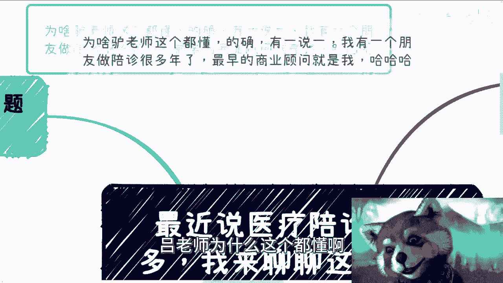
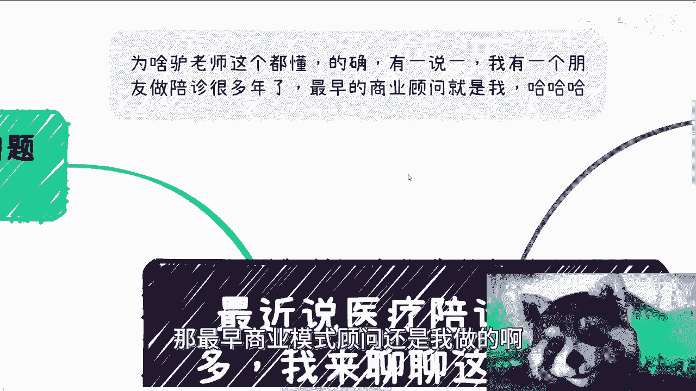

# 最近和我提医疗陪诊的很多，我们来看看这个业务的商业逻辑 - P1 - 赏味不足 - BV14V411c7zj

嗯好啊对吧，这个最近我跟你们讲啊，最近这个好多人这个咨询的时候呢，跟我提到了这个陪诊的事情，我我怎么说呢，我只能说这个东西其实很复杂啊，没有大家想的这么容易啊，我正好可以跟大家聊一下，那这个事情呢。

那很多人要说了啊，吕老师为什么这个都懂啊。

我跟你们讲啊，不好意思，哎真不好意思，你要说别的东西我还真不懂啊，但你要说他陪诊吧，我跟你讲啊，我有个朋友做陪诊很多年了，最早商业模式顾问还是我做的啊。

有一说一我还真的懂哈。

首先啊我们先从商业商业逻辑来讲啊，第一个问题就是说我们说过啊，所有的商业，如果我们想做第一个问题是，你先问这东西是不是刚需啊，呃我们先不管啊，就是说你说这个刚需是真的，假的也好，咱先不去管它。

但是呢就是说如果是真的，那最好如果是假的，你能把这个假的刚需说成，大众认为正的刚需也可以啊，也是你本事也可以啊。

那么我们先来说啊，第一个问题是不是刚需，首先我觉得难，从某种意义上来讲是啊，而且呢未来在中国越来越实啊，这没毛病，而且越来越实，没有办法的，这个是跟老龄化也好，跟医疗的稀缺性也好。

跟呃整个的就是说就是大众的这种工作吧，或者年轻人的这种状态吧，啊各个方面都有关系啊，首先这第一点，啊那么第二点呢就是说因为很多时候呢，他的确需要配置啊，你比如说你跟你父母，可能比如说不在一起啊对吧。

大家异地啊对吧，或者说近病情就很紧急，而而而与此同时呢，可能你的项目你的工作也很紧急，没有办法的，很多时候怎么办呢，你又不能分身对吧，那这种时候你就需要配置，你想想看你这个无无奈的事情。

人总有老的一天对吧，或者说你这个坐轮椅啦对吧，或者说可能手脚不方便了对吧，就很多时候很多的病情他其实有很多的疾病，它其实都是需要陪诊的啊，我们说到陪诊了，就很多人可能一开始就想到啊，我可能小猫小病对吧。

发个烧掉个针，真不是啊，真不是啊，同时呢它但是呢你从某种角度意义上来讲啊，他又不是特别的刚需，为什么呢，因为我们总不能老是指望着大家生病吧对吧，这不好啊，而且你总不能指望大家一直生病吧对吧。

所以说这个东西呢你可以认为他是个刚需，但是它是一个低频刚需，但是你会发现只要它的量够大啊，你比如说把它放到中国14亿人身上，那无论它再怎么低频刚需，那么它的量就是它的整个的总池子，这个总金额会很高啊。

它低不低频已经不重要了，因为它的量足够的大对吧好，那么低频刚需意味着什么，意味着就是说我们需要去做扩展业务哦，也就是说如果今天啊，我不管你们是一个创业者还是一个开发，还是帮别人做外包的啊。

就是如果你们看到这个视频，你们一定要明白，就是如果你们真的要去做，我们从一个真正的商业角度去讨论的话啊，虽然我见不到你们对吧，那么我就只能先通过网络方式跟你们传达，我的sense对吧。

那么我的sense本身告诉我，就说如果这是个低频刚需，那么我就会一定会去做扩展业务啊，因为单纯的陪准，它形成不了一个完整的商业闭环呃，什么叫完整商业闭环呢，就是说他单纯的陪着你，可以认为他是个服务。

但是你说我如果想把它做大做强，我我想铸造自己的护城河，你靠这个服务可能吗，不可能啊，不好意思，真不可能，啊因为无论你怎么做陪诊这个东西，它没有所谓的真正意义上的护城河不存在的啊。

那么首先这是第一点，那么第二点啊，我们说选择什么样的商业模式呃。

最近很多人跟我咨询的时候呢，他提到的是这样子的啊，就是他们提到的大部分的模式啊，其实都是一种滴滴打车的模式啊，之前还有什么滴滴滴滴打人，滴滴送货，当然这个是开玩笑的对吧啊，那它模式都一样。

也就是一个撮合平台，也就是说项目方提供一个平台，然后用户提出自己的需求啊，说我今天某某某医院，比如说龙华啊，同福袋啊啊二一大不是二一大的龙华啊对吧，五官科啊对吧，这些来用户提出需求啊，有接单方来接单啊。

凭单机平台进行撮合，做中间的抽水，这个就是最最通用的，也是最近跟我提到过最多的商业模式。

呃第二种就是自己项目团队直接做配置服务，比如说我今天上线一个小程序，上线一个上线一个类似于像这种，比如说在线在线叫什么，就是听诊好，在线在线配药或者在线什么的呃，类似的服务。

也就是说你可以在这上面直接选择，你想要需要啊，这个配置，同时呢我给你一个人人人人的名单啊，或者说已经跟我合作的人的名单啊，那么你在里面选，你说我需要谁对吧，那么这种服务呢就是说它可以定向的。

因为你有人吗，你有团队吗，那么它可以定向的给企业端，给政府端，给C端经营服务对吧，那么很多人呢其实听下来呢，他就会觉得哎凭这玩意儿不是很简单对吧，这他妈还要商业模式吗，啊这玩意不就是一个黄牛服务吗。

对吧，还没毛病啊，没毛病，那我还跟你说呢，滴滴之前还他妈的是个黑车服务呢，这这这话没有意思的呀，你说对不对，这这个没有意义，有意义的是什么，有意义的是，有没有可能把这个服务做成正规化业务哦。

它只要正规化项目化运作，它跟黄牛还是有很大区别的啊，好那么说到这儿啊。

那么有很多人啊，不管你们是应届生还是说这个呃，这个这个打工很多年的啊，你们如果没有商家sense，说到这边我只要再加以啊吹嘘啊，再加以包装，你们就会觉得卧槽牛逼啊啊，这他妈就前景无限啊。

对吧好，我们往下看啊，当然啊咨询我的人说到陪诊我都是不支持的。

为什么这里面坑太多了，我一步一个坑啊，而且而且大部分坑你们作为老百姓对吧，就我们作为老百姓，我们根本做做不了啊，我们填不动了，你知道吗啊，你看啊，为什么，因为这风险太高，就很多人都拍脑袋。

就我不管你们是做外包还是自己想做，这他妈拍脑袋啊，我给你们列啊，首先最大的风险就是安全风险，对吧啊，我们说第一种，无论是我们刚说的第一种模式，第一种第二种模式啊，尤其是第一种模式，我就问你人家做个轮椅。

拿个药吊个针对吧，人家甚至做个手术啊，如果这个包括就比如说日常的，比如说看小毛小病，万一摔跤了呢，万一要拿错了呢，万一真掉错了呢，卧槽他妈的谁的责任啊，我我跟你们说啊，说的不好听点啊。

呃医患之间他可能有矛盾对吧，你医患之间原本有矛盾，你现在再加个陪审，那不得了，三角关系是吧啊，那到最后那到最到最后，患者他可以踢皮球踢给陪诊，医院也可以踢给踢给陪诊，我陪诊是挖了谁祖坟吗。

啊陪陪准为什么要去承担这个责任，陪准吃饱了撑的啊，我我赔个整，我可能就赚个小几百块钱或者甚至几十块钱，我靠我他妈承担人家啊，万一摔了或者怎么样子的，可能不了，不可能的呀，你就算告到法院。

我跟你讲也是平淡，至少平台承担责任，你不可能赔偿，承担承担责任的，而且当然也有很多人，他说诶，那没关系啊，我我平台上面可以写个什么什么，已知那个那个声明啊，对吧，那你要做陪诊的，你就打勾啊对吧。

反正老百姓也不看的，就随便打勾啊，可以啊，没问题啊，你要这么做对吧，可以的，你只要出一个问题，老百姓就明白了，卧槽就是来坑老百姓的，那你告诉我这玩意还怎么做啊，啊你要是想收割的，你就好好收割，对吧啦。

我跟你们讲，拿医疗这个东西开玩笑，收割，这他妈是最不要脸的是吧啊，第二陪诊你可大可小，什么意思呢，就是说医疗这个东西它是其实对个人来讲，他是个很隐私的事情，你陪诊你愿意陪陪，别人都不愿意让你赔对吧。

我就问这隐私泄露了算谁算谁的，那这个隐私很多很多，你比如说有可能看妇科对吧，看很多东西你单纯病历，单纯病情已泄露，也就算对吧，你万一这个里面有人偷拍了，有人怎么样了，怎么搞，你告诉我怎么搞，算谁的责任。

知道的你开陪准，不知道的，还不知道你开什么服务呢，对不对啊，那第三个陪准能开票吗，我就请问你们想做这种项目的人能开票吗，开的名目是什么，几个点，我靠我他妈问出去100个人，100个人不知道对吧啊。

培训很多时候它是有肢体接触的，到时候说性骚扰怎么弄怎么弄啊，怎么定义怎么搞啊对吧，另外怎么收费，你收费过高吧，你就是割韭菜，因为医疗这个东西它虽然不透明对吧，但是他定价是老百姓要知道的啊。

你收费过高就割韭菜过低，你成本cover不住，那你怎么定呢，你你不要定到最后说哎我平静评书，我做慈善，你牛逼，对吧啊，那所以我就跟你说啊，大部分人跟我说陪诊，我问他你做什么，他说我就做个软件，做个平台。

那是做个软件平台的事吗。

你觉得你知道吗，所以我们为什么说，商业很多时候不是技术的问题，技术没有卵用，就商业上的坑，一步一个坑，他妈的跟技术都没半毛钱关系。

有关系吗，那要么跟税有关系，要么跟人有关系，要么跟法律有关系，哪个跟他妈技术有关系的，就他妈扯淡，在对吧。

好第四个啊，有人就跟我跟我讲了，哎我就想赚快钱不行吗。

哎你跟我哔哔这么多，我不想听这些啊，可以啊，没问题啊，我跟你讲啊，行赚快钱模式多了去了，你可以直视变形，你可以去赚信息差的钱，你非要去蹭热点做陪诊，我跟你讲，这他妈就是我说的，这就不要脸的，你做的来吗。

你做不来，你拿老百姓的生命安全开玩笑，这不扯淡吗对吧，这是第一点，第二点我就问赔偿的钱从哪里来，客单价是多少，利润比例是多少，我问出去没有几个人知道的，就说赚钱，哪儿赚钱了呀，你知道怎么赚吗。

你可能还没我打游戏赚钱赚的多，虽然我打游戏不能赚钱，对吧啊，那之前之前还有什么之前还有那个直播啊，还有很多人跟我说，诶等一下我看看我那个麦克风，唉完了哎呀，我这个我刚刚麦克风没连，卧槽真他妈，算了算了。

反正大家能听的再将就一下听吧，好像我听了一下没什么太大问题，唉免得懒得懒得重新录了，那之前直播对吧，还有很多人跟我说，殡葬养老医疗能不能做，那我还是那句话，你能想到大家都能想到真正的商人，资本家。

聪明人早就想到了，这钱轮不到我们赚啊对吧，而且你要明白啊，如果一个行业一个切入点赚的人少了，一定是说明他有问题啊对吧，就是要么就是很难合规，也就是说你很难放到水面上大，就是大摇大摆的在那边做对吧。

要么就是利益链条上面有垄断性，只是你不知道对吧，要么就是说需要很强的关系很高的护城河对吧，无论什么原因，唯一不可能的就是你觉得你是第一个想到的，别人都没想到，卧槽你头上长角了，那不可能的呀，对不啦。

哦所以啊就是说啊回过头来讲啊，就是因为最近跟我聊的人比较多，他都提到了陪准啊，我不知道到底是最近火了呢还是什么情况啊，反正就是说呃，我正好拿这个东西也跟大家分析一下，就是如果来说我要去做是一个商业。

我要去考虑哪些问题，或者一个正常的一个考虑商业的人，他要考虑哪些问题，你知道吗，我为什么跟你们讲，不管是政府的项目申报，还是高校的合作，还是企业的，比如说四大行啊，或者其他地方合作。

为什么大家真正做商业的人，他要去考虑的问题很多，但是唯独不会去考虑技术上的问题，那是因为技术永远是最后再要去考虑的，这不重要啊，你又不是造雨，造他妈航天航天火箭对吧，你又不是造造宇宙飞船对吧。

你做的大部分的东西我就问嘛，你比如说做陪诊，你做一个小城市，做个app，做个网页，这东西有技术门槛，不然没有我的牙，所有东西都是只不过都是成熟的技术，把它拼拼凑凑而已，这东西我们需要去考虑吗。

不需要我们考虑的是什么，我们考虑的是投入产出比，我们考虑的是这东西违不违法，我们考虑的是他怎么合法对吧，这是我们要考虑的对吧，所以我们提出了这么多问题啊，谁一开始上来考虑技术的对吧，所以我就跟你们讲。

就是说真的大家就是说呃读书啊对吧，9年制义务教育高等教育，你们思考问题一定要一定要考虑到点子上啊，因为你就像很多人做东西也是一样的，就上来就跟我说啊，我要做陪诊，我最近已经开始做这个什么功能。

就所谓的future list对吧，就功能列表，嘿我是我说他妈的，你连行业都不了解，你连别人现在痛点在哪里都不了解，你连这个东西怎么赚钱都不了解，就他妈future list了，我服气的啊。

这也是服气的，我跟你讲，行好吧，那就这么着啊，我觉得还行吧，今天这个之前麦克风麦克风没开哦，感觉是不是声音轻了一点，呃行吧，就这么着吧好吧，我希望大家从这当中呢，也可以举一反三去了解了解。

就说啊大家思考商业应该怎么思考啊，不要就是说什么都不了解啊，自己拍脑袋，我觉得自己老牛逼了，不好意思啊，呃你们我啊，大家都普通人，我们牛逼不起来好吧，自我认知清楚一点啊行吧，那就这么着好吧。

你们有什么就是说啊手上牌不知道怎么打的，副业，不知道怎么做的赚钱，不知道怎么赚的对吧，或者说想要知道这个世界更多赚钱的方式，更多的商业的案例或者更多的可能性好吧，那么你们可以呃整理好自己的背景。

整理好自己的这个一些question list啊，这问题列表，然后你们咨询我好吧，我们走咨询好了。