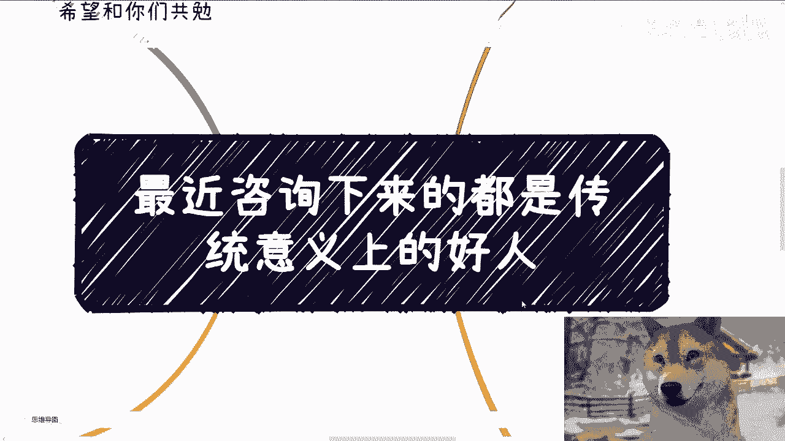
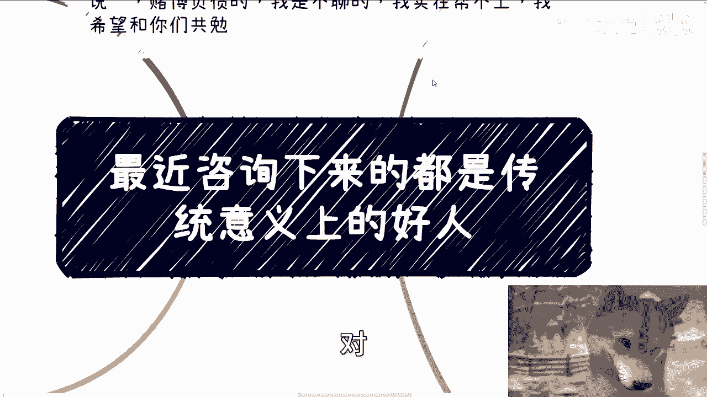
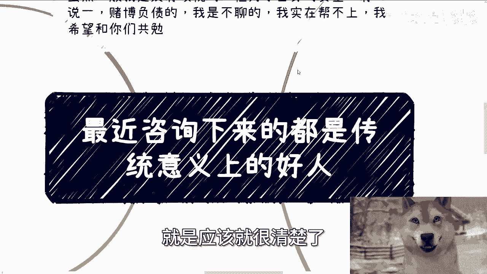
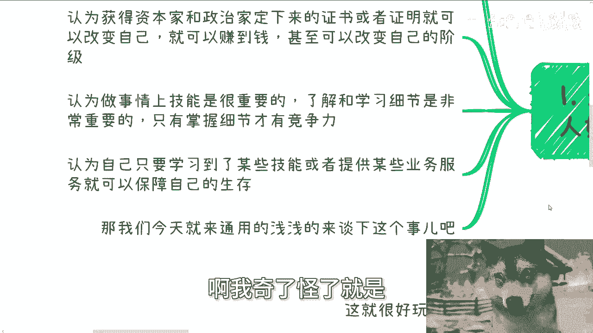
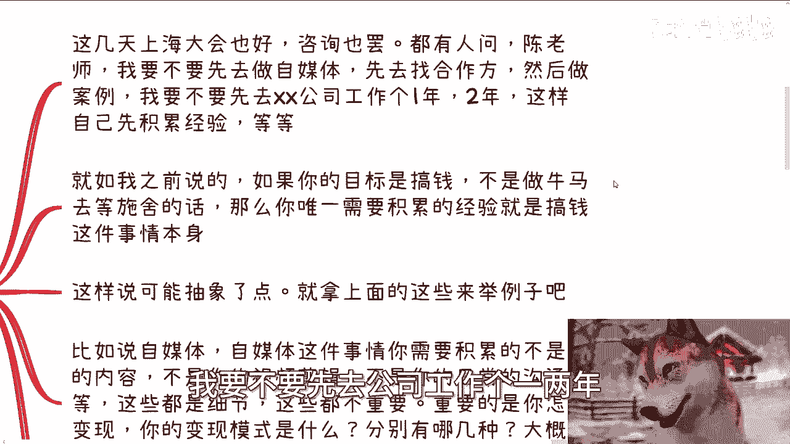
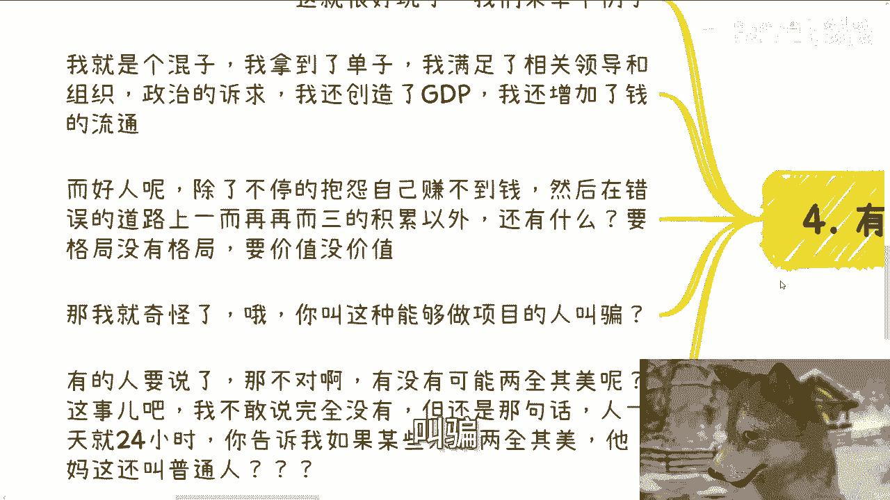
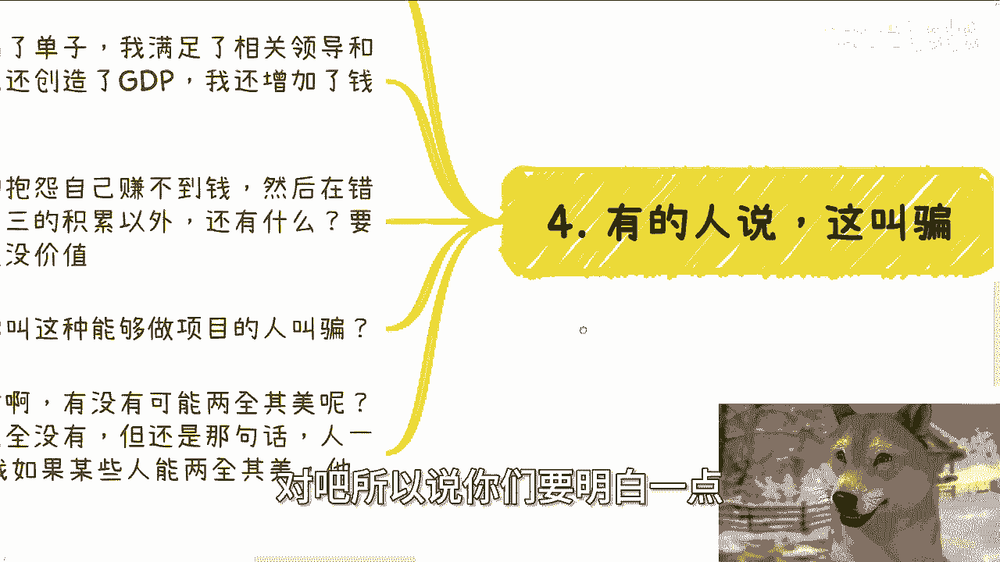
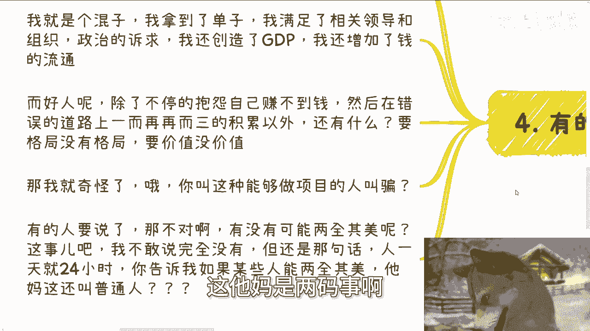
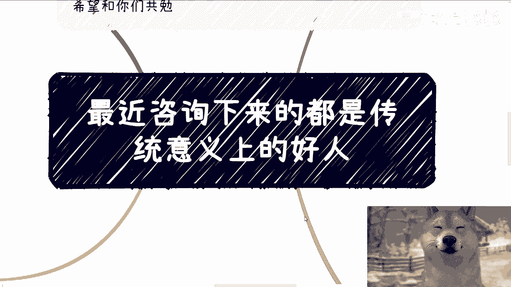

# 课程名称：传统“好人”的思维误区与搞钱逻辑 🧠💰
## 课程编号：001

在本节课中，我们将要学习一种常见的思维模式——“传统好人”的思维误区，并探讨在现实社会中，尤其是在商业和搞钱领域，为什么这种思维模式常常行不通。我们将通过分析几个核心误区，帮助你理解如何调整策略，更有效地达成目标。

---

上一节我们介绍了课程的主题，本节中我们来看看“传统好人”的具体定义和其思维特性。

这种“好人”是应试教育和传统教育共同塑造出的产物。他们往往具备几种共同的思维特性，这些特性也是他们对社会最大的几个误区。

以下是“传统好人”常见的三个思维误区：

1.  **误区一：迷信证书与证明**
    他们认为获得由资本家或政治家定义的证书、证明或特定物品，可以改变自身命运，即可以赚到钱甚至改变阶级。这是一种不切实际的幻想。

2.  **误区二：过度迷信技能与细节**
    他们认为做事时技能至关重要，了解和学习的细节越多，才越有竞争力。这同样是一种脱离现实的认知。

3.  **误区三：认为有技能就有市场**
    他们认为只要自己学到了某些技能或能提供某些服务，别人就会愿意合作或下单。这相当于活在自己的理想世界里。

---

上一节我们列出了“传统好人”的思维误区，本节中我们通过具体例子来深入剖析这些误区为何不成立。

首先，针对“技能很重要”这个误区。当被问及“别人凭什么与你合作”时，许多人的回答是“我拥有XX技能”。但拥有技能与对方是否愿意合作，两者之间没有必然的因果关系。许多尝试过寻找客户的人反馈“客户没有下文”或“不愿意付钱”，这已经充分说明了问题。逻辑关系可以表示为：

**拥有技能 ≠ 获得合作/报酬**

其次，关于“积累经验”的常见想法。很多人认为搞钱前，需要先去公司工作积累行业经验，或先做自媒体积累粉丝和案例。如果你的目标不是做牛马等待施舍，而是主动搞钱，那么你唯一需要积累的经验就是**搞钱这件事本身**。

以自媒体为例，你需要积累的不是内容创作或视频剪辑等细节技能，而是**变现模式**。你需要明确：如何变现、有几种模式、定价多少、如何收费。然后，你的核心任务就是不断尝试去达成交易、看到钱。这个过程才是有效的积累。否则，单纯“做自媒体”而没有明确的变现验证，就是浪费时间。

以去公司工作为例，你需要问自己：去积累什么经验？这个经验能带来什么？你知道怎么用吗？如果答案都是“不知道”，那么这种积累很可能方向错误。

---

上一节我们讨论了积累经验的正确方向，本节中我们通过一个对比来进一步说明问题。

假设一个“好人”寒窗苦读至30岁，名校毕业，但谈业务时毫无逻辑和吸引力；而一个“混子”通过社交摸清了人脉和需求切入点，快速包装出产品并谈下业务。在每个人生命时间恒定的前提下，哪种路径更高效？答案显而易见。

有人会反驳：“没有学历或案例，我感到心虚。”这本质上是自我设限和自我PUA。如果自己都这样想，赚不到钱也是必然结果。

还有人会指责“混子”的做法是“骗”。这里需要严格区分概念：**“包装/画饼”与“骗/烂尾”是两回事**。在签单前，通过沟通和展示价值来争取合作，这叫**包装**。签单后无法完成承诺，这才叫**骗**。前者是商业手段，后者是信用破产。

---

上一节我们澄清了“包装”与“欺骗”的区别，本节中我们来探讨是否存在“两全其美”的路径。

有人会设想：我既优秀（如名校毕业），又很会包装，岂不是完美？理论上存在，但现实中极少。因为一个人的时间和精力是有限的。能同时在这两条高要求路径上都做到顶尖的，绝大多数并非普通家庭背景的“普通人”，往往背后有家族资源、经验或关系的传承。对于绝大多数普通人而言，必须做出符合自身现实条件的选择。

因此，看问题一定要从本质和实际出发。很多普通人，在被告知可行的生存和赚钱方式后，却选择“自视清高”，坚守那些与自己现实无关的“正道”案例（例如富二代的成功故事），这没有意义。这正应了“可怜之人必有可恨之处”这句话——他们宁愿怀抱着“通过学习技能就能赚钱”的幻想。

---

上一节我们指出了脱离实际的幻想，本节中我们谈谈面对现实的正确心态。

每次与这类努力、用功、脚踏实地的人交流时，都令人难过。因为他们越关注过程和技能的积累，就越容易成为被利用的“更好用的工具人”。

我们无法改变社会规则或整体局势，唯一能改变的是自己。所以，核心建议是：**遵循社会规则行事，但内心保持清醒**。你需要明白什么是对错、黑白，但不必过于死板。你已经可能浪费了二十多年在错误的路径上，是时候做出更务实的选择了。

---

本节课中我们一起学习了“传统好人”的思维误区，包括迷信证书、过度强调技能、错误理解积累的方向等。我们分析了这些误区为何在现实中行不通，并对比了“好人”与“混子”的路径差异。关键在于，要认清现实，将有限的精力聚焦于**搞钱本身的经验积累**和**有效的价值包装**上，同时保持内心的清醒认知，在适应规则与坚持原则之间找到平衡。

如果你在工作或商业规划上有具体问题，可以整理好个人背景与问题列表进行进一步咨询。