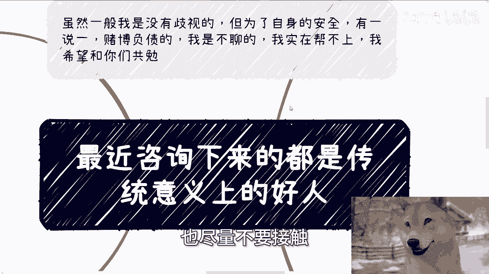
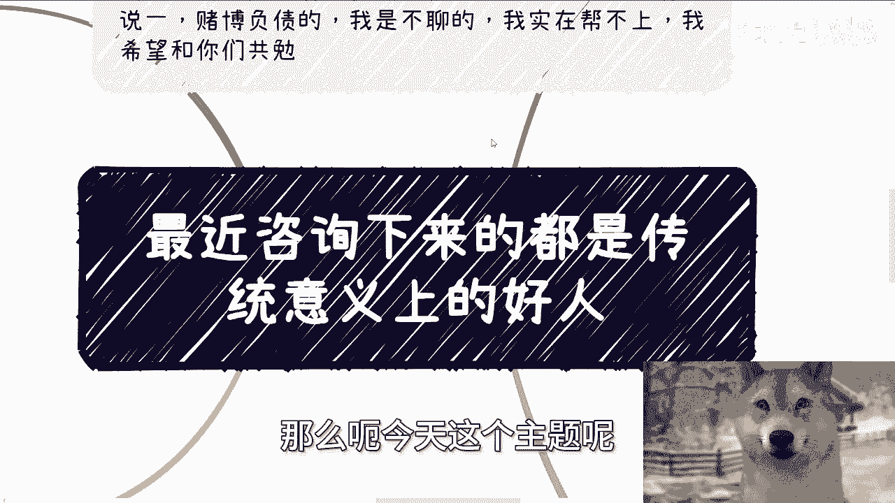
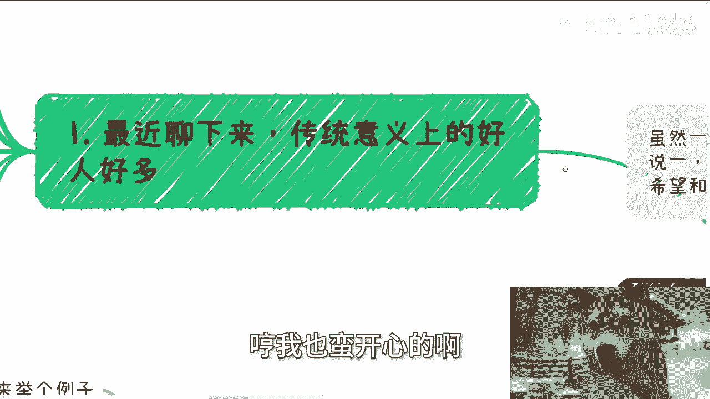
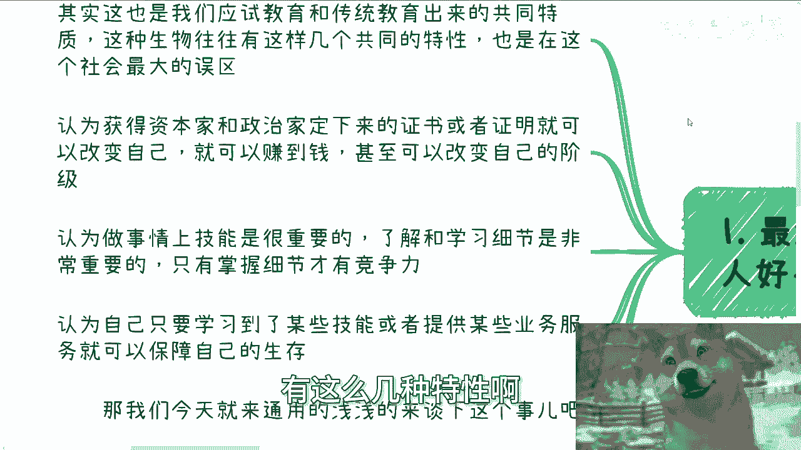
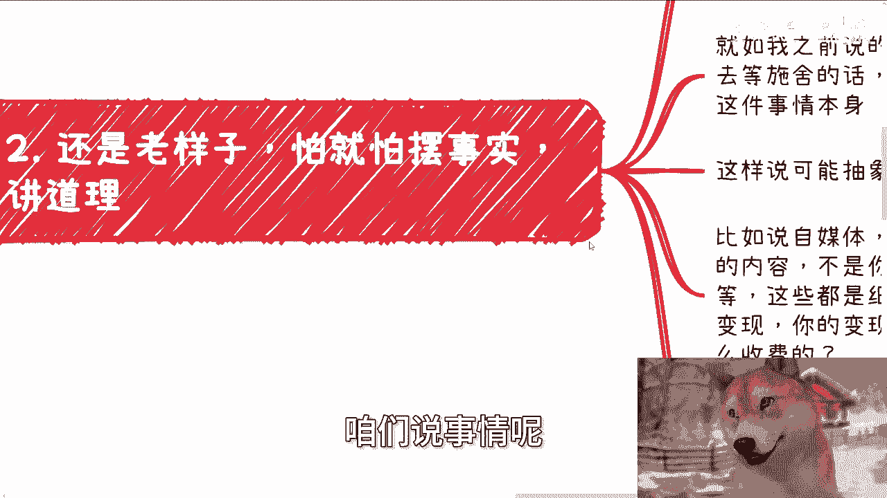
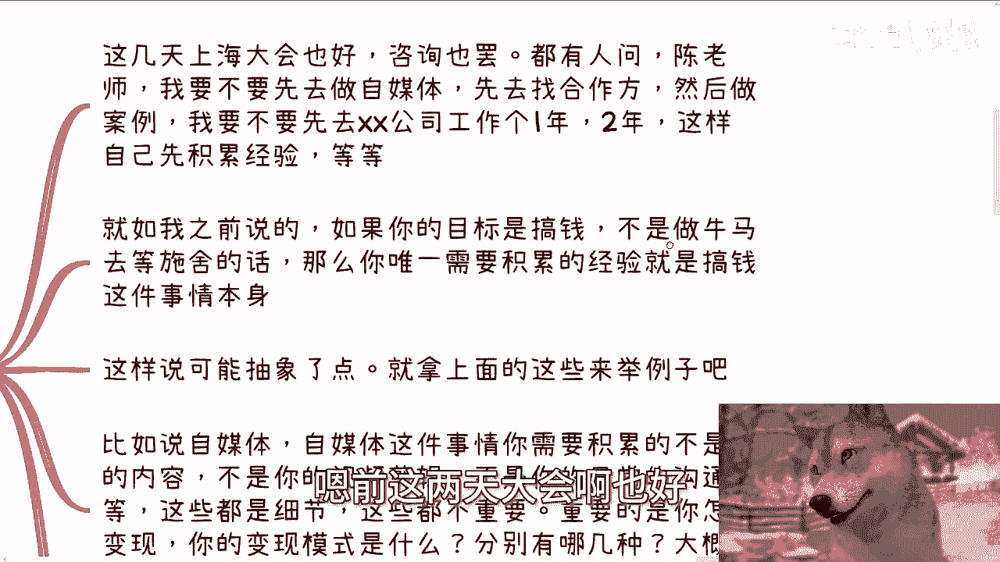
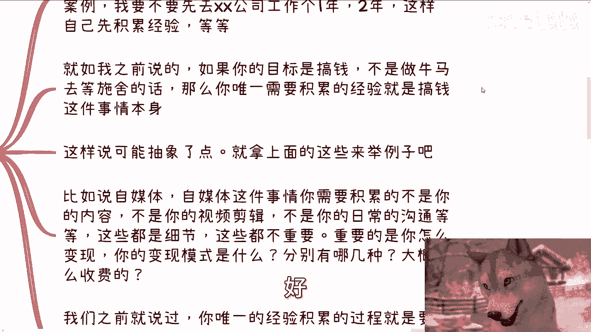
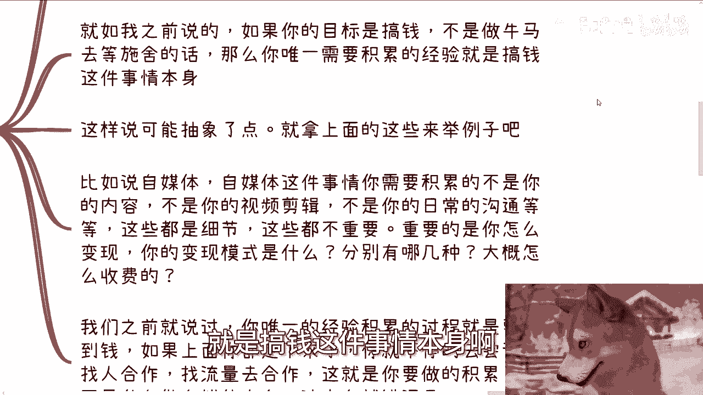
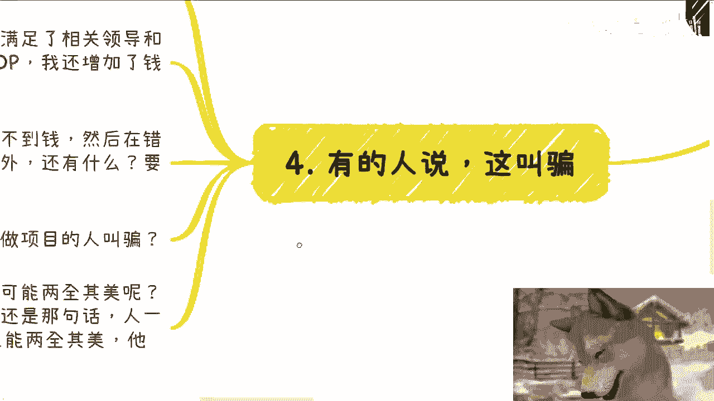
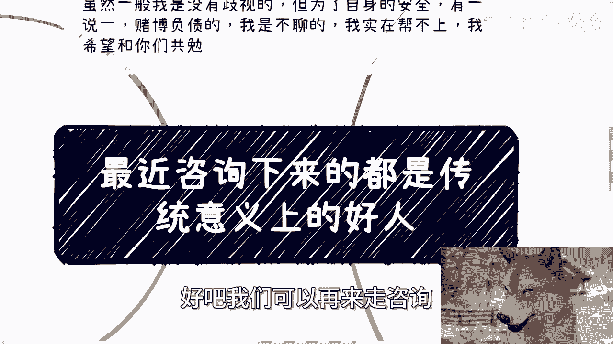

# 最近咨询下来都是传统意义上的好人，我其实蛮替他们难过的 - P1 - 赏味不足 - BV1UP4YeYEJC

啊大家好看这个主题就很哼唉怎么说呢。

嗯很好玩很好笑啊，是吧啊，对今天我们这个主题啊。

就非常的今天也都是故事啊，我相信今天这个内容呢大家听完啊，怎么说呢，就是应该已经很清楚了。

因为我已经把话说的很明了，就不能再明了啊，那么首先啊虽然一般啊我没有什么歧视，但是为了我自身的安全啊，有一说一赌博负债的，我一般都是不聊的啊，也不要跟我有任何关系，我实在帮不上啊，我希望也跟你们共勉。

什么意思呢，就是你们以后跟别人聊的时候，或者接触的时候啊，赌博欠债的啊，也尽量不要接触。

还是那句话啊，自作孽不可活啊，那么呃今天这个主题呢。

叫做最近这个咨询下来的，都是传统意义上的好人啊，哼我也蛮开心的啊。

都是好人啊，呃其实呢这是个好人呢，我也解释一下，这也是我们应试教育跟传统教育出来的，这个共同的特质啊，这种生物啊，这种生物往往有这么几种共同的特性啊，呃你也不要怪这个陈老师把你们把把他们吧啊。

把他们称之为生物，为什么呢，因为不好意思，我告诉你们啊，政治垄断的啊，这种传统意义上的好人，本来他们就不会当人看啊，那么呃我们现在接下来就说啊，这种传统意义上的这种生物啊，有这么几种特性啊。

也是这对于这个社会最大的几个误区，第一啊，他认为获得资本家跟政治家定下来的证书，或者证明，或者某一些特定的东西可以改变自己，也就是所谓的可以赚到钱啊，甚至可以改变自己的阶级啊，这他妈就是痴人说梦啊。

第二认为做事情上面技能是很重要的，认了解其和学习其细节是非常重要的，只有掌握细节才有竞争力啊，好这他妈也是痴人说梦啊，第三啊，认为自己只要学习到了某些技能，或者提供某些业务服务啊，就可以啊，有单子啊。

或者说就是别人就会愿意合作啊，这个怎么说呢，就活在自己的这个叫什么桃花源里面啊，呃那我们今天就用这个通用的啊，这个怎么说呢，故事或者说法来浅浅的谈一下这么个事啊，因为因为就算放在充电视频里面。

也也不可能很深的啊，也也很深的，谈不了啊，网络上这怎么弹的，对不对啊，呃首先我在这个地方这两点啊，我先举两个例子啊，第一你说这个技能很重要，对吧啊，有些人我跟他聊的时候，他我是这么问的。

我说你凭什么觉得啊，就是就是别人能够啊这个找你合作，或者说别人啊呃愿意跟你合作对吧，然后他就跟我说，他说他拥有什么样的技能，拥有什么样的技能，我说你拥有这个技能跟对方是否愿意跟你合作，有什么关系呢对吧。

而且最好玩的你们知道是什么吗，就是他们都是试过，你知道吗，就是都找过客户，而然然后给我的反馈说，哎陈老师客户就是没有没有下文的，或者客户就是不愿意付钱，唉我他妈心里就在想了。

都已经知道你的这个这个这个怎么说呢，这个调性或者整个的这个呃，你拥有技能或者拥有某些细节点是推不出啊，客户愿意跟你合作这么一个结论的，你还执迷不悟干嘛呢，对不对哦，别人不回你跟别人不给你钱。

这他妈不还不说明问题吗，还不足以说明问题吗，对不对哦，这就很奇怪，你知道吗，这就好像他们跟我说，爱陈老师，我会写代码啊，陈老师我我会做营销啊，我会做自媒体，怎么滴啊，你会写代码，你会做营销。

你会做自媒体哦，比如说你就拿我来讲，我我他妈必须跟你合作啊，我钱多了没地方用，我必须换你身上，对不对嘛，啊那奇了怪了就是好。

第二还是老样子啊，咱们说事情呢。

怕就怕摆事实，讲道理对吧啊，额前这两天大会啊也好。

咨询也好，都有人问他说陈老师，我要不要先去做自媒体积累积累，先去找合作方，然后做一些自己的案例，我要不要先去公司工作个一两年。

这样自己积累积累相关的行业，行业经验啊等等等啊，好啧。

我敢打赌啊，你们现在看这个视频的人啊，90%到95的人也是这么想的啊，就如我之前说的，如果你的目标是搞钱，不是做牛马，等待别人他妈的哼施舍我们的话，那么你唯一需要积累的经积累，经积累的经验是什么。

就是搞钱这件事情本身啊。

那当然这样说可能抽象了一点啊，那么就拿上面这些东西来讲，来来举例子，你们就懂了，五来嘿五来，对吧，你比如说比如说自媒体，自媒体这件事情，你需要积累的不是你的内容，不是你的视频剪辑。

不是你的日常的沟通等等，这些都是细节，这些都不重要，重要的是你怎么变现，你的变现模式是什么，分别有哪几种，大概定多少价格，怎么收费，对不对，那么按照我们之前就说过。

你唯一要积累的经验的过程就是要看到钱对吧，如果上面的比如说我刚说的这些，你都已经定下来了，你就需要不停的去尝试，找人合作也好，找企业也是合作也好，找MCN合作也好，找流量合作也好随便。

但这就是你要做的积累，而不是什么，做自媒体本身，你懂吗，你你如果单纯做自媒体本身，你没有这么强烈的变现的模式，没有这么直直白的变现模式，没有这么短平快的一次次的这个结果，没有这种一次次结果去验证的话。

那么你本身做这件事情就是浪费时间，你懂吗，你你你就像很多人，我问他，我说你做什么，他说我做自媒体，我做自媒体干嘛，我积累积累，你积累什么东西啊，不知道的对吧啊，第三我们继续来看啊。

比如说对应的公司工作经验，积累对应的经验，对吧好，那我就要问了，你去公司积累经验，积累什么经验，这个经验能给你带来什么，你会用吗，你有用吗，你知道怎么用吗，不知道都他妈不知道对吧。

这就跟很多人追求学历是一样的，就很搞笑，你要去打工是有用，我不否认你要去搞钱，你告诉我有什么用，我们假设啊，我们假设一个好人，一个是会混的混子，好人，辛辛苦苦寒窗苦读30年啊，呸30年苦读到30岁。

清华毕业，北大毕业，MIT毕业，然后老老实实跟别人谈业务对吧，丝毫没有业务逻辑啊，丝毫也没有吸引力，也不知道客户要什么，对不对，而混子简单通过吃饭喝酒混社会，跟别人沟通。

了解到了一些人脉关系和需求的这个切入点，然后很快的就包装了一个产品介绍，去跟别人谈业务，很快就能谈下来，那我就问了他妈的，每个人的生命都是恒定的吧，你不不是你能活500年，我只能活100年吧，对不对。

那既然每个人生命都是恒定的，那要你你怎么选，我就问你怎么选，对不对，那有的人又要说了，那我没有学历，我没底气啊对吧，我觉得我很虚啊啊我没有案例，我也觉得我很虚啊，怎么说呢，这你从我角度来讲，这叫什么。

这叫作茧自缚，你要这样PUA你自己，那随便你，你我可以，我可以明摆着告诉你，你赚不到钱，你赚不到钱，原因就是活该，对不对，你自己非要怎么想，怪谁呢，怪谁呢啊第四有的人要说了，哎陈老师，你这个叫骗，哎。

我跟你讲啊，这个就很好玩了，我们来再来举例子啊，我就是这个混子，我拿到了单子，我满足了相关领导和组织，甚至学校包括政府的诉求对吧，我还创造了GDP，我还增加了金钱的流动，在金融层面我是有价值的。

而好人呢除了不停地抱怨自己赚不到钱，在错误的道路上一而再再而三的积累以外，说我们这种人是骗子以外，还能有什么要格局没格局，要价值没价值，请问有什么，哎那我就奇了怪了哦，你对于这种能够给组织，给领导。

给高校，给企业，给政府带来项目，或者来说带来真正的这个满足合作需求的人啊，叫骗。

对不对对吧，所以说你们要明白一点。

什么叫骗骗，就是你去包装，你去跟别人聊，单子签下来之后，你完不成，这叫骗，这叫他妈烂尾，懂吗啊，你前面这些为了拿到单子的手段叫什么，这就叫包装，这叫画饼，对不对，这他妈是两码事儿啊。

好那有的人又要说了，他说那不对呀，哎陈老师，你这样绕，哎我被你绕进去，他说我想起来有这种可能性，有没有可能两全其美，就比如说哎我的确很优秀对吧，我是一个清华毕业的，我是一个哎麻省理工毕业的对吧。

同时我也很会包装，你们仔细想想看这个话啊，这事啊我不敢说，完全没有，但还是那句话，一个人一天就24小时，你告诉我，如果他妈但凡有的人能两全其美，这他妈能叫普通人啊，对不对，但凡跟我说，有这种人。

我敢打赌，要么家里面父母有背景的，要么家里面父母有积累的，要么家里面父母有各种各样的经验啊，传承或者关系传承的，你跟我说，这叫普通人，我不信的，我绝对不信，对不对，就这么简单。

所以说啊所以说就说我为什么一直跟你们讲，看问题，看事情一定要切合实际，一定要从本质出发，就有很多人，他明明自己就是一个，就是就是一个普通老百姓对吧，跟我一样的普通老百姓，然后我非常怎么说呢。

就是说从他们的角度跟他们说，唉你们能够生存的手方式可能只有这么一些，你们能赚钱的方式可能只有这么些，唉他们不是的，他们非要自视清高，非要自视非常的啊，就是叫什么就是正正道对吧。

非常非常就是说他们都是好的，我就是我们这种就是不好的对吧，然后他们会给你摆事实讲道理，但是他们摆出来的事实，讲出来的道理全他妈跟他们没有关系啊，富二代，摆出来的都是那种就表面看不出任何东西。

背地里就像我们以前说的啊，一个人呃，某某某人对吧，一年赚了一个亿，对其中他妈的9999万全是他妈的，他爸妈出的，就拿这种案例来有什么意义呢，对吧，所以我一我我我我跟你们这么说，你们但凡接触过更多的人。

接触过更多的项目，你们你们就会非常深刻的理解那句话叫什么，叫可怜之人必有可恨之处，没什么好聊的，没什么好说的对吗，就是他情愿干医院对吧，变成资本家呃，然后还揣着就是说啊我我好像自己拥有着。

就自己学习这些东西能赚到钱的这种这种幻想，那随他去爱咋地咋地，啊你们听到这个声音都是我家咪咪啊，不要懂啊，听到吧，哎哎古驰古驰听到了，哎，小朋友小朋友你听到没有。

对吧，所以说就说每次啊最近就是聊这个东西，跟跟就是说咨询这个东西的时候，我其实我说实话，我听他们跟我讲这些话的时候，我是很难过的，为什么，因为我知道对面是一个努力的人，我知道对面是一个是一个就。

对面是一个努力的人，对面是一个用功的人，对面是一个怎么说呢，叫做脚踏实地的人，然后我就很难过，因为我也知道，越是这样的人，他越容易被别人利用，因为他有他，他他越是把这个关注点放在他的那种呃，叫什么。

就是过程的积累，技能的积累上面，他更容易被那些资本家跟跟跟，跟既得利益者去利用，因为他就会变成一个更好的工具人，怎么办呢，没有办法，你问我陈老师有没有办法改变，怎么改变，你说你跟我能改变社会吗。

你跟我能改变整个局势吗，我们不能，我们不是只能改变自己吗，还能怎么办呢，对不对，所以我一直一而再，再而三的跟你们强调的是什么，就是你们要做的就是去follow这个社会的规则，但与此同时，不要迷失自己。

你们要还是要心里明白，什么样是对的，什么样是不对的，什么样是黑的，什么样是白的，但是你不要太死板，太死板没有用，你已经浪费了20多年了，还想怎么样还想怎么样，对吧啊行吧，就这么着吧啊那个，职业规划。

商业规划啊，你们在工作上或者商业上面有任何的问题的，你们可以整理好对应的个人背景跟问题列表，好吧。

