# 最近某些机构又跑路了 - P1 - 赏味不足 - BV1xWH9ekEk8

啊大家好啊，礼拜五来哎呀，我最近唉忙的要死哦，对汇报一下啊，那个黑神话悟空，我已经到第二周目二周目的第四章，哎，差不多快哎，我发现后面真的就很快他妈就他妈第一次买呃。

最近啊最近这个某些机构啊，这又跑路了啊。

名字我也打在这了对吧，秦汉胡同啊，这两天跟大家聊啊，想要胡同的事情，那首先啊是这样子的啊，就是呃你们不要默认的觉得，就是他好像就是个国学，或者你们也默认觉得哎呀，就好像呃这这个这个怎么说呢。

体量不大或者怎么样子啊，就是就是有一说一啊，他这个呃教育的体量还是蛮大的啊，而且另外一方面他不是只有国学啊，真的是唉，就反正就是说还是有蛮多一些。

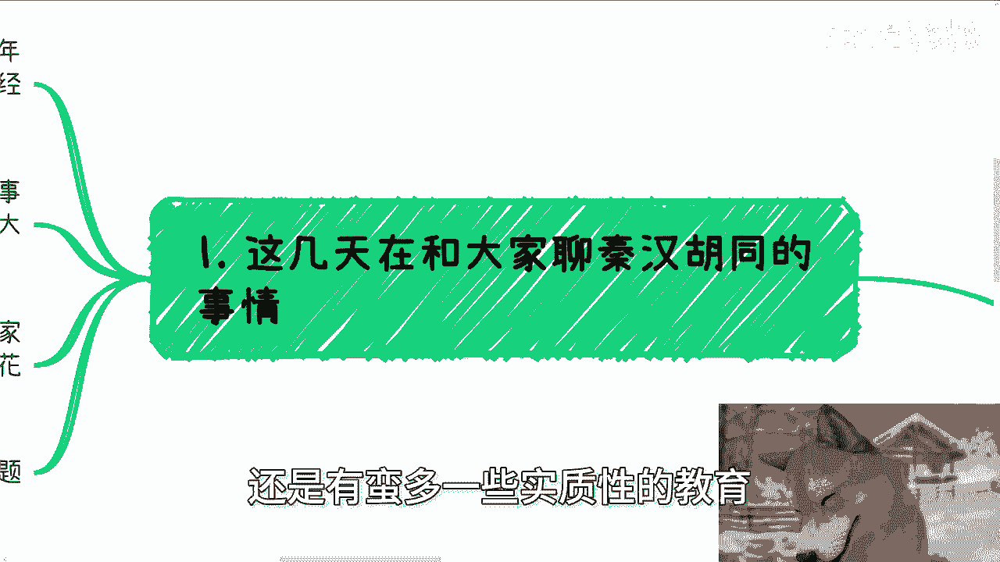

实质性的教育在这里面，所以这个跑路涉及到的面还是蛮广的啊。

这事怎么说呢，按照我的了解啊，有的人其实去年或者疫情后，就已经知道了一些风声，可能很早就已经有跑路的打算了。

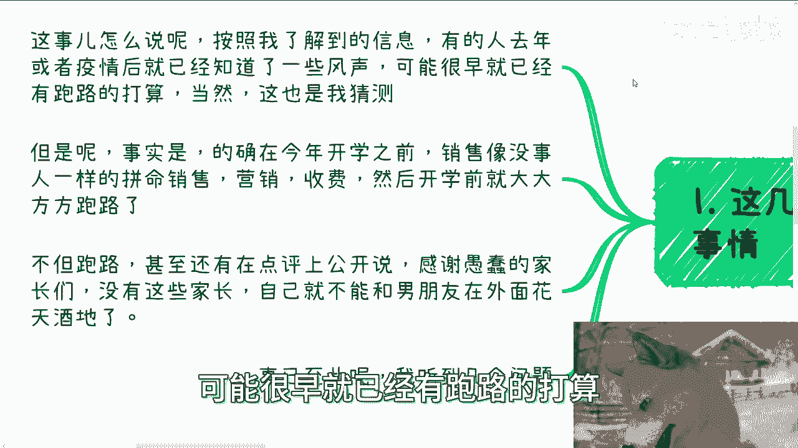

当然啊这也是我猜测，但是呢事实是什么呢，就是的确在今年开学之前啊，销售像没事人一样啊，拼命的销售，拼命营销，拼命收费啊，然后开学前就大大方方跑路了，不但跑路呢，甚至还有的在点评上公开的说对吧。

就有的看我前两天朋友圈也知道啊，就在点评上公开的啊，感谢啊，愚蠢的家长们，没有你们这些家长啊，那么我就不能跟男朋友在外面花天酒地了。

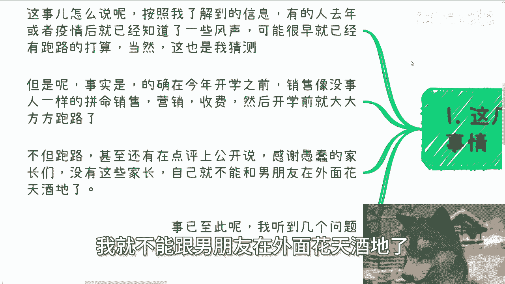

对吧啊妈的把他妈家长们他妈血都吐出来了啊，呵呵啊。

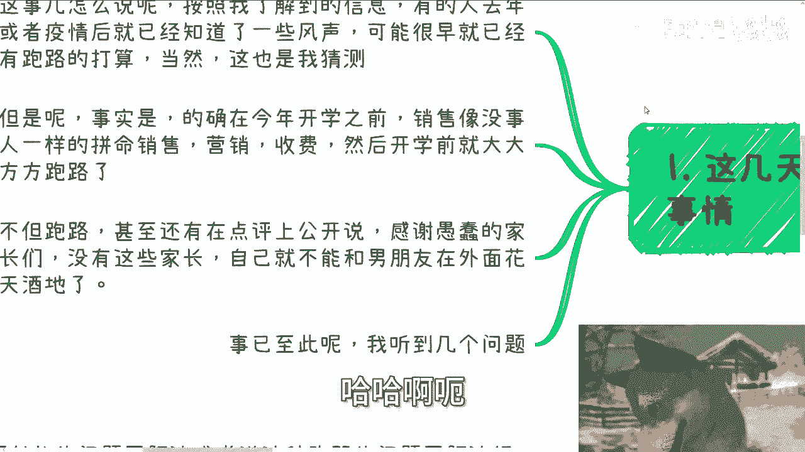

呃事已至此啊，我听到这么几个问题。

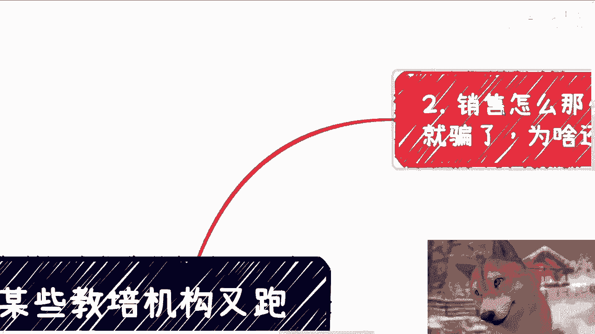

第一啊，他说销售怎么这么没有道德以及骗了就骗了，为什么还要过来嘲讽家长啊，首先啊我觉得道德这个事儿呢，你做了销售就会明白，因为对你来讲你只有提升跟底薪，呃我觉得是这么说吧，你可以是一个有道德观的人啊。

但是你得明白，中国的普罗大众，整个金字塔的底层，也就是普罗大众，我们说真正老百姓接地气的老百姓，他的比例是很大的，而这部分老百姓说难听点，大家其实过得很不很苦，过得很不好，对不对。

也就是说当他们去做销售的时候，对他来讲只有提成跟底薪，你没有任何资格用道德去绑架他对吧，因为对他来讲，赚钱就是唯一的出路，没了呀，你难道跟他说，卧槽要读读书啊对吧，考个好的学校对吧，哼你不是在搞笑吗。

对不对哦，你读个书考到好的学校，这也是PUA啊，我就这么问，中国这么多年轻人有几有多少比例人考得上，有多少比例人读得出来，你们在搞笑吗，你要是今天跟我说，90%的人能读得出来，那也就算了，对不对。

没有意义的啊，就是当你作为一个一个底层老百姓，去做销售的时候，我就这么说，你根本没有资格去考虑什么道德不道德，因为你生存都有问题，你不把黑的说成白的，怎么会有更多的人买单呢。

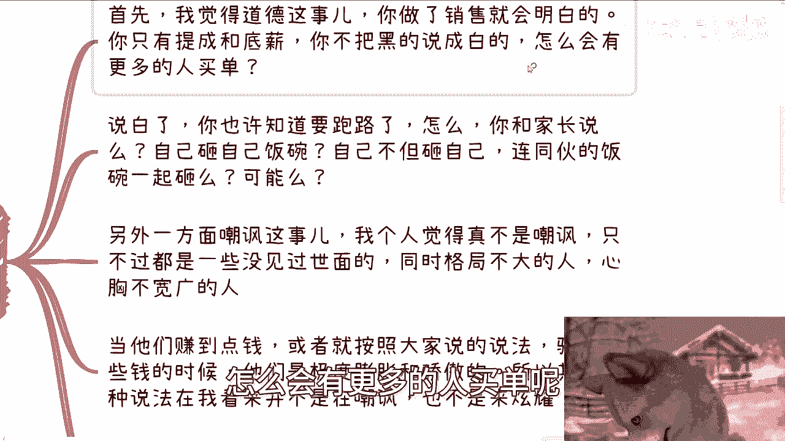

对不对，那说白了你也许知道要跑路，怎么了呢，怎么了呢，你难道跟家长说吗，哎呀我们要跑路啦，自己砸自己饭碗，你跟钱过不去，那我只能说你钱太多了，对不对，那另外一方面，你跟家长要是说了，你自己砸自己。

那我也就算了，你不但自己砸自己，你连同伙的饭碗一起砸，可能吗。

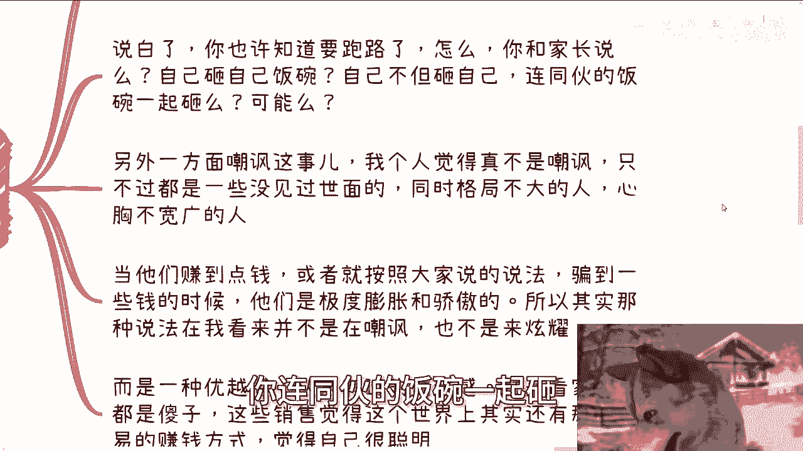

可能吗，对不对，你换位思考一下可能吗，另外一方面嘲讽这个事啊，我个人觉得真的不是嘲讽啊，真的不是嘲讽，我们要对普罗大众要有要有接地气的理解。

就是很多，就像我刚刚说的，就是什么，他他评论啊就说什么，哎呀。

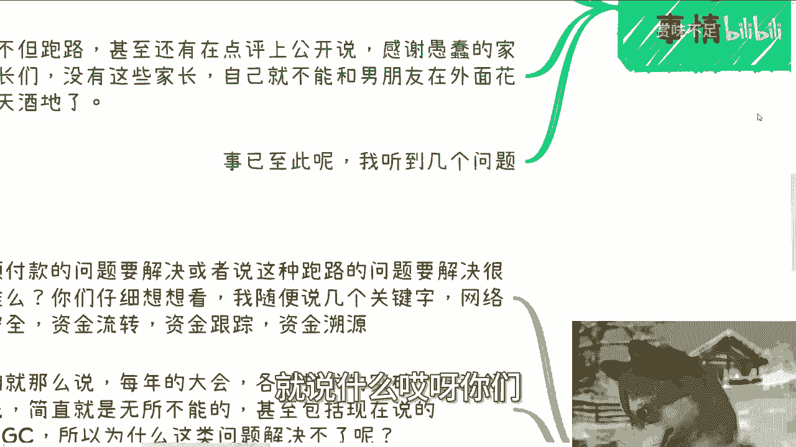

你们呃感谢愚蠢的家长们对吧，没有这些家长们，我我们就不能在外面花天酒地，怎么样怎么样怎么样啊。

我跟你这么说，嘲讽这个事情，我觉得真不是大概率。

这些人无非只是没有见过世面，同时格局不大，心胸狭隘的人，当他们赚到点钱。

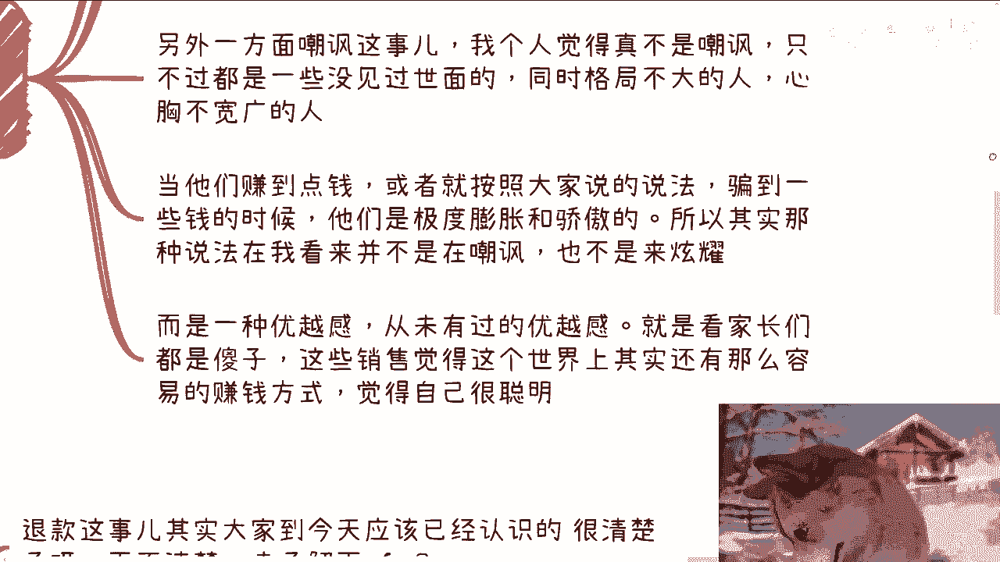

或者按照大家的说法，就是骗到一点钱的时候，他们的内心是值极度膨胀跟骄傲的，因为他没有见到过这么多，或者他也没有在短时间内赚到过这么多，那他不膨胀谁膨胀呢，对不对，就是膨胀才叫普通人不膨胀。

那他妈格局真的就高了哦，那么所以其实他的那种对家长的评论，在我看来不是嘲讽，也不是来炫耀，而是一种由内而外从内心发自内心的优越感，而且是他活到今天从未有过的优越感，就是看他妈家长们看付钱人都是啊。

然后这些销售呢觉得世界上卧槽，其实还有这么容易的赚钱方式，然后就觉得自己很聪明。

就是说白了他们第一第一次让他们又感觉到。

虽然自己是普通人，虽然自己可能日日常都不如别人，但是突然有一天有一件事情让他们觉得，哎我他妈社会地位比你高。

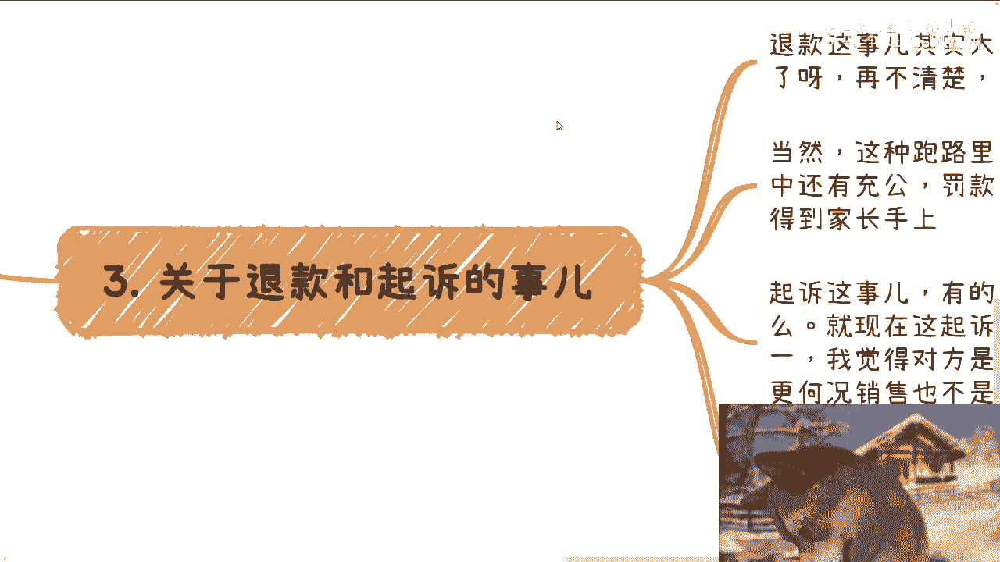

就这种感觉嗯，第三关于退款跟起诉这个事儿啊，我觉得是这样子的，退款这个事，其实大家到今天应该认识的很清楚了，再不清楚的话。

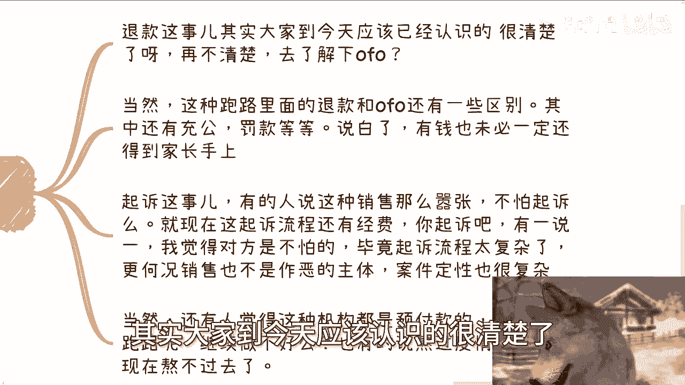

你们去看看OFO，对不对啊，一个道理，当然啊，这种跑路的项目里面的退款，跟OFO还是有点区别的，因为这种项跑路的项目里面，其中还有充公，还有罚款，那说白了里面的逻辑也很复杂，就里面的关系链也很复杂。

有钱啊，也未必一定会第一时间或者优先级高的，还到家长手上，那不好意思，家长老百姓手上的钱不是优先级最高的，起诉这个事啊，有的人还说啊，我的嚣张，这个这个销售这么嚣张的吧，不怕被起诉吗。

我哎我说不好听点啊，就现在这个起诉流程还有经费，以及你起诉的时间，你们自己到法院去了解了解啊，有一说一啊，我觉得对方是不怕的，为什么两点，第一点是起诉流程的确很复杂啊，呃而且时间周期也很长。

第二方面是更何况销售并不是作恶的主体，你真的起诉你真的定性案件的定性他也很复杂，你在我看来啊，在我浅薄的认知里面，你再怎么样定刑，再怎么样定性，哼呵你说定性到一个啊，就是对你这个大放厥词对吧。

这个这个这个叫什么，就是啊讽刺你嘲讽你的这么一个销售身上，那不好意思，法律不会走这种道德观的，对吧啊，当然还有人觉得这种机构都是预付款的，为什么要跑路呢，继续做不好吗，啊，那么他们的逻辑就是说啊。

这些机构连疫情都已经熬过去了，怎么现在熬不过去呢，我跟你讲啊，不是这样看问题的，他们并不是疫情熬过去了，而是说在疫情那几年，他们相对通过前两年的预付款，通过前两年的准备，通过前两年的这个沉淀。

相对来讲度过了疫情这个时间，或者说你可以认为它很多这种预付款的机构，它的整个的运作他是滞后的，你懂吗，也就是说他之所以现在要跑路，是因为就正因为疫情的影响，在现在爆掉的啊，就是这么个情况。

其实因为说白了啊。

就是预付款的逻辑就是怎么说呢，我们粗暴点来讲，就是拆东墙补西墙啊，就是就是你可以理解为，自己体系里面有一套庞氏骗局啊，也不叫庞氏骗局吧，就是有一套击鼓传花，那大家日常之所以能走得下去。

是因为永远都有人来接这个话啊，但是疫情导致了接这话的人不够。

所以导致爆掉，其实无非就这么简单啊，第四我们说个题外话啊。

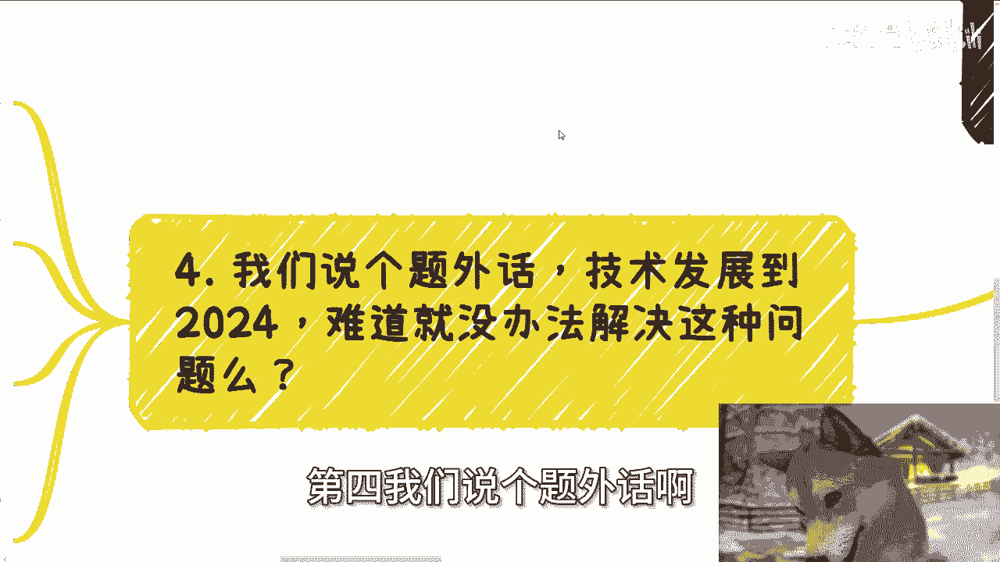

技术发展到2024年，难道没有办法解决这种问题吗，对不对啊，我我们就这么说啊，每次发生这种事情，一而再再而三的发生这种事情，有很多人会跟我说嘛，卧槽技术很牛逼对吧，技术很重要啊啊陈老师。

你一天到晚说技术不重要，他妈的，我要我要跟你pk对吧，你觉得有意义吗，那我就问啊，预付款的问题要能解决，或者说这种跑路的问题要能解决很很难吗，哎我操我，我有一说一啊，你们大部分人都没有我写代码的时间长。

我他妈好歹写了78年代码对吧，你们自己想想看，我随便说几个关键字，网络安全，资金流转，资金跟踪，资金溯源哪个没做过对吧，咱就这么说啊，每年大会各种技术突破遥遥领先，简直就是无所不能的。

包括现在说的AIGC，那为什么这类问题解决不了呢对吧，所以我们要明白，就是溯源是溯源解决不了，是跟踪解决不了，是不能解决吗，当然不是了，技术都是好的，技术是无罪的，但本身就是没想解决对吧。

所以就是这也是我为什么说这些项目啊，都是这个宣传性的项目，就是对外宣传pr对吧，做好就好了啊，之后落地怎么样以及取得怎么样的实质性效果，那没人关心啊对吧，所以说你会发现很多的项目，看似花了很多的钱对吧。

那其实本身并没有什么太大用处，那你说解决问题吗，那不好意思，那为什么一次一而再再而三的出现这种情况呢，对吧啊行好吧，那么我们这个主题反正就讲这么多，然后大会的话8号啊那个大会嗯，报名继续报。

我报名链接就放在评论区了啊，然后剩下的话就是呃，你们主页的一些职业规划啊，包括就是做一些副业啊，做一些其他跟别人合作啊对吧，在这里面涉及到一些呃这个股权啊，融资啊，估值啊，商业计划书啊，白皮书啊对吧。

期权啊等等等相关的一些东西，你们呃如果觉得需要有一些比较呃，接地气的建议或规划的话，那么你们可以整理好对应的问题跟个人背景。

好吧。