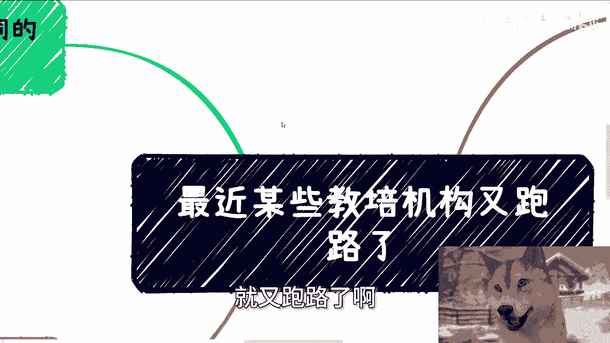
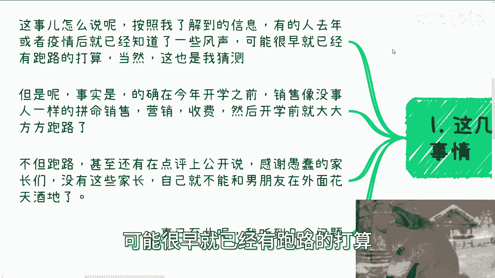
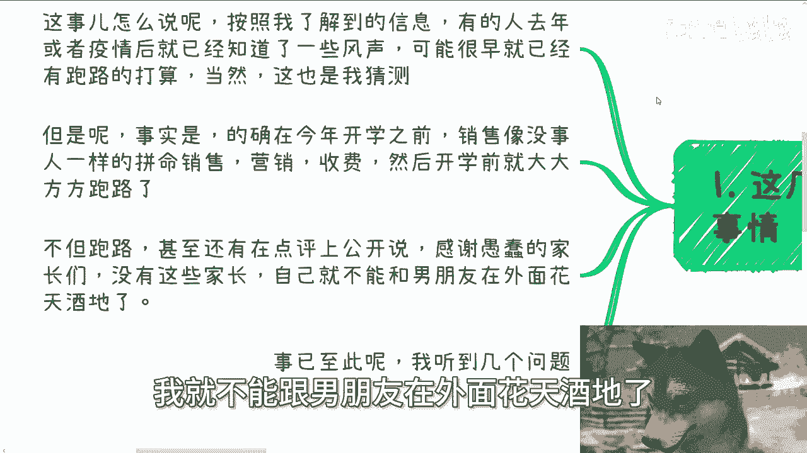
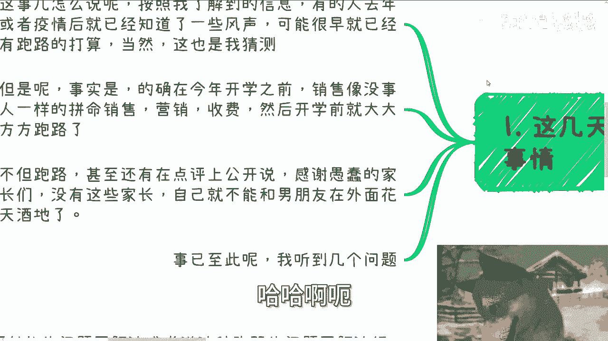
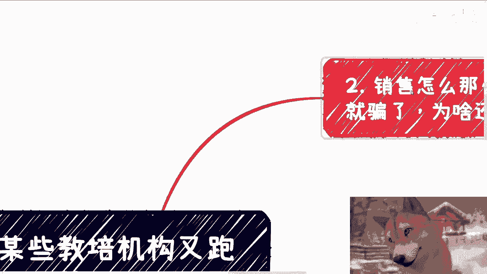
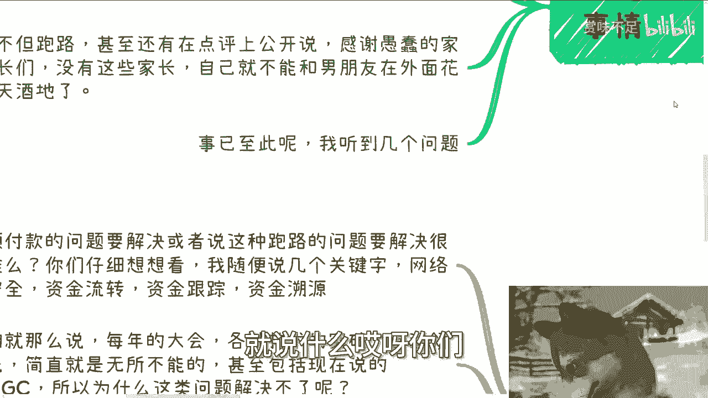
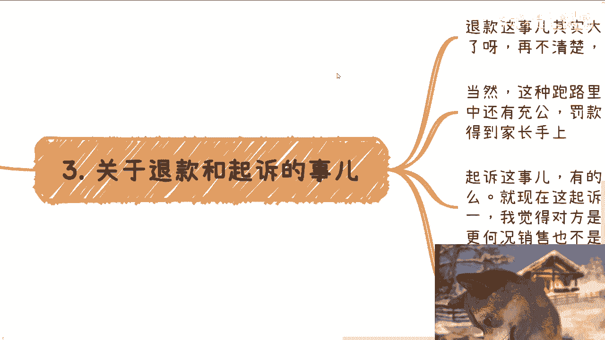

# 最近某些机构又跑路了---P1---赏味不足---BV1xWH9ekEk8

## 概述

在本节课中，我们将要学习近期发生的教育机构“跑路”事件。我们将分析事件背景、探讨销售行为背后的逻辑、讨论退款与起诉的可行性，并思考技术为何未能解决此类问题。课程内容将帮助你理解此类社会事件的深层原因。

---

## 事件背景介绍

最近，某些教育机构再次发生“跑路”事件。

机构名称是“秦汉胡同”。首先需要明确，不要默认认为它只是教授国学的机构，或者认为其体量不大。该机构的教育体量实际上相当大，并且提供的课程不限于国学。

它包含了许多实质性的教育内容，因此这次跑路事件涉及的面相当广。

根据我的了解，有的人在去年或疫情后就已经听到了一些风声，可能很早就有了跑路的打算。

当然，这只是猜测。但事实是，在今年开学之前，销售人员表现得像没事人一样，拼命销售、营销、收费。然后在开学前就大张旗鼓地跑路了。不但跑路，有的甚至在点评网站上公开留言。

例如，我前两天在朋友圈看到，有人在点评上公开“感谢愚蠢的家长们”，并表示没有这些家长，他们就不能和男朋友在外面花天酒地。

这种行为让家长们非常愤怒。

---

## 核心问题分析

事已至此，我听到了几个核心问题。

### 1. 销售道德与嘲讽行为

第一个问题是：销售为何如此没有道德？骗了钱为何还要嘲讽家长？

首先，关于道德。从事销售工作就会明白，对销售人员而言，只有**提成**和**底薪**。你可以是一个有道德观的人，但必须明白，中国金字塔底层的普罗大众比例很大。这部分老百姓生活得很辛苦。

当他们去做销售时，对他们来说，赚钱是唯一的出路。你没有资格用道德去绑架他们，因为生存是首要问题。如果不把黑的说成白的，怎么会有更多人买单呢？

也许销售人员知道要跑路，但难道要告诉家长吗？那等于自己砸自己的饭碗，甚至砸了同伙的饭碗。这不可能。

其次，关于嘲讽。我个人认为那并非嘲讽，我们需要对普罗大众有接地气的理解。

就像评论里说的“感谢愚蠢的家长们”之类的话。

我认为这大概率不是嘲讽。

这些人只是没有见过世面，同时格局不大、心胸狭隘。当他们赚到（或骗到）一些钱时，内心会极度膨胀和骄傲，因为他们从未在短时间内获得过这么多钱。

膨胀才是普通人的常态。他们的评论在我看来不是嘲讽或炫耀，而是一种发自内心的、前所未有的优越感。他们第一次感觉到，虽然自己是普通人，日常可能不如别人，但在这件事上，自己的社会地位似乎更高。

### 2. 退款与起诉的可行性

第三个问题是关于退款和起诉。

关于退款，大家到今天应该认识得很清楚了。如果不清楚，可以参考OFO共享单车的案例。当然，这种跑路项目的退款与OFO有区别，因为其中还涉及资金充公、罚款等。内部逻辑和关系链很复杂，有钱也未必会优先还给家长。家长手上的钱优先级不是最高的。

关于起诉，有人说销售如此嚣张，不怕被起诉吗？坦率地说，对方很可能不怕。原因有两点：
1.  起诉流程的确很复杂，时间周期很长。
2.  销售并非作恶的主体。案件的定性很复杂。法律不会因为销售发表了讽刺言论就对其定罪，法律不主要依据道德观判罚。

### 3. 预付费模式与跑路逻辑

还有人问，这些机构都是预付费模式，为什么要跑路？继续做不好吗？他们的逻辑是，这些机构连疫情都熬过去了，怎么现在熬不过去？

问题不能这样看。他们并非“熬过”了疫情，而是通过前几年的预付款、准备和沉淀，相对度过了疫情时期。你可以认为很多预付费机构的运作是滞后的。他们之所以现在跑路，正是因为疫情的影响在现在才爆发出来。

说穿了，预付费的商业模式可以粗暴地理解为：
**拆东墙补西墙**
或者说是体系内部的一套“击鼓传花”游戏。日常能维持下去，是因为永远有新人来接盘。但疫情导致接盘的人不够，所以游戏崩盘了。

---

## 技术角度的思考

第四点，我们说个题外话。

技术发展到2024年，难道没有办法解决这种预付费跑路的问题吗？每次发生这种事情，总有人说技术很牛、技术很重要。但我要问，解决预付费或跑路问题很难吗？

我写代码写了七八年。随便说几个关键词：**网络安全**、**资金流转**、**资金跟踪**、**资金溯源**，这些技术哪个没实现过？每年技术大会都有各种突破，技术看似无所不能，包括现在的AIGC。

那为什么这类问题解决不了？我们要明白，不是溯源、跟踪等技术解决不了，**而是本身就没想真正去解决**。技术是无罪的，也是好的。但很多项目只是宣传性（PR）项目，对外宣传做好就行，落地效果和能否解决实际问题，没人真正关心。

所以你会发现很多项目花了很多钱，但本身并没有太大用处。如果真能解决问题，为什么同样的情况会一而再再而三地发生呢？

---

## 总结

本节课中，我们一起学习了近期教育机构跑路事件。我们分析了事件背景，探讨了销售人员行为背后的经济与心理动因，审视了消费者维权（退款与起诉）面临的现实困境，并揭示了预付费商业模式固有的风险。最后，我们从技术实施的角度思考了此类社会问题反复出现的根源——并非技术不可为，而是决心未到位。

理解这些，有助于我们在未来面对类似消费场景时，做出更理性的判断。

---

（附：关于职业规划、副业、合作、股权、融资、估值、商业计划书、白皮书、期权等相关问题，如需接地气的建议或规划，可以整理好个人背景和具体问题。）

