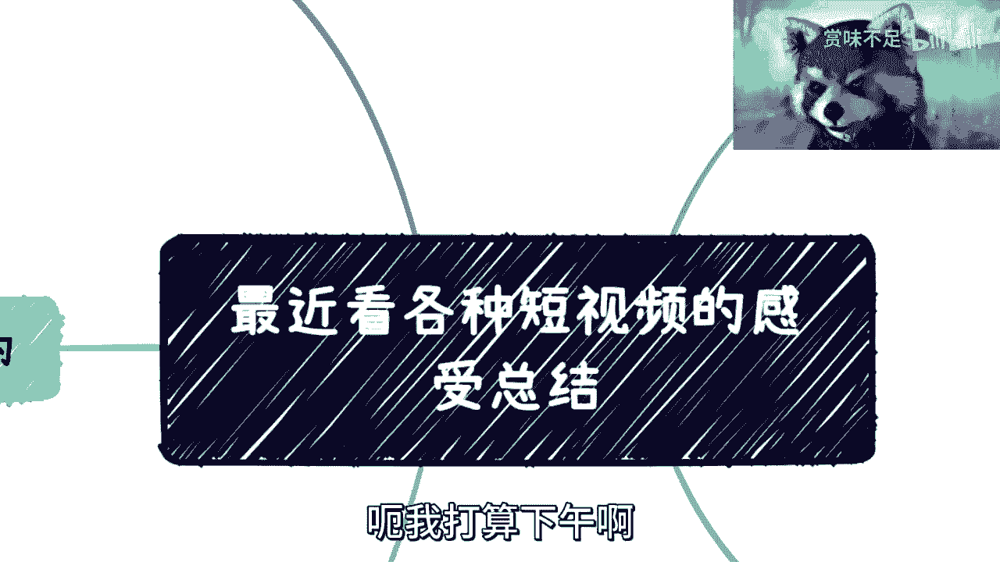

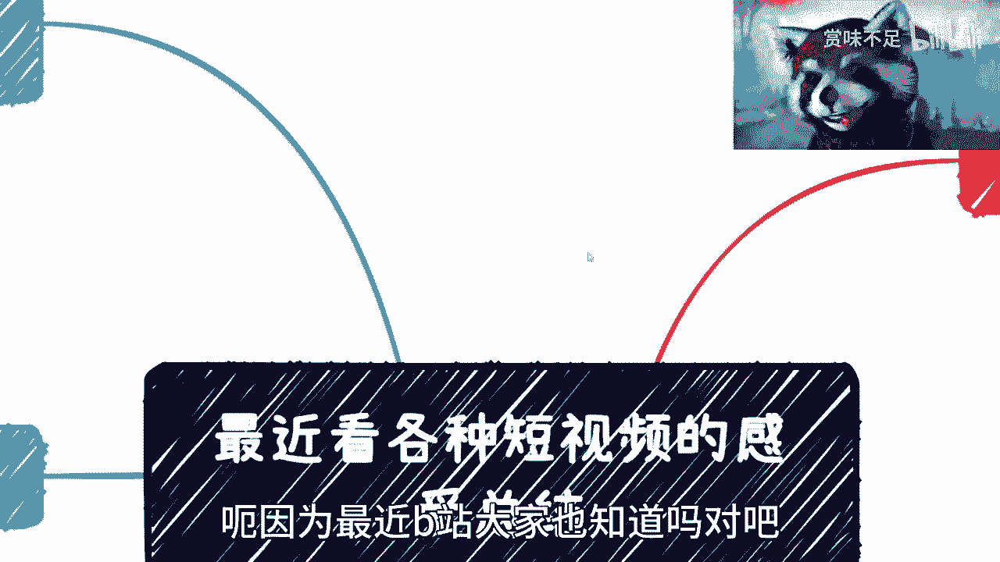

# 课程名称：短视频内容观察与个人发展思考 - 第1课 📺

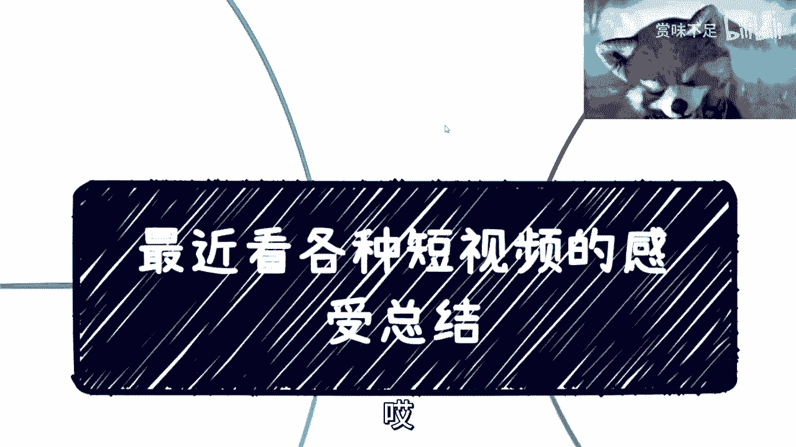

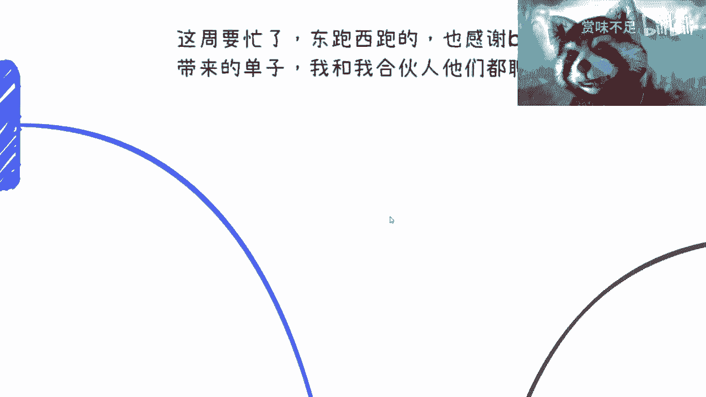

## 概述
在本节课中，我们将基于对当前短视频平台（如B站、抖音、微博）内容的观察，分析其中存在的普遍现象与问题。我们将探讨内容质量、信息真实性、行业乱象以及这些现象对观众和内容创作者的影响，并思考在复杂信息环境中如何做出理性判断与个人规划。

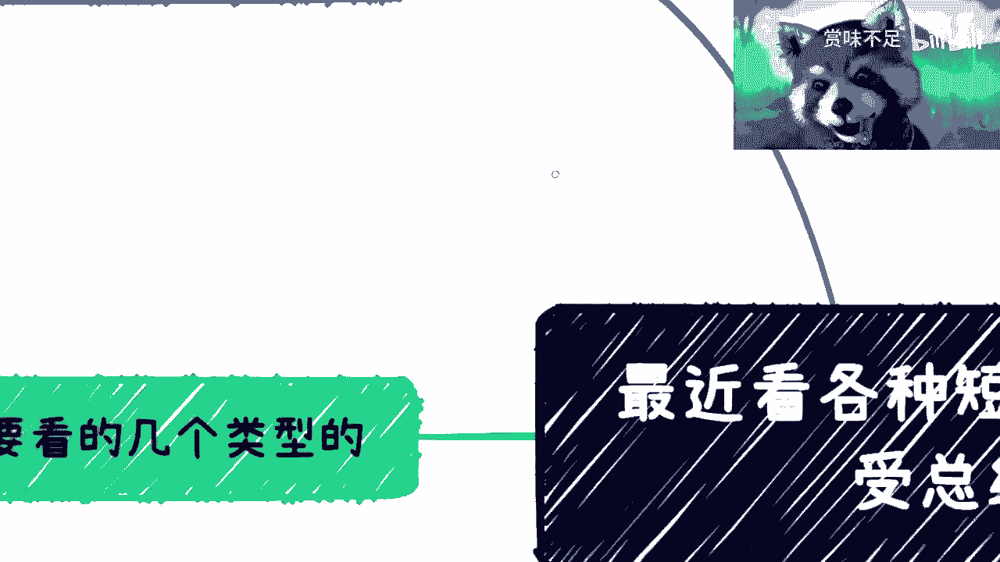

---

## 短视频内容观察：普遍现象分析

上一节我们概述了课程主题，本节中我们来看看对各类短视频内容的具体观察结果。

我最近集中观看了几个类型的短视频内容。

以下是主要的观察分类：
1.  **平台内容差异**：以B站的内容为主进行观察。微博的内容则基本以八卦信息为主。
2.  **Up主行为分类**：观察了“宣布退站的Up主”和“坚持不退站的Up主”两类。这两类行为都可能有其背后的逻辑。有的退站是真实的，有的则是为了蹭热点。而那些坚持不退站的，几乎可以肯定是蹭热点的行为，这是一种反向操作，同样能获取流量。
3.  **垂直领域内容**：针对性观看了关于ChatGPT和区块链等技术领域的视频。其他技术类内容也大致相似。

观看后的整体感受是悲观的，许多内容已经无法看下去。核心问题在于，许多视频是在“非常正经地胡说八道”，其内容的离谱程度甚至超过了AI的胡言乱语。更令人惊讶的是，这些创作者还敢露脸。

---

## 低质内容的共同特征

上一节我们列举了观察到的现象，本节中我们深入分析这类低质量内容具备哪些共同特征。

这类视频有许多共同点。

以下是其主要特征分析：
1.  **缺乏专业知识**：制作这类视频的团队或个人根本不懂技术（如GPT、区块链、大数据）。他们可能从未从事过相关领域，因此无法准确描述和解读。
2.  **内容生产外包**：整个视频的脚本、出镜人乃至制作环节很可能是外包的。这在B站很多视频中能得到印证：不同账号的观点高度雷同，虽然背后未必是同一人，但内容明显是搬运和整合的。
3.  **观点搬运，缺乏洞见**：这种情况在公众号等平台同样存在。内容观点本身可能正确，但均搜集自网络，属于跟风整合。这导致内容像一顿“不错的杂烩”，看似丰富却毫无营养，观众看完后留不下任何有价值的东西，也无法获得任何 actionable 的见解或对策。
4.  **贩卖焦虑与诱导消费**：许多视频的核心目的是贩卖焦虑（例如，渲染“你不行”、“将被AI替代”），最终导向售卖课程或服务。例如，一个三分多钟的视频可能全程在宏观层面指点江山，不涉及任何核心观点，最后突然弹出价值399元的课程链接。
5.  **内容同质化与浅薄化**：尤其在ChatGPT和区块链领域。关于ChatGPT，内容无非是“替代人类”或“必须学会，买账号”；关于区块链，则大多空谈宏观概念（如改变经济），极少有深入技术或落地应用的细致讲解，因为创作者本身并不懂。

---

## 恶性循环与行业影响

上一节我们剖析了低质内容的特征，本节中我们来看看这些内容如何形成恶性循环并影响整个行业。

这种现象正在形成一种**恶性循环**。

以下是其产生的影响和内在逻辑：
1.  **对个体的负面影响**：这些免费、传播性强的短视频，每天都在潜移默化地改变大量观众的观点。许多人看到高播放量和看似专业的包装，可能因此更加焦虑或做出错误的人生、职业判断。这比许多传统的咨询、培训更为恶劣，因为它覆盖面更广，且看似“免费”。
2.  **责任缺失**：许多内容创作者只关心流量和变现（如卖课），并不关心观众看完后的实际发展。这就像推销“Java培训”时只鼓吹好就业，却不告知市场饱和风险。学员未来能否就业、是否失业，与售课者再无关系。
3.  **劣币驱逐良币**：认真做内容的创作者，往往竞争不过有套路、肯砸钱、懂营销的“整合号”或“卖货号”。这些营销号拥有更专业的特效、水军造势和销售话术，导致优质内容被淹没，整个环境变得浮躁。
4.  **对求职与竞争的反思**：这种环境映射到其他领域（如求职面试）也是如此。一个擅长包装、吹嘘的面试者，可能在短时间内比一个真正技术扎实但不懂表达的人更占优势。因为**技术深度很难在半小时内被充分评估，但夸夸其谈却可以迅速制造印象**。

---

## 个人反思与发展建议

上一节我们讨论了行业乱象的负面影响，本节中我们将从个人角度出发，探讨如何在这种环境中保持清醒并规划自身发展。

面对这种环境，个人容易陷入自我怀疑和焦虑。

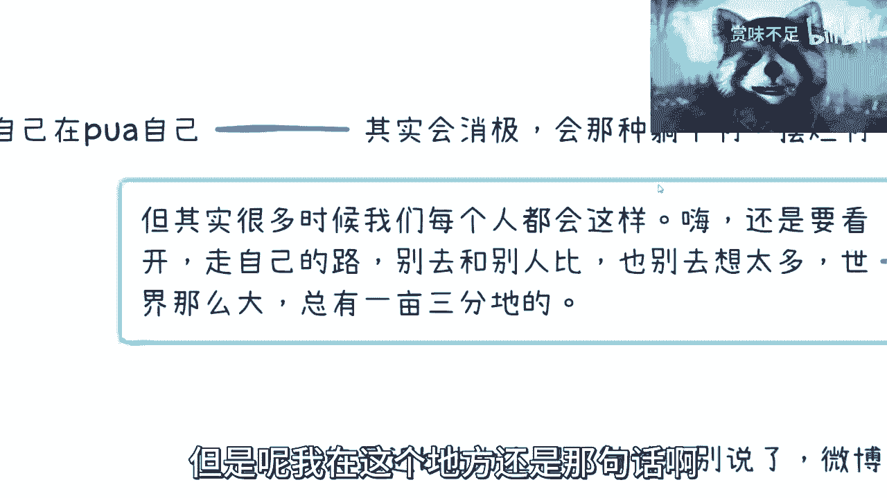

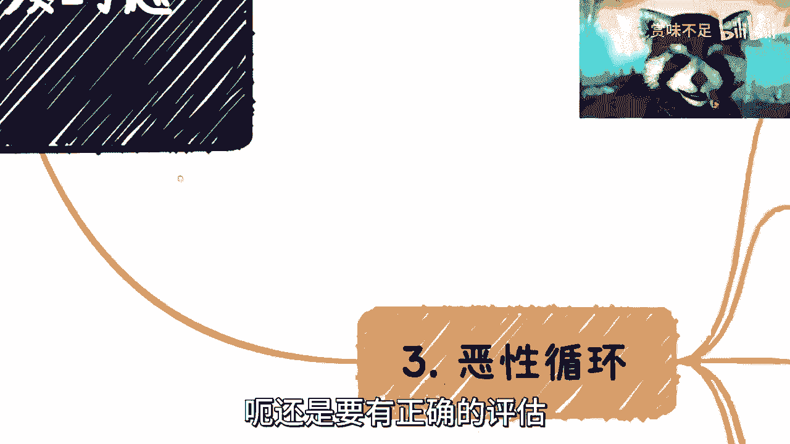

以下是一些个人反思与建议：
1.  **认清现实，停止自我PUA**：首先要认识到，个人很难改变大趋势。不必因为环境恶劣而过度自责，认为自己做的不够。避免陷入消极、摆烂的情绪漩涡。
2.  **接受差异，寻找自己的赛道**：世界很大，人和路有千万条。如果发现自己不具备某些“成功套路”的基因（如擅长画饼、营销），不必强求。关键是寻找适合自己、能发挥自身优势的领域。**公式：个人成功 ≈ 找到 (自身优势 ∩ 市场机会)**。
3.  **深入评估，避免盲目入局**：在决定进入某个领域（如做自媒体）前，必须进行深入评估。不仅要看到水面上20%的光鲜（如成功案例），更要了解水下80%的艰辛（如竞争强度、投入成本、行业规则）。对于已经过度内卷、套路很深的“红海”或夕阳行业，如果自身风格是踏实做事型，则需要格外谨慎。
4.  **培养独立判断力**：在面对海量信息时，要有意识地培养独立判断能力。不要被播放量、评论或表面的专业感所迷惑。多问几个“然后呢？”、“具体怎么做？”，以此过滤空洞无物的内容。

---

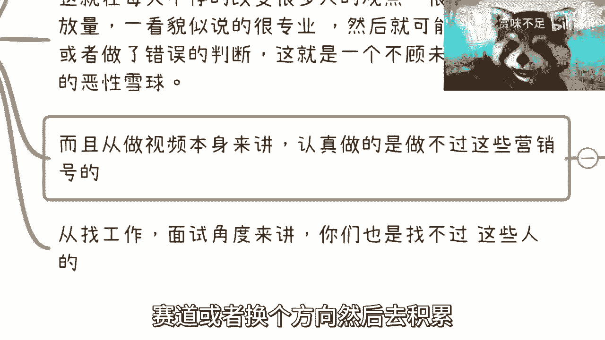

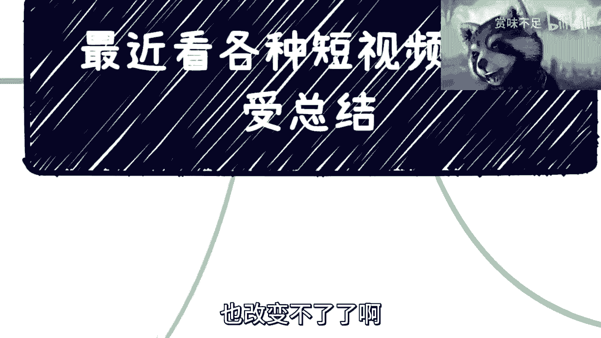

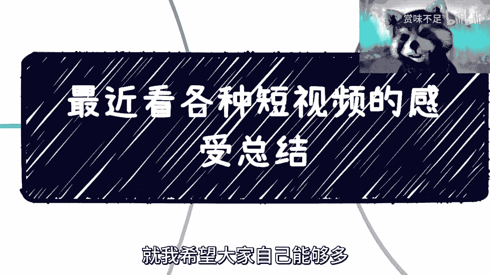

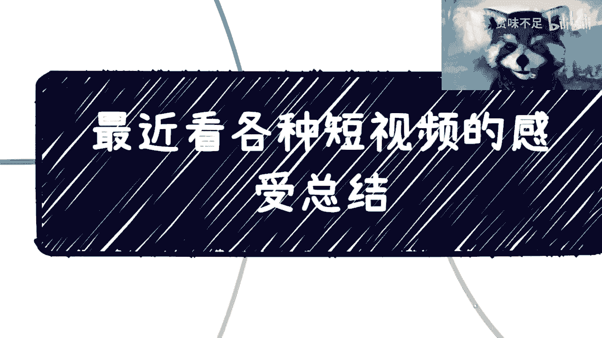

## 总结
本节课中，我们一起学习了当前短视频内容生态中存在的一些问题：包括内容同质化、专业知识匮乏、贩卖焦虑以及“劣币驱逐良币”的恶性循环。我们分析了这些现象对观众和创作者的负面影响，并最终落脚于个人如何在这种环境中保持理性，通过认清现实、接受自我、深入评估和培养判断力，来规划一条适合自己的发展道路。核心在于，**在嘈杂的信息环境中，保持清醒的头脑和独立的思考比盲目跟随更为重要**。