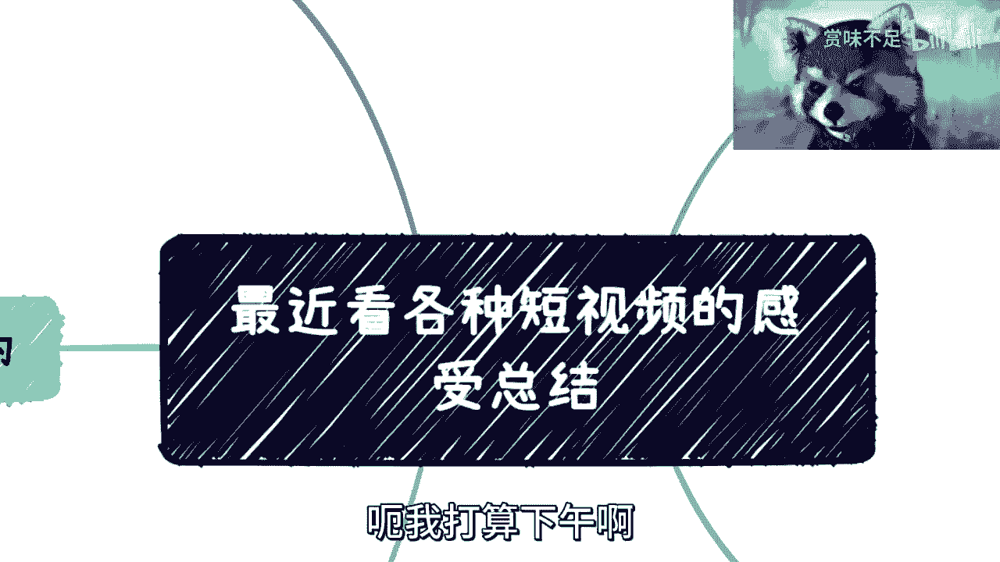
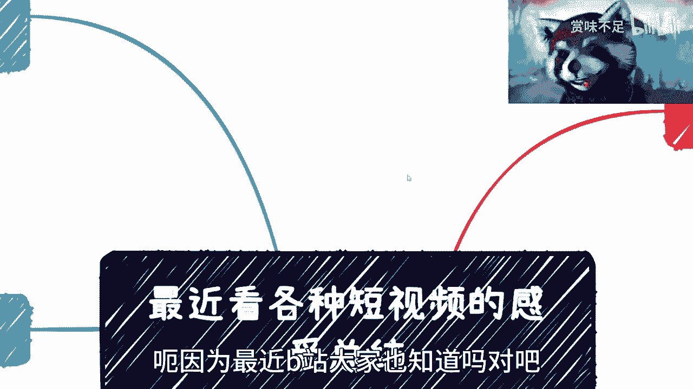
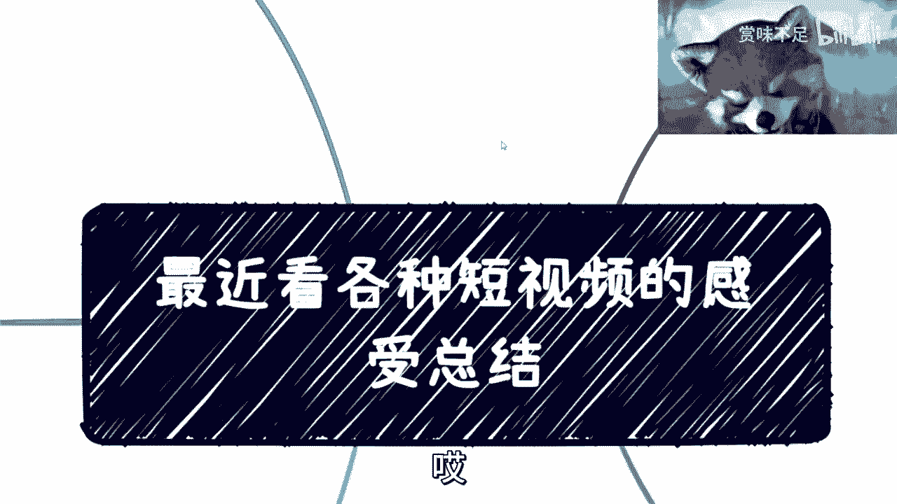
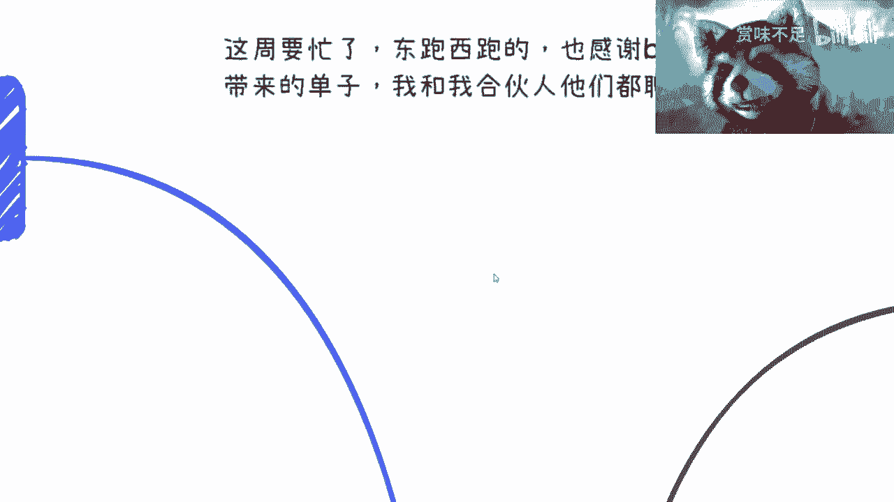
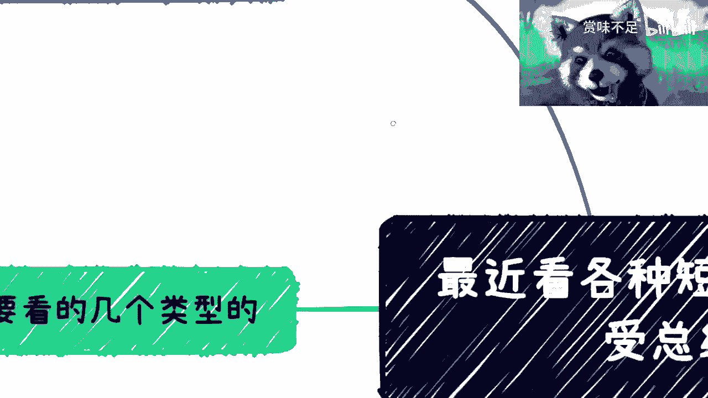
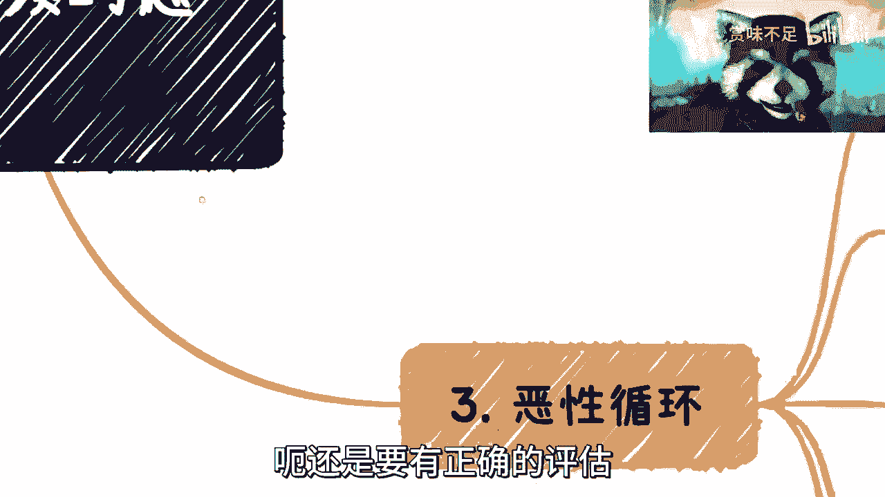
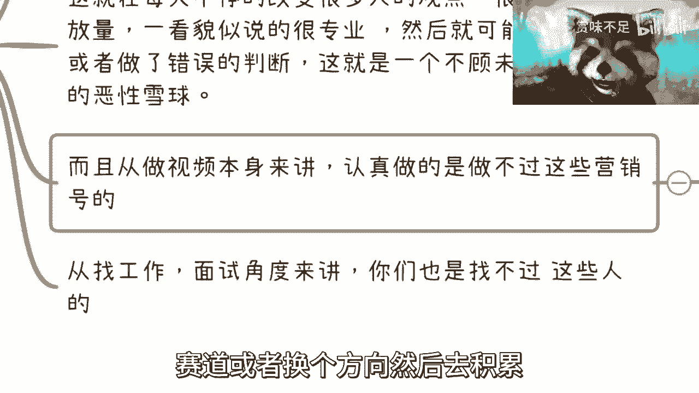
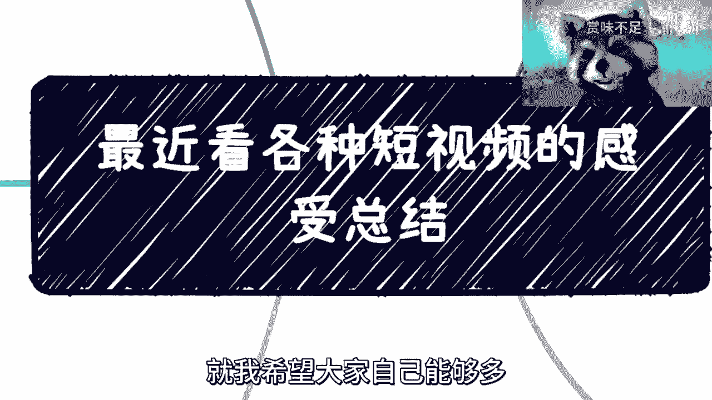

# 最近看了很多短视频，总结下感受 - P1 - 赏味不足 - BV1ps4y127AE

好大家好啊啊我打算下午啊。

下午再给大家搞一期那个数字经济啊，嗯因为最近B站大家也知道嘛对吧。

就基本上这个已经被大家用成QQ了啊，我也觉得很牛逼啊，然后我就顺便的对吧，既然我用都用了，那我就多看一下对吧，B站啊啊抖音啊，还有微博啊，反正我都看了一眼啊，然后我觉得唉就悲观啊。

很悲观很悲观呃，首先这样子的，这周呢我可能就要忙了啊，然后东跑西跑了，然后就感谢小伙伴给的一些单子啊，就是可能会有些商单，但这个商单不是广告啊，就是跟我的主页，跟我这个做区块链，做数字经济。

做这个咨询培训还是有关系的啊，我跟我那个合伙人他们会多聊聊，然后就是下个月吧，基本上下个月可能20多号再去趟香港啊。

然后跟那边的项目方什么都聊，就碰一下，这样子。

首先是这样子的啊，我最近看了几个类型啊，跟大家分享一下，一个呢就还是以B站为主的对吧，微博就别说了啊，微博就他妈只有八卦啊，对然后第二个呢就是你比如说up主推荐的对吧，那up主不推荐的对吧，我跟你讲。

这两个都有很很有道理的，你知道为什么，因为退战的呢，就是有的呢是真的退战，有的呢就是过来蹭热点的对吧，你也知道啊，那不退战的呢，我敢打赌200%是蹭热点的，就是你你反向反向那个串也反，串也是串嘛是吧。

那那肯定也有流量对吧，想好想都不用想啊，然后还有呢，就是我针对性的看了一些CHEGBT的干，还有区块链的对吧，那别的我就不去看了，就技术类的也大差不差嘛对吧，还有什么呢。

就是说呃这个反正就看完就差不多了，反正我觉得呢就很悲观，为什么呢，就是我肯定看不下去了，就是非常正经的胡说八道，而且他们的胡说八道，比拆GBT的胡说八道还要扯淡啊，而且呢就他们还露脸对吧。

就不怕被打死啊，这路上一个板砖拍过来这种啊，我也就非常服气的嗯，这是第一个，第二个呢就这类视频呢我觉得有个共同的，有很多共同的特点啊，那是什么呢，就是B站我也看过一些这个技术类的视频啊，我觉得还不错啊。

因为至少呢我觉得大家判断一些东西，至少是到咱这么说吧，一个视频比如说里面有30个观点对吧，那可能这其中至少有那么二十五六个观点，是正确的对吧，还有三四个可能是有些是有失偏颇的，我觉得这也很正常对吧。

你能保证每一个人长出来观点，200%都符合现状吗，不见得吧，啊总归会有些差别的，你说是吧，那我觉得呢就是这一类，就是我刚刚说的那类，就是之前说的那视频呢，就是他们或者这个团队呢，其实就根本没有人懂技术。

你知道吗，就是什么GPT也好，区块链也好，讲大数据也好，他就没人懂，他就以前没做过啊，你让他怎么去这个描述这件事情对吧，这是第一点，第二点呢就是呃我也看过一些这个套路啊，其实我觉得也对。

就是大概率呢就是说这些脚本啊，出镜人啊，甚至短视频的整个产出的各个环节都是外包的，唉我觉得这个也可以理解啊，因为就别的我不知道，就B站上面有很多的这种视频呢，就是它可能号是不一样。

但他观点就大差不差的啊，大差不大，但是你说他背后是不是同一个人呢，我估计也不太也不太像哦，也不太像，但是就是说呃的确都是那种搬运整合的啊，搬运整合的，然后前两天还讲了那个，我还看了一个那个公众号。

就是微信的嘛，公众号它也是一样的，就是说这公众号呢上面的这个观点都是对的啊，但是这个观点呢都是网络上搜集的对吧，就是说你一部分呢是跟风观点对吧，就网络上网络上收集，然后整合对吧。

反正错了呢也不是他们的错对吧，或者说呢他网络上收集的呢也都是对的，但是对的呢，就你你听君一席话，胜君一胜，胜听一席话没卵用，你知道吗，就是说他也没有他自己的观点，就是这个号你单纯看一个视频。

你比如说这个号单纯看一个视频，他没什么观点对吧，我觉得也就算了，你知道吗，你要点进去对吧，它历史上面所有的内容对你都是那种感觉，嗯这顿饭吃的不错对吧，就是那种杂杂烩对吧，这顿饭吃的不错。

但我就问你这顿饭吃下去你有任何营养吗，不知道啊，然后过了10分钟问你诶，你还记得吗，哦不知道，然后然后这就好像什么呢，这就好像就是说，你们可能听了很多GBT的观点嘛，对不对，然后有些人呢只只吸收了说啊。

他未来会替代人工的啊，然后我要失业了对吧，我很焦虑对吧好，那么你就问他，你说诶那你听完之后啊，你我不管你要不要时间，也不管GBT是不是要替代你，那我就问嘛，你看视频你都花了你的精力，花了你的时间。

那么你接下来是不是得要有一些措施对吧，因为你不能就像就像我们知道你比如说你要你，你你要去什么啊，应聘了对吧，你要怎么样呢，那你不能只知道这个事情，你得知道就是说对策是什么嘛，对不对，然后你就问他。

那你看了这么多视频对吧，那你知道对策吗，哦不知道，那你知道什么了啊，我就很焦虑啊，我要被替代了，那有卵用啊啊你说是不是哎哟，我真的也是绝了，你知道吗，真的我就就要就要能投诉吧，我就想一个投诉过来。

你知道吗，那这是一个连另外一个呢就贩卖焦虑对吧，贩卖焦虑是什么呢，反正你不会啊，你不行啊，PUA你反正你就不行啊，你行也不行对吧，你就要买课，哎我跟你讲这事也是很很搞笑的，我前两天就上周上周四五吧。

我有一天早上你知道吗，我也不知道怎么就怎么刷到的，我刷到一个视频，微信视频号，他讲的什么呢，就是他讲的观点，跟我最早讲三到5年失业的那个观点，其实是一样的哦，我大概看了一下，其实本质是一样的。

然后呢我就耐着性子把他的3分钟看完了啊，三分40多秒吧，看完了我看完我就有种什么感觉呢，就是就是你哪怕今天跟我说，你举我举个例子，你哪怕今天跟我说对吧，就是就是再扯淡点，你就说计算机他妈的要灭亡了。

对计算机没有了，你要失业了，我也忍了，你知道吗，他三分40多秒压根什么都没有讲，就是指点江山，你知道吗，就是围绕整个宏观全部讲了一圈，然后就是不讲任何的核心观点，就你不说他观点对错啊。

他就不讲任何核心观点，我就懵了，卧槽这是个什么玩意儿，我真的还看完了，然后你知道吗，我终于懂了，在大概3分30秒左右跳出来个链接，399唉，我，就我跟你讲就是这个样子，就是就是你会发现就整个网络对吧。

视频他就被分成这两种，你知道吗，真的就这两种，一种叫什么叫胡说八道，但不卖货的，一种叫做胡说八道，但卖货的你知道吗，那你们要问了，那驴老师对吧，除了这两类，剩下的还有吗，肯定有啊，那肯定有，在哪呢。

没有了，你们看不到了，就被这种学习淹没了，你知道吗，哎哟，真的要多焦虑多焦虑，我很焦虑，真的哎呀对吧，然后还有什么呢，就是说你看他们的观点嘛就非常的一致啊，就GBT呢，反正就是跟风啊，要替代人类了啊。

要么就是你们要用啊，你们这个必须要会啊，怎么会呢，来买99一个账号对吧，那那个那个第二类呢就是区块链，区块链更好了，我跟你讲区块链讲起来不要太容易啊，你们去看啊，这点我很有自信，你们去看。

你们全网去搜能找到几个区块链往下讲的啊，有吗都他妈围绕宏观在那边好好扯半天啊，这个干嘛那个干嘛对吧，然后要么就这个骗局那个这个改变经济，怎么改变，你倒是说呢对吗，你我就说你们能找到有几个跟我。

数字经济那个合集里面能讲的这么细的有吗，没有对吧，我不管你们去找任何教授还是什么东西都没有，为什么，因为他们不懂啊，唉我真的吗，那也是绝了，我跟你讲这个这个事情，我非常有自信啊，就那句话呢对吧。

这毕竟毕竟啊这个这么多政府，这么多企业跑下来，我能不知道整个全面是什么样子吗是吧，第三个就是恶性循环，我跟你讲，就这个事，就我昨天还跟一个这个B站咨询的小姐姐说，我说啊，原话我就这么说的。

我说我们可以改变我们每个人的个体对吧，因为他也很想做事情，我也很想做事情是吧，但我说无论我们怎么做，我们对大趋势其实是毫无影响的，我说这点我们要认清楚，因为但凡我们没有正确的认知，我们只会PUA。

我们自己觉得我们自己做的不够啊，觉得我们自己好像还能做的更多，那我们图什么呢，是不是，那这是第一点，第二点是什么呢，我跟你说啊，这种短视频在我看来比很多咨询公司啊，培训公司啊，还有什么证书。

培训恶劣的多，你知道为什么吧，因为这些东西它的长尾效应很强，而且它是免费的，你知道吗，它的传播性很强，那在我们现在每天你比如说这个每天在改变，不停的改变很多人的观点对吧，很多人一看播放量啊。

一看貌似说的很专业，一本正经胡说八道是吧，然后就可能更焦虑或者做了错误的判断，我跟你说这种就好像什么呢，我给你们举个例子，这种就好像今天对吧，我就跟比如说我要卖假班的课，我就跟你们说加班很牛逼啊。

夹吧以后就业很好就业，然后你们就来报名了，对不对好，然后呢，也许你们能找到工作，也许你们找不到工作，但是对我来讲，我只关心你们能不能交给我钱，你们未来的发展跟我有屁关系对吧，你们未来你未来发展是死是活。

跟我有关系吗，没有关系，你知道吗，这个就是为什么我其实很讨厌很多，就是说呃就是说我支持咨询培训，或者你要做证书培训，甚至你说做这种短视频，我都是支持的，但是你要客观的说出当下情况和未来的情况。

能够让大家能够客观地去做出判断，你知道吗，而不是说利用一些信息差就告诉大家好，你现在怎么样怎么样怎么样，然后反正反正心里面想的就是，你未来死活跟我也没关系，我就说嘛，你们比如说把钱交给我了对吧。

学了甲板到3年后找不到工作，失业了，难道回过头来哎，驴老师，你当时教我们甲板的对吧，你难道你你怎么你怎么我们现在失利了怎么办，可能吧，不可能的呀，没人管的，你知道吗，但是这种事情就好像我说了。

就是说你像大学老师啊，培训老师啊，他都不跟你们讲，就这个风险点对吧，你说他做的对吧，你也不能说他做的对，你说他做的不对吧，好像也没有这么不对，你说是吧，就很多事情就这个样子，啊然后那个哎内容啊在这。

然后还有什么呢，就是说呃从大局上来讲呢，其实很多退站的也好，或者现在甚至转平台的也好，其实本质上的呃原因是什么呢，就是还有一部分是做视频本身很多认真做的，就是做不过这些营销号，或者做不到这些整合号。

或者做不过这些那个卖货的话，我跟你们讲，其实为什么也很简单，因为因为人家是有套路的啊，那那那我我给你们随便指啊，人家是有特效的啊，人家是愿意砸钱的啊，人家是这个这个这个水军有水军的对吧，那我就说嘛。

你们看嘛，我有什么嘛对吧，那我除了把生产驴，生产队的驴卷死，我还能有什么嘛对吧，我一没套路，二没特效，我连加个字幕都懒得加是吧，我也不愿意砸钱对吧，我也没水军对吧，那人家一看哦，这个货这个号下面对吧。

都是都是这个这个就50%，骂的50%，好的那个下面卧槽，都他妈是买单对吧，我要买，我要录，那人家就就跟风录了对吧，那你怎么会做得过呢，你说是不是对吧，就其实哎就是就这么个情况，你知道吗，就是我告诉你们。

你们很多人，你们很多人找过我的，你们应该也知道对吧，你们有很多人会跟我说，哎呀我想回家做个短视频，做个自媒体，我就问嘛，你们怎么做都不，人家你们想想看啊，就但凡仔细想想看都不会有这份自信，你知道吗啊。

然后比如说找工作也是一样的，面试角度来讲，我就问嘛对吧，从如果从面试角度来讲，不管你们今天面的是一个自媒体，还是面的是一个开发面的什么，你们能找得过人家有套路的对吧，有会包装的啊，会砸钱的对吧。

或甚至甚至有这种这种影响力的，你搞得过人家不来，对不对，你跑过去卧槽，老子技术很牛逼，who care啊，那你们又要说了啊，陈老师，你这样说是不对的对吧，怎么可能不在乎呢对吧，技术面试肯定要在乎的。

我跟你们讲，还是那句话，你们技术不，你们技术牛不牛，是靠半个小时一个小时能明白的吗，啊你们自己想想看就知道了呀，对了半个小时一个小时吹牛逼，吹水包装是可以把它吹晕的，你吹技术呵呵，懂得自然懂是吧。

唉就这么个情况对吧，这是三啊，四在这里啊，我给你们分享个就前两年的故事嘛，就是我曾经跟一些谈商务的，就是我相当于去认识一些新的朋友嘛，一边聊呢，其实聊的时间不长，大概也就我的小浣熊怎么不动了啊。

就是一边聊呢，也聊的不长，就聊了大概一个多小时，那一边聊呢，我就在思考人生了，为什么呢，因为我思考的是对方呢，就是个彻头彻底彻尾的骗子画饼专业户啊，他起码比我高50个live是吧。

他可以他可以什么都不会啊，然后就靠流量，靠流量跟流量的结合就是强强联手，是吧，就能赚钱就能割啊，我跟你们这么说吧，可能你们没有概念啊，就哥的这个水平线是什么呢，就是百万啊，百万级别百万级别啊，就能割啊。

而且没成本啊，没成本，根本就不需要工作啊，也不需要产出价值，你说他真的产出价值吗，你说他真的给企业或者个人带来很大利益吗，也没有对啊，你说这种这种人世界上很多很多。

就单纯我身边有很多很多上海就很多很多是吧，然后我就陷入沉思，你知道吗，就是我陷入沉思的，就是说这种人这么多，这个行业市场怎么会好对吧，这是第一点，第二点是我也深深的知道我没有这个基因。

就是我很想变成他这样，但是我变不成啊，我是特垃圾是吧啊，那相同的呢我也pk不过这类人是吧，我就陷入陷入了沉思啊，但是呢我陷入了一部分时间之后呢，我觉得是这样子的，这个事儿呢，就是我觉得啊。

就是你们很多人可能跟我是一样的，就是你们一度陷入自己跟自己过不去的情况，但这种情况呢我觉得就是说会很消极，会摆烂，会躺平啊，但是我跟你们说，这种情况其实是自己在PV自己。

但这种情况自己要走出来其实蛮难的哦，其实蛮难的，就是就是当局者迷嘛，你会陷入一种就是这种思维的漩涡，然后就觉得哎呀，我我好像怎么努力都拼不过这种人，我好像呃怎么做都很难往上走，或者我不知道该怎么办。

你知道吗，但其实我觉得没必要这么讲，因为没必要这么想，因为什么呢，因为你最终还是要看开，就是嗯世界这么大对吧，中国这么大，这么多人，有千千万万条路对吧，千千万万个人，千千万万个圈子，你也别想这么多。

就像我之前有一期不是说嘛，你别去跟别人比是吧，你你要想的就是你比如说我当时就觉得，那算了对吧，我既然诚不为这种人，那我就寻找自己的路呗对吧，那能找到就找找不到，那也是我的命啊，我也认了是吧。

那我能力不足是吧，就是想办法去找嘛对吧，总有自己一亩三分地嘛，总归可以做的，但是呢我在这个地方还是那句话啊。

就是你们去找这个方向的时候呢，呃还是要有正确的评估。

就像我这边讲的那个短视频是一样的，就是你们做任何一个东西得要对这个东西呃，就水上20%和水下80%的，这个内容你都要去有了解，你再去评估你能不能做，因为很多东西就已经卷的水都没有了。

然后又是夕阳行业对吧，然后大家就是套路又很深，你呢又想去做的时候都是那种很实诚的对吧，就就就踏踏实实干活的那种思路，那肯定是做不了的，你明白了嗯，所以你们其实有些小伙伴，你们咨询过我的就知道吗。

就是就是你们可能跟我说了一大堆，你知道吗，但是我回答是什么，就是别做就这么简单，别做做不了浪费时间，你知道吗，就就还不如找换个就是赛道或者换个方向，然后去积累唉。

反正就这么个情况吧，我觉得这个呢也改变不了了啊。

改变不了了，但是，就我希望大家自己能够多多判断一下吧。

不要浪费太多时间吧，好吧行。

