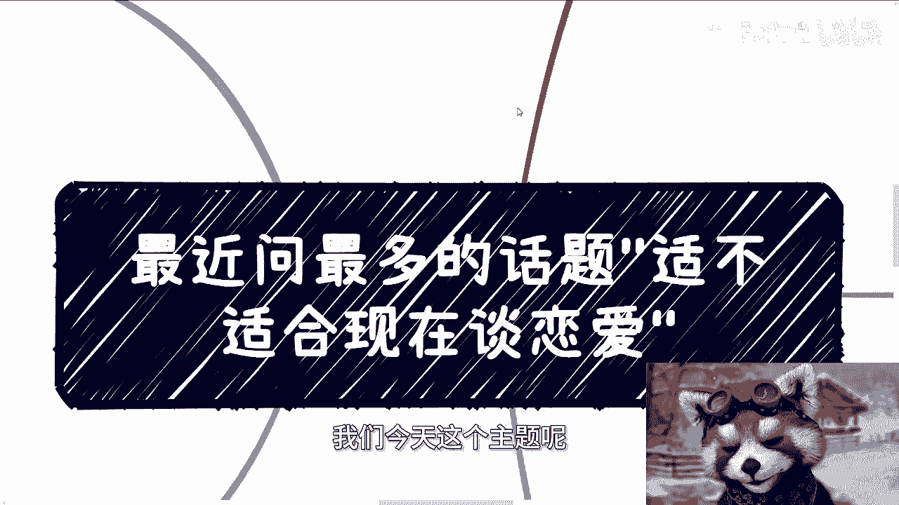
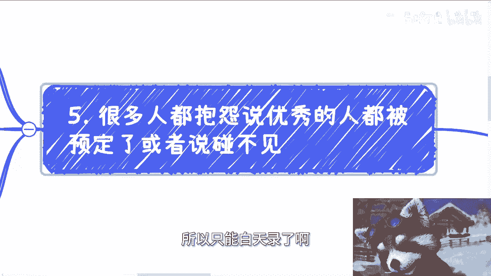
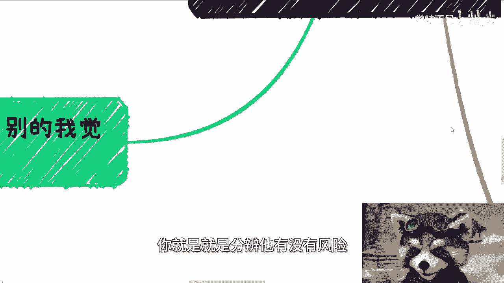
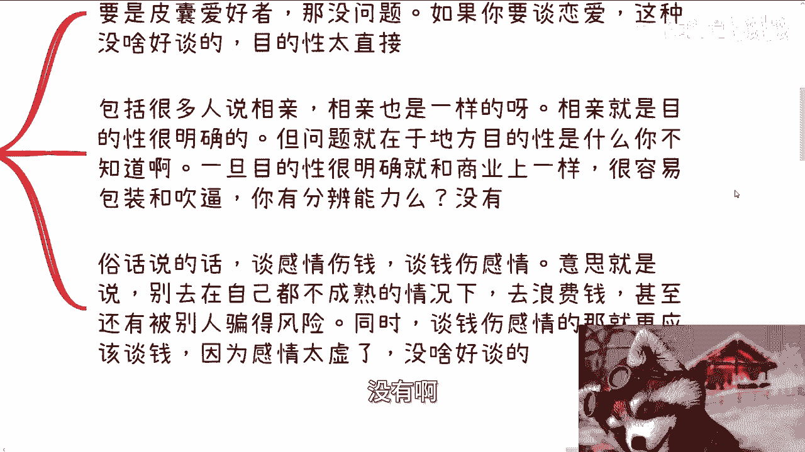
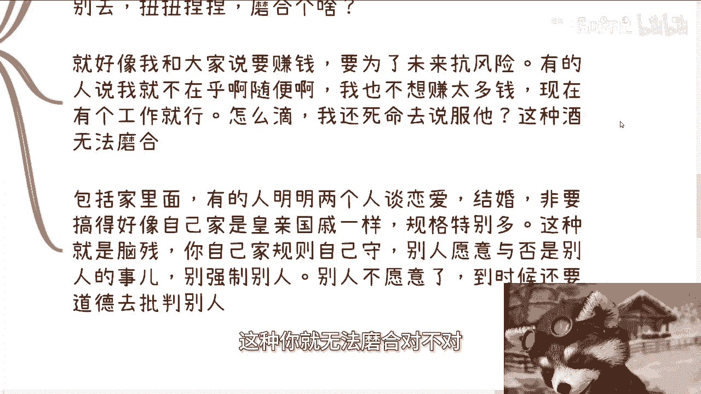
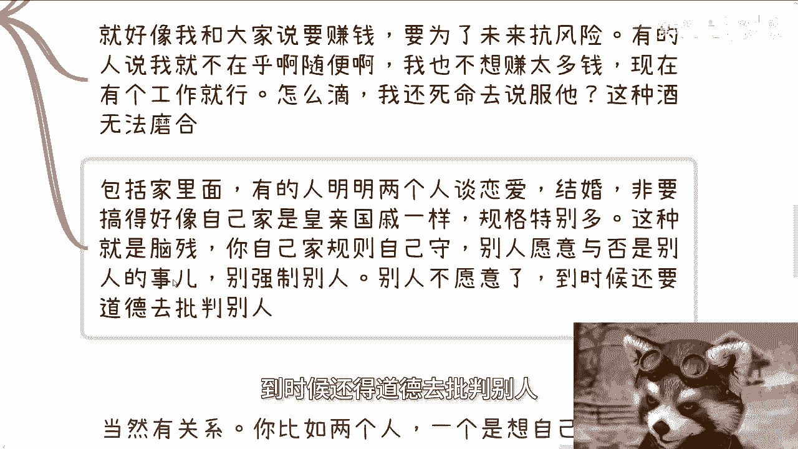
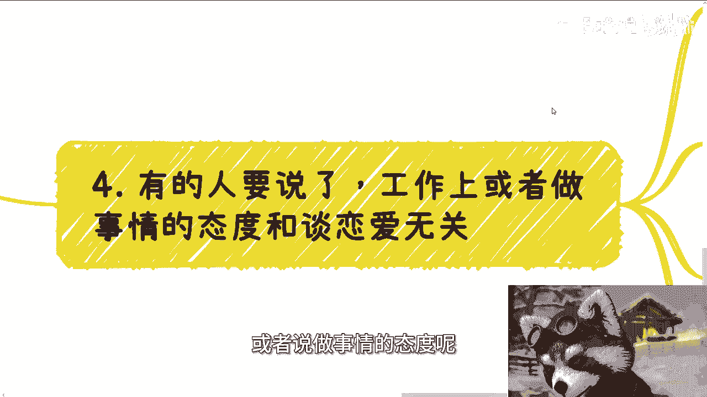
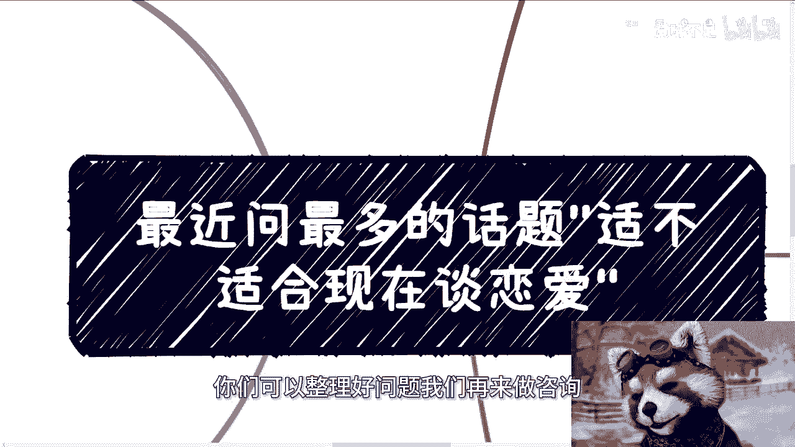

# 最近问得最多的话题“现在适不适合谈恋爱” - P1 - 赏味不足 - BV1Rm421P7ge

好大家好啊，我们今天这个主题呢也是最近咨询的时候。

很多小伙伴顺便啊，他们问的就是说啊这个现在适不适合谈恋爱。

那当然啊这个我们也不是围绕这个话题来的啊，啊明天杭州就活动了啊。

我今天晚上没空给大家录，所以我只能白天录了啊。

嘶呃首先啊我个人的观点是这样子的，就除了女性的生生育年龄问题以外。

别的我觉得都不是问题啊，就当然啊，虽然每个人都有每个人的活法，大家也可以自己自己去选择啊，但是我的观点是什么呢，就是除了女性的生育年龄啊，可能因为是跟自己的身体真真实实绑定的。

可能会带来伤害或者危险以外，我觉得别的东西呢，没什么东西是需要硬性去考虑的，也就是说你可以认为自己年龄不小了对吧，你也可以认为就是说呃可能结婚越晚，对自己越不利，或者说父母催对吧。

或者让心里家里安心对吧等等等啊，我不管你出于什么目的，但是呢我觉得你们得要记住一点，就是这些呢都不是什么硬性条件，就一切都看你怎么想，就并不是说什么东西规定啊，你怎么样怎么样啊，嗯对吧，这个事情啊。

其实很多人会觉得呢早点谈多谈一点诶，多磨合一点对吧，肯定是有好处的对吧，就跟你去赚钱一样，多积累一点经验，呃首先这个点呢我是认可的，但是我觉得大家对于磨合这个事情呢，可能有误解。

就是所谓磨合是什么意思呢，就是它是有个大的前提的，就是三观他大体是一致的，或者说对于很多事情，在呃整个战略方向上面看法是一致的，然后在战术上面就是在细节上或者小问题上面，大家可以磨合，但实事求是来讲。

现在这个社会啊，你想找到一个大体一致的人啊，其实就很难啊，这也是我认为就是说呃，本质上都是顺其自然的这么一个点，因为别的一切的行为其实都是带有目的性的啊。

你带有目的性呢，你就是就是分辨他有没有风险。

或者说你说他有没有风险的比例就会更高啊。

那么第二点呢，就是我们刚刚说的这个目的性很明确啊，基本上就不靠谱，而且太累，你比如说路上有人来搭讪啊，那那那那那还能说什么呢，对吧，那肯定是被皮囊所吸引的，那当然了，你要是个皮囊爱好者，那也没问题对吧。

你要是谈恋爱这种没啥好谈的，因为有啥好谈的呢，就目的性太明确哦，包括很多人说相亲，我跟你讲相亲也是一样的，相亲就也是个目的性非常明确的事情，但问题你知道在哪，问题就在于说目的性是什么，你不知道啊对吧。

你说你是一个很善良的人，很傻白甜的人去相亲，那对方不一定啊，那对方就算一定他父母不一定啊，他父母就算一定他亲戚不一定啊，对不对，那一旦上目目的，我跟你讲很明确，他就跟商业一样，就很容易进行包装。

很容易吹逼，很容易做准备，那我就问嘛，你有分辨能力吗，没有啊。

那么俗话说得好，谈感情伤钱，谈钱伤感情什么意思呢，意思就是说，你别去在自己不成熟的情况下面去浪费钱啊，你你去浪费钱呃，去谈这个感情，你甚至就会被别人骗对吧，那同时就说谈钱伤感情这个事我跟你讲。

那就更不应该谈钱，因为什么，因为你感情这东西是虚的，你你你人心隔肚皮。

你说什么我能信吗，我不信，我只信钱，对不对，其实就这么简单哦，我觉得没啥好谈的，那么第三大致的三观呢必须吻合，否则我跟你讲。

你磨合个屁啊，我给你举个几个例子啊，你比如说吃饭啊，前两天微博上有个事很搞笑，就我不知道是不是真的啊，就说两个人去黑珍珠，然后呢女的是刚点了四个荤菜啊，然后男的就说啊已经四个荤的对吧。

怎么样怎么样怎么样，反正意思就是说差不多了啊，或者说你你你你你可能点的多了或者贵了对吧，或者怎么样子啊，那我们就这么说啊，从细节来讲啊，我们能看出一个人的格局或做事情的方式，就是你你要活的透彻对吧。

什么意思，就是穷有穷的活法，富有富的活法对吧，你你你有开心的活法，有不开心的活法对吧，那这种事情磨合不了的，就如果你比如说已经两方决定去黑珍珠了，那么你吃多少就别说了呗，你你你心里是有预期的呀。

你对黑珍珠什么预期啊啊人均他妈的两三百吗，那不可能的呀，对不对，你随便点点，我不说点茅台，不说点那个呃，就是海海鲜对吧，你起码五六百以上吧对吧，那那你你你要吃多少就别说，而且你要觉得贵。

一开始就可以别去扭扭捏捏对吧，到那边可以开，开始就是说哎呀开始什么，说这个说那个磨合个啥呢对吧，而且就好像我跟大家说要赚钱，要为了未来，为未来的事情抗风险，有的人他就会说呀，我不在乎，关我吊事对吧。

我就不太想赚钱对吧，现在有个工作就行了对吧，甚至我可以啃老，那怎么滴啊，哦我还去死命说服他们，就这种你就无法磨合。

对不对，而且你包括家里面有的人，我跟你讲，很搞笑的，明明两个人谈恋爱，两个人结婚，那非要搞得好像自己他妈的家是皇亲，国戚一样的，就他妈规矩特别多，而且我跟你讲，这种就是脑残，就是你自己加规则，你自己守。

别人愿不愿意跟你一起去守，那是他妈的别人的事情对吧，然后他们呢在谈了恋爱，在结婚之后呢，还强制让别人去遵守，而别人不愿意嘛，到时候还得道德去批判别人。

他妈不是，是什么对吧，那我就你就告诉我这种东西，怎么磨合，对吧啊，那第四点有人要说了，他说工作上呢或者说做事情的态度呢。

跟谈恋爱没关系，我跟你讲啊，当然有关系，为什么，因为你比如两个人，一个是想自己做点事情的，想自己赚点钱的，想实现自己价值呢，也为未来考虑的，另外一个人，他现在就做牛马，也没有这个想法，也没有这个格局。

那其实当然啊，你现在看来是没什么问题，没有人说一定不能做牛马对吧，但容易为未来埋雷啊，什么意思啊，比如说你单纯谈个恋爱没问题啊，但你要结婚或者往后走，这事就多了去了对吧。

那么这个时候就主要看这个牛马对于奋斗，或者对于未来对于大局的一个态度，那当然他嘴上一定会说支持，但是他是不是真的支持呢，他心里怎么想的，你知道吗，你不知道对吧，以后的日子长了。

你可能会尝试各种新的东西啊，包括就是说啊，也可能就是说各种出差，或者说各种未雨绸缪对吧，但如果这个牛马不是真正的支持你，不是真心的去理解你，那没问题啊，我跟你讲时间一长，他就会不耐烦。

甚至觉得你是不是背叛他，你说烦不烦啊，你这人以后日子怎么过，你很多时候你要明白一点，不是什么事情都能磨合的，如果从心底他就不认可，不能不要就是啊如果他从心底不认可，那就不要磨合。

你强行改变一个人没有意义啊，又不是他妈的路上人死光了啊。

男男的只剩下你，女的只呃只剩下这个她或者她可能吗。

来对不对啊，那么第五点就很多人呢会抱怨，就说啊优秀的人都被预定了。

或者说碰不见，我跟你讲啊，实事求是来讲，你说优秀的人都有呃，就大概率可能有对象，或者还说大概率啊，怎么呃，就是说他们可能要求有点高，那我信了，那你包括你说好公司很难找，我也认可的。

但本质上并不是这些原因啊，更根本的原因是，我觉得大家根本就没有去找啊对吧，然后就不停的用这句话来麻痹自己啊，你就像你找对象，我就问你，你找了不来，你怎么找啊，哎我操你，你张口就来跟我说。

找不到你找了吧啦，对不对，你没找呀，你就像说优优秀的人，你通过什么渠道啊，相亲吗，还是晚上去酒吧蹦迪，你日常就没有业务在外面，你日常就与这个社会不接轨，哪来的对象啊，哎你你连赚钱的渠道都找不到。

你还找对象，对不对，那你反过来想想看，你你口中这些优秀人在干嘛呢，都在家里躺尸吗啊那不可能的呀对吧。

所以我一直跟身边人是这么说的，我说我们先需要提升你自己的level跟整个的圈层，这样你才有更高的概率，碰到一些三观或者说格局上比较大，三观上跟你比较一致的，或者大战略方向上面比较一致的这些人。

然后在这些过程当中啊，再就是说你们合作也好，或者在日常的这种这个呃，比如说社交渠道当中对吧，就日常社交不是说你们相亲啊对吧，日日常社交渠道当中你们可能认识的对吧，顺其自然的去相识，去相知，你再去过滤。

这才是最好的，因为这个时候大家都没有很明确的目的对吧，大家只是说哎，我们可能可能先从朋友开始做对吧，怎么样怎么样怎么样。

你否则你急啥呢，对不对，就本质上还是那句话。

我觉得人活着你不是说一定要去谈恋爱，一定要去结婚的对吧，你你你谈不谈，你不得找合适的吗，我他妈瞎瞎他妈谈对吧，而且我我觉得大部分人其实沟通下来。

他现在都属于立足未稳，因为当下这个社会跟以前毕竟不一样对吧，你你说你你你现在自己赚钱也好，你自己在这个社会上的认知也好，各个方面你都不成熟，你说你谈谈什么东西啊对吧，我不管你男的还是女的。

你谈什么东西啊，有啥好谈的呢，要么奇了怪了对吧，所以所以我跟你们讲啊，这就像我之前说的那个点，就是有有那些呃，不是之前我们提到过一个话题吗，就说哎陈老师啊，我在学校里面，我的那些同学我要不要去社交社交。

我直接跟他们说的就很清楚嘛对吧，就是你要社交可以，你的目的是什么对吧，就是如果你今天说我就是缺朋友，那你去社交OK啊，但是你要是你你要是跟我说，你想你说我想去呃，找点赚钱的渠道。

或者说认识一些商业上可能大家能够互补的人，那我就跟你讲了，你目的明确，你就把他们当工具人，把他们当牛马，对不对，你否则你去认识干嘛呢，诶怎么奇了怪了，对不对，就是你做件事情要有目的性。

我不管这个目的是好还是坏，我不管你是一个勇者还是一个恶龙，你你做事总有目的性啊，你没目的性，你做做做了干嘛，这不浪费时间嘛，是不是诶，就很神奇，你知道吗，就是就是就是你包括谈谈恋爱也是的，就我问他们问。

那我说你们为什么要谈，我说你们心里是想谈吗，那倒那倒也没有，那我说你们为什么去谈呢，我就搞不懂呀，对吧啊行吧，反正就这么个点嘛，嗯啊好。

那明天晚上杭州就活动了好吧，那个下一期我还没想好，但下一期我估计呃放放深圳吧，放深圳吧，深圳具体时间我还没定，因为下下个月我要给那个书交所，这边去上点课啊，所以就是可能时间还没定，那到时候再说吧。

啊哦OK那就先这么着吧，然后职业规划商业规划好吧，然后股权啊，额分红啊，商业计划书啊对吧，包括那个白皮书啊，包括其他各个东西啊，包括你现在你现在比如说有offer，或者你手上有什么有什么牌要打的。

什么可能或者说什么牌都没有啊，你希望通过跟我的沟通来够梳理你的一个思路，或者还是说希望通过我的视野，通过我的一些视角，能够给大家一些，更贴近于当下社会发展的一些规划，你们可以整理好问题。

