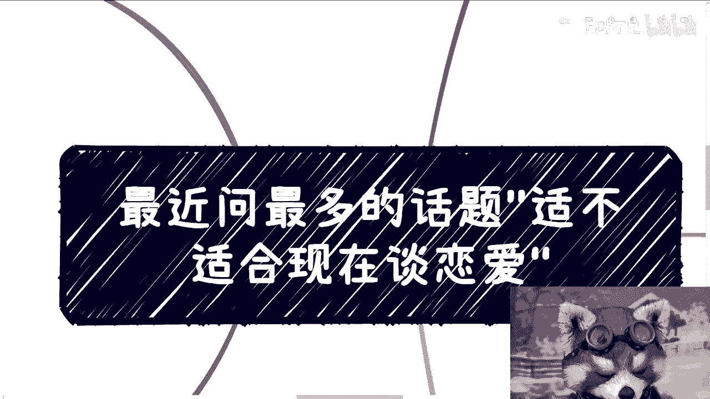

# 恋爱规划课 P1：现在适不适合谈恋爱？💭

在本节课中，我们将探讨一个近期被频繁问及的话题：“现在适不适合谈恋爱”。我们将从多个角度分析这个问题，帮助你理清思路，做出更适合自己的判断。

## 概述：核心观点与前提

首先需要明确一个核心观点：除了女性的生育年龄是与其身体健康直接绑定的、可能带来实际风险或伤害的硬性因素外，其他所有关于恋爱时机的考量，本质上都不是绝对的硬性条件。

**公式：** 是否适合谈恋爱 ≈ 个人意愿 + 现实条件 - 不可控风险

每个人的活法不同，你可以因为年龄、家庭压力或社会观念而考虑恋爱，但请记住，这些因素都**不是**必须遵守的规则。一切最终取决于你自己的想法和感受。

## 关于“磨合”的误解

上一节我们介绍了核心观点，本节中我们来看看关于“磨合”的常见误解。很多人认为早点开始恋爱、多积累经验就像赚钱一样有益。这个类比有一定道理，但关键在于对“磨合”的理解。

所谓“磨合”，有一个大前提：双方的三观大体一致，或者在人生战略方向上的看法基本吻合。磨合是针对战术层面，即生活细节和小问题的调整。然而，在当今社会，找到一个大体一致的人本身就非常困难。

因此，本质上，恋爱更像是一件**顺其自然**的事情。任何带有强烈目的性的行为，其风险比例都会相应增高。

## 目的性过强的风险

基于对“磨合”的理解，我们进一步探讨目的性过强带来的问题。带有明确目的性的恋爱行为，往往不靠谱且令人疲惫。

以下是几种常见的目的性过强场景：

*   **基于外表的吸引**：例如路上搭讪，这几乎完全基于皮囊吸引。如果你是外貌爱好者，这无可厚非，但以此为基础的恋爱往往缺乏深度，因为目的性过于单一和表面。
*   **相亲的模糊目的**：相亲本身就是目的性明确的行为。问题在于，双方及背后家庭的目的可能并不透明且不一致。一方可能是寻求真诚关系，另一方则可能掺杂了经济、家庭等其他考量。在明确的目的驱动下，人很容易进行“包装”，而缺乏社会经验的你，未必具备分辨能力。

## 感情与金钱的边界

俗话说“谈感情伤钱，谈钱伤感情”，这揭示了恋爱中需要警惕的两个方面。

1.  **谈感情伤钱**：在自己心智或经济不成熟时盲目投入感情，可能导致金钱浪费，甚至被骗。
2.  **谈钱伤感情**：在感情基础不牢时涉及金钱，更容易产生隔阂。因为感情是主观的（“人心隔肚皮”），而金钱是客观的。在缺乏信任时，人们往往只相信看得见的利益。

因此，建立关系前，需要想清楚自己处于哪个阶段，能否承担相应的风险。

## 必须吻合的核心三观

如果核心三观不吻合，所谓的“磨合”将无从谈起。强行磨合只会带来痛苦。

以下是几个无法磨合的核心三观冲突例子：

*   **消费观与生活态度**：例如，双方决定去高端餐厅（如“黑珍珠”），一方在点菜时却对价格或菜量斤斤计较。这反映出双方对生活品质、消费预期的根本差异。穷有穷的活法，富有富的活法，这种底层的生活哲学很难改变。
*   **人生追求与价值观**：一方积极奋斗，为未来筹划；另一方安于现状，满足于“做牛马”。在恋爱初期或许问题不大，但若关系走向长期或婚姻，这种对未来的根本态度差异会成为重大隐患。嘴上说支持容易，但心底是否真正认可并愿意共同承担风险，才是关键。
*   **家庭规矩与边界感**：有些家庭会将自己的一套规矩强加于子女的伴侣身上，并道德绑架对方遵守。这种缺乏边界感、强行要求他人融入自家体系的行为，是典型的单方面规则，无法通过磨合解决。

**核心原则：如果对方从心底就不认可你的核心价值或生活方式，那就不要试图磨合。** 强行改变一个人没有意义，世界很大，选择很多。

## 如何遇见“对的人”？

很多人抱怨“优秀的人都被预定了”或“碰不到”。但更根本的原因可能在于：**你并没有真正主动地、有策略地去寻找和接触他们。**

以下是关于寻找合适伴侣的路径建议：

*   **提升自我与圈层**：首先需要提升自己的Level（层次）和所在的社交圈层。当你自己变得更优秀时，你才有更高概率接触到那些在格局、三观上与你更匹配的人。
*   **在自然社交中相识**：最好的相遇发生在日常的、非功利性的社交活动中，例如行业交流、共同爱好社群、合作项目等。在这种场景下，大家没有明确的婚恋目的，更容易从朋友开始，自然地相识、相知，再逐步深入了解和过滤。
*   **明确行动目的**：做任何事都应有清晰的目的。如果你现阶段的重心是个人成长和立足社会，那么盲目投入恋爱可能就是在浪费时间。先想清楚“我为什么要现在谈恋爱？”，答案自然浮现。

## 总结与建议

本节课中我们一起学习了如何理性分析“现在适不适合谈恋爱”这个问题。

我们来总结一下核心要点：
1.  **除女性生育年龄外，无绝对硬性条件**：恋爱时机主要取决于个人意愿与具体情况。
2.  **磨合有前提**：需三观大体一致，否则磨合是空谈。
3.  **警惕目的性过强**：无论是快速吸引还是相亲，过于明确的目的会增加风险和疲惫感。
4.  **分清感情与金钱**：在不成熟时，两者混淆容易带来伤害。
5.  **核心三观必须吻合**：消费观、人生追求、家庭边界等底层差异难以调和。
6.  **主动提升，自然相遇**：与其抱怨，不如先提升自己，在更优质的圈层中顺其自然地相遇。

**最终建议**：对于大多数“立足未稳”的年轻人而言，当务之急或许是先完善自我，在社会上找到自己的位置。恋爱不是人生的必选项，找到**合适的**人远比在**不对的**时间盲目开始更重要。请先梳理清楚自己的生活、事业与目标，当你自己准备好时，对的人可能就在更优质的道路前方等你。

---
（注：文末关于杭州/深圳活动、职业规划咨询等推广内容，因与核心教程无关，已按您的要求省略。教程严格遵循了所有格式与内容要求。）