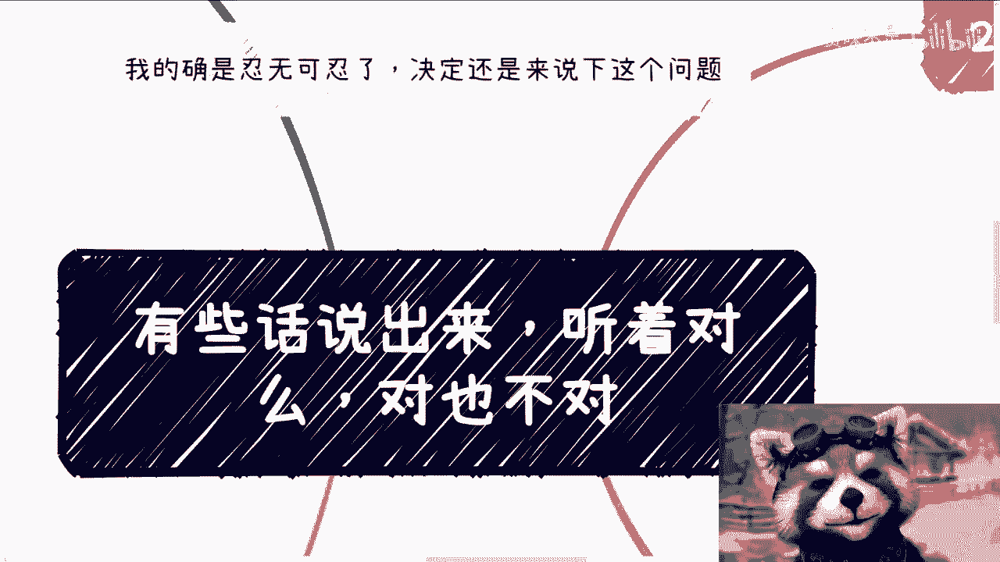
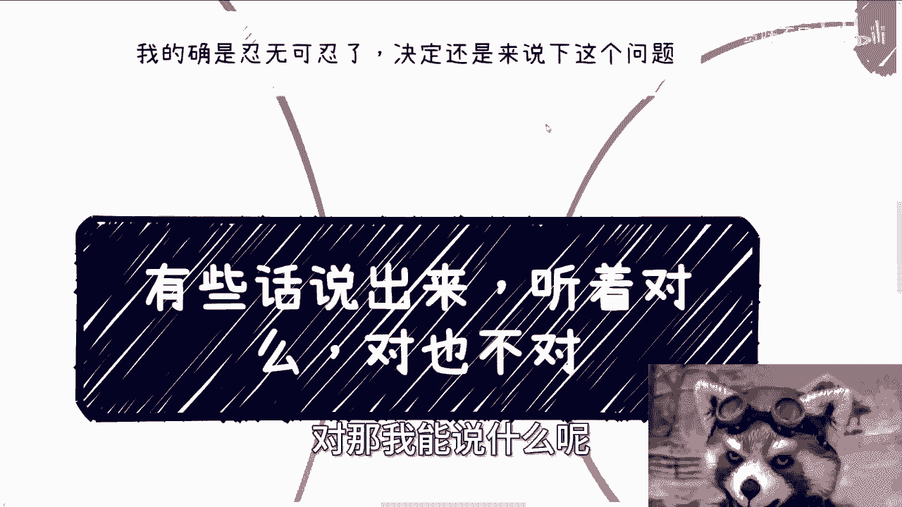
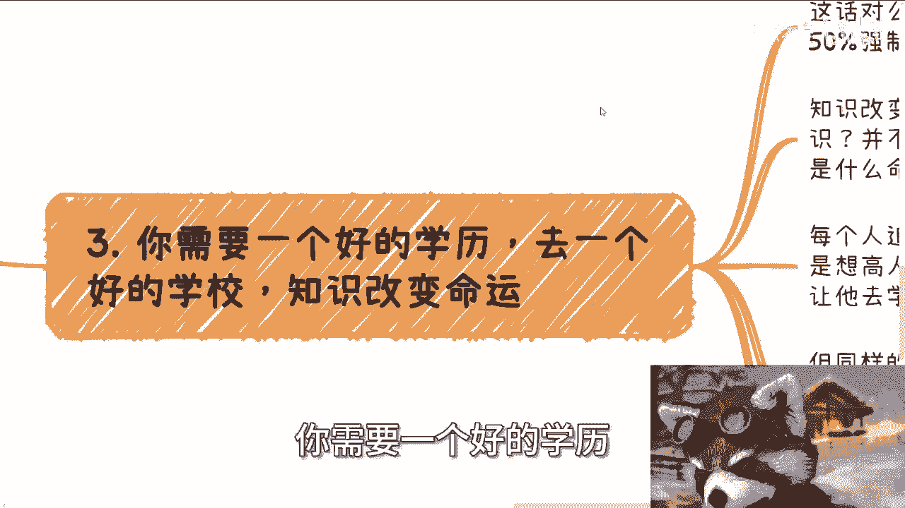
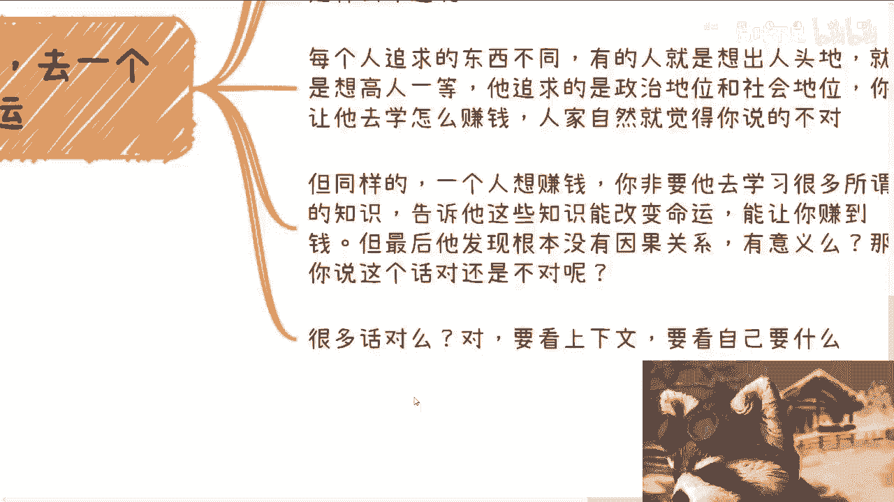
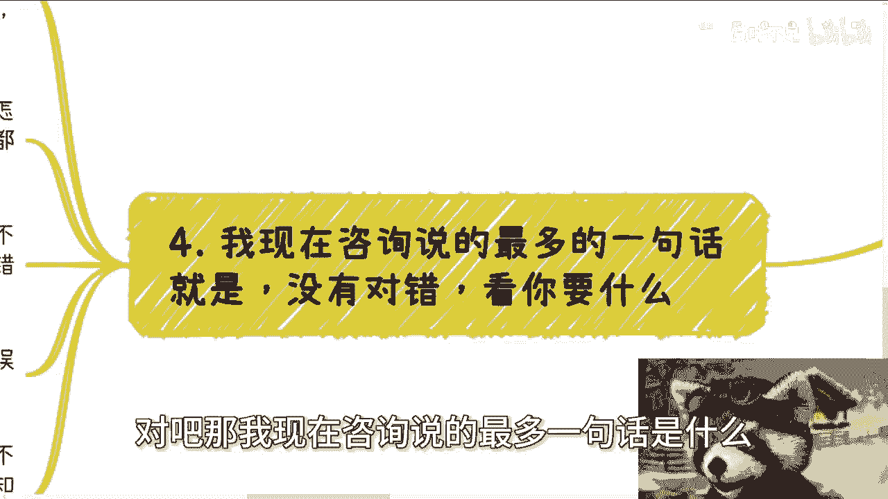
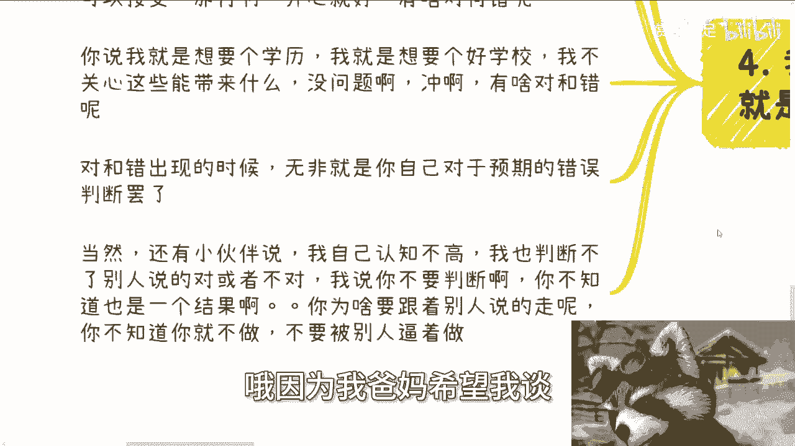
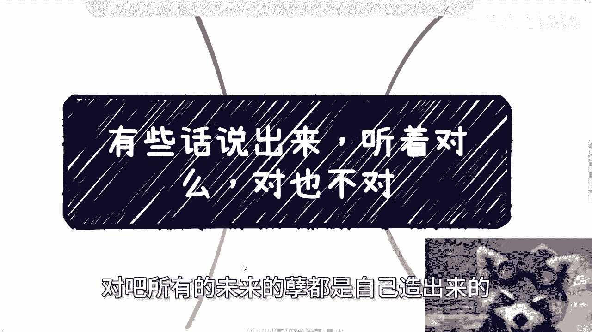

# 有些话说出来听着对，但对也不对 - P1 - 赏味不足 - BV1VT421C7NS

大家好，我跟你们讲这个话题，其实我从来没想过要讲，但是我真的忍无可忍了，所以决定还是要讲一下，我跟你们这么说，有些话说出来听的对吗，对我跟你们，你要问我对不对对，但是我后面还有，但是对你，但非要对不对。

那我能说什么呢，对吧啊，听这个语气有点让我想到了之前谈笑风生。

那你比如说啊谈恋爱。

结婚生子对吧，我们就说结婚早点生孩子，早点这样父母也有经历，父母也年轻一点，能帮忙带孩子，这句话对不对对，我能说什么呢对吧，你说早点生，对身体好，高龄产妇是不好的，这句话对不对呀，有科学依据啊，没错啊。

对不对，你说结婚之后，女性不见得一定要顾家，里面也可以兼顾着自己事业去奋斗，对呀，为什么，因为他拿得出案例啊，也有这种例子啊，对不对好，那你说这些话对不对，那我还说呢，我说我们不要出门。

出门容易被撞死对吧，我们不要住在地球上，地球容易爆炸，这句话对不对对呀，我单纯就说没有错，有什么错呢对吧，然后呢有人要开始骂我，对不对，为什么你包括之前还有小伙伴和我说，不知道怎么反驳，我说你不用反驳。

为什么要反驳呢，哎你说父母有情，年轻人生对吗对呀，但他妈的跟我说有什么卵关系呢，啊谁爱生不生，谁爱结婚不结婚，你能愿意带跟我结不结婚有什么关系啊，诶奇怪嘞，对不对，唉我我高龄不高龄是我的事，怎么了呢。

哦难道就因为高龄危险，所以我必须年轻时候谈恋爱，必须年轻时候结婚，必须年轻时候生孩子吗，这他妈有什么因果关系，对不对啊，你你说女性不见得一定要顾家，里面也可以兼顾自己，解释也行啊，你到时候看看。

这是女性自己能决定的吗，对吧，到时候有多少时间被套牢啊，这话说出来就他妈纯粹PUA对吧，你但凡你是个老实人，但凡你是一个怎么说呢，但凡你是一个就说就说好像听话的好孩子，你去思考这句话对不对。

就已经被PUA了，有什么好思考的，他回答说你是你跟你什么卵关系啊，对吧好。

第二比如说什么什么方向，未来有没有好的发展，这话也没错啊，你问我人未来能不能永生能啊，反正我看不到跟我吊关系，我随便说好了，对不对，有意义，不然没有意义的呀，之前小伙伴还要跟我说了。

他说他爸妈觉得人工智能未来有很大的发展，问我怎么看，问我对不对呀，怎么不对呢，我也认为有很大发展呀，但问题是你说很大发展是多大，发展多久有多大发展，什么发展。

你在这里做什么，你又在行业里面是什么角色，你是在国内发展还是国外发展，单纯问我对不对，我怎么回答，对不对，你爸妈跟你说，你爸妈就这么单纯的没有上下文的跟你说，这他妈不是PUA是什么啊，这不是放屁吗。

对不对，你现在你现在把这句话，你看叉叉叉。

你现在可以说出很多叉叉叉，把这些文字填进去，然后这句话一定是正确的例子，但问题是然后呢，然后呢，你今天知道这句话，对我这句话不对又怎么样呢。

我就不明白了，真的就就很多人明明有些话说出来没有意义，他非要被批为，你知道吗，你包括你需要一个好的学历。

去一个好的学校，知识改变命运好，这句话对不对，没错啊，你要不好好读书，现在在中国从小就是50%的强行分流，没有错呀，对吧没有错，这句话好知识改变命运，对不对，也对呀，那问题来了。

什么知识并不是所有的知识都改变命运吧对吧，又怎么才能叫改变命运呢，怎么定义改变命运呢，另外你追求的是什么命运呢，哦你不讨论这些问题，你就跟我说，知识改变命运，就在PUA，我对不对。

每个人追求的东西不一样，有的人想出人头地，就想高人一等，他追求的是政治地位，社会地位，甚至国际地位，你让他去学怎么赚钱，人家自然觉得你说的不对，你是，但同样的一个人如果想赚钱。

你非要让他去学习很多所谓的知识，告诉他这些知识能改变命运，能让你赚到钱，但最后他发现他妈的这些知识，连他妈工作都找不到啊，跟赚钱更更加没有因果关系，有意味了有意味了，那你说这话，他妈的。

你说你说这话对还是不对呢，啊很多话对没有错，你单纯拿出来对不对对呀，我能说不对吗。

但要看上下文啊，对吧，那我现在咨询说的最多一句话是什么。

就是没有对错，得看你要什么，你说我他妈就想早点恋爱，我他妈就想早点结婚，我就想早点生，不行嘛对吧，我不醒酒就离婚，我能保护自己，我能保护自己的财产，那没问题啊，你做啊对吧，那就没有问题啊对吧。

但是但凡你觉得自己不想不愿意或者不知道，那管别人怎么说，管他妈，你父母怎么说，管的，别人怎么讲对吧，那再对也是对别人的，跟我们有他妈屁关系啊，你说我就不想赚大钱，我就想温饱，我就想怎么活就怎么活。

我自己开心，无论未来发生什么，我都能接受，没问题啊，没问题啊，一点问题都没有啊，啊然后你说我就想要个学历，我就想要个好的学校，我们家族我们家庭没有一个好的学校，没有好的学校。

我不关心这些学历跟学校能带来什么，没问题啊，冲有啥对跟错了，我觉得这些人都是很好的，因为为什么，因为他们的目标很明确，他们的目标很清晰，对跟错出现在什么时候，对跟错出。

现在就是你自己对于预期有错误的判断，你知道吗，什么意思，就是你跟我说我不想生啊，但是呢我觉得现在升也行哦，就我父母让我早点弄也行，我觉得这种行为是我尊重他们，那他妈你怪谁啊，未来如果出问题，你怪谁啊。

啊你怪你父母生也是你要生的，婚，也是你要结的，你怪谁呀，对不对啊，然后你说我我现在想温饱啊，但是我又想赚大钱，但是我又想自己开心，那不好意思，你做不到，对不对啊，然后你说我今天就想要个好的学历。

要个好的学校，这件事情没问题，但是你说我希望这个学历更好的学校，能给我带来赚大钱的机会，或者能给我真的就是完全呃叫什么，就能够推出的因果关系，因为我拿到一个好的学校，拿到一个好的学历。

我就能够一辈子做一个很好的工作，能拿到很好的薪水，能赚到很好的钱，那不好意思，这就是你的妄想，那这个时候就有对跟错了，对不对，那当然还有小伙伴说了，他说张老师我自己认知不高，我也判断不了别人说的对。

跟不对，我说你不用判断，你为什么要判断呢，对不对，你不知道也是个结果，你你你自己觉得自己不知道他也是一个结果，你不知道你就不要去做，你不知道就不要被别人逼着去做，你不知道就不要听别人的去做，对不对。

不就这么简单一件事吗，哦你不知道你非要还在那边说啊，我我问你，我说你你要不要，你现在想不想谈恋爱啊，你现在想不想结婚，哎我也不知道，那我说你不知道，那你为什么要谈恋爱哦，因为我爸妈希望我谈。

那这话还能怎么讲呢，对吧，我告诉你们有句话叫什么叫做。

可怜之人必有可恨之处对吧，所有的未来的孽都是自己造出来的。

你怪别人干嘛呢啊。

是不是对吧，你就像你就像所有的人问我，唉什么什么方向好啊，什么什么专业好啊，唉我你觉得我做这个东西行不行啊，我我就我永远都问一句话，是你想做吗，是不是你自己想做，是不是你了解完了市场，对对社会。

对国内外有一个正确的认知，然后你说你想做，还是说身边的人想做，你从大流，你随大流，还是你父母希望你这么做，你听你父母的，那你怪谁呢，对吧，你不要跟别人去battle这句话对不对，这话对不对，有用吗。

没有用啊，你就像你们有些人说我，我OK啊，我承认我是，怎么了呢，结束了这段对话over，你知道最最以前互联网有句话叫做什么，叫做道不同，不相为谋，不相为谋，最后是什么，互道对吧，微笑着互道，互相拉黑。

结束了，没有交集，不要去battle，你没什么好battle的啊，尤其是对于这种叫什么抠字眼的事情，你知道吗，因为最近跟我聊的人，我发现真的很多人他会去纠结这个话对不对，以及纠结要不要反驳人家。

你有啥好纠结的，你反驳他又怎么样呢，对不对，你能得到什么呢，然后还有人跟我说，他说哎我不反驳我父母，或者我说服不说服他们，未来矛盾很多大小姐或者大哥啊，我想说的是，你反驳他未来就没矛盾啊。

你你说服他未来就没矛盾啊，哎哟没有用的，真的没有用的啊，所以说我就跟你们讲了，任何一件事情，你目标明确都是对的，你目标只要不明确，你随大流，你还要跟我跟其他人去讨论，对不对，有啥好讨论的。

好吧那就这么着，那好吧，那接下来的话同样的啊，直接规划商业规划，融资股权股份啊，合同啊，包括你们手上有什么牌，希望通过我的视角，通过我的视野能够给你们这个说一说，更好的一些未来的规划啊。

