# 课程01：识别“绝对正确”但无意义的言论 🧠

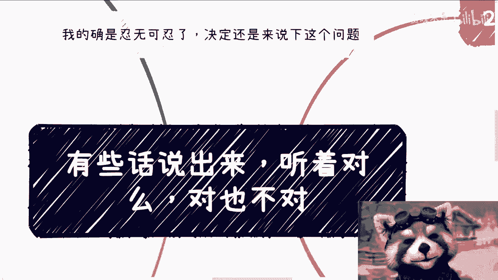

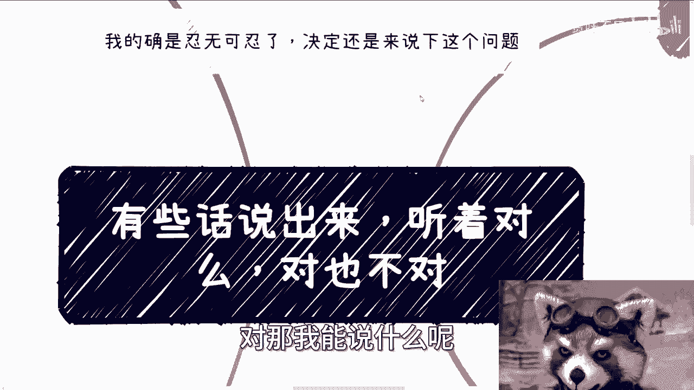

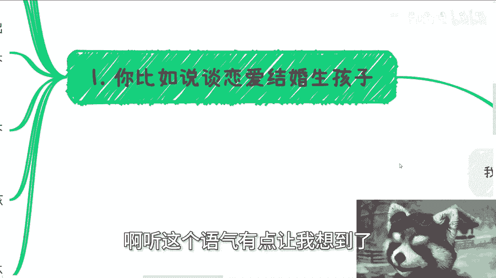


在本节课中，我们将学习如何识别生活中那些听起来“绝对正确”，但实际上缺乏具体上下文、对你个人并无实际指导意义的言论。我们将分析这类言论的特点，并探讨如何避免被其影响，从而做出更符合自身目标的决策。

## 核心问题：为什么“对”的话可能没用？

上一节我们介绍了课程的主题。本节中，我们来看看这类言论的核心问题：它们孤立地看是正确的，但脱离了具体的个人情境和目标。


许多建议在抽象层面是正确的，例如“早点结婚生子对身体好”或“知识改变命运”。这些陈述本身可能符合普遍认知或统计数据，即 **`陈述 ∈ {普遍认可的真理}`**。然而，问题在于，这些“正确”的话被当作了适用于所有人的、无需思考的行动指令。

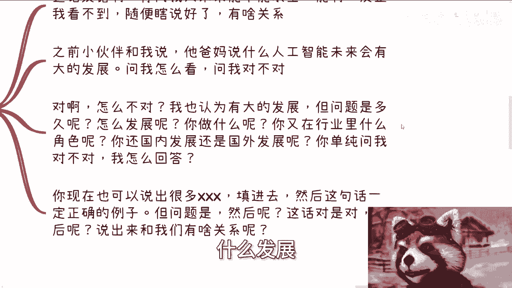

## 常见无意义言论的案例分析

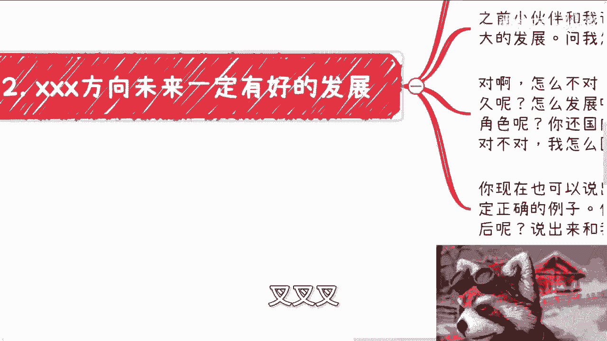


理解了核心问题后，我们通过具体例子来加深认识。以下是几个典型的场景：

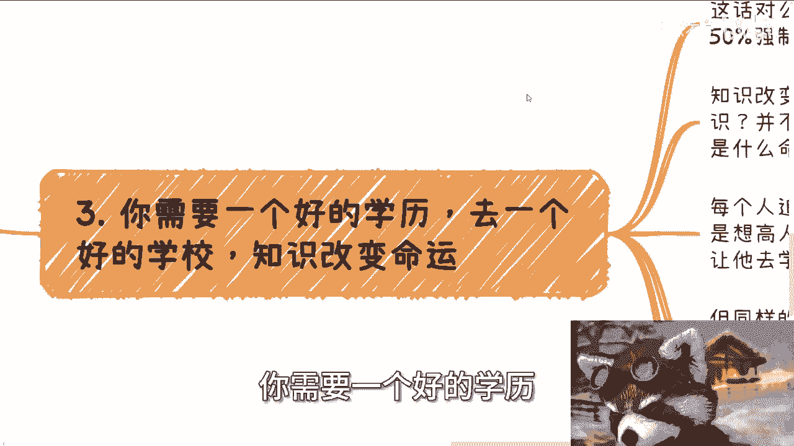

*   **关于婚育的言论**：“早点结婚生子，父母年轻能帮忙带孩子，对身体也好。”
    *   **问题**：这句话谈论的是普遍生理规律和一种家庭协作模式，即 **`早生育 ≈ (身体风险较低) ∩ (可能获得家庭支持)`**。但它没有考虑个人的婚恋意愿、经济状况、职业规划等核心变量。它用“正确”的普遍性掩盖了个人选择的必要性。

*   **关于行业趋势的言论**：“人工智能是未来，有巨大发展。”
    *   **问题**：这是一个宏观趋势判断，即 **`行业前景 = f(技术发展, 市场需求, ...)`**，其值为“积极”。但它没有定义“发展”的具体内涵（是科研突破？商业应用？就业机会？），也没有说明个体该如何参与（学习什么？进入哪个细分领域？）。对于个人职业选择缺乏具体指导。

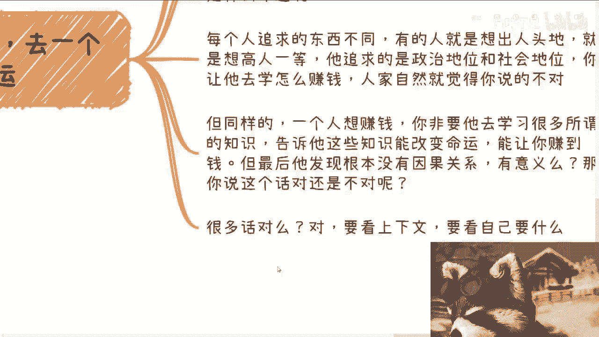

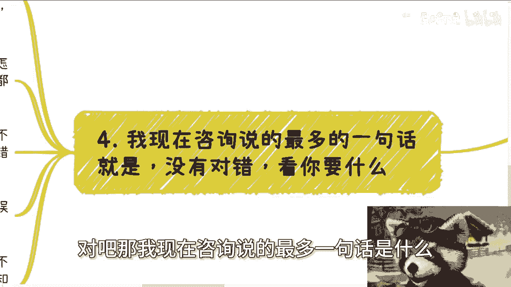

*   **关于教育的言论**：“要考好大学，知识改变命运。”
    *   **问题**：这句话混淆了“教育投入”与“个人产出”之间的复杂关系。它可以被简化为一个不保证成立的推导：**`获得好学历(知识) → 改变命运(达成个人目标)`**。它没有界定什么是“好命运”，也没有说明何种“知识”通过何种路径才能导向该目标。对于目标不明确的学生，这只是一句正确的空话。

## 如何应对：关注目标与上下文

分析了问题所在，我们来看看解决方案。应对这类言论的关键在于，将对话焦点从“话对不对”转移到“是否适合我”。

1.  **追问具体上下文与个人关联**：当听到一个“正确”的建议时，立即问自己：“这个建议是基于什么具体情境？它和我的个人目标、现有条件有什么关联？” 如果建议者无法提供与你相关的具体分析，那么这个建议对你而言就是无意义的噪音。

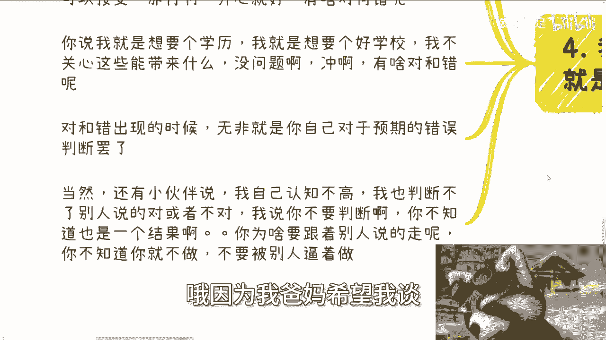

2.  **明确自己的目标**：所有决策的起点应该是清晰的个人目标。你可以用简单的代码逻辑来梳理：
    ```python
    if 目标清晰:
        if 建议有助于达成目标:
            采纳并制定计划
        else:
            忽略
    else:
        优先任务是明确目标，而非听取建议
    ```


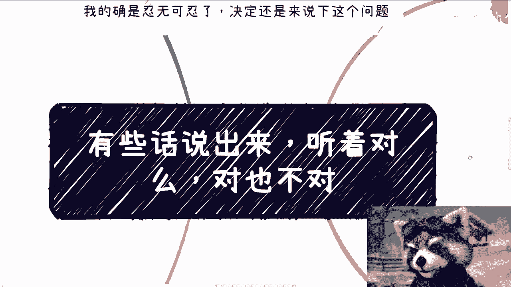

3.  **停止无谓的辩论**：无需与他人争论一句话在抽象意义上“对不对”。这没有意义。如果对方只是抛出空洞的正确言论，而非基于你的情况具体讨论，最有效的回应是结束对话。正如古语所言：“道不同，不相为谋。”

4.  **为自己的选择负责**：如果你在目标不明确的情况下，因为外界压力（如父母、社会潮流）而做出选择，那么你需要为这个选择的结果负责。将责任归咎于“别人都说这样对”是无效的。清晰的逻辑是：**`我的选择 = f(我的目标, 我的判断)`**，如果输入是模糊的或他人的，那么结果自然难以符合预期。

## 总结

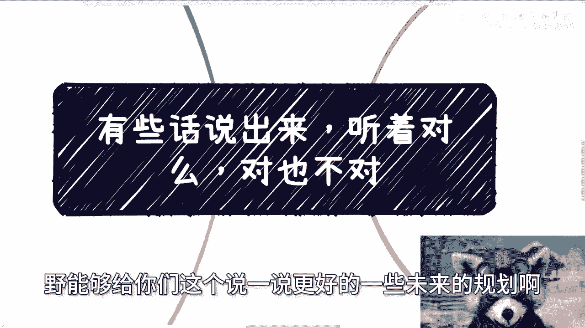

本节课中我们一起学习了如何识别和应对那些“绝对正确”但无意义的言论。我们明白了，一句话的抽象正确性不等于其具有个人指导价值。关键在于**忽略空洞的正确，聚焦于个人的目标与具体的上下文**。做出决策前，务必明确自己想要什么，并基于此评估所有信息。停止在“对错”表面进行辩论，转而关注“是否与我有关”和“如何为我所用”，这是独立思考与自主决策的重要一步。