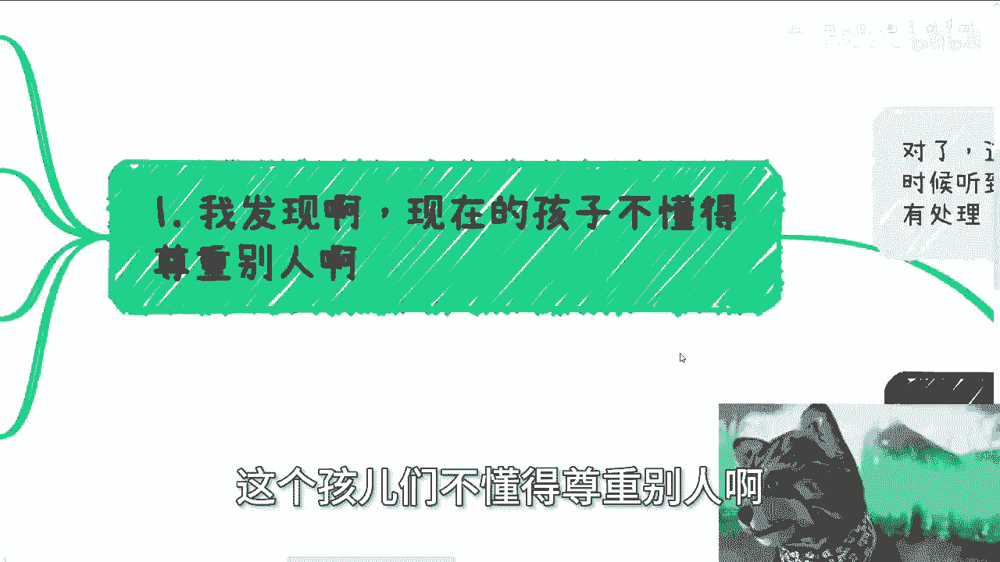
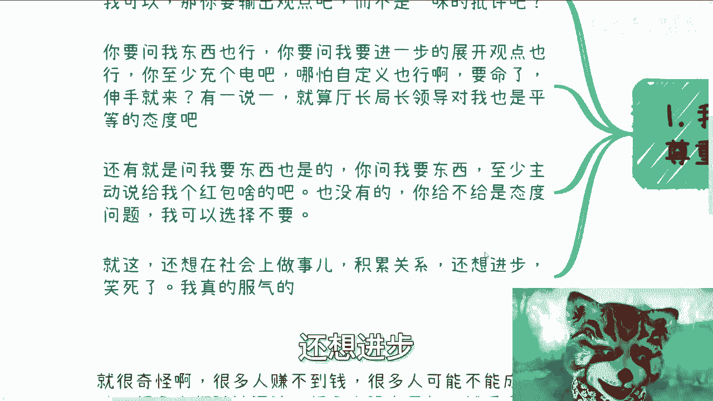
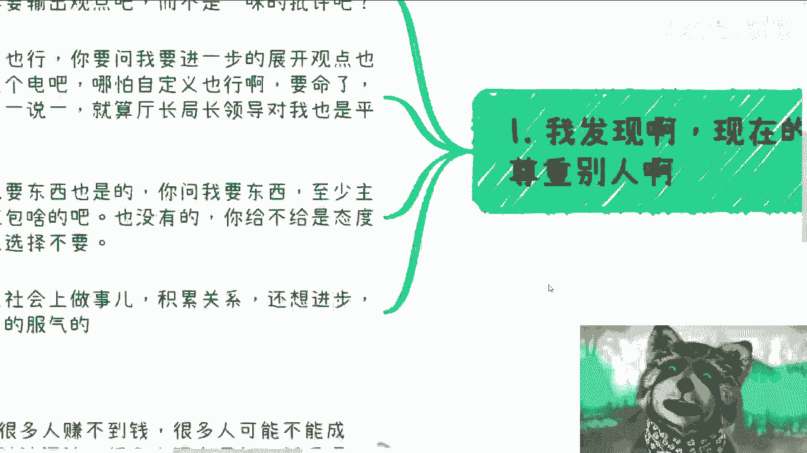
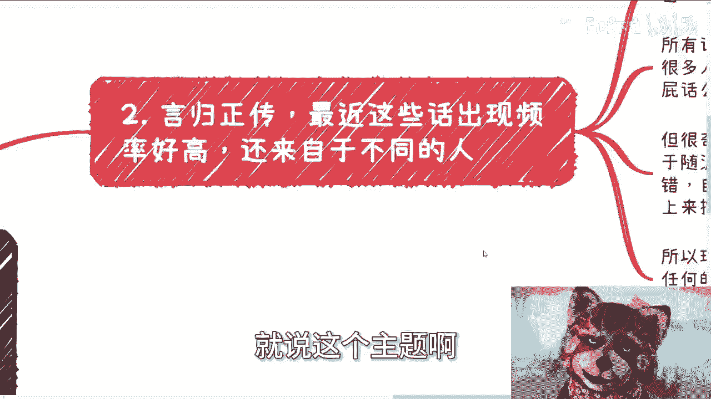
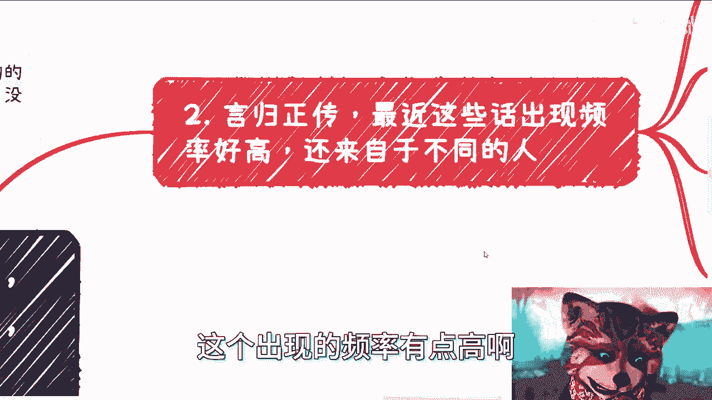
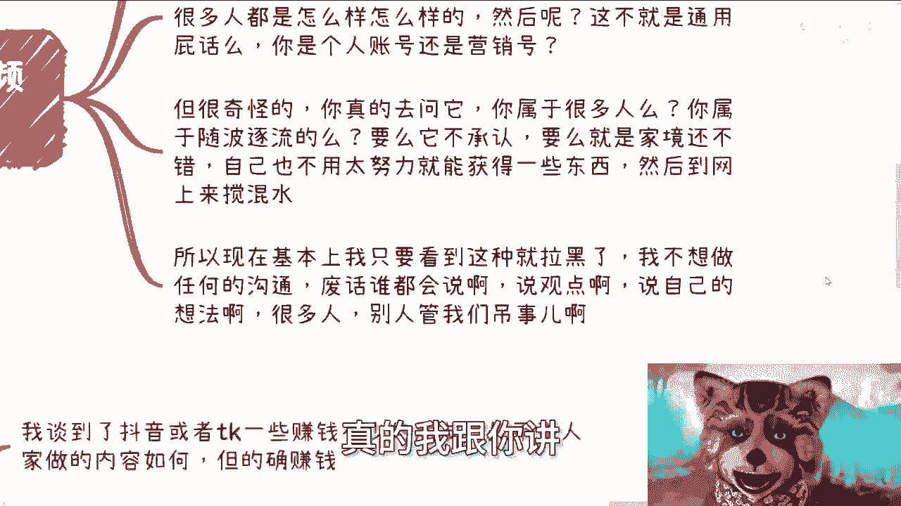
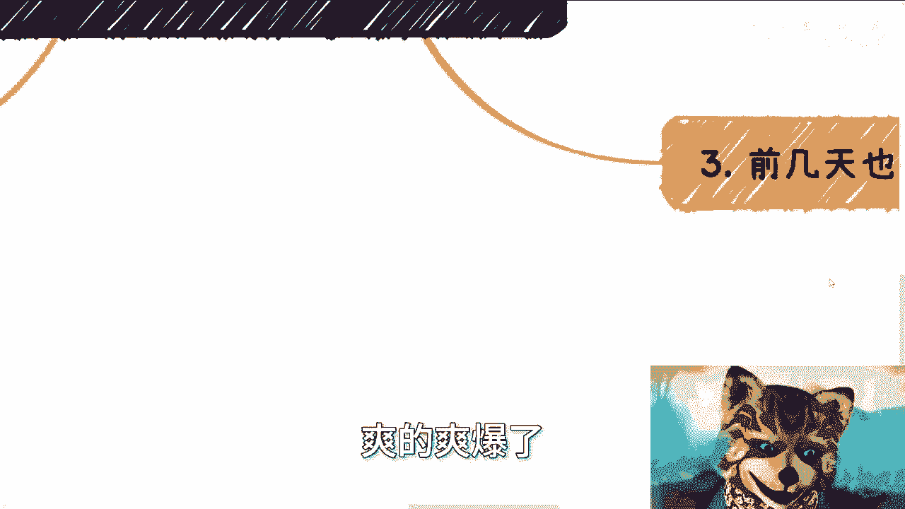
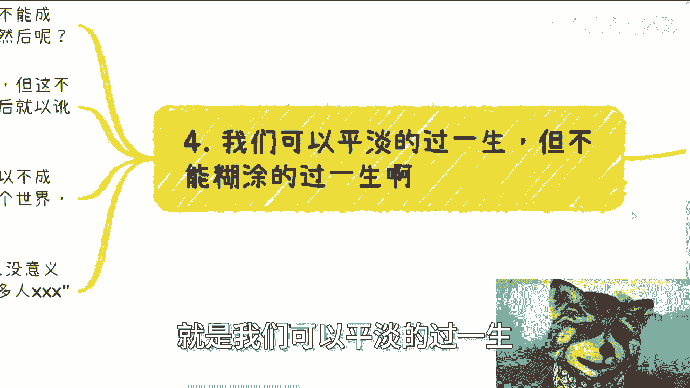
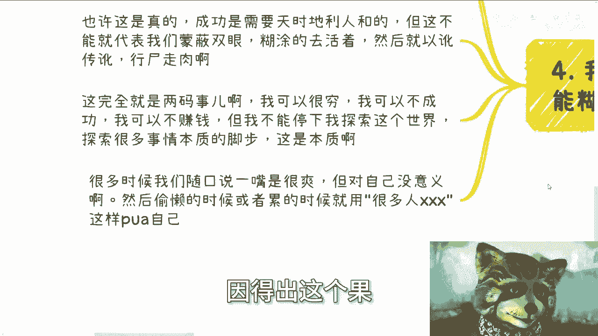
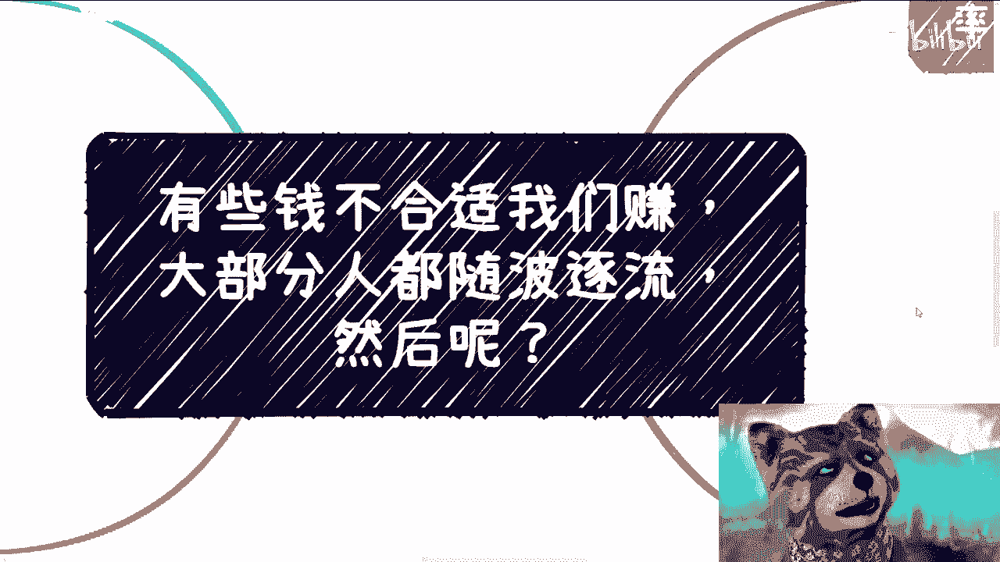

# 课程01：识别并避免“废话文学”陷阱 🚫



在本节课中，我们将学习如何识别网络上常见的、无实质内容的“废话文学”式言论，并探讨如何避免其对我们思考与行动的消极影响。我们将分析这类言论的特点、动机，并建立更务实、更清醒的认知与行动框架。

---

## 概述：问题的提出

最近，两类言论在网络上频繁出现：“有些钱不适合我们赚”和“大部分人都随波逐流，然后呢？”。这些言论看似有道理，实则空洞，容易让人陷入消极和自我怀疑。本节课将剖析这些现象，帮助大家建立更清晰的认知。

## 第一节：网络交流的基本礼仪与效率



在深入主题前，有必要先明确高效、有益的交流应遵循的原则。低质量的提问和攻击性的言论会阻碍真正的沟通与学习。







以下是两种常见的低效交流模式：

1.  **无效批评**：只表达否定态度，不提供具体观点或论据。例如：“你的观点我不认同。” 却不说明理由。
2.  **模糊提问**：问题缺乏必要背景信息，让他人无法提供有效帮助。例如：“我辍学十年了，有什么建议？”

有效的沟通应基于具体、清晰的信息交换和相互尊重。

## 第二节：剖析“废话文学”的特征与动机

上一节我们介绍了低效沟通的表现，本节中我们来看看本次课程的核心——那些流行的“废话文学”式言论。



这类言论通常具有以下特征：

*   **内容空洞**：使用“很多人”、“通常”、“也许”等模糊词汇，陈述放之四海而皆准却无实际指导意义的现象。
*   **回避具体**：只抛出问题或现象（如“很多人都没有目标”），但不探讨任何解决方案或深入分析。
*   **立场虚化**：发言者常将自己隐于“很多人”之中，或站在一个看似超然的视角进行评价，其个人真实情况与立场模糊不清。

那么，人们为何热衷于发表此类言论？其动机可能包括：

1.  **寻求认同与优越感**：通过指出一种普遍的“缺陷”（如随波逐流），间接暗示自己与众不同或更清醒。
2.  **为惰性寻找借口**：用“很多人都这样”来合理化自己的不作为或失败，进行自我安慰。
3.  **轻视与防御**：对某些成功路径（如短视频创业）内心不屑，用“不适合我”来掩盖不愿学习、不敢尝试或害怕失败的心理。
4.  **缺乏深度思考**：并未对问题进行过切实的调研和分析，只能重复流行的表面话语。

## 第三节：建立务实的认知与行动框架





认识到“废话文学”的陷阱后，关键在于如何构建更健康、更积极的思维与行动模式。核心在于将注意力从评判“他人”和“普遍现象”转移到“自身”和“具体行动”上。

我们可以遵循以下行动逻辑：

```plaintext
停止空谈 -> 审视自身 -> 明确目标 -> 学习借鉴 -> 持续行动
```

以下是具体的行动建议：



1.  **停止使用模糊的群体性话语**：将思考主语从“很多人”替换为“我”。不问“很多人怎么办”，而是问“**我**该怎么办？”
2.  **进行诚实的自我评估**：明确自己的现状、资源、优势与劣势。公式可以简化为：**自身现状 = 已知条件 + 可用资源**。
3.  **定义个人化的目标与路径**：成功与赚钱的方式不止一种。需要找到与自身条件相匹配的目标。可以问自己：“抛开外界噪音，**我**真正想要什么？**我**能做什么？”
4.  **向实践者学习，而非评判者**：对于任何展现成果的领域（如赚钱的商业模式），应首先关注“**他们做对了什么？**”，而不是急于判断“这适不适合我”。取其精华，去其糟粕。
5.  **接受渐进与探索**：明白成功需要努力、机遇与时间。允许自己探索、试错，关键是不停止思考和行动的脚步。核心态度是：**我可以接受不成功，但不能接受不尝试；我可以安于平淡，但不能甘于糊涂。**



## 总结

本节课我们一起学习了如何识别和避免网络上的“废话文学”陷阱。我们分析了其空洞、模糊的特征，以及背后可能存在的寻求借口、轻视他人等心理动机。更重要的是，我们建立了一个务实的行动框架：将焦点从外部评判转向内在探索，停止空谈，明确个人目标，并向实践者学习，保持持续的行动与探索。

清醒的认知与务实的行动，远比随波逐流地重复空洞话语更有价值。