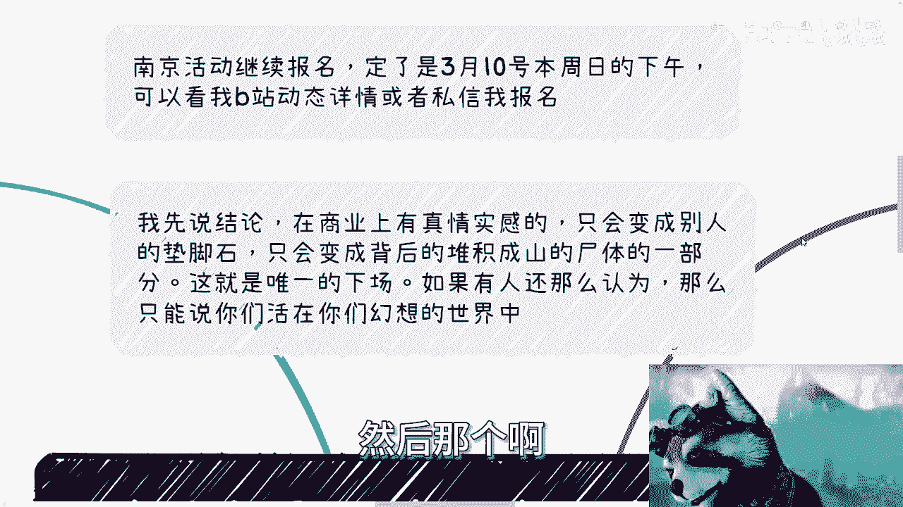
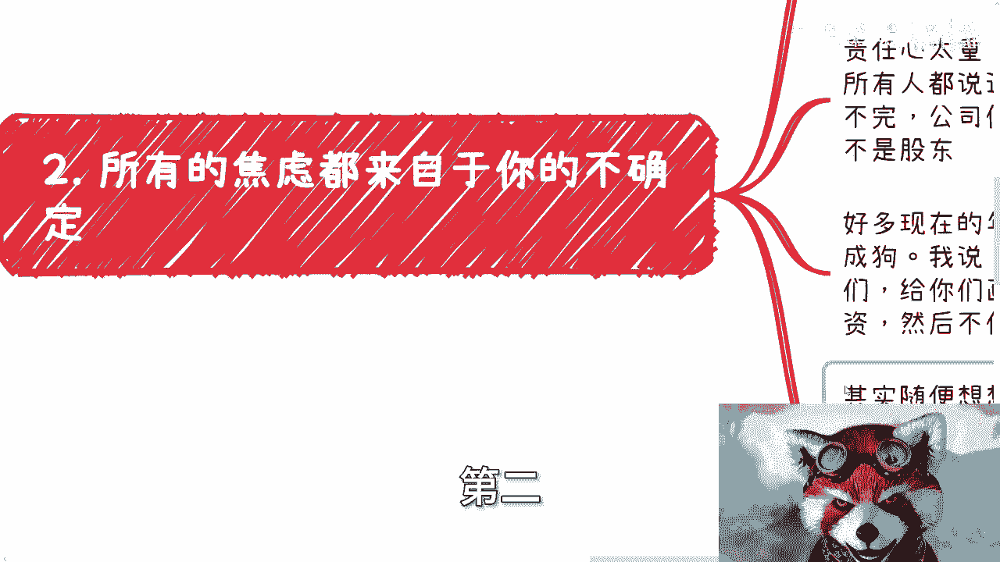
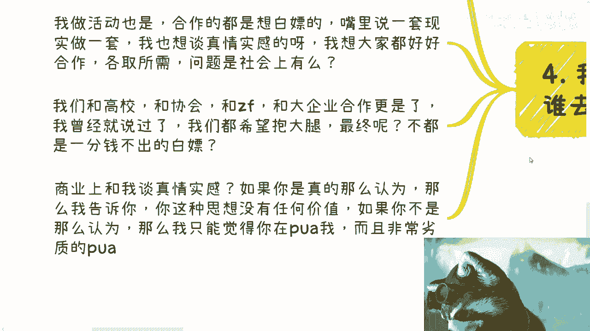
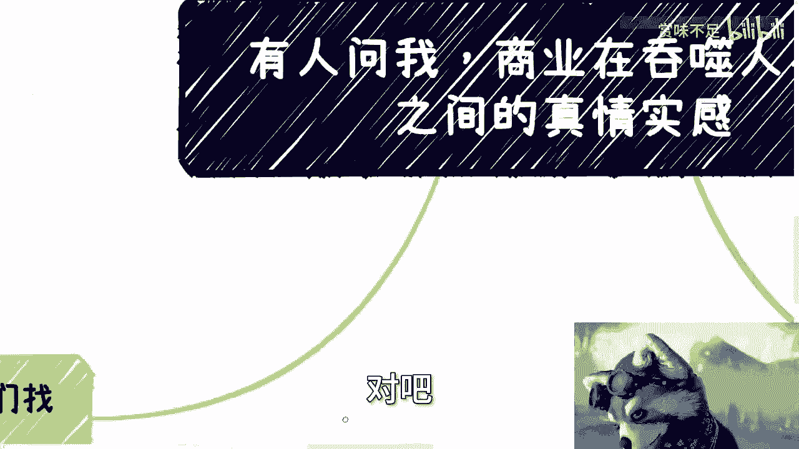
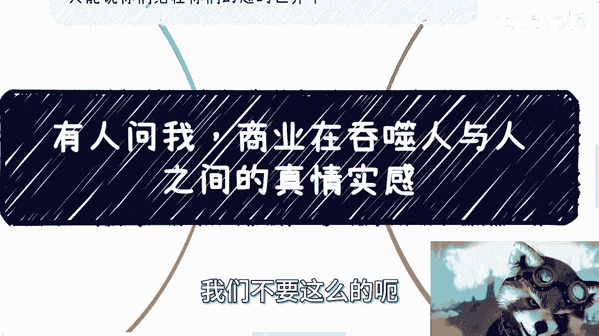
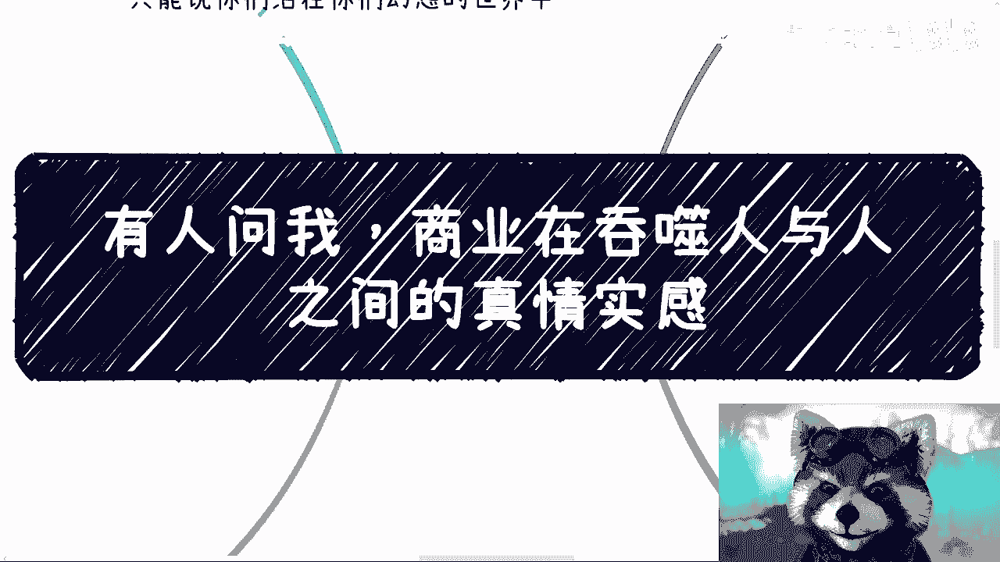

# 有人问我-商业在吞噬人与人之间的真情实感---P1---赏味不足---BV1Vx4y1k7qT_no

在本节课中，我们将探讨一个核心问题：在商业世界中，是否应该或能够追求人与人之间的真实情感。我们将通过分析商业的本质、职场内卷的误区以及个人在商业环境中的定位，来揭示其中的现实逻辑。

---

## 第一部分：核心结论——商业与情感的对立

上一节我们介绍了课程主题，本节中我们来看看核心观点。

在商业领域追求真实情感，只会成为他人的垫脚石。所有可见的成功企业、组织或个人，其背后都堆积着无数失败者的“尸体”。试图在商业中平衡情感，这就是唯一的下场。如果仍抱有这种幻想，说明你尚未认清现实。

---

## 第二部分：警惕“内卷”教育的误导

理解了商业的无情本质后，我们来看看一种普遍存在的认知陷阱。

网络上充斥着大量关于经济和职业发展的视频，它们看似在提供建议，实则是在宣扬焦虑，教人如何“内卷”。这种“内卷”本质上是同阶层人群的相互消耗。

以下是关于“内卷”的几个关键点：

*   **无益于整体**：职场或考公中的“内卷技巧”，并不能创造真正的价值，只是底层之间的相互伤害。
*   **错误的努力方向**：职场成功不取决于“卷”的技巧。你只有两种理性选择：要么安心做好本职工作，积累经验；要么将工作视为副业，专注于开拓自己的主业。
*   **格局局限**：专注于“内卷”就像在独木桥上学习如何把别人挤下去。即便因此获得短期升职加薪，长远看也毫无前途，因为格局被限制在芝麻小事上。

许多人会以“生活所迫，没得选”来辩护。但需要明白，教授这些“内卷”方法的人，与你之间并无任何真实情感，他们只是在经营流量生意。

---

## 第三部分：焦虑的根源与责任心的误区

认识到“内卷”的徒劳后，我们来分析焦虑感的来源。

人们的焦虑常源于“不确定性”和“过度的责任心”。许多人认为世界存在真实情感，并因此背负沉重责任。

以下是两个关键误区：

1.  **目标达成无法消除焦虑**：考上名校、进入大厂甚至获得编制，这些都无法带来真正的“确定感”。你确定的可能只是被灌输的思维模式，焦虑依然存在。
2.  **过度责任心是自我绑架**：工作只是一份工作。公司的存亡通常不取决于某个个体。需要清醒认识到，在资本家眼中，员工往往只是工具而非有情感的人。对公司投入真情实感，期望换来好印象，结果通常是被利用和压榨。

许多实习生在大公司被严重压榨，就是陷入了这种误区。公司的核心运转从不依赖于实习生，所谓的“重要加班”往往是PUA的话术。你对公司有情感，公司却未必把你当人看。

---

## 第四部分：商业的本质与“真情实感”的代价

分析了个人心理误区后，我们上升到宏观层面，审视商业的本质。

商业本身就不存在真情实感。人类社会背后是复杂的商业、金融和运作规律。许多引发对立的言论，其背后驱动往往是流量和生意。

在商业中追求真情实感将导致以下后果：

*   **在竞争中处于劣势**：客户无法分辨真假情感，善于营销者更占优势。你的真情实感可能换来的是更多的攻击和非议。
*   **在合作中被压榨**：一旦表现出心软或退让，对方就会得寸进尺。例如在合作分成上，你一开始让步接受“八二开”，那么这种不平等的模式很可能贯穿始终。
*   **如同求职谈薪**：没有人会主动要求低薪以期获得公司未来的“感情回报”。在商业中谈感情，除非你不想赚钱。

现实是残酷的。无论是与高校、协会、政府还是大企业合作，单方面的让利和“跪舔”往往只会导致被白嫖，对方不会因此将你视为平等的合作伙伴。

---

## 第五部分：行动指南——明确唯一目标

通过以上分析，我们明白了商业的规则。最后，我们来明确在当下环境中应有的行动准则。

在当前的经济社会状态下，个人行动应有清晰且唯一的核心目标。

这个目标就是：**赚钱**。其他一切，如积累知识、考取文凭，其价值都取决于你能否将其**变现**。无法变现的积累，作用有限。

社会上人群复杂，有人真糊涂，有人装糊涂（扮猪吃老虎）。你无法分辨谁坏谁好。因此，坚守“赚钱”这一务实目标，是对未来最有效的保障。在商业中谈论真情实感，要么是天真赚不到钱，要么是别有用心地在进行低劣的PUA。

---

## 总结

本节课中我们一起学习了商业与情感关系的现实逻辑。核心结论是：**在商业领域追求真实情感是不切实际且有害的**。我们剖析了“内卷”的误区、焦虑的根源，并指出商业的本质是利益交换，而非情感联结。最后，我们明确了在当下环境中，个人应聚焦于“赚钱”这一核心目标，并具备将能力变现的思维。认清现实，务实行动，才是生存与发展之道。