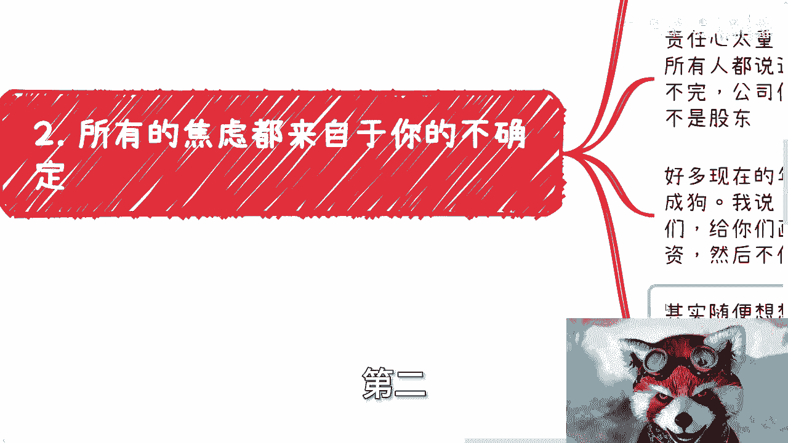
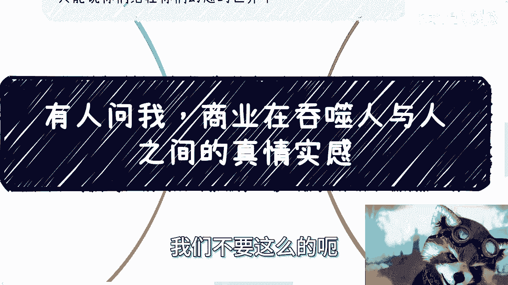

# 有人问我，商业在吞噬人与人之间的真情实感 - P1 - 赏味不足 - BV1Vx4y1k7qT

哈喽大家好，你们敢信吗，这是我录的第二遍，第一遍他妈被一个电话打断了，太了，然后那个啊首先那个环南京活动继续报名啊。

定了是3月10号，就本周日下午好吧，详情的话你们可以看我那个B站的动态啊，或者说私信我，我也会把那个动态发给你们的，好吧，呃这是第一个啊，然后今天我们讲的这个主题呢，啊叫做哎我这电脑怎么这么卡，呃。

叫做有人问我，他说商业在吞噬人与人之间的真实情感啊，然后呢他他他评论区是这么说的，他说我怎么平衡商业跟这个这个人与人之间，真实情感啊，好我先说结论啊，在商业上有真实情感的，只会变成别人的垫脚石。

只会变成背后，我告诉你们，成功的，你们看得见的那些企业或者那些组织，或者那些人背后堆积如山的尸体当中的一部分，我跟你讲，这就是你想平衡的唯一的下场，我不管你怎么平衡，你只要想平衡，这就是你唯一的下场。

没有来啊，如果有人还想平衡，还这么认为啊，那我只能告诉你们，是你们还活在你的幻想世界当中，就这么简单啊，好呃，我们继续往下讲啊，我今天呢这个闲着无聊做了一件事啊，我大概刷了一下这个一些短视频网站啊。

关于经济跟这个职业发展的视频啊，那我觉得是这样子的啊，呃就很多呢他是这样的，他是看似不宣传焦虑，其实在拼命教大家怎么去焦虑，怎么去卷啊，然后教大家怎么卷，然后好像就他妈大家怎么卷。

就学会怎么卷轴就有用一样，哎你们有没有想过一个问题，就是你们的卷对整个我们说老百姓啊，对对，整个就是我们同样一个level的这些人，有什么好处吗，你卷都是卷铜，叫什么同同类对吧，你卷都是卷战友。

有什么用啊，啊自相残杀有意思吗，没意思的呀，你想看是不是我再强调一遍啊，教大家怎么卷职场，然后卷什么考公的或者怎么样的都没有用的，这都是纯纯的PUA，你看似有道理，其实有什么卵用啊，啊有什么卵用啊。

职场他妈是看你卷的技巧吗，你今天他妈啊到到到职场里面变成了是啊，大家来卷，大家来拼卷的技巧啊，是这样的吗，哦公务员公务员体制是你卷的好，你就能往上升的是吗，哎呦这他妈不是扯淡吗，哎我跟你们讲啊。

这种卷这他妈才叫歪门邪道，你在职场上很简单，你要么就好好要命了，我他妈打错了，妈逼气的打错了，你在机场职场上，要么你就好好的这个上班啊，不要去想别的，你好好积累自己的经验，做做好你的电池，对不对。

你要么就把工作当副业，就他妈的每个月给你发个工资，你就别管他这么久的没的，你又不是股东对吧，然后你再去自己主动的开拓你的主页，指你你不就好了吗，职场上去卷卷什么玩意儿啊啊，还他妈去学习职场上卷的技能。

我就问你们除了老板，你们学了之后，除了老百姓底层相互伤害还有什么用，有什么用啊，对吧，你这就好像大家都在走独木桥，你说好，我他妈就得学学学学怎么把别人挤下去，有意思，对不对，你看上去很有道理。

看上去貌似自己学习了，能加薪，能升职，但其实你从大局去看去看啊，你真的升职了，加薪了，然后呢我就问，然后呢对吧，你也没啥前途呀，你格局但凡就这么大，那属于拼命解芝麻有什么用，没有用的哦，但你我跟你讲。

但这种事情呢你还没法跟他们讲，你说了吧，他们还会告诉你，哎我们是普通人，我们没得选，我们现在生活很苦，只能看到这些，所以我说了，不要跟这些人做过多的交流跟沟通，大部分人过一天是一天。

你每个人追求不一样是吧，好那你说啊，这么多视频，这么多账号，教教大家怎么卷职场的，怎么相互攻击呢，他们跟你们是真实情感吗，有他妈真实情感吗，你觉得啊有吗，有啥有个屁，然后第二我跟你讲。

所有的焦虑都来自于你的不确定真实情感对吧，好看啊，其实很多人无论做什么，你是消除不了焦虑的，为什么，因为你一方面责任心太重，你你那就像我说的，你觉得这个世界是有真实情感的对吧，好好啊，我们往下说啊。

另外一方面就是你不确定的事情太多，但问题是你会发现，但问题是很多事你真的达到一个目标，你还是不确定的，你就往前面说，你考上你某个学校，你去了某个大厂，你搞你就算你上2号了对吧，怎么样，你确定了。

你告诉我，你确定什么东西啊，你确定啥，你确定的都是别人PUA你的思想，你确定什么东西来，你什么都不确定，你还是焦虑的一样的呀，对吧，责任心太重是什么，就我们以前说的，卖着白菜，我早就跟很多人说过了。

工作只是份工作，你干或者不干，公司倒闭不了的，倒闭了跟定他妈也没有关系，你也不是股东啊，你别把你的老板看作是个人，不好意思，你们在我们在老板身眼里都不是人，对不啦，我还是那句话呀，资本家把你们当做人。

他自己是活不下去的，就这句话，你谈什么，谈什么真情实感啊啊我跟你讲，现在很多年轻人啊就去公司在实习的，你知道吧，就去年今年的就跟我说，他说被压榨成狗啊，每天晚上11：12点，我说这个逻辑太简单。

你仔细想想看，首先这就是公司PUA，你给你画饼，然后就是让你拿着低廉的实习工资，然后不停的干活，哎你作为一个本科硕士博士的脑子，你随便想想看看，你们去的都是什么，都是大公司，都是行业的top对吧。

都是各种各样牛逼的公司，是我我身边领域啊，有的律师，有的互联网，有的金融，有的医疗，什么没有啊，那我就问你们哦，你们去实施机器人怎么了，这些公司不活了啊，这公司他妈不赚钱了啊，哦现在这公司他妈的哦。

你说活了这么多年哦，呃这个这个真正的核心竞争力，核心大梁在一个实习生身上啊，你觉得可能吗啦你仔细想想就不可能了呀，我有什么重要的事情是你要去卷的，有什么重要的事情是每天你要去加班的，有不啦哦。

你不加班怎么了，这公司明天倒闭了吗，我他妈也是服了，除了被PUA还有什么呢，没了这他妈就是答案呀，你跟我说真情实感，不好意思，你对公司是有真情实感的，你是想留下来的，你是想给别人有个好印象的。

但别人不把你当人呀，谁他妈把你当人啊，啊他妈搞笑了，到最后我跟你讲，你随便到哪，你就会发现没有人把你当人的，只有你自己把你当人，就这么简单一回事，对吧啊，然后第三你说有没有哦，我就问啊。

有没有一种可能商业本来就是没有真情实感，唉你你自己想想看，人类社会本身它背后就是个商业的一个环境，就是个商业的上下游，就是个商业的一个一个一个运作规律，你背后都是金融，你说为什么这么多人要引战。

为什么要要男女对立，为什么要有这么多SB的言论，你会发现很多人，可能他不是我们一句话怎么说的，说他不是蠢就是坏，为什么，因为都是流量，都是生意对吧，你跟你跟我说，你要做生意要又要真情实感，那我就问啊。

你真情实感的客户分得清楚谁是真情实感啊，哎你真情实感那个人啊，营销的好，那客户觉得太真情实感呀，算个屁呀啊，你真情实感，我就问你得到了什么，你得到了除了更多的攻击，除了更多的黑你的，你还能得到什么。

哎我就不明白了，你还能得到什么，你不信你去试试看，真的你去试试看，你只要想赚钱，你只要想做生意，你去真情实感试试看，你是不是合作就更别说了，你真情实感，你哪怕我告诉你，哪怕一丝心软，你只会被白嫖。

只会被压榨你，我跟你讲，你去找别人合作试试看，别人就会跟你说，上来就八二开，妈九一开，卧槽对吧，我跟你讲，你到时候一退缩，想了想哎呀算了，人脉关系重要，哎呀我人家是牛逼对吧。

人家什么什么什么给你忽悠两句，画几个饼，你就觉得人家是大佬对吧，然后你想行八二就八二对吧，然后我跟你讲，这辈子合作就他妈八二吧对吧，你还做什么生意啊，你还还谈什么竞争，你还谈什么护城河，屁都没有。

他妈上来就是八二，你这样你会发现还是一个逻辑，就是你把别人当大佬，你帮别人打关系，别人当你是个屁，对不对啊，其实我跟你讲就跟求职是一样的，你应聘谈薪资，谁他妈往低了谈啊啊你跑过去你跟hr谈薪资。

哎呀你看啊，哎我现在谈个低一点的啊，我希望跟公司产生更多的合作啊，我希望跟公司更多的未来给我promote，给我这个掌心，给我给我什么晋升，你自己想想看什么，现实吧啦啊，这他妈不是你。

你怕不是来搞笑的啊，是公司老板私生子还是怎么地啊，你要谈感情，你你就去做菩萨，我跟你讲，你要么就别做生意，别赚钱，否则你就是一具尸体，就这么简单，有啥好说的呢，啊我以前啊我记得我之前我就跟你们讲过。

我也想真情实感，谁不想啊啊我也想打工打一辈子，谁不想啊啊，这社会让我打不了，不让我打呀，这社会让我真心实感，完了也不让我真心实感呀，我怎么办啊，对不对啊，你就像我工作的时候，我也想别人带我的呀，谁我啊。

每次我认为别人会带我，最后都是利用我去满足别人的KPI，有人找我们了，有人从我角度考虑过，未来没有呀，我做活动，我做商业的东西，合作这么多次对吧，但凡想合作的嘴里说一套，现实当中又做一套。

我也想真实情感的，我也想大家好好合作，各取所需不好吗，我们就说正向的对吧，积极向上的合作不好吗，不香吗，不要人就这个样子，你怎么办呢，你跟谁去讲道理呢，啊我们以前跟高校跟协会，甚至跟政府。

还有我以前跟你们讲的那种大企业，怎么听上去一看就是那种就是500强对吧，或者怎么样的合作，我跟你讲就更是了，不管是线上还是线下，我们去合作到最后钱我们都赚不到的，我们都我们也是希望抱大腿。

我们也希望就是说哎好像我们让一步对吧，我们好像稍微稍微简单的跪舔一下对吧，我们比如说钱少赚一点啊，我们让利让的多一点，能让对方更多的合作，然后呢一样的，我们把对方当人看，对方把我们当人看不来。

我们他妈就是被白嫖的工具结束。

你商业上跟我谈真情实感，如果我跟你讲啊，如果你是真的这么认为，那么我告诉你，你这种思想赚不到钱，你就别想了，你这辈子就这样了啊，如果你不是这么认为的，那么我只能认为你是一个纯坏的存在，你就是存在PUA。

我甚至存在PUA别人，而且这种PUA非常的低劣，对吧啊我不排除啊。

我不排除有的人在做生意的同时，因为我以前也碰到过很多人就跟我说，哎呀我们要让点利益，我们不要这么的急功近利。

我们要跟别人，要给别人留下好印象，要产生更多的合作对吧，但事实证明什么留下好印象就是，更多的合作也是，你知道吗，就你唯一能跟别人留下好印象，你唯一能给别人带来未来，能更多合作的只有一点。

就是您能不能给他带来更多的钱，别的不要讲，你哪怕我告诉你，你哪怕今天被别人白嫖100次，你也他妈只能被只有被白嫖的价值，别人心里面都不会有一丝愧疚，你知道吗，这他妈叫社会啊，这他妈才叫生意。

你跟我谈真情实感，卧槽，怎么说呢，嗯蛮好的啊，因为我跟你们讲一样的啊，我是不信的啊，而且这个总但是你要明要明白，社会上总有很多人会信，没有办法的啊，就是就是你们多，你们不要去看别人讲什么。

你们多看看很多这种，比如说什么什么什么身心灵啊对吧，或者其他的这种评论区，你们自己去看看，现在现在那种未成年人，现在或者说18岁到到20多岁或者30岁，30岁的这些人的这个精神状态。

哪他妈像正常的精神状态啊啊，就是就是就是就感觉，就是说他不像活在真实世界里面，而你知道吗，现在整个社会鱼龙混杂，就有的人是真的不懂，而有的人呢是不是懂，但是就是这个扮猪吃老虎，你分不清楚的，你知道吗。

就有人是真的坏，但是你不知道的，他会跟你表达的，哎呀我我自己是个小白对吧，我可能不懂对吧，你要原谅我对吧，怎么样子，其实他坏的很，谁知道呢对吧，那我就问嘛，你你你你告诉我，你有真情实感，你有良心。

你你你要怎么样，怎么样，不明白呀，就是我就说了嘛，就大家做事情都要有唯一的目标，你当下这种经济经济情况，这种这种社会状态，我告诉你们，我们唯一的目标是什么，就是赚钱，如果你不是奔着赚钱去的。

那我就我就不知道你的目标是什么，没了呀，你告诉我任何别的目标，我觉得都没有用，就只有赚钱，对未来是有保障的，别的是没有用的对吗，那当然你说我积累一些东西，我我我我考一些博士有没有用，那有没有用。

取决于你，可你积累这些东西考出来你自己懂不懂得变现，你不懂得变现还是没有卵用，哎呀没有吃的没有吃的行，就这么着了啊，那个南京活动要报名的，找我好吧，然后那个商业上，职业上，职业规划上，商业规划上好吧。

项目计划书，然后什么股权分配好吧，融资或者其他各种东西，你们要是觉得你们手上有什么idea，或者有其他各个东西好吧，你们在私信咨询我好吧，我们再约时间。

