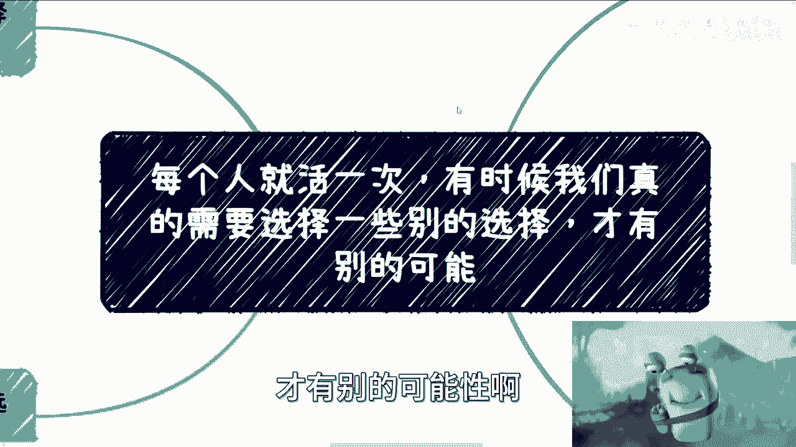
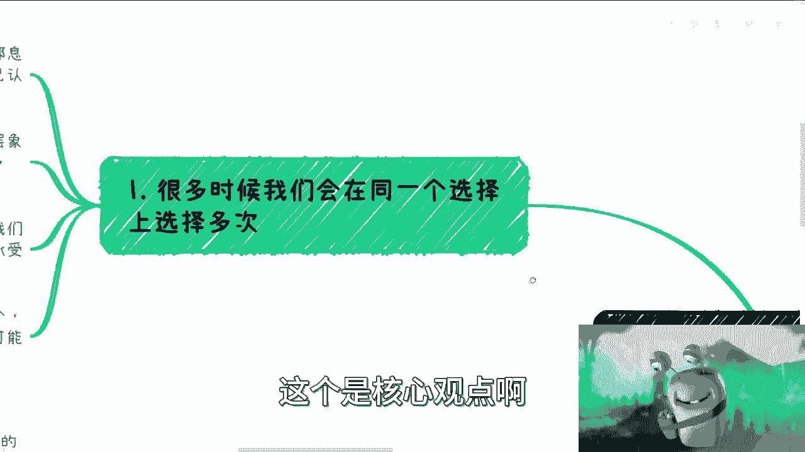
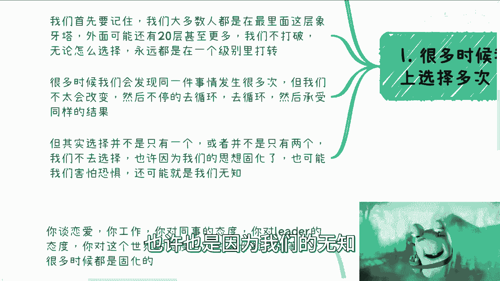
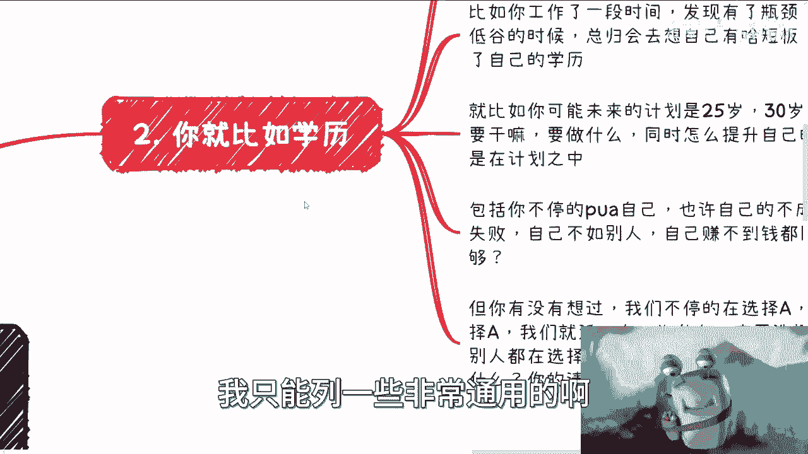
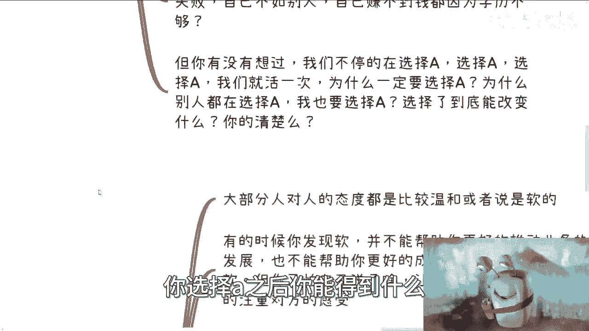
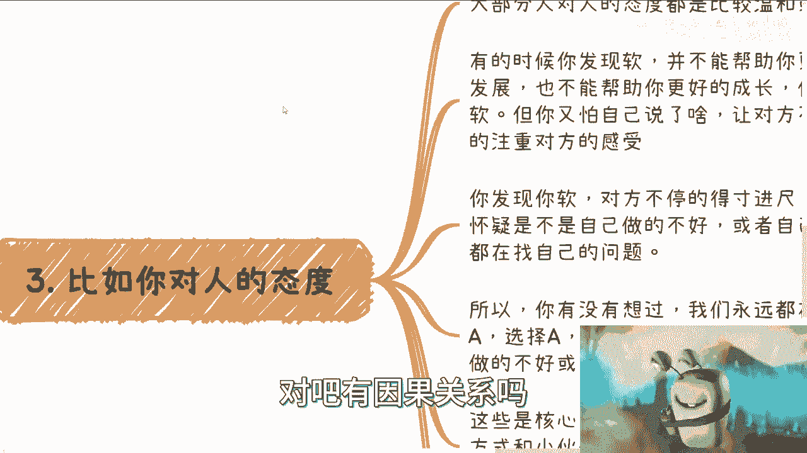
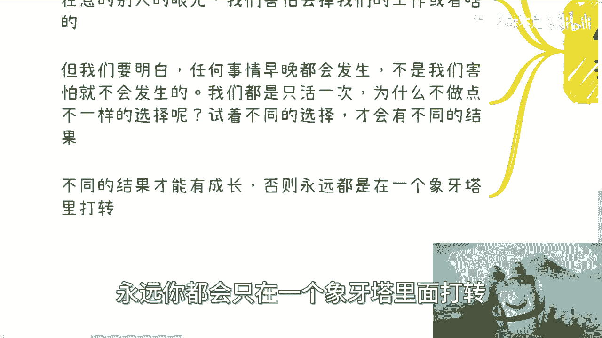

# 有时候我们真的需要选择一些别的选项，才有别的可能性 - P1 - 赏味不足 - BV1Sw411H7xj

哈喽大家好啊，今天礼拜六呃。

今天想讲这个话题呢，其实很早就想讲了，但是我一直没想好怎么个表达方式，核心呢我想表达的是这样子的，就是说大家都只活一次，很多时候呢我们在人生当中啊。

就是我们其实会碰到很多问题，我也不可能就是给大家一一列出来，但是呢我觉得其实很多很多人，包括我对吧，我们选择呢都会一次一次选择，同样的选同样的选项啊，然后呢再一次一次进入一个循环，所以我想告诉大家。

就是说啊大家都只活一次啊，有时候呢我觉得大家得选择一些别的选项啊，才有别的可能性啊。

不要老是去选同样的选项，这个是核心观点啊。

呃首先啊其实呢我觉得选和那个同样的选项呢，就跟大家的生产环境和大家从小受到的教育啊，大家等等等都会息息相关，那么大家会去选择一些固定的方向，或者说自己认为安全和稳定的方向，但是首先我们得要记住啊。

我们大部分人都是在最里面，这层象牙塔，外面可能还有20层甚至更多的象牙塔，象牙塔哦，我们只要不打破，我们只要不去看到更多的信息，无论我们怎么选择，我们永远都是在一个level里面打转的，一定要明白啊。

所以说本质上对于大部分。

我们只是在最里面这层象牙塔的人，我们无论怎么选择，你不存在什么安全和稳定这种事情啊，那么很多时候呢，我们会发现同一件事情发生很多次啊，但我们不太会改变，然后不停的去循环去循环去循环。

然后还要承受同样的结果，那当然我说的这种结果很有可能是自我，自我PUA，自我怀疑或者自我的抑郁啊，或者自我的这种指责对吧。

都有可能，但事实上选择并不是只有一个，或者并不是说只有两个啊，呃我们不去选择，也许是因为我们思想固化了，也有可能是因为我们害怕恐惧啊，也许也是因为我们的无知。

而且大部分情况是因为我们的无知嘛，因为我们并没有看到更多的选项嘛。

对吧啊，那么在这个地方我只能列一些非常通用的啊。

我也想得到的点，第一个就是说你比如学历啊，呃如果你是个职业学校或者说这个专科啊，那么基本上我觉得在中国这个国家啊，脱口而出的就是我要不要去升本。

或者说专升硕，就是我要去升学历啊，比如说你工作这段时间发现有瓶颈，或者你可能在低谷期，你可能会去想自己有什么短板。

你紧接着就会想到自己的学历，就比如说你可能未来的计划是25岁，30岁，35岁等等，要干什么，要做什么，同时呢怎么提升自己的学历，这也是在计划当中的，那么我接触下来聊下来，大部分的人啊，他是这样子的。

平时不会有什么问题，当他有任何的就是我们说产生情绪低谷期，或者说碰到一些困难的时候，他就把会会把所有的问题归结就归咎到，就说我是不是学历问题啊，包括就像我这边说的，你不停的PUA自己，也许自己的不成功。

也许自己的失败，也许自己赚不到钱或者不如别人啊，是因为学历不够，但是你有没有想过一个问题，就是我们不停的在选择A，选择A，选择A对吧，我们不停的在每次低谷的时候，在每次瓶颈的时候。

就说由于我们没有选择A或者我们A做的不好，然后导致我们怎么样怎么样，那么你有没有想过，我们就火一次，为什么一定一定要选择A，或者说大众都在选择A的时候，那为什么我也要选择A，对不对啊，那当然你也会说啊。

因为我比大众普通对吧，我比大众怎么样，这个跟普通不普通没有关系，没有任何一个规则和任何一个道理说哦，因为普通只能选A，没有这样说过，你之所以会这么认为，是因为你从小的认知。

你身边的世界观所灌输给你的思想是这样子的，你觉得你生下来的时候世界是这样子的吗，不是对不对，没有人说过，一定要因为普通，你就A就像很多人说的，那我作为一个普通人对吧，我觉得我年薪就是10万。

我年薪就是5万，我只能打工，谁跟你这么说，没人这么说过，对不对啊，到底能改，你选择了到底能改变什么，你清楚吗，其实你不清楚，你知道吗，就是很多人说我要选择A，但我就问你选择A之后你能得到什么。

你不知道啊，你跟我说，你选择A能够得到得到更好的工作，能够赚到更多的钱，真的吗，really对吧，有因果关系吗。

没有啊，那么第二点，比如你对人的态度，大部分人啊，对人的态度都是比较温和或者软的对吧，这个也正常啊，也正常啊，有时候你发现你软啊，并不能帮助你更好地推动业务，也不能帮助你更好的成长，你会苦恼自己很软。

但你又怕自己说了什么，说错了什么，让对方不开心，一次一次的去注重对方的感受，对吧，好好这就像什么，我给你们举个例子，这就像之前有个小伙伴跟我聊，我说实话我吃很忙，但是很多消息我不回，只是因为我忙。

或者我漏掉了，或者说我适应太多，我回过头，比如说过了一两个月，甚至过了多长时间，我我我漏掉了，我忘记了对吧，就是你们不要再去想说哦，因为我可能说了什么或者怎么样啊，吕老师不开心了或者怎么样。

不是我要就这点格局，那我还做什么事情，对不对，你们有没有想过对吧，所以说就是说就是说很多时候就是他一定，任何事情他都有本质上的问题对吧，都有我们说的就是说就是说这个核心的问题哦。

哦哦这个鸡毛蒜皮的事情哦，我我因为这个事情不开心哦，我因为那个事情不开心，我要就这点格局我就别做事了，你想是不是对吧，就一样的道理啊，然后呢包括什么呢，你发现你软啊，对方不停的得寸进尺。

你发现你不停的在怀疑自己是不是做的不好，或者自己是不是不够优秀，永远都在找自己的问题，所以你有没有想过，我们永远还是在选择A，选择A，选择A在考虑别人的感受，在怀疑自己是不是做的不好。

这些都是选择A对吧，那么我这两个换一下啊，就是你会发现啊，你也可以尝试着对别人狠一点，凶一点对吧，同样不要去考虑别人摆感受，从而减少自己内耗对吧，你去看看你对别人凶一点，狠一点，减少自己也好。

接下来会发生什么，怎么了呢，你改变了地球也不会不转啊，世界也不会毁灭啊，对不对啊，就算这个人跟你反目成仇了，这个人把你这个人甚至把你开掉了对吧，这个人甚至跟你以后拉黑了又怎么样呢，对不对。

因为你从你的一生来讲，任何一个人，任何一群人对我们来讲都不重要啊，有意义吗，没有意义的呀，就是就核心来讲，就是说我们要去在乎的是那些对你有帮助对吧，对你真的就是说，核心上面又提升了那些人或者事情。

而有的没的，你去关心他干什么呢对吧，那而且你想啊，我们刚刚说的这些是核心吗对吧，如果你想赚钱，你就好好去寻找赚钱的方式，跟小伙伴对吧，不行就换对吧，你觉得这个东西不行啊，根本赚不到钱，那就换。

你再有什么好在意的呢对吧，如果你想提升自己，那么你就每天专注自己的成长对吧，你你比如说定好task task对吧，定好你的整个的这个这个计划对吧，我要怎么样怎么样怎么样，那你就关注自己。

你别去关注那些有的没的好，一会儿嘛就看啊这个短视频怎么样啊。

一会儿嘛啊那个人怎么样怎么样，跟我们没有关系对吧好，那么最后一点就是我说啊，我们很多时候都在做同一个选择。

也许是时候做点别的选择，对你看啊，你谈恋爱，你工作，你对同事的态度，你对leader的态度，你对这个世界的态度。

嗯对吧，你对你父母态度等等等，很多时候你会发现很多人对于一些事情态度，他是固化的啊，也就是我说的，就是说我们会在同一个坑踩无数次而不自知啊，我们不做，是因为我们循规蹈矩，我们害怕犯错。

我们在意别人的眼光，我们害怕丢掉我们的工作，或者anyway，Whatever，各种各样的东西，对不对，但是我们要明白一件事情，任何事情早晚都会发生，不是会因为我们害怕就不发生，没有这种可能性的。

你明白吗，哦你说因为我今年KPI不好了对吧，我我可能能力不足了，我年龄大了，我每天晚上睡不着觉，我就在那边想哎呀，我又会不会被优化掉，难道因为你每天晚上不睡觉，你每天晚上在那边想，你就不会被优化掉吗。

对不对对吧，这就像我跟你们这么说，这就像我跟很多人聊问题的时候是这样子的，别有很多人会问我，他说刘老师，你觉得这个行业对未来发展不好怎么办，我说这东西我不考虑，为什么，那发展好不好跟我有什么关系啊。

哦发展好是因为我能多赚钱吗，发展不好是因为我能少赚钱吗，或者说我们才反过来说发展好不好，对不对，就是所有尔等不能控制的东西，我们只想它干什么呢对吧，那么那么也就是说即你不用去想，主动去想，也不要去害怕。

没有必要的呀，是不是啊，那么我就说啊，我们每个人都只活一次，那为什么不去做一些不一样的选择呢对吧，你试着去做不同的选择，不管是感情上还是工作上还是怎么样，对吧，你才会有不同的结果。

你才能去看到不同的结果，而不是说通过你的想象哦，这个人这个人跟我好像好像好像不对付了对吧，或者怎么样，或者这个事情好像我今天做了失败怎么样，那失败就失败换呗，对吧，而且你要明白，就是你不同的结果。

你才会有不同的成长，否则永远都会只在一个象牙塔里面打转对吧。

你这就像什么，我们再再再说啊，这就像你天天说知识付费对吧，很多人说哎我不想被割嗯，那问题来了，你不想被歌有很多种方式啊，你可以说我不付钱啊，你也可以说你说哦我因为付了钱对吧。

然后呢我可能要跟他达成真正的合作啊，你总要有些改变，你不能说永远都是说哦我付了钱，我得到了一个服务，或者我今天得到了一门课程对吧，我看完了就假装没有了，就是你任何事情你可以去做一些细微的改变。

你就像我以前跟别人一起合伙创业对吧，做一些业务，我一我很软的，一开始好，那么我软了两次之后，那我第三次可能就哎开始要做一些改变，因为我知道我软了之后结果是什么，永远都是被动的。

永远都是都是要要要要面临一些，就是说啊失败或者怎么样，那我稍微改变一下对吧，我对内可能就非常强硬，我就试试看，也许我不是这样的人，但是我要去试试看，为什么，因为我不想再去永远去选择一件一个选项。

而我在选这个选项之前，其实我就已经知道结果了，我相信其实很多人都会有这种感受对啊，但是我们要想想看，我们为什么一定要这么选呢，没有道理的呀，没有道理的，没有任何的规章制度，没有任何的所谓的真理说哦。

我们一定要这么选，没有的呀，对吧就是就像我跟你们讲的，外面有很多层象牙塔是需要我们去探索的啊，那当然这个东西就像呃，就像我在评论区跟所有人说的，就是这个东西都靠自己啊，我只是一个助理。

我只是一个催化剂哦，就是大家怎么想，还是大家的事情怎么选，尊重对方命运都没问题的啊，但是我不得不希望你们明白，就是很多东西没有一个固定的选择说哦，一定这么做对吧，就像很多人跟我说，我认对吧。

然后怎么样怎么样，哎你润跟你能不能赚到钱，跟你能不能过上好的日子，跟你能不能未来有自主选择，你觉得有因果关系吗，你自己去想想看，咳咳对不对啊，好吧行，那就这么着吧，哎呀哎呀，也不不早了，好吧嗯。

OK那先这么着吧，反正有什么大家整理好，你觉得有必要走咨询。