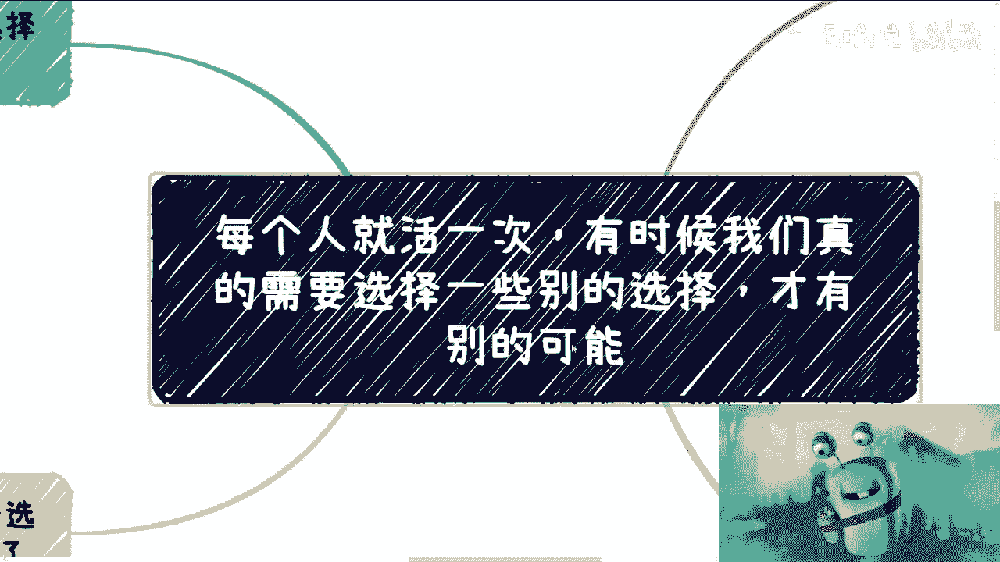
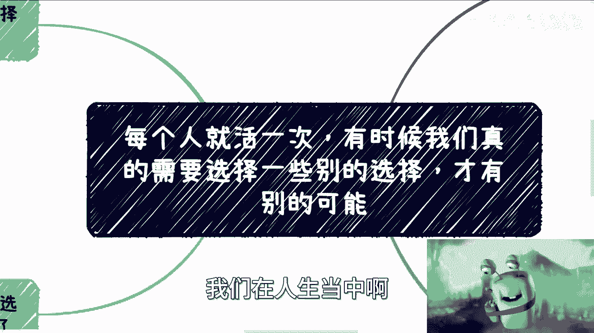
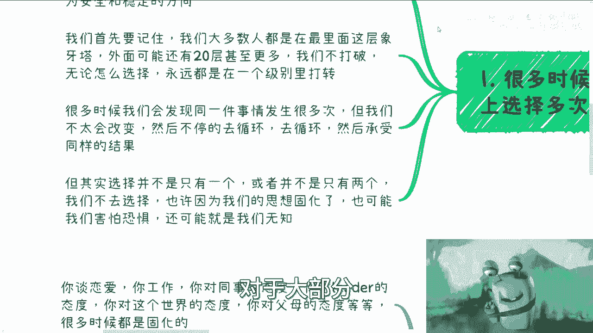
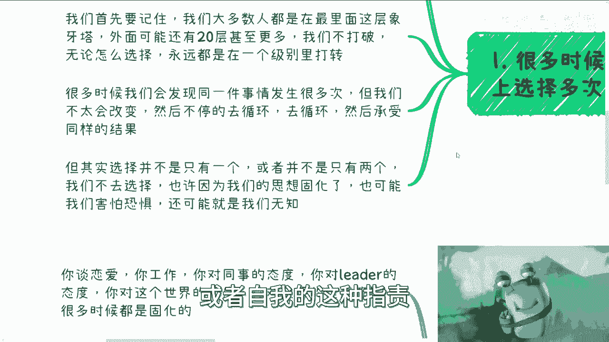
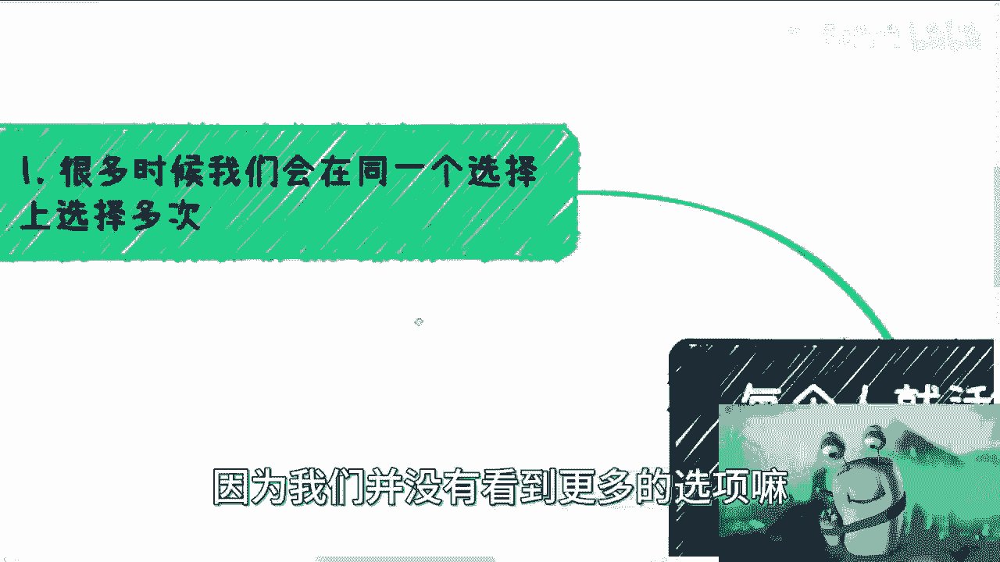
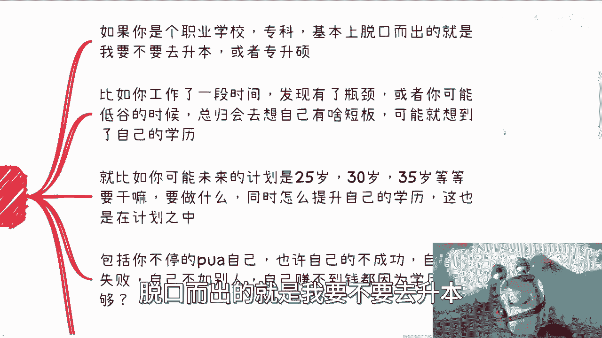
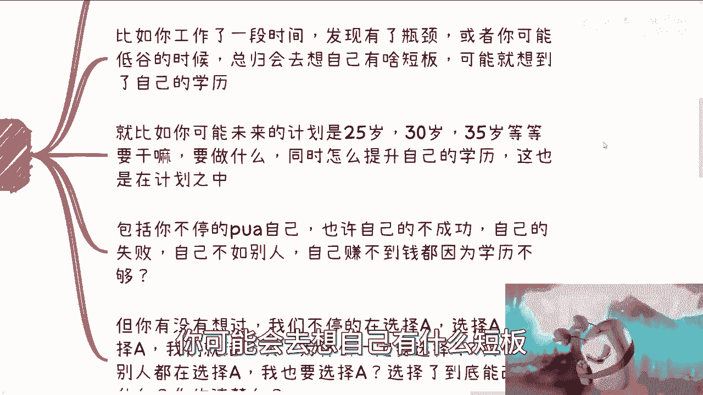
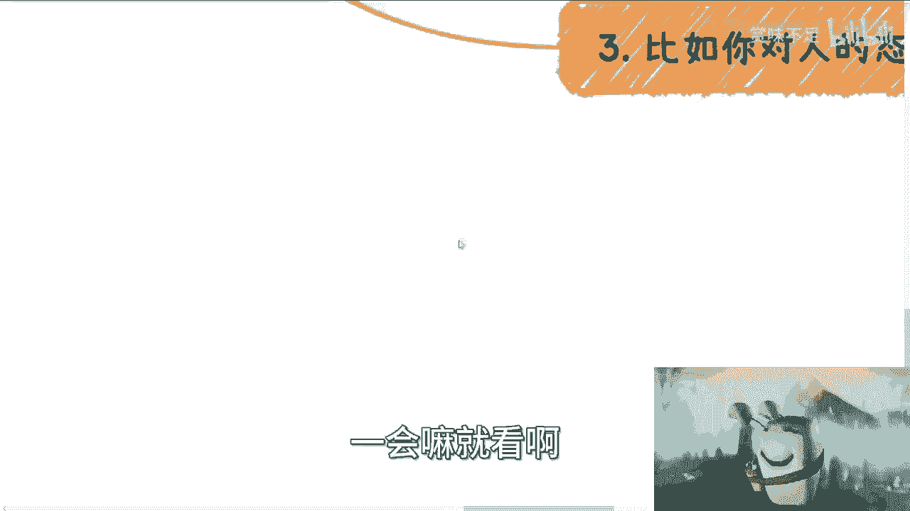
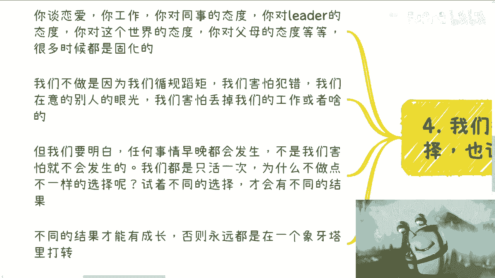

# 课程01：打破循环，探索人生的不同选项 🧭


在本节课中，我们将探讨一个核心观点：人生只有一次，我们常常因为惯性思维而重复选择相同的“选项”，从而陷入循环。要打破这种循环，看到新的可能性，关键在于主动选择不同的路径。

## 象牙塔的隐喻与循环困境





上一节我们提到了人生的重复选择问题，本节中我们来看看这种困境的根源。




我们大部分人都生活在最内层的“象牙塔”里。这个象牙塔之外，可能还有二十层甚至更多。如果我们不主动打破认知边界，不去接触更多信息，那么无论我们如何选择，都只是在这一个层级里打转。




本质上，对于生活在最内层象牙塔的我们而言，并不存在绝对的安全和稳定。我们常常发现同一类问题反复发生，自己却不太改变，于是陷入“选择A -> 得到结果B -> 再次选择A -> 再次得到结果B”的循环。



**循环公式：**
`选择(A) -> 结果(B) -> 再次选择(A) -> 再次结果(B) ...`

这种循环带来的结果，往往是自我怀疑、自我指责或情绪低落。我们之所以不选择其他选项，可能是因为思想固化、因为恐惧，但更多时候是因为**无知**——我们根本没有看到更多的选项。

## 通用场景下的“选项A”陷阱


理解了循环困境后，我们来看看生活中几个常见的、我们容易固守“选项A”的场景。

以下是几个典型的例子：

1.  **学历困境**
    *   **场景**：当处于职业瓶颈或情绪低谷时，很多人会下意识地将问题归咎于学历，并计划通过“专升本”、“专升硕”来提升。
    *   **循环**：遇到困难 -> 归因于学历不足 -> 选择提升学历（选项A）-> 可能再次遇到新困难 -> 再次归因于其他学历或能力问题。我们不断选择大众都在选的“A”，却很少质疑：选择A之后**具体能改变什么**？提升学历和找到好工作、赚更多钱之间有必然的因果关系吗？

2.  **待人接物的态度**
    *   **场景**：待人温和谦逊，但发现这有时不利于推动工作或维护自身权益，从而感到苦恼和内耗。
    *   **循环**：为了顾及他人感受而妥协（选项A）-> 对方可能得寸进尺 -> 自我怀疑是否做得不够好 -> 再次选择妥协。我们始终在“考虑他人感受”和“怀疑自己”这两个选项里打转。有没有想过，尝试选择“强硬一点”（选项B）？地球并不会因此停转，世界也不会毁灭。那些无关紧要的人和事，并不值得消耗我们宝贵的注意力。

## 如何做出不同的选择




看到了陷阱，我们自然会问：该如何跳出循环，做出不同的选择呢？



核心在于，我们要意识到人生没有“必须如此”的固定选项。很多事情，不是因为我们害怕就不会发生。担心被裁员而失眠，并不会降低被裁的风险；忧虑行业前景，也无法改变趋势。

**行动代码：**
```python
if 遇到困境 or 陷入循环:
    识别当前默认选项（通常是“选项A”）
    主动寻找并列出至少一个“选项B”或“选项C”
    评估不同选项的可能结果
    尝试执行一个不同的选项
    观察并记录新结果
    根据反馈调整后续选择
```

无论是在感情、工作还是人际交往中，态度固化都会让我们在同一个坑里跌倒无数次。我们循规蹈矩，是因为害怕犯错、在意他人眼光。但请记住，**每个人都只活一次**。只有尝试不同的选择，才能看到不同的结果，获得不同的成长，从而突破当前的“象牙塔”。


改变可以从细微处开始。例如，在合作中如果总是被动软弱，那么可以尝试在第三次沟通时变得坚定明确。这不是要改变本性，而是一次主动的“实验”，目的是打破对已知结果的重复体验。

## 总结

本节课中我们一起学习了如何打破人生的惯性循环。

我们探讨了“象牙塔”隐喻，指出局限于固有认知会导致我们在同一层面重复选择。我们分析了在学历和人际关系中固守“选项A”的常见陷阱。最后，我们强调了主动寻求不同选择的重要性：人生没有标准答案，只有通过尝试不同的路径，才能解锁新的可能性和成长空间。改变始于意识，成于行动。外面的世界还有很多层“象牙塔”等待探索，而钥匙就在你每一次不同的选择之中。