# 有没有一种可能性，其实每个节点单独拿出来都是皮条 - P1 - 赏味不足 - BV11c411S7H9

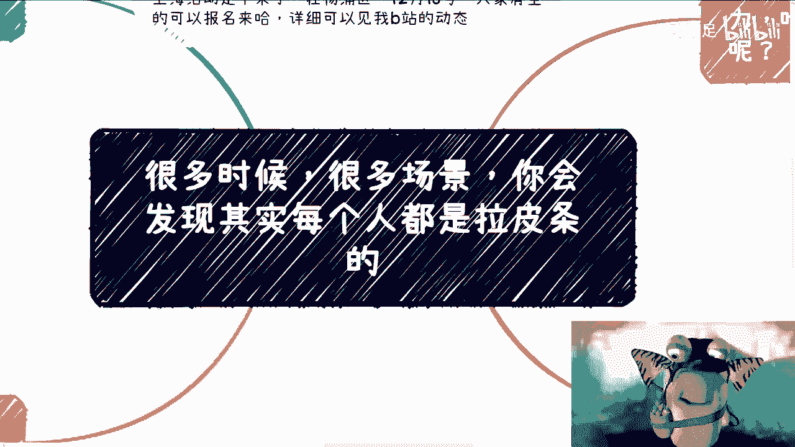

好大家好啊，今天礼拜六啊，嗯首先还是那个事儿啊，抖音上有一个名字一模一样的对吧，这个完全照抄的一个非常不要脸的啊，这个大家有空帮我举报一下啊，帮我举报一下，那么名字到介绍到他妈东西全是抄的。

他妈的真的是我他妈也是绝了，我跟你讲气笑了啊，真的气笑了嗯，然后那个上海活动定下来了啊，在杨浦区12月16号好吧，然后大家有空可以来报名，详细的东西和整个的流程，可以进我B站的动态好吧。

不知道的你们也可以私信我。

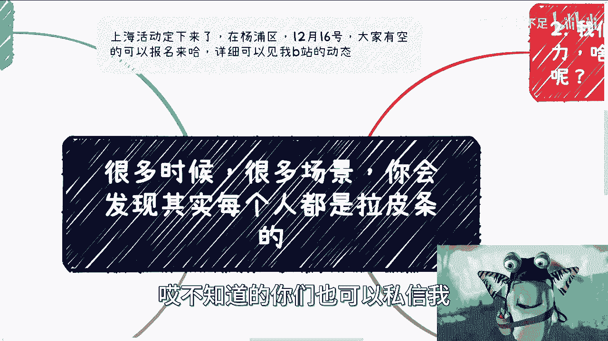

我会发给你们的啊，好那么今天我们要讲的是一个很重要的啊，也是一个，我觉得可能很多人也没想明白的，一件事情是什么呢，就是我可以告诉你们啊，很多时候很多场景你会发现啊，这不是草台班子的问题。

这是其实就是商业上的每一个环节，每个人每个公司都是拉皮条的啊。

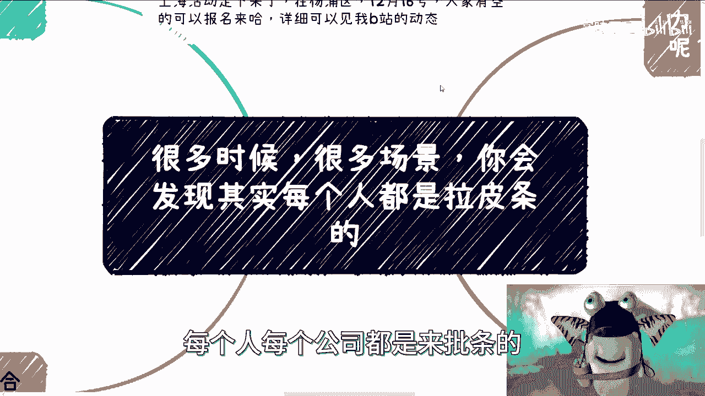

为什么啊。

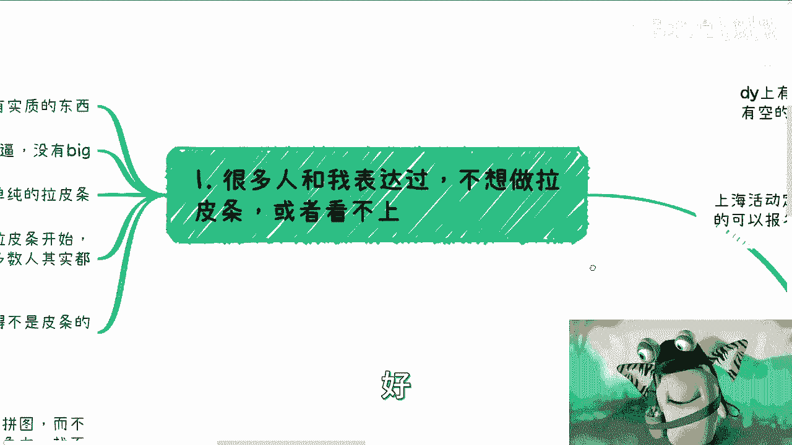

首先啊很多人跟我表达过，他说刘老师我不想拉皮条啊。

或者我就看不上拉皮条，拉皮条不是我想做的好，没问题没问题，我们首先来说啊，他们觉得拉皮条没有积累啊，觉得自己没有实质性的东西啊，我理解啊，好第一点，第二点他觉得拉拉皮条输出就不够高大上啊，不够装逼。

没有逼格对吧，你看我多么多么fashion是吧，第三呢他觉得希望自己有自己的视野啊，而不是单纯的拉皮条啊，但是你会发现啊，这三条啊在我看来啊。

就是我客观的说都是非常的宏观的，就是你说你要有实质性的实质性的东西对吧，那什么是实质性的东西，对不对啊，好那么你说高大上，那怎么叫高大上对吧，包括你说你想有自己的事业好，那什么叫有自己的事业，对不对。

就是我还是那句话啊，你们去思考任何一个问题的时候，你们可以对外去骗，但你们不要自己骗自己，你知道吗，你不要骗着骗着把自己骗进去了，那我跟你讲就很尴尬了啊，好那么我可以告诉大家啊。

为什么我从很早之前的视频当中就提到，从拉皮条开始，或者拉皮条可以一直往下做，因为其实我见过大部分的人，无论他做得好或不好，无论他做的高大上或不高大上，他本质都是拉皮条，而且很赚钱好。

那么基于以上的这些结论啊，我们得出一个假设啊，我今天给你们解释一下，你们有没有觉得啊，有没有一种可能性啊，大部分情况你觉得不是皮条的，其实也是皮条好，我们基于这个假设，我们往下来讲。

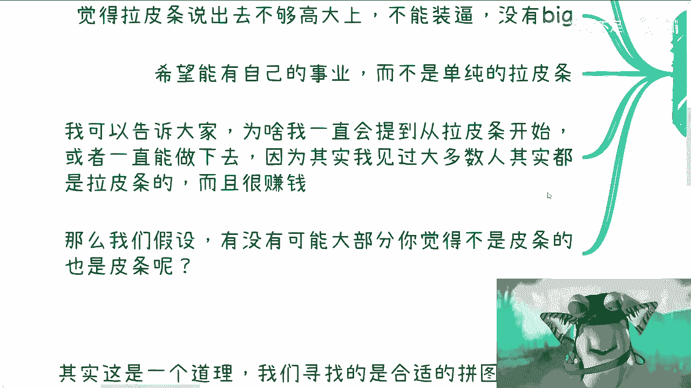

首先我们来看啊，你说要有很多人说啊，他说我要有自己的竞争力好，什么叫竞争力，什么叫自己的东西。

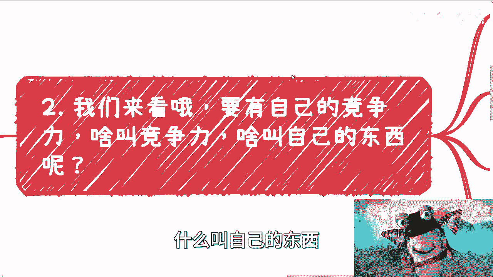

什么叫自己的事业好，我们来看一下啊，有的小伙伴说他说我想有自己的产品，对不对，好，没问题啊，没问题好，那我就要说了。

有没有一种可能性，你做的产品，你找的开发，他做的软件和找的代码，也是某些开源库抄来的啊。

也是某些，可能还有一些人是某些大厂里面偷过来的，对不对啊，啊我就这么跟你们讲，但凡做过的人，你们自己知道啊，比例能有多少啊，那么有的时候我们呢要说了，他说我想有自己的想法跟idea好，没问题。

那我就问有没有这种可能性，你的idea跟想法在内在你想出来之前，很多人就已经想过了。

在你想出来之前，很多人就已经提到过了，只不过你不知道对吧好，那么你要有自己的业务和护城河，对不对好，那么我就问，那么自己的业务和护城河是什么啊，有没有一种可能性，你自己的业务跟护城河说到底还是关系。

跟人呢，对不对啊，好那么说到这里啊。

有的小伙伴要说了，你说的这些都不重要啊，他比如说有人跟我battle，对不对，他肯定就说张老师，你说这些都不重要，我们只要能包出自己的东西就好了，这是这就是竞争力好，那我就要说了，你既然都说到这个份上。

对不对，那我包装成我自己的东西，假装是我的，但我还是拉皮条，这不香吗，这不更香吗，有什么区别呢，对不对啊，这就好像我跟你讲，这个比喻可能不是那么恰当啊，这就好像我跟你两个人对吧。

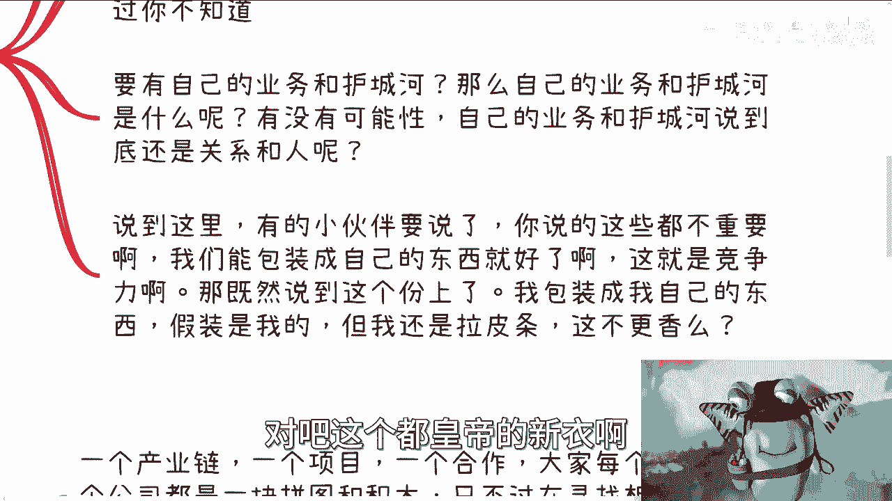

然后呢，我跟你说我就没穿，你跟我说我穿了啊，我真的穿了，我一定要骗自己。

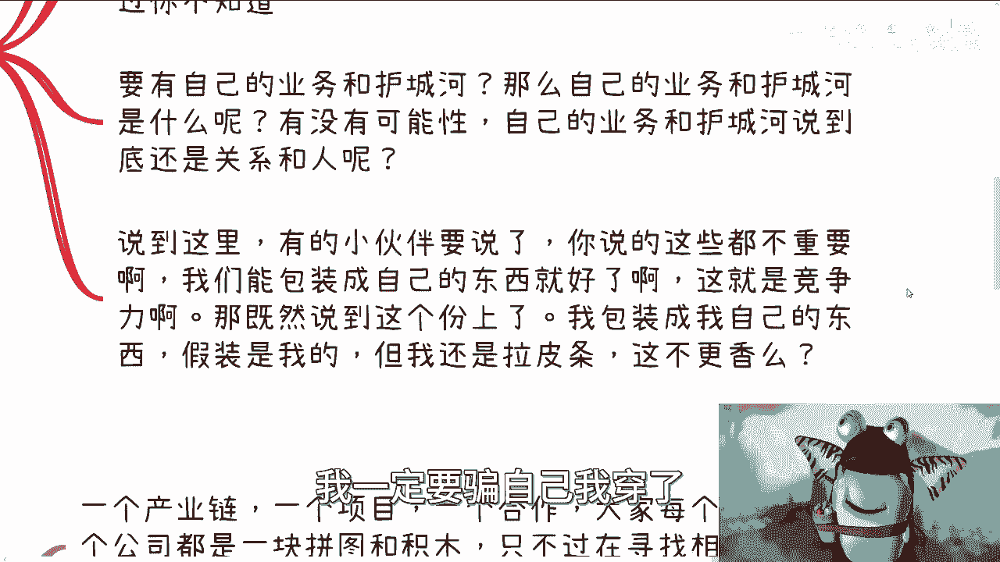

我穿了有意义吧啦对不对，有意义吧啦啊。

然后下一点啊，所以有没有一种可能性啊，也许每个人都是来批评啊。

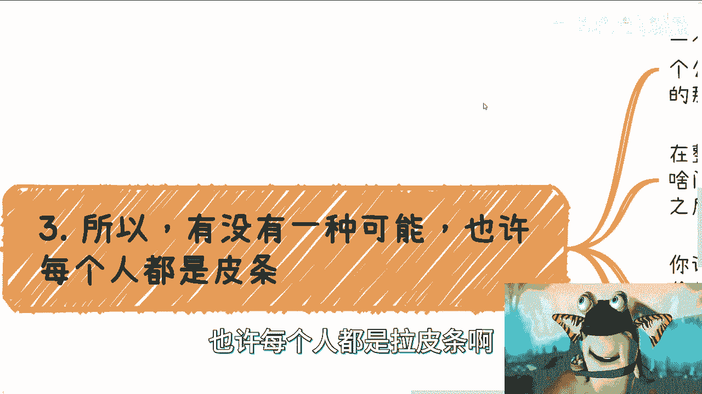

什么意思啊，我们来看啊，首先你今天做一个项目，一个产业链啊，一个上下游一个合作，你可能是十个节点，20个节点或者三五个节点合作，对不对，好大家，每一个人，每个公司本质上都是一块拼图和积木。

我们不管是个人还是企业，还是高校，还是政府还是什么东西啊，不重要啊，每一个人都是一块拼图跟积木，只不过在寻找相互之间适合的那个积木去拼，然后找到是能够出钱的口子而已，对不对好，那么在整个链路里面。

其实每个人单独去看你，你不要把它看成个主体啊，看这个整体，你单独把它拎出来去看他每个人都是皮条呀，有什么区别呢，你仔细想想看有什么区别呢，那那我们随便打个比方，就像我们以前跟高校合作，对不对。

好啊没问题啊，你说我们合作的可能是院长，对不对，那你把院长单独拎出来，他怎么不是皮条呢，啊他无非就是撮合了我跟校方嘛，对不对，那怎么不是皮条呢，大家都是皮条对吧，那你如果把学校单独列出来，那我还说呢。

对不对，你都是皮条啊，因为金主爸爸不一样，但是你往下看所有的链路，它每一个拎出来怎么不是皮条呢，是不是哦，你说有没有护城河，有没有自己的价值，有啊这种价值是什么，就是合作之后大家相互知道哦。

你的这块拼图跟我这块拼图可以拼在一起，我们拼过了，而且我们很顺利，那么这种关系就是你的护城河，这种经验就是你的价值，对不对，你不要自己骗自己说啊，我一定要有我的价值，我的你有什么价值。

你有什么价值是不可替代的，对吧好，那么你说有一句话这么说的，他说缺了谁都可以继续运作对吧，地球缺了谁都一样，转好没问题啊，但是你要明白，我们更多的是要去寻找合适自己的积木啊，或者相互合适积木啊。

所有人出去谈生意，不就这不都是这个逻辑吗，我们出去难道是为了寻找我们的失败吗，不是啊对哦，我们出去难道是寻找跟自己不匹配的积木吗，也不是啊，对吧哦，你说用这句话来PUA自己，你说缺了谁都可以运作。

我不要做个拉皮条的，那没有意义啊，因为你要做的是寻找到合适的合作伙伴，这才是你的价值，而不是说在那边PUA自己说缺了谁都可以运作，那我不要做这个，那你做什么呢，你跟我说，你要做个打工人，要做个电池。

牛逼，那我只能说牛逼。

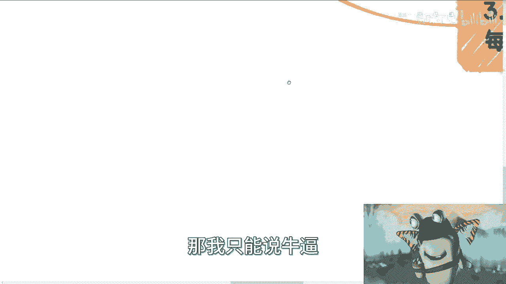

好那么第四点就是我们做商业啊，要关注的是适合我们的人跟场景，要关注的是你怎么去赚钱。

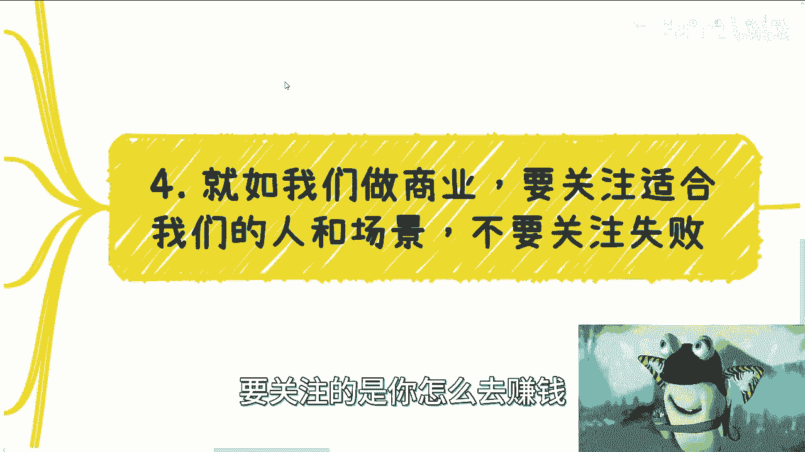

不要关注失败对吧，其实我跟你讲，这是一个道理，就是说我们寻找的都是合适的拼图，而不是不合适的，你老告诉自己说我们没有竞争力，找不到合适的拼图，那就是一个死循环啊，就是说我们出去寻找的合作伙伴。

对方可以拒绝，我可以不见，我可以不合作，那无所谓啊，我们就不停的尝试了，不停的完善我们的包装跟介绍，直到找到合适的不就行了吗，对吧，其实你说叫拉皮条也好，叫中介也好，这不重要，因为这只是一个话术。

只是一种定位对吧，这就像你叫我陈老师，叫我刘老师，叫我赏味无所谓，你叫我什么有关系吗，没有关系啊，这定义根本就不重要对吧，你只要知道你自己要做什么，以及你想做成什么样子就好了，那我们在这地方说啊。

就是说我之所以把这个内容会放在人间清醒，这个专辑里面，我就是希望大家能看明白，不要被一些面子上的东西所忽悠过去对吧，你比如说同一件事情，不同的想法，你看法就很不一样，你面对失败，你就告诉你自己。

这不是自己想要的对吧，可能自己还没有准备好，或者当下这个人这个合作方式不合适，那么你再找呗，换呗，对不对，那你也可以这么想，你想啊，我什么都没有啊，我又失败了，对方又拒绝我，就是因为我什么都没有。

所以我失败了，而因为别人拒绝我，我所以我还什么都没有，那你怎么能够往前走呢，对不对啊，然后你因为这件事情，你又衍生出另外一个想法，就说哎我能不能去找到一些标准答案，就是我们说的应试教育对吧。

我能不能找到一些解，能不能找到一些流程来解决我这个问题好了，那我告诉你下一步就是被割，为什么哪来的标准答案啊，啊卧槽，我还是那句话呀，你但凡用你的脑子想想看有标准答案，中国老百姓早就均富了啊。

还轮到你去找你，是觉得你出钱买这个标准答案，别人是买不起吗，还是怎么滴，对不对啊，所以我跟你讲，你觉得你怎么思考呢，对吧你你怎么选呢，这很重要啊。

所以啊我们回到这个地方，就是我希望大家举一反三啊，因为很多东西我不可能讲的面面俱到对吧，你比如说我现在就讲了10分钟，或者10分钟能讲什么东西呢，对不对，我就希望就是说你们从这个东西当中。

你能明白就是整个链路的发展，整个链路的一个合作，它的核心是什么样子的，就是我们不要去看它表面对吧，它的核心是什么，核心就是大家拼在一起，你才有力量，你不拼在一起，每个人都是个体没有用的啊。

你不是奥特曼啊，对不对，那人家奥特曼还有六兄弟呢。

对吧啊，所以啊好吧嗯行好吧。

就这么着就这么着，那个活动好吧，要哎呀哎活动好吧，要来的，反正你们这个报名好吧，私信我啊，哎呀我靠对吧，然后就说那个然后其他的有什么有什么，就是哎有什么那个咨询的啊，然后有什么就说这个这个这个商业。

不知道怎么做的啊，或者怎么规划的，反正你们就整理好问题再做咨询，哎呀这东西都倒了。

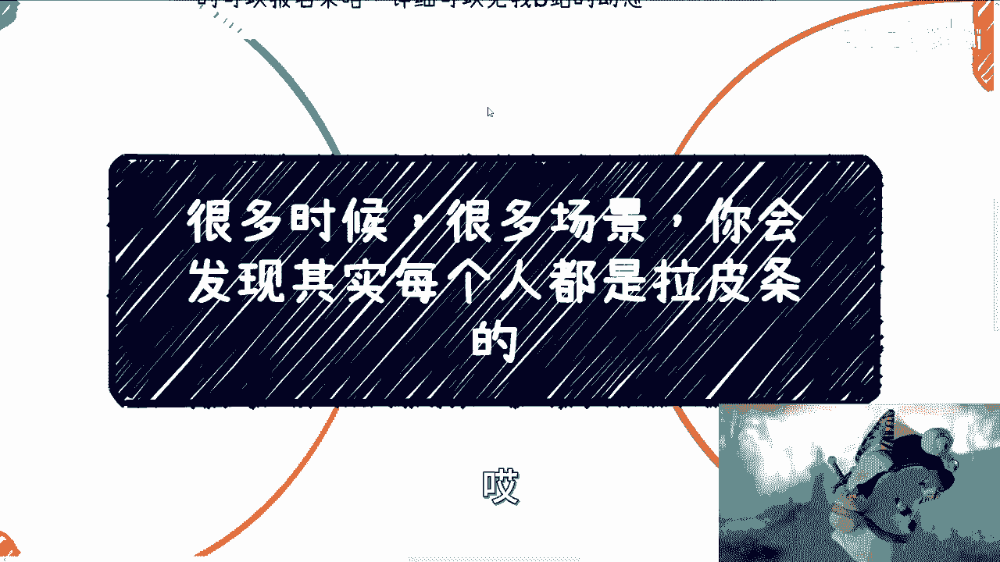

我来整理一下。