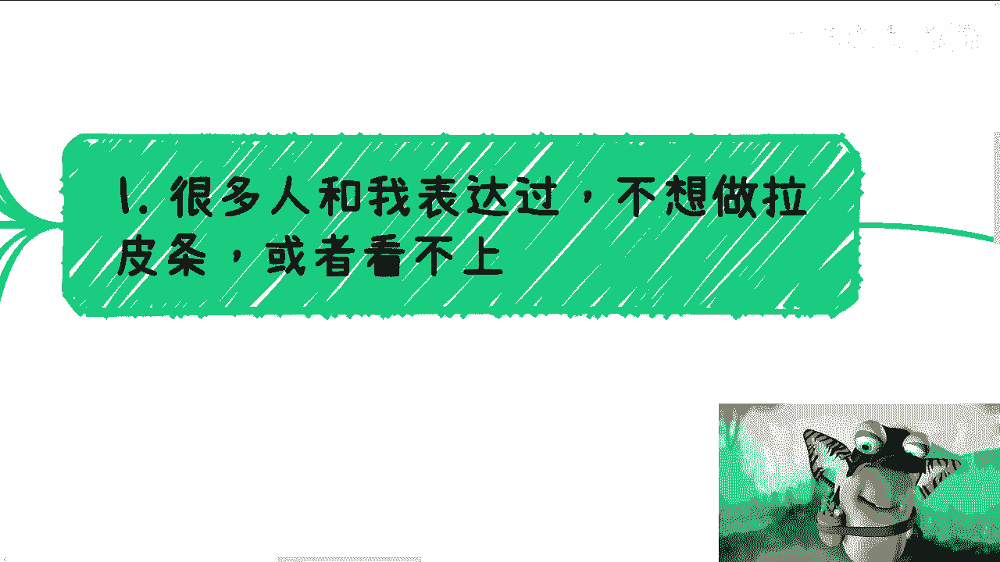
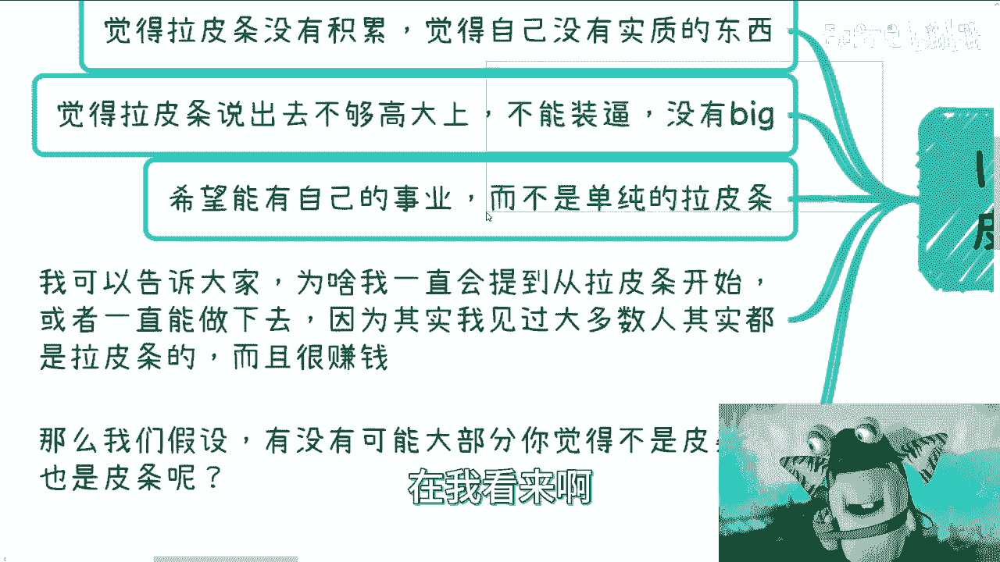
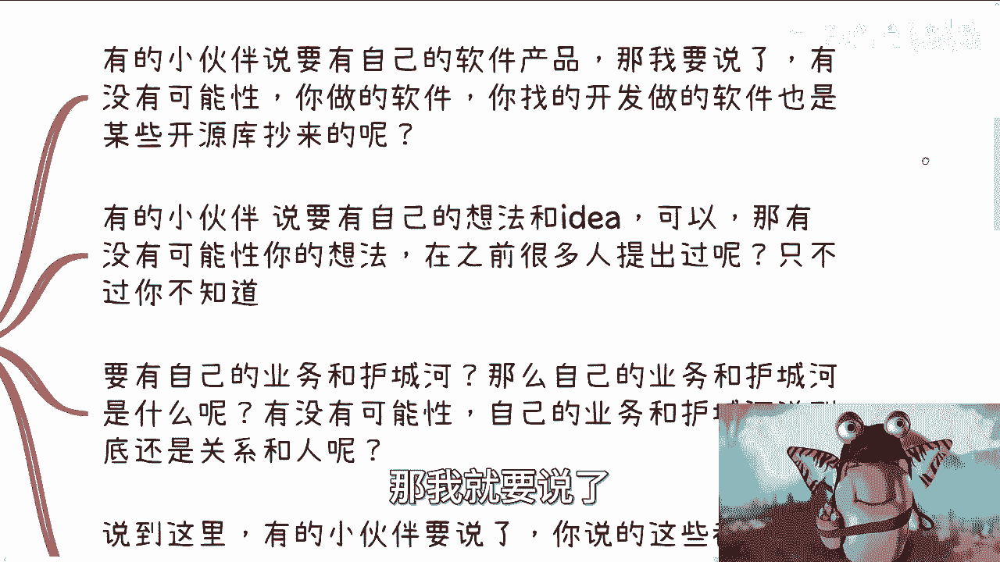
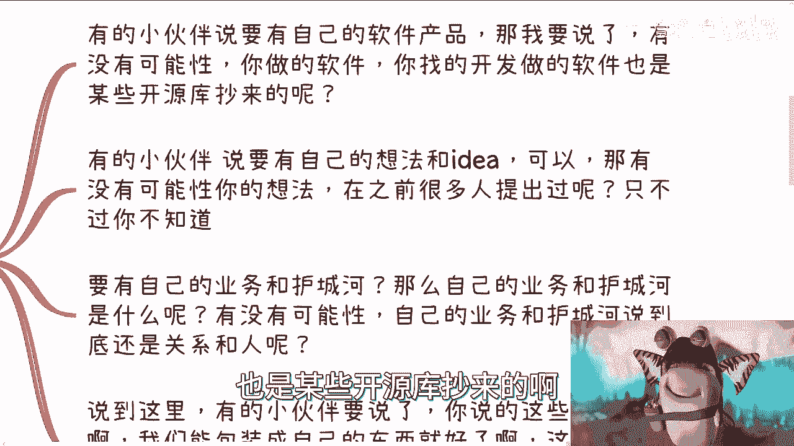
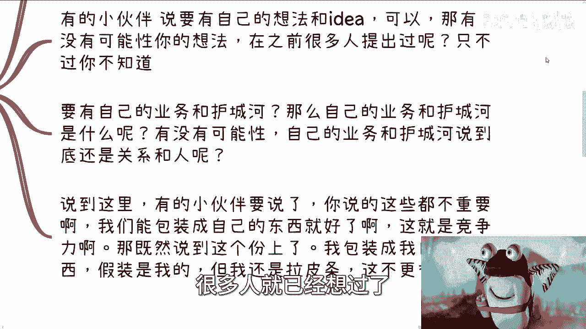
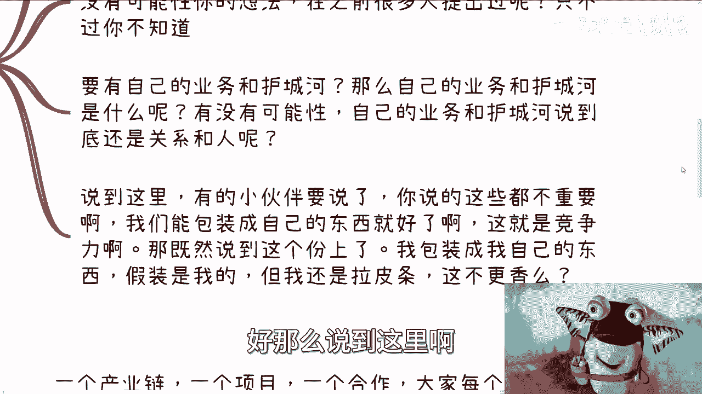
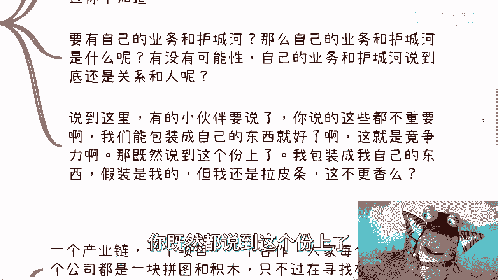
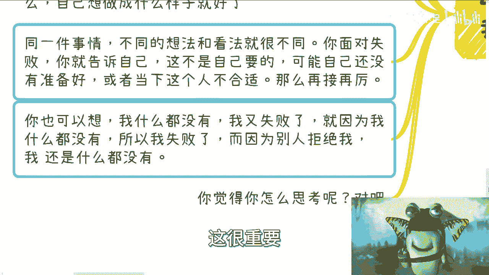
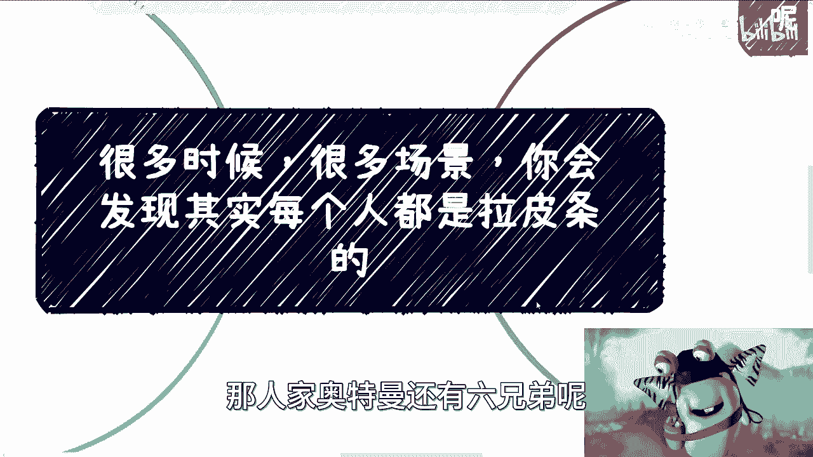
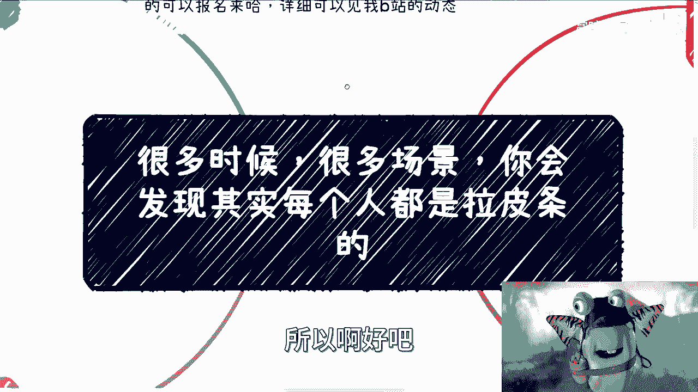

# 商业认知课 P1：商业网络中的“拉皮条”本质 🧩

在本节课中，我们将探讨一个核心的商业认知：在大多数商业场景中，每个独立的节点或参与者，其本质可能都是一种“拉皮条”（即中介、连接、撮合）行为。我们将分析为何这种模式普遍存在，并帮助初学者理解其背后的商业逻辑。

---

## 课程背景与声明

近期在抖音平台出现了一个完全照搬我个人账号名称与内容的抄袭者。请大家如有发现，协助举报。

上海线下活动已定于12月16日在杨浦区举行。具体流程与报名详情，请查看我的B站动态或通过私信向我咨询。

---

## 对“拉皮条”的常见误解

许多人对于“拉皮条”（在此指中介、连接资源的行为）抱有负面看法或误解。以下是三种典型观点：

1.  **认为其缺乏积累**：觉得这种工作没有创造“实质性”的东西，无法形成个人核心竞争力。
2.  **认为其不够“高大上”**：觉得这种模式不够时尚、缺乏逼格，不符合对“成功事业”的想象。
3.  **希望拥有“自己的事业”**：渴望摆脱单纯的连接角色，建立属于自己的、有掌控感的事业。

然而，这些想法往往过于宏观和模糊。什么是“实质性”的东西？怎样才算“高大上”？“自己的事业”具体指什么？我们需要更具体、更诚实地思考这些问题，避免自我欺骗。

---

## 核心假设：万物皆可“皮条”

基于大量观察，我们提出一个假设：**在大多数情况下，你认为不是“拉皮条”的行为或角色，其本质可能依然是“拉皮条”。**

让我们来验证这个假设。当人们谈论要拥有“自己的东西”时，通常指以下几种情况：

*   **拥有自己的产品**：你认为产品是“实质性”的。但有没有一种可能性，你产品中的代码大量借鉴了开源库，或是从其他公司“借鉴”而来？这在行业中非常普遍。
    *   **公式/代码描述**：`你的产品 ≈ 整合(开源代码, 现有解决方案, 微创新)`
*   **拥有自己的想法（Idea）**：你认为独特的创意是核心竞争力。但有没有一种可能性，你的想法在诞生之前，早已被许多人思考或提出过，只是你未曾知晓？
*   **拥有自己的业务与护城河**：你认为构建了独特的商业模式就能高枕无忧。但有没有一种可能性，所谓的“护城河”最终依然依赖于**特定的关系网络和人际资源**？

既然以上这些被视为“核心竞争力”的要素，其源头都可能来自外部整合与连接，那么与其纠结于“这是不是我的”，不如坦然接受“连接与整合”本身就是一种强大的能力。**将外部资源有效包装、整合成“自己的”解决方案，这本身就是一种高级的“拉皮条”，并且非常“香”。**

这就好比争论“皇帝的新衣”，坚持认为自己穿着华丽礼服，不如承认现状并思考如何利用它。

---

## 商业网络：每个人都是一块拼图 🧩

上一节我们拆解了对“自身价值”的迷思，本节我们来看看商业世界的运行结构。

我们可以将任何一个商业项目或产业链，看作由多个节点（个人、公司、机构）组成的网络。每个节点都像是一块独特的**拼图**或**积木**。

*   **核心逻辑**：商业活动的本质，就是这些拼图相互寻找、匹配，最终拼接成一个能产生价值（找到“出钱的口子”）的完整图案。
*   **节点本质**：如果你将网络中任何一个节点单独拎出来审视，无论它是高校、院长、企业还是个人，其在这个特定链条中的作用，很大程度上就是在**连接其上游和下游**——这即是“拉皮条”的核心定义。

**举例**：我们与高校合作，院长连接了我们和校方资源。单独看院长，他就是在“拉皮条”。校方连接了院长和社会需求，也是在“拉皮条”。每个节点都在其位置上执行连接功能。

那么，节点的价值与护城河何在？其价值在于：**“我”这块拼图，与“你”那块拼图，我们知道彼此能严丝合缝地拼接，并且有过成功合作的经验。** 这种**匹配的经验和信任关系**，就是你的护城河，而非某种虚幻的、完全孤立的“不可替代性”。

有人说“缺了谁地球都照转”，这话没错，但它是一种消极的PUA。我们的目标不是成为那个“缺了不行”的神，而是**持续寻找并与那些“匹配的拼图”成功拼接**。这才是商业上的积极作为。

---

## 商业实践：关注匹配，而非定义

理解了商业的拼图本质后，我们的行动方针就应变得清晰。

1.  **关注匹配与成功**：商业的核心是寻找**合适的人与场景**来实现盈利。你应该关注如何找到下一个匹配的拼图，而不是反复纠结于“不匹配的失败”。拒绝是常态，不断尝试、优化你的“拼图介绍”（即个人或公司价值的包装），直至找到匹配项，才是正途。
2.  **名称不重要，实质才重要**：称之为“拉皮条”、“中介”、“资源整合”或“生态连接”都不重要。这只是一个**话术标签**。就像你可以叫我老师或其他任何称呼，定义本身不改变实质。关键在于你清楚自己在做什么，以及想达成什么目标。
3.  **避免思维陷阱**：不要陷入自我否定的循环：“因为我什么都没有，所以被拒绝；因为被拒绝，所以我永远什么都没有”。同时，也要警惕寻找“标准答案”的陷阱。商业没有放之四海而皆准的流程，企图购买“成功秘籍”往往是被割韭菜的开端。

---

## 总结与举一反三

本节课我们一起学习了商业中的一个底层认知：

1.  **普遍性**：商业世界中，许多看似不同的角色，其底层行为逻辑都包含“连接资源”（即“拉皮条”）的成分。
2.  **结构本质**：商业网络由众多“拼图”节点构成，节点的价值在于找到并与其他拼图成功匹配，形成价值闭环。
3.  **行动心法**：应关注如何寻找**合适的合作伙伴**（匹配的拼图），而非纠结于抽象的身份定义或害怕失败。拒绝是筛选过程的一部分。

希望你能从这个框架中**举一反三**，看清许多商业合作背后的核心：**单独个体力量有限，但通过有效的连接与拼接，就能汇聚成强大的整体。** 你不是单打独斗的奥特曼，奥特曼也有兄弟并肩作战。

---

**课后互动**：上海线下活动欢迎报名参与。对于课程内容有任何疑问，或需要进行个人商业咨询，请整理好具体问题后通过私信联系我。