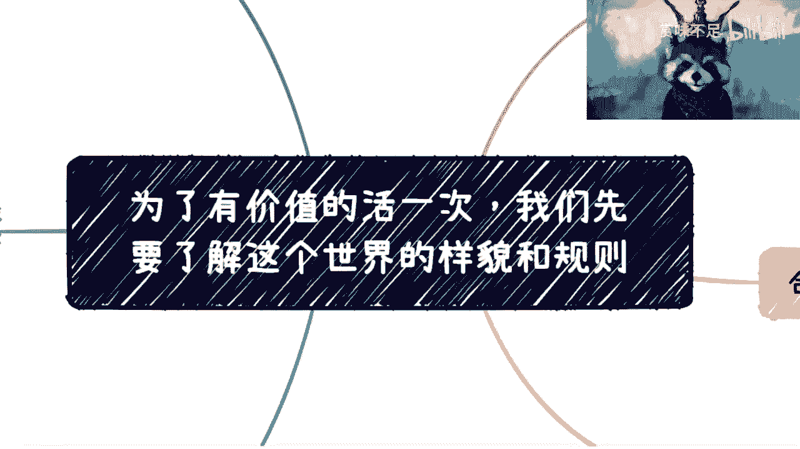
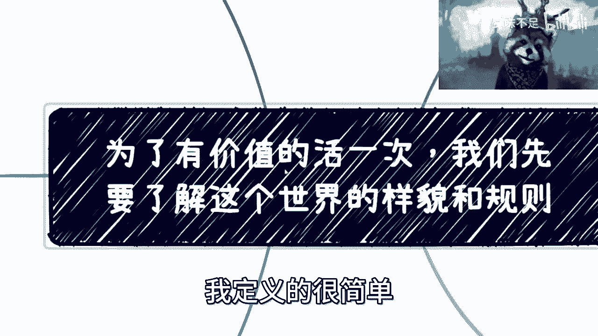
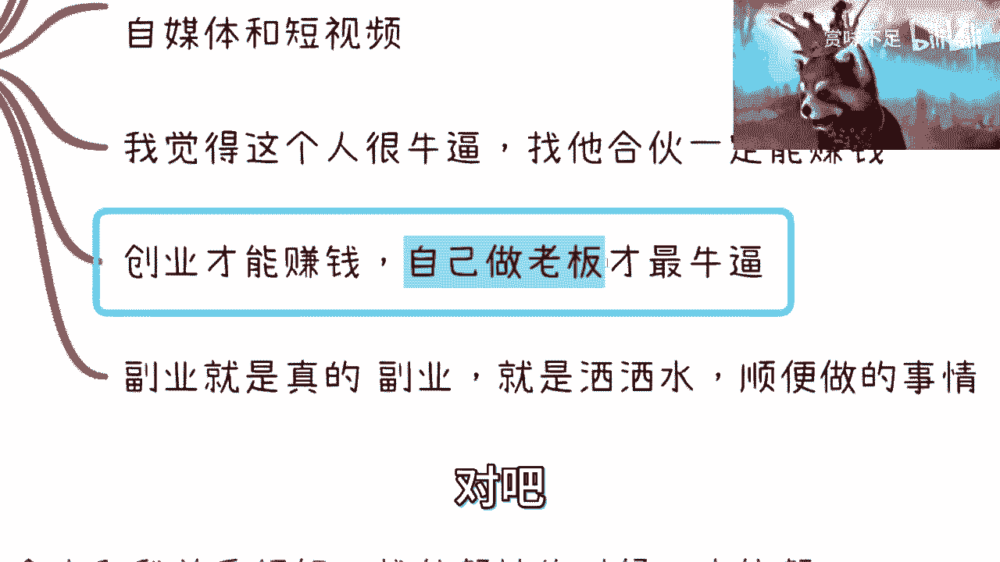
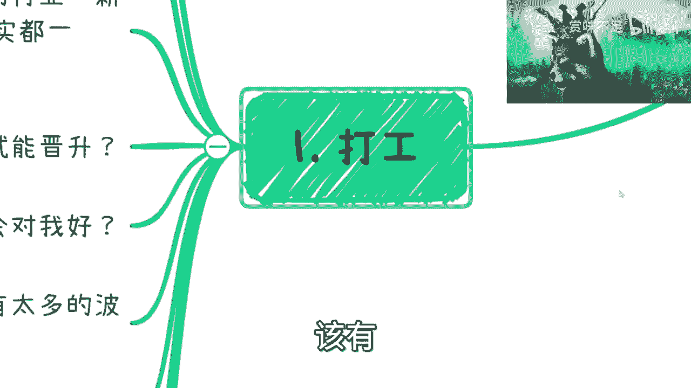
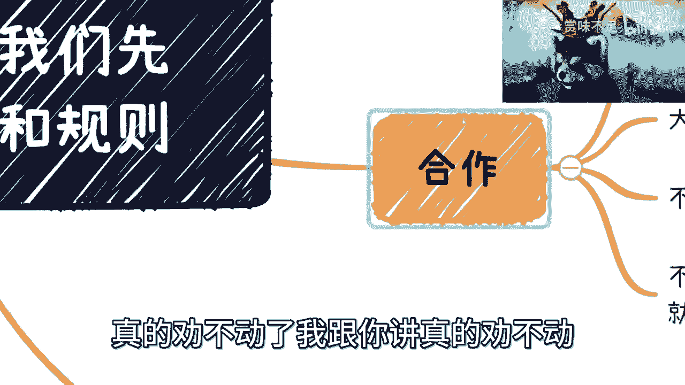
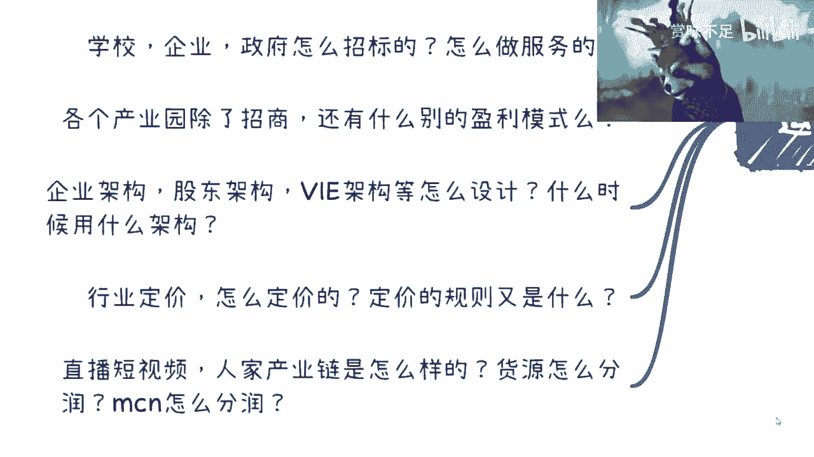

# 课程一：来看看楚门外的世界 - 认知真实世界的样貌与规则 🧭

在本节课中，我们将探讨一个核心主题：如何超越“楚门的世界”，去了解并适应真实社会的运作样貌与规则。这对于我们做出人生选择、实现个人价值至关重要。无论你是想积极改变，还是选择淡然处之，理解这些底层逻辑都是必要的前提。

---

## 概述：我的经历与视角

我拥有多元的职业背景。早期，我在多家大型科技公司（如BATJ）任职，但很快意识到在纯技术赛道上难以突破。因此，我较早开始了兼职，为企业与政府提供内训和咨询，并与清华大学出版社保持了长期合作。

这段经历让我深入了制造业、金融、医疗、互联网等众多行业，目睹了不同组织的内部运作。这些见识远超单一全职工作所能获得。目前，我的主要工作是担任企业和政府的咨询顾问及培训师，并协助进行技术落地。

**请注意**：以下内容面向心理成熟的成年人。所述规则并非绝对，但符合大多数情况（约95%）。即使特别优秀的人，也只能偶尔跳出这些规则。

---

## 第一部分：关于“打工”的认知误区 🏢

上一节概述了本课程的基础视角，本节中我们来看看围绕“打工”这一普遍职业状态，存在哪些常见的认知偏差。

许多人对于职场抱有理想化的想象，但现实往往更为复杂。以下是几个关键点：

1.  **职场友谊**：在职业初期或低层级时，可能存在单纯的友谊。但随着层级提升，人际关系将更多由利益和手段主导，纯粹的友谊变得稀少。
2.  **公司内的成长**：不要指望在公司里获得真正的、全面的成长。大公司只是另一个“象牙塔”，系统设计的目标是让你成为合格的“零件”，而非培养你独立闯荡世界的能力。真正的学习只能靠自己主动向外探索。
3.  **“别处更好”的幻觉**：不要认为当前环境不好，换个公司、行业或岗位就会变好。这就像恋爱中的“想象滤镜”，深入了解后往往会发现本质相似。区别只在于你尚未看到新环境的问题。
4.  **努力与回报**：“只要努力就能晋升”是20年前的逻辑。在当今高度内卷的环境下，努力只是入场券，远非保证。
5.  **善意互惠**：“我对别人好，别人就会对我好”在职场并非普遍真理。利益交换常常比情感联结更稳固。
6.  **卷与躺平**：认为“只要卷就能稳定”或“只要躺平就能安稳”都是错觉。未来的趋势是更激烈的竞争，大多数人并不真正懂得如何高效地“卷”，也无资本真正地“躺平”。
7.  **职业规划**：在经济上行期，清晰的职业规划或许有用。但在快速变化、充满不确定性的当下，过细的规划可能浪费时间。比起规划路径，积累人脉和洞察规则更为重要。
8.  **打工赚钱**：指望通过打工赚取可观的财富是非常困难的。你需要认清现实，在“接受自我”、“选择平淡”和“主动折腾”之间做出选择，不能“既要又要”。

**过渡**：理解了“打工”生态的局限性后，许多人会将目光投向“创业”或“副业”。接下来，我们看看在这些领域又有哪些需要警惕的思维陷阱。

---

## 第二部分：关于“创业/副业”的认知误区 💡

创业和副业被许多人视为突破之路，但其中同样充满了陷阱。以下是需要警惕的几个观念：

1.  **追逐“红利期”**：当你看到一个行业所谓的“红利期”时，它往往已进入尾声。盲目进入很容易成为被收割的对象。
2.  **“我有一个改变世界的IDEA”**：在说出这句话前，请先自问是否足够强大并了解现有规则。99.999%的情况下，你的想法并非独一无二，前人不去做很可能是因为它不符合商业逻辑或现有规则。这通常源于对世界的“无知”，而非“创新”。
3.  **“我有一技之长，可以做自媒体”**：拥有一技之长的人很多，且比你更专业的大有人在。技术或才华只是基础，成功更需要懂得平台规则、运营和商业变现。
4.  **“找到厉害的人合作就能成”**：千万不要把某个人或项目视为“救命稻草”。当你产生这种依赖心理时，往往离失败不远了。
5.  **“创业=赚钱=自由”**：创业确实可能带来更多收益和自主权，但前提是你具备当老板的能力。否则，你只是从给公司打工，变为给资本、客户或投资人打工，甚至更加心力交瘁。

**核心提醒**：在打工时，**切忌过度责任心**。公式可以概括为：`过度责任心 = 自我消耗 + 时间浪费`。你的老板或公司通常不会珍视你的额外付出，这只会导致你疲惫不堪，最终在多年后可能一事无成。当然，这并非提倡在任何场合都毫无责任心，基本的职业操守和良心仍需坚守。

**过渡**：谈完了心态陷阱，我们再来看看在具体操作层面，尤其是涉及“合作”时，有哪些必须知道的准则。

---

## 第三部分：关于“合作”的实用准则 🤝

无论是副业还是创业，都离不开与人合作。以下是几条至关重要的合作准则：

1.  **副业不是“洒洒水”**：如果真想做好一件事，哪怕是副业，也必须投入主业般的认真和精力。浅尝辄止无法让你洞察冰山下80%的规则和门道。
2.  **关系与帮忙**：判断一个人是否会真心帮你，最直接的标尺是：**你是否曾为他赚过钱或创造过核心价值？** 答案是 **Yes** 或 **No**，非常简单。许多口头上的“帮忙”往往效果甚微。
3.  **朋友与商业**：强烈不建议与朋友进行商业合作。商业世界的逻辑与友情逻辑不同，极易因理念、利益分歧而最终连朋友都做不成。
4.  **合同的重要性**：**任何商业合作，无论多小，都必须签订正式合同。** 这是保护双方的基础。从一开始就拒绝签合同，通常意味着其中一方打算坑害另一方。
5.  **明确报价**：合作时，不要让对方“看着给”或“你定就好”。这等于将主动权拱手让人，极易被压价。应该自己心中有数，并明确提出合理的报价。

**过渡**：除了职场和商业，另一个常见的追求是“学历提升”。我们接下来分析一下在“考研”这件事上，需要破除的迷思。

---

## 第四部分：关于“考研/学历”的理性看待 🎓

学历有用吗？当然有用，但需要理性分析。

1.  **学历的真实效用**：如果你有学术天赋，能进入985/211或真正有含金量的项目，那么深造是很好的选择。但如果仅为了“卷”学历而考研，投入产出比可能很低。
2.  **“不输在起跑线”**：认为“考研就不落后”是一种错觉。当研究生数量激增而优质岗位有限时，学历的边际效用会递减，大家可能在新的起跑线上再次陷入同质化竞争。
3.  **“入场券”思维**：认为学历是唯一“入场券”，往往是因为缺乏其他足以证明能力的“硬通货”。如果你有能力通过项目、业绩、技能脱颖而出，完全可以绕过传统的学历门槛。

**过渡**：最后，我们来探讨一个更本质的话题：在这个世界上追求“名”与“利”的智慧。

---

## 第五部分：关于“名与利”的运作智慧 ⚖️

年轻人常希望“名利双收”，但需要理解两者间的转换关系。

1.  **交换逻辑**：很多时候，我们需要 **用“名”去换取“利”**，而不是直接索取利益。名声可以带来长尾的、持续的收益。
2.  **投资思维**：有时需要 **主动牺牲短期利益去换取“名”**。比如通过让利、卖人情来建立声誉、信任或关系网络，这些“名”将在未来带来更大的“利”。公式可表示为：`短期利益牺牲 -> 声誉/关系积累 (名) -> 长期利益回报`。
3.  **目光长远**：切忌只看眼前利益。许多回报需要时间的沉淀。

**过渡**：以上讨论了许多具体领域的认知，但其底层都指向同一个核心：你是否了解这个世界的“运作规则”？下面我将列举一些例子，它们构成了真实商业社会的隐藏骨架。

---

## 第六部分：你所不知道的“世界运作规则” 🌐

学校的教育体系很少涉及这些，但它们却是真实世界运转的齿轮。以下是一些例子，问问自己是否了解：

*   **《中华人民共和国职业分类大典》**：如何运作？如何与之关联并创造价值？
*   **协会、商会、学会、研究院（特别是“民非”-民办非企业单位）**：它们如何建立、运作并盈利？
*   **组织间的合作**：学校、企业、政府之间如何进行招投标？何为“陪标”？如何提供配套服务？
*   **产业园的盈利模式**：除了招商，还有哪些收入来源？（如政策补贴、股权投资等）
*   **资本运作**：国有资金、产业基金如何参与私募投资？
*   **企业架构设计**：在何种情况下使用何种股权架构、VIE架构？
*   **行业定价权**：任何一个行业（如短视频、跨境电商）的定价规则和底层逻辑是什么？
*   **产业链生态**：以直播带货为例，从主播、MCN机构、供应链、渠道商到平台，整个产业链如何分工？利润如何层层分配？资金如何流转提现？

如果你对上述问题一无所知，那么你对真实世界的认知就还存在大片盲区。

---

## 总结与建议 📝

本节课中，我们一起学习了如何跳出“楚门的世界”，去认知真实社会的复杂样貌与运行规则。我们剖析了关于打工、创业、合作、学历和名利追求的常见误区，并揭示了一些隐藏的商业与社会运作逻辑。

**核心结论是**：除非你立志于纯粹的学术研究，否则若你想在商业社会中获得成就、创造财富，就必须主动去了解这个世界的真实规则，而不是停留在抱怨、空想或对单一赛道的盲目内卷上。

**行动建议**：停止空想“我有一个好项目”或“我对现状不满”。首先投资于自己的认知升级，去理解系统如何运作。这才是你做出任何有效决策的资本。

---
**附**：关于个人职业规划、创业想法或发展困惑，可提供付费咨询服务（统一标准）。