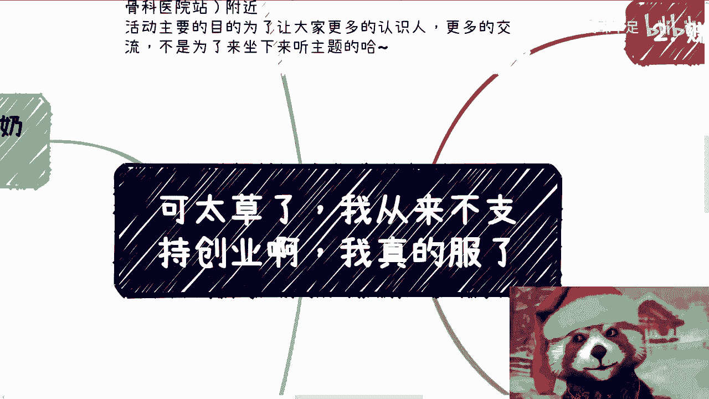
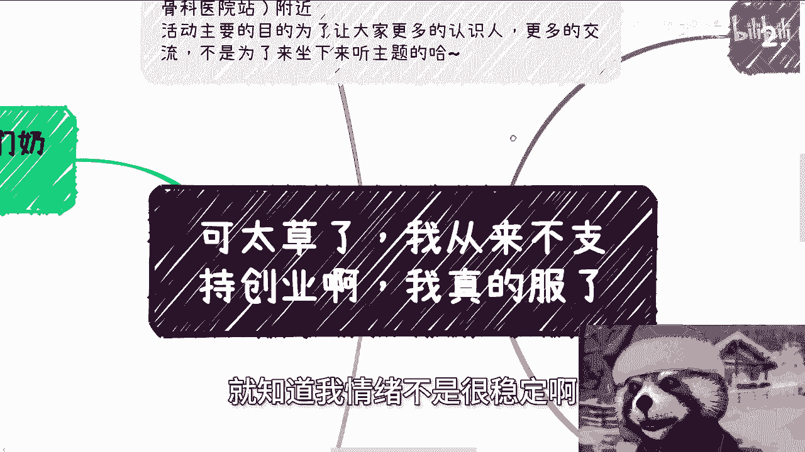
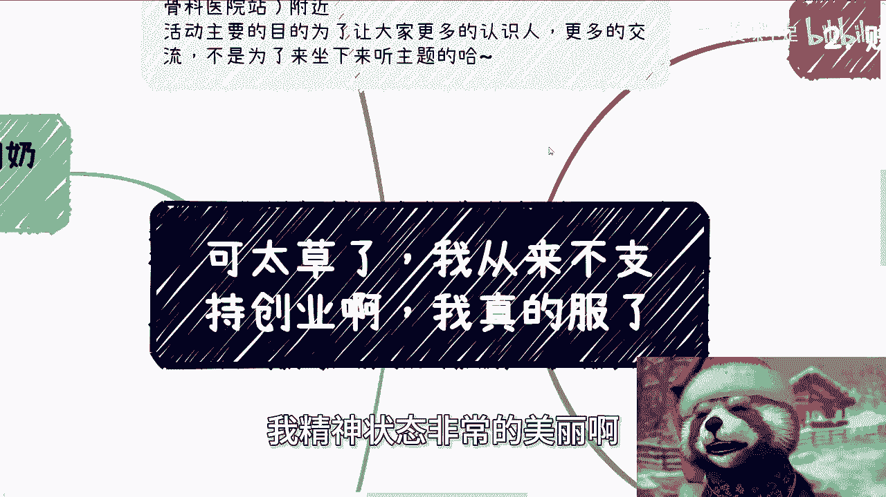
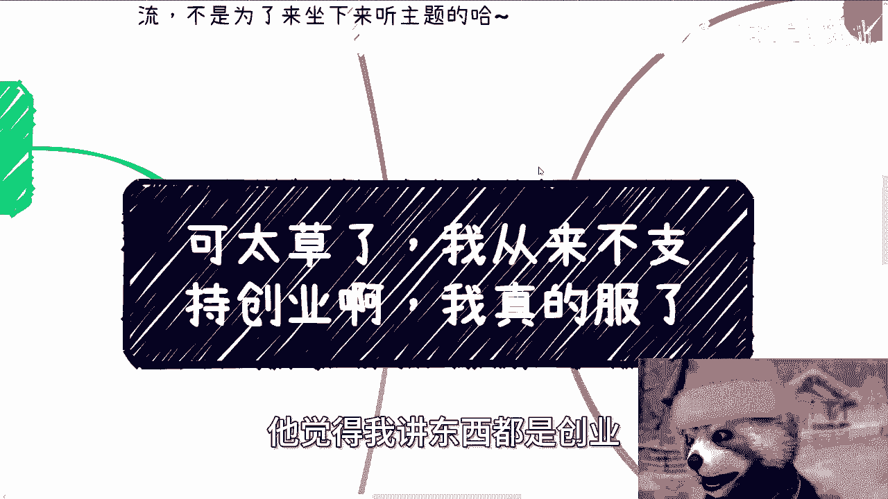
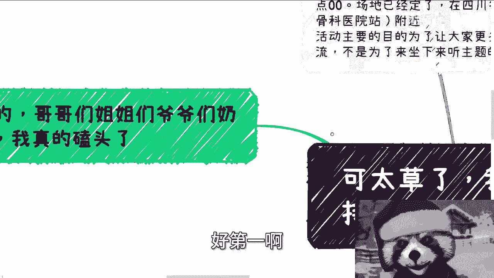
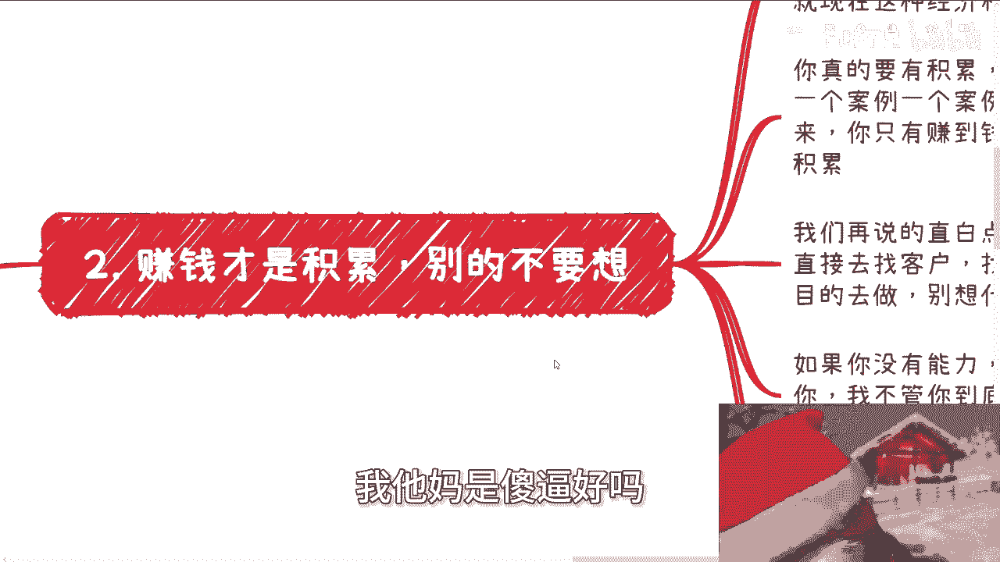
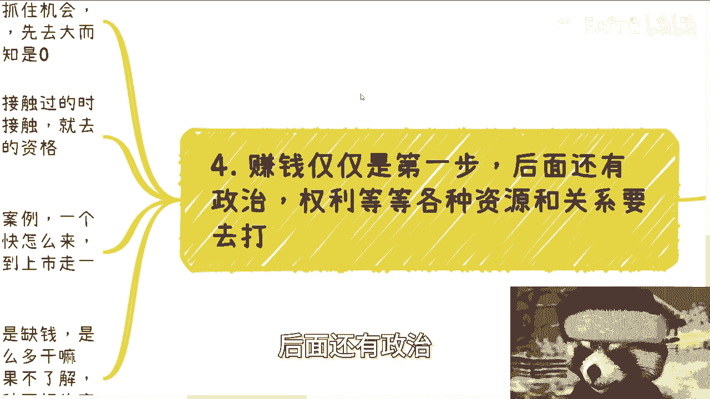
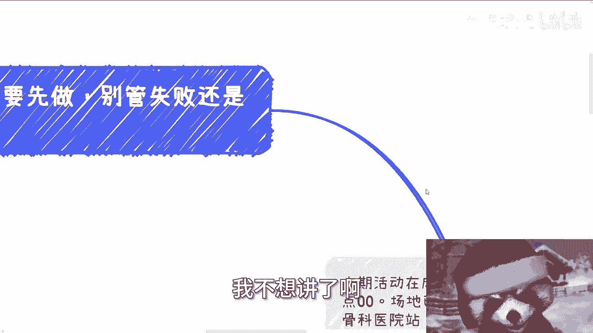

# 来自三体星的警告：不要创业不要创业不要创业 - P1 - 赏味不足 - BV1ui421i75F

好大家好，大家今天看到我这个主题，就知道我情绪不是很稳定啊。

情绪不是很稳定，我精神状态非常的美丽啊。

我尽量叫什么，就是克制一下我的情绪啊。

嗯嗯首先我先表达一下我的态度啊，我从来没有支持过创业啊，从来没有支持过创业，你明白吗，来自于三体星的提示啊，不要创业不要创业，不要创业啊，我不知道，当当然啊，就我觉得很多人可能对世界的了解过于单一化。

他觉得我讲的东西都是创业。

但他妈的并不是啊，首先额本期活动啊已经定了6月16号好吧。

也就没几天了，6月60六号下午啊。

01：30到六点呃，在成都成都的青羊区好吧，省骨科医院附近，活动的主要目的是为了让大家更多认识人，不是来交流的啊，不是来听主题的。

我跟你们讲啊，还有人跟我说，哎，陈老师这次这个主题，我感觉跟我没什么太大关系。

我就不来了，我跟你讲，你以后也别来啊，这其实就这么简单啊，好第一啊。

真的我跟你们讲，我给你们磕头了啊，我给你们磕头了，我视频说了这么多，为什么还会有人觉得我鼓励创业啊，我真的我我我说实话，我真的很想打开大家脑子。

看看里面装装装的什么东西啊，你们我跟你讲，你们到网上去找张图啊，很很好玩的，就左左边是那个呃大肠小肠啊，肠道右边是脑子啊，那它上面写了一句话啊，虽然长得一样，但装的东西不一样，对不对啊，我跟你们讲啊。

我从头到尾鼓励的是大家从自己角度出发，去摸索这个世界赚钱的规律跟方法，to c to b to g啊，你大学呃去大学也好，都是自己拥有自己的规律跟模式的，这些东西大家大学里面都是学不到的。

也不可能有人教，这也是我跟你们说，你们打破象牙塔必然要走的一条路，怎么学呢，就是我跟你们讲，直接去实践，直接去直接去实践，一边实践边摸索，就通过线下的社交去学习对吧，至于打工或者创业，这只是一种形式。

看你们自己的情况而定，你听得懂吗啊，如果你什么都没有，也没有什么积累，同时也很缺钱，那你就好好打工，你就先保证温饱，如果你有心在你打工的同时抓紧去摸索，我们上面说的这些东西，我我都说成这样子。

能明白吗啊如果你有钱，或者你能坑到投资人的钱，或者骗到别人的钱对吧，骗到那些投资人土老板的钱，OK那也行，那你就自己去干啊，如果你没有这个本事，或者你也没有这么多钱，那么你就别去想创业了，对不对啊。

但无论你选择打工或者创业或者别的anyway，各种各样的一些一些一些模式啊，本质上都是为了让你自己去能够从0~1，积累关系跟资源，让自己能够更多的去摸索跟了解，不同的客户的呃。

不同的这种客户画像的这个运作本质对吧，那么创业又没有积累啊，创业本身又是没有积累的对吧，你就去找投资，如果要说这样，你能我指的什么意思，我说创业你本身又没有积累的话，你就去讨找投资。

如果这样你就能找到投资的话。

那么他妈的全中国投资人早就破产了啊，我跟你们讲。

为什么我会讲这个主题，是因为已经不止一个人啊，拿着一个非常神奇的，要像幼儿园小朋友做出来的PPT来跟我说，我想去找创投，大哥们啊，姐姐们，你你爷爷奶奶们，你们到网，你们到线上到这个社会。

你们虽然活在中国，请你们到中国去了解一下中国的创投好吗，啊卧槽，你们要是这种PPT能他妈融到资啊，那我，那我就这么说，我他妈还在这边做这个视频，我他妈是好吗啊。

第二赚钱才是积累，别的你不要去想什么意思呢。

就是真的我跟你讲啊，我发现大家不知道怎么想的哦，你你你你你做一件事情，你也不是股东，你也不是老板，你就想这个有积累，他妈的跟你吊关系啊啊哎就想着有长远发展。

我跟你讲，就这种经济情况，你你们稍微去接一下社会的地气好吗，你们了解一下外面长什么样子好吗啊，你你但凡能够了解1%中国想要什么样子。

你跟我谈长远，俺妈怕不是脑子秀逗了啊。

你真的要是有有真的要有积累，那就去赚钱，赚钱怎么来，就是一个一个案例去做一个一个项目去走对吧，你要明白，我不管你是赚一块钱还是赚一个亿，你只有赚到钱了。

你只有帮对方赚到钱了，才叫积累啊，我们说过无数遍这句话了，我们再说的直白一点，就是说如果你有能力，那么你就直接去找客户，你明白吗，找到客户之后，你就直接一个一个项目的去做，你就我我就说所谓找甲方。

找有钱的那些主对吧，你要有能力你就去找你，别来跟我谈什么未来的发展。

没有什么未来的发展，你连第一步都没有做，你哪来的未来发展对吧，那如果你没有能力，那么你就找有能力的人或者团队去帮助你，你听得懂这句话吗，啊我不管你到底怎么隔离信息还是怎么合作，你是双两呃。

甲甲和甲方和乙方合作还是三方合作，还是四方合作，还十方合作，随便你啊，你的第一目的是先做，然后赚到项目合作的渠道费就可以了，钱赚到了你自然就有积累了啊，我话说到这个程度能明白吗，啊不要去想。

就说那陈老师，我想有积累，想你想个屁对吧，第三不要融资。

不要融资，不要融资，听得懂吗啊，if为什么啊，我跟你们讲实事求是来讲，一方面现在资本市场一塌糊涂，我还是那句话，你们但凡去接一下地气，你们就会知道这外面他妈什么样子对吧，第二你们大部分人没有能力融资。

你听得懂吗，融资是需要背书的，是需要有团队的，不是糊一个PPT出来对吧，你现在融资甚至是需要现金流证明的啊，投资人可能才有谈的意向，你听得懂吗，才才有谈的意向啊，那么我再强调一遍，简单来讲。

就是你如果没有别人没有的东西或资源，而这些没有的东西跟资源，是能给你带来客户或者现金流的啊，那么如果有，那你可以写一个胡一个PPT去博一下，我觉得没问题，那如果我刚刚说的你没有，那你就别去想这个事了。

你明白吗，不是说这个PPT改的多花就有用的哦，我发现很多人可能错误的理解我讲的东西啊，就是不是这个PPT怎么润色，不是这个PPT可能从哪个方向写，就能就就能拿到融资的，你能听得懂吗。

啊核心是你得有一些别人没有的东西，或者你能够有现金流啊，我再强调一遍啊，你千万不要有以上想法，以下的想法就是我找创投或者找投资人要钱，是因为我有了这些钱之后，然后去组建团队，然后去拓展客户。

那我他妈就奇了怪了，投资人是有钱没地方用，他为什么要给你投呢，啊，他如果来说这个钱是为了组建团队去拓展客户，他给别人投不香吗，他他妈甚至自己组个团队不香吗，他给你投脑子瓦特啦。

对不对，哎我就不明白啦是吧，就我真的发现很多人也不是应届生，也不是刚毕业出来，年纪也老大不小啦，对吧好第四，你明白啊，赚钱仅仅是第一步，后面还有政治。

还有权利，还有各种资源的关系和要去打，你懂吗，就是如果你们想赚钱，大部分人是没得选的，就是不要去关心什么方向，不要去关心什么行业，你抓住任何一个机会，任何一个行业的人都去聊，任何项目，都去聊。

你先大而全的去了解，因为大部分人对社会认知是零，在什么都没有的情况下面，你去筛选什么东西呢，你有资格筛选吗，啦对吧，你不要一开始自己什么都不懂，什么都没有接触过情况，下面说啊，我要去我就去接触。

我感兴趣的就去了解啊，不感兴趣我就直接跳过，你有资格吗，诶我就奇了怪了对吧，然后就是社会上你要积累的就两个东西，一个叫案例，一个叫头衔没了对吧，你我我觉得所有人尽快就去积累这两个东西，怎么快怎么来啊。

你你不要去在乎方式，而那那那就像我我我我就像你我，我本次这个主题说的，难道我们难难道还必须要从哦A轮B轮，C轮融资到上市走一遍吗，啊难道你还要再去筛选行业吗，你有这个资格吧啦。

诶我怎么我真的是他妈太操了对吧，我就说啊，如果对你们个体来讲，主要矛盾是缺钱的话，那就去赚钱没了呀，哪儿这么复杂的事情啊，就你们知道吗，很多人就拿胡一个PPT给我，就跟我说什么，哎我要不要注册我。

我要不要就是说去去融资啊，我要不要去让这个公司有什么积累，哎我要不要有有足够多的客户，哎，你先去赚到第一笔钱好吗对吧，你选择一个赚钱方式就去实践啊，这你你你你如果不了解，那就先去了解，你不要再去纠结。

哎，陈问我说陈老师，我现在到底打工还是创业。

哎我他妈奇了怪了，你有什么好选的呢，这是这是我们要解决的问题，不啦对吧，那最后一点就是什么都先做啊，别管失败还是成功哈，这个东西我不想讲了好吧，因为待会我还有个充电视频，你就放到充电视频里边。

我不想讲了啊。

好吧，就是就是我跟你们讲啊，你们有东西做，要有真正的东西，不是糊出来一个莫名其妙的什么什么什么什么，人家AI火了好，我也做A人家什么东西火了，我也做什么东西，你胡这种东西就不要来找我了，你找谁都没用。

你懂吗，哎呦，我真的真的觉得我，我感觉大家他妈活在不是一个星球上，你知道吗，好吧好吧，就这么着啊，然后成都活动啊，要报名的就是找呃找我报名好吧，了解详情的可以继续找我小了解详情，然后咨询的话呢。

职业规划，商业规划啊，股权期权啊，然后合同啊，白皮书或者别的别的各种东西你们想聊呃，想想有相关的这个呃这个困惑的，或者碰到一些相关问题的，你们整理好自己的问题和背景，我们再来走咨询啊，好还有一点啊。

还有一点就是找我咨询的，我本来说的就不多，该付要付钱就要付，不付就不要来找我好吧，不要给我拖啊，然后另外一方面，如果你们想什么通过咨询什么什么年入百万啊，什么什么马上就暴富，你们也别来，别来找我啊。

你们该去找谁找谁啊，该该被谁骗。

被谁骗。