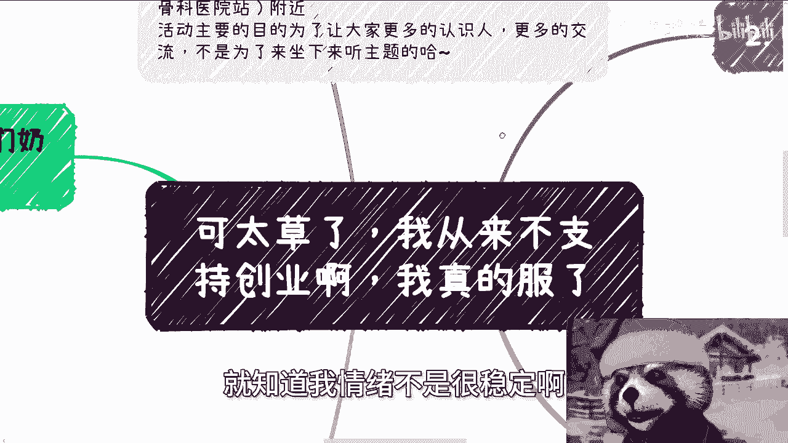

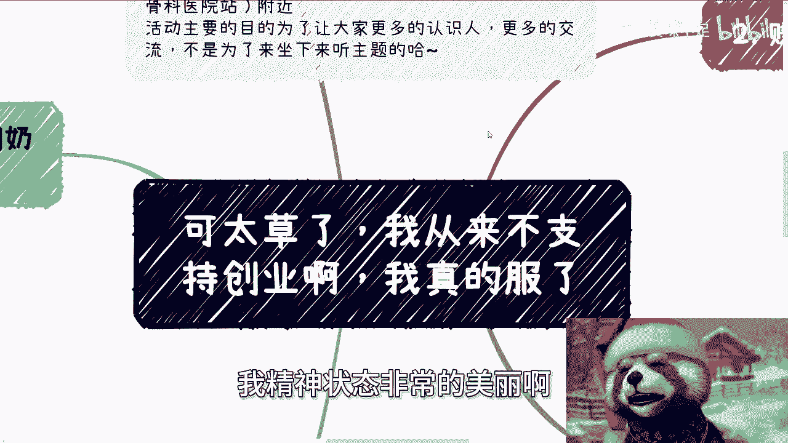

# 课程 P1：来自三体星的警告：不要创业不要创业不要创业 🚨

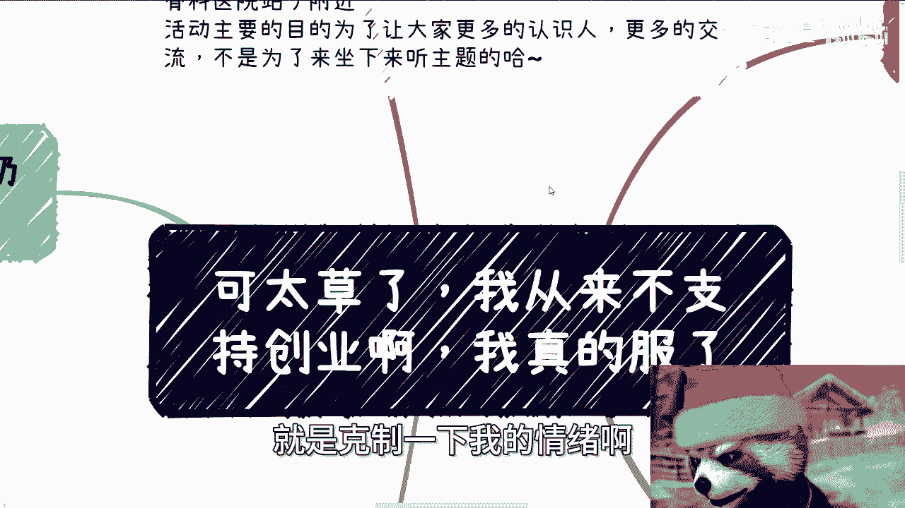

在本节课中，我们将学习一个关于职业与商业发展的核心观点：**不要盲目创业**。课程将澄清常见的误解，并阐述在当今环境下，个人应如何务实起步、积累资源与实现价值。我们将通过几个关键原则来构建清晰的行动路径。

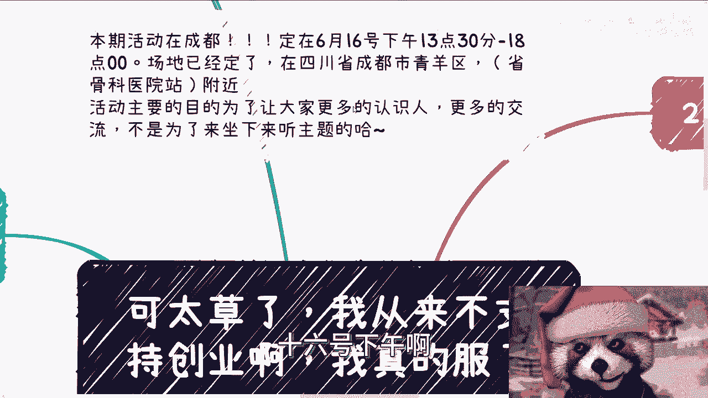

## 概述

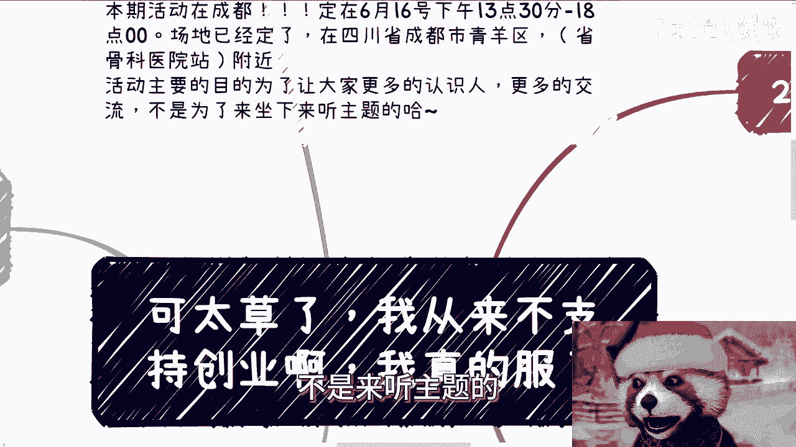

本节内容旨在纠正一个普遍误解：我从未支持过盲目创业。核心鼓励的是，每个人都应从自身实际出发，去探索和掌握商业世界的运作规律。无论是面向消费者（To C）、企业（To B）还是政府（To G），每个领域都有其独特的模式，这些无法在大学课堂学到，必须通过实践和社交来掌握。

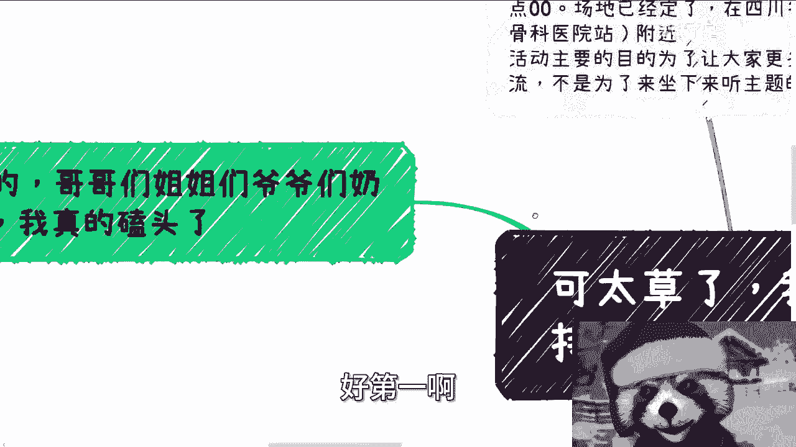

## 核心原则解析

上一节我们概述了课程主旨，本节中我们来看看支撑这一观点的几个具体原则。

### 1. 探索规律，而非形式

我从未支持过创业。我始终鼓励的是，大家应从自身角度出发，去摸索这个世界赚钱的规律与方法。打工或创业，仅仅是实现这一目的的不同形式。

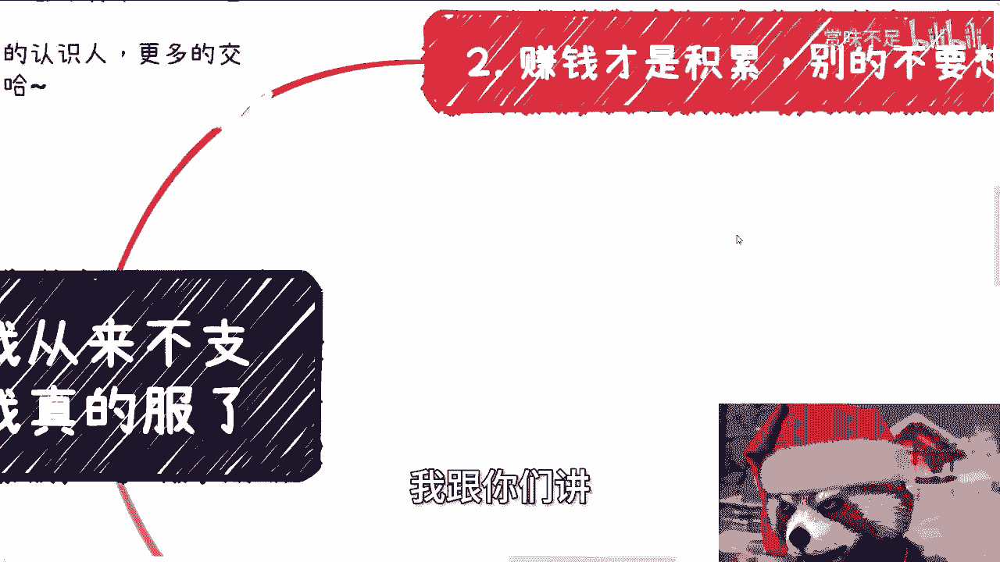

以下是选择合适路径的考量因素：
*   **如果缺乏积累且缺钱**：应优先选择打工，以保证基本温饱。同时，应在打工过程中积极摸索商业规律。
*   **如果有资金或融资能力**：可以尝试自己主导项目。若不具备这些条件，则不应考虑创业。
*   **无论选择何种形式**：本质目标都是从零到一地积累关系与资源，深入了解不同客户群体的运作本质。

### 2. 赚钱才是真正的积累

许多人错误地认为，参与一个项目或公司就能获得“积累”。但真正的积累源于创造实际价值并获得回报。

以下是关于积累的正确理解：
*   **积累的定义**：只有赚到钱，或帮助对方赚到钱，才叫积累。这需要通过完成一个个具体的项目来实现。
*   **行动路径**：
    1.  如果有能力，应直接寻找客户（甲方），通过完成项目来赚钱。
    2.  如果没有能力，应寻找有能力的人或团队合作，以赚取项目合作的渠道费为目标。
*   **核心公式**：**积累 = 完成项目 + 赚取利润**

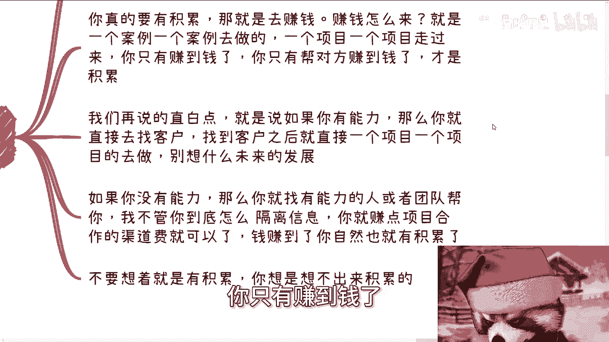

### 3. 不要融资

在当前环境下，对于绝大多数人而言，融资是一条走不通的路。融资需要强大的背书、成熟的团队，而不仅仅是精美的计划书。

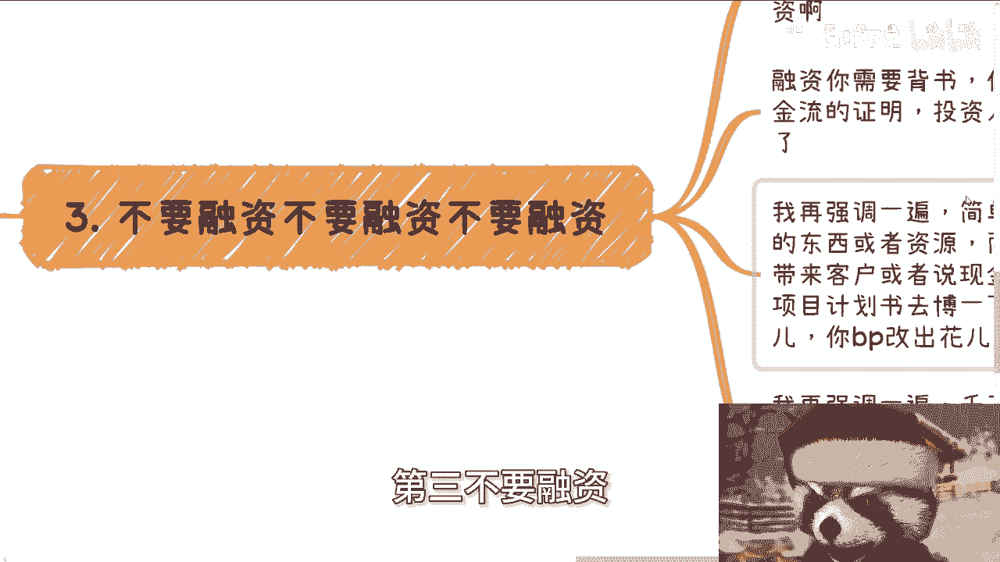

以下是不要融资的主要原因：
*   **市场现状**：资本市场环境严峻。
*   **融资门槛**：融资需要强有力的背书、团队，甚至已有的现金流证明。
*   **可行性条件**：只有当你能提供**别人没有的资源**，并且该资源能直接带来客户或现金流时，才具备融资的基本条件。
*   **错误观念**：不要抱有“先拿到投资，再去组建团队和拓展客户”的想法。投资人不会为这种不确定的计划买单。

### 4. 务实起步：案例与头衔

对于社会认知几乎为零的多数人，首要任务是打开视野、快速实践，而非空想和筛选。

以下是起步阶段的行动指南：
*   **放弃筛选**：在什么都不懂的情况下，没有资格对行业和机会挑三拣四。应大范围地接触各种人、了解各种项目。
*   **核心积累**：在社会上需要快速积累两样东西：**成功的案例**和**有价值的头衔**。
*   **主要矛盾**：如果个人主要矛盾是缺钱，那么一切行动都应围绕**赚钱**展开。选择一个可行的方式，立即开始实践。

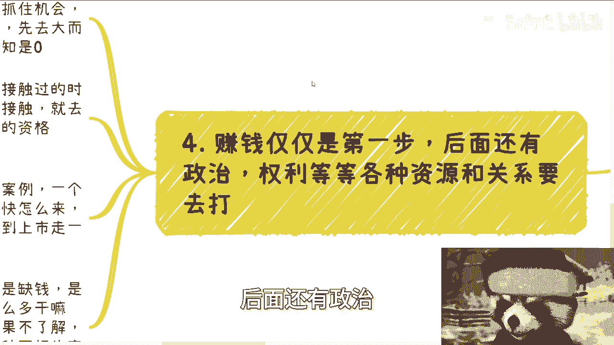

### 5. 行动先于一切

最后，也是最重要的一点：立即开始行动。在行动中学习，在试错中成长。

关于行动的唯一建议：
*   **立即执行**：无论选择打工、合作还是小成本试错，关键是先做起来。不要纠结于“打工还是创业”这种伪命题。
*   **杜绝空想**：不要炮制一个追逐热点、缺乏实质的“创业计划”。真正的行动源于你对某个领域有实际的理解和资源。

## 总结与活动信息

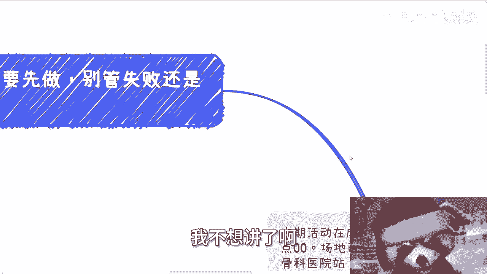

本节课中，我们一起学习了关于职业发展的五个核心原则：**探索规律而非形式**、**理解赚钱才是真积累**、**警惕融资陷阱**、**通过案例和头衔务实起步**以及**行动先于一切**。记住，目标是掌握商业规律并创造价值，而非拘泥于“创业”这个标签。

**成都线下活动预告**：
*   **时间**：6月16日 13:30 - 18:00
*   **地点**：成都市青羊区（省骨科医院附近）
*   **主要目的**：拓展人脉，结识更多朋友。

**咨询服务说明**：
*   提供职业规划、商业规划、股权合同等咨询。
*   咨询前请整理好具体问题与背景。
*   咨询为付费服务，请勿拖延。无法承诺“年入百万”等不切实际的目标。