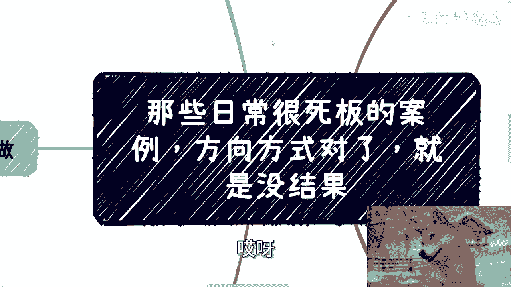
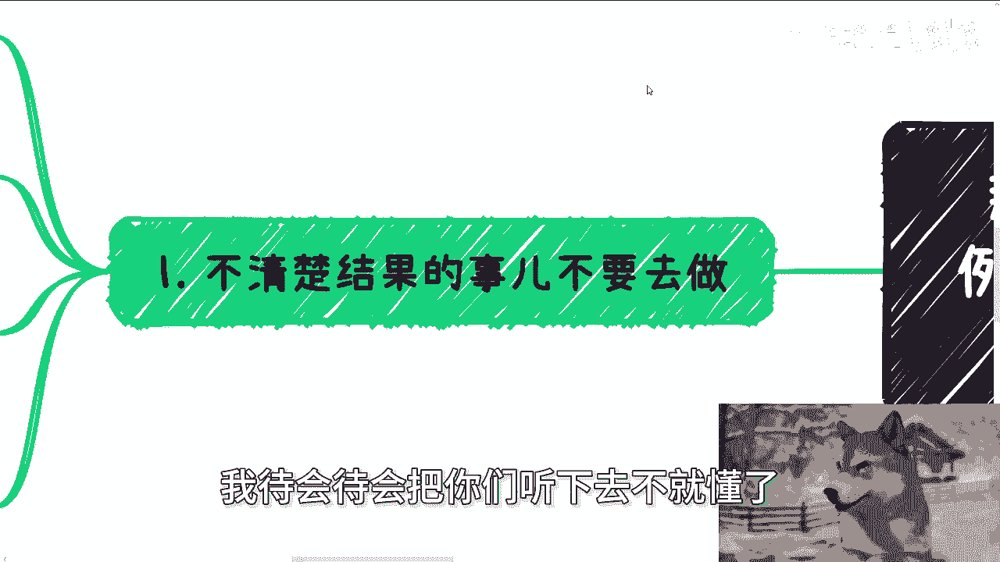

# 来说说日常很死板的案例，方向对了，但就没结果 - P1 - 赏味不足 - BV1MB46eWEzD

啊今天我们来讲的这个主题啊，也非常的有趣啊，就是这个日常呢有很多死板的案例啊，就是咱就这么说啊，从你们角度来讲，或者从大众角度来讲，方式方法都是对的啊，但是呢就是没有结果，或者来说就是呃被人拒绝啊。

或者怎么样子对吧，哎就这里面其实问题很简单啊。

我我其实我我待会待会把你们听下去不就懂了。

第一啊就是不清楚结果事情不要去做，这是我最近一而再再而三跟你们强调的，就是人呢啊，我觉得这是一种很神奇的生物啊，就是同一同一种类型的事情，你按照不同的模式去，你去问他啊，或者你去问他怎么思考。

他得出的结论是他妈不一样的啊，这就好像每次啊我就是只要碰到别人跟我沟通，就是事情的目的性不清楚的啊，当然啊我可以说几乎他妈跟我沟通下来，目的性都是不清楚的啊，我就会跟他们打比喻。

否则我会发现你跟他们就事论事讲啊，他理解不了啊，就比如说有些人说我要做自媒体，我要做自己的项目，我要跟国国企央企合作，我要跟党媒央媒合作对吧，我要跟政府合作，叭叭叭叭，反正说一堆啊，我说你赚到多少钱。

你能赚到多少钱，清楚吗，不清楚你怎么变性，清楚吗，不清楚，那那我说你不清楚，那你大概一个范围知道吗，不知道啊，那我说你是不是不清楚，先搞清楚呗，然后我每次这么说，他们都会回答，我一般都这么说。

他说哎那我就先做嘛，做了看看嘛对吧，我说行啊，好没问题啊，没问题好，我然后我就问他们，我说要不这样吧，你给我100万，然后我就问你，你是不是一定会问我收益对吧，比如说陈老师年化多少，对不对。

然后我就回答你们收益不清楚啊，走一步看一步呗，我就问你，你给吗，你给不给嘛，对不对，我我我说我都不用问，你们肯定不给，你们肯定觉得他妈的是个骗子，那不给就对了呀，那他妈逻辑不是一个道理吗。

那为什么上面这些不清楚事情不清楚。

结果事情你们要去做呢，我都搞不懂了呀是吧，完全不理解呀。

啊第二我们就拿两个事来讲，一个是产品，一个是沟通。

对吧啊，你比如说海报，也就是我们日常说的产品或者服务，产品或者服务，不管是什么，他肯定是有个主体或参与方法对吧，你就你就比如说我邀请过来个嘉宾，那这个嘉宾总有个主体方法，对不对啊。

那么当然大概率这个主体方肯定不是我们，因为我们自己没有这么大的吸引力啊，那么产品或者服务本身重要吗，其实不重要，重要的是你你的这个内容和你的这个主体，怎么吸引客户，所以我们一直说啊。

这种产品或者服务要么高大上，要么就接地气，你两者总归得要有一个啊，那么我们接下来就拿海报或者拿给学校的服务，或者给高校的服务啊，做个例子啊，比如说海报对不对，那你海报上一定会有各种主题嘛，对不对好。

那么你要么主题的分享嘉宾就是拼多多啊，啊京东啊，字节啊啊比如说什么那个叫什么啊，万象啊啊那个那个微软啊，国内外各种大额，国内外国内外各种大厂啊，对不对，然后比如说你的合作单位，指导单位，区政府啊。

省政府啊或者省协会啊，对不对，那也就是说你要么就是走高大上路线，要么就是走非常接地气的，就是客户画像，就是那些大学生或者牛马对吧，然后你比如说你说好，我的内容啊，不是来讲什么行业分析的这种东西。

他妈的别人听了也也也没什么卵用啊，那么你说我可能这个内容呢，就是给大家啊提供副业机会，或者给大家聊聊这个啊普通老百姓怎么赚钱的，对不对，那么我看到过很多人做的海报，都是基于这两者之间的。

就是你说高大上吧，貌似勾不上，你说接地气吧，内容对于普罗大众看上去又有点虚好了，那说谁会来明白吗啊，这是我们教内容上面啊，然后第三我们继续来讲啊，比如说你给学校额那个服务对不对，那么你你你你想啊。

你的学校客户画像是谁，要么就是学校本身，要么就是学校里面的学生，对不对，好好，那么我们往下讲，然后去找学校谈，那么你说的直白一点，或者用别的这个政府相关资源去压学校，或者来说是让学校觉得哎。

我跟你之间除了这这次合作以外，还还可能有些别的合作，对不对，那么那么那么这是一种，要么你就直接一点，你能提供什么，比如说解决学生就业，你不要虚啊，比如说你说我，我今年我就能提供3000个岗位对吧。

明确的数量那也行啊，对不对，你要么就索性跟学校没有关系，你就提供给学生服务，那么学生是什么类型群众了对吧，那那那那你要我说学生，大学生尤其是大学生在中国的这种范围里面，那他妈的基本上就是的代名词啊对吧。

那你那你你说谈恋爱对吧，你提供给他们谈恋爱，你提供给他们装逼，你提供给他们攀比的服务，对吧也行啊，对不对，那当然不是我说这些大学生，是他妈大学很多大学生表现出来，他妈就是傻白甜啊，你能你能怎么办呢。

对吧，那就是我说的接地气，你别搞那种什么上不上下不下的证书，或者说比如说什么技能培训，技能服务，还是那句话，你提供这些东西，学生关心吗，不关心学校，关心吗，也不关心，那你做什么呢对吧。

那当然这只不过是产品跟服务方面的，就是你写的，就说白了你写出来的内容，你写出来的东西自己要多看看对吧，你每个不同的主题或者提供的这种服务的内容，要么就是高大上的，要么就是接地气的，你别高不成低不就啊。

那么说白了我看到现在很多服务是什么，就是他他给你的感觉就是他可能想高大上，但是装逼装不起来啊，又不想让别人感觉太low对吧。

那这种包装往往就是我说的，最后谁都吸引不了。

啊对吧啊，那么第四我们继续来说沟通啊，就如咱们说的很多事要做，要做的话做全套，比如说你要做个活动找别人合作，比如说你要卖个服务跟学校合作，或者来说你要做个服务找政府合作，那很多人真的去做了。

但是他做的时候非常死板，那简单来讲就是说他跟别人介绍，表达的意思就是说哎我是谁，我有什么我想找你合作，大哥我就这么问你们，你们换位思考一下，如果你是政府，你是高校，你是那些流量方或者你是合作方。

有人今天找你跟他说，他有什么想找你合作，你会合作吗，对不对，你肯定第一反应是什么，他妈的大哥，你谁啊啊，我凭什么跟你合作啊，是不是，那我们就说社会上别人之所以会合作，一定是有一个东西在吸引对方的。

咱不管对吸引对方的是现在还是未来，你总归得有个东西吸引对方吧对吧，那么我们就这么想啊，这个社会上你就像你去找别人合作，无非就三种可能性，一找别人合作流量，二找别人要钱，三找别人要名，对不对。

也就是所谓的背书，无非就是三个东西，哎你们仔细想想看，就这三种，别人基本上都是所谓的甲方，或者所谓的主动权的人哦，你不给别人一些别就是另外的吸引力，谁跟你合作啊，对不对啊。

你跑上去就说哎我我有什么产品啊，我有什么服务啊，我我做了个什么活动对吧，或者我想做一个什么活动，我已经筹划好了，看似你有东西，但是别人在乎吗，他不在乎啊，对不对啊，你就我们打，比方说你就拿我来讲呃。

我是比如说我是拥有流量的，或者我是有钱的，或者我是能给你们背书的，然后呢你们跑过来说爱创商，我想做个什么东西啊，我我就来找你合作，然后呢那请问我能得到什么呢，哦哦陈老师，我能给你分润哦。

能跟我分润怎么调啊，我缺你这点钱啊，对不对嘛，你你你们想先说逻辑要想想清楚啊，这逻辑走得通吗，走不通呀，对不对，不是说你有东西，你给别人带来钱就一定要合作的，没有这种因果关系的，对不对。

所以说当我们要去吸引别人合作的时候，我们一定要有些别的东西啊，那么这就是我们说的第五点，服务跟产品，它只不过是一个撬动点，你需要别的吸引点，你明白吗，你比如说找流量，你就得告诉别人啊。

我不单单是一个产品或者是一个活动啊，我其实就是说背后找了啊，有政府补贴，有资方啊，可以帮助大家薅羊毛对吧，可以帮助来的人更好的出海，可以帮助来的人更好的建立关系对吧，怎么样怎么样好。

我这边我就随便举个例子啊，我的意思是你们除了你们的产品跟服务以外，你们要找到一些别的撬动点，你别什么都不说，什么都没有，就单凭你说你有一个会议或者有一个产品，谁来合作啊，能听懂吗啊，另外就是你找高校。

你找政府也是一样的，你要告诉他们，你的事情的长期规划，何其商业价值是什么，你别介绍完了之后，让别人感觉你就是一个一锤子买卖，然后怎么赚钱的，也不知道谁来合作呢，对不对，那我们又来打个比方。

你比如说我是高校，我是政府对吧，你跟我说哎陈老师，我们这个能做一个数字经济的活动啊，我们能做一个比如说直播电商的活动啊，那我们希望跟你合作，那我还是那句话呀，第一我为什么要合作，我不太明白。

第二我合作了能赚到钱吗，你钱哪里来的，你跟我说哦，我们分门票，那我就问你，你能招到多少人，你不知道，你说哎做做看哎，那他妈怎么合作嘛，对不对，你你你简单往下想两步就想得清楚怎么合作嘛，有吸引力不了对吧。

我跟你们说啊，就我一开始开场时候说的，我说我真的觉得大家需要去思考一个问题，就是我认为啊我真的是这么认为的啊，就是这些事情本质上应该是一个普通人，正常人都应该想得到的，当然啊我我我说大家能不能做得到。

以及能不能落地，咱再说啊，但是这个逻辑我认为应该是普通人，一个正常人应该想得到的，但是基本上现在很多人脑回路都是缺一半的，你们发现没有，那那我觉得我我我觉得你们得思考一个问题，这问题到底出在什么地方。

对不对，就是就是我们做一个事情。

难道不应该把整个逻辑闭环想明白了再做吗，而现在的所几乎所有的人做事情，都是只有前半段，没后半段的，就像我刚刚说的，他找别人合作，别人就在想怎么赚钱对吧，然后他就问他，哎那那那你变现逻辑是什么。

你跟他说啊，我们我们可能分门票，分赞助，对没有错，那请问你门票哪来赞助，哪来，现在有合作方吗，一问三不知，哎，我就很奇怪，这这个到底这种这种思思考逻辑怎么出来的。

就是我我真不是说我想把问题归结于应试教育，我也不是把想把问题归结于比如说家庭教育，就是我实在是觉得这种东西自然生长的人类，他是不可能不知道的，之所以这么广大人群都不明白。

我只能认为这是应试教育教育出来的后果，那还能有什么东西呢，没了呀，对不对，对吧，所以说就是说很多时候，你你当然你们举一反三啊，我不可能把每个角落都讲明白嘛，对吧，就是很多时候很多事情都是一样的。

就是你看似你做了吗，做了你看似你准备了吗，也准备了然方式方法对了吗，也对了，但是你会发现很多人不合作呃，但但你换位思考一下，其实你你放到对面思，你如果放到对面位置上面，你也不合作对吧。

但是这个问题就想不明白，你知道吗，就就我就我也觉得很奇怪，啊好吧，反正你们想想吧，再想想啊，行啊，基本上就这么着，然后嗯职业规划，商业规划，你们工作上面啦，副业上面啦对吧，合同啊。

包括跟找别人合作啊等等等，反正就是类似于像这种问题，你们觉得比如说要走的通的，但是其实走不通的哦，那么你们想不出来为什么的，那你们可以整理好对应的问题跟个人背景好吧，你们可以呃。

