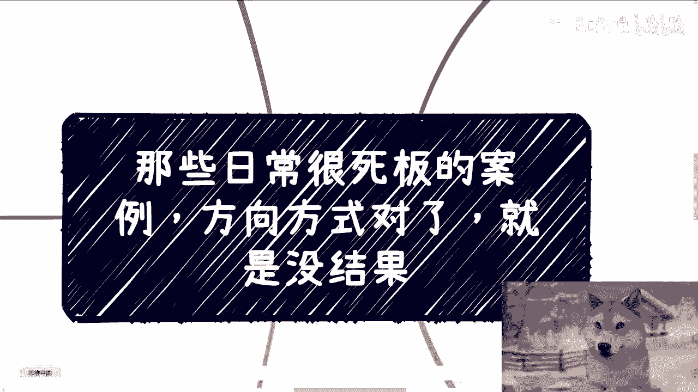
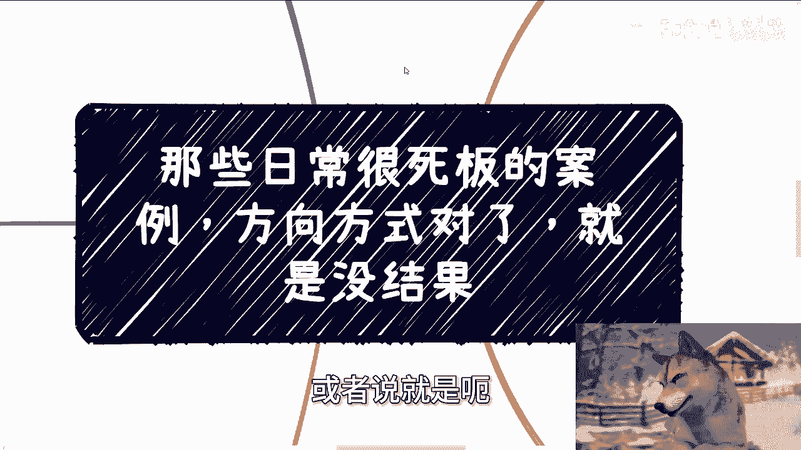
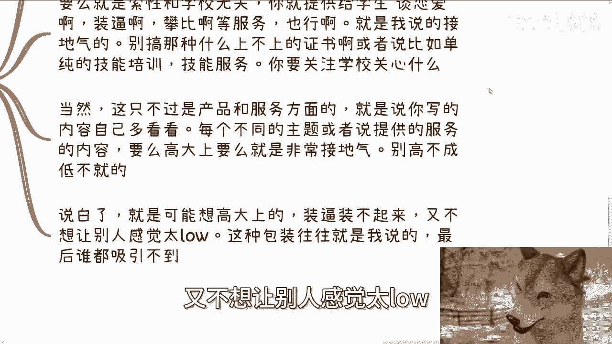
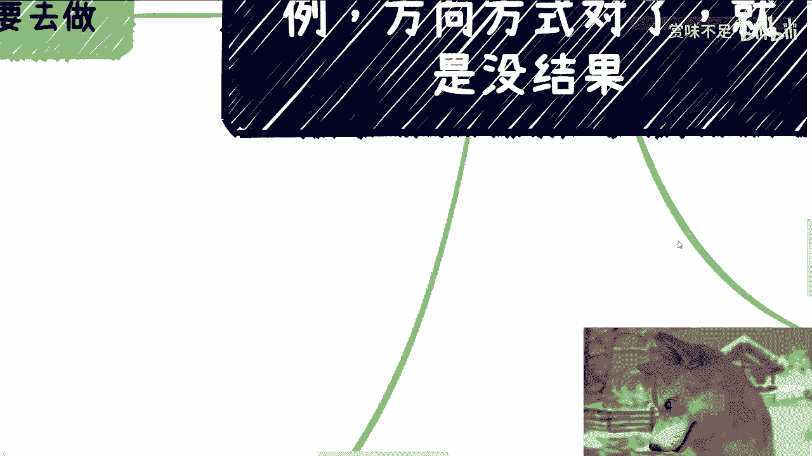
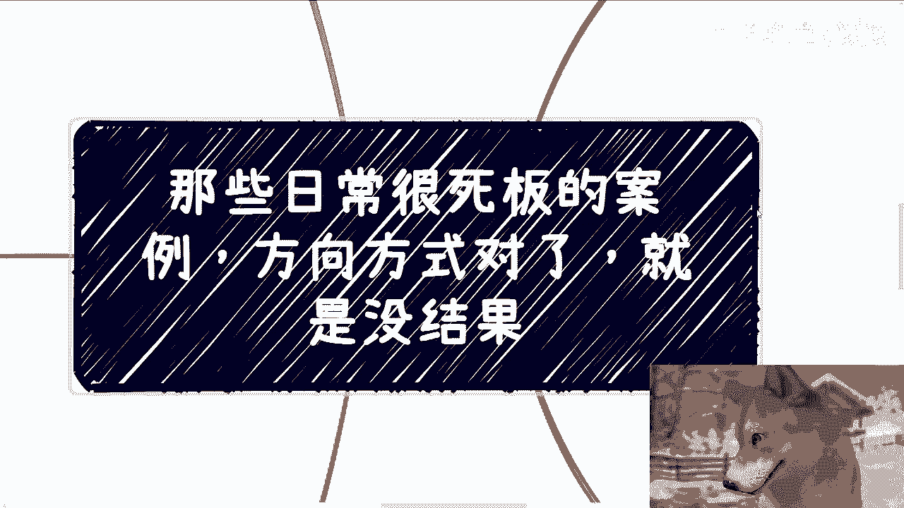

# 课程 P1：方向正确却无结果的死板案例解析 🧩



在本节课中，我们将探讨一个常见的商业与沟通困境：为何许多事情看似方向和方法都正确，但最终却无法取得预期结果或遭到拒绝。我们将通过分析具体案例，揭示其背后的核心逻辑缺失，并提供清晰的改进思路。


---

## 一、 核心原则：结果不明确，行动无意义

上一节我们提出了核心问题，本节中我们来看看解决问题的首要原则。

**第一点：不清楚结果的事情不要去做。** 这是需要反复强调的原则。人类在处理同类事情时，若采用不同模式提问，往往会得到截然不同的结论。

例如，当有人表示“我要做自媒体”、“我要与国企合作”时，若追问其具体目标（如“你能赚到多少钱？”），对方往往回答“不清楚，先做做看”。这种思维存在根本矛盾。

我们可以用一个比喻来理解：若我向你索要100万投资，当你问及收益时，我回答“收益不清楚，走一步看一步”，你绝不会投资，并会认为我是骗子。**逻辑公式**可以概括为：


**`行动` 若缺乏明确的 `预期结果`，则 `成功概率` 趋近于零。**


既然不会为不清楚收益的投资买单，为何要对不清楚结果的事情投入精力？这完全不符合逻辑。

---

## 二、 产品与服务的包装陷阱：避免“高不成低不就”

明确了目标导向后，我们来看看具体执行中的第一个常见问题：产品与服务的包装定位。

无论是实体产品、服务，还是活动海报，都有一个主体或参与方。其核心不在于产品本身，而在于**内容与主体如何吸引目标客户**。

以下是产品/服务包装的两个有效方向，必须二选一：

1.  **高大上路线**：主题或合作方具有强大品牌背书。
    *   **举例**：分享嘉宾来自拼多多、字节跳动、微软等国内外大厂；指导单位是区政府、省协会等权威机构。
2.  **接地气路线**：内容直击目标客户最朴素、最直接的需求。
    *   **举例**：面向大学生群体，内容提供副业机会、聊聊普通人如何赚钱；服务提供恋爱社交、满足虚荣心或攀比需求。

许多失败案例的包装都卡在两者之间：既不够高大上，无法建立权威信任；又不够接地气，对普罗大众而言内容虚浮。这种“高不成低不就”的包装，最终无法吸引任何一方。

---

## 三、 沟通协作的死板模式：缺乏“吸引力杠杆”

产品定位清晰后，下一步就是对外沟通与合作。很多人在这步表现得非常死板。



假设你要举办活动、销售服务，需要与学校或政府合作。死板的沟通模式是：“我是谁，我有什么，我想找你合作。” 换位思考，作为被请求的一方，你的第一反应会是：“你是谁？我凭什么跟你合作？”



社会上的合作得以达成，核心在于存在**吸引对方的点**。你寻求合作，本质是向对方索取以下三者之一：

1.  **流量**
2.  **资金**
3.  **名誉（背书）**

对方通常是掌握主动权的“甲方”。如果你不能提供**额外的吸引力**，仅凭“我有一个好产品/好活动”，对方没有理由合作。

例如，你找一位有流量的人合作，说“陈老师，我们合作办活动，我给你分润”。对方可能根本不缺这点钱。**`拥有产品` 并不直接等于 `具备合作吸引力`。**

---

## 四、 构建合作吸引力：寻找核心“撬动点”

因此，我们需要超越产品本身，构建更具说服力的合作提案。

**第五点：产品与服务仅是基础撬动点，你需要发掘其他核心吸引力。**

你需要告诉潜在合作方，除了这个产品/活动，你还能带来什么额外价值。例如：

*   **寻求流量合作时**：应强调活动背后有政府补贴、资方支持，能帮助参与者“薅羊毛”、拓展出海渠道或建立高端人脉。
*   **寻求高校或政府合作时**：必须阐明项目的长期规划与商业价值，避免让对方觉得这是一锤子买卖。需要清晰说明资金从何而来（如门票、赞助），并对其规模有合理预估。

如果对方问“变现逻辑是什么？”，你回答“分门票、拉赞助”，但被追问“门票和赞助从哪来？目前有合作方吗？”时却一问三不知，那么合作自然无法推进。

**核心行动逻辑**应是：
```plaintext
1. 定义清晰目标（预期结果）
2. 设计完整闭环（如何达成结果）
3. 准备多重吸引力（为何别人要帮你达成）
```
而许多人的思维只有第一步，缺少了完整的后半段逻辑。

---


## 五、 总结与反思

本节课中我们一起学习了为何“方向正确却无结果”。我们剖析了从目标缺失、包装错位到沟通乏力的完整链条。

**根本问题在于思维闭环的缺失**：做事只准备了“前半段”（我有什么，我想做什么），却没有想清楚“后半段”（具体目标是什么，如何实现，为何能吸引他人参与）。这种思维方式导致行动看似正确，实则缺乏成功的根基。

这或许与长期习惯于执行确定指令，而非自主设计完整商业逻辑的思维模式有关。在职业规划、商业合作、副业开拓中，请务必用完整的逻辑闭环审视你的每一个计划。

---



**后续思考**：如果你在合同谈判、人际合作、项目推进中遇到类似“看似走得通，实际走不通”的困境，且想不明白原因，建议系统整理具体问题与个人背景，进行更深入的复盘分析。