# 来谈谈“用心做好事” - P1 - 赏味不足 - BV1dj411D7ws

好啊大家好啊，我从杭州回来了是吧，这个今天呢，我没有给这个小熊猫带任何的装饰啊，是因为今天这个内容比较严肃啊，我觉得我要认真说一下这个问题，首先呢我很感谢啊私信这个给我啊，来描述啊。

来提到了有这么个问题啊，他说这个吕老师啊，这个我有一个很喜欢的up主啊，讲了一个内容说什么呢，就说啊他讲了一个视频叫做用心做好事啊，然后转给我了啊，我大概也看了一下啊，拖了一下，然后呢他就跟我这么说。

他说吕老师啊，我觉得他是呢我很喜欢的一个up主啊，你也是我很喜欢的up主啊，那么我希望你也来谈一下这个事啊，首先呢是这样的啊，我是一个资本家，那么对于我来讲呢，所有的那些修饰词我都不管啊。

跟我来讲没有任何关系，也就是说，也就是说啊这个你是不是喜欢他，我不关心你是不是喜欢我，我也不关心，但是我的确很感谢你，能够给我提供这么一个主题啊，我在今天回来的高铁上，我也仔细想了一下。

我觉得哎这主题的确不错啊，但是在这个上面呢，我得跟大家一开始先说一下，这个视频很有可能发不出来，是因为这个视频里面内容相比我以前内容来讲，敏感的多的多的多的多的多啊，好首先呢是这样子的啊。

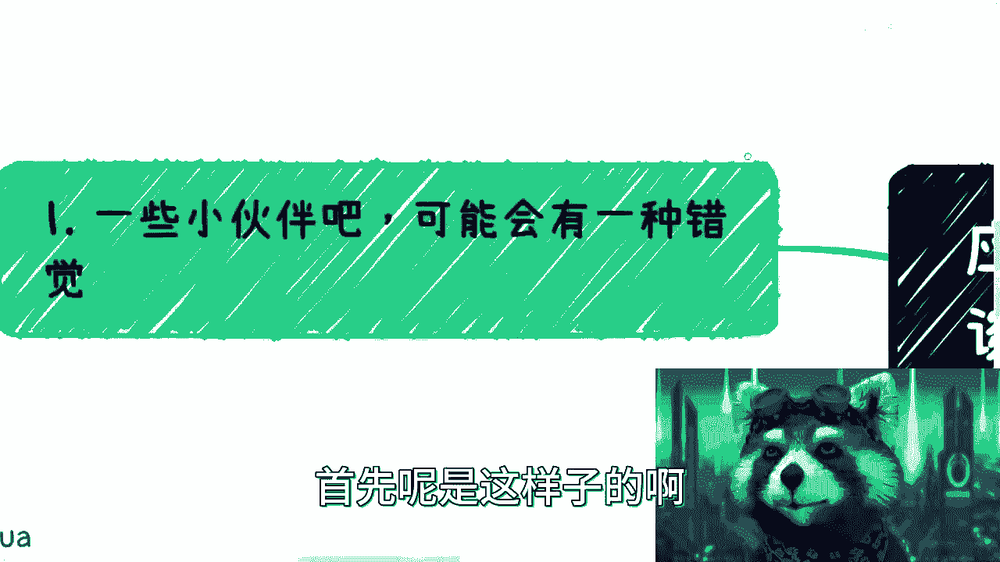

经过到现在为止的一些小伙，有些小伙伴啊可能会有一些错觉，什么叫错觉呢。

就是很多人看了我一些视频啊，觉得吕老师的观点与今天的主题是反过来的。

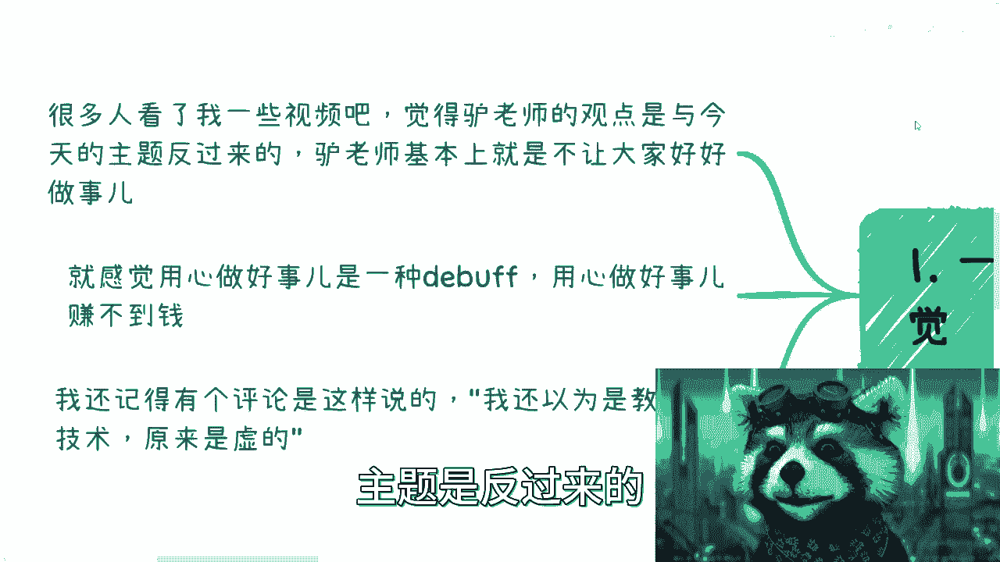

就是吕老师的所有视频基本上都告诉大家，不要让大家好好做事啊。

好像就我一直跟大家讲，不要脚踏实地去做事一样的啊，这是第一点，第二点呢啊就说我这个视频呢，就好像搞得大家啊，这个用心做好事是一种debuff啊，就是那种这个用心做好事赚不到钱啊。

这个你不要用心做好事是吧啊，这是第二点，第三点呢，他说呃我还记得啊，评论区有人这么说过，他说我看到这个标题啊，点进来我以为是实战这个技术啊，原来是虚头巴脑的啊，我跟你们这么说。

我以前呢是很希望所有人都能够认可我的啊。

我碰到这种观点呢，我可能还想反驳两句啊，这个以证明一下自己对吧，但现在作为一个蛤蟆区up主，大家应该也知道对吧，我现在没有这个兴趣爱好，我现在兴趣爱好就直接拉黑删除，没这么多屁话，中国这么多人。

全球这么多人啊，我们每一个人你们也好，我也好，我们想要让任何一个人，想要让所有人理解，我们不可能啊。

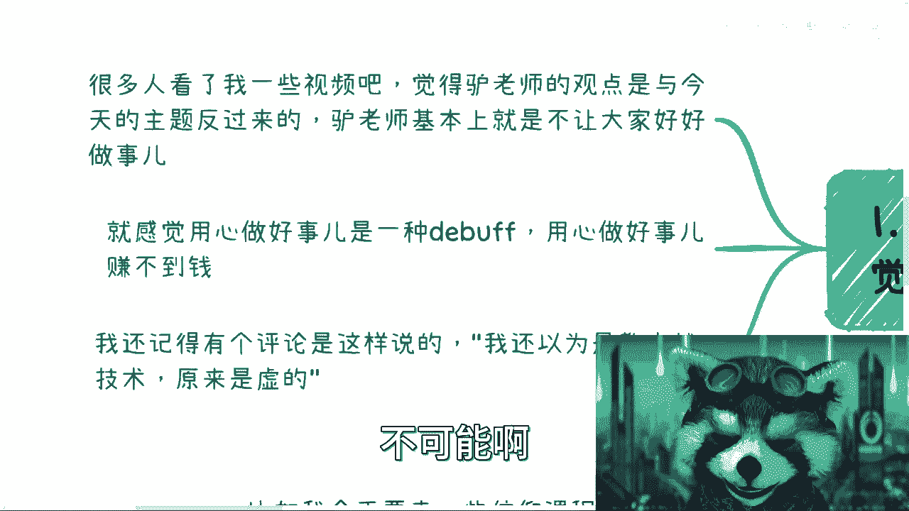

跟他们逼逼，没什么好逼逼的啊，好那么前期这个我已经讲完了啊。

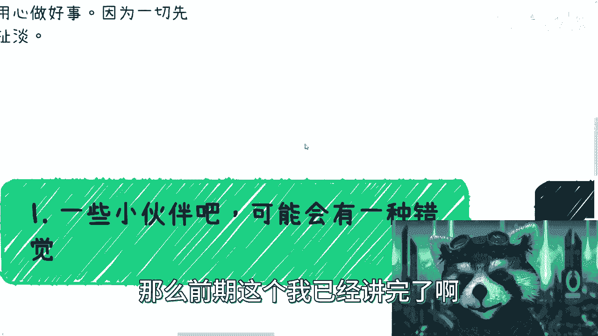

接下来就是全程的敏感啊，我就不知道能不能发出来。

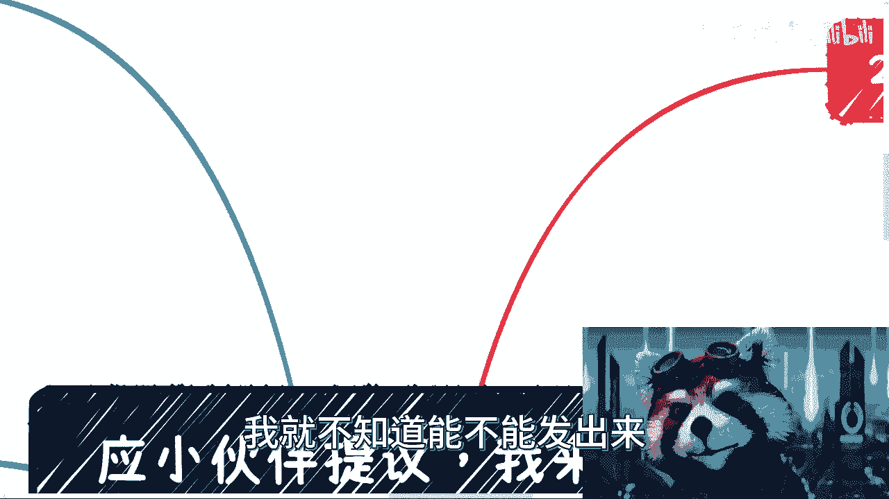

首先按照我一贯作风对吧，先定义啊，什么叫定义呢，首先啊什么叫用心，用心本身取决于你的出发点，你今天想拯救苍苍生苍生对吧，你要做慈善啊，你去用爱发电，我觉得这可以用算用心啊对吧。

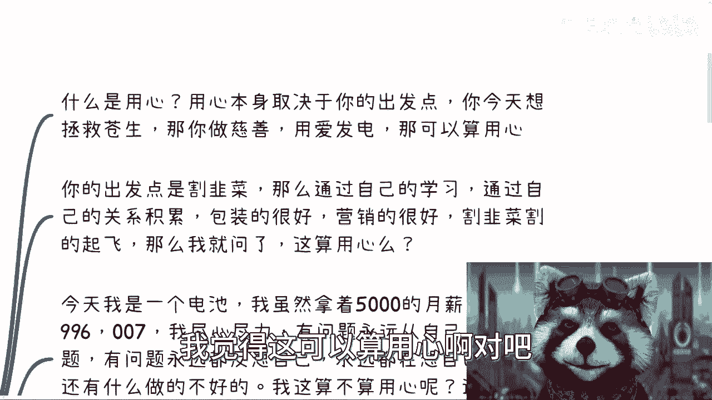

没毛病啊是吧，那你今天啊出发点是割韭菜啊，那么我就这么跟你讲啊，那么你通过啊你自己的刻苦努力啊，通过你去找传销盘资金盘啊，通过了你拜师学艺啊，通过了自己的关系的这个积累啊，通过了这个这个包装啊。

通过了营销，你把一个一块钱的东西啊，成功的卖出了1万块钱，同时割了1万个人对吧，你赚了一个亿啊，赚了一个小目标是吧啊，你割韭菜割得起飞，那我就问你告诉我这他妈算用心吗啊，你们哪个人敢他妈跟我说。

这不算用心，我敢说这他妈比你们美，比你们99%的人都他妈用心，对不对啊，用不用心，你们要我觉得我们要有这么一个用心，我们早就成功了，是不是啊，第三个，今天我是一个电池，我虽然拿着5000的月薪对吧。

但是我996007啊，我尽心尽力，我有问题从来都是从自己身上找问题，有问题永远反思自己对吧，永远都在想自己是不是有做的什么不好的对，这就是我对我说的，就是我自己啊，我以前就这么个傻样子，是不是啊。

我就这么说，我就问你，我算不算用心，你不要跟我说有的没的啊，我现在就是选择题用或不用用不用对吧，那我算用心还算用命呢，对吧啊好那么接下来啊网络上大家都看到了啊。

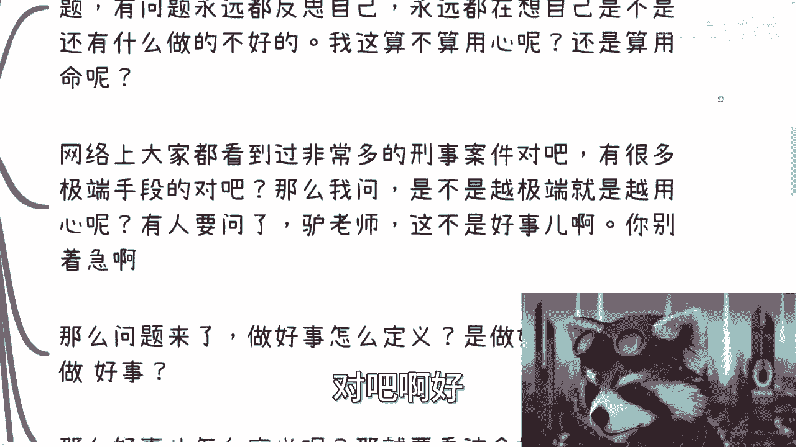

非常多的这个刑事案件是吧，这个过多的就不去提啊，很多很多你们自己去对吧，日常都能看到东方110对吧，什么东西啊，有很多极端手段对吧好，那我就问，我就问是不是这些里面越极端的手段越用心呢。

你们回答我看看是不是啊，你敢说不是吗，那有人要问了，哎有人要说了，哎呀吕老师，这不算好事对吧，这叫做做好事对吧，你别着急，我跟你讲，你别着急。

别着急，慢慢来，问题来了啊，做好是怎么定义，是做好空格式呢，还是做空格好事呢，哎我我不知道，哎我还真没有明白，我单纯从那个up主的主题上，我是真看不出来啊。

但是我看他的内容，我大概拖了一下嘛对吧，我看他的内容，他好像指的是一部分是前者啊，好像还有一部分也是后者啊，我也分不清楚啊，好那没关系啊。

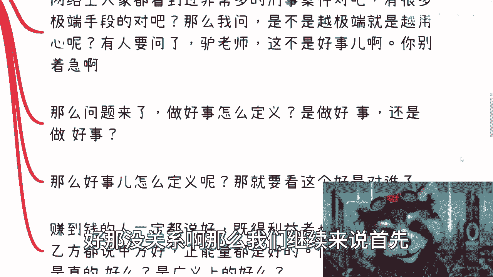

那么我们继续来说，首先对吧，我觉得做好一件事情，他跟用心本身还是能够串联在一起，就关联在一起的，那我暂时就不去提了，不重复去说了，主要的还是说做一件好的事情。

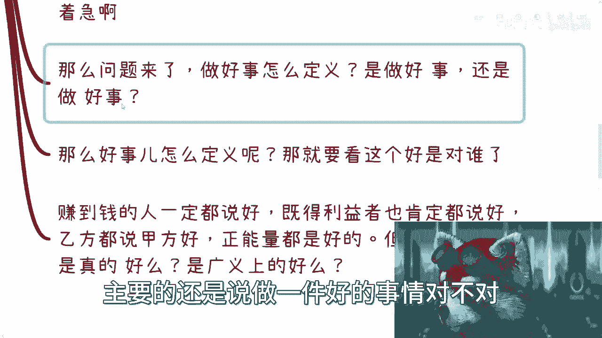

对不对，好那我就请问好的事情怎么定义呢，啊怎么定义啊，这要看这个好是对谁了啊，你看啊赚到钱的人一定说好吧对吧。

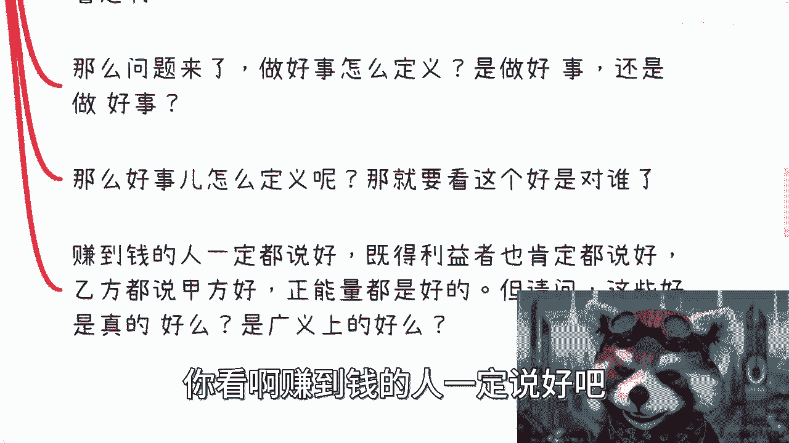

所谓寄的利益者一定说好了是吧，乙方一定说甲方好吧对吧啊，这个跪着的人一定说站着的人好吧是吧啊，这个能量都是好的吧，那么我就请问啊，你们觉得这些好是真的好还是广义上的好，还是只是对某一部分人的好，对吧。

你怎么定义好呢。

诶对吧好。

那我们来看啊，我们来举个例子啊，如果大家今天能看到这个视频啊，那我觉得收获颇丰啊。

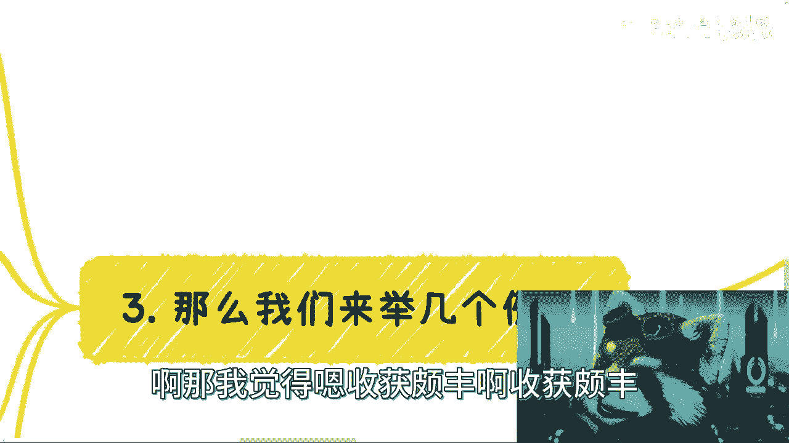

收获颇丰，不管是你们还是我啊，嗯我们来举几个例子。

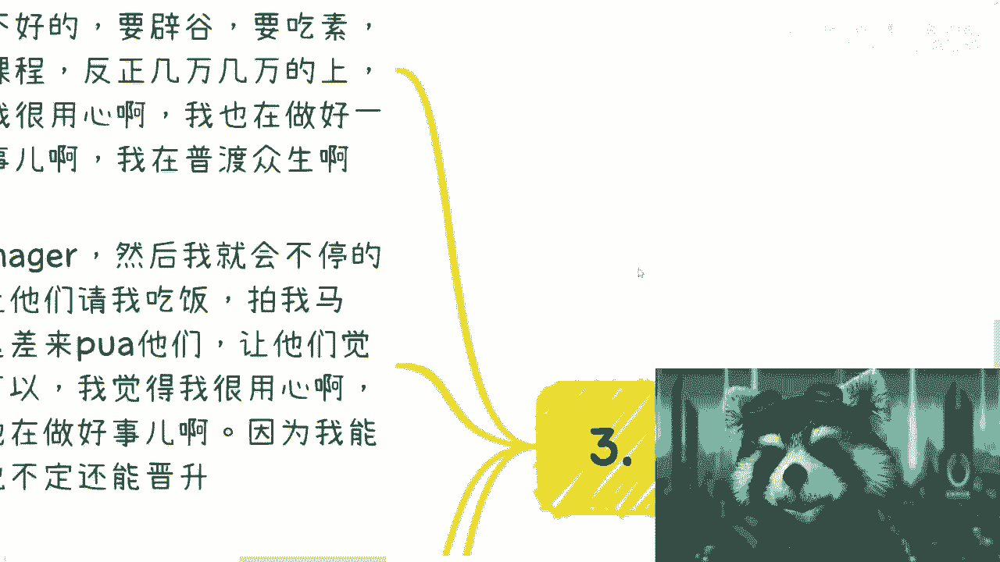

首先比如说啊，我今天要卖一些信仰的课程啊，那么我肯定会使劲pua，你们啊跟你们怎么说呢，吃肉不好啊，要屁股啊，要辟谷啊，要吃素啊，要来冥想啊，要来参加我的各种课程啊，反正就是几万几万的上，上完之后呢。

来洗涤你们的灵魂啊，我就问你啊，我不用问啊，我自己说我就觉得我很用心啊，我一直在做一件好的事情对吧，而且我也一直在用心做好一件事情，对不对啊，我在普渡众生啊，没毛病啊，对不对，我在浦东众众生。

从而来满足自己的财富，积累自己的财富是吧啊，这第一啊，第二比如啊我现在一个大，我是一个大厂的manager啊，然后呢我就会不停的压榨员工啊，潜移默化的让他们请我们吃饭，请我吃饭，拍我的马屁啊。

每天用各种所谓的信息啊，我从p 10这边获取了什么信息，p 11这边获取来什么信息啊，我从马云爸爸这边获取了什么信息来pua他们，让他们觉得我很牛逼啊，牛逼的很啊，甚至贿赂我也可以啊，我觉得我很用心啊。

没毛病对吧，我甚至也觉得我在做好这件事情，我也在做一件很好的事情，为什么呢，因为我觉得我能让他们得到更多的成长，说不定还能晋升，对不对，这种技能不但在这家公司受用，还能在下家公司受用，是吧哈。

你能说我什么哎，没毛病啊，是不是啊，好那么我们来说啊，这个大家都知道一些变态或者极端的人，为什么很可怕啊，我们来说为什么很可怕，可怕的并不是因为他们极端或者变态。

可怕的是因为他们会把正常人觉得可怕的事情，认为是普通的正常的事情啊，这个是他可怕的地方，那么他们甚至会认为这是一件很好的事情。

你们回想一下，我刚刚跟你们讲的那些事情是不是这样子啊，所以我们做什么事情都要去想，我们为了谁去做的啊，如果你今天做一件事情是为了自己是自私，还是说是一件真正有意义上的一件正常的事情。

又或者来说如果是为了别人，是别人要的，还是我强加于别人的，对吧好，那么我们就回过头来说，我现在一直到现在，这三个月做的视频的问题对吧，对我来讲，我认为这是对我是有价值的事情，因为我希望更多人能够明白。

大家不要去做电池，能明白我想传达的理念对吧，但是我从来不会强加于大家哦，就是我会我会去pua你们p u a，你们或者我去跟你们说，你们他妈都是，你们他妈想的都不对的，只有我是对的，我从来不这么说的。

对不对啊，然后同样的我也会告诉你们打工要打吗，要打的，我从来不会跟你们说，他妈全部离职啊，给我创业，我会这样吗，不会的，对不了，同样的我也希望这些视频告诉大家是什么，是你们能够有独立的思考。

你们能够独立的去想自己的长处是什么，你们能够去发挥长处去赚钱对吧，那当然我并不知道这个事情，是不是每个人都想要的，但是大家各取所需就好了，对吧好，那么接下来也就是最最敏感的地方啊。

哎呀我很忐忑啊啊从上到下啊。

我们来举个例子啊，我们继续来举个例子啊。

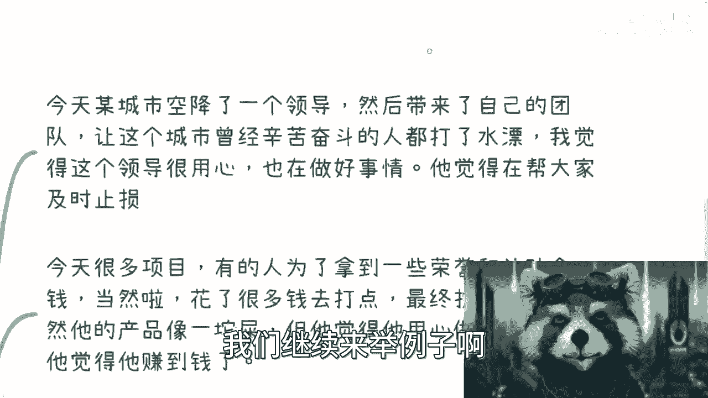

继续来讲故事对吧，今天某城市啊空降了一个领导啊，然后呢带来了自己的团队啊，让这个城市啊曾经辛苦奋斗啊，曾经辛苦创业，曾经叫什么，就是这个打打官司的人啊，都打了水漂啊啊我觉得这个领导就很用心啊。

我凭良心说我我作为一个资本家啊，我觉得我这个领导很用心，也在做事情，因为他觉得他在帮大家止损啊，及时止损止损了对吧，但他觉得哎呀大家已经付出太多了对吧，都又贷款创业的，又去借钱的干嘛。

哎呀你们不要这么辛苦了，辛苦日子结束了对吧，接下来的钱就让我赚就可以了，是吧对吧啊，第二呢就是今天有很多项目啊，有的人呢为了拿到一些荣誉或者补贴金啊，那么当然了也花了很多钱去打点啊，最终拔得头筹啊。

虽然它的产品像一坨屎啊，它的服务也像一坨屎，但是呢他呃他觉得他用心做了一件好事，他也用心做好了这件事情，因为他觉得他赚到了钱对吧，这就是一个我觉得很简单嘛，他就活在他世界里，他觉得我赚到钱就是好。

别人怎么样死活，别人死活跟他没有关系啊，无所谓啊，好同样的啊，今天有一家公司从小做到大啊，现在可能几万人，十几万人啊，从一开始做到现在，踏着无数的人的生命跟所谓的重病过来啊，现在非常风光啊。

认为自己给社会创造了很大的价值，也提供了很多的岗位，甚至输送了很多的人才啊，这个人才变变低，就是啊，那么这个时候你就会发现，不单单他自己觉得他做了一件很好的事情，不单单他自己觉得他用心了。

所甚至这个事情，所有的人都觉得他用心做好一件事，情，为什么你们有没有想过，为什么对吧啊，那再说说我自己啊，我曾经在超市做过那种熟食的售卖员啊，就是帮人家烧东西啊，那那个时候比较苦啊。

一个月200的样子啊，就是大概做双休日啊，我被要求呢吃午饭只有半个小时的时间，而且不能在任何的座位上吃啊，必须在楼梯上蹲着啊，另外呢双休日我必须卖完20盒速冻食品啊，否则是没有钱的啊，什么意思呢。

就是说否则答应你的报酬是没有的，我现在回想一下，我觉得我当时做事很用心，因为我要去赚这200块钱啊，我也觉得我在做一件做好一件事情，当然我并不认为我在做一件好的事情，当然超市觉得我在做一件好的事情。

对不对啊。

哎呀我们说啊这个好汉不提当年勇啊。

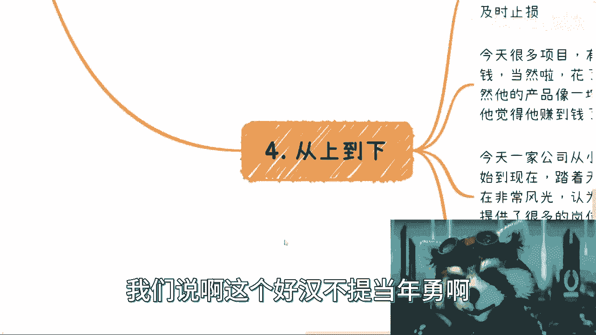

也就是说同样的啊，我们也没必要去提当年的那些惨痛的回忆啊。

那么接下来啊我们说最后那么问题来了啊。

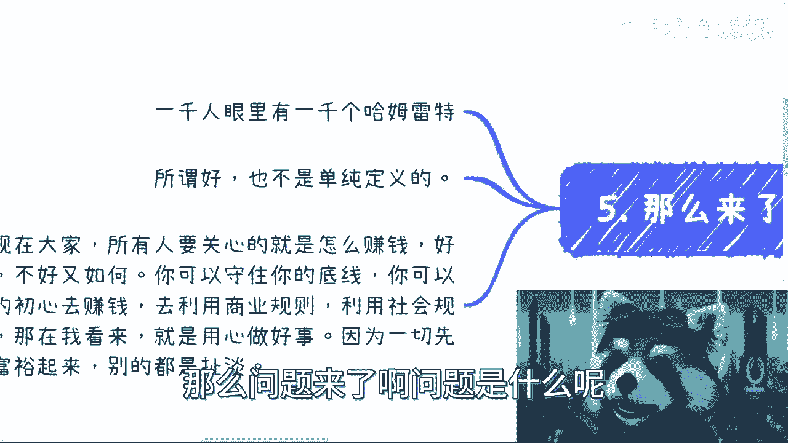

问题是什么呢，1000个人眼里有1000个哈姆雷特是吧，那么好，那么所谓我们说的所谓的做好所谓的用心，也不是单纯去定义的，你在不同的level，你在不同的阶级，你在不同拥有财富的情况下面。

你都会去变化的去定义，你所谓的用心跟所谓的好啊。

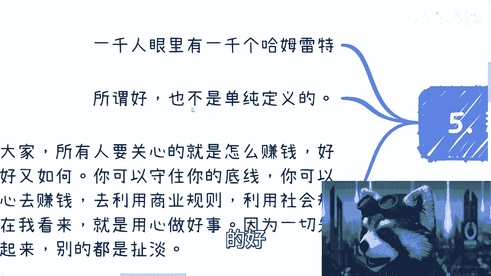

那当然每个人的认知跟每个人的这个，这个这个叫什么，就是这个觉悟啊，包括每个人的这个想法，在不同的叫做这个觉悟的情况下面，他对于用心跟所谓的好也是定义很不一样的。

那么在我认为啊，我觉得我不能说这接下来这句话适用于所有人，但是我觉得适用于当下这个时代的所有的人啊，我认为现在大家所有人要关心的就是怎么赚钱，没那么多逼逼的事情，为什么，因为好又如何不好又如何，对吧。

你我就告诉你们，你们可以守住你们的底线，你们也可以保持你们的初心去赚钱，去利用我们这个世界的商业规则，社会的规则去赚钱，那么在我看来，你已经是用心去做好事了，我不管是做好一件事情还是做好事。

我觉得你都做到了啊，因为一切的一切你都要先让你自己的level提上去，你要让你自己的这个认知提上去，你要让你自己的觉悟提上去，你要让你自己的财富提上去，你才有可能真正的去用明白什么叫用心。

你才有可能真正的明白什么叫做好一件事情，或者说做一件好事情，别的都是扯淡啊，别的都是扯淡，这就好像到今天为止，b站还有一些评论区的小伙伴再来跟我说，他说啊，就上来就跟我就跟我讲大道理，你知道吗。

然后讲了半天，他还是一个电池的道理，我直接拉黑删除，为什么，因为我想讲的跟他所讲的。

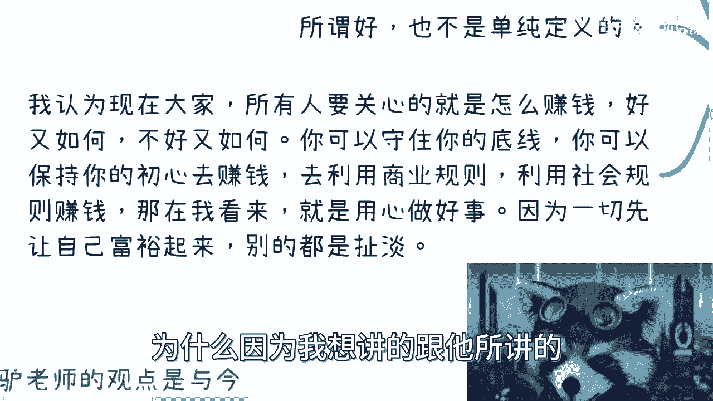

我所看到跟他所看到的根本就不在一个层面上，这种人我有什么好跟他比比的呢，对吧啊，所以啊我觉得是这样子的，所有人去看一个up主也好，去看别人也好，包括你们跟别人讨论事情也好，我们都要有上下文。

我们都要去辩证的去看这个问题，而不是统一化的，就是好，刘老师说不好啊，我说好好，我们开始pk啊，就开始对骂，有意味了，没有意义的，对不对，什么希望这个视频能发出来啊，好吧，反正大家在职业上啊，在规划上。

在很多上面有什么问题的，你们可以私信我对吧，你们关注我的时候，我现在也会有个私信告诉你们对吧，呃私信咨询我对吧，多少多少钱对吧，还是那句话啊。

