# 来谈谈-用心做好事----P1---赏味不足---BV1dj411D7ws

在本节课中，我们将深入探讨“用心做好事”这一常见说法的复杂性。我们将从定义“用心”和“好事”这两个核心概念入手，通过多个角度的实例分析，揭示其在不同立场和情境下的多元含义。课程旨在引导大家进行独立思考，理解概念背后的相对性。

## 前言与背景

首先，需要澄清一个可能的误解。一些观众可能认为，我以往的视频内容似乎在鼓励大家不要脚踏实地做事，或者暗示“用心做好事”反而会阻碍赚钱。这是一种错觉。

我的观点并非如此。此外，对于期待纯粹技术内容而认为此类讨论“虚头巴脑”的评论，我的态度是：试图让所有人理解自己是不可能的，因此无需过多争论。

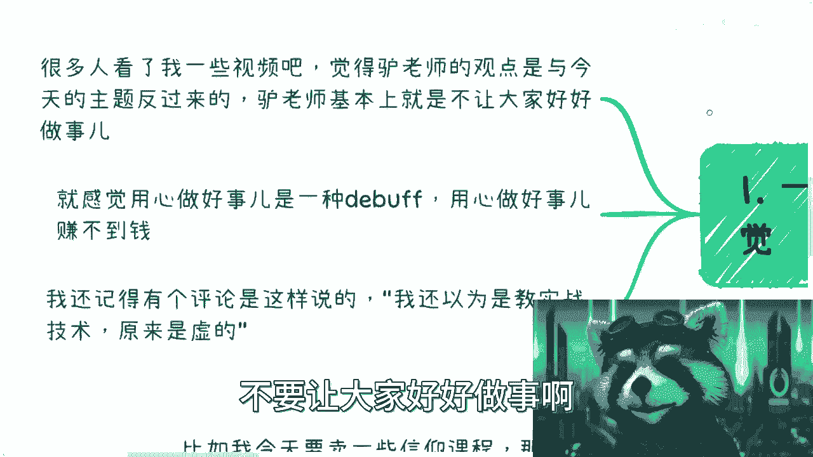

接下来进入正题，内容可能涉及敏感讨论。

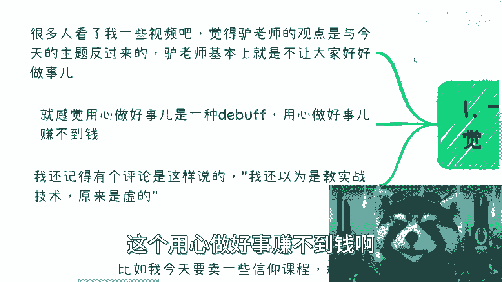

## 核心概念定义

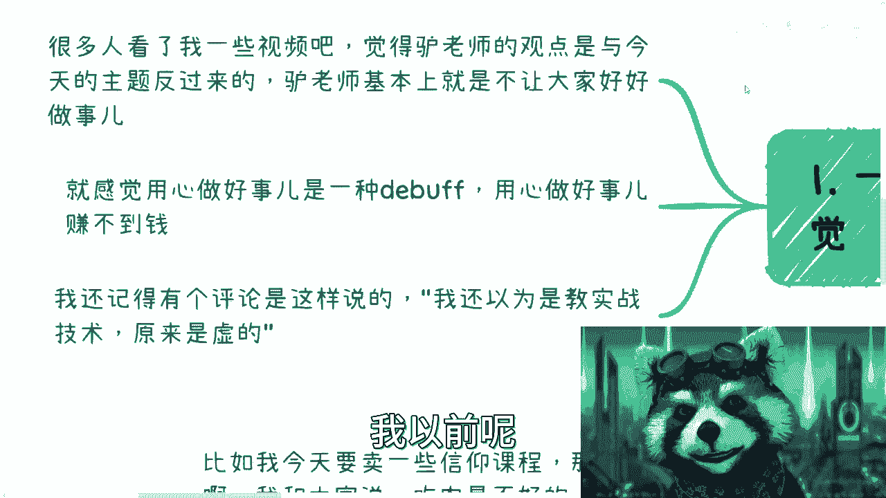

在深入讨论前，我们必须先明确“用心”和“做好事”这两个词的定义。定义是逻辑分析的起点。

### 何为“用心”？ 💡

“用心”本身取决于行为者的出发点。出发点不同，“用心”的体现也截然不同。

以下是几种不同出发点下的“用心”示例：

*   **出发点：利他与奉献**
    若你的目标是拯救苍生、从事慈善、用爱发电，这当然算“用心”。

*   **出发点：牟利与收割**
    若你的目标是“割韭菜”，并通过刻苦钻研传销盘、拜师学艺、积累人脉、精心包装与营销，将价值一元的产品以一万元的价格卖给一万人，从而获利上亿。这个过程同样需要极致的“用心”，其努力程度可能超过99%的人。

*   **出发点：生存与服从**
    若你是一名月薪五千、遵守996/007制度的普通员工，尽心尽力，凡事从自身找原因，不断反思。这同样是一种“用心”，甚至可以说是“用命”。

*   **出发点：犯罪与极端**
    观察社会上的许多刑事案件，作案者往往采用了极端手段。从某种意义上说，越极端的手段，背后可能意味着越“用心”的策划与执行。

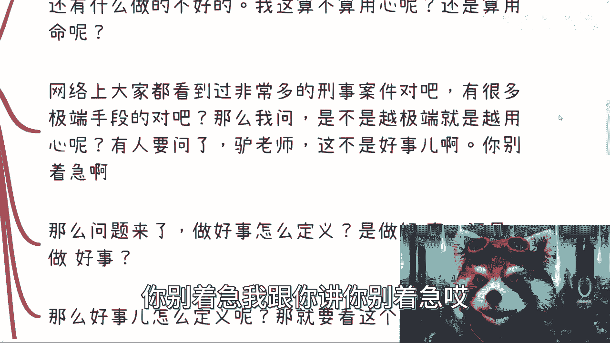

由此可见，“用心”是一个描述投入程度的中性词，并不天然指向道德上的“好”或“坏”。

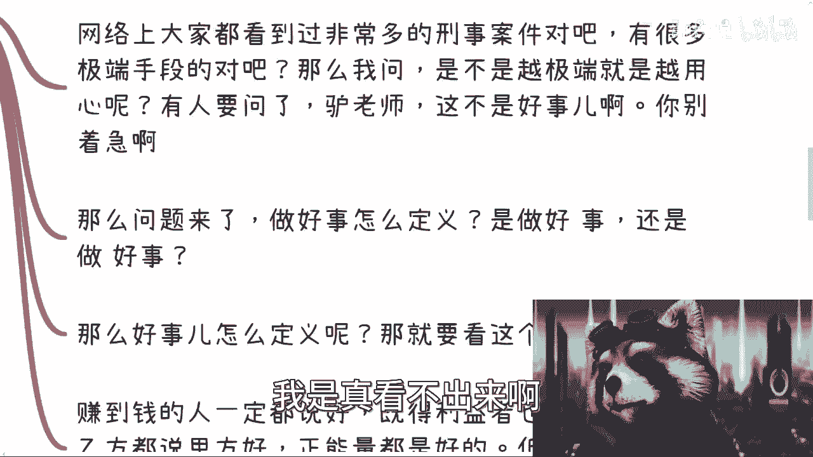

### 何为“好事”？ ⚖️

定义“好事”则更为复杂，关键在于“好”是针对谁而言。

“好”具有强烈的相对性：

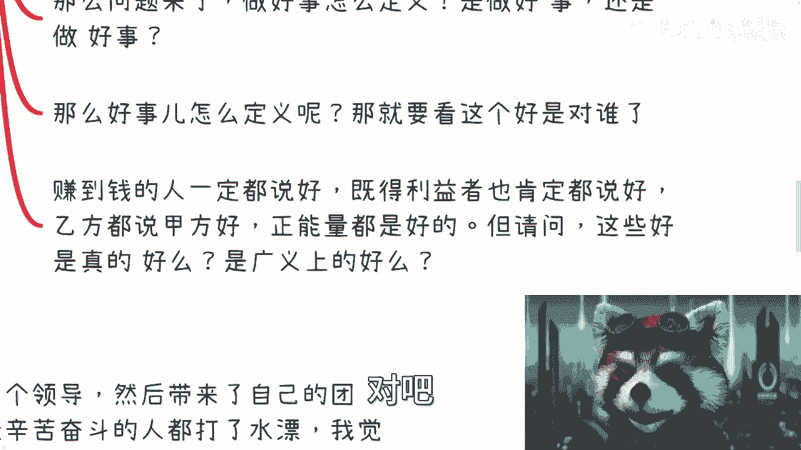

*   赚到钱的人认为此事“好”。
*   既得利益者认为此事“好”。
*   乙方可能认为甲方的要求“好”。
*   处于弱势地位者可能认为强者的姿态“好”。

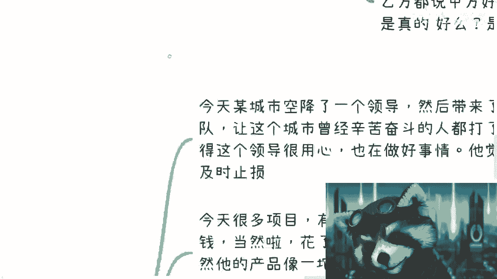

那么问题来了：我们如何定义“好事”？是指“**做好**一件事”（强调把事情做得出色），还是指“做**好事**”（强调事情本身的性质是善良的）？从字面上看，这两种理解都存在。

## 实例分析与辩证思考

上一节我们拆解了概念，本节我们来看看这些概念在具体情境中是如何交织并产生不同解读的。以下是几个假设性例子：

*   **例一：售卖“信仰”课程**
    *   **行为**：通过话术宣扬特定生活方式，推销高价课程。
    *   **自评**：我认为自己非常“用心”地在“普渡众生”，这是一件“好事”。我既“用心”又“做好”了这件事。
    *   **实质**：以满足自身财富积累为目的。

*   **例二：职场管理者压榨员工**
    *   **行为**：利用信息差和权力压榨、PUA下属，甚至接受贿赂。
    *   **自评**：我认为自己很“用心”地在“培养”他们，帮助他们“成长”和“晋升”，这是在做好事。
    *   **实质**：以巩固自身权力和利益为目的。

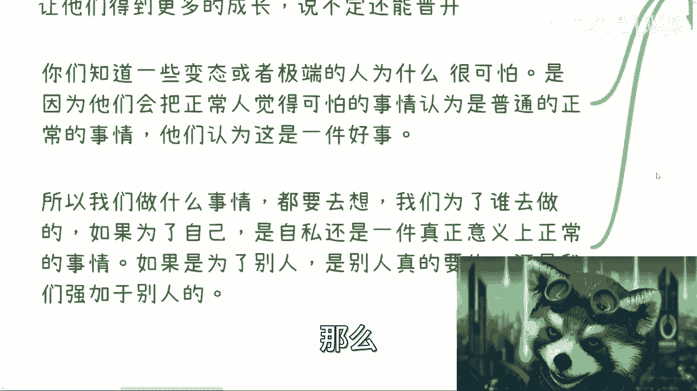

这些例子揭示了一个可怕之处：极端或扭曲的人，其可怕不在于行为本身，而在于他们**将正常人视为可怕或错误的事情，认定为普通、正常乃至“好”的事情**。

因此，我们在判断时，必须思考：做一件事是为了谁？是为了满足一己私欲，还是具有普遍意义？如果是为了他人，那是他人真正需要的，还是我们强加于人的？

## 观点阐述与立场说明

承接上面的思考，我来说明一下自己制作视频的立场。

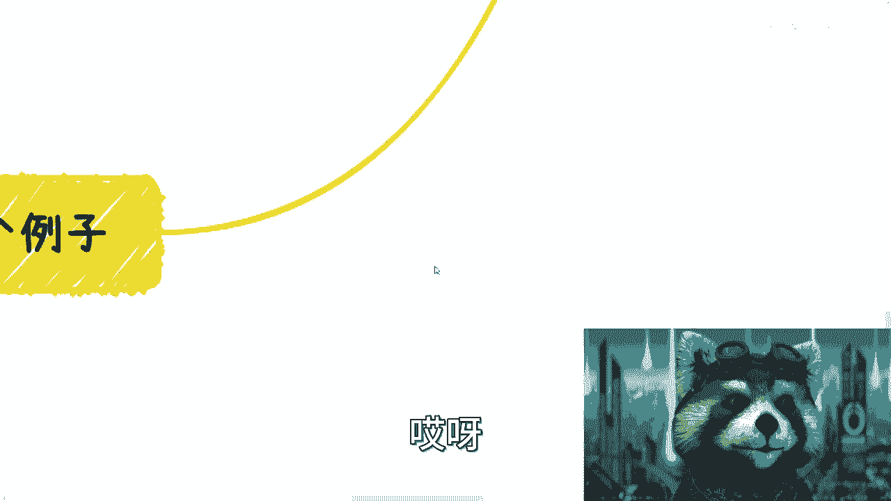

我认为制作这些内容对我有价值，因为我希望更多人能理解“不要单纯做电池”的理念。但我**从不强加**于人，不会宣称只有我是对的。我鼓励的是**独立思考**：认识自己的长处，并以此去创造价值。

我并不知道这是否是每个人想要的，但大家各取所需即可。

## 深入探讨与敏感类比

接下来是最需要辩证看待的部分，我们将通过一些更宏观的类比来思考。

*   **类比一：城市治理**
    假设某城市空降一位领导，其带来的新政策让许多此前艰苦创业、维权的人努力付诸东流。这位领导可能认为自己很“用心”地在帮大家“及时止损”，是在做“好事”。（其逻辑是：辛苦的日子结束了，接下来的机会由我来主导。）

*   **类比二：项目竞争**
    有人为了获取荣誉或补贴，花费重金打点，最终胜出。尽管其产品或服务很差，但他认为自己“用心做好了一件事”，因为他赚到了钱。在他的世界里，“赚钱”就是唯一的“好”。

*   **类比三：企业成长**
    一家公司从小做大，可能踏着许多人的健康甚至生命，最终成为提供大量岗位的巨头。此时，不仅他自己，甚至社会都可能认为他“用心做好了一件大事”，创造了巨大价值。

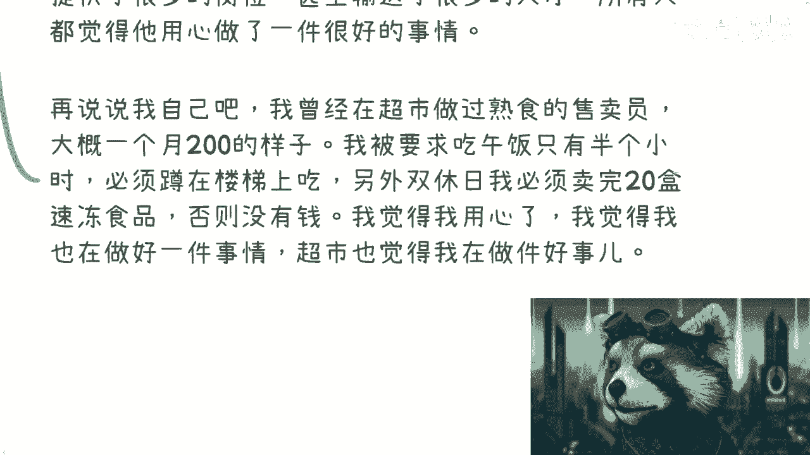

*   **个人经历**
    我曾兼职超市熟食售卖员，月薪200元。我被要求只能在楼梯上蹲着吃午饭，且周末必须卖完20盒速冻食品才能拿到报酬。当时，我认为自己很“用心”（为了赚200元），也在努力“做好”销售这件事。但我不认为这是件“好事”，尽管超市可能认为如此。

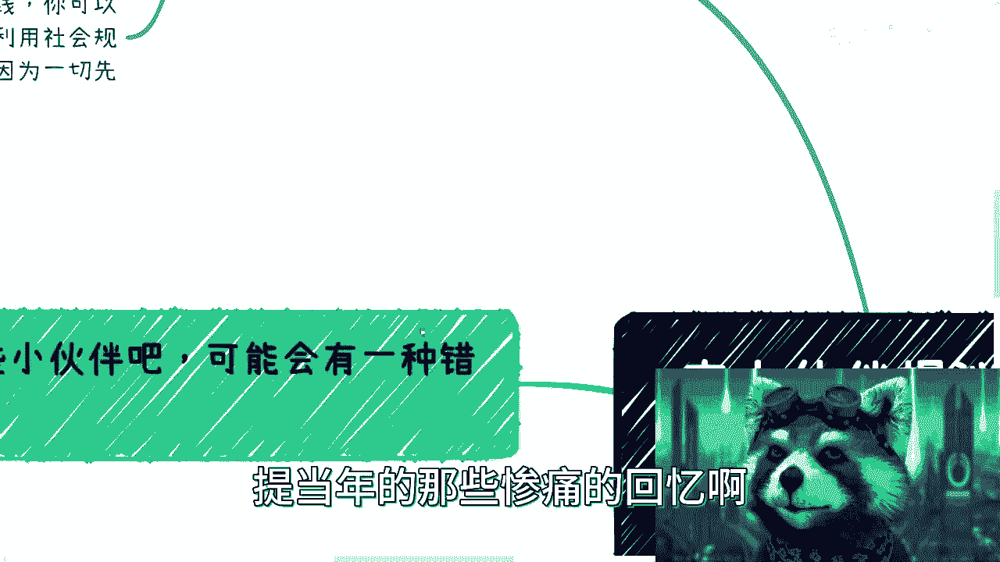

这些例子再次说明，“好汉不提当年勇”，我们也不必沉溺于惨痛回忆。关键在于认识到：立场和处境决定了认知。

## 结论与总结

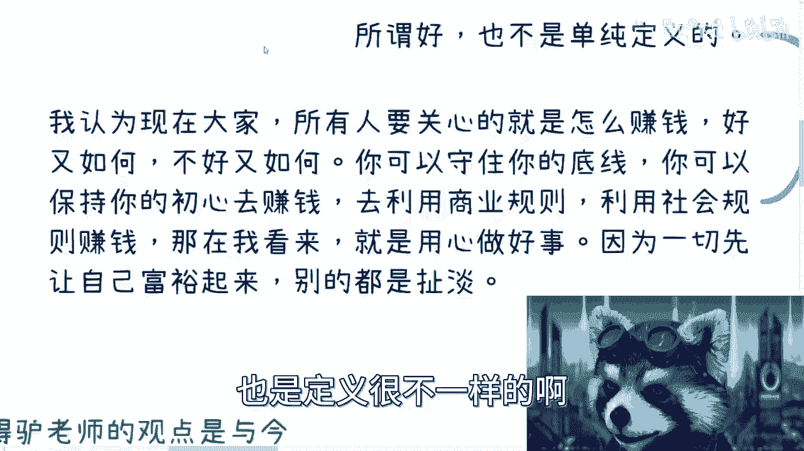

本节课我们一起探讨了“用心做好事”的多重含义。最终，我们面临一个核心问题：既然“用心”和“好事”的定义如此因人而异、因境而迁，我们该如何自处？

我的观点是，在当下的时代环境中，对大多数人而言，最应关心的是**如何赚钱**。好与坏的争论有时是次要的。

你可以**守住底线、保持初心，同时学习并利用商业与社会规则去赚钱**。在我看来，这本身就是“用心做好事”——无论是“做好一件事”还是“做一件好事”，你都做到了。

因为只有当你提升了自己的层级、认知、觉悟和财富，你才可能真正理解什么是“用心”，什么是“好”。在此之前，许多讨论可能缺乏共同基础。

这就好比与一个认知层面完全不同的人争论，往往没有意义。因此，看待任何观点（包括我的视频），都需要结合**上下文**，进行**辩证思考**，而非寻求一个简单统一的标准答案。

希望本节能引发你的独立思考。如果在职业规划或个人发展上有具体问题，欢迎通过私信进行咨询。