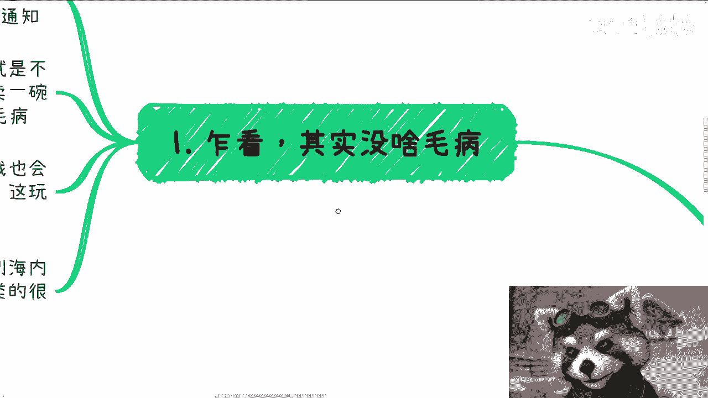
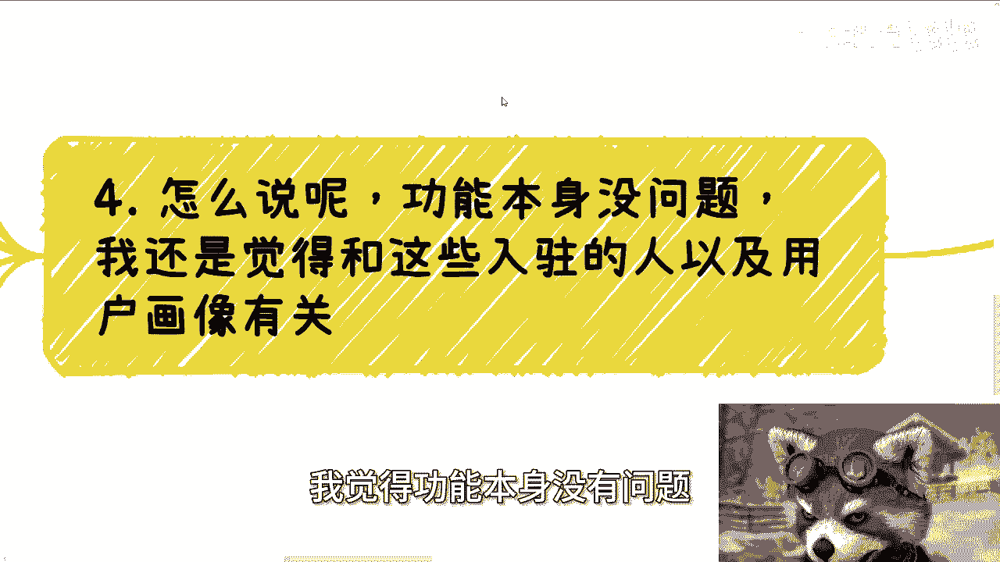
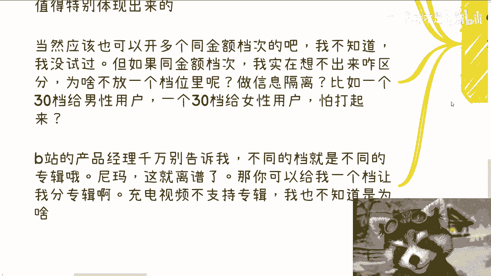

# 课程P1：B站多档充电功能分析 🧐

在本节课中，我们将要学习B站近期推出的“多档充电”功能。我们将分析其运作模式，并将其与其他平台的知识付费模式进行对比，探讨该功能在B站生态中可能面临的逻辑挑战。

---

前两天我发布了一条动态。

随后，大家与我讨论了B站最近开启的“多档充电”功能。这个功能允许创作者同时设置多个收费档位。

首先，我的看法如下。

乍看之下，这个功能似乎没有问题。充电分档功能在去年8月就已存在，但多个档位能够同时共存是最近才推出的。许多用户可能不了解，以为这个功能一直都有。以前只能切换档位，例如从30元切换到50元，但不能共存。我也是最近才收到B站运营的通知。我相信很多用户觉得这没什么问题，毕竟它看起来只是一种不同的收费模式。

但实际差别很大。我仔细思考后，认为这个功能确实存在问题。这类似于知识变现或售卖商品。有的商品定价10元，有的定价50元，这看起来没问题。在其他平台或模式下，我可能会开通这个功能。但我的潜意识和经验告诉我，这个功能不行。或者说，这个功能在一定时间内的逻辑是走不通的。

当然，海内外可能有许多平台拥有类似的多价格共存功能。但B站的这个功能，在某些深层次角度上，逻辑是不同的。

你听我解释。首先，我们来谈谈它与不同收费产品或服务的区别。

许多知识变现平台，无论是文字、视频还是直播类，都提供不同的内容和不同的收费。这没有问题。例如，我在一个平台上讲解经济学，可以推出9.9元的科普课程、199元的初级课程、1999元的进阶课程，甚至19999元的高阶课程。这没有问题。

但问题在于，B站的充电视频与这些课程有巨大区别。那些课程是一套完整的体系，用户付费后可以看到所有内容，并且内容具有连贯性和因果关系。这类似于B站的“专辑”功能。而B站的充电档内容，一方面是**包月制**的，这本身就是一个值得商榷的设计。另一方面，它的内容需要UP主持续更新。从某些角度讲，UP主也可以固定更新，例如一个充电档更新20或30个视频后就不再更新。这可以做到，但为什么不使用“专辑”功能呢？我不明白为什么非要分档。

而且，这对用户来说也不是一次性买断。用户为什么要持续购买呢？如果是持续性更新，用户支付50元后，并不知道UP主未来更新的内容是否值得，也不知道新内容是否与之前的主线连贯。作为用户，我会感到困惑。这种感觉就像我去一家日料店消费1000元，我期望获得好的口感、服务或环境。但B站这个功能让我觉得，我花了钱，却不知道对方能提供什么。作为一个消费者，我甚至不知道对方要给我什么东西。

第二点是很难区分内容价值。这是我最诟病的地方。首先，同一个人制作的多个视频之间很难有巨大区分。当然，形式不同可以有区分。例如，免费视频由一个人制作，30元档视频由两个人制作，50元档视频由三个人制作。这可以做到。但从制作视频的角度看，成本确实有区别。然而，对于购买视频的充电用户来说，我看不出有什么区别。

作为用户，我可以接受一个人有免费视频和收费视频。但我无法区分这个人制作的30元视频和50元视频之间是否真的存在20元的差价。说实话，我觉得区分不出来。我认为UP主自己也很难区分。例如，如果你是美食区UP主，便宜档做菜谱科普，贵档做实操。这理论上可行，但真正愿意花心思去体现这20元差价的人有多少呢？对于大部分人来说，只有免费和收费这两个区别。他们不会真的花力气和时间去为用户着想，做内容上的区分。因此，这个功能会变得很鸡肋。

当然，这些都不是最重要的。最重要的是，我觉得这个功能是突然插入的。如果你是一个新UP主，可能还好，因为你可以从一开始就规划内容。但对于大部分已经创作过内容的UP主来说，这就很棘手。如果你以前认真做内容，你会发现免费内容质量很高。现在有了充电功能，你不仅要区分免费内容和充电内容，还要区分不同充电档位的内容。这真的能区分出来吗？能有几个人区分出来？如果UP主能区分出来，他得把自己卷死；如果他区分不出来，就会被用户骂。我当时听到这个功能时，潜意识就觉得不太行。

所以，我认为功能本身没有问题。

我认为这与平台、入驻的创作者以及用户画像有关。B站是一个UGC平台，最初以二次元、ACG文化起家。大部分创作者并非特别专业人士，大家多以兴趣爱好、VLOG、舞蹈等垂直领域内容为主。那么，每个人能产出多少东西呢？能区分免费和收费内容就已经不错了，还要设置不同的收费档位。这如果不说是割韭菜，我都觉得对不起它。

当然，并不是不能做。收费贵的档位可以提供一些特别机密或多人大联动的视频，价值需要特别体现出来。但问题在于，这很难做到。当然，你也可以说可以开设多个同金额的档位。我没试过，不知道B站是否支持。例如，开设五个30元的档位。但如果金额相同，我想不出为什么要分开。为什么不放在一个档位里呢？我只有一种想法，就是为了做信息隔离。例如，一个30元档给男性看，一个30元档给女性看，一个不擦边，一个擦边。那我实在不明白为什么不放在一个30元档里。

我觉得B站的产品经理千万不要告诉我，开不同的30元档就是不同的专辑。这太离谱了。之前有多少人问过我：“陈老师，充电怎么没有专辑？”不是我不想设置专辑，而是B站根本没有这个功能。充电支持专辑怎么了？不行吗？我不知道为什么。你们想想看，如果能支持专辑，我有必要在每个视频前面打标签吗？我打标签就是因为不支持。

所以，我不知道你们是怎么想的。

作为一个平时只看吃播、游戏、动漫的人，我不太会去充电。充电视频可能比较少。但如果我愿意为一个人的视频充电，他开设多个30元档，或者30元、50元、128元、256元等多个档位，除非让我知道这个人非常博学、非常厉害、有真材实料，否则我不愿意。而且你们有没有发现，多档充电再多档，它也是视频。你有本事在多档里搞点别的东西出来。例如，30元是视频，50元是直播，70元是线下见面（随便举例）。这样也行。多档可以提供多种服务，而不是非常粗暴地把所有内容都定为视频。50元档是视频，500元档也是视频。我看不出有什么区别。难道30元档是学习知识，3000元档就能长生不老？我也不知道为什么，真想不明白。

你们仔细想想，这与购买课程、服务或去不同人均消费的餐厅吃饭，深层次的逻辑真的不一样。它们不是同一个东西。好吧，反正这是我的想法。我玩B站的时间也不长，只是阐述一下我的观点。嗯，行，那就这么着吧。如果大家有职业规划、商业规划、股权融资、合同等问题，或者手上有项目希望从我的视角看看怎么规划、怎么打牌，可以整理好资料。

我们可以进行咨询。

---

本节课中我们一起学习了B站“多档充电”功能的基本概念，并通过对比其他知识付费模式，分析了该功能在内容价值区分、用户消费逻辑以及UP主内容规划方面可能存在的挑战。核心问题在于，在B站以持续更新和兴趣社区为主的生态中，简单粗暴地按价格对视频内容进行分层，缺乏足够的内容价值支撑和清晰的消费预期，可能导致功能效果不佳。