# 来谈谈b站这次2024的创作激励年度计划吧 - P1 - 赏味不足 - BV1n2421P7pQ

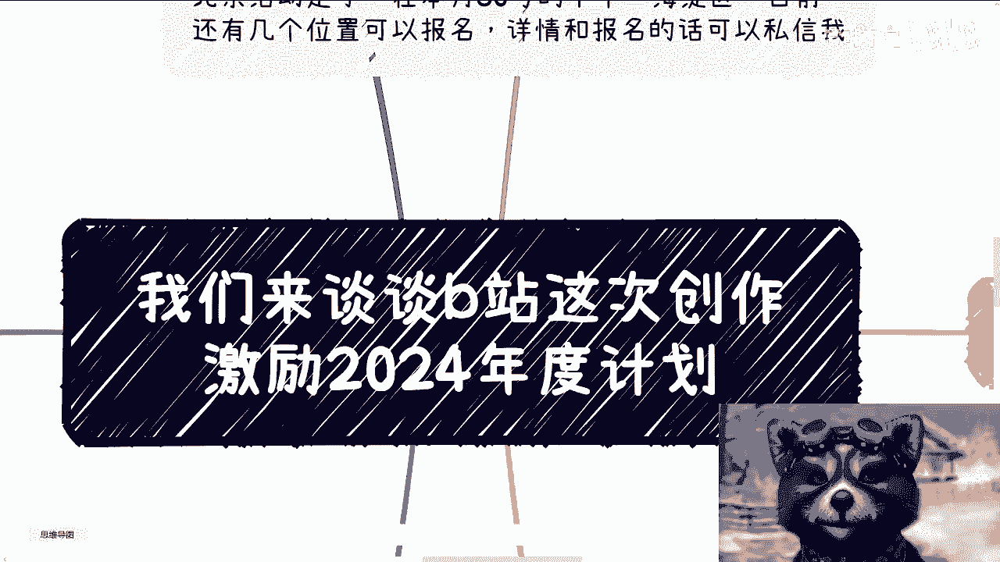

好大家好。

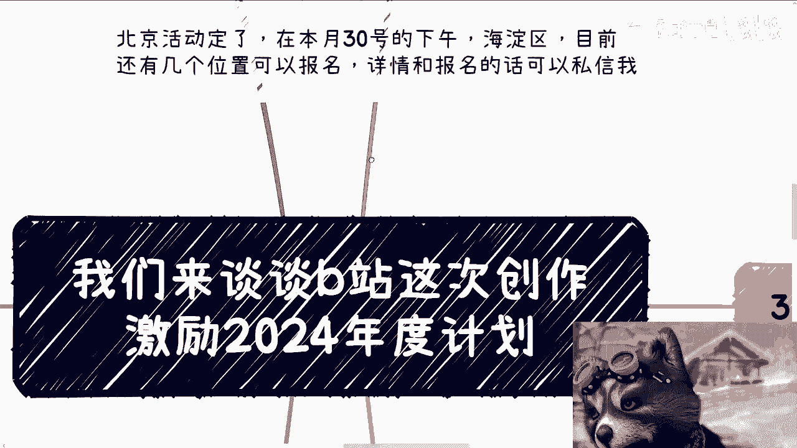

那个北京活动定在本月30号的下午，在海淀区，目前还有几个位置可以报好吧，详情跟报名可以私信我，因为北京这边的场地限制了人数，所以我也没办法，我只能跟就掐掐点掐点。

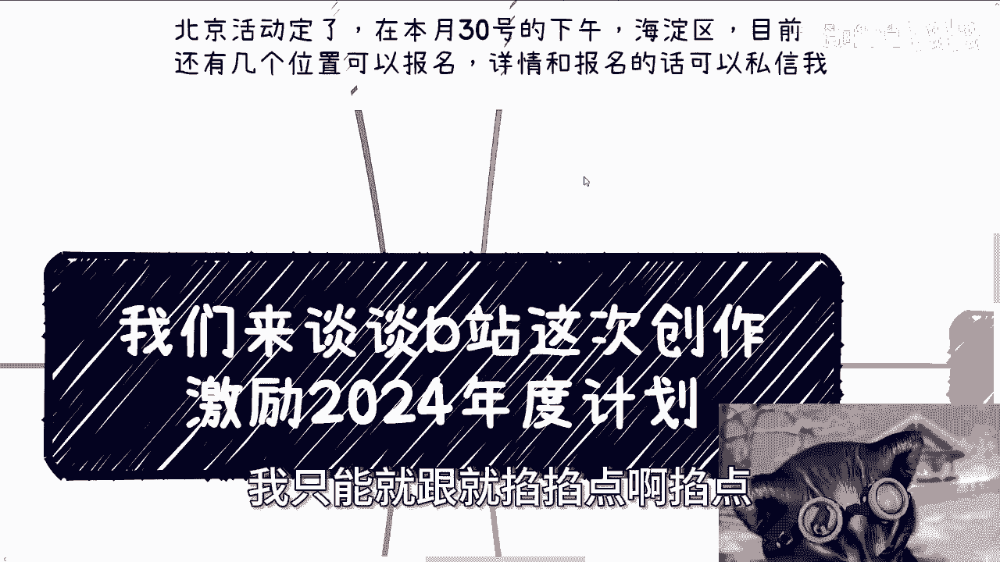

然后这一次你们看看这个线啊。

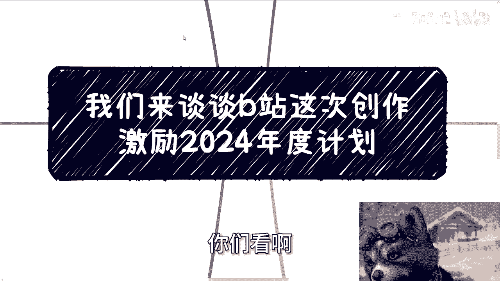

看这个线就很多是吧，而且而且我写了好多，你看给你们看。

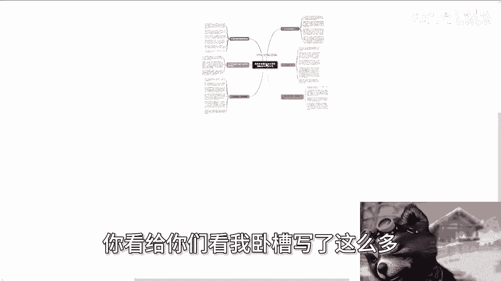

我写了这么多，嗯这次呢主要就是来聊一下B站。

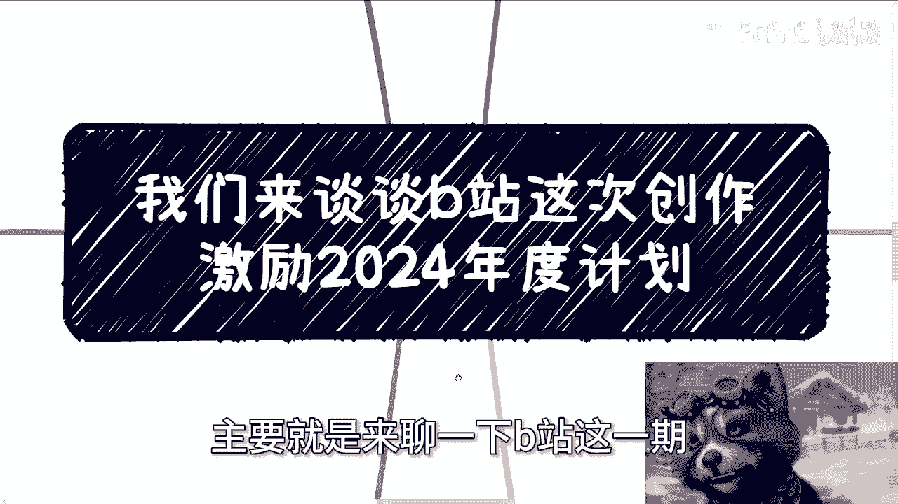

这一期，就前两天新出的那个，创作激励的这个年度计划啊，嗯因为我也不是专门玩啊，所以说我可能讲的比较怎么说呢，比较肤浅啊，反正你们姑且听之，先说说我这一年的感受啊。

我觉得首先啊我没有像很多人玩B站玩这么久，或者别的短视频平台，我也不怎么玩啊，就单纯我做了这一年来讲，最大的感受就两点，第一呢就是激励真的很少，我看了一下，我大概一天在18~20块钱算多的了。

15~18块钱吧，你们看我这个视频啊，没有特效，没有剪辑，也没有什么很有趣的地方，三无产品，所以我呢就是就是本质上你看也是自己做，你说能有啥成本啊，不过我去思考，比如说到底讲什么东西。

或者怎么能够直白的表达，更加客观的给大家描述出来的也是蛮耗时间的，但问题是如果有个团队啊，那么这些激励你不管是兼职还是全职的，这些基地不可能活，那你每天吃点零食都吃吃不动。

反正呢之前是说好像大家都说什么激励很多啊，或者怎么样，反正我也没赶上，那时候我就就我只能说我没有这个命啊，然后8月份的时候呢，呃那个找我内测充电视频以及之后的课程，我跟你们讲啊，就这事我不得不吐吐槽。

就B站给我发让我开课程的视频啊，这个私信啊不说十条八条肯定是有的，然后充电呢内测本来就是六块30块50块啊，他就三档，然后这个今天发给我私信说他妈有十档，而且我看了一下这十档价格呢还他妈非常高啊。

说实话，按照我的认知，按照我对B站的认知和B站用户的认知，我是不太认可的啊，真不太认可，就是B站到现在你说困难是不是真的是真的，但是B站从去年下半年开始的转变跟态度，以及这次的创作激励的一些新的调整。

他就让我有一种什么感觉呢，就是本来各方面都还不错的一个人，一直在打工，一直在打工，一直在打工，你说他有成长吗，有成长，你说他有积累吧，也有积累，但是打傻了啊，然后到了某一天，他发现自己不行了。

要赚钱了啊，被迫要赚钱了，然后开始转变啊，然后这个转变就是硬转，什么叫硬转呢，他就完全不管自己的长处，完全不管自己的积累，完全不管自己的用户画像，也不管以前自己的一些各种各样的东西，就他妈硬转啊。

所以啊我先说结论，结论就是说B站呢我觉得他的这个当下的变现，这这部棋子以及他要做这件事情，逻辑上一点毛病都没有啊，而且这是他必须要去走的商业路线，但问题是在哪里啊，问题是在于说这个商业路线。

是不是直接这样运转，以及是不是一定要朝这个方向上面去转，以及是不是先一定要在当下这个时间点转啊，我觉得要打问号啊，然后我们往后看，首先来说第一点啊，就先说这个充电视频啊，这玩意儿我比较有发言权。

因为毕竟内测就开始用了，我觉得全网能跟我用的一样，多的还是比较少的啊，那么充电这玩意呢一开始只有几档，直到昨天我收到通知，他妈有十档，而且价格很高，我觉得这就离谱，而且侧面呢我其实就有种就说你很急啊。

我也理解你很急，但你不能这么急啊，那么就如一里面说的啊，就说B站这个行为啊，很更多的像是迎合大趋势的潮流，就是他会发现所有的平台都在变形，而且而且啊说不好听点，各个平台变现都已经变了好多年了啊。

他才反应过来说啊，我要准备变现了，对吧好，那当然啊，我不是说他以前不变现啊，我只是觉得他以前这个变现的方式怎么说呢，就就不是的，那么不是那么的叫什么，就是商业化啊，嗯但是呢他现在要去迎合大趋势潮流呢。

但又没有赶上真正的红利期，也没有赶上真正的上升期，同时呢又无视了自己平台的特点跟客户的画像，就如我们刚刚说的啊，就是说好像一个人呢明明很有天赋啊，很就是很有内功啊，然后很有自己的沉淀啊，也有招式。

但是呢他非要这个去考研考编，当然我不是说考研考编不好，非要去考研考编，非要去走独木桥，你问他为什么他告诉你大家都这么做，所以我也这么做啊，这就很离谱啊，这就很离谱，就像就像我盲猜啊。

就是因为你看看小洪水也在这么做，抖音也在这么做，整个中国都在这么做，那我们也得这么做对吧，嗯好B站啊，我在我的看来啊，我们想想看，我觉得up这些up主，以前主要的收入来自于舰长跟激励，以及直播打赏。

当然啊我我可能了解不深啊，因为我毕竟我不用嘛对吧，可能会有错误啊，呃那么问题来了，就说别的平台有没有有的啊，但是你要说就是B站它的最大的区别，在我看来，这边的用户普遍还是太年轻啊，未成年人啊。

然后带学生，然后很多呢未成年人呢付钱之后呢，家长还会来退款啊，也屡见不鲜，而且与此同时呢，这些付费内容呢往往也都是就是，比如说我们说直播啊，舰长啊对吧，打赏啊，他往往也是二次元为主对吧。

游戏动漫小姐姐跳舞为主，为什么呢，因为那那我们先不说他为什么吧，就是它平台到今天积累的东西就是这样子，我们不追求，不不去纠结他为什么对吧，那么这就衍生出一个问题，就是说B站本身内容其实是有其鲜明特点的。

但他平台本身啊，要目前开的这个垂直领域呢又非常的海纳百川，就你们从最右上角就是那个app嘛，最右上角那个分类来讲，他什么都有啊，那么问题就来了，你什么都有，不可能每个垂直领域都赚钱。

或者说或者说我们就这么说，在你一个平台上面，你有一套变现模式，但这个变现模式所有领域都能用吗，不可能啊对吧，你去看小红书，去看抖音，去看微微博一样的道理呀，你你就拿微博来讲明星流量八卦对吧。

然后就说一些民生舆论，这个没问题啊，这个是有流量的，但剩下那些呢没有呀，但剩下包括小红书，小红书走的是什么，走的是高端路线，不是名媛，名媛包装，名校包装对吧，民民企包装大厂包装对吧，然后就说秀优越感。

但是你要这么想啊，每个平台上面其实各个领域的都有对吧，也是海南百川的，但是它真正能变现的，真正能够大量变现的其实是有它平台特点，而B站也不例外对吧，那么所以说这就是我经常有了我说的那个现象。

就是B站每个细分领域一定都有做的好的up主，没有错，都有所谓的头部，但是大部分他根本做不上去啊，他根本做不上去，这就好像我说B站上有正经的好的内容，很多很多有努力付出的，我看过也好多好多对吧。

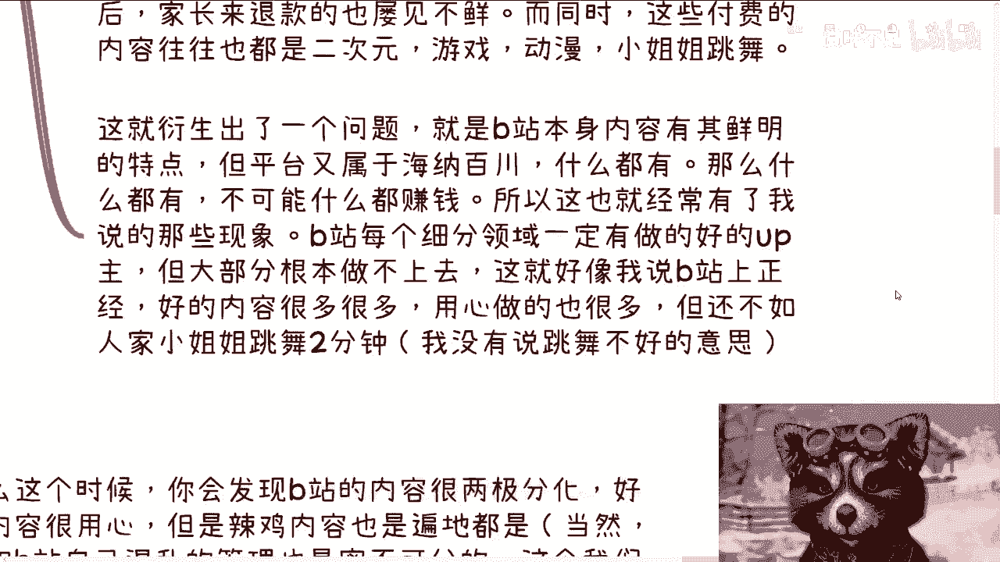

用心做的也很多，但是我有时候调侃了对吧，我就说我说还不如人家小姐姐跳舞2分钟，还不如人家他妈的，拍个十秒钟的那王者荣耀的视频，我那当然我没有说游戏不好，我也没说舞蹈不好，这个就是跟他的基因有关。

跟他的受众有关，但是这个东西不能不考虑进去，对吧好，那我们继续来讲，那么这个时候你会发现，B站内容其实很两极分化，就是好的内容吧，很用心，但是垃圾内容吧也遍地都是，而且大部分有些好的内容吧，他也没流量。

为什么，因为这就跟基因有关，跟他的客户有关，跟他的垃圾算法有关，当然啊我觉得这个就在里面写的，这个我觉得跟B站自己的一些管理的混乱啊，啊包括这个算法的混乱啊，包括就是说啊。

我觉得我因为我也不太了解他们团队啊，我个人觉得这个从我看到的这个表面现象，我觉得这个团队唉管理也的确有有问题啊，那么这个我们后面再说，那么继续说回充电视频啊，充电视频这个逻辑。

其实就是所谓的知识付费的逻辑，但问题来了，知识付费，知识付费，那我们先要讨论一个问题，什么叫知识对啊，你B站认为的知识付费的知识，人家未成年人，或者说那些年轻人认为的是知识吗，我说实话。

我觉得大部分人认为王者荣耀认为原神的皮肤，愿认为FGO对那些皮肤那些抽卡是知识哦，奥特曼对吧，游戏动漫小姐姐跳舞，我觉得是支持，为什么，因为他们愿意付费啊对吧，你你你你什么叫商业，商业就是客户要精准。

客户愿意付费，那么这个东西就是所谓的痛点，那你今天出了一个知识付费，那我们就问这个东西是知识吗啊，大家有那么需要学习吗，你这不在，我觉得这就有点搞笑，真的有点搞笑啊，当然不是说B站上没有人学习，B站。

也是到目前为止，唯一一个，可能很多人在这上面能够学到东西的平台，但问题是量能有多大呢对吧，所以其实推出的时候我就有种什么感觉，就是支付费，他有些可能就类似于比如说呃，比如说别人愿意付钱，是看付费小说。

或者说大家来听故事，有的就是行业趋势的分析，还有一些就是说比那直白一点，比免费视频更擦边的视频，没了呀没了呀，哎你比如说你拿我来讲，我看游戏分析，我看动漫分析，我看过那个番剧对吧。

我看我看个什么什么游戏直播，给我出充电视频，什么意思啊，我搞不懂呀，就是首先你的免费视频和电视有什么区别呢，打的好不好嘛，那不都他妈你来打吗对吧，然后另外一点是我看你一个游戏直播，我看你一个游戏视频。

我看个动漫我还要付钱，你还不如贴片广告呢，对吧啊，我觉得虽然啊B站有文字类似于专栏，但还是以视频为主的，至少我这么认为啊，当然也有可能错，那么平时呢都是视频，那么你突然来一个充电视频，本质上是B站。

希望所有的up主找到自己的变现，内容和免费视频的区别，同时顺便帮B站去赚钱，这个逻辑有没有错没有错，但问题是在于，B站主要要找到自己的变形逻辑，你怎么找内容分成，免费更是付费的。

那么你你你你B站有我如果是B站的话，我要去考虑是不是所有的内容都分得出来对吧，你会发现分得出来吗，不一定就算分得出来，用户会买单吗，也不一定，更何况很多up主还年轻，你让他们怎么收费对吧，我跟你讲。

你很多up主自己都分不清楚什么是免费，什么是收费的，哪些内容应该免费，哪些内容应该收费，而且再说不好听点，要有能力变现，为啥给平台吸血呢，我客观的说对吧，他要有能力变现，为什么给你吸血呢。

平台提供了啥对吧，你真的除了平台什么都没有，我跟你们讲哦，说到这个东西还有个东西叫起飞计划对吧，我真的我说我就不想吐槽他，你们自己花钱去试试看，反正我是花过的，我起码花了1万2000块钱，有的起飞计划。

你起飞了啥玩意儿啊，我只看到我的钱起飞了，我的头都起飞了对吧，所以我觉得说到这还是那个问题，B站要变现，对不对对，帮助up主up主变现，对不对也对，但是你要么就早年直接推出来。

要么就根据自己的用户画像推出一些合适的，针对性的垂直的东西，要么就不推对吧，你推出一个就是在我看来啊，推出一个叫什么叫做大而笼统的，那这个东西就很尴尬对吧，第四再来说这次推出的这个付费课程啊。

B站私信推给我这个东西好多时间了，但我一直没有开，我自己考量啊，我跟你们直白点说我这样几个方面，第一大家都说宇宙的终点是麦克，那我告诉你们，我就很叛逆，我就不想卖，我卖了肯定要被喷，想都不用想的。

我相信有人会付买单，但是没什么好卖的对吧，另外一方面，我本来就不认可麦克的这个逻辑，为什么，因为我从来不认为一套通用的东西，能帮到所有的人，一旦一套通的东西能拿出来出来卖，只要不是吃的。

只要不是用的本质跟割韭菜没有关，没有区别，一点区别都没有对吧，那么问题来了，我要真的要割，大家为什么不早点割呢，哦我非要等到你B站开这个功能来割啊，是啊那么从又从另外一个角度来讲，如果不割的话。

充电视频本身其实可以替代这个功能啊，如果做针对性的解决方案，那么就更用不到一个通用性的课程，或者充电课程这个功能，那么这个玩意儿在我看来他就很鸡肋，你要么就早点做，你要么就别做，也什么意思呢。

也就是说你要么就在大家一起割的时候，你浑水摸鱼去割，而不是说在现在这个时间点，你觉得不行了对吧，我非要变性了，然后做了一个这个东西，那么就是我之前说的这个逻辑，那都是对的。

但是我觉得B站他不是网易云课堂，他不是腾讯云课堂对吧，他也不是得到，他也不是喜马拉雅，他也不是抖音，也不是TIKTOK，你不能说看着别人都在做知识变现，也不是知识星球对吧，你不能看着别人做知识变现。

你就也把全部把知识别人往上套，你可以套啊，这功能做起来技术有什么难点，没难点的呀对吧，那我还是那句话呀，大家真的来看知识的能有多少，真的对吧，你让我一个看吃播的，我专门看那种吃播。

你给我个收费视频怎么滴啊，你变得发痴啊，不用嘴吃，我不明白呀对吧，或者说B站用户认为的知识，跟普遍意义上的知识是一个东西吗，对吧，我觉得不是真的，我觉得不是。

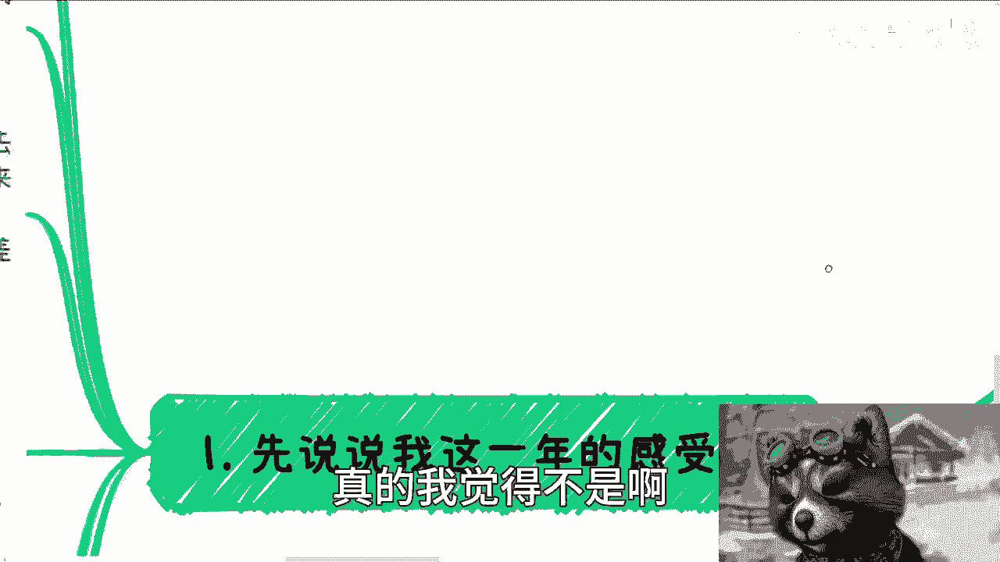

那么诶第五点呢好第五点啊。

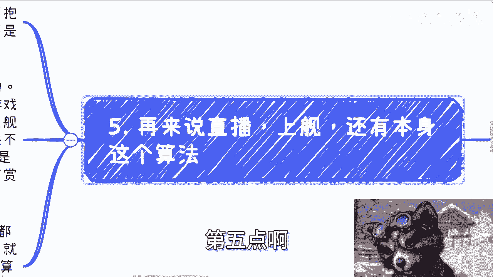

就是说那个继续还要来继续来说那个直播上舰，还有本身这个算法，我觉得啊站在B站的角度，我可能会觉得很冤啊，尼玛就是什么意思呢，就是说平台表现啊，平台表示啊，变现逻辑多了去了，为啥大家还要抱怨啊。

然后大家为什么还还还觉得，比如说自己摸索摸索摸索不出来变现逻辑，我觉得这事儿真的就是跟客户画像，以及这些up主的定位有关，不是说平台提供的就是好的，你比如说直播上舰这个事。

你就跟我说这个充电视频是一样的，它不是所有人都合适啊，你说多多做直播，我以前做过游戏直播，我晚上几个小时，几个小时，几个小时播没有，有没有钱拿上舰，更别更别说了，你妈谁来上舰对吧，我又不是小姐姐。

我又擦不了边啊，那我能擦吧，擦了没人看啊，那我做啥呢对吧，那别人为啥给我上舰呢，我虽然不是很了解，但我感觉B站那些上舰的更多的是什么呢，它有一丢丢那种粉圈的，偶像的那种文化在这里面哦。

因为他粉的要么是up主，他粉的要么就是up主的那个那个那个打的游戏，或者说粉的就是那种感觉，他不是说是为知识辨析，而不是为了知识付费的，他他妈不是一个逻辑，你知道吗，就他不是一个普遍的一个打赏的逻辑。

它更像一个比打赏就是粘性更强的一种模式，但是问题是这个东西它不适合所有的方式，所以说很多up主去做，你们但凡去试过就会知道他走不通啊，啊所以我觉得B站的管理团队啊，我真的我也是一年难尽。

就是我觉得啊就是你亏钱，既然已经亏都亏了对吧，那你要么就把团队做做好，就是说你要么把算法做做好，比如说首页的算法啊，推荐啊对吧，你要么就是把运营做做好对吧，不是的，我跟你们讲。

就反正我做这一年线上八个一大堆产品，算法也很乱，抄袭随处可见，变骗子随处可见，我他妈在B站上看到那种什么什么申诉的，然后什么什么什么什么被骗的，然后什么各种各样的这个视频就一大堆对吧，就我很想知道。

其实我真的很想知道平台在干什么，我表示不理解，卧槽我他妈做做开发做的也7年了，我我不我真的我在线上。

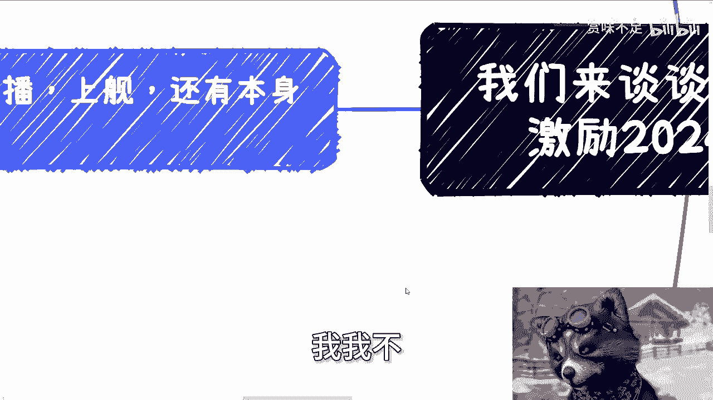

我给B站线上反馈bug就反馈过两次。

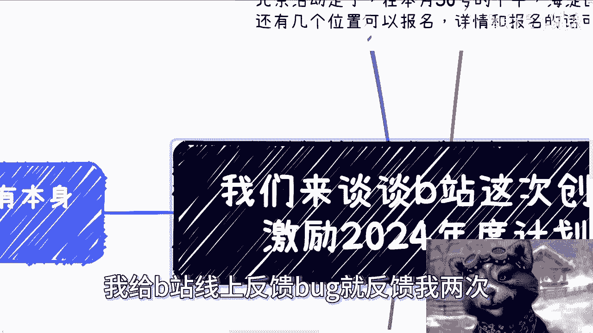

我都不知道这些bug是怎么出现在线上的啊，然后这个是第五点，最后一点，所以啊我总结一下啊，我觉得就是说你不是考研考编的料，你就不要硬去干对吧，你又不是没路走，你除了你但凡硬去干。

除了消耗原版的up主跟用户，我觉得没有别的作用了，你等于在洗，你等于在洗牌对吧，就是我觉得他但凡这样硬切等于在洗牌，就是把以前的沉淀洗掉，然后引入更多的垃圾，我说实话就更多的垃圾，为什么。

因为按照目前中国的发展跟互联网的发展，能沉下心做事情的人，能沉下心积累的东西，人越来越少了啊，你越往前看，质质量越来越高的，你越往后看越来越垃圾对吧，所以说要么我觉得不要去赶走自己的路，去别的方式找钱。

不是说放到up主和用户手上去来找钱对吧，你你我觉得这本来就是平台，或者说企业家或者资本家应该去做的事情，你要真的要靠大家一起来赚钱，比如说你现在做的这种课程或者说收费视频，其实靠的是大家一起来赚钱。

平台拿平台的费用对吧，然后up主拿up主的费用没问题啊，那我觉得你给我们分股票，对不对，这叫大家一起来赚钱的逻辑，然后我觉得要么就是给动漫游戏，舞蹈区提供一些垂直类的，那个更贴合他们用户的变现方式。

比如说带货啊，盲盒啊，联名啊对吧，或者说提供各种各样的这种服务啊，你也能提供不错的收入，毕竟都知道我觉得二次元钱好赚对吧，那么你就做事情来讲，你需要看时代，看上下文，看自己有什么，而不是看别人有什么哦。

你看到比如说别人都有带货啊，都有电商啊，别人做NFT，别人做知识变现好，你也做B站，的确做了没毛病，你们去看好了，的确做了，鼓励大家什么直播就鼓励带货对吧，也做了那个高能量对吧，也做了那个数字数字藏品。

但是你做了就等于四，不像别人做的都会有特点，因为什么，因为你们的基因不一样啊，然后我听小道消息就说啊，我说那个呃去年B站换了一个，换了管理层吧对吧，就是说大力推广这个变现逻辑，这事儿做得很对。

这事儿也是个好事儿，我也很开心，但感觉是什么呢，就是这个人或者这一堆人啊，上来之后就是大刀阔斧一刀切，那这事儿不是这么干的啊，我觉得这事儿就不是这么干的，那当然啊我了解也不多啊，就是我我也说了。

我玩的也不多，可能说的比较肤浅啊，但是我真实的感受我觉得就这样子。

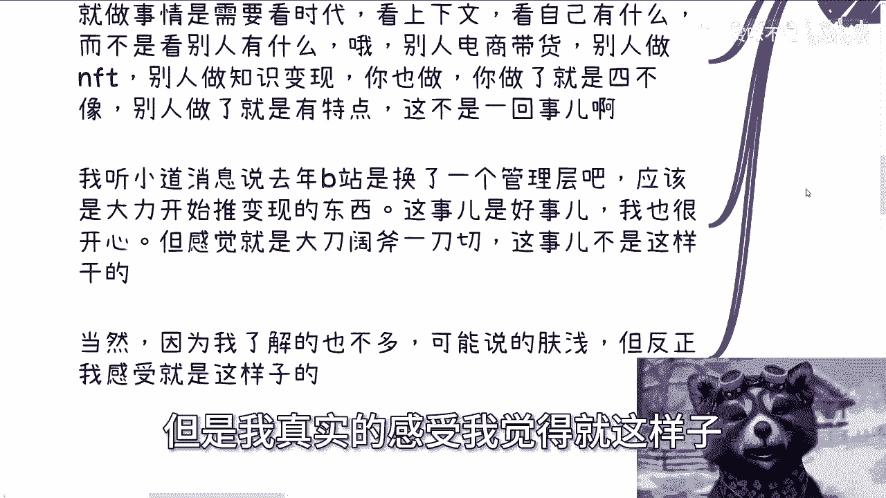

就是最近只要来跟我提谈谈论这个东西呢，我就会觉得就说急啊，真的是急了，但是急了呢，就是我觉得其实迷茫的是，各种up主跟各种用户啊，就大家可能会一脸懵，而且蒙的非常懵啊，你说在当下这种情况，商单越来越少。

商单的单价也越来越低，制作成本其实并不降低对吧，然后你说啊，真的，我是觉得就是大家在平台上创作的东西，都很不容易，自己能有一些分享欲，或者自己真的能愿意为大家讲些东西都不容易，而平台更多的应该是啊扶持。

更多的是呃资本运作，然后从呃就是就是别的渠道赚钱的来分给啊，我们觉得这些创造者或者这些散户，而不是说还要再从这些散户身上再去吸血，唉那当然吸血可能说的不好听点啊，但是我觉得这个逻辑就是这样子的。

没必要真没必要，但不管怎么样吧，反正我就说一下我的看法啊，毕竟我我反正站在我的这个这个商业的角度吧。

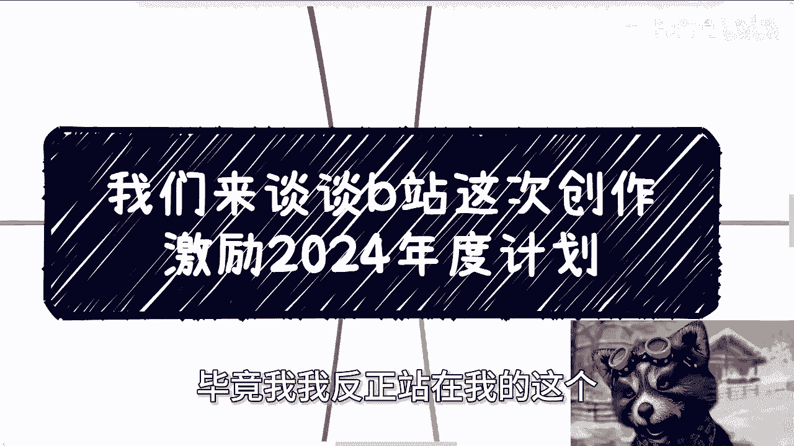

啊行那就这么着吧，然后北京那个报名大家继续报好吧，然后呃大家要有什么商业上的职业上的啊，然后什么股权上的啊，这个融资上的对吧，或者说你们手上有什么牌，你们你们不知道。

就是说在当下这种经济环境和国家的这个，经济环境下面，怎么往前走的对吧，那么你们可以觉得时机合适的话，整理好问题，然后我私信我，然后再做咨询好吧。

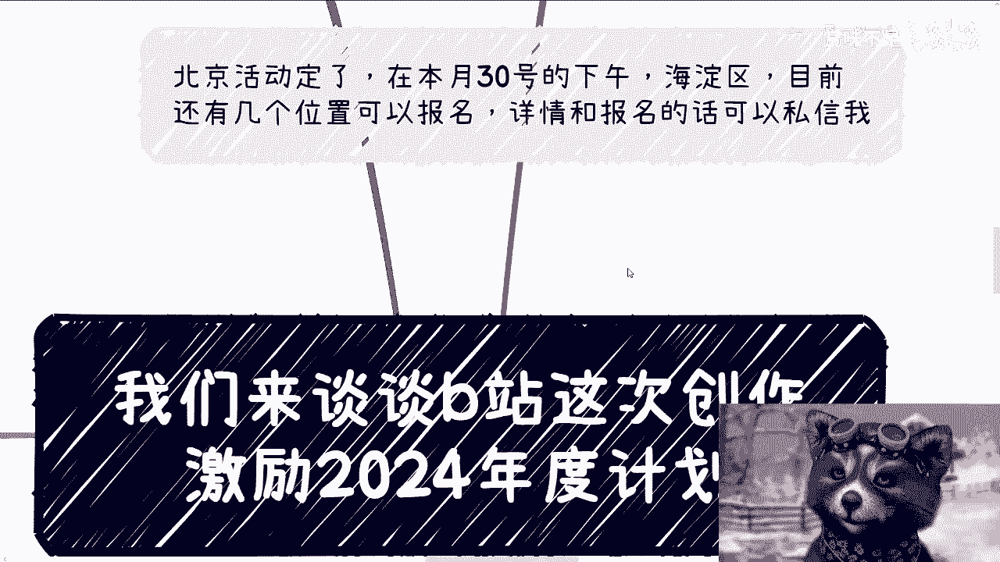