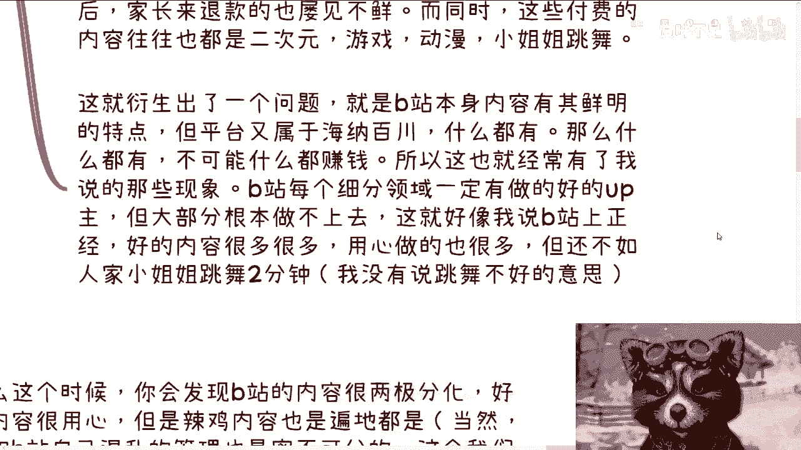

# 来谈谈b站这次2024的创作激励年度计划吧---P1---赏味不足---BV1n2421P7pQ_n

在本节课中，我们将深入探讨B站近期推出的2024年创作激励年度计划。我们将从一位创作者的实际体验出发，分析该计划的各项新功能（如充电视频、付费课程）及其背后的商业逻辑，并探讨其与B站平台特性、用户画像的匹配度问题。

---

## 概述 📋

B站近期更新了其创作激励体系，推出了包括多档位充电视频、付费课程在内的新变现功能。本节内容基于创作者“赏味不足”的一手体验与观察，旨在剖析这些新举措的动机、潜在问题及其对平台生态可能产生的影响。

---

## 创作者年度体验与激励现状 💰

上一节我们概述了课程主题，本节中我们来看看创作者在现行激励计划下的真实收入感受。

我从事B站创作约一年时间，最大的感受有两点。第一点是平台激励金额确实很少。我每日收入大约在15至20元人民币，这算是比较高的水平。我的视频内容简单，无复杂特效与剪辑，本质上属于低成本创作。但思考选题与如何清晰表达观点，仍然耗费大量时间。对于团队化运作的创作者而言，这点激励完全无法覆盖成本。

此前传闻B站激励丰厚，但我并未赶上那个时期。我认为这与平台的发展阶段有关。

---

## 对新变现功能的初步观察：充电视频 ⚡

在了解了基础激励情况后，我们来看看B站新推出的核心变现功能之一：充电视频。

我参与了充电视频功能的内测。最初该功能仅设三档价格（6元、30元、50元）。但在近期，我收到通知，该功能已扩展至十档，且价格设置较高。

从商业逻辑上看，B站寻求变现是正确且必要的方向。但问题在于，其变现策略的调整显得过于急促和生硬。这好比一个积累了独特技能的人，突然放弃所有特长，盲目跟随大众趋势去“考研考编”。B站似乎正无视其平台特点与用户画像，进行“硬转型”。

---

## 平台基因与内容变现的矛盾 🧬

那么，为什么说B站的“硬转型”可能存在问题？这需要从其平台基因说起。

B站用户群体相对年轻，包含大量未成年人和学生。其传统付费场景（如直播打赏、上舰）高度集中于二次元、游戏、舞蹈等领域。这是平台长期积累的特点。

然而，B站内容分类海纳百川，覆盖众多领域。一套通用的变现模式（如充电视频）很难在所有垂直领域都奏效。这就导致了一个现象：B站每个细分领域都有头部创作者，但绝大多数创作者难以依靠平台通用变现工具获得可观收入。用心制作的高质量内容，其流量和收益可能远不及一段简单的游戏集锦或舞蹈视频。

这种现象与平台的用户基因、内容推荐算法密切相关。

---

## 深入分析：充电视频与知识付费的逻辑 🤔

承接上文对平台基因的讨论，本节我们具体分析“充电视频”作为“知识付费”载体的合理性。

充电视频的本质是知识付费。但核心问题是：B站用户认可并愿意为什么样的“知识”付费？

对于许多年轻用户而言，游戏攻略、动漫解读、虚拟偶像内容可能就是他们愿意付费的“知识”。而平台新推的、更广义的“知识付费”课程，其受众规模和付费意愿可能存疑。B站虽然是重要的学习平台，但为深度知识付费的用户基数可能不足以支撑一个泛化的付费视频生态。

对于创作者而言，区分“免费内容”与“付费内容”是一大挑战。许多创作者并不清楚哪些内容值得收费。此外，如果创作者具备强大的变现能力，他们为何一定要通过平台渠道并接受分成呢？平台提供的曝光价值（例如“起飞计划”推广服务）其效果也常被创作者质疑。

---

## 付费课程功能的定位尴尬 📚

除了充电视频，付费课程是另一项新功能。但在我看来，其定位颇为尴尬。

B站多次邀请我开通付费课程，但我始终未开通。原因如下：第一，我不认同贩卖通用性课程的模式，这容易演变为“割韭菜”。第二，如果要做针对性强的解决方案，充电视频功能已可满足需求；如果要做通用课程，则与平台属性不符。

B站不是专业的在线教育平台（如网易云课堂、得到）。在知识付费赛道红利期已过、平台自身特性未变的情况下，强行推出此功能，显得时机不当且定位模糊。

---

## 其他变现途径与平台管理问题 🛠️

当然，B站的变现途径不止于此。但其他方式也存在类似问题。

例如“直播上舰”，这种模式依赖强烈的粉丝粘性与社群文化，并非适合所有创作者或内容领域。它更像一种强化版的打赏，而非普适的变现工具。

更深层的问题可能在于平台管理。作为开发者，我曾两次向B站反馈线上bug，这些低级错误能出现在生产环境，令人费解。平台内容生态中，抄袭、诈骗等内容也时有出现。在急于寻求变现的同时，平台在基础体验维护、算法优化、社区治理等方面的投入似乎不足。

---

## 总结与建议 📝

本节课我们一起学习了B站2024创作激励年度计划的新动向，并从创作者视角分析了其面临的挑战。

总结来说，B站寻求商业化变现的**逻辑正确**，但**执行策略**值得商榷。主要问题在于：
1.  **转型急促**：未充分考虑平台发展阶段。
2.  **忽视基因**：推出的泛化变现工具与平台核心用户（年轻、二次元）的付费习惯脱节。
3.  **功能定位模糊**：如付费课程，与平台属性结合不紧密。
4.  **基础建设滞后**：在推动变现的同时，算法、运营、治理等基础能力有待加强。

建议平台方：
*   **发挥自身优势**：围绕动漫、游戏、舞蹈等优势领域，设计更垂直的变现方式（如联动、周边、众筹）。
*   **赋能而非吸血**：商业模式的思考应是如何与创作者共同做大蛋糕，而非单纯分食创作者现有的收益。
*   **巩固基础**：优化推荐算法，加强社区管理，提升开发者体验，夯实平台根基。

当前的调整给许多创作者带来了迷茫。在商业合作减少、制作成本不降的背景下，平台更应思考如何通过资本运作等方式从外部获取收益，反哺创作生态，而非急于从创作者和用户身上寻求变现。