# 来谈谈培训机构，一定要透过现象看本质 - P1 - 赏味不足 - BV14M4y117Re

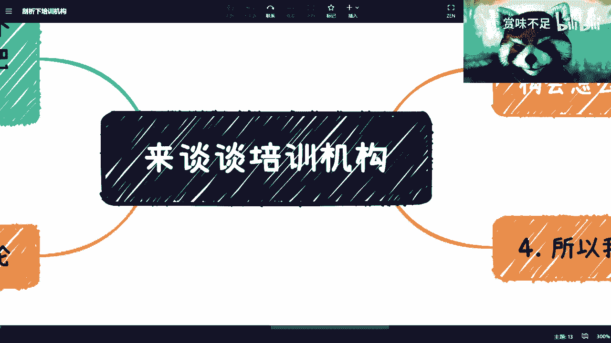

好啊大家好，这一期呢我们来讲一下这个培训机构啊，这个东西呢这个我觉得啊就大家都接触过对吧，这个多多少少也都被割过，然后跟这个东西比较接近的呢，就是这个知识变现是吧，但我跟你们说啊。

这两个东西是两个逻辑啊，这个回头我会把知识编再讲一下。

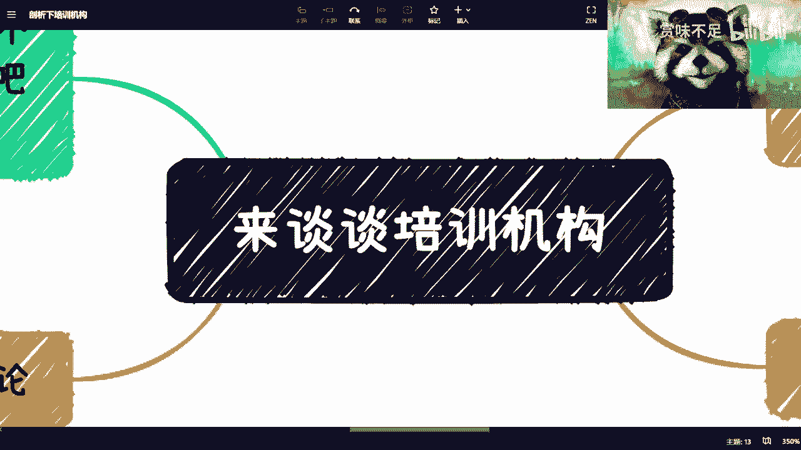

好那首先呢我跟你讲啊，这个东西是这样子的，培训这个东西呢，很多人其实我跟你讲真的不懂啊，真的不懂，我跟你说，你你说简单吧也简单。

你说难吧也难啊，然后呢我跟你说啊，这节课啊，这节课主要讲的是什么呢。

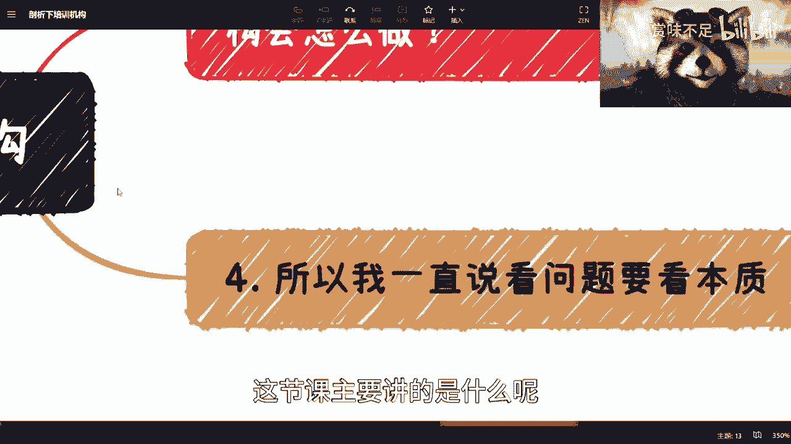

就是我一直说看问题要看本质，就是你要看的是那冰山的百分，就水下的那80%对吧，你不能老师看到这个冰山。

水上的那20%是吧，那么你看啊，首先第一点简单来讲，培训是个什么东西呢，你就是一个第一你得有课程，第二你得有用户对吧，第三就是说你得比如说一个班一个班结束对吧，你可以结束的时候有些什么接证啊。

毕业证啊对吧，什么什么乱七八糟的东西对吧，那可能还有个售前售后对吧，那这个是运营上的事，那么简单吗，简单的，而且培训有很好的很好的好处是什么呢，就是它的现金流快，对吧，这是第一个，第二个呢难在哪里呢。

难在就是to c to b to g什么呢，就是to个人对吧，Q企业出政府出高校，你会发现这四个方面都有培训可以做，都有咨询可以做，对不对啊，那无论是什么模式呢，就关键是什么，就是无论是这四个方面。

无论是你要去走的模式也好，还是说整个的这个叫做培训的关系也好啊，包括培训班中的一些套路也好，都是不一样的哦，就是你说难嘛也难的对吧，因为每个东西他打法不一样，你手上也许有一张to c的牌。

但这张图C的牌不见得能to b啊。

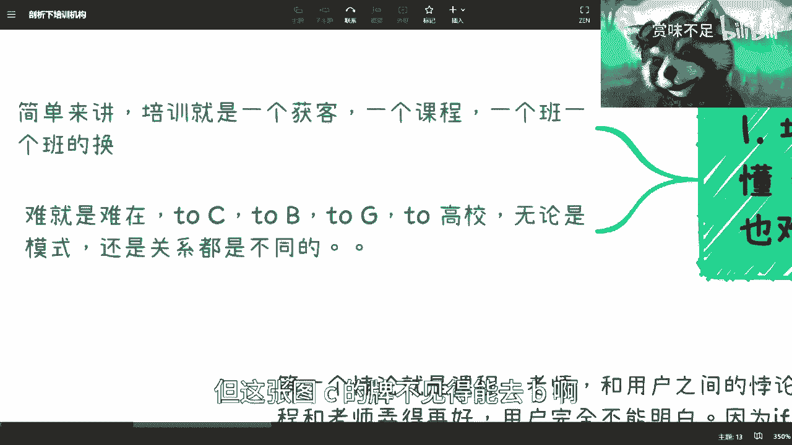

更不见得能去G对吧，很不一样。

这是第一点，第二点呢培训两个悖论啊，这个东西我跟你讲是核心核心中的核心啊。

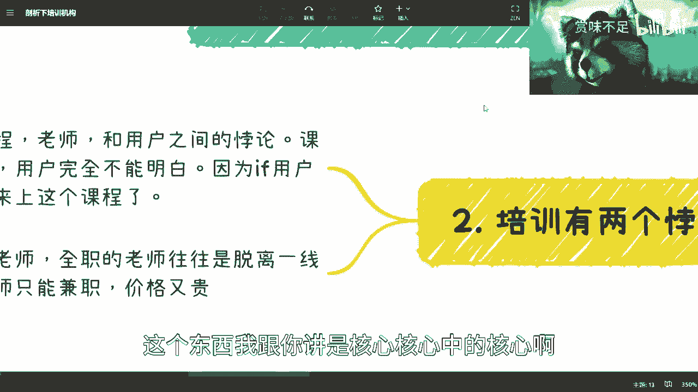

不行我得先打广告啊。

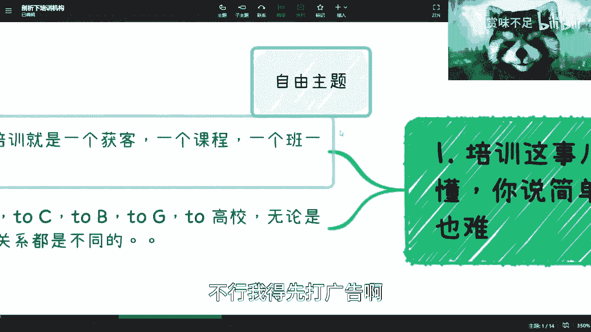

新南港广告对吧，就是对这个职业规划啊，对这个个人发展，对创业对啊等各方面有需求的，你们可以付费咨询我好吧，反正也不贵啊，付费咨询我，我跟你讲啊，悖论悖论是什么呢，第一个悖论。

就业课程老师和用户之间的悖论，什么意思呢，首先啊你想啊，你今天弄一个培训课程跟老师弄得再好，用户能明白吗，就是你的受众会明白吗，不能为什么，因为这个用户明白了，那么他就不会来上这个课程。

你想想看是不是对吧，比如说这个用户他为什么会来上课，是因为他可以自己在这个获取信息的能力上面，有缺有缺陷，或者他没有办法获取到更高级的信息，但是从如果你你想啊，就是你如果咨询我，我跟你沟通。

那么我们是针对你的现状，你的个人的兴趣爱好，你个人的情况，我来给你针对性的方案和建议对吧，这个东西呢这个时候呢，就是说你至少会明白我讲的是什么东西对吧，因为你不明白我讲什么东西，你可以拒绝付钱给我。

对不对，好，但是培训这个东西不一样，培训这个东西呢它是一个一对多的，它不是一个一对一的事情对吧，但凡一对一，我跟你讲培训也不会做成现在这个样子，它是一个一对多的，那么一对多的时候。

你会发现一个什么问题呢，就是说这些用户他之所以会来付钱，是因为他们自己觉得你的课程很有吸引力，你的课程宣传的很有吸引力，或者说他们觉得你的课程，在某些角度能给他们赚钱，能给他们去就业。

但是它有一个共同的特点是什么，就是这个用户本身啊，他可能从他的认知角度啊，记住啊，不是你的认知角度，是他的认知角度，觉得你这个课很有用，而不是你的认知角度，从他的认知角度觉得你这个课能够给他赚钱。

不是你的认知角度，从他的角度觉得你这个课能够给他去，这个叫什么就业对吧，就是跳槽，而不是你的角度，那么意味着什么呢，意味着就是说他就算被割韭菜了，他也不会觉得他被割韭菜，而直到他把这个课上完之后。

他会去，他就发现诶这个课其实没卵用，他才会觉得被割韭菜的对吧好，那么这个时候你就会发现一个什么问题呢，就是这个课程跟你这个老师弄得好不好，用户是完全不能明白你的用心的，用户也是不能get到你里面的精髓。

也就是说用户的确只能看到那雪山，10%的冰山，连剩下的90%和水下的80%，他都看不到，就这么个逻辑对吧，但凡他看得到，他能够明白，我相信他是不会来付钱的，你要说今天有一个人，比如像我对吧。

你说你让他这种用户去咨询，我觉得他会的，你让他付个什么几千块钱去做个培训，这个什么上个培训课，我不可能的啊，这不现实的，我觉得这一类能明白的用户，他是不可能付一个培训费去培训的，除非是什么。

除非是一个硬技能，或者说是一个能够给他一个什么什么补补充，那个ENBA学历的对吧等等等，这个我觉得是OK的，但你如果纯粹的是某一项单纯的东西，比如说什么GPT啊对吧，夹吧Python啊对吧。

什么什么什么很多技能类的，我不会的，不可能的啊，好这是第一个悖论啊，第二个悖论是什么呢，就是老师全职的老师呢往往是脱离一天的啊，我这个地方稍微还对吧，留了一些余地啊，我觉得这啊这这样说啊。

肯定是脱离一线，而一线的老师呢你要真的做难，也只能兼职，并且价格肯定更贵，因为你想嘛你全职老师，你给他交个社保发放工资，他就是你的驴了，对不对，随便使唤啊，但是你一线的老师如果兼职的话，很简单。

按次收费对吧，N次收费，你比如说他们现在找我去讲区块链对吧，讲一些数字经济，那我至少一天现在是1万5，我不管对吧，那他们找我肯定没有他们老师来的便宜啊是吧，我可以抵他们老师一个月的工资是吧。

所以说呢这个事情就会有，你知道有一个什么问题呢，就是你到底是选择前者呢，还是选择后者呢对吧，那有些人啊很聪明啊，然后就说刘老师，我有个想法，我是前前者加后者，我跟你讲对可以，但是你要这么想。

你前者加后者依然没有人家全部是前者来的，赚钱依然没有人家全部前者来的卷，你怎么卷的动，你卷不动好，这个是这个是两大悖论啊，这个是两大悖论，咦哦我跟你说，这个当中为什么我要把这个东西强调一下啊。

是因为这件事情是很多人的误区，就是很多人，很多人他都觉得我做一件事情的前提是什么，是我要把这件事做好，我的目标是做好再赚钱，NO非也，你知道吗，我跟你说，培训这个东西，它只是一个引子。

很多东西道理都是通的，就是你要记住你第一第一件事情你要先赚钱，而不是先把事情做好，为什么，因为你要明白你把事情做好有有用吗，没有卵用，你要把什么呢，你要把用户感觉你把事情做好了，你才是有用的。

而用户感觉你把事情做好的结果是什么，就是你能赚钱，你明白吧，你能性价比高的赚钱好，那么你们这时候又要说了，驴老师啊，你这个说法就好像用户是一样，诶没错，不好意思，会买单的，会付钱的，的确是，我说的没有。

我觉得你说的没有错，中国这么多人，80%是，这基本盘在这个地方，你怎么办呢，对不对，没办法点，所以我才跟你们讲的。

你不割总会有人去割，有什么区别的，没区别的是吧。

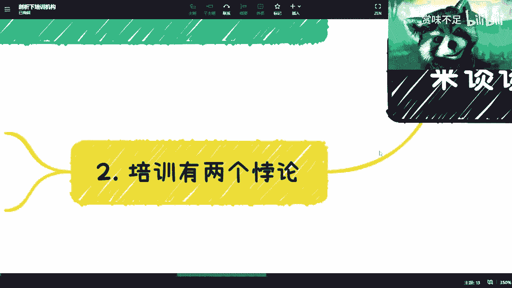

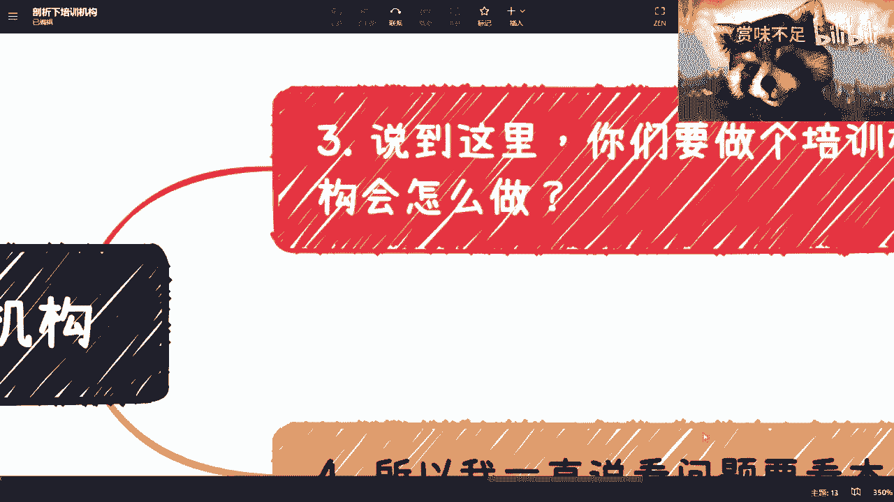

对吧，那那第三点啊，你看啊。

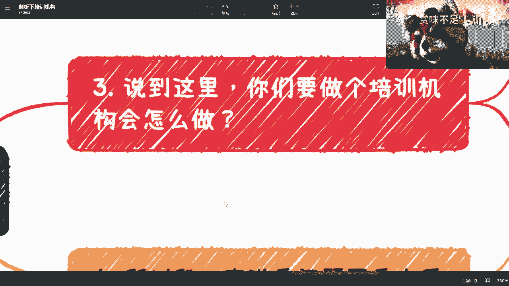

说到这儿啊，你们要做陪我们打个比方啊，说到这里打个比方。

比如说我们要去做个机构，比如说你们跟我对吧合作，你说我们做培训机构，你会怎么做呢。

你想啊我就问吧，你们自己做，我什么都给你们准备好，什么课程啊，老师啊，渠道啊，全部都给你们准备好好，然后这个时候呢我给你这给你们给你们一张表，什么表呢，就是成本成本表对吧，比如说哎这个渠道打个比方。

每个人啊，比如说一个月收费2万对吧，这个这个老师啊，全职这个一个月2万对吧，这个人兼职的，比如说一次可能8000对吧等等等，我给你张，给你给你们张表对吧，就算你们一开始按照最高标准做，什么叫最高标准。

就是所有的事情，是朝着把事情做好的标准去做的对吧，但是你做着做着你也会被卷成，只能利益最大化，为什么，因为你要活下去，对不对，就是你的你来做一件事情的目的是赚钱，但是赚钱的最大前提是你得先活下去。

如果你今天活都活不了，你还赚什么钱，对不对是吧，所以说我但凡给你们这张表，我相信啊，这个世界就是五五开的，有50%的人是想把事情做好，给我一个说哎，我选择ABCDE这么一个排列组合。

还有50%的人呢是以利益为主的，我就要这个这个最便宜的对吧，就是DEFG阵容组合对吧，我跟你讲都有的，但是你会发现每个人都有每个人的立足点，每个人都有每个人的想法啊，有的人说我要产品好。

产品不好是做不好的，有的人说我就是要是那个营销，营销做得好才能做得好，但我跟你讲本质上是什么，本质上就是你只要让用户觉得，让你的客户觉得你是做的好的，你的东西好不好并不重要，因为我可以告诉你们。

不管我现在卖软件，卖，卖培训还是卖任何东西，我这么跟你们讲，大概率卖出去都是一坨屎，你知道吧，就你们别看不起那些这个这个叫什么，就是给BT给给京东啊，给自己做的外包啊，我跟你讲。

我们现在真正大部分什么招投标啊，什么乱七八糟交出去的东西，他妈的连外包的产品质量都不如，就是一坨屎，你知道吗，这图我跟你这么讲吧，这坨屎成本可能就20万，你卖出去可以卖200万，就这么不简单啊。

所以说呢你会发现培训的这个逻辑啊。

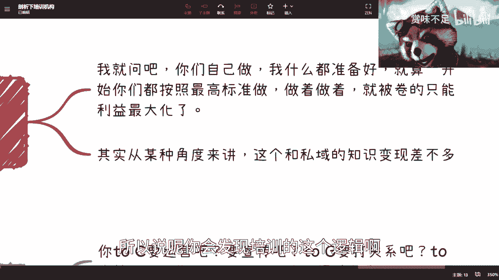

就是在这个叫做就是在这个叫做啊悖论啊对吧。

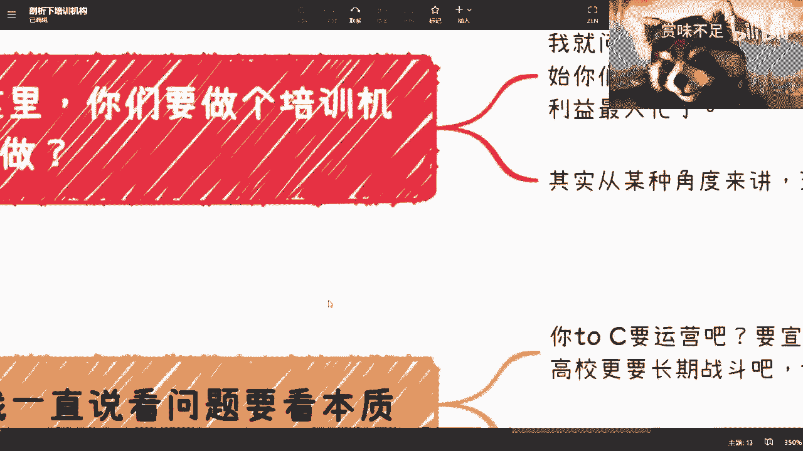

包括困难程度啊等等等。

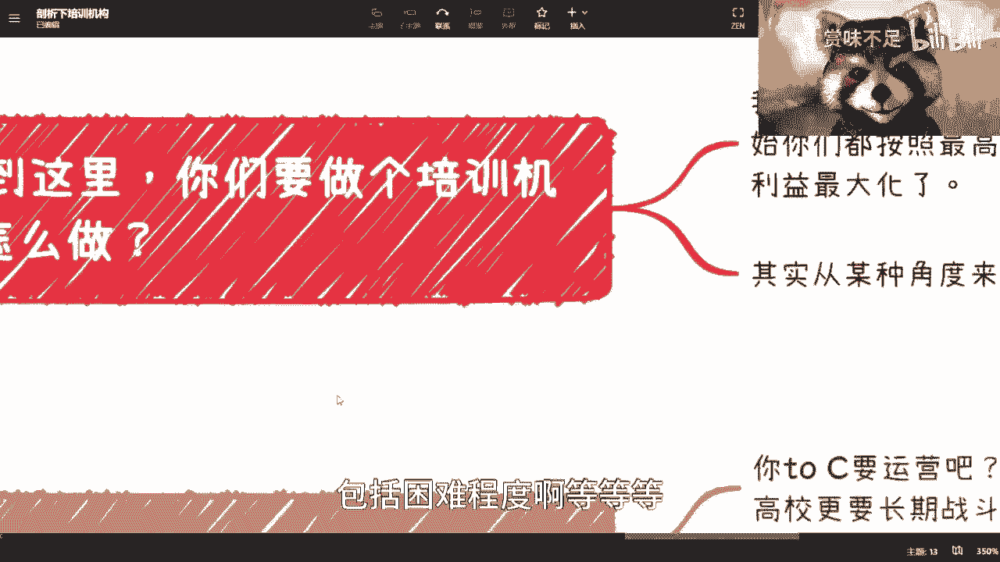

他从某种角度来讲呢，其实跟思域的现在知识变现差不多啊，但是还是有点区别的。

这个回头我会再单独开一期，我再跟大家讲哦，所以呢最终呢我就跟你们讲了，就是你们看培训有很多人就跟我抱怨，他说哎我的，我被平均公司坑了对吧，我被割韭菜了啊，我去付钱了，我没学到什么东西，哥哥们姐姐们。

这个弟弟们妹妹们是吧，那老爷们，你们用你们的膝盖想一想，就我们刚刚得出的结论啊，你被割不是正常的吗。

他们骗你不是正常的吗，我就请问就是就是这么个情况。

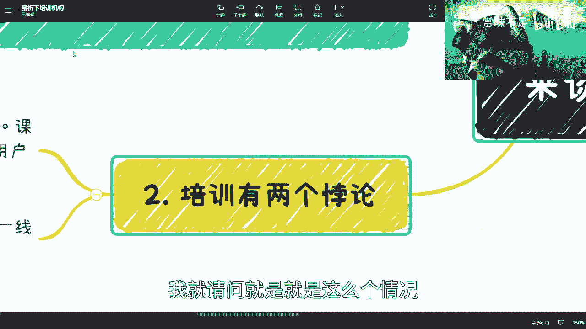

整个的就整个的市场是这个样子，谁去做，谁不割，你去做，你也割。

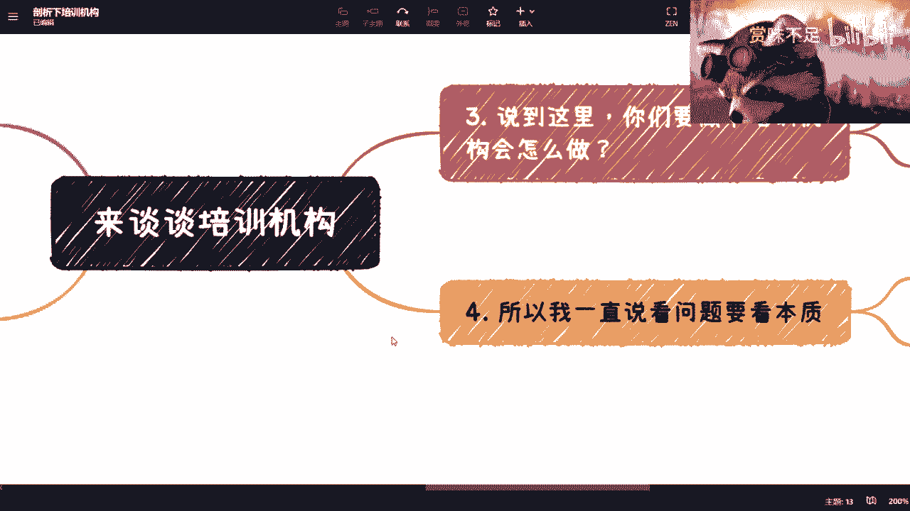

你去做，你也骗，否则你活不下去，你明白吧，就是我为什么说要看本质，是因为你不要去怪人家，你懂吗，就是看问题你得全面的去看你。

你指我我我跟很多人其实问我的时候，我就会跟他讲，我说这个事，你说人家骗你好，人家哥你也好，你说是不是事实是事实，但是我说按我的说法啊，我说你更应该想的是件什么事情，你就当做交学费认栽了，你知道吗。

你就当做是一个是一个叫什么，就是就是交学费学会了这件事情，就是你学会的是什么呢，学会的，不是说我以后不能再去不相信培训公司了对吧，我我我不能再去被骗了，我不能怎么样了，不是的，你得学会的是看它的本质。

它为什么会变成这样子，你懂吗，他不是说一开始就是这样子，你要你要说任何一个产业，一开始就是个割的产业，不可能的，他一定是有他一个转变的逻辑在这里面的，你知道吧，哦那么你想想看，QC要运营吧，要宣传吧。

QG要打关系吧，要喝酒吧to高校，要长期战斗吧对吧，To to be，要提前复出吧，你很多东西都需要投入的，你要做公司的话更不得了，公司成本，人员成本对吧，然后交税啊。

然后那个那个叫什么五险一金多的去了，你有没有想过这些问题啊，你懂吗，所以说你说现在这个培训对吧。

在这个两大悖论的情况下面，我说的不好听点，你们所有人但凡去做，你们只会做，最终啊我不我不管你们一开始怎么想的，你们最终只会做一个选择是什么，就是我课程就垃圾一点好了，我就包装好一点，其实他妈的很垃圾的。

对不对，然后我用户哦，我那个老师就找最垃圾的，我包装好一点对吧，就是比如说一本毕业的，我就说他妈MIT毕业的鬼，他妈知道对不对啊，然后老师我就我就全部全全职的嘛，然后压往死里压对吧，比如一个1万的老师。

我就他妈的我我不要，我就照5000的对吧，你给我背，把人家的课抄过来背，对吧啊然后你你你你去教呀，怎么样了啦，无所谓的啊，只要宣传做得好，怎么了呢，割了就割了，反正付钱买单认怂，有问题，不来没问题。

你看为什么要这么做呢，是因为他只有这样才能赚钱啊。

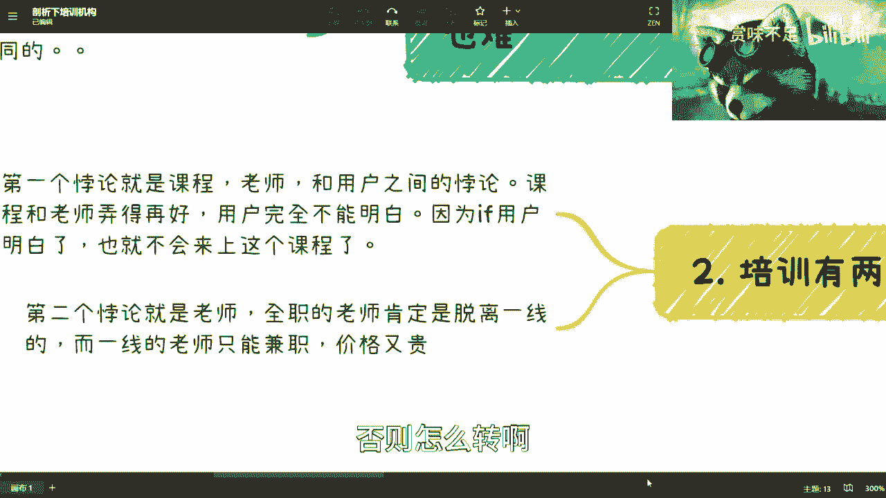

否则怎么转啊，贴钱做，对不啦。

所以你们想想看，就是这个事，你们想想看，扩展到别的行业，扩展到你们现在要去应聘，你知道吗，扩展到几年后的招就是工作对吧，就业你知道吗，你们面临的情况就是这个样子的一样的，你懂吗。

就是为什么我一直说全职工作很难做的久，在未来更难做的久，是因为整个世界往后发展，它只能卷表面的东西，你这个人到底怎么样，真根本就不知道，而学历这种东西在你一开始应届的时候，的确有那么点用。

但是两三年之后基本上就没有用了，因为表面的东西是什么，表面的东西就是你去了什么公司啊，你能不能加班啊，你薪资能不能低一点啊对吧，你你能你性价比能不能更高一点啊，你会不会这些会不会那些啊对吧。

就没了就往死里卷呗，大家就大家就往这条，我跟你讲就不归路上慢慢走啊，越走越远。

唉当然了，也有人会说嘛，他说驴老师。

你这过于悲观，我跟你们讲，我就这么问，你们卑微悲观。

我先不去说啊，我就这么问你们培训现在是这么个情况，我就问你们啊，培训这个情况如果要改变，你想想有多么难，你自己就随便用的膝盖。

想想有多么难，他有多难，你刚刚说我多悲观这件事情，你再想想看是不是悲观啊。

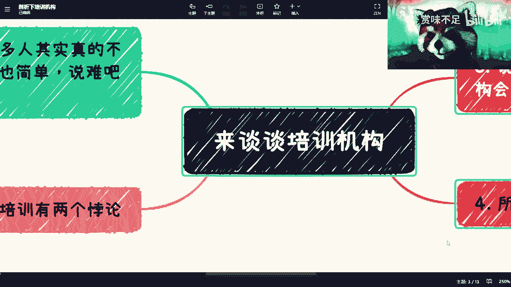

你自己往后想啊。

