# 培训机构本质解析教程 - 第1课 🧐

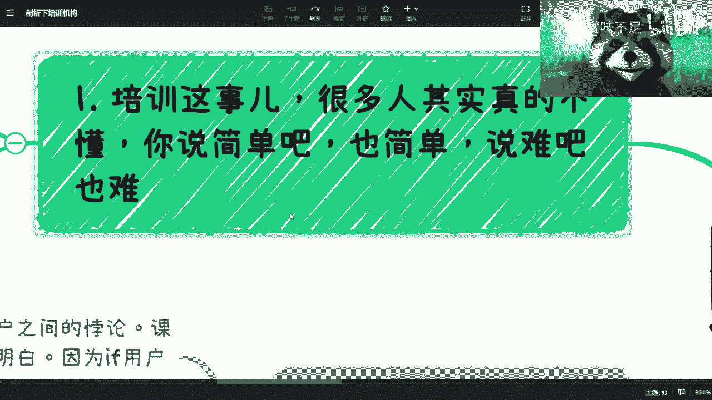

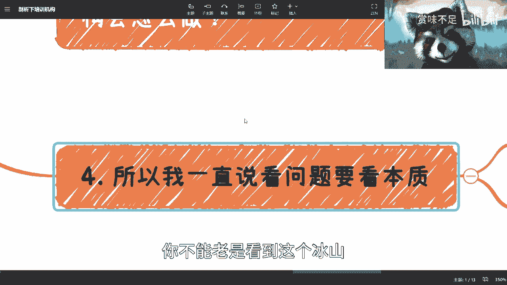

在本节课中，我们将深入探讨培训机构的商业模式与核心逻辑。我们将分析其表面现象下的本质，理解其运作中的关键悖论，并探讨这些逻辑如何延伸到更广泛的社会与职业领域。

## 概述 📋

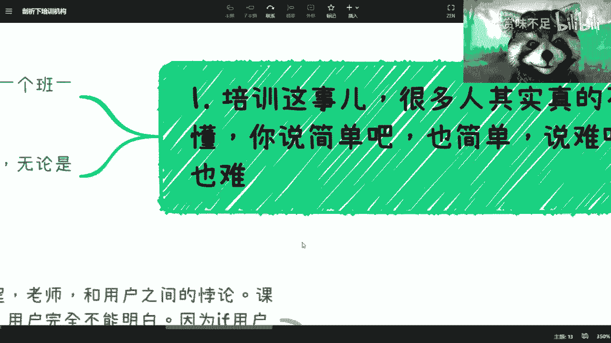

培训行业是一个普遍存在且复杂的领域。它与知识变现有相似之处，但底层逻辑截然不同。理解培训机构的本质，关键在于看清其水面之下的运作机制，而非仅仅关注其宣传和表象。

## 培训的基本构成

从运营角度看，一个培训机构的核心要素相对简单。

以下是其基本组成部分：
*   **课程**：提供教学的内容产品。
*   **用户**：购买课程服务的消费者。
*   **班级与认证**：以班级为单位组织教学，结业时可能提供证书等。
*   **售前与售后**：涉及市场推广与用户服务等运营环节。

这种模式的优点在于现金流回收快。然而，其复杂性体现在不同的目标客户群体上。

## 培训的复杂性与核心悖论

上一节我们介绍了培训的基本构成，本节中我们来看看其真正的难点所在。培训的难点在于其服务对象多样，包括个人（To C）、企业（To B）、政府（To G）和高校。针对不同对象的打法、关系和套路完全不同。手握一种成功模式，未必能复制到其他领域。

更核心的挑战在于行业内部存在的两大根本悖论。

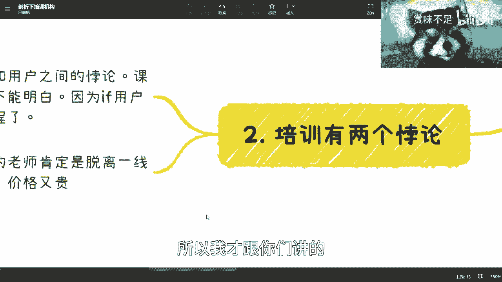

以下是培训行业的两大核心悖论：

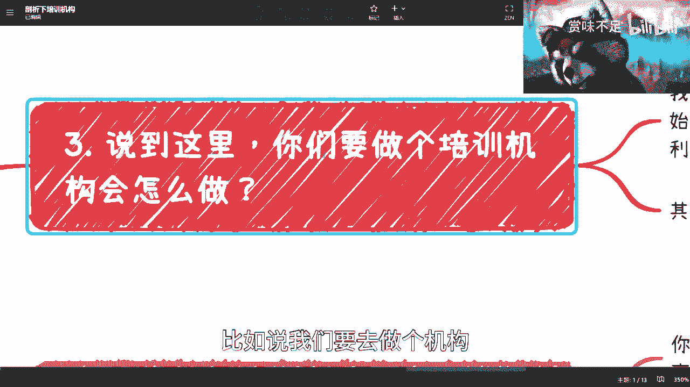

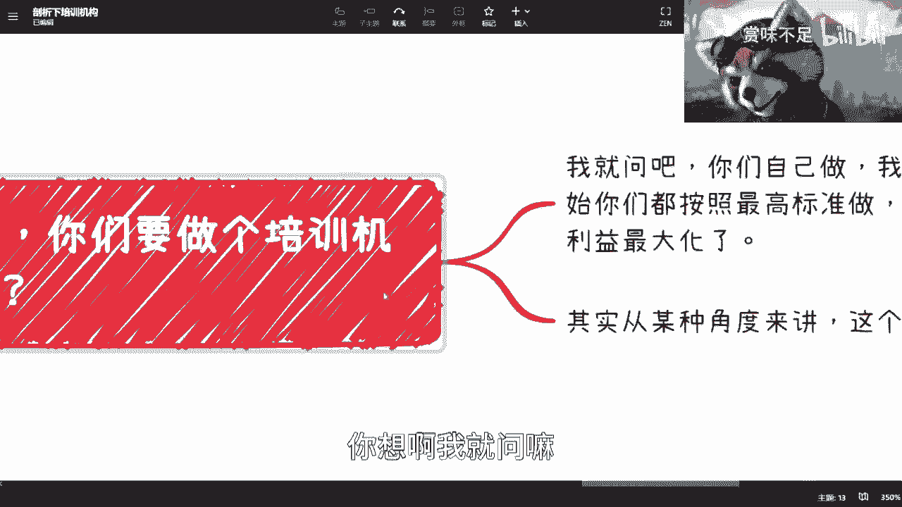

1.  **认知悖论**：优质课程与用户认知之间的错位。
    *   **逻辑**：用户因自身信息获取能力有限或认知局限而付费报名。他们基于“自己的认知”判断课程有用，而非基于课程实际的“客观价值”。这意味着，即使用户最终没有收获，在付费那一刻他们并不认为自己会被“割韭菜”。公式可以表示为：`用户付费动机 = f(用户主观认知) ≠ 课程客观价值`。
    *   **结果**：用户通常只能看到课程宣传的“冰山一角”（约20%），无法理解课程设计者的深层用心（水下的80%）。真正能看清课程本质的用户，往往不会为普通技能培训付费。

2.  **师资悖论**：教学效果与商业成本之间的冲突。
    *   **逻辑**：全职教师容易脱离行业一线，知识可能滞后；而身处一线的资深从业者若兼职授课，则价格昂贵。机构若想兼顾，成本会大幅提升，在市场上缺乏竞争力。
    *   **结果**：在生存压力下，许多机构倾向于选择成本更低的全职教师，并对其进行包装，而非聘请高价的一线专家。这导致了教学质量的潜在下降。

## 商业本质：感知优于事实

理解了核心悖论后，我们需要看清培训乃至许多行业的商业本质。许多人认为做事的前提是“先把事情做好，再赚钱”。但在培训领域，这个逻辑是行不通的。

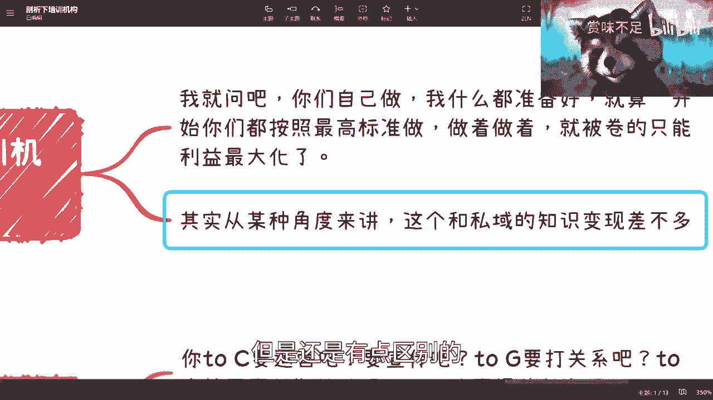

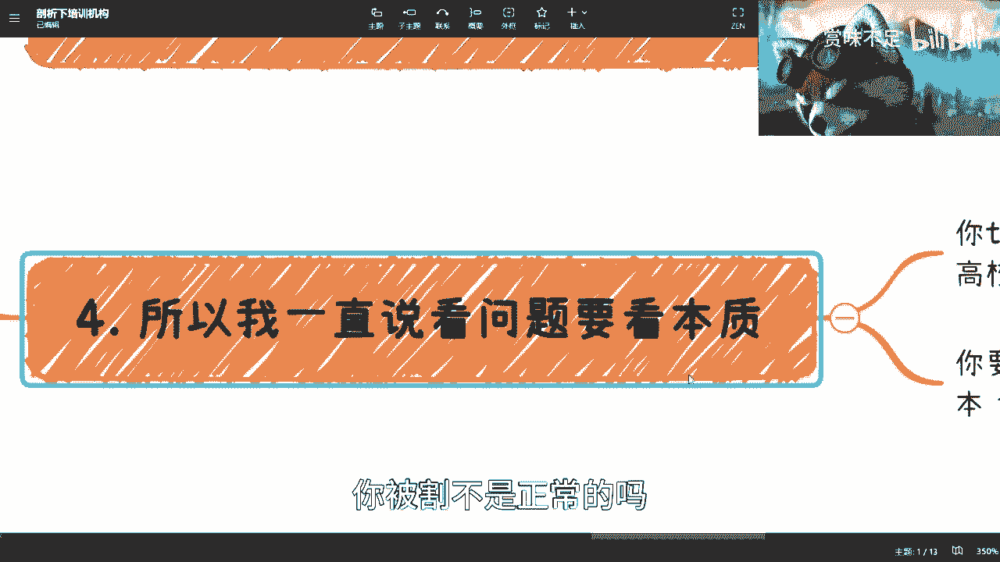

关键在于：**让用户“感觉”你把事情做好了，比你“实际”把事情做好更重要**。因为只有让用户产生这种“感觉”，你才能获得付费，才能生存下去。在巨大的市场基本盘面前，满足用户“感觉”的需求，成为了最有效率的生存策略。

因此，抱怨被培训机构“割韭菜”是正常的。在当前的悖论结构和市场环境下，如果由你运营一家培训机构，面对成本压力（如渠道费、教师工资、运营开支），为了活下去，你很可能会做出同样的选择：**优化包装和宣传，同时压缩课程与师资的实际成本**。

## 从培训看更广泛的现实

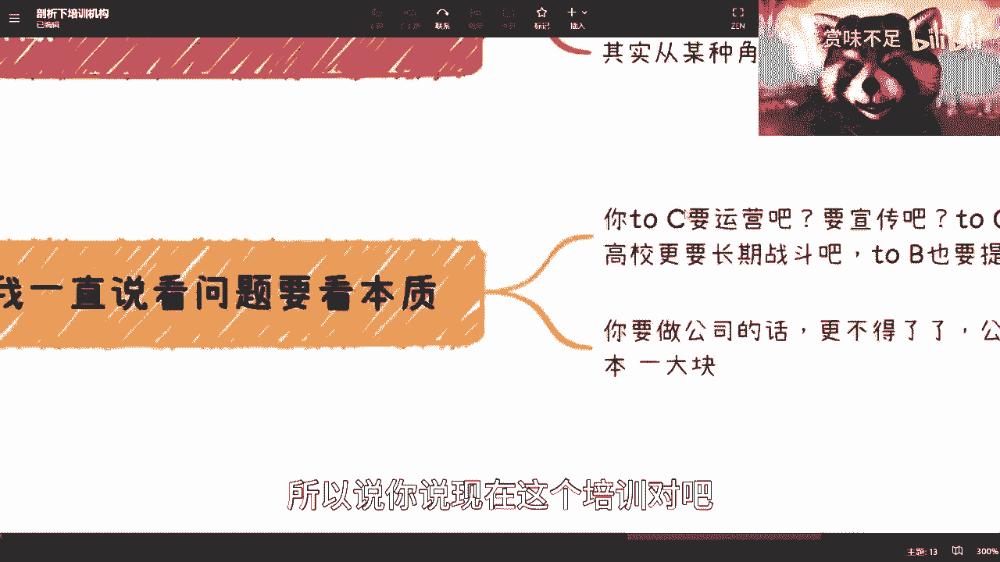

培训行业的逻辑并非孤例，它能映射到更广泛的社会和职业领域。

以下是其延伸思考：
*   **职场现状**：未来的全职工作可能越来越“卷”表面。雇主更关注你的公司背景、加班意愿、薪资要求等“性价比”指标，而非难以量化的真实能力。这与培训机构注重“包装”而非“内核”的逻辑相似。
*   **改变之难**：要改变培训行业的现状极其困难。因为这需要同时改变用户认知习惯、打破机构生存悖论、并建立全新的价值评估体系。认识到这种系统性困境，有助于我们更理性地看待问题，而非简单地指责某一方。

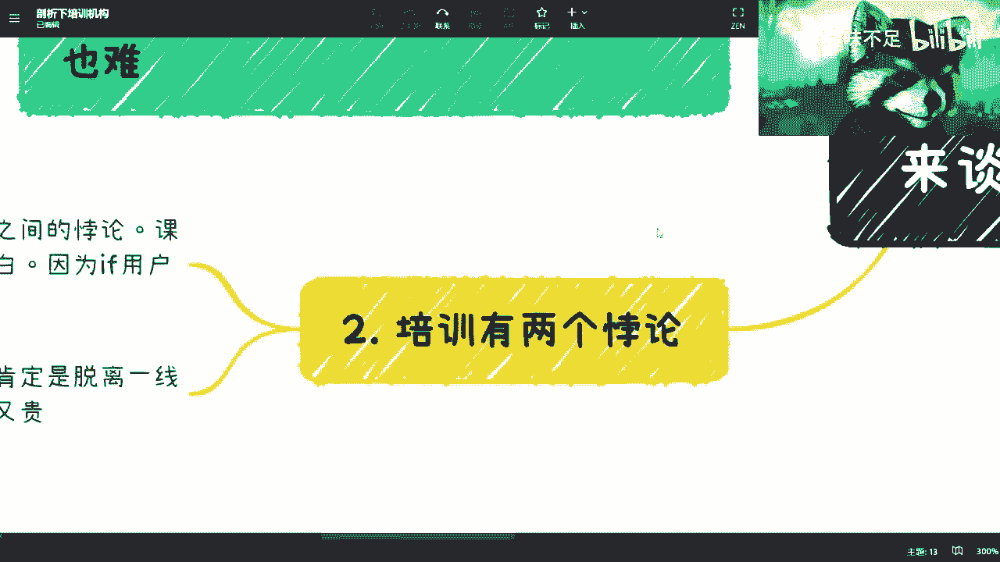

## 总结 🎯

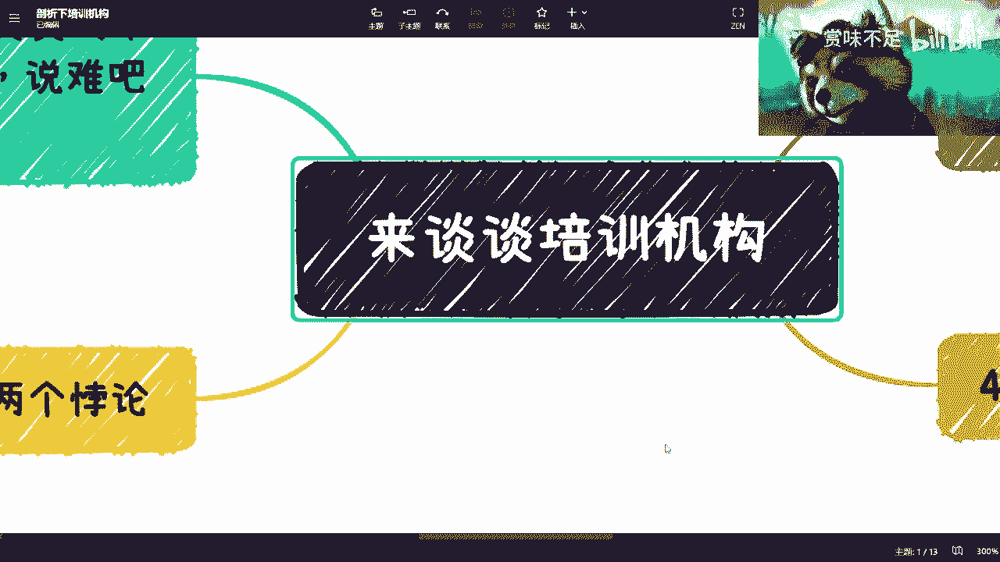

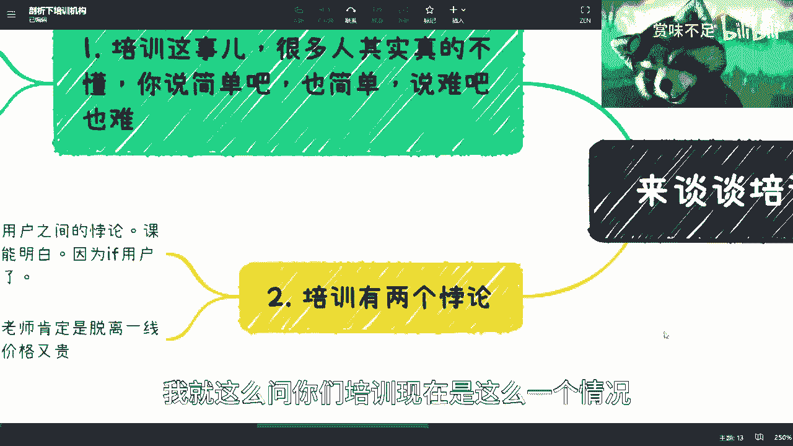

本节课我们一起学习了培训机构的本质。
1.  我们分析了其简单的运营构成与复杂的市场面向。
2.  我们深入探讨了其两大核心悖论：**认知悖论**与**师资悖论**，这解释了行业诸多乱象的根源。
3.  我们指出了其商业本质：在生存压力下，**让用户感知价值**往往比**提供实际价值**更优先。
4.  最后，我们将这种逻辑延伸到更广阔的视野，理解了其在当前社会与职场中的映射。

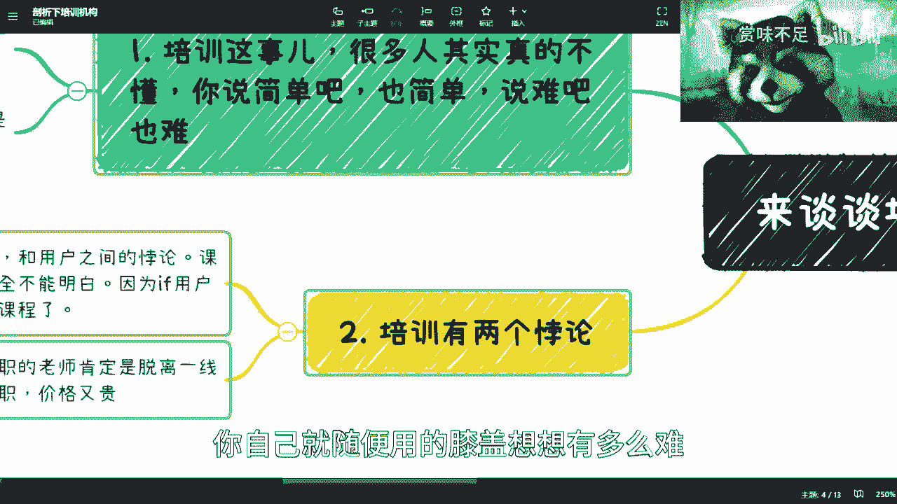

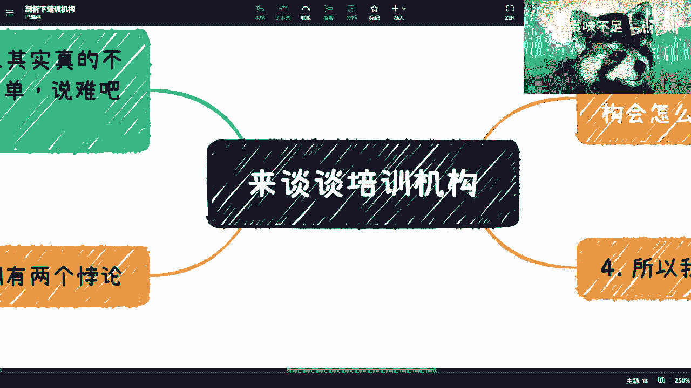

理解这些本质，并非为了鼓励大家去“割韭菜”，而是为了能更清醒地认知我们所处的环境，在投资自己或做出选择时，能够穿透表象，进行更深入的思考。