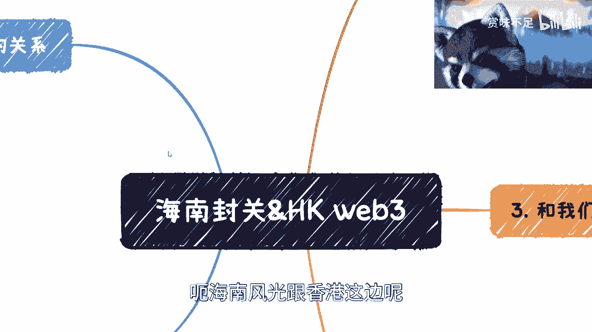
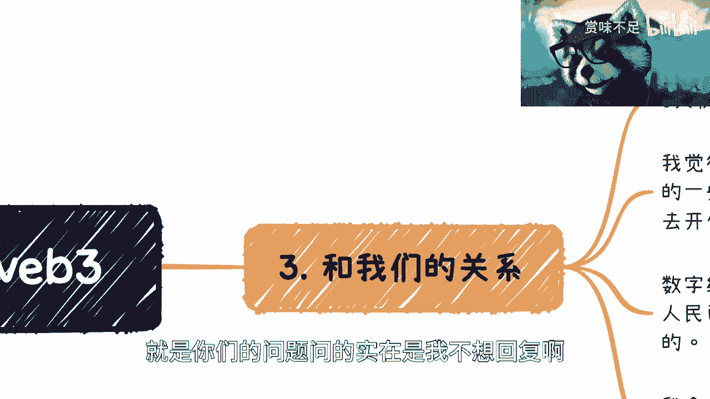
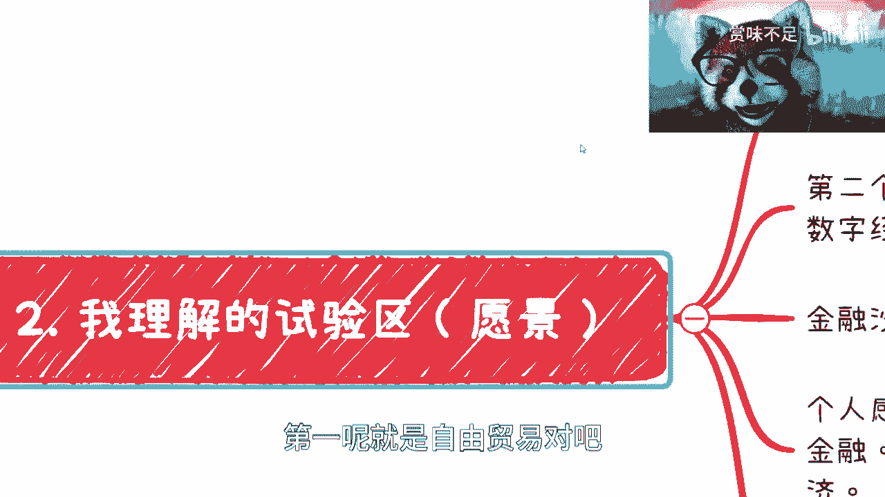
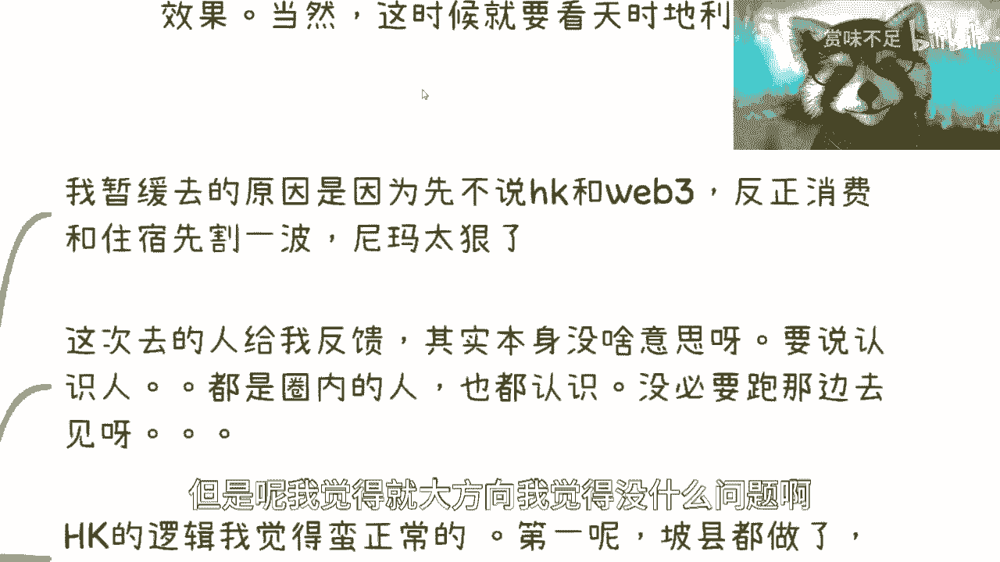
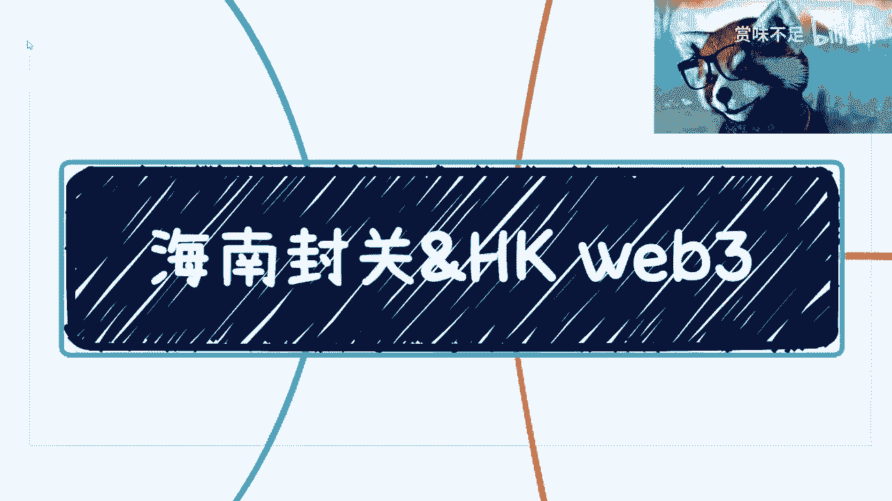
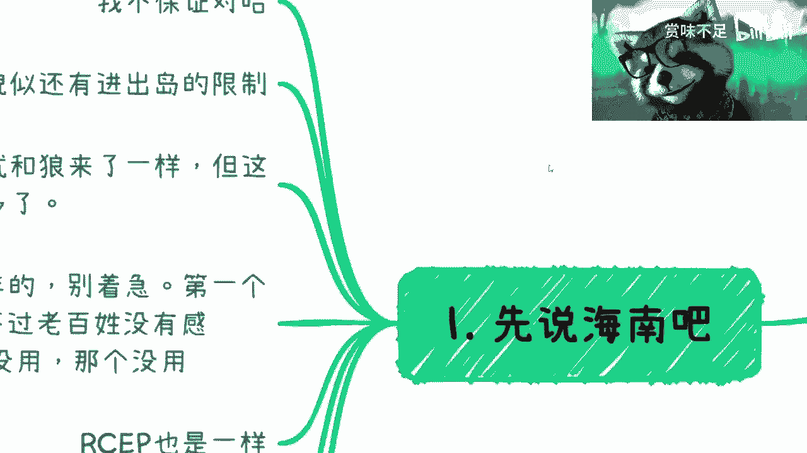

# 来谈谈最近的海南封关和HK的web3 - P1 - 赏味不足 - BV1z54y1F7Ls

好啊大家好啊，这个东西呢我不知道能不能上传对吧，能上传吗，最好不能上传，我就另外一个平台了对吧。

呃首先是这样子的啊，就是我这边写了对吧，我说我呢下周也约了技术交易所，数据交易所对吧，反正整体情况呢日常沟通把控啊，然后有啥分享的吗，我回头给大家再跟大家说啊。

呃然后关于昨天评论区呢，还有很多小伙伴问我说怎么跟别人去啊。

我看看啊，叫做怎么和这个那么多人对吧，那么多人对维持保持这个良好的关系，是不是啊。

其实这并不难啊，回头我在这个单独讲一期好吧，呃海南风光跟香港这边呢。

我其实写了你们看对吧，还是蛮多的啊，我我先说说吧哈先说海南啊，海南呢我觉得首先我不保证对啊，第二呢现在是自贸港，对自贸港这个零关税啊，然后呢就我知道的话，封关前后貌似还有这个进出岛的一些限制啊。

那当然我还是那句话，我能在这个视频里面讲的，一定还是能讲的那些啊，不能讲的那些不管我发哪儿都不能讲好吧，就我发出来，回头我敢打赌，两个小时内肯定就有人举报我是吧啊，然后这个是第一个。

然后第二个呢我跟你们说啊，你们会觉得呃因为我在b站上还有抖音上，我也看了一些视频啊，就很多人觉得封官说了很多年就跟狼来了一样，你知道吗，包括我身边有很多人是这么讲的，但是呢就是我觉得是什么呢。

第一呢就是啊也不是说讲了很多年，因为你国内做一件事情，你不是什么，今天说明年就就能出成果的对吧，也不是说今天说这个这个第二天就能够坐的啊，诶诶我突然发现我眼睛没了，决定换个眼镜。

说到马德上次换的是个爱心了是吧，那我怎么地得换，换个眼镜，怎么怎么怎么加来着啊，这个啊好了好了好了，是不是很完美啊，等一下啊，好了啊，那是知识分子是吧啊，然后就说这个，但这个的确不同啊，的确不同呃。

因为什么呢，因为一方面呢，就是说那个准备呢也做了蛮长时间了啊，我觉得也时间也差不多了，第二呢就是跟整个这个大的战略方向，时间呢也是有一定这个这个关联度量啊，所以说就大家不要老是抱怨说啊。

这个事情好像啊怎么一直没进展怎么样啊，然后呢就包括什么呢，因为那个这两天评论区还有人问，我是那个叫数字人民币，还有智能合约，还有些什么东西，你知道吗，就就你要想啊，就是像风光这种，它处于一个大的战略。

他要打的准备基础很多，对不对，那你说智能合约也好，数字人民币也好，它是一个金融产物对吧，我曾经跟你们说过对吧，在数字人民币那一期，我曾经讲的很清楚，就是纸质的那个纸币，他换代对吧，就以前比如说五块钱。

十块钱，50块钱，100块钱对吧，他更新在中国都得更新10年，你明白吧，哦你们不能因为说啊，数字人民币一直在那边说啊，然后感觉没什么推进，然后就觉得没有用，你这完全没有因果关系的啊，你就没有办法的。

你知道吗，就就哼这不是我们过家家啊，好吧，就是你觉得没有用，那是你的事情，老百姓很多感觉就是不准的啊，而且本来就不对吧，就就咱就不用这样讨论问题啊，然后包括c p也是一样的对吧。

就是但凡了解过r c e p的，可能以前也会有这种感觉啊，在那边说说了好多年对吧，然后也没有进展，那你看去年开始有进展了吧，有了吧对吧，那你要慢慢来，没这么快的，而且现在也只不过是有进展。

他也不是说马上开花，结果对吧，没这么快的啊，但是但是啊但是啊我们来看啊，就是说海南之前对于很多人来讲，它的优势在哪里呢，就是实验区对吧，虽然有很多人叫是叫实验区，但是他也不知道实验什么东西对吧。

这是第一点啊，第二点呢就是说这个注册注册企业，因为你们也能看到吗，有很多的这种企业注册在这个这个海南对吧，然后他业务呢其实可能并不在海南做，这是以前就常规常规套路啊，这我也可以跟跟你们讲啊。

嗯然后第三最后呢就是说我跟你们说，很多人我看到很多视频也提到了房产，房产这件事情呢，不是说嗯咱不是现在去提，叫做什么整个呃就是整个面都是有价无市有，我想想有价无市对，有价无市对吧，这不是重点。

重点是你说海南的房价有没有利好，有一定有，但是你要关心的话，那你5年前就应该去关心了，你知道吗，我前2年去的时候，领导就一直跟我说，让我在那边买房对吧，你现在在职关心有什么用呢，没有用的呀，你知道吗。

就是就我还是那个观点啊，就是大家不要像一个sheep，就不要像一个绵羊一样对吧，就是你们看到一些新闻好就就过去了，开始思考了，然后明天看这个新闻，啪又跑过去跟着思考了对吧，就gb t好。

跟着跟着焦虑对吧，然后海南哦跟着在那边说说说说，说半天没有用啊对吧，就是就是我觉得但凡你们有点脑子的人啊，就是大家关心的点根本不应该在于说啊，我们今天看到个新闻怎么样子啊。

然后也不是说去抱怨这个东西有没有用啊，这么多年没有推进，而是说而是说你要有时间，有机会有空档，你就应该多深入去了解一下对吧，那你现在了解才有可能抓住，23年后的机会对吧，你每天就在那边抱怨有什么用呢。

没有用的呀，对位了，然后我在这里还提一点，就是你们有些小伙伴因为咨询加我微信的对吧，我觉得没有问题，你们但凡问出来一些问题，我也都会回答，但是千万不要来问我什么呢，就是啊陈老师这个知识星球能不能加啊。

陈老师这个这个方向对不对，我不回答的啊，跟我没有关系啊，我我去回答好，到时候你们被坑了怪我，我说他不好啊，然后营造我跟那个知识星球，这种博主的这种主人，这个这个叫什么创建者的矛盾，何必呢。

对了我是吃饱了撑的嘛。

啊我跟你们讲，你们找我啊，我都会回复的，我不回复，只有一种可能性。

就是你们的问题问的实在是我不想回复啊，这不是钱不钱的问题，你给我钱我也不想回复好吧。

然后这是第二点，我这是第一点啊，然后第二点呢就是说我理解的这个实验区啊。

就是当然这个是愿景啊，他不是说现在啊啊第一呢就是自由贸易对吧。

这个我觉得是很多人都知道的对吧，这个也是说到现在说的最多的，那第二个呢我觉得是整个数据啊，就是比如说不管你什么方面，比如农业啊，金融啊，医疗啊对吧，就是或者来说就是跟跟整个国际贸易相关的一，些。

就是各方的这种数据与国际上的接轨，那当然这个里面其实最重要的，我跟你们讲是什么呢，是国际哦，还有接轨对吧，那怎么关键是怎么接啊，你们明白吧，就是说它的整个接轨业务上面模式上面，我相信其实理论上啊。

包括一些这个文字上面早就已经有定论了，但是现在关键是什么呢，就是这个接轨怎么去迎合一些新的东西，我们就打比方说怎么迎合web 3对吧，怎么迎合blockchain，怎么迎合这个数字经济。

怎么是迎合数字人民币，这些是要去关心的好，而不是说我们就在那边说国际接轨，因为因为本质上是什么呢，就是呃你们可以这么理解，就是说以前呢我觉得就像我们之前说的，就是以前我们可以认为是一点对吧。

那现在可能就是二点了，那你二点不管正各个方向，就是技术啊，业务啊，你都得是进一个就说进一个新的阶段嘛对吧，你不能说我老是用老的一些东西在里面搞，那搞来搞去，其实还是老的没有用。

而且你老的东西说实话你是吸引不了大家的啊，更不要说国际上了，那么这个呢我觉得是我也是一直看重的，因为金融沙河在以前海南的政策上面，就已经提出来过哦，当然这个可能由于各种各样的原因嘛，可能就是我不知道啊。

就是也有可能有做过，也有可能没做过啊，但是反正我不知道啊，这个信息我是不了解的，虽然我跟海南这个人行的领导也聊过，但是可能比较早了呃，但金融沙河我是真的是蛮看好的，为什么呢。

因为金融沙盒它相当于是给了一个啊，就相当于给你划了一个圈圈，这个圈圈里面呢你可以去做尝试哦，就是相当于我们说，就是说是在海南划了一个圈圈，然后给大家去做金融闭环或者金融呃，叫做叫做商业闭环。

金融就商业在金融上的闭环的这么一个啊试验，那么在这个事业里面就是有很多，你觉得原本在法律上不合规的，那么它是可以突破这层屏障去做实验的，那试验区试验区就是试验嘛，沙河沙河就是为了试验的哦。

所以我觉得这个是我是很看好的，就包括我们说数字资产嘛对吧，这就是得那个叫token lization，就证券化啊对吧，包括这个这个这个呃股权，股权分割啊，期权分割啊对吧，权益分割啊对吧。

包括就是数字人民币的这个智能合约啊对吧，我觉得就是他未来如果但凡做，那他一定是在金融沙河里面做的，因为本身海南以前就有这个政策啊，然后在别的城市也没有这么一个天时，地利人和的这么一个场景给他去用对吧。

那我觉得他也比较贴合于整个国际的一个呃，就是海南接下来在在国际上，这个数字经济的这么一个地位，包括国际贸易这么一个地位上的一个嗯，一个定位对吧，那么同样的那个也有很多人说啊，就跟hk去这个对比嘛对吧。

我个人觉得其实从目前来看呢，它是纯金融，而且是old的old fashion啊，当然这个不是一个贬义词啊，就是我们客观的说就是它是一个纯净融，同时是一个old fashion对吧，就定位大定位上面。

但是海南的定位呢我觉得是在于在新金融啊，然后在新金融，然后数字金融以及它的主要偏向趋势产业，产业经济哦，就是hk我相信他现在比如说web 3对吧等等等，他也是新金融啊，也是数字金融。

但是它的金融呢是偏金融的，就金融的一个一个产物，但是我想我觉得海南这边是偏产业的，就是金融是它的一个工具啊，然后最终是要发展产业，要发展你，你不管是国际贸易也好，还是哎还是我们说的这个数字。

经济的一些流转也好，其实都是一样的，都是产业啊，呃然后还有一个呢就是海南现在最欠缺，最欠缺的其实是人才，咳咳就是一些呃企业，因为你会发现海南现在本身呢，就是他的这个人才规模，包括人才的一些这个分布啊。

包括企业的整个分布，它相对于一线城市甚至准一线城市来讲，还是有一定的劣势的啊，这个我们也客观的说啊，而且这个也是海南目前比较欠缺的啊，那么当然我们反过来说嘛，就是说正因为啊。

还能就背负着这么一个历史使命，但是呢他又在某些地方还是比较欠缺的，那么我觉得这个呢就是你得辩证的去看对吧，你不能说因为海南比较欠缺的，我就看衰弹，那不行对吧，你要辩证的看，就是说因为他某些东西比较欠缺。

那么对于我们来讲，对于我们这个别的就各个这个城市的人来讲，你才有机会嘛对吧，你要说现在什么都不缺，那我现在跟你们讲这个干什么，就我们二哥就就就在那边啊，坐着看啊，看看看嗯，很好啊，反正跟我没什么关系。

那有什么用啊，对不对啊，那么这个是试验区啊，试验区，那我觉得和我们的关系呢，在这个地方有几点，一个呢就是零关税对吧，零关税包括以后的个人和企业水，应该还是有一定变化的，我估计啊，因为这个我也不清楚啊。

就零关税肯定是利好一部分产业和平台的，这个你们可以自己自己多看看啊，就如果跟你们的业务有关的话，第二呢就是我觉得按照正常的节奏走，那么接下来就是真正给一些企业，还有给一些个人或有一些利好的政策。

这个政策呢不单单是你在那边落户啊，包括落若企业啊，包括嗯就各个可能各个方面，但这个得要那个吧，到时候等具体政策出来，我们再看嘛对吧，但是呢它的核心我相信就是吸引更多的人才，以及更多的这个业务发展。

就可能，比如说你现在已经在上海有家公司了对吧，然后你产业做的不错，那你可能在海南再落个子公司对吧，或者落个分公司也是有可能的，哦那么这是一款啊，然后还有呢就是数字经济的一个新型试验。

然后呃新型试验这边呢，我觉得就是我之前也是一直跟你们讲的，就是试验这一块呢，就很多人也说嘛，啊这个吕老师你一直说数字经济，数字经济对吧，说了半天，那这个东西可能机会在什么地方呢。

那我觉得就是别的我不知道啊，但是海南这边肯定是个机会对吧，因为这毫无疑问就是他是一个这个大方向，往数字经济上面要去，要去靠的这么一个东西对吧，那么你说啊你说怎么call对吧。

那那你看嘛你现在可以先去了解了解啊对吧，然后先看看能不能在那边搞个呃，就是搞些关系，你可以你可以合作的合适方式进去嘛，你也可以注册公司方式进去嘛，都可以吗对吧，那么你你你现在就先跟进嘛对吧。

你先别管这么多嘛，你先跟进嘛，那么你等到未来比如数字人民币啊，还有各个其他的一些先行了之后，那么你就相当于能够至少我们说上牌桌嘛对吧，你有第一批啊，或者说前几批有机会的这种人哦，或这种企业去做尝试。

那你说有没有红利吗，那当然有红利了，对不对啊，那么我个人认为数字增，数字经济的很多先行试验，还是会从海南撕开口子的对吧，因为他以前就有这个政策，它的历史使命就是这个样子的对吧。

然后呢我觉得就海南现在整个的定位是什么呢，就是一个大战略早就已经定好了，基础建设呢这2年其实也打得7788了对吧，那么接下来是什么呢，就是你要巩固基础建设，从而往上再去搭积木对吧。

因为你现在单有基础建设没有用啊对吧，你得往上搭积木就带业务对吧，然后达到就是说基础建设加基础的业务，然后以国际化的这个方式达到1+1大于二，甚至1+1大于三对吧，这么一个效果，那当然你你还你你总不能。

你你不能老是来问我说啊，这个东西这个具体方向是什么对吧，我也不知道具体方向是什么对吧，而且我也不知道他接下来到底具体政策是什么，这个可能要等我今年去了我才知道对吧，但是问题是我就算知道了。

我也不一定能讲对吧，而且另外一方面我跟你们讲了，就是现在什么投资啊，或者其他方面，我是觉得时间早就过了，因为你真的要投资，不无论无论是房地产还是别的各种各样的东西，45年前就可以做了。

那你现在要做的是什么呢，就是打基础，那就我不管你是过去有关系，认识人也好，还是过去这个了解产业也好，还是过去合作也好，我不关心啊，你可以通过各种各样的方式，这个跟海南搭上边。

但是呢就是现在情况就是你可以一边做，稍等，你可以一边做对吧，然后一边就是一边看，然后呢一边去寻找机会啊，那么就是至少我们说在海南这片土地上面，我是觉得整个大方向是非常明确的对吧，就好像前面有个机会。

那就看你能不能抓牢了，你明白我意思吧啊那么这个是第三个，第四个呢就是hk的web 3对吧，hk呢我觉得，唉怎么怎么说呢，我暂缓去的原因呢，是因为我先不说hk跟wb 3啊，首先消费跟住宿先割了一波啊。

我看了一下，这次基本上真的是4~5倍，我不夸张啊，4~5倍这么个价格，你说不好听点，有什么用啊，没有没有必要的，我所有过去的朋友跟我说，其实本身没啥没什么意思的，而且你要说认识的人其实都是圈内的人。

就我说不好听点，该认识的也都认识的，我非要跑到那边去认识他们干嘛的，没有必要对吧，而且就是有一些呢就是长期在hk的，我没必没必要挤这几天的热闹嘛对吧，所以我跟他们说了，我说我过两周过来，然后这是第二点。

第三点呢，其实我觉得呃，不管网上到底对hk整个这个web 3行为怎么看啊，其实我觉得从大战略方向上面来讲蛮正常的，为什么呢，因为第一你看坡县啊，其他各个地方啊，都包括美国啊。

啊这个这个这个这个地方其实都做了，那我们不能落后啊，对不对啊，那你行政区怎么了，你行政区不是我们吗，我们也是行，就是行政区也是我们的，对不对，那我们不能落后啊对吧，这是第一点。

第二点呢就是说钱这个东西呢，我跟你们说啊，钱这个东西怎么才有价值呢，钱这个东西是要有流通了才有价值对吧，什么是金融，金融就是说你今天有币钱，大家手上转一圈，虽然它还是一笔钱，但是产生了价值。

你们明白吗啊我觉得可能有些小伙伴不明白，但是你们仔细想想看啊，仔细想看，真正有价值的并不是你赚到了钱，真正有价值的是这笔钱要流通啊，有流通才有价值，因为你要明白，有价值这件事情不是针对你而言的。

是针对宏观，针对整个国家，针对整个全球的这个经济来讲，这才叫这才是有没有价值，而不是说是针对你个人判断来讲有没有价值啊，所以说你说hk做web 3整个的一个发展呢，我觉得你们就可以参考参考美联储啊。

就就我我这个三个点就只能讲到这里了对吧，再往下讲感觉不太合适啊。

但是呢我觉得就大方向我觉得没什么问题啊，没什么问题对。

然后就是和我们的关系，我觉得呢个人觉得还是从大时间，大时间线来讲呢，我觉得是利好的，因为你很简单嘛，就是你你既然hk扶持你在web 3，这个也就代表行业在进步嘛对吧，你别管它这个里面到底是不是啊。

老的一些项目啊，新的一些项目啊对吧，老的一些韭菜啊，怎么样怎么样怎么样对吧，因为我相信你们但凡了解的，都看到了一些什么1617年的什么项目是吧，啊呃我我相信呢就是一样的，就这这这是一个就是怎么说呢。

就共存的一个环环境嘛对吧，我相信总会有些不一样的项目出来啊，就不至于说老是像以前这么多的空气项目对吧，这是第一点啊，第二点呢就是说我还是会去的对吧，过几周再去啊，第三呢我觉得hk的政策福利都还是在的。

就是呃就一样嘛，就对于我们来讲，或者对于我和你们来讲，我觉得对于我们来讲很简单，就是你福利在什么地方，红利在什么地方，我们先去难嘛，对不对，那干你干嘛跟红利过不去呢，你干嘛跟钱过不去呢，是不是对吧。

你只要有你这个征求你的底线对吧，你说政策，政府给政策，你干嘛不去呢，对不对，那肯定是先吸引后筛选的对吧，这没有关系的呀，我跟你们说啊，就是哎呀就是就是我觉得很多人啊，就是就是观察一个东西的时候。

就是省审视一个东西的时候，你你不要太去纠结于他到底有没有价值，因为你觉得有价值，我可能觉得没价值，别人可能觉得没价值对吧，单个人觉得有价值是没有用的，那么我觉得对于整个这个这个政策，整个大方向上面来讲。

有价值是什么，就是你能够把大量的金额进行流通，你能够赚到钱，你能够从海外引入资金，那我觉得你就是有价值的，你至于你说你到底做了什么，我觉得这个并不重要对吧，就是你只要不是触犯底线的对吧。

就是触碰红线的都可以啊，我觉得这有什么关系对吧，不是说不是说我们今天做了一件事情，非要说啊，你是不是赋能产业了啊，是不是帮助到别人了对吧，你说怎么样子不一定啊，有什么关系啊对吧，这才是金融啊。

这才是经济啊对吧，你要是说所有东西都是实打实的对吧，赋能产业的，你今天说啊，只要没有产出，只要没有产出，就是没有用的，那我跟你讲这个呃怎么说呢，只能毁灭了，你知道吗，就是你你肯定是个。

你肯定是一个要被时代淘汰的一个一个存在啊，不管是个体还是机构，那么还有呢就是那个hk这边呢，我觉得抓紧时间可以和抓紧机会跟时间，弄个优才也是很好的对吧，你们可以弄啊，弄不了找朋友弄对吧也行。

我觉得蛮好的，现在就是大量吸引人才嘛对吧，那么还有人要说呢，就是说一地鸡毛对吧，怎么样，我说你我还是那句话嘛，就是不重要，你知道吗，就是所有东西我们既然知道了，而且我们又不是很早知道啊。

或者说你就算很早知道，你可能也不看好对吧，那你现在如果觉得你没什么可做的，那你就走一步看一步，对日常多关心关心，不管是啊，当然啊我说的日常多关心关心，不是多看看短视频对吧，多多看看新闻，没有用的。

你知道吗，多关心关心参考，我昨天跟你们说的，去了解信息的这一块，你多从很多实实在的人手上啊，然后通过这种见面的方式，记住见面的方式，因为网络上有很多东西真的不能讲，你知道吧，真的不好讲啊。

你通过见面的方式去多了解了解信息，你别老是自己yy，结果你知道吧，就很多时候我们就是没有必要，就很多时候是我们自己不做，但是呢你说没说是不做的，又羡慕别人做，何必呢，对不对，就又当又立对吧。

就没没必要啊，是吧啊。

所以呢我觉得就是就是核心来讲呢是这样子的。

就是我们看待这两件事情呢，问这个看待的这个方式呢，就是说你呃，首先第一点是你要确定大战略是没问题的啊，你不能从一开始源头就怀疑他，那那你就别做了对吧，你就别看好了对吧，这是第一点，第二点是我一直说嘛。

就是大战略上面如果大家确认的话，那么战术上面怎么样，这个是另外一件事情对吧，战术有可能是直接从a点到b点，战术也有可能是曲线救国对吧，也有可能走一些弯路，没有不重要，但是整个大战略你只要跟对了。

你只要跟紧了步伐，你肯定是能赚钱的，你明白我意思吧，就是这件事情。

不管是你打工也好，还是说你去创业也好。

还是你做些副业也好，还是你跟我一样接些单子也好，你肯定是能赚钱的，但我们只不过就是说第一对吧，你肯定还要喷，你还要有点运气对吧，就是说你你第二就是说你还得，你要看你能坚持多久对吧。

第三就是说你是不是真的找对了人，找对了这个合作方，找对了切入点对吧，因为因为海南封关是海南封关对吧，hk的web 3是为hk web 3，但是这只是个大的宏观，它里面还有很多细节的东西对吧。

你是不是细节的东西能切好对吧啊，因为之前前两周吧，就是b站上有个小伙伴也是在海口的嘛，然后他就跟我说，他说我今年去的时候到时候有空见见面，我说这个到时候再说嘛对吧。

但是呢就的确就是有些东西呢也是就是线下，线下好讲啊，线下好讲，所以呢我觉得就是说大家对于这些事情也好，或者对于别的一些东西啊，就是呃整个眼光上面和思想上面看法，就是一定要保持一个我个人建议啊。

保持一个什么观点呢，就是屏蔽所有的那些有的没的东西，然后不要让一些信息让你觉得哎呀，好像我我亏了对吧，哎呀我前2年怎么没抓住机会对吧，我好像怎么样怎么样怎么样不重要，你知道吗，其实从整个大方向来讲。

这都是刚开始你就积累嘛，你就做嘛，你就想办法就是就是就是就是相当于有这么多，有1万个坑对吧，你作为一个萝卜，你就想办法往里往其中一个坑蹭嘛对吧，那那你能一个萝卜一个坑能弄到一个是一个。

对不对啊，但是有一点就是我之前视频里面也说过，就是你们要记住，就是嗯我相信未来这种机会越来越少了啊，就是现在我们大家可能还能抓住一些，就未来就算有呢。

我估计我们也很难抓住了啊，所以就反正就这么个情况吧，唉。

对好不啦，别的我其实也也不觉得有什么，真的不觉得有什么，因为很多东西我们也也也不见得能参与。

对我顺便再提一嘴啊，就是说你们去做一件事情，抓一个机会的时候呢，呃有几点，第一点就说别老想着什么都自己做对吧，能借力就打就借力对吧，能借关系就借关系，这第一个，第二个呢，就是说呃。

就是我觉得普通人不太适合去做一个啊，完整的一个项目，我是比较偏向于的是大家可以去想想看啊，可以做做卖水的人啊对吧，可以做做卖铲子的人啊对吧，可以做做这个这个卖，就卖各种周边道具的这种关系啊。

这种角色这个我觉得倒是可以的，而且几乎应该是蛮多的啊，几乎是蛮多的嗯嗯具体有可能就不能明说了嘛。

对吧，这个就就就这样吧。

