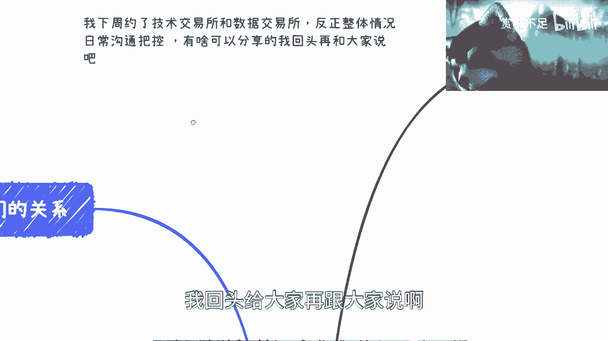

# 课程一：海南封关与香港Web3政策解读 🏝️💱

在本节课中，我们将要学习海南自由贸易港“封关”政策与香港发展Web3.0的战略定位。课程将分析两者的核心概念、潜在机遇以及与普通人的关联，帮助初学者理解宏观政策下的个人发展思路。

## 概述：政策背景与核心议题

近期，海南“封关”运作与香港大力推动Web3.0产业成为热议话题。这两项政策均是国家在金融与数字经济领域的重要布局。海南旨在建设高水平自由贸易港，而香港则致力于巩固其国际金融中心地位并拥抱新兴技术。理解其底层逻辑和战略意图，对于把握未来经济动向至关重要。

上一节我们介绍了课程的整体背景，本节中我们来看看海南“封关”政策的具体内涵。

## 海南“封关”政策深度解析

海南“封关”并非简单的物理隔离，而是指在海南全岛建成一个由海关监管的特殊区域，实行“一线放开、二线管住”的货物进出口管理制度，以及更加自由便利的贸易投资政策。

### 政策现状与常见误解

首先，需要明确几点：第一，所有分析基于公开信息，不保证完全准确；第二，“封关”是一个复杂的系统工程，其推进需要时间，不应以“狼来了”的心态简单看待。大型国家战略从规划到落地往往需要数年时间，这与数字人民币、RCEP等重大政策的推进逻辑是一致的。

以下是关于海南现状的几个关键点：

1.  **“实验区”定位**：海南的核心优势在于其“全面深化改革开放试验区”的定位。这意味着一系列新的制度、政策和商业模式可以在此先行先试。
2.  **企业注册热潮**：过去已有大量企业在海南注册，但其实际业务可能不在当地。这是一种常见的政策套利模式。
3.  **房地产市场**：海南房产存在“有价无市”的现象。政策利好早已在市场上有所体现，现阶段单纯关注房产投资意义不大。

核心在于，我们不应被动地跟随新闻热点焦虑，而应主动深入了解政策细节，为未来2-3年的机会窗口做准备。

### “实验区”的核心愿景与机遇

我理解的海南“实验区”愿景包含以下几个层面：

1.  **自由贸易与零关税**：这是最广为人知的优势，将利好跨境贸易、高端消费品等相关产业与平台。
2.  **数据与国际接轨**：关键在于如何推动各行业（如农业、金融、医疗）的数据标准、业务模式与国际规则接轨，并融入**Web3**、**区块链**、数字经济等新元素。
3.  **金融沙盒（Fintech Sandbox）**：这是我最看好的领域。金融沙盒相当于一个“安全空间”，允许在可控范围内测试创新的金融产品和服务，甚至突破现有法规限制。这对于**资产通证化（Tokenization）**、数字人民币智能合约等创新至关重要。其公式可以简化为：
    `金融沙盒 = 政策特区 + 创新试验 + 风险可控`
4.  **产业导向的新金融**：与香港偏重传统金融和纯金融产品不同，海南的金融创新更倾向于服务实体经济和新经济产业，金融是工具，目的是发展产业。

### 海南的挑战与个人机遇辩证看

海南目前最欠缺的是人才和成熟的企业生态。然而，辩证地看，这恰恰为外部人才和企业提供了机会。

以下是个人可能把握的几点机遇：

1.  **零关税红利**：关注与自身业务相关的进口商品或产业链机会。
2.  **政策吸引**：未来预计会有更多吸引企业和个人的具体政策出台，如落户、税收优惠等。可以考虑在海南设立子公司或分支机构。
3.  **数字经济试验**：积极了解并尝试参与海南在数字人民币、数据要素市场等领域的试点项目，争取成为“首批上牌桌”的参与者。
4.  **打好基础，寻找切入点**：当前阶段的核心是“打基础”——通过建立人脉、了解产业、探索合作等方式与海南产生连接，并持续观察，等待具体机会的出现。

上一节我们分析了海南的定位与机遇，本节中我们来看看香港的Web3发展战略。

## 香港Web3发展战略观察

香港近期高调举办Web3相关活动并发布支持政策，旨在抢占数字经济新高地。

### 战略动机与个人看法

香港此举有其战略必然性：第一，面对新加坡、美国等地区的竞争，香港需要巩固其金融地位；第二，金融的核心价值在于**资金流通**。Web3能促进资金和资产的全球流动，这对于香港保持国际竞争力至关重要。可以参考美联储通过货币政策调节全球资金流动的逻辑。

对于个人而言，以下几点值得关注：

1.  **行业进步的信号**：政府扶持代表行业合法性提升，长期看会吸引更优质的项目和人才，改变过去“空气项目”泛滥的局面。
2.  **政策红利存在**：对于符合资质的个人（如通过“优秀人才入境计划”），当前是获取香港身份的一个窗口期。
3.  **价值判断应宏观**：评估此类政策的价值，不应仅从个人或单个项目出发，而应看其是否促进了资金流动、吸引了海外资本、活跃了市场。金融的本质有时就在于流动本身。

### 行动建议：如何参与

面对这些宏观趋势，普通人应采取务实策略：

1.  **确认大战略，包容小战术**：相信国家发展海南和香港的战略方向是正确的。具体执行路径（战术）可能有调整，但只要紧跟大方向，就有机会获益。
2.  **从“卖水人”角色切入**：普通人未必适合直接主导大型Web3或跨境项目。更适合的角色是提供周边服务，如**技术服务**、**合规咨询**、**社区运营**或**人才培训**等，做“卖铲子的人”。
3.  **深入一线获取信息**：避免仅从短视频或新闻获取碎片化信息。应通过线下见面、行业交流等渠道，从实干者那里获取更真实、更深度的见解。
4.  **借力与合作**：不要试图所有事情都亲力亲为。善于借助已有的关系、平台和资源进行合作。
5.  **保持行动，避免空想**：不要纠结于过去是否错过机会。从现在开始积累、连接、尝试，就像“一个萝卜找一个坑”，主动去匹配可能出现的机会。

## 总结与核心要点回顾

本节课中我们一起学习了海南“封关”与香港Web3政策的核心内容。

总结如下：
*   **海南**的核心是**“制度创新试验田”**，重点在**产业导向的新金融**和**数据跨境流动**，机遇在于提前布局、参与试点。
*   **香港**的核心是**巩固金融中心地位**，通过**拥抱Web3**促进资本流动，机遇在于利用政策红利和提供专业服务。
*   对个人的启示是：**相信宏观战略，采取务实微观行动**。避免抱怨和空想，主动学习、连接资源，并考虑从生态的“服务者”而非“主导者”角色切入。未来大的时代机会窗口在收窄，当下的行动尤为重要。

---
**注**：本教程根据公开内容整理，仅作知识分享与思路探讨，不构成任何投资或决策建议。政策具体细节以官方发布为准。