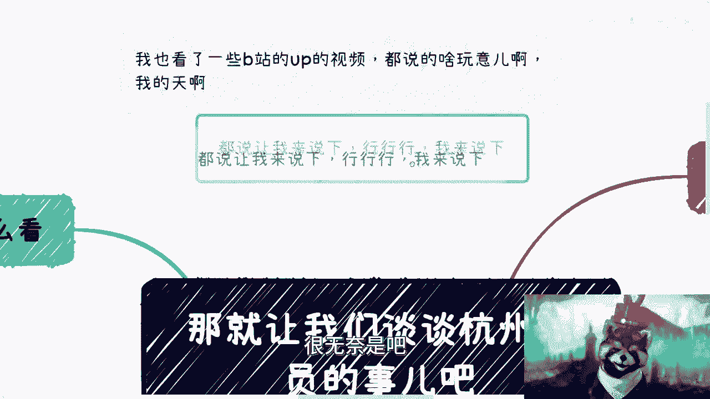
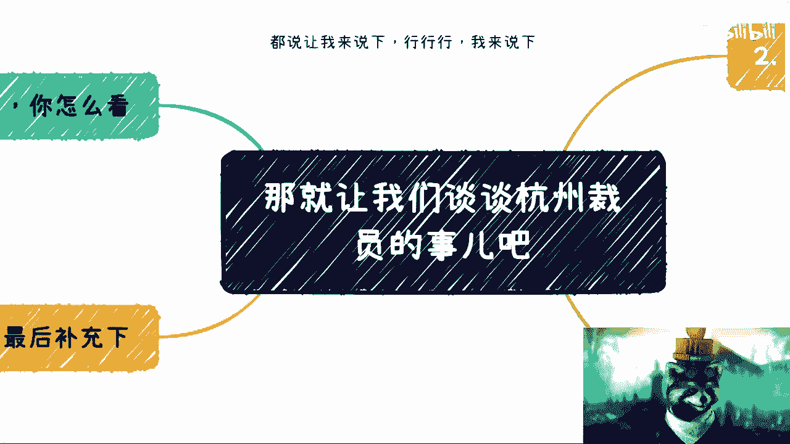

# 课程名称：互联网行业裁员现象深度解析 📉
## 课程编号：INS-001

在本节课中，我们将要学习如何理解近期互联网行业，特别是杭州地区出现的裁员潮。我们将分析其背后的深层逻辑、行业模式，并探讨其对个人及市场的潜在影响。

---

上一节我们概述了课程主题，本节中我们来看看互联网裁员现象的本质。

许多人对近期互联网公司的裁员感到惊讶。这种现象并非突发事件，而是早有预兆。互联网行业的调整是正常的经济周期现象。

---

### 互联网行业的“接盘”模式

互联网行业的发展可以被视为一个“接盘游戏”。这个模式的核心是资本、政府或公众在不同阶段为企业的扩张和估值提供资金支持。

以下是该模式的关键阶段：
*   **2005-2010年**：移动互联网初现端倪。
*   **2010-2015年**：行业进入加速发展期。
*   **2015-2020年**：增长乏力，衰退迹象开始显现。

整个行业的商业模式依赖于持续的资本注入来维持高估值和扩张速度。

---

### “人海战术”与汇报逻辑

上一节我们介绍了行业的“接盘”模式，本节中我们来看看支撑这种模式的具体策略——“人海战术”。

互联网公司普遍采用“人海战术”并非偶然，而是由其内在的汇报和融资逻辑决定的。

以下是驱动“人海战术”的三个核心原因：
1.  **便于向上汇报**：庞大的团队规模更容易向上级或投资者展示业务的重要性和发展潜力。
2.  **获取政府补贴**：许多地方政府的人才补贴政策与公司的员工学历（博士、硕士、本科）比例和数量挂钩。
3.  **吸引资本投入**：在资本市场上，庞大的体量（如员工数、用户日活）是支撑高估值和想象空间的关键叙事。其逻辑可以简化为：
    **`高估值 ≈ 庞大用户基数 × 庞大团队规模`**
    如果一家公司声称拥有数亿日活用户却只有几十名员工，资本方会认为其缺乏增长空间和投资价值。

---

### 现状：价值回归与行业调整

理解了行业的运作模式后，我们不难看出当前的裁员潮实质上是价值的理性回归。

当前的裁员是行业从非理性扩张回归正常状态的必然过程。过去因资本狂热而被过度抬高的人力成本，正在被市场修正。

许多从业者习惯了行业高速增长期带来的高薪和宽松环境，将非常态视为常态。当市场下行，企业需要提高效率时，人员优化就成为直接手段。其调整过程往往是：
**`过度冗余团队 → 精简团队 → 核心团队承担更多职责`**

---

### 对个人与市场的连锁影响

上一节我们分析了行业内部的调整，本节中我们来看看这种调整对外部产生的连锁反应。

互联网行业的收缩会产生涟漪效应，影响多个相关领域。

以下是可能受到影响的几个方面：
*   **房地产市场**：高收入人群的减少和预期降低，会对核心城市的房价支撑力构成挑战。
*   **就业市场**：释放出的大量有经验的从业者，将加剧就业市场的竞争。他们可能向下线城市寻求机会，形成“降维打击”。
*   **个人心态**：部分从业者需要调整此前因行业泡沫而形成的“眼高手低”的薪资和职业预期。

---

### 总结与建议

本节课中我们一起学习了互联网裁员潮的深层原因。我们分析了其“接盘”发展模式、“人海战术”的成因，以及当前调整实质是行业价值的理性回归。这一变化将对就业、房地产等相关领域产生持续影响。

对于个人而言，关注宏观热点不如聚焦于自身的提升。将时间投入到技能增长、维护有价值的人际关系或培养个人兴趣上，是更务实的选择。行业周期起伏是常态，增强自身反脆弱的能力才是应对不确定性的关键。

市场留给每个人调整适应的时间并不充裕，变化会持续发生。理解规律，做好准备，方能从容应对。