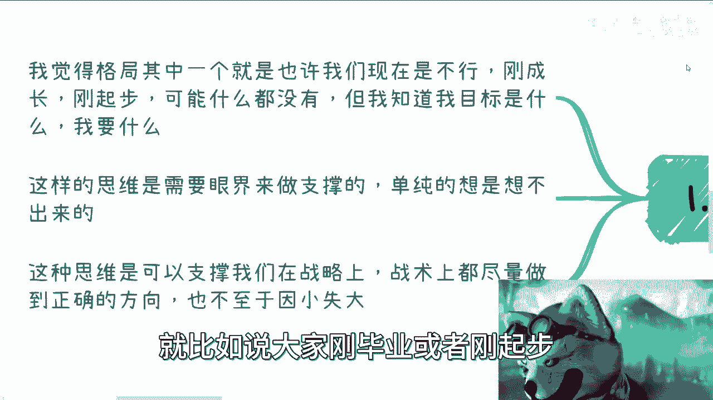
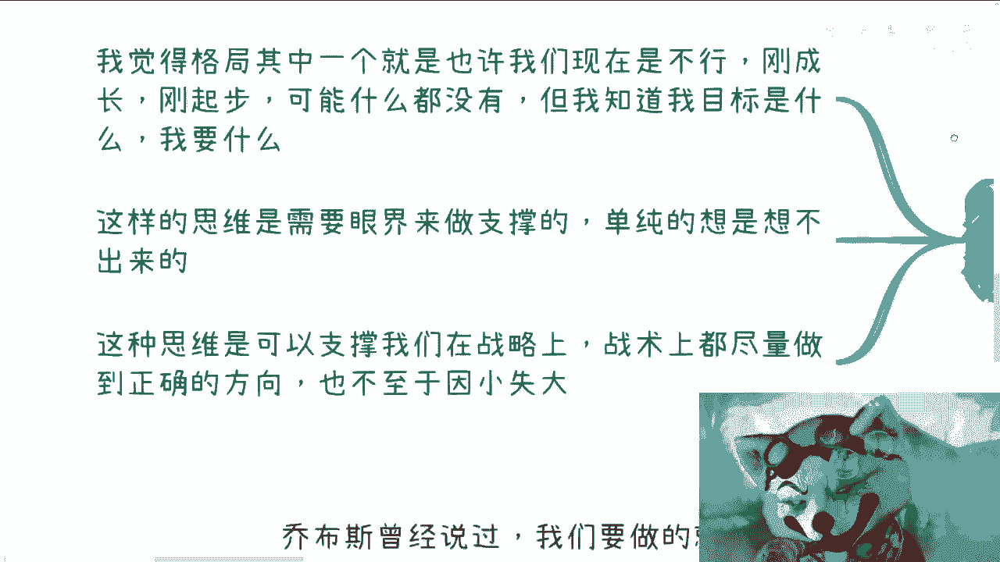
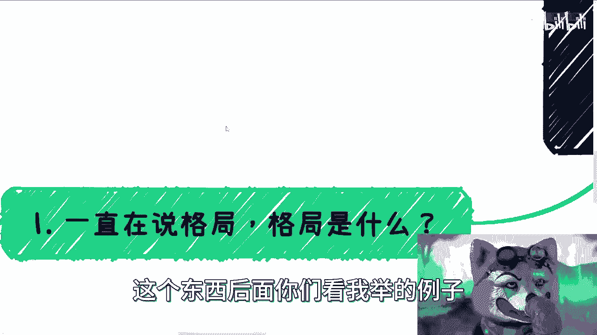
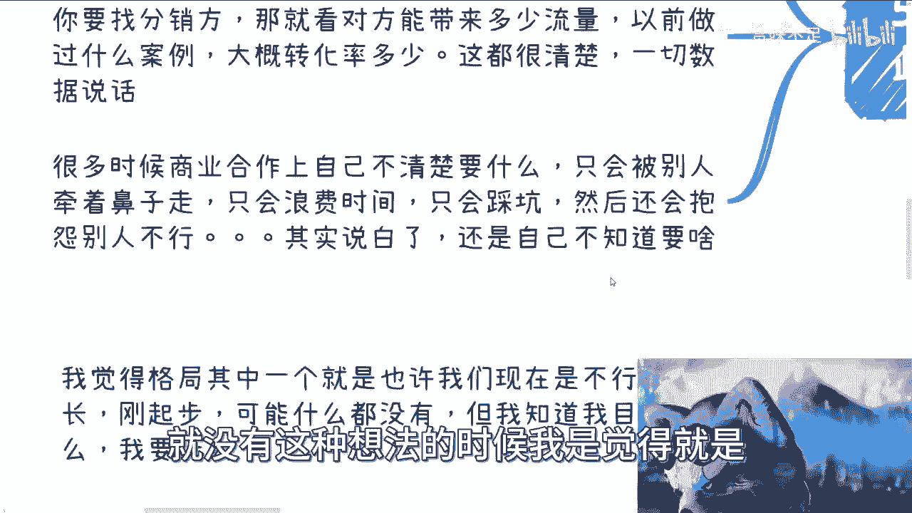

# 格局篇1-现在我们也许不够强大-但我们必须要知道自己要什么---P1---赏味不足---BV1nw4




在本节课中，我们将探讨格局思维的第一个核心要点：**明确自身目标**。即使我们当前能力有限或资源不足，清晰的目标也能为我们提供方向和动力，避免在琐事中迷失。我们将通过六个具体方面来理解这一概念。


## 什么是格局？


上一节我们介绍了课程主题，本节中我们来看看格局的具体含义。格局的其中一个关键点在于：**承认自己当前的不足，但明确知道自己未来的追求**。




这种思维适用于所有人，无论是刚毕业的年轻人、事业起步者，还是拥有一定基础但寻求突破的人。许多人即使有家庭条件支持，也可能因为有自己的想法或担心失败而感到不顺。核心在于，无论现状如何，我们都必须清楚自己的目标是什么。




## 支撑目标思维的基础：眼界


这种“知道自己要什么”的思维需要开阔的眼界来支撑。如果你不知道世界上存在什么可能性，就无法进行有效的想象和规划。

**公式：眼界 → 认知可能性 → 设定目标**

只有接触和了解更广阔的世界，你才能构想出属于自己的道路。这种思维能帮助我们在战略和战术上做出更明智的选择，并且**避免因小失大**。后续的例子都将围绕这一点展开。

## 评估自身价值，不做永久“电池”

在商业或职业的上下游链条中，每个人都可能成为他人的“电池”。但关键在于，我们需要清醒地认识到自己是“电池”，并客观评估自己的价值是否得到了应有的回报。


以下是评估自身价值时需要注意的几点：

*   **付出与回报的失衡**：许多人为他人付出大量时间和劳动，但获得的回报却不成正比，甚至成反比。
*   **改变的意识**：你可以暂时为他人工作，但必须要有改变现状的意识，并主动评估自己的真实价值。
*   **超越无意义的比较**：满足于固定薪资并相互攀比是没有意义的。人生应追求金钱、自由、时间或成就中的至少一项。
*   **目标明确者的心态**：一旦清楚自己要什么，就不会被他人的抱怨或躺平心态所影响，能够专注于自己的道路。


这种格局最大的好处是带来**内心的笃定和不焦虑**。你可以从目标反推现在需要做的努力。即使目前在做一份“电池”式的工作，你也不会过度受公司或行业波动的影响，因为你知道这并非终点。

**核心逻辑**：如果你客观评估自己的价值远高于当前薪资（例如，你认为自己值50-100万，而非2万），那么你就应该朝着实现那个价值的方向努力。这份自信和格局本身就能驱动你找到更好的机会。

## 理解“赚钱”的真正含义

很多人单纯比较年薪高低，但这没有意义。作为打工人，年薪再高，其付出与回报往往也不成正比，且主动权不在自己手中，何谈稳定？

真正的“赚钱”涉及对商业模式的深入理解。各行各业都存在 **`付出(X) → 回报(Y)`** 的模式。你需要去探索和了解X与Y在不同场景下的具体数值，才能明白什么是高价值的赚钱方式。

例如，在高校体系中，一个创新项目可能价值数千万，一项技能竞赛的人均补贴也可能达到数千元。这些例子不是为了让你立刻赚到这些钱，而是让你建立对“高投入产出比（OI）”赚钱模式的概念。

**关键点**：你要学习的是这些商业运作的模式，而钱只是模式成功运行后可能产生的结果之一。了解这些能让你明白，当前靠辛苦换钱的方式是渺小且暂时的，从而不会陷入低价值赛道的内卷和焦虑。你会更清楚自己缺少什么，并主动去补充、学习、合作，以接近高回报的路径。

## 连接点滴，让每件事都有“经验值”

乔布斯曾提到，要善于将生活中看似不相关的点连接起来。这要求我们在做每件事时，就思考它未来可能带来的帮助。


无论你是做本职工作（“电池”），还是接触专业外的事物（如观看本视频），都需要明确：**这件事能带给我什么成长或帮助？**

**代码式思维**：
```python
# 为每项行动赋予“经验值（EXP）”
def evaluate_action(action, target_goal):
    if action.growth_potential > 0 and action.relates_to(target_goal):
        return “值得做，获得EXP”
    else:
        return “无意义，避免消耗时间”
```

如果你选择未来要拥有自己的事业或抗风险能力，那么你必须以自己为主角。每件事都应该像游戏中的任务一样，为你带来“经验值”的增长，推动你接近最终目标。反过来说，如果你长期没有成长，只为月薪工作，就很容易产生焦虑。

## 商业合作中的甲方心态


在商业合作中，明确自身目标更为重要。你需要想清楚自己想要什么样的合作伙伴，以及对方能为你提供什么价值。


一旦想清楚，你的效率会大大提高，因为你可以快速判断并做出选择（不行就换）。当你开始自己的事业时，你需要有自己的想法，不再盲目跟随他人。

**核心原则**：在你自己事业的语境下，**你永远是甲方**。无论你在业务链中扮演什么角色，与合作方都是平等的。评估标准应该是客观的数据和历史案例（如技术方的能力成本、渠道方的流量转化率），而非对方的名气、财富或年龄。


例如，即使面对知名人物，你也只需关注彼此能否为对方创造价值。如果没有，合作便无意义。不清楚这一点，你就容易被他人牵着鼻子走，浪费时间、踩坑，最后只能抱怨。

## 格局带来的终极好处：从容与长远视角

当你怨天尤人时，深层原因往往是你不知道自己想要什么，缺乏自驱力去探索和思考。这可能是由于长期被PUA、缺乏野心，或是内心想躺平却碍于面子在勉强折腾。




无论如何，了解世界上多样的赚钱方式和人生可能性大有裨益。即使最终未能达到理想状态，这种认知也能让我们明白：世界非常广阔，并非只有我们已知的样子。

**最终总结**：格局思维的第一个要点，即“知道自己要什么”，其最大的价值在于赋予我们一种更高的视角和从容的心态。当我们站在更广阔、更长远的高度回看时，当前遇到的紧急情况或陌生挑战都显得微不足道。这种认知让我们在面对任何事时都能保持镇定，做到“得之我幸，失之我命”，从而更稳健地走向自己的目标。

---

**本节课中我们一起学习了**：格局思维的基础是明确目标，即使当下能力不足。我们探讨了如何通过开阔眼界支撑目标、客观评估自身价值、理解高回报的商业模式、让每件事都为成长服务、在合作中保持甲方心态，以及最终如何通过提升格局获得从容长远的人生视角。