# 格局篇1：现在我们也许不够强大，但我们必须要知道自己要什么 - P1 - 赏味不足 - BV1nw411D7sm

啊大家好啊对吧嗯，我们来开展我们的格局篇啊，格局篇，第一个让我想到的呢，叫做我现在也许不够强大啊，但我知道我自己要什么啊，我觉得这个是所有格局，我想了一下啊，就所有的我们称之为格局。

或者称之为商业的叫什么，第一步呃，我在这个地方落落呃，列了六点啊。

列了六点，第一个啊一直在说格局，格局是什么啊，呃我觉得格局其中一个啊。

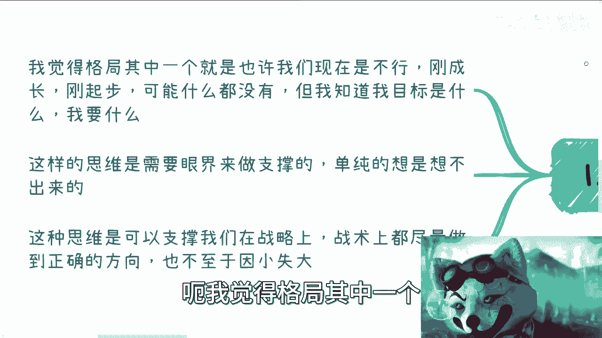

也许就是我们现在可能不行啊，就比如说大家刚毕业或者刚起步。

或者年纪还轻对吧，可能什么都没有啊，也有可能家里面有些条件。

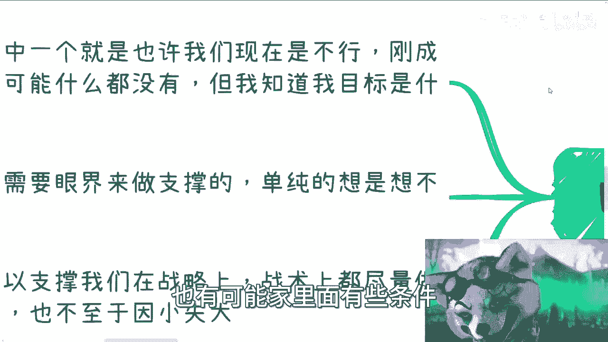

但是我相信很多人其实啊就是说啊，家里有有产业或者有什么的呢，也不是那么的顺，为什么呢，因为我觉得啊从我沟通下来情况呢，其实很多人自己是有自己想法的，也不见得一定要去继承父母的一些产业啊。

而且呃也可能会担心，就是说我这个自己去做了，做不好对吧，或者怎么样子，所以说呢啊所以说呢我觉得就是说啊，现在啊对于所有人来讲其实都一样，就是呃我可以比较年轻，我可以不知道很多东西。

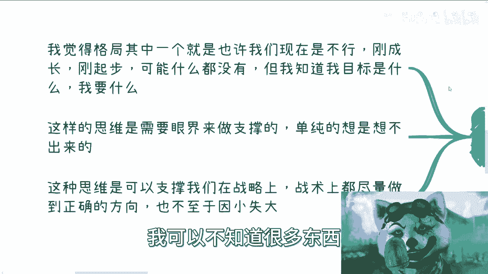

但是我得知道我的目标是什么，我得要什么，那么这样的思维呢是需要眼界来做支撑的，这也是我为什么跟大家说，一直要呃去接触，去了解，去干嘛，就这个这个是所有的前提，因为你不知道世界上有什么，你怎么去想象。

有什么呢，对不对，你只有看到更多，你才能去想啊。

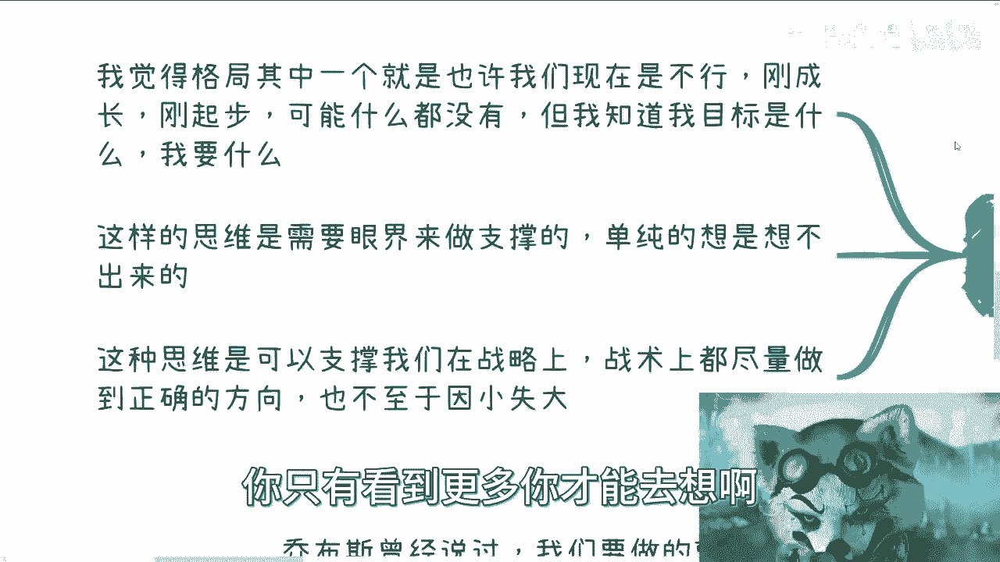

否则你你怎么想啊，对不对，那你想不出你不知道的东西啊，啊这种思维它是可以支撑什么呢。

在战略上，在战术上，我们都尽量可以做出一个正确的选择，而且呢也不至于因小失大啊。

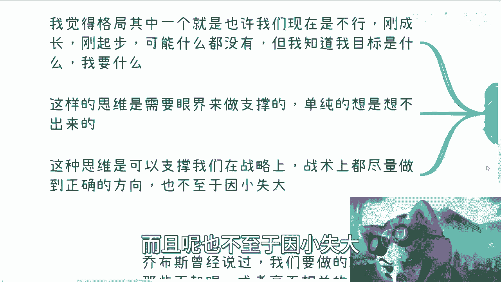

这个音小失大很重要啊，这个东西后面你们看我举的例子。

反正基本上都是这么一个点，第二个啊，比如说做电池跟做自己的事业发展啊。

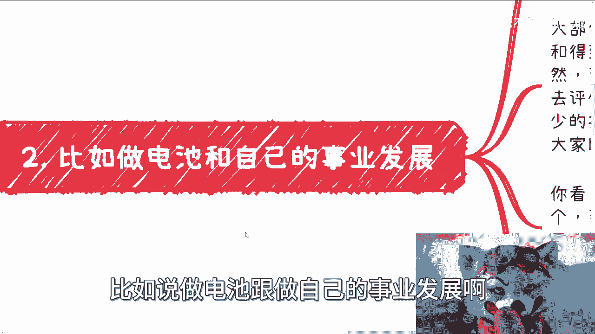

从上下游角度来讲啊，谁都是电池对吧，你大鱼吃小鱼，小鱼吃虾米，谁不是电池，谁都是电池，但是我曾经说的很清楚，我们需要知道自己是电池，同时我们得要知道自己的价值是几斤几两啊，也就是说我们得要去评估。

我们是否得到了正确的回报，什么意思呢，你比如说啊，你说大部分人做电池，他其实是给别人做嫁衣对吧，那付出的时间和得到的回报其实不成正比，或者来说直接成反比，当然就像我们刚刚说的，你可以帮别人做嫁衣。

但你自己要学会改变了，或者说你得有意识去改变对吧，你自己要去评估自己的价值到底是多少，你说我付出的劳动，我的知识对吧，我我我我对应的这么一个东西，我应该得到多少报酬对吧，而不是说你就就是在那边付出。

在那边劳动，然后一个月一个月就拿薪水，拿一个恒定的薪水对吧，甚至而且还很多人乐此不疲的比来比去，卧槽简直绝了，你知道吗，就那那个表情怎么说，nice是吧，就底层相互比也很有乐趣。

我觉得我也就很很莫名其妙，你知道吗，就是你你都是一个恒定型水的人了，你有啥好比的呢对吧，就50步笑百步没有意义的呀，对不对啊，哎你看金钱自由，时间成就对吧，这四个东西你总归要一个吧啊你跟我说。

你一个都不要，那你就躺平，对不对，那如果你不知道你要什么，那么你就躺平，要么你就傻乐对吧，我觉得傻乐也很开心啊对吧，他不知道反而也没有这么多烦恼对吧，要么就抱怨啊，怨天尤人，永远自己不做改变。

就抱怨说啊，这个啊这个这个老天对我不公对吧好，但这些跟真正知道要什么的人，比如说你们今天看到这个视频的人，如果你们只知道自己要什么，你们就会对这些人无动于衷，随便他们去啊，跟我们有什么关系呢，对不对。

其实这种思维和格局最好的好处在哪里呢，就在于说啊，就在于说我们心里面有底啊，有一个就是说我们知道我们要什么啊，你要知道这样的话，我们不焦虑对吧，那我们就去从我们要什么这个东西去反推，去努力对吧。

同时如果来说你现在有一份工作在做电池，那么这个工作的好坏随缘对吧，好也好不好也好，也不会影响你的心情或情绪，不会因为公司本身怎么样而每天焦虑内耗对吧，也不会因为行业怎么样让自己很被动。

我今天在做咨询的时候，我还在跟对方说，我说我说行业好不好，一点都不重要啊，因为真正的既得利益者，行业好与不好，他们都能赚到钱，所谓行业好与不好，都是对于电池而言的对吧，那你就会发现。

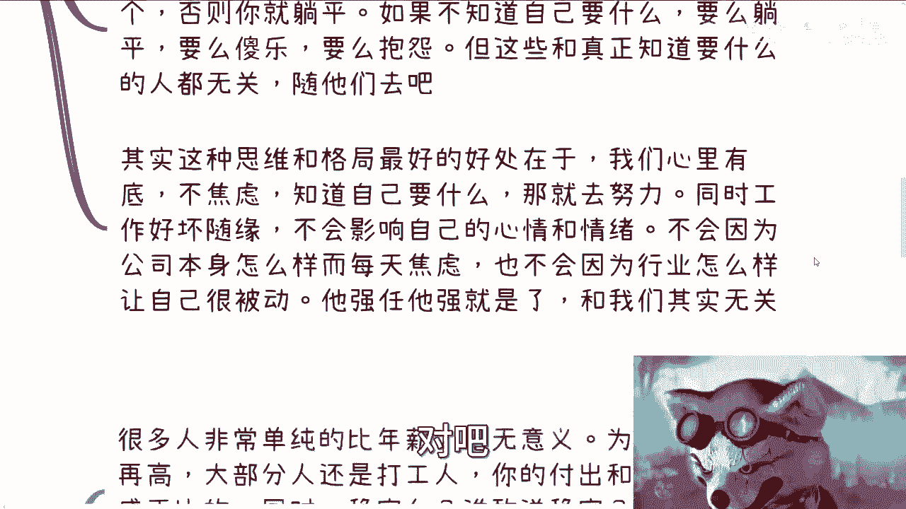

就是说当你知道你要做什么的时候，或者你对于自己的这个价值，有一个正确评估的时候，他强任他强呗，与我们有什么关系呢，对不对，那这就好像你可以现在做个电池，比如说你一个月就挣2万块钱，对吧。

但是你自我客观的评价，在你真正的了解行业调研完之后，你自我真正的评价，你觉得哎我做这个工作，我的能力，我的价值，我的一个case可能应该是50万到100万的对吧，那OK啊。

那你就朝着这方向目标努力嘛对吧，我不管你是狂妄自大还是别的，就这些不重要，因为很多东西你都是做的之后，慢慢做调整的对吧，但是你就要有一个格局放在这个地方，就是说OK我觉得我的能力不止这个薪资。

你要不愿意给我，OK我去找别人无所谓啊，对不对，我跟你讲，你你你其实会发现有的人啊，他就算是狂妄自大，他只要有这份自信，我相信他总能找得到比现在工资高的对吧，或者说他总能找得到那个让他能够实现自己。

这个这个价值的这个地方，我觉得没毛病啊，对吧，因为因为世界太大了，啊那么这是第二点。

第三点呢，你比如说什么叫赚钱，什么叫单位时间赚钱啊，你看啊，很多时很多人他单纯的去比年薪，这件事情没有意义，你知道吗，就评论区有很多人跟我说，哎这个考完研对吧，年薪二三十万蛮高的，有意思了，对不对。

我就问嘛，为什么没有意义，年薪再高，大部分人还是打工人，对不对，你的付出跟回报还是不成正比的，你20万30万，那从我角度来讲，你一个硕士，他妈的那个一干下来一年就值20万吗，就值30万吗。

你自己不觉得可笑吗，对不对啊，就而且同时我就问稳定吗，其实不稳定，谁敢说稳定对吧，你作为一个打工人，主动权都不在自己手上，哪来的稳定，对不对啊，好第二点，什么叫赚钱，各行各业。

所有的地方都有付出X或者Y的这么一个模式，对不对，好，那么这个时候X可能是多少，Y可能是多少，这个东西就是要你去了解的，你要去探索，你要去拓展，你要去深入了解，然后让身体有个概念才能明白什么叫赚钱。

什么叫差距对吧，我给你们随便举个例子啊，比如说，你是在高校当老师的对吧，你现在一个月是1万2啊，然后你一个月干30天，对不对好，然后我也告诉你一个概念，高效对吧，比如说你给你给高校做一个那个单子。

就是课程的单子也好，采购也好啊，包括项目创新项目也好，包括这个就是比如说学生一卡通啊，什么乱七八糟的东西也好啊，这种项目啊在我所认知的范围内啊，基本上我看到过的啊，整个创新项目一年一个项目。

单个项目往上报可以有2000多万，那3000多万我没看到过2000多万，有的对吧，那OK啊，那我就问怎么叫赚钱，对不对啊，然后对吧，同样的高校这边也有非常多的，就是我们说呃那个技能创新大赛竞赛。

还有就是人社部的职业竞赛，包括EGX的竞赛对吧，那么这些竞赛国家按照人头，包括高校按照人头补贴，你们可以想想看一个，如果啊我今天一个班是200个人，一个补贴，基本上按照省各中国各省市区的平均值。

差不多2000块钱到2500块钱，你们算算多少钱，对不对，那你可能今天赚不到这个钱，但是你得有概念，什么叫赚钱啊，不是说你不知道的就没有对吧，你就像你就像刚刚还有个还有个评论，很搞笑的，就是跟我说啊。

这个他觉得他身边的小伙伴啊过得都很好啊，也都找到工作，我就很搞笑，你身边人才占几个人啊，你才了解多少人啊，你才看到过多少东西啊是吧，你有什么资格下这个结论啊，没有的啊，啊我以前说过啊，流水是流水。

利润是利润到自己口袋里的，是到自己口袋里的，这每一个里面其实水分都很多啊，你别听到貌似好像一年流水过亿或者怎么样，就感觉离自己很遥远，其实不遥远，你知道吗，就其实本质上我们要去了解的是。

这个一个亿或者几个亿的，或者来说几10亿的这种商业的运作模式，我们可能没这个能力做，我们也可能没有这个机遇做，没关系啊，但是我们要去了解这个模式啊对吧，这个是我们要去学习的东西啊。

啊钱只不过是这个模式的一个结果，或者一个叫做可能性出现了一个结果，因为这个模式我们是值得学习的，但并不是说我们用这个模式都能赚到几十个亿，对吧，那你你举一反三，别的东西也是一样的哦。

你要去说因为这个钱或这个数字，我就拒绝了解这个商业模式上来就固定好，说这个东西跟我没什么关系，那你还怎么学习，对不对啊，你要知道更多的啊，就是说投入产出比高，我们称之为OI高的这么一个赚钱的方式。

只不过好我们现在自己可能还触及不到对吧，那么自然也就会明白，自己现在工作或者赚钱的方式，或者来说叫做打呃辛苦钱的方式，其实非常渺小的，而且是暂时的，你肯定不愿意一辈子这样子，对不对。

那么自然而然你了解更多之后，你就不会莫名其妙的去比较，也不会陷入一种拿工资，甚至是拿年薪什么去对比的，这种行为的圈子，你知道吗，就也不会去卷这个赛道，因为你知道这个赛道再怎么卷。

他都是很低的投入产出比对吧，你不会因为有的没的去焦虑，你只会因为你知道，当下自己根本还触及不到那个高度，所以你会不停的push自己，你会让自己去补充，在这个高投入产出比赚钱的道路上，还缺失的东西啊。

没有你就想慢慢补，去借，去学习。

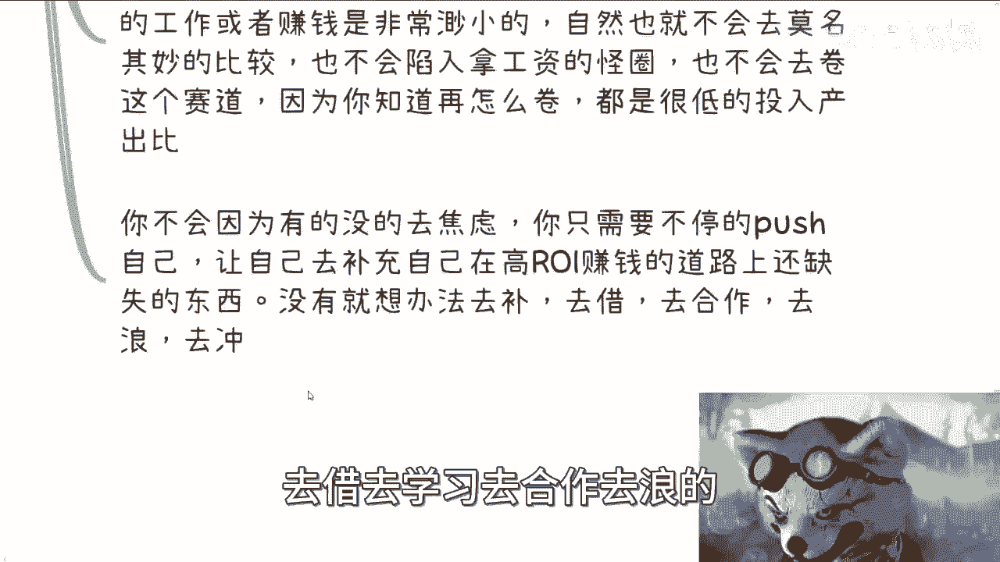

去合作，去浪的，这个就是我们要做的啊，那么第四点，再比如你要做的事情对吧啊，我们来看啊，乔布斯曾经说过啊，我们在做的事，所有的事情当中啊，我们得要让生活中，事业当中那些看起来不起眼。

或者说毫无关联的东西，你要有本事把它串起来，那当然这个当中我觉得分成两点，并不是说你真的有本事，把这些东西莫名其妙的喘气啊，而是说你在做每一个节点的时候，你就得去思考到。

我未来这个东西可能能帮助到我们什么都呃，在什么地方帮助到我们，我们可以做电池，我们也可以做点跟我们专业没有关系的事情，就比如说你们看我这个视频，可能跟你们的专业，或者跟你们是不是赚钱也一点毫无关系对吧。

但是我们得要去知道我们做每件事情，打每个工，看每个视频到底对我们帮助是什么对吧，你就好像我今天对吧，我可以免费的去给协会，或者给别的东西去打工啊，啊我可以去这么跪舔啊对吧，我可以去怎么样啊，没问题啊。

但是我得知道我能得到什么啊，并不是因为说奥运，因为对方牛逼啊，因为对方好像好像是协会啊，国家一级协会，我就是个农宝典对吧，我必须去跪舔这个因果关系是不成立的对吧，就是说你既然如果选择自己。

未来想要做这件事情啊，做一件事情，当下你可能做不了，但是你既然愿意或者说已经明白了，就是未来一定要手上有一些抗风险的东西，或者要拥有自己的一些事业的时候，那么你就一定要以你自己为主，你每件事情都要去。

就像打游戏一样，你每件事情都要有个EXP的增长，都要有经验的增长，你否则你做它干嘛呢，你说我们打打游戏，在那边这个这个你比如说已经十级了对吧，你在一个五级的怪野怪去那边刷刷刷刷了，你就算刷刷个一年。

你经验值也不长，有意味着没有意义的呀，对不了，那么我们得到了什么，我们提升了什么，对我们最终要达到的目标，或者过程当中的事情有什么帮助对吧，但未来有没有用得到，或者有没有可能带来些什么。

这个就是我们做所有事情要需求先去考虑的，所以说你会发现哦。

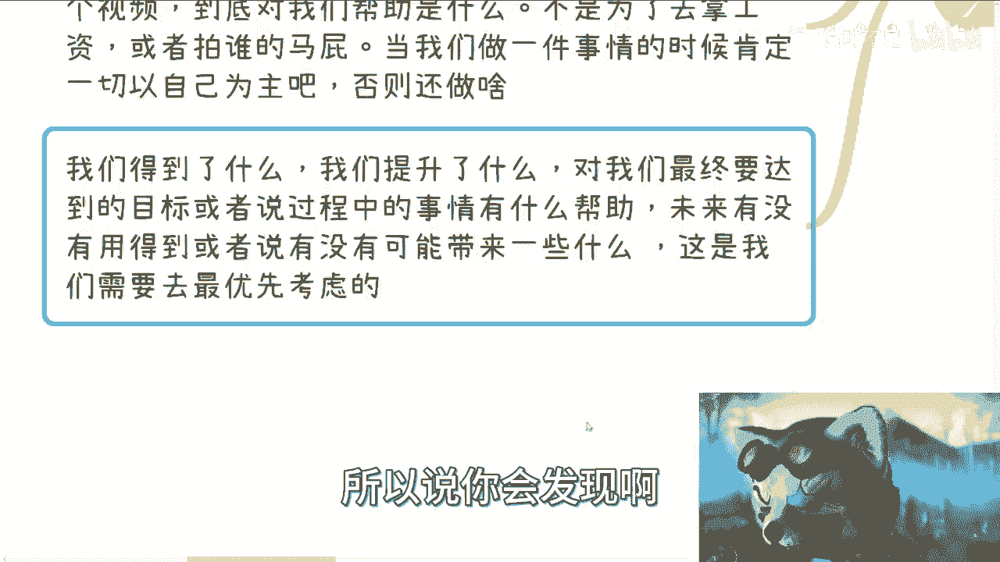

你反推出来一个点是什么，就是如果当你今天没有任何的成长，同时每个月就为了拿月薪的时候，你会发现你非常的焦虑，为什么，因为你没有成长。

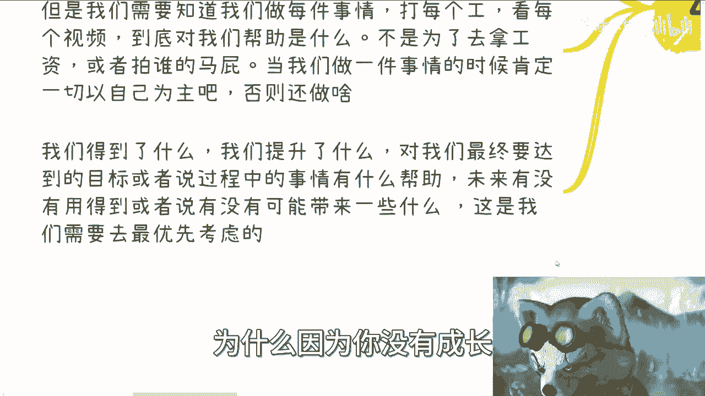

就这么简单啊，那么第五点啊。

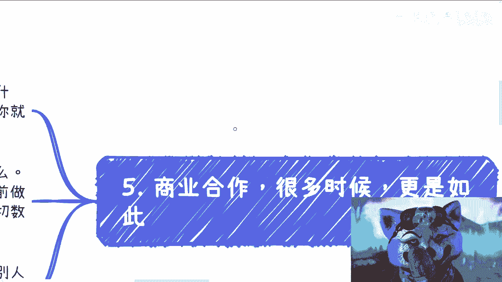

商业合作的时候呢，其实更加是如此。

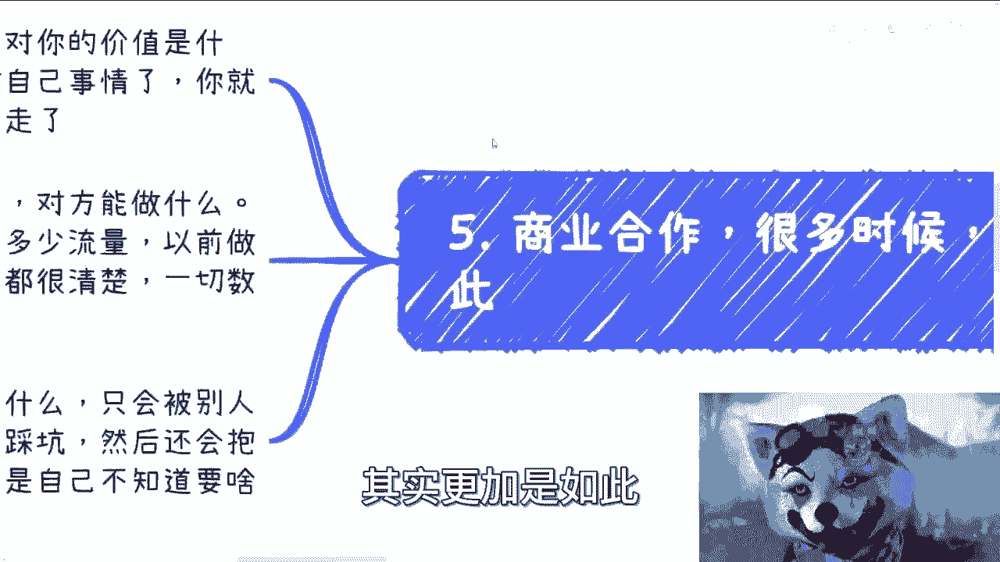

呃，你想啊，你想要你做一件事情，你要先想好自己，要明白你想要什么样的合作方，这个合作方对你的价值是什么对吧，你一旦想得清楚，你就会发现你的效率很高，因为不行就换了对吧，你都做你自己的事情了。

你就需要有自己的想法，你不要再跟着别人走了，你知道吗，你你会发现啊，比如说你要找和技术方对吧，那你就评估看成本，看对方能做什么，对方历史做过什么，你要找渠道房分销方，那你就看对方能带来多少流量。

以前做过什么案例，大概转化率有多少，你是甲方啊，你知道吗，就是在你的事业里面，你永远是甲方，不管你在业务链链路当中是不是乙方，这并不重要，但是你本身是跟大家是平等的对吧，这就很清楚。

因为这一切你要用数据说话，要用东西，要用真正的东西去说话啊，不再是那种就是说哎呀，因为对方比我牛逼对吧，因为对方赚钱比我多，因为对方好像年龄比我大不重要，你知道吗，一点都不重要。

你像我前两天跟那个那个私信小伙伴聊的时候。

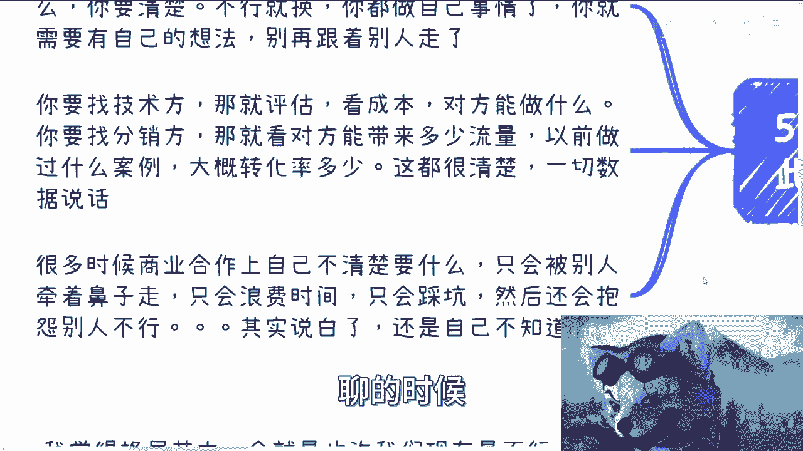

我就说的很清楚，对方是谁，我不关心你，就马云坐我对面，我也不关心，我只关心他能不能对我产生价值，我能不能对他产生价值哦，我们双方都无法对对方产生价值，那他妈对面你乔布斯，乔布斯坐我对面都没用啊。

你没有用啊，有什么用啊，对啊，这不是一样的道理吗，啊那很多时候商业合作上面我跟你讲啊，你一旦不清楚这就叫什么，你就你的沟通，你的这个各方面，你只会被别人牵着鼻子走，你说是吧，那你只会浪费时间，只会踩坑。

然后只会抱怨别人不行啊，那所以说其实说白了就是说，当你怨天尤人的时候，其实说白了就是我不是说你不行，而是说你可能就不知道自己要什么，而你也就是说就说呃没有这个自驱力，去让自己去去去思考自己要得到什么。

而当你不知道要什么的时候，你也没有觉得就说哎我应该多出去聊聊，多出去看看，然后摸索自己要什么，就没有这种想法的时候。

我是觉得就是要么就是PUA。

从小到大PUA的太严重，要么就是没有足够的野心啊，要么就是说，哎呀怎么说呢，就是，就是可能真的就是说其实其实你的你的，你的你的基因是想躺平的，但是你碍于就是不好意思对吧，又又又又又要稍微折腾一下。

就这种感觉啊，但是不管怎么样吧，我觉得就是说呃，就说知道世界上有很多赚钱的方式，知道大家在干什么啊，知道自己就是就是可能想去做成什么样子，是很有好处的，哪怕最终比如说我们一辈子都做不到那个样子。

也没关系，至少他让我们明白，有很多的事情并不是只有我们知道的那样，就是世界是很广阔的，那么这样的话就是说，无论我们面对任何的事情的时候，我们不会太焦虑，我们不会太着急，因为就是我一直说的那句话是什么。

就是当我们5年后回过头来看的时候，今天的一切都他妈是毛毛雨，你知道都是小case，当我们10年再回过头来看的时候，就一切都不值得一提，你知道吗，所以说第一个格局的点就在于说，一旦你站在了解的更多。

站在一个更高的高度去看，任何碰到一些紧急啊，或者碰到一些你没有接触过的事情的时候，你其实都不会太就是就是领悟，就是不会太慌乱或者太怎么样，因为你已经知道更高的一些东西，那可能眼前这些东西你虽然不懂啊。

但也就那样，就对你来讲就是说唉得之我幸，失之我命，对吧啊不对啊，对，就这个意思对吧，其实就就就这么回事，你也没什么好多想的啊，行吧哎呀，我觉得这一章啊我应该讲的蛮清楚的啊，后面234我再想想啊。

就是格局格局这个东西有多好讲好吧，反正就这么着吧啊有啥你们整理好，你觉得需要的话，你就私信我对吧，我们在走咨询啊，随性啊，随意随意嗯。

