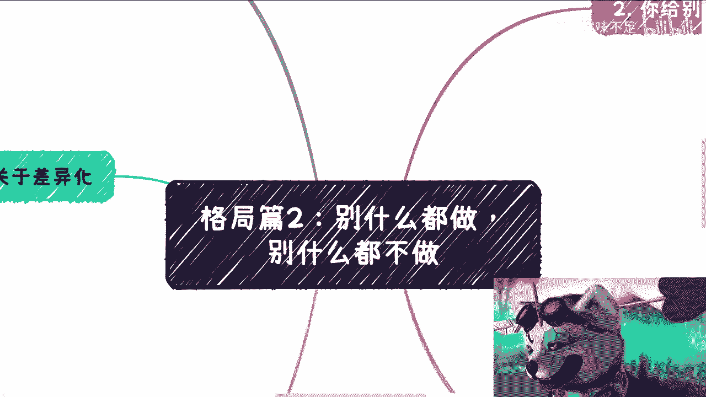
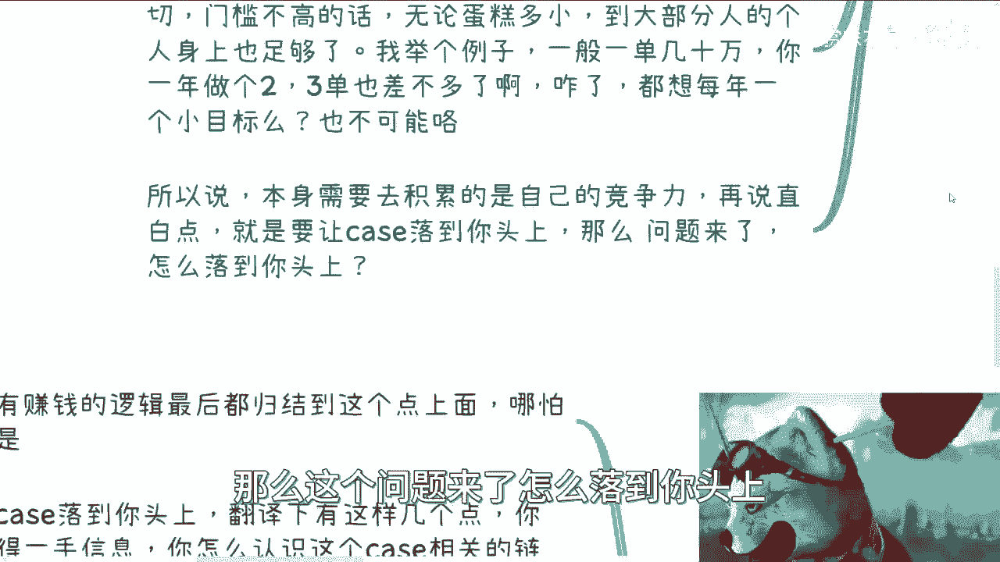
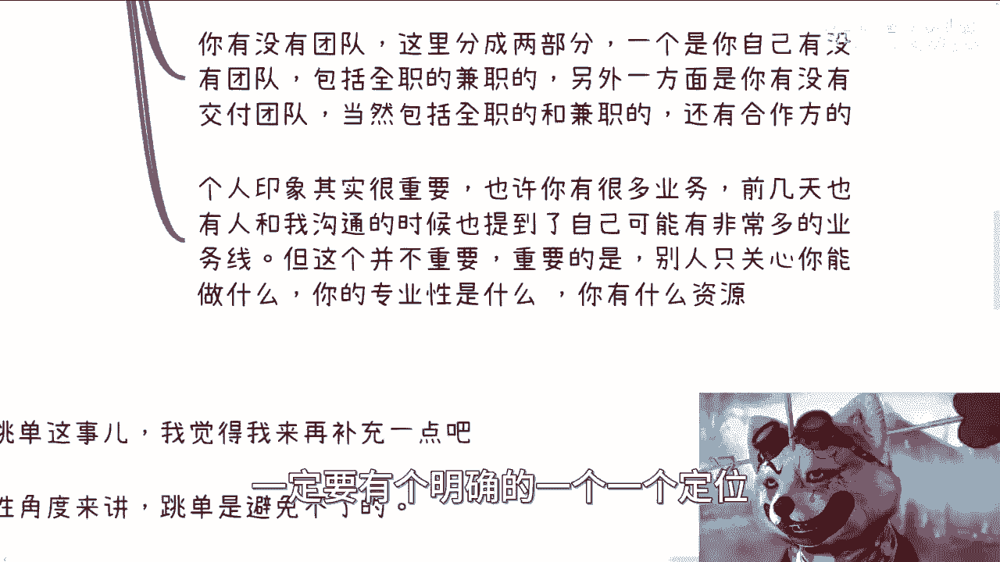
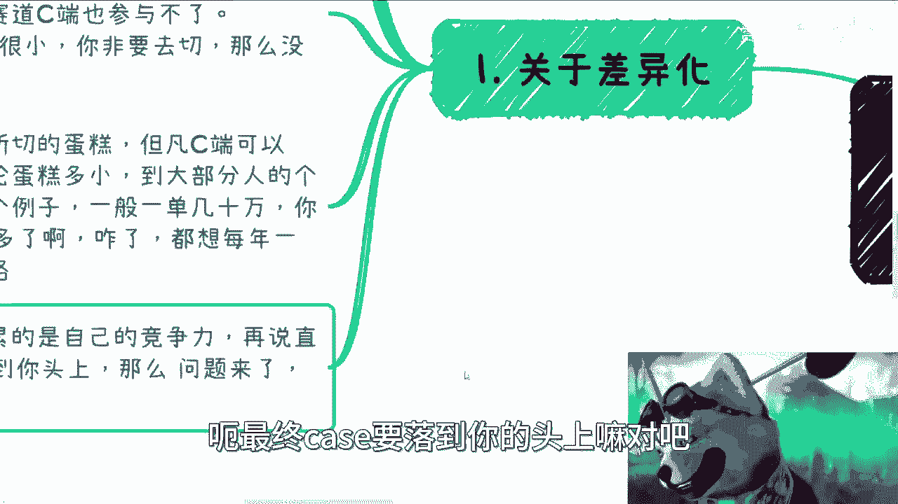
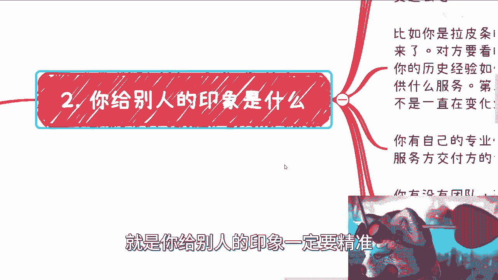
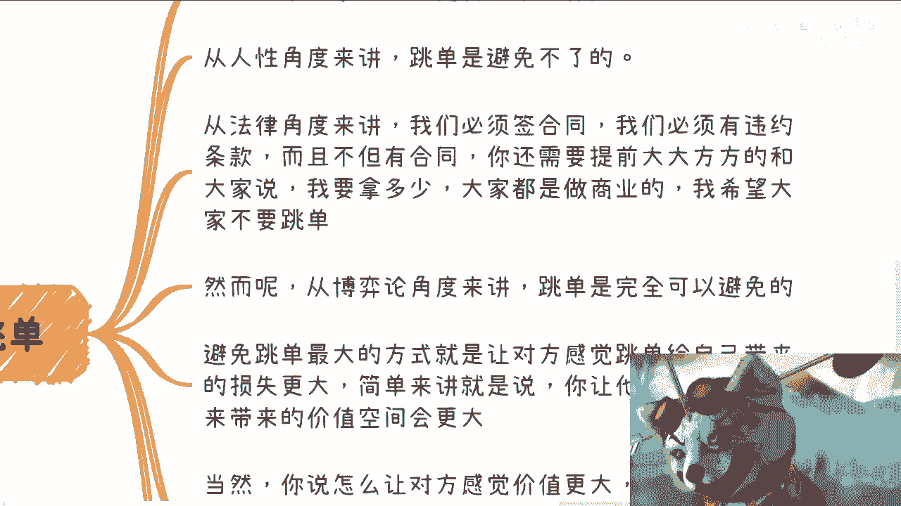
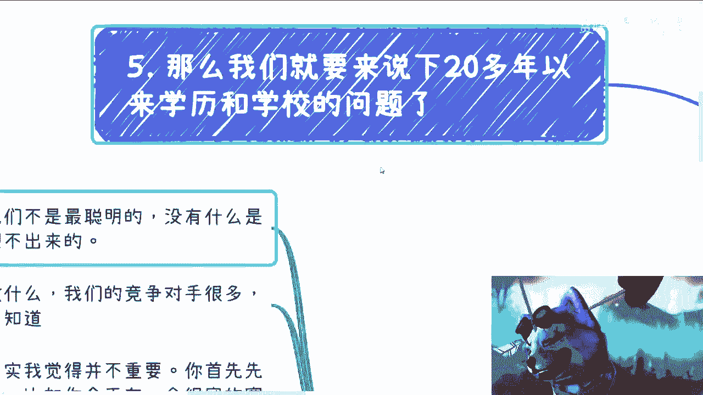
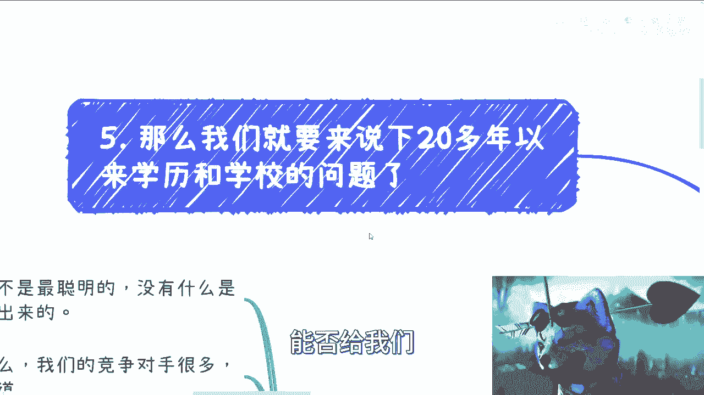
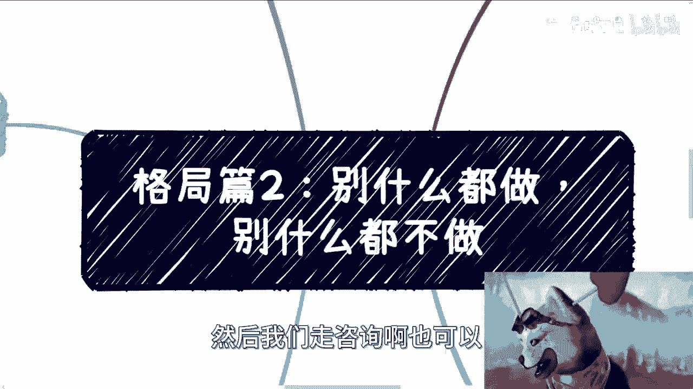

# 格局篇2：我们所做的一切都是为了更大概率的让有钱的单子和自己有关 📈


在本节课中，我们将要学习如何通过精准的自我定位和策略布局，来增加高价值商业机会（“有钱的单子”）与自己产生关联的概率。核心在于理解并塑造你在他人眼中的印象，从而在正确的赛道上竞争。

上一节我们介绍了格局的基本概念，本节中我们来看看如何将格局思维应用到具体的商业实践中。

## 一、你的目标决定了你的格局与上限 🎯

你对外宣称的目标或想做的事情，决定了别人对你格局和视野的判断。对方会从你提出的解决方案或想法中，评估你的视野有多广、格局有多高。





这并不意味着我们必须去做格局很高的事情，但在沟通中，需要让别人明白“我们知道”，避免给人留下认知局限的印象。


关于“割韭菜”的争议并不重要，重要的是布局的层次。不同的布局方式（如普通社群、高端俱乐部、背靠权威机构）决定了你的投入产出比、接触的人群以及最终的格局。

**核心公式：**
```
他人对你格局的认知 ≈ 你对外宣称的目标与解决方案
```

## 二、核心原则：别什么都做，也别什么都不做 ⚖️

在开始具体行动前，需要理解一个核心原则：保持专注与行动的平衡。



首先，我们必须时刻记住，自己并非最聪明或唯一聪明的人。任何你能想到的点子，别人也可能想到。在全球范围内，尤其是在中国市场，潜在的竞争对手非常多。


关于“差异化”策略，其重要性取决于目标市场的大小。如果你的目标市场（蛋糕）本身很小，且已被瓜分，那么差异化是生存的必需。但对于大多数普通人而言，我们能切入的、门槛不高的C端市场，其规模通常已足够个人发展。

例如，在商业中，一单利润十几万到几十万，一年做成几单，就是一个不错的起步。关键在于积累自己的核心竞争力。

**核心目标可以归结为一句话：让商业机会（Case）落到你的头上。**

## 三、如何让Case落到你头上：塑造精准的个人印象 🎭

你给他人的印象，直接决定了你在哪个赛道竞争。别人如何认知你，比你实际做什么更重要，因为商业机会来源于他人对你价值的认可。

以下是决定你印象的关键要素，按优先级排序：

1.  **你的身份标签**：别人首先记住的是你的关联主体（如公司）。如果你只被看作某个公司的员工，那你就是在“打工”赛道竞争。
2.  **历史案例与资源**：如果你是资源整合者（“拉皮条”），对方最关心你成功合作过的案例、具体的资源关系（需明确到部门/人物/合同），以及专注的领域。
3.  **团队实力**：对方会关心你是否有团队（全职/兼职），以及是否有可靠的交付团队或合作方。永远不要让人感觉你是“孤军奋战”。
4.  **个人专业性**：你的专业能力是价值的体现，但在商业撮合中，其优先级往往排在最后，除非你的专业度达到顶尖水平。

**关键点**：你可能有多项业务，但对外必须有一条清晰的主线，给人一个明确的定位（如专家型、资源型、解决方案提供者）。模糊的定位无法让人在需要时想起你。

## 四、应对跳单：从博弈中建立优势 🤝




从人性角度看，跳单难以完全避免，但可以通过策略降低其发生概率。





1.  **法律与沟通层面**：必须签署合同并明确违约条款。同时，要大方、提前地向合作各方说明自己的角色和佣金比例，做到信息透明。
2.  **博弈论层面**：防止跳单最有效的方式，是让对方觉得跳单带来的损失大于收益。你需要让对方深信，与你长期合作带来的未来价值远大于跳过你做一锤子买卖。这需要综合的控场、沟通和价值描绘能力。
3.  **借助力量**：如果个人能力不足，务必记住“一个好汉三个帮”。建立或依托团队的力量来增强自身的不可替代性和信任度。



## 五、系统化提升“接单”概率 🔗

让Case落到头上，可以拆解为以下几个环节，我们的所有努力都应围绕提升这些环节的概率：

以下是提升各个环节概率的方法论：


*   **获取一手信息**：建立并维护高质量的关系圈。
*   **认识产业链上的人**：主动拓展在相关产业链中的人脉。
*   **让人在需要时想到你**：通过清晰的个人定位和持续的PR、宣传、运营，强化你在他人心智中的印象。
*   **让人相信你能做**：展示与定位匹配的历史案例、资源和专业能力。
*   **让人放心交给你做**：综合运用以上所有点，建立可靠、专业的信任感。

**核心逻辑**：我们所做的一切，并非保证某个Case一定属于自己，而是**系统性地增加高价值Case与自己关联的总体概率**。

## 六、反思：传统教育 vs. 商业现实 🧑‍🏫


现在，让我们反思一下传统教育在这一点上的作用。





我们二十多年所受的教育，主要传授了知识和应试逻辑。但我们的学历和学校，本身并不能直接增加让Case落到头上的概率。因为社会上的机会提供者，并不会因为你的毕业院校而主动找到你。

然而，学历和学校可以作为**杠杆**。同样进入名校，有人只拿到一纸文凭（A），有人则懂得利用学校的牌子、学生会、导师等资源，为自己积累人脉和商业筹码（B）。B的做法实际上提升了其获得机会的概率。


但问题在于，我们的教育体系从未教授“如何成为B”，即如何利用现有平台进行商业社交和资源积累。这套至关重要的逻辑，需要我们在进入社会后自行摸索和学习。

## 总结 📝


本节课中我们一起学习了如何通过提升概率来获取商业机会。

1.  **定位清晰，格局要高**：明确你希望他人如何看待你，并以此指导你的对外形象塑造。
2.  **专注主线，持续营造**：无论内部尝试多少业务，对外传递的印象必须聚焦、清晰、一致。
3.  **系统提升关联概率**：从信息获取、人脉搭建、印象管理到信任建立，每个环节都需要精心设计和维护。
4.  **善用杠杆，弥补教育缺失**：有意识地利用一切现有资源（如学历、平台）作为跳板，去积累真正能带来机会的商业关系与能力。



最终，在他人眼中，你只是通讯录里的一个联系人。唯有清晰的定位和持续的价值展示，才能让你在机会出现时，被第一时间想起。